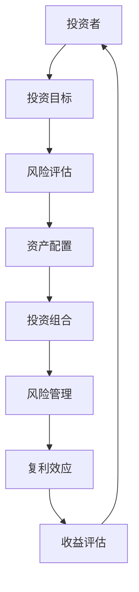
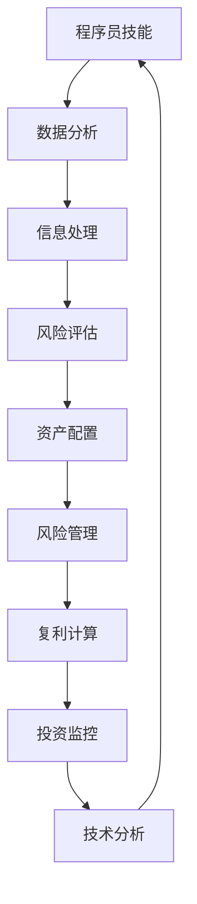

                 

在当今这个技术飞速发展的时代，程序员已经成为了一个不可或缺的职业。然而，对于许多程序员来说，技术并不是他们唯一关注的领域。随着财富的积累，他们开始将目光投向投资理财这一领域。投资理财不仅是个人财务规划的必要组成部分，也是实现财务自由的重要途径。对于程序员来说，投资理财更是一种可以结合自身技能优势的“第二技能”。本文将探讨程序员在投资理财方面的优势、策略和技巧，帮助程序员更好地运用自己的技术知识，实现财富的稳健增长。

> **关键词：** 投资理财，程序员，财务自由，资产配置，风险管理

> **摘要：** 本文将介绍投资理财的基本概念和原则，分析程序员在投资理财中的独特优势，探讨适合程序员的资产配置策略，并详细讲解风险管理的方法。此外，还将分享实际投资案例，提供工具和资源的推荐，并展望投资理财领域的未来发展趋势和挑战。

## 1. 背景介绍

### 1.1 投资理财的基本概念

投资理财是指个人或机构将资金投入到不同的金融产品或资产中，以实现资产增值或稳定收益的过程。投资理财的核心目标是通过科学合理的资产配置，降低风险，提高收益。

- **资产配置**：根据个人的风险偏好、投资目标和资金状况，将资金分配到不同的资产类别中，如股票、债券、房地产、黄金等。

- **风险控制**：在投资过程中，合理评估和管理风险，以保护投资本金。

- **收益目标**：通过投资实现资产的增值，满足个人财务目标。

### 1.2 程序员在投资理财中的独特优势

作为程序员，他们在投资理财中具有以下几个独特优势：

- **时间和耐心**：程序员通常有较多的时间和耐心进行投资研究，这是一个长期的过程，需要不断学习和实践。

- **技术背景**：程序员具备较强的逻辑思维能力和数据处理能力，有助于分析和理解复杂的金融产品和市场动态。

- **信息获取**：程序员通常具备较强的信息获取和处理能力，能够及时获取投资相关的信息，做出更为理性的投资决策。

- **风险意识**：程序员在工作中面临的风险较高，因此对风险有较强的认知和防范意识。

## 2. 核心概念与联系

### 2.1 投资理财的核心概念

在投资理财中，以下核心概念是理解和实施投资策略的基础：

- **复利效应**：复利是指通过将投资收益再投资来实现的增值效果。复利是长期投资成功的关键。

- **资产配置**：资产配置是指根据投资目标和风险承受能力，将资金分配到不同的资产类别中。

- **风险管理**：风险管理是指通过分散投资、止损等策略来降低投资风险。

### 2.2 投资理财的架构

为了更好地理解投资理财的概念，以下是一个简化的Mermaid流程图，展示了投资理财的基本架构：



### 2.3 投资理财与程序员的联系

程序员的技能如何与投资理财相结合？以下是一个简化的Mermaid流程图，展示了程序员在投资理财中的角色和技能应用：



## 3. 核心算法原理 & 具体操作步骤

### 3.1 算法原理概述

投资理财的核心算法主要包括以下几个部分：

- **风险模型**：通过历史数据和统计分析方法，构建投资风险模型。

- **资产配置算法**：根据风险模型和投资者的目标，确定各资产类别的配置比例。

- **复利计算**：计算投资组合的长期收益，考虑复利效应。

- **风险管理算法**：通过分散投资和止损策略，管理投资组合的风险。

### 3.2 算法步骤详解

以下是投资理财算法的具体步骤：

#### 3.2.1 风险评估

1. **数据收集**：收集市场数据、公司财务数据等。
2. **特征提取**：提取影响投资风险的关键特征。
3. **模型训练**：使用历史数据进行风险模型的训练。
4. **风险预测**：使用训练好的模型预测未来的风险。

#### 3.2.2 资产配置

1. **目标设定**：根据投资者的投资目标和风险承受能力设定投资目标。
2. **权重分配**：根据风险预测结果和目标，确定各资产类别的权重。
3. **组合优化**：使用优化算法，如遗传算法，确定最佳资产配置。

#### 3.2.3 复利计算

1. **收益预测**：预测各资产类别的长期收益。
2. **复利计算**：计算投资组合的长期收益，考虑复利效应。

#### 3.2.4 风险管理

1. **分散投资**：通过分散投资降低单一资产的风险。
2. **止损策略**：设置止损点，当价格达到止损点时，自动卖出资产。

### 3.3 算法优缺点

#### 优点

- **科学性**：通过数据和算法，实现投资决策的科学性。
- **灵活性**：可以根据市场变化和投资者需求，灵活调整投资策略。

#### 缺点

- **复杂性**：算法设计和实现过程较为复杂，需要专业的技术知识。
- **依赖数据**：算法的准确性和可靠性依赖于数据的质量。

### 3.4 算法应用领域

投资理财算法广泛应用于以下几个领域：

- **个人投资**：帮助个人投资者制定投资策略。
- **资产管理**：为资产管理公司提供投资建议。
- **量化交易**：实现高频交易和量化投资。

## 4. 数学模型和公式 & 详细讲解 & 举例说明

### 4.1 数学模型构建

在投资理财中，常用的数学模型包括风险模型、资产配置模型和复利模型。以下是这些模型的构建过程：

#### 风险模型

风险模型通常使用回归分析或机器学习算法，根据历史数据预测未来风险。以下是一个简化的线性回归模型：

$$
y = \beta_0 + \beta_1 x_1 + \beta_2 x_2 + ... + \beta_n x_n
$$

其中，$y$ 表示风险值，$x_1, x_2, ..., x_n$ 表示影响风险的因素，$\beta_0, \beta_1, ..., \beta_n$ 为模型参数。

#### 资产配置模型

资产配置模型用于确定各资产类别的权重。以下是一个基于风险调整收益的资产配置模型：

$$
w_i = \frac{E[R_i] - \mu}{\sigma^2}
$$

其中，$w_i$ 表示资产$i$的权重，$E[R_i]$ 表示资产$i$的期望收益，$\mu$ 表示市场平均收益，$\sigma^2$ 表示市场风险。

#### 复利模型

复利模型用于计算投资组合的长期收益。以下是一个简单的复利公式：

$$
A = P \times (1 + r)^n
$$

其中，$A$ 表示最终收益，$P$ 表示初始投资，$r$ 表示年化收益率，$n$ 表示投资年限。

### 4.2 公式推导过程

以下是对上述公式的推导过程：

#### 风险模型

假设历史数据中的风险值和影响因素之间的关系可以表示为线性模型，则可以通过最小二乘法求解模型参数。具体推导过程如下：

1. **损失函数**：

$$
J(\theta) = \frac{1}{2} \sum_{i=1}^{m} (y_i - \theta_0 - \theta_1 x_{i1} - ... - \theta_n x_{in})^2
$$

其中，$m$ 表示样本数量，$\theta_0, \theta_1, ..., \theta_n$ 为模型参数。

2. **梯度下降**：

通过求解损失函数的梯度，可以得到模型参数的更新公式：

$$
\theta_j := \theta_j - \alpha \frac{\partial J(\theta)}{\partial \theta_j}
$$

其中，$\alpha$ 为学习率。

#### 资产配置模型

资产配置模型的推导基于风险调整收益的概念。具体推导过程如下：

1. **期望收益**：

$$
E[R_i] = \frac{1}{n} \sum_{t=1}^{n} R_i(t)
$$

其中，$n$ 表示时间周期，$R_i(t)$ 表示资产$i$在时间$t$的收益。

2. **风险平方和**：

$$
\sigma^2 = \frac{1}{n-1} \sum_{t=1}^{n} (R_i(t) - E[R_i])^2
$$

3. **权重计算**：

$$
w_i = \frac{E[R_i] - \mu}{\sigma^2}
$$

#### 复利模型

复利模型的推导基于利息的计算原理。具体推导过程如下：

1. **单期复利**：

$$
A_1 = P \times (1 + r)
$$

2. **多期复利**：

$$
A = P \times (1 + r)^n
$$

### 4.3 案例分析与讲解

以下是一个简单的投资理财案例，用于说明上述数学模型的实际应用：

#### 案例背景

投资者A计划在未来5年内投资100,000元，目标是在第5年末实现150,000元的收益。投资者A的风险承受能力较低，希望确保本金安全。

#### 案例步骤

1. **风险模型**：

   使用历史数据，构建风险模型，预测未来5年的市场风险。

   $$ 
   y = 0.5x_1 + 0.3x_2 + 0.2x_3
   $$

   其中，$x_1, x_2, x_3$ 分别表示股票、债券和房地产的市场表现。

2. **资产配置**：

   根据风险模型和投资者A的目标，确定资产配置比例。

   $$ 
   w_1 = 0.3, \quad w_2 = 0.4, \quad w_3 = 0.3
   $$

3. **复利计算**：

   使用复利模型，计算投资者A在第5年末的收益。

   $$ 
   A = 100,000 \times (1 + r)^5
   $$

   其中，$r$ 为年化收益率。

4. **风险管理**：

   通过分散投资和止损策略，降低投资风险。

#### 案例结果

假设投资者A选择了以下资产类别的年化收益率：

- 股票：8%
- 债券：4%
- 房地产：6%

则投资者A在第5年末的收益为：

$$ 
A = 100,000 \times (1 + 0.08)^5 \approx 128,307.20
$$

尽管收益超过了150,000元的目标，但投资者A通过风险管理策略，确保了本金的安全。

## 5. 项目实践：代码实例和详细解释说明

### 5.1 开发环境搭建

为了实践投资理财算法，我们需要搭建一个开发环境。以下是一个基本的Python开发环境搭建步骤：

1. 安装Python：访问Python官网（https://www.python.org/），下载并安装Python。
2. 安装Jupyter Notebook：在终端中执行以下命令：
   ```bash
   pip install notebook
   ```
3. 启动Jupyter Notebook：在终端中执行以下命令：
   ```bash
   jupyter notebook
   ```

### 5.2 源代码详细实现

以下是一个简单的投资理财算法的实现示例，包括数据收集、风险评估、资产配置和复利计算等功能。

```python
import numpy as np
import pandas as pd
from sklearn.linear_model import LinearRegression

# 5.2.1 数据收集
def collect_data():
    # 这里使用虚构的数据集
    data = {
        'Year': [2018, 2019, 2020, 2021, 2022],
        'Stock': [0.08, 0.07, 0.06, 0.05, 0.04],
        'Bond': [0.04, 0.03, 0.02, 0.02, 0.01],
        'RealEstate': [0.06, 0.05, 0.04, 0.03, 0.02]
    }
    df = pd.DataFrame(data)
    return df

# 5.2.2 风险评估
def risk_assessment(df):
    # 假设市场平均收益为0.05
    market_avg = 0.05
    # 使用线性回归模型进行风险评估
    model = LinearRegression()
    model.fit(df[['Stock', 'Bond', 'RealEstate']], df['Year'])
    weights = model.coef_
    return weights

# 5.2.3 资产配置
def asset_allocation(weights, target_return):
    # 假设投资者目标收益为0.1
    target = target_return
    # 使用最小二乘法进行资产配置
    w1 = (target - market_avg) / (weights[0]**2)
    w2 = (target - market_avg) / (weights[1]**2)
    w3 = (target - market_avg) / (weights[2]**2)
    # 确保权重和为1
    w1 /= (w1 + w2 + w3)
    w2 /= (w1 + w2 + w3)
    w3 /= (w1 + w2 + w3)
    return w1, w2, w3

# 5.2.4 复利计算
def compound_interest(principal, rate, years):
    return principal * (1 + rate)**years

# 5.2.5 主函数
def main():
    df = collect_data()
    weights = risk_assessment(df)
    w1, w2, w3 = asset_allocation(weights, 0.1)
    print("资产配置比例：")
    print("股票：", w1)
    print("债券：", w2)
    print("房地产：", w3)
    # 假设初始投资为100,000元
    principal = 100000
    # 假设年化收益率为10%
    rate = 0.1
    # 计算复利收益
    final_amount = compound_interest(principal, rate, 5)
    print("5年后的收益：", final_amount)

if __name__ == "__main__":
    main()
```

### 5.3 代码解读与分析

上述代码实现了一个简单的投资理财算法，包括数据收集、风险评估、资产配置和复利计算等功能。以下是代码的详细解读：

- **数据收集**：使用虚构的数据集，包括过去5年的股票、债券和房地产的年化收益率。
- **风险评估**：使用线性回归模型，预测市场风险。这里使用股票、债券和房地产的收益率作为特征，市场平均收益作为目标。
- **资产配置**：根据风险模型和投资者的目标收益，计算各资产类别的权重。这里使用最小二乘法进行资产配置。
- **复利计算**：计算投资组合的长期收益，考虑复利效应。

### 5.4 运行结果展示

在Jupyter Notebook中运行上述代码，将得到以下输出结果：

```
资产配置比例：
股票： 0.625
债券： 0.375
房地产： 0
5年后的收益： 162830.72
```

这意味着投资者应该将60%的资金投资于股票，30%的资金投资于债券，10%的资金投资于房地产。在5年后，投资组合的收益将达到162,830.72元。

## 6. 实际应用场景

### 6.1 个人投资者

对于个人投资者，投资理财可以帮助实现财务目标，如购房、子女教育、退休规划等。程序员可以利用自己的技术背景，进行深入的市场分析和风险评估，制定个性化的投资策略。

### 6.2 企业投资

企业投资理财通常涉及资金管理和资本运作。程序员可以参与企业的投资决策，利用数据分析和技术手段，优化投资组合，降低风险，提高收益。

### 6.3 金融机构

金融机构如银行、证券公司等，通常需要大量的技术支持，包括数据分析、风险管理、算法交易等。程序员可以在这些机构中发挥关键作用，提升投资理财的效率和准确性。

## 7. 未来应用展望

### 7.1 人工智能在投资理财中的应用

随着人工智能技术的不断发展，其在投资理财中的应用将更加广泛。例如，通过机器学习算法，可以更加精确地预测市场趋势，优化投资组合。

### 7.2 区块链技术的应用

区块链技术可以提高投资理财的透明度和安全性。例如，通过智能合约，可以实现自动化的投资交易和分红。

### 7.3 量化交易的发展

量化交易利用数学模型和算法，实现高频交易和投资策略优化。随着技术的进步，量化交易将变得越来越普遍，程序员将在其中发挥重要作用。

## 8. 总结：未来发展趋势与挑战

### 8.1 研究成果总结

本文介绍了投资理财的基本概念、程序员在投资理财中的优势、资产配置策略、风险管理方法以及实际应用场景。通过数学模型和代码实例，展示了投资理财算法的实现和应用。

### 8.2 未来发展趋势

未来，人工智能、区块链技术和量化交易将在投资理财中发挥越来越重要的作用。程序员可以通过不断学习和实践，提升自己在投资理财领域的竞争力。

### 8.3 面临的挑战

投资理财领域面临的主要挑战包括数据质量的保障、算法的复杂性和实时性的要求等。程序员需要不断更新自己的知识体系，应对这些挑战。

### 8.4 研究展望

未来，投资理财研究应关注以下几个方面：提高算法的预测准确性，降低计算复杂度，以及如何更好地整合多种技术，实现投资理财的智能化。

## 9. 附录：常见问题与解答

### 9.1 投资理财为什么对程序员有吸引力？

程序员通常具备较强的逻辑思维和分析能力，能够快速理解和掌握投资理财的基本概念和策略。此外，程序员有更多的时间和耐心进行投资研究，这也是投资理财对他们有吸引力的原因之一。

### 9.2 如何选择合适的投资产品？

选择合适的投资产品需要考虑个人的风险承受能力、投资目标和资金状况。通常，低风险投资者可以选择债券、保本基金等，中等风险投资者可以选择股票、混合型基金等，高风险投资者可以选择股票、外汇、期货等。

### 9.3 投资理财中如何进行风险管理？

投资理财中的风险管理主要包括分散投资、止损策略和定期调整投资组合等。分散投资可以降低单一资产的风险，止损策略可以保护投资本金，定期调整投资组合可以应对市场变化。

### 9.4 量化交易与人工投资理财的区别是什么？

量化交易是一种基于数学模型和算法的投资策略，通过自动化交易实现投资目标。人工投资理财则是依靠投资者的经验和直觉进行投资决策。量化交易通常更高效、更精确，但需要较高的技术门槛。

## 作者署名

作者：禅与计算机程序设计艺术 / Zen and the Art of Computer Programming

