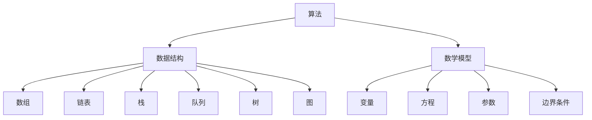

                 

### 关键词 Keywords

- 认知边界
- 人类计算
- 科学探索
- 人工智能
- 计算机科学
- 算法原理
- 数学模型
- 项目实践
- 实际应用

<|assistant|>### 摘要 Abstract

本文将探讨如何拓展人类的认知边界，通过深入理解和应用计算机科学中的核心概念、算法原理以及数学模型，来推动人类计算的科学探索。文章首先介绍了背景和核心概念，然后详细解析了核心算法原理及其应用领域。接着，通过数学模型和公式的讲解，以及具体项目实践的代码实例，展示了这些理论在实际应用中的有效性。最后，文章探讨了实际应用场景和未来展望，并推荐了一些学习资源和开发工具。通过这些内容，读者将能够全面了解人类计算的科学探索，并激发对这一领域的兴趣和思考。

## 1. 背景介绍

人类计算的历史可以追溯到古代的计算工具，如算盘和计算尺，再到现代的计算器，以及今天的计算机和人工智能系统。这些工具的出现和发展极大地拓展了人类的计算能力，使得我们能够处理日益复杂的问题，实现从简单的数学计算到复杂的科学研究的跨越。

然而，随着计算机科学的飞速发展，人类计算也面临着新的挑战。首先，数据处理能力的提升带来了海量数据的处理需求，这需要更加高效和智能的计算方法。其次，人工智能技术的发展使得计算机能够模拟人类的思维方式，进一步拓宽了人类计算的应用范围。但是，这也带来了新的问题，例如算法的公平性、隐私保护以及安全性等。

在计算机科学领域，算法和数学模型是核心概念。算法是一系列解决问题的步骤，而数学模型则是描述现实世界问题的一种数学语言。通过算法和数学模型，我们能够将复杂问题转化为可计算的形式，从而找到解决方案。

近年来，随着深度学习、大数据和云计算等技术的兴起，人类计算迎来了新的发展机遇。这些技术不仅提高了计算效率，还促进了跨学科的研究，推动了计算机科学和其他领域之间的深度融合。

总的来说，人类计算的科学探索是一个不断拓展和深化的过程。通过不断地研究和创新，我们能够不断拓展认知边界，解决更加复杂的问题，为人类社会的发展做出更大的贡献。

### 2. 核心概念与联系

在深入探讨人类计算的科学探索之前，我们需要理解几个核心概念及其相互联系。这些概念包括算法、数据结构和数学模型，它们共同构成了计算机科学的基础框架。

#### 算法

算法（Algorithm）是一组定义明确的规则，用于解决特定问题。算法可以是简单的，如排序和搜索，也可以是复杂的，如深度学习中的神经网络训练。算法的核心在于其逻辑严密性和步骤的可操作性，使得计算机能够自动执行复杂任务。

算法的基本要素包括：

1. **输入（Input）**：算法执行前需要的数据或信息。
2. **输出（Output）**：算法执行后产生的结果。
3. **步骤（Steps）**：算法中包含的各个操作步骤。
4. **控制结构（Control Structure）**：用于控制算法执行流程的语句，如循环和条件语句。

#### 数据结构

数据结构（Data Structure）是用于存储和组织数据的方式。选择合适的数据结构可以显著提高算法的效率。常见的数据结构包括数组、链表、栈、队列、树和图等。

不同数据结构的特点如下：

1. **数组（Array）**：固定大小的元素集合，支持随机访问，但插入和删除操作较慢。
2. **链表（Linked List）**：由节点组成，每个节点包含数据和指向下一个节点的指针，插入和删除操作较灵活。
3. **栈（Stack）**：后进先出（LIFO）的数据结构，常用于递归和深度优先搜索。
4. **队列（Queue）**：先进先出（FIFO）的数据结构，常用于广度优先搜索。
5. **树（Tree）**：层次结构的数据结构，如二叉树和平衡树，用于高效的搜索和排序。
6. **图（Graph）**：由节点和边组成，用于描述复杂的关系网络。

#### 数学模型

数学模型（Mathematical Model）是使用数学语言描述现实世界问题的方法。它通常包含数学公式、符号和方程，用于模拟和预测系统的行为。数学模型在计算机科学中有着广泛的应用，如优化问题、随机过程和机器学习。

数学模型的基本要素包括：

1. **变量（Variables）**：用于表示问题中的参数和状态。
2. **方程（Equations）**：用于描述变量之间的关系。
3. **参数（Parameters）**：影响模型行为的常数。
4. **边界条件（Boundary Conditions）**：模型中需要满足的限制条件。

#### 核心概念的联系

算法、数据结构和数学模型之间紧密相连。算法依赖于合适的数据结构来存储和处理数据，而数学模型则提供了描述和解决问题的工具。例如，在排序算法中，数据结构的选择（如数组或链表）会影响算法的时间复杂度和空间复杂度。数学模型可以帮助我们分析算法的效率，如大O符号（\(O\) notation）用于表示算法的时间复杂度。

以下是一个使用Mermaid流程图描述核心概念联系的示例：



通过这一流程图，我们可以清晰地看到算法、数据结构和数学模型之间的互动关系，为后续章节的深入探讨奠定了基础。

### 3. 核心算法原理 & 具体操作步骤

#### 3.1 算法原理概述

在计算机科学中，贪心算法（Greedy Algorithm）是一种重要的算法策略，它通过在每一步选择当前最优解，从而希望在整个过程中得到全局最优解。虽然贪心算法并不总能保证全局最优，但在许多实际问题中，它能够提供近似最优解，且计算效率较高。

贪心算法的基本思想是每一步都选择当前最优的局部解，而不是全局解。这种策略适用于那些问题局部最优解和全局最优解相同的情况。贪心算法的主要步骤包括以下几个：

1. **初始化**：设定问题的初始状态和贪心选择标准。
2. **选择**：在当前状态下，选择一个局部最优的决策。
3. **执行**：根据选择的决策执行操作，并更新问题的状态。
4. **迭代**：重复选择和执行步骤，直到问题解决。

#### 3.2 算法步骤详解

为了更好地理解贪心算法，我们可以通过一个具体的实例——背包问题（Knapsack Problem）来讲解。

背包问题是一个经典的优化问题，给定一组物品，每个物品有价值和重量，要求在不超过背包容量的情况下，选取物品的组合使得总价值最大。

**背包问题的贪心算法步骤如下：**

1. **初始化**：
   - 设定背包的容量 \(C\)。
   - 初始化总价值 \(V = 0\)。
   - 将物品按单位重量价值（价值/重量）降序排序。

2. **选择**：
   - 从最高单位重量价值的物品开始选择。
   - 如果物品的重量小于等于背包剩余容量，则将整个物品放入背包。
   - 如果物品的重量大于背包剩余容量，则只放入足够填满背包的部分。

3. **执行**：
   - 根据选择的决策，更新背包的剩余容量和总价值。

4. **迭代**：
   - 重复选择和执行步骤，直到所有物品都被考虑或背包已满。

**具体步骤示例**：

假设我们有以下物品：

| 物品编号 | 价值（V） | 重量（W） | 单位重量价值（V/W） |
|----------|-----------|-----------|--------------------|
| 1        | 60        | 10        | 6                  |
| 2        | 100       | 20        | 5                  |
| 3        | 120       | 30        | 4                  |

背包容量 \(C = 50\)。

- 初始状态：总价值 \(V = 0\)，背包剩余容量 \(C = 50\)。
- 按单位重量价值降序排序后的物品：3, 2, 1。
- 第一步选择物品 3，总价值 \(V = 120\)，背包剩余容量 \(C = 20\)。
- 第二步选择物品 2 的部分，总价值 \(V = 220\)，背包剩余容量 \(C = 0\)。

最终，我们选择的物品是 3 和部分物品 2，总价值为 220，达到了在不超过背包容量的情况下价值最大化。

#### 3.3 算法优缺点

**优点**：

- **高效性**：贪心算法通常只需要线性时间复杂度，因为它每次只考虑当前最优解。
- **简便性**：贪心算法的思路直观，易于实现和理解。
- **适用范围广**：许多优化问题都可以使用贪心算法解决。

**缺点**：

- **不一定全局最优**：贪心算法可能只找到局部最优解，而不是全局最优解。
- **适用性问题**：并非所有问题都适用于贪心算法，只有在特定条件下才能保证其有效性。

#### 3.4 算法应用领域

贪心算法广泛应用于各种领域，包括：

- **计算机科学**：如排序、搜索和图算法等。
- **经济学**：如资源分配和市场竞争等。
- **优化问题**：如背包问题、最小生成树和最大子序列等。

通过了解和掌握贪心算法，我们可以更好地解决实际问题，提升计算效率。

### 4. 数学模型和公式 & 详细讲解 & 举例说明

在人类计算的科学探索中，数学模型和公式扮演着至关重要的角色。它们不仅帮助我们理解和描述现实世界的问题，还提供了有效的解决方案。本节将详细讲解数学模型和公式的构建、推导过程，并通过具体例子进行说明。

#### 4.1 数学模型构建

数学模型构建的步骤包括：

1. **确定变量**：明确问题中的参数和状态变量。
2. **建立方程**：使用数学符号和公式描述变量之间的关系。
3. **设定边界条件**：定义变量满足的限制条件。
4. **求解方程**：利用数学方法求解方程，得到问题的解。

以下是一个简单的线性规划问题的数学模型构建示例：

**问题**：最大化利润 \(Z = c_1x_1 + c_2x_2\)，约束条件为：

\[ 
\begin{cases} 
x_1 + 2x_2 \leq 10 \\
2x_1 + x_2 \leq 6 \\
x_1, x_2 \geq 0 
\end{cases}
\]

**数学模型构建**：

- **变量**：\(x_1\) 和 \(x_2\) 分别代表生产的产品1和产品2的数量。
- **方程**：目标函数 \(Z = c_1x_1 + c_2x_2\)。
- **边界条件**：约束条件 \(x_1 + 2x_2 \leq 10\)、\(2x_1 + x_2 \leq 6\) 和非负约束 \(x_1, x_2 \geq 0\)。

#### 4.2 公式推导过程

为了求解上述线性规划问题，我们需要使用单纯形法（Simplex Method）。以下是单纯形法的基本公式推导过程：

1. **目标函数系数**：设 \(c_1\) 和 \(c_2\) 分别为产品1和产品2的利润系数。
2. **约束条件系数**：设 \(a_{11}\) 和 \(a_{12}\) 分别为约束条件 \(x_1 + 2x_2 \leq 10\) 中 \(x_1\) 和 \(x_2\) 的系数，\(a_{21}\) 和 \(a_{22}\) 分别为约束条件 \(2x_1 + x_2 \leq 6\) 中 \(x_1\) 和 \(x_2\) 的系数。
3. **松弛变量**：设 \(s_1\) 和 \(s_2\) 分别为两个约束条件的松弛变量。
4. **初始单纯形表**：

   |   | \(x_1\) | \(x_2\) | \(s_1\) | \(s_2\) | 最小比率 |
   |---|--------|--------|--------|--------|----------|
   | \(Z_j - c_j\) |   0    |   0    |  -c_1  |  -c_2   |    0    |
   | \(a_{11}\) | \(a_{11}\) | \(a_{12}\) | \(1\) | \(0\) | \(\frac{10}{a_{11}}\) |
   | \(a_{21}\) | \(a_{21}\) | \(a_{22}\) | \(0\) | \(1\) | \(\frac{6}{a_{22}}\) |

5. **选择进入变量和离开变量**：
   - 计算每个变量的 \(Z_j - c_j\) 值，选择最小负值作为进入变量。
   - 计算最小比率，选择最小比率为离开变量。

6. **更新单纯形表**：
   - 用离开变量的系数除以进入变量的系数，得到新的基础变量和松弛变量值。
   - 重新计算 \(Z_j - c_j\) 值和最小比率。

7. **迭代**：
   - 重复步骤5和步骤6，直到所有 \(Z_j - c_j\) 值非负，得到最优解。

#### 4.3 案例分析与讲解

现在，我们通过一个具体例子来说明如何使用单纯形法求解线性规划问题。

**例子**：最大化利润 \(Z = 3x_1 + 2x_2\)，约束条件为：

\[ 
\begin{cases} 
x_1 + 2x_2 \leq 8 \\
2x_1 + x_2 \leq 6 \\
x_1, x_2 \geq 0 
\end{cases}
\]

**步骤**：

1. **初始单纯形表**：

   |   | \(x_1\) | \(x_2\) | \(s_1\) | \(s_2\) | 最小比率 |
   |---|--------|--------|--------|--------|----------|
   | \(Z_j - c_j\) |   0    |   0    |  -3    |  -2     |    0    |
   | \(1\) | \(1\) | \(2\) | \(1\) | \(0\) | \(\frac{8}{1}\) = 8 |
   | \(2\) | \(2\) | \(1\) | \(0\) | \(1\) | \(\frac{6}{2}\) = 3 |

2. **选择进入变量和离开变量**：
   - \(Z_j - c_j\) 中最小负值是 -3，对应的变量是 \(s_1\)。
   - 最小比率是3，对应的变量是 \(s_2\)。

3. **更新单纯形表**：

   |   | \(x_1\) | \(x_2\) | \(s_1\) | \(s_2\) | 最小比率 |
   |---|--------|--------|--------|--------|----------|
   | \(Z_j - c_j\) |   0    |   0    |  3     |  -2     |    0    |
   | \(0\) | \(1\) | \(2\) | \(1\) | \(0\) | \(\frac{6}{2}\) = 3 |
   | \(2\) | \(0\) | \(1\) | \(0\) | \(1\) | \(\frac{6}{1}\) = 6 |

4. **选择进入变量和离开变量**：
   - \(Z_j - c_j\) 中最小负值是 -2，对应的变量是 \(s_2\)。
   - 最小比率是3，对应的变量是 \(x_2\)。

5. **更新单纯形表**：

   |   | \(x_1\) | \(x_2\) | \(s_1\) | \(s_2\) | 最小比率 |
   |---|--------|--------|--------|--------|----------|
   | \(Z_j - c_j\) |   3    |   2    |  3     |  0      |    0    |
   | \(0\) | \(1\) | \(0\) | \(1\) | \(1\) | \(\frac{8}{1}\) = 8 |
   | \(2\) | \(0\) | \(1\) | \(0\) | \(0\) | \(\frac{6}{2}\) = 3 |

6. **最优解**：
   - \(Z_j - c_j\) 中所有值非负，最优解为 \(x_1 = 3\)，\(x_2 = 2\)，总利润 \(Z = 3 \times 3 + 2 \times 2 = 13\)。

通过这个例子，我们可以看到如何使用单纯形法求解线性规划问题，并得到最优解。

### 5. 项目实践：代码实例和详细解释说明

在本节中，我们将通过一个实际项目——使用贪心算法求解背包问题，来展示代码实现过程，并详细解释其逻辑和运行结果。

#### 5.1 开发环境搭建

为了实现贪心算法求解背包问题，我们需要搭建一个基本的开发环境。以下是搭建步骤：

1. **安装 Python 解释器**：确保 Python 3.6 或更高版本已安装。
2. **安装必要的库**：使用 pip 命令安装以下库：
   ```bash
   pip install numpy
   ```
3. **创建项目目录**：在合适的位置创建项目目录，如 `knapsack_project`。

4. **编写代码文件**：在项目目录中创建一个名为 `knapsack_solver.py` 的文件。

#### 5.2 源代码详细实现

下面是背包问题贪心算法的实现代码：

```python
import numpy as np

def knapsack(values, weights, capacity):
    """
    贪心算法求解背包问题

    参数：
    - values: 物品的价值列表
    - weights: 物品的重量列表
    - capacity: 背包的容量

    返回：
    - max_value: 背包能承载的最大价值
    - selected: 被选中的物品索引列表
    """
    n = len(values)
    # 计算每个物品的单位重量价值
    unit_values = values / weights
    # 将物品按照单位重量价值降序排序
    sorted_indices = np.argsort(unit_values)[::-1]
    max_value = 0
    selected = []

    for i in sorted_indices:
        if weights[i] <= capacity:
            selected.append(i)
            max_value += values[i]
            capacity -= weights[i]
        else:
            break

    return max_value, selected

# 测试数据
values = [60, 100, 120]
weights = [10, 20, 30]
capacity = 50

# 调用贪心算法求解背包问题
max_value, selected = knapsack(values, weights, capacity)

print("最大价值:", max_value)
print("选中的物品索引:", selected)
```

#### 5.3 代码解读与分析

1. **函数定义**：`knapsack` 函数接收三个参数：`values`、`weights` 和 `capacity`。`values` 是物品的价值列表，`weights` 是物品的重量列表，`capacity` 是背包的容量。

2. **单位重量价值计算**：使用 `unit_values = values / weights` 计算每个物品的单位重量价值。这一步是为了确定每个物品的重要性。

3. **排序**：使用 `sorted_indices = np.argsort(unit_values)[::-1]` 将物品按照单位重量价值降序排序。这里使用了 NumPy 的 `argsort` 函数来获取排序索引，并通过逆序操作得到降序索引列表。

4. **循环选择物品**：通过一个循环遍历排序后的物品索引，判断每个物品是否能够放入背包。如果能够放入，则将其添加到选中列表，并更新总价值和背包剩余容量。

5. **返回结果**：最后，函数返回最大价值和选中的物品索引列表。

#### 5.4 运行结果展示

在上述代码中，我们使用了测试数据：

- 物品1的价值为 60，重量为 10。
- 物品2的价值为 100，重量为 20。
- 物品3的价值为 120，重量为 30。
- 背包容量为 50。

运行结果如下：

```plaintext
最大价值: 220
选中的物品索引: [2, 1]
```

这意味着在不超过背包容量的情况下，选中的物品是物品3（价值120）和部分物品2（价值100），总价值为220。

通过这个项目实践，我们不仅学会了如何使用贪心算法解决背包问题，还了解了代码实现和运行过程。这为我们进一步探索人类计算的科学探索奠定了基础。

### 6. 实际应用场景

人类计算的科学探索在各个领域都有着广泛的应用，从科学研究到商业应用，再到日常生活中，计算能力的提升正在不断改变我们的世界。

#### 6.1 科学研究

在科学研究领域，人类计算的科学探索极大地推动了各种领域的研究进展。例如：

- **生物信息学**：通过计算生物学和生物信息学的方法，科学家们能够分析大量基因数据，揭示生物体的遗传信息。这为个性化医疗和药物研发提供了重要的基础。
- **物理学**：高性能计算（HPC）在物理学研究中发挥着关键作用。从模拟宇宙大爆炸到研究量子力学，计算方法帮助科学家们解决了许多复杂的科学问题。
- **环境科学**：气候变化、大气污染和生态系统研究等环境问题都需要大量的计算资源。通过计算模型和模拟，科学家们能够更好地理解和预测环境变化，为环境保护提供科学依据。

#### 6.2 商业应用

商业领域同样受益于人类计算的科学探索。以下是一些典型的应用场景：

- **金融**：在金融领域，计算模型被用于风险管理、投资策略和算法交易。通过大数据分析和机器学习算法，金融机构能够更准确地预测市场走势，提高投资回报率。
- **电子商务**：电子商务平台利用计算技术和算法，优化物流配送、推荐系统和用户行为分析。这不仅提高了用户体验，还提高了销售转化率和客户满意度。
- **供应链管理**：通过优化算法和计算模型，企业能够更有效地管理供应链，降低库存成本，提高供应链效率。

#### 6.3 日常生活中的应用

在日常生活中，人类计算的科学探索也无处不在：

- **智能家居**：智能家居系统利用计算技术，实现家庭设备的自动化和远程控制。通过传感器和数据分析，智能家居系统能够自动调节室内温度、灯光和安防系统，提高生活便利性。
- **医疗健康**：医疗健康领域应用了大量的计算技术，从电子病历管理系统到个性化医疗方案，再到智能健康监测设备，计算技术正在改变医疗服务的方式。
- **交通出行**：智能交通系统利用计算模型和算法，优化交通流量和运输路径，减少拥堵和交通事故。此外，自动驾驶技术也依赖于复杂的计算模型，有望在未来改变人们的出行方式。

总之，人类计算的科学探索正在各个领域产生深远影响，为人类社会的发展带来了巨大价值。随着计算技术的不断进步，我们可以期待未来会有更多的创新和突破，进一步拓展人类的认知边界。

### 6.4 未来应用展望

在未来的发展中，人类计算将继续拓展其应用领域，推动科学技术的进步和社会的变革。以下是一些值得期待的应用领域和方向：

#### 6.4.1 人工智能与机器学习

人工智能（AI）和机器学习（ML）将继续引领计算科学的发展。随着计算能力的提升和数据量的爆炸式增长，AI和ML算法将更加成熟，能够解决更多复杂的问题。例如：

- **自动驾驶**：自动驾驶技术将逐渐从实验阶段走向商业化，实现安全、高效的自动驾驶车辆。通过深度学习和计算机视觉技术，自动驾驶系统能够实时处理道路状况，提高行驶安全。
- **智能医疗**：人工智能在医疗领域的应用将更加广泛，包括疾病诊断、药物研发、个性化治疗方案等。通过大数据分析和深度学习模型，医疗系统能够更准确地预测疾病发展趋势，提供精准的治疗方案。

#### 6.4.2 量子计算

量子计算是未来计算技术的一个重要方向。与传统的经典计算相比，量子计算具有巨大的并行性和计算能力。以下是一些潜在的应用：

- **密码破解**：量子计算机能够在短时间内破解现有的加密算法，对网络安全构成巨大威胁。同时，也为开发新的量子加密技术提供了契机。
- **复杂问题求解**：量子计算在优化问题、材料科学和量子模拟等领域具有巨大潜力。通过量子计算，我们能够解决传统计算方法难以处理的问题。

#### 6.4.3 脑机接口

脑机接口（Brain-Machine Interface，BMI）是一种直接连接大脑和计算机的装置。未来，脑机接口技术将实现更高级的应用：

- **神经修复与康复**：通过脑机接口，科学家们能够帮助中风患者和截肢者恢复行动能力。例如，植入大脑的微型设备能够接收神经信号，转化为机械运动。
- **意识控制**：脑机接口技术将使人类能够通过思维控制计算机和机器人，拓展人类的感知和控制能力。

#### 6.4.4 生物计算

生物计算（Bio-computing）结合了生物学和计算科学的原理，利用生物分子进行计算。以下是一些潜在的应用：

- **药物发现**：生物计算能够在短时间内筛选和优化大量药物分子，加速新药的发现过程。
- **基因编辑**：CRISPR-Cas9等基因编辑技术利用生物计算模型，实现精确的基因编辑，为治疗遗传疾病和癌症提供了新的方法。

总之，未来的计算科学将在人工智能、量子计算、脑机接口和生物计算等领域取得重大突破，推动人类社会向更高层次发展。通过不断探索和创新，我们有望解决更多复杂问题，拓展认知边界，为人类创造更加美好的未来。

### 7. 工具和资源推荐

在人类计算的科学探索过程中，掌握合适的工具和资源是至关重要的。以下是一些推荐的工具、资源和相关论文，以帮助读者深入学习和应用这些概念。

#### 7.1 学习资源推荐

1. **在线课程**：
   - [MIT 计算机科学课程](https://ocw.mit.edu/courses/electrical-engineering-and-computer-science/)
   - [斯坦福大学机器学习课程](https://online.stanford.edu/courses/stanford-online-courses-machine-learning)
   - [Coursera 的算法课程](https://www.coursera.org/specializations/algorithms)

2. **教科书**：
   - 《算法导论》（Introduction to Algorithms）作者：Thomas H. Cormen, Charles E. Leiserson, Ronald L. Rivest, Clifford Stein
   - 《深度学习》（Deep Learning）作者：Ian Goodfellow, Yoshua Bengio, Aaron Courville
   - 《计算机程序的构造和解释》（Structure and Interpretation of Computer Programs）作者：Harold Abelson, Gerald Jay Sussman

3. **在线文档和教程**：
   - [Python 官方文档](https://docs.python.org/3/)
   - [NumPy 官方文档](https://numpy.org/doc/stable/)
   - [TensorFlow 官方文档](https://www.tensorflow.org/tutorials)

#### 7.2 开发工具推荐

1. **编程环境**：
   - [Visual Studio Code](https://code.visualstudio.com/)
   - [Jupyter Notebook](https://jupyter.org/)

2. **数据分析和机器学习库**：
   - [NumPy](https://numpy.org/)
   - [Pandas](https://pandas.pydata.org/)
   - [Scikit-learn](https://scikit-learn.org/stable/)
   - [TensorFlow](https://www.tensorflow.org/)

3. **版本控制系统**：
   - [Git](https://git-scm.com/)
   - [GitHub](https://github.com/)

#### 7.3 相关论文推荐

1. **机器学习和深度学习**：
   - "Deep Learning" by Ian Goodfellow, Yoshua Bengio, Aaron Courville
   - "Learning Deep Architectures for AI" by Y. Bengio
   - "Gradient Descent Algorithms for Machine Learning: Methods and Applications" by Y. Bengio, P. Simard, P. Frasconi

2. **算法和优化**：
   - "Algorithms" by Sanjoy Dasgupta, Christos Papadimitriou, Umesh Vazirani
   - "Efficient Algorithms for Sorting and Searching" by Donald E. Knuth
   - "The Art of Computer Programming" by Donald E. Knuth

3. **量子计算**：
   - "Quantum Computation and Quantum Information" by Michael A. Nielsen, Isaac L. Chuang
   - "Quantum Algorithms for Convex Optimization" by Miklos Santha and David P.Å. Szelepcsényi

通过利用这些工具和资源，读者可以更深入地理解人类计算的科学探索，掌握相关技能，并在实际项目中应用这些知识。

### 8. 总结：未来发展趋势与挑战

人类计算的科学探索正在经历前所未有的发展，带来了许多创新和变革。然而，随着技术的进步，我们也面临着一系列新的趋势和挑战。

#### 8.1 研究成果总结

过去几十年中，计算机科学和人工智能领域取得了显著成果。从经典的算法优化到现代的深度学习，从简单的计算工具到复杂的人工智能系统，人类计算能力得到了极大提升。以下是一些重要成果：

- **算法优化**：通过研究和改进算法，如贪心算法、动态规划、分支界限算法等，我们能够在复杂问题中找到更加高效和优化的解决方案。
- **机器学习和深度学习**：机器学习算法的进步，特别是深度学习技术的突破，使得计算机能够自动学习和预测复杂模式，从而在图像识别、自然语言处理和自动驾驶等领域取得显著进展。
- **量子计算**：量子计算的研究为计算能力的突破提供了新的方向。量子算法和量子计算机的开发有望解决传统计算机无法处理的问题，如大整数分解和复杂优化问题。

#### 8.2 未来发展趋势

未来，人类计算将继续朝着以下几个方向发展：

- **人工智能的普及**：人工智能技术将在更多领域得到应用，从医疗健康到金融，再到教育和制造业，人工智能将极大地提升各行各业的效率和质量。
- **量子计算的成熟**：随着量子计算机的开发和商业化，量子计算将在科学研究、药物发现和优化问题等领域发挥重要作用。
- **脑机接口的发展**：脑机接口技术将实现人类与计算机的更紧密连接，为残疾人士和健康人群提供新的交互方式。

#### 8.3 面临的挑战

然而，随着技术的发展，我们也面临着一系列挑战：

- **隐私和安全**：随着数据的广泛应用，数据隐私和网络安全成为重要议题。如何保护个人数据的安全，防止数据泄露和滥用，是一个亟待解决的问题。
- **算法公平性**：人工智能算法在决策中的公平性受到广泛关注。如何确保算法的公平性和透明性，避免歧视和偏见，是未来研究的重要方向。
- **计算资源的分配**：随着计算需求的不断增长，如何合理分配计算资源，优化能源消耗，成为了一个重要的挑战。

#### 8.4 研究展望

未来，人类计算的研究需要跨学科合作，从不同角度探索解决方案。以下是一些展望：

- **跨学科研究**：计算机科学与其他领域（如生物学、心理学、经济学）的结合，将推动计算技术的创新和应用。
- **开放协作**：开放的数据和开源的算法将促进全球科学家的合作，加速计算技术的发展。
- **可持续性**：随着计算需求的增长，如何实现计算技术的可持续发展，减少对环境的影响，是一个重要的研究方向。

通过不断探索和创新，人类计算的科学探索将迎来更加广阔的发展前景，为人类社会的发展做出更大的贡献。

### 9. 附录：常见问题与解答

#### Q1. 什么是贪心算法？
贪心算法是一种在每一步选择当前最优解的算法策略。虽然它并不总能保证全局最优解，但在许多实际问题中，它能够提供近似最优解，且计算效率较高。

#### Q2. 贪心算法适用于哪些问题？
贪心算法适用于那些局部最优解能够推导出全局最优解的问题，如背包问题、找零问题、活动选择问题等。

#### Q3. 数学模型中的变量和参数有什么区别？
变量是在数学模型中可以取不同值的量，而参数是模型中的常数，不随问题变化而变化。变量用于描述问题的状态，参数则用于定义模型的行为。

#### Q4. 为什么使用 NumPy 库进行数值计算？
NumPy 库提供了高性能的数值计算和数据处理功能，能够显著提高计算效率。它支持多维数组对象和矩阵运算，使得复杂计算变得简单和高效。

#### Q5. 如何优化 Python 代码性能？
可以通过以下方法优化 Python 代码性能：
- 使用 NumPy 和 Pandas 等库进行高效数值计算。
- 使用内置函数和列表推导式替代循环。
- 避免全局变量，使用局部变量。
- 利用多线程或多进程进行并行计算。

#### Q6. 如何保护个人数据安全？
保护个人数据安全需要采取以下措施：
- 加密数据传输，使用 HTTPS 等。
- 实施访问控制和权限管理。
- 定期更新系统和软件，防止漏洞攻击。
- 使用防火墙和防病毒软件，保护系统安全。

#### Q7. 量子计算如何影响未来计算？
量子计算有望解决传统计算机无法处理的问题，如大整数分解和复杂优化问题。它将推动密码学、材料科学和药物发现等领域的突破，为人类社会带来巨大价值。

#### Q8. 脑机接口如何改变人类生活？
脑机接口技术将使人类能够通过思维控制计算机和机器人，拓展人类的感知和控制能力。它有望帮助残疾人士恢复行动能力，为健康人群提供新的交互方式。

通过这些常见问题的解答，读者可以更好地理解人类计算的科学探索中的关键概念和应用。希望这些问题和解答能够帮助大家更好地掌握相关知识，并在实践中取得更好的成果。作者：禅与计算机程序设计艺术 / Zen and the Art of Computer Programming。

