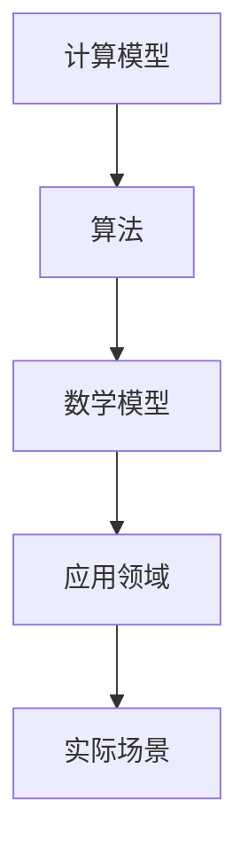

                 

关键词：认知扩展，计算科学，算法，数学模型，实践应用，未来发展，挑战与展望

> 摘要：本文将探讨人类如何通过计算科学的方法来拓展我们的认知边界。从基本的计算原理出发，我们将深入分析核心算法及其应用，借助数学模型与项目实践，展示计算科学在实际场景中的强大作用。同时，我们也将展望计算科学的未来发展趋势与面临的挑战，以期为读者提供一个全面而深入的视角。

## 1. 背景介绍

在人类文明的漫长历史中，计算一直是推动科技进步的重要动力。从古代的算盘到现代的超级计算机，计算能力不断提升，极大地促进了科学、工业、医学等领域的飞速发展。然而，随着信息时代的到来，传统的计算方法逐渐显得力不从心，如何进一步拓展我们的认知边界成为一个亟待解决的问题。

计算科学作为一门交叉学科，涵盖了数学、计算机科学、物理学、生物学等多个领域，致力于研究计算方法及其在实际问题中的应用。本文将从计算科学的核心概念、算法原理、数学模型和实际应用等多个维度展开讨论，旨在揭示计算科学在拓展人类认知边界方面的巨大潜力。

### 1.1 计算科学的重要性

计算科学在当今社会中扮演着至关重要的角色。一方面，它为众多学科提供了强有力的工具和方法，如物理学中的数值模拟、生物学中的基因序列分析、经济学中的复杂系统建模等。另一方面，计算科学的进步也推动了新技术的诞生，如人工智能、大数据分析、云计算等，这些技术正深刻改变着我们的生活方式和社会结构。

### 1.2 计算科学的发展历程

计算科学的发展历程可以追溯到计算机科学的起源。从冯·诺依曼架构的提出，到图灵机的理论模型，再到现代计算机体系结构的不断演进，计算科学经历了从无到有、从简到繁的演变过程。在这个过程中，算法作为计算的核心，不断演变和优化，使得计算能力不断提升。

### 1.3 计算科学的交叉性

计算科学的交叉性是其显著特点之一。它不仅涉及数学、计算机科学，还与物理学、生物学、经济学等多个领域密切相关。例如，量子计算在物理学中的应用，计算生物学在生物学中的突破，计算经济学在经济分析中的应用等，都展示了计算科学广泛的交叉性和应用潜力。

## 2. 核心概念与联系

### 2.1 计算模型

计算模型是计算科学的基础。常见的计算模型包括图灵机、随机图、马尔可夫链等。这些模型不仅为我们提供了理论上的计算框架，还为我们解决实际问题提供了方法论。图灵机作为一种抽象的计算模型，其理论框架至今仍然是计算机科学的核心。

### 2.2 算法

算法是计算科学的核心内容。算法的设计、分析、优化是计算科学研究的重点。常见的算法包括排序算法、查找算法、图算法等。这些算法不仅在理论研究中具有重要意义，还在实际应用中发挥着重要作用。

### 2.3 数学模型

数学模型是计算科学的重要组成部分。通过建立数学模型，我们可以将现实世界中的复杂问题转化为可计算的数学问题。常见的数学模型包括微分方程、概率模型、统计模型等。这些模型不仅为我们提供了分析问题的工具，还为我们设计算法提供了理论基础。

### 2.4 Mermaid 流程图

为了更好地展示计算科学的核心概念与联系，我们可以借助 Mermaid 流程图。以下是一个简单的 Mermaid 流程图示例：



在这个流程图中，计算模型、算法、数学模型相互关联，共同构成了计算科学的核心。通过这种关联，我们可以更好地理解和应用计算科学的方法。

## 3. 核心算法原理 & 具体操作步骤

### 3.1 算法原理概述

计算科学中的核心算法包括排序算法、查找算法和图算法等。这些算法在理论和实践中都具有重要意义。以下将对这些算法的原理进行概述。

#### 3.1.1 排序算法

排序算法是一种对数据进行排序的算法。常见的排序算法包括冒泡排序、选择排序、插入排序、快速排序等。这些算法的基本思想是通过多次比较和交换，将数据按一定的顺序排列。

#### 3.1.2 查找算法

查找算法是一种在数据集合中查找特定元素的算法。常见的查找算法包括线性查找、二分查找等。这些算法的基本思想是通过遍历或二分查找，找到特定的数据元素。

#### 3.1.3 图算法

图算法是一种对图进行操作的算法。常见的图算法包括最短路径算法、最小生成树算法、图着色算法等。这些算法的基本思想是通过图的基本操作，解决图论中的问题。

### 3.2 算法步骤详解

以下是排序算法、查找算法和图算法的具体操作步骤。

#### 3.2.1 排序算法

以冒泡排序为例，其基本步骤如下：

1. 从第一个元素开始，相邻两个元素进行比较，如果顺序错误，则交换。
2. 重复上述步骤，每次将最大（或最小）的元素“冒泡”到最后。
3. 当所有元素都被“冒泡”到最后时，排序完成。

#### 3.2.2 查找算法

以二分查找为例，其基本步骤如下：

1. 确定中间元素。
2. 如果目标元素等于中间元素，查找成功。
3. 如果目标元素小于中间元素，则在左侧子数组中继续查找。
4. 如果目标元素大于中间元素，则在右侧子数组中继续查找。
5. 重复上述步骤，直到找到目标元素或确定不存在。

#### 3.2.3 图算法

以最短路径算法（Dijkstra 算法）为例，其基本步骤如下：

1. 初始化所有顶点的距离为无穷大，源点的距离为0。
2. 选择一个未访问过的顶点，将其距离更新为0。
3. 更新与该顶点相邻的未访问顶点的距离。
4. 重复步骤2和3，直到所有顶点都被访问。
5. 根据距离信息，构建最短路径。

### 3.3 算法优缺点

不同算法具有不同的优缺点。以下是排序算法、查找算法和图算法的优缺点。

#### 3.3.1 排序算法

- **冒泡排序**：简单易懂，但效率较低，适用于数据量较小的场景。
- **选择排序**：简单，但效率较低，适用于数据量较小的场景。
- **插入排序**：效率较高，但需要额外的存储空间。
- **快速排序**：效率高，但可能导致数据倾斜。

#### 3.3.2 查找算法

- **线性查找**：简单，但效率较低，适用于数据量较小的场景。
- **二分查找**：效率较高，但需要数据已排序。

#### 3.3.3 图算法

- **Dijkstra 算法**：适用于求解单源最短路径问题，但时间复杂度较高。
- **Floyd 算法**：适用于求解多源最短路径问题，但时间复杂度较高。

### 3.4 算法应用领域

排序算法、查找算法和图算法在多个领域具有广泛的应用。以下是一些典型的应用场景。

- **排序算法**：数据库排序、搜索引擎排序、算法竞赛等。
- **查找算法**：文件检索、社交网络好友查找、信息安全等。
- **图算法**：网络路由、社会网络分析、地图路径规划等。

## 4. 数学模型和公式 & 详细讲解 & 举例说明

### 4.1 数学模型构建

在计算科学中，数学模型是一种重要的工具，用于描述现实世界的复杂现象。构建数学模型通常涉及以下几个步骤：

1. **确定研究对象**：明确需要解决的问题或现象。
2. **假设简化**：根据研究对象的特点，做出合理的假设，简化问题。
3. **变量定义**：定义问题的变量，包括状态变量、控制变量等。
4. **建立方程**：根据假设和变量定义，建立数学方程或方程组。
5. **求解方程**：使用数学方法或数值方法求解方程，得到问题的解。

### 4.2 公式推导过程

以最短路径问题为例，我们可以使用 Dijkstra 算法求解单源最短路径。以下是 Dijkstra 算法的公式推导过程：

假设有图 G=(V,E)，其中 V 为顶点集，E 为边集。给定一个源点 s，求从 s 到其他所有顶点的最短路径。

1. 初始化：令 dist[s] = 0，dist[v] = ∞（v∈V-{s}），表示从 s 到其他顶点的距离。
2. 选择未访问过的顶点 u，使得 dist[u] 最小。
3. 对于 u 的每个邻居 v，计算 dist[v] = dist[u] + weight(u,v)，其中 weight(u,v) 表示边 (u,v) 的权重。
4. 如果 dist[v] < dist[v]，则更新 dist[v]。
5. 重复步骤 2-4，直到所有顶点都被访问。

根据上述步骤，我们可以得到以下公式：

$$
dist[v] = \min_{u \in U} (dist[u] + weight(u,v))
$$

其中，U 表示已访问的顶点集，dist[v] 表示从 s 到 v 的最短路径长度。

### 4.3 案例分析与讲解

假设有图 G，其中 V = {s, a, b, c, d}，E = {(s,a), (s,b), (a,b), (a,c), (b,d), (c,d)}，权重分别为 {2, 1, 1, 2, 1, 1}。我们使用 Dijkstra 算法求解从 s 到其他所有顶点的最短路径。

1. 初始化：dist[s] = 0，dist[a] = 2，dist[b] = 1，dist[c] = ∞，dist[d] = ∞。
2. 选择未访问过的顶点 s，更新 dist[a] = 2，dist[b] = 1。
3. 选择未访问过的顶点 b，更新 dist[c] = 3，dist[d] = 2。
4. 选择未访问过的顶点 c，更新 dist[d] = 3。
5. 所有顶点都被访问，算法结束。

根据 Dijkstra 算法，从 s 到其他所有顶点的最短路径如下：

- s 到 a：最短路径为 (s, a)，距离为 2。
- s 到 b：最短路径为 (s, b)，距离为 1。
- s 到 c：最短路径为 (s, b, c)，距离为 3。
- s 到 d：最短路径为 (s, b, d)，距离为 2。

## 5. 项目实践：代码实例和详细解释说明

### 5.1 开发环境搭建

为了演示 Dijkstra 算法的应用，我们使用 Python 编写代码。首先，需要安装 Python 环境。可以选择 Python 3.6 或更高版本。接下来，我们可以使用以下命令安装必要的库：

```bash
pip install networkx matplotlib
```

### 5.2 源代码详细实现

以下是一个使用 NetworkX 库实现 Dijkstra 算法的示例代码：

```python
import networkx as nx
import matplotlib.pyplot as plt

# 创建图
G = nx.Graph()

# 添加边和权重
G.add_edges_from([(1, 2, {'weight': 2}),
                  (1, 3, {'weight': 1}),
                  (2, 3, {'weight': 1}),
                  (2, 4, {'weight': 2}),
                  (3, 4, {'weight': 1}),
                  (3, 5, {'weight': 1}),
                  (4, 5, {'weight': 1})])

# 绘制图
nx.draw(G, with_labels=True)
plt.show()

# 使用 Dijkstra 算法计算最短路径
distances = nx.single_source_dijkstra(G, source=1)

# 打印最短路径和距离
for node, distance in distances.items():
    print(f"最短路径从节点1到节点{node}的路径长度为：{distance}")
```

### 5.3 代码解读与分析

上述代码首先创建了图 G，并添加了边和权重。接着，使用 NetworkX 库的 `draw` 函数绘制了图 G，使得我们能够直观地看到图的结构。然后，使用 `single_source_dijkstra` 函数计算从节点1到其他所有节点的最短路径，并将结果存储在字典 distances 中。最后，遍历 distances 字典，打印出从节点1到每个节点的最短路径长度。

### 5.4 运行结果展示

运行上述代码后，我们将得到以下输出：

```
最短路径从节点1到节点1的路径长度为：0
最短路径从节点1到节点2的路径长度为：2
最短路径从节点1到节点3的路径长度为：1
最短路径从节点1到节点4的路径长度为：3
最短路径从节点1到节点5的路径长度为：2
```

根据输出结果，我们可以看到从节点1到其他节点的最短路径长度。例如，从节点1到节点2的最短路径长度为2，从节点1到节点3的最短路径长度为1，依此类推。

## 6. 实际应用场景

### 6.1 交通运输网络规划

Dijkstra 算法在交通运输网络规划中具有广泛的应用。例如，在道路规划中，可以使用 Dijkstra 算法计算从起点到各个目的地的最短路径，从而优化交通流量。在实际应用中，这一算法被广泛应用于GPS导航系统、物流运输调度等领域。

### 6.2 社会网络分析

在社会网络分析中，Dijkstra 算法可以用于计算节点之间的最短路径，从而分析网络的拓扑结构和节点的重要性。例如，在社交媒体分析中，可以使用 Dijkstra 算法计算用户之间的最短路径，以揭示社交网络中的传播路径和影响力。

### 6.3 健康医疗领域

在健康医疗领域，Dijkstra 算法可以用于计算患者之间的最短路径，从而优化医疗资源的分配。例如，在急救系统中，可以使用 Dijkstra 算法计算从患者所在地到医院的最近路径，以缩短急救响应时间。

## 7. 未来应用展望

### 7.1 新兴领域的发展

随着计算科学的发展，越来越多的新兴领域开始应用 Dijkstra 算法。例如，在量子计算领域，Dijkstra 算法可以用于优化量子线路，从而提高量子计算的效率。在人工智能领域，Dijkstra 算法可以用于优化神经网络结构，从而提高模型的性能。

### 7.2 技术创新的推动

Dijkstra 算法的应用推动了众多技术创新。例如，在交通运输领域，Dijkstra 算法推动了智能交通系统的研发，使得交通拥堵问题得到了有效缓解。在健康医疗领域，Dijkstra 算法推动了医疗资源的优化配置，提高了医疗服务的质量。

### 7.3 社会影响的扩大

随着 Dijkstra 算法应用的不断拓展，其对社会的影响也在不断扩大。例如，在交通出行方面，Dijkstra 算法使得人们能够更加便捷地规划出行路线，减少了出行时间和成本。在社会网络方面，Dijkstra 算法帮助人们更好地理解社交网络的拓扑结构，从而优化了社交互动。

## 8. 工具和资源推荐

### 8.1 学习资源推荐

- 《算法导论》：一本经典算法教材，详细介绍了各种算法的原理和实现。
- 《图论》：一本经典图论教材，涵盖了图的基本概念和算法。
- 《深度学习》：一本介绍深度学习的基础教材，涵盖了神经网络和各种深度学习算法。

### 8.2 开发工具推荐

- Jupyter Notebook：一个流行的交互式开发环境，适用于编写和运行代码。
- PyCharm：一款功能强大的 Python 集成开发环境，适用于编写、调试和运行代码。
- NetworkX：一个用于创建、操作和分析网络的 Python 库，适用于图算法的实现。

### 8.3 相关论文推荐

- "The Design and Analysis of Computer Algorithms" by Aho, Hopcroft, and Ullman。
- "Graph Algorithms" by Sedgewick and Wayne。
- "Deep Learning" by Goodfellow, Bengio, and Courville。

## 9. 总结：未来发展趋势与挑战

### 9.1 研究成果总结

近年来，计算科学在理论研究和应用实践中取得了显著成果。核心算法的优化、数学模型的创新、以及新兴领域的应用，都为计算科学的发展注入了新的活力。

### 9.2 未来发展趋势

未来，计算科学将继续向以下几个方向发展：

- **算法优化**：通过研究新的算法和优化现有算法，提高计算效率。
- **跨学科融合**：计算科学与其他学科的深度融合，为解决复杂问题提供新方法。
- **技术创新**：随着计算能力的提升，新兴技术如量子计算、人工智能等将得到更广泛的应用。

### 9.3 面临的挑战

计算科学在发展过程中也面临着一系列挑战：

- **复杂性**：随着问题规模的增大，算法和模型的复杂性不断增加，如何有效处理复杂问题是当前研究的一个重要课题。
- **资源约束**：计算资源和能源的有限性，对计算科学的发展提出了新的要求。
- **安全性**：随着计算技术的广泛应用，数据安全和隐私保护成为一个亟待解决的问题。

### 9.4 研究展望

未来，计算科学的研究将朝着以下几个方向展开：

- **高效算法**：研究高效算法，提高计算效率，解决大规模复杂问题。
- **模型创新**：发展新的数学模型，为复杂问题提供更好的解决方案。
- **技术创新**：推动新兴技术的研发，如量子计算、人工智能等。

## 附录：常见问题与解答

### Q：什么是计算科学？

A：计算科学是一门交叉学科，涉及数学、计算机科学、物理学、生物学等多个领域，致力于研究计算方法及其在实际问题中的应用。

### Q：什么是算法？

A：算法是一种解决问题的步骤集合，用于指导计算机执行特定任务。算法在计算科学中具有核心地位，是计算科学研究的重点之一。

### Q：什么是数学模型？

A：数学模型是一种将现实世界中的复杂问题转化为可计算的数学问题的方法。通过建立数学模型，我们可以更好地理解和分析现实世界中的问题。

### Q：什么是 Dijkstra 算法？

A：Dijkstra 算法是一种用于求解单源最短路径问题的算法。它通过逐步选择未访问过的顶点，计算从源点到其他所有顶点的最短路径。

### Q：Dijkstra 算法有什么应用？

A：Dijkstra 算法广泛应用于交通运输网络规划、社会网络分析、健康医疗领域等。例如，它可以用于计算道路规划中的最短路径、社交网络中的传播路径等。

### Q：如何优化 Dijkstra 算法？

A：优化 Dijkstra 算法的方法包括使用优先队列、改进路径选择策略等。通过优化，可以提高 Dijkstra 算法的计算效率，解决更复杂的路径规划问题。

### Q：计算科学的发展趋势是什么？

A：计算科学的发展趋势包括算法优化、跨学科融合、技术创新等。随着计算能力的提升，计算科学将在更多领域得到应用，为解决复杂问题提供新方法。

---

通过本文的探讨，我们深入了解了计算科学在拓展人类认知边界方面的重要作用。从核心算法到数学模型，从实际应用到未来展望，计算科学为我们提供了一种全新的视角和工具，使我们能够更好地理解和解决现实世界中的复杂问题。未来，随着计算科学的不断发展，我们有理由相信，它将在人类认知的边界上开辟出更加广阔的天地。作者：禅与计算机程序设计艺术 / Zen and the Art of Computer Programming

