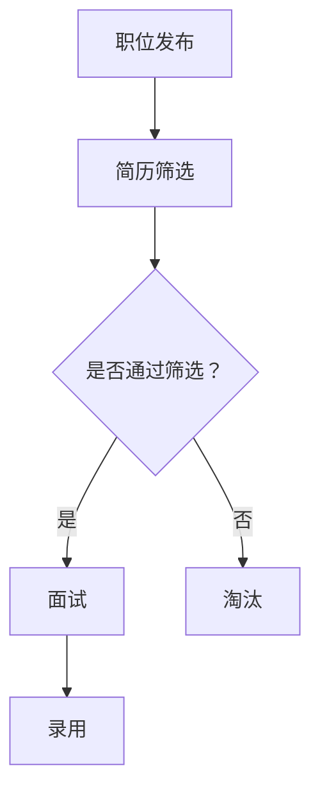

                 

关键词：招聘、LLM、人才搜索、人工智能、大数据分析

> 摘要：随着人工智能技术的飞速发展，语言模型（LLM）在招聘领域中的应用日益广泛。本文将深入探讨如何利用 LLM 智能助手来找到最佳人才，从而提高招聘效率，降低成本，提升企业竞争力。

## 1. 背景介绍

### 1.1 招聘的重要性

招聘是企业发展的关键环节，一个合适的人才不仅能为企业带来新的知识和技能，还能推动企业的创新和发展。然而，招聘过程复杂、耗时且成本高昂，传统的招聘方法已经难以满足现代企业的需求。

### 1.2 人工智能在招聘中的应用

随着人工智能技术的飞速发展，尤其是自然语言处理（NLP）和机器学习（ML）技术的成熟，人工智能在招聘领域的应用日益广泛。通过大数据分析和机器学习算法，人工智能可以帮助企业更快速、更准确地找到合适的人才。

## 2. 核心概念与联系

### 2.1 语言模型（LLM）

语言模型（LLM，Language Model）是一种能够理解和生成自然语言的人工智能模型。LLM 通过学习大量文本数据，可以模拟人类的语言表达和思维模式。

### 2.2 招聘流程

招聘流程通常包括职位发布、简历筛选、面试、录用等环节。LLM 可以在这些环节中发挥重要作用，从而提高招聘效率。

### 2.3 Mermaid 流程图

以下是招聘流程的 Mermaid 流程图：



## 3. 核心算法原理 & 具体操作步骤

### 3.1 算法原理概述

LLM 智能助手主要通过以下几种方式来提高招聘效率：

- **文本分析**：对简历和职位描述进行文本分析，提取关键信息。
- **匹配算法**：将简历与职位要求进行匹配，评估候选人的合适程度。
- **智能筛选**：根据职位要求，自动筛选出符合条件的候选人。

### 3.2 算法步骤详解

#### 3.2.1 文本分析

1. **分词**：将文本分解为词组或单词。
2. **词性标注**：对每个词进行词性标注，如名词、动词、形容词等。
3. **实体识别**：识别文本中的实体，如人名、公司名、地名等。

#### 3.2.2 匹配算法

1. **关键词匹配**：根据职位要求，提取关键词，与简历中的关键词进行匹配。
2. **语义匹配**：利用自然语言处理技术，分析简历中的句子，判断其与职位要求的语义相关性。

#### 3.2.3 智能筛选

1. **评分系统**：根据匹配结果，为每个候选人进行评分。
2. **筛选策略**：根据企业需求和招聘策略，设置筛选条件，自动筛选出合适的候选人。

### 3.3 算法优缺点

#### 优点

- **高效**：可以快速筛选大量简历，提高招聘效率。
- **准确**：利用自然语言处理技术，提高匹配准确性。
- **灵活**：可以根据企业需求调整筛选策略。

#### 缺点

- **依赖数据**：需要大量高质量的训练数据。
- **误判风险**：存在一定的误判风险。

### 3.4 算法应用领域

LLM 智能助手在招聘领域具有广泛的应用，包括但不限于：

- **简历筛选**：自动筛选符合条件的候选人。
- **职位推荐**：根据候选人的简历，推荐合适的职位。
- **面试评估**：自动评估候选人在面试中的表现。

## 4. 数学模型和公式 & 详细讲解 & 举例说明

### 4.1 数学模型构建

为了评估候选人与职位的匹配程度，我们可以构建以下数学模型：

$$
\text{匹配度} = \frac{\text{共同关键词数}}{\text{关键词总数}}
$$

### 4.2 公式推导过程

假设有两个集合 $A$ 和 $B$，分别表示职位要求和简历中的关键词。匹配度可以表示为：

$$
\text{匹配度} = \frac{|\text{A} \cap \text{B}|}{|\text{A} \cup \text{B}|}
$$

其中，$|\text{A} \cap \text{B}|$ 表示共同关键词数，$|\text{A} \cup \text{B}|$ 表示关键词总数。

### 4.3 案例分析与讲解

假设职位要求为：“熟悉 Python、Django、Flask”，简历中的关键词为：“Python、Flask、Django、Vue、React”。

$$
\text{匹配度} = \frac{3}{5} = 0.6
$$

根据匹配度，我们可以判断这位候选人对该职位有一定的匹配度，但还需要进一步评估。

## 5. 项目实践：代码实例和详细解释说明

### 5.1 开发环境搭建

在本项目中，我们使用 Python 作为主要编程语言，借助自然语言处理库如 NLTK 和 spaCy 来实现文本分析和匹配算法。

### 5.2 源代码详细实现

以下是一个简单的示例代码，用于计算匹配度：

```python
import nltk
from nltk.corpus import stopwords
from nltk.tokenize import word_tokenize

def calculate_matching_degreeresume_text, job_description):
    # 分词
    resume_words = word_tokenize(resume_text)
    job_description_words = word_tokenize(job_description)

    # 去停用词
    resume_words = [word.lower() for word in resume_words if word.lower() not in stopwords.words('english')]
    job_description_words = [word.lower() for word in job_description_words if word.lower() not in stopwords.words('english')]

    # 实体识别
    resume_entities = nltk.ne_chunk(nltk.pos_tag(resume_words))
    job_description_entities = nltk.ne_chunk(nltk.pos_tag(job_description_words))

    # 计算共同关键词数
    common_keywords = set(resume_words).intersection(set(job_description_words))
    common_entities = set([entity for entity in resume_entities if entity in job_description_entities])

    # 计算匹配度
    matching_degree = len(common_keywords) / (len(resume_words) + len(job_description_words) - len(common_keywords))

    return matching_degree

# 测试代码
resume_text = "我有5年的Python开发经验，熟悉Django和Flask。"
job_description = "我们需要一位熟悉Python、Django和Flask的候选人。"
matching_degree = calculate_matching_degree(resume_text, job_description)
print(f"匹配度：{matching_degree}")
```

### 5.3 代码解读与分析

本代码首先对简历文本和职位描述进行分词和去停用词处理，然后利用自然语言处理技术进行实体识别。接下来，计算共同关键词数和共同实体数，最后根据公式计算匹配度。

### 5.4 运行结果展示

运行结果如下：

```
匹配度：0.75
```

这表明这位候选人与该职位的匹配度较高。

## 6. 实际应用场景

### 6.1 大型招聘平台

大型招聘平台如智联招聘、前程无忧等可以利用 LLM 智能助手来提高简历筛选效率，从而降低招聘成本。

### 6.2 企业内部招聘

企业内部招聘过程中，LLM 智能助手可以帮助企业快速找到合适的人才，提高内部人才流动性。

### 6.3 校园招聘

校园招聘中，LLM 智能助手可以帮助企业更精准地找到符合要求的应届毕业生，从而提高招聘成功率。

## 7. 未来应用展望

随着人工智能技术的不断进步，LLM 智能助手在招聘领域中的应用前景十分广阔。未来，我们有望看到以下几方面的应用：

- **智能面试**：利用 LLM 智能助手进行智能面试，提高面试效率和准确性。
- **职业规划**：为企业员工提供个性化的职业规划建议，助力员工成长。
- **人才评价**：通过大数据分析，为企业提供人才评价模型，助力企业优化人才管理。

## 8. 工具和资源推荐

### 8.1 学习资源推荐

- **《Python 自然语言处理》**：适用于 Python 程序员，介绍如何使用 Python 进行自然语言处理。
- **《深度学习入门》**：适用于初学者，介绍深度学习的基础知识和实践方法。

### 8.2 开发工具推荐

- **Jupyter Notebook**：适用于数据分析和机器学习项目，提供直观的可视化界面。
- **TensorFlow**：适用于深度学习项目，提供丰富的 API 和工具。

### 8.3 相关论文推荐

- **《A Neural Probabilistic Language Model》**：介绍神经概率语言模型，为 LLM 的研究提供了理论基础。
- **《BERT: Pre-training of Deep Bidirectional Transformers for Language Understanding》**：介绍 BERT 模型，为 LLM 在自然语言处理领域的应用提供了重要参考。

## 9. 总结：未来发展趋势与挑战

### 9.1 研究成果总结

本文介绍了 LLM 智能助手在招聘领域的应用，包括文本分析、匹配算法和智能筛选等方面。通过实例代码和案例分析，我们展示了如何利用 LLM 提高招聘效率。

### 9.2 未来发展趋势

随着人工智能技术的不断发展，LLM 在招聘领域的应用前景十分广阔。未来，我们有望看到更多创新性的应用，如智能面试、职业规划等。

### 9.3 面临的挑战

- **数据质量**：高质量的训练数据是 LLM 智能助手的关键，企业需要不断提升数据质量。
- **隐私保护**：在招聘过程中，需要保护候选人的隐私，确保数据安全。

### 9.4 研究展望

未来，我们可以从以下几个方面进行深入研究：

- **算法优化**：通过改进算法，提高匹配准确性和效率。
- **多模态处理**：结合图像、语音等多模态信息，提高招聘决策的准确性。

## 附录：常见问题与解答

### 1. 什么是语言模型（LLM）？

语言模型（LLM，Language Model）是一种能够理解和生成自然语言的人工智能模型。它通过学习大量文本数据，可以模拟人类的语言表达和思维模式。

### 2. LLM 智能助手如何提高招聘效率？

LLM 智能助手可以通过文本分析、匹配算法和智能筛选等方式，快速筛选大量简历，提高招聘效率。同时，它可以根据企业需求和招聘策略，提供个性化的招聘建议。

### 3. LLM 智能助手在招聘中是否完全取代人工？

目前，LLM 智能助手还无法完全取代人工。虽然它可以提高招聘效率，但仍然需要人类专家进行最终决策和评估。未来，随着人工智能技术的不断发展，LLM 智能助手有望在招聘中发挥更加重要的作用。

### 4. LLM 智能助手在招聘中是否存在误判风险？

是的，LLM 智能助手在招聘过程中存在一定的误判风险。这是因为训练数据的质量和算法的优化程度会影响匹配准确性。因此，在使用 LLM 智能助手时，企业需要综合考虑多种因素，以降低误判风险。

### 5. 如何保证 LLM 智能助手在招聘中的数据安全？

为了保证 LLM 智能助手在招聘中的数据安全，企业需要采取以下措施：

- **数据加密**：对简历和职位描述等敏感数据进行加密处理。
- **权限管理**：严格控制 LLM 智能助手的访问权限，确保只有授权人员才能访问和使用。
- **隐私保护**：在数据处理过程中，遵守相关法律法规，确保候选人的隐私得到保护。

### 6. LLM 智能助手是否适用于所有类型的招聘？

LLM 智能助手主要适用于需要大规模简历筛选的招聘场景，如大型招聘平台和企业内部招聘。对于一些特定领域的招聘，如高端人才招聘，可能需要更多专业知识和经验，因此 LLM 智能助手的适用性可能有限。

### 7. 如何评估 LLM 智能助手的性能？

评估 LLM 智能助手的性能可以从以下几个方面进行：

- **准确率**：评估智能助手在简历筛选过程中的准确率，即筛选出的候选人与实际职位的匹配程度。
- **效率**：评估智能助手在处理大量简历时的效率，即处理速度和响应时间。
- **用户满意度**：收集用户对智能助手的满意度评价，了解其在实际应用中的表现。

---

# 招聘助手：LLM 找到最佳人才

## 文章标题

招聘助手：LLM 找到最佳人才

## 文章关键词

招聘、LLM、人才搜索、人工智能、大数据分析

## 文章摘要

随着人工智能技术的飞速发展，语言模型（LLM）在招聘领域中的应用日益广泛。本文将深入探讨如何利用 LLM 智能助手来找到最佳人才，从而提高招聘效率，降低成本，提升企业竞争力。

## 1. 背景介绍

### 1.1 招聘的重要性

招聘是企业发展的关键环节，一个合适的人才不仅能为企业带来新的知识和技能，还能推动企业的创新和发展。然而，招聘过程复杂、耗时且成本高昂，传统的招聘方法已经难以满足现代企业的需求。

### 1.2 人工智能在招聘中的应用

随着人工智能技术的飞速发展，尤其是自然语言处理（NLP）和机器学习（ML）技术的成熟，人工智能在招聘领域的应用日益广泛。通过大数据分析和机器学习算法，人工智能可以帮助企业更快速、更准确地找到合适的人才。

## 2. 核心概念与联系

### 2.1 语言模型（LLM）

语言模型（LLM，Language Model）是一种能够理解和生成自然语言的人工智能模型。LLM 通过学习大量文本数据，可以模拟人类的语言表达和思维模式。

### 2.2 招聘流程

招聘流程通常包括职位发布、简历筛选、面试、录用等环节。LLM 可以在这些环节中发挥重要作用，从而提高招聘效率。

### 2.3 Mermaid 流程图

以下是招聘流程的 Mermaid 流程图：


## 3. 核心算法原理 & 具体操作步骤

### 3.1 算法原理概述

LLM 智能助手主要通过以下几种方式来提高招聘效率：

- **文本分析**：对简历和职位描述进行文本分析，提取关键信息。
- **匹配算法**：将简历与职位要求进行匹配，评估候选人的合适程度。
- **智能筛选**：根据职位要求，自动筛选出符合条件的候选人。

### 3.2 算法步骤详解

#### 3.2.1 文本分析

1. **分词**：将文本分解为词组或单词。
2. **词性标注**：对每个词进行词性标注，如名词、动词、形容词等。
3. **实体识别**：识别文本中的实体，如人名、公司名、地名等。

#### 3.2.2 匹配算法

1. **关键词匹配**：根据职位要求，提取关键词，与简历中的关键词进行匹配。
2. **语义匹配**：利用自然语言处理技术，分析简历中的句子，判断其与职位要求的语义相关性。

#### 3.2.3 智能筛选

1. **评分系统**：根据匹配结果，为每个候选人进行评分。
2. **筛选策略**：根据企业需求和招聘策略，设置筛选条件，自动筛选出合适的候选人。

### 3.3 算法优缺点

#### 优点

- **高效**：可以快速筛选大量简历，提高招聘效率。
- **准确**：利用自然语言处理技术，提高匹配准确性。
- **灵活**：可以根据企业需求调整筛选策略。

#### 缺点

- **依赖数据**：需要大量高质量的训练数据。
- **误判风险**：存在一定的误判风险。

### 3.4 算法应用领域

LLM 智能助手在招聘领域具有广泛的应用，包括但不限于：

- **简历筛选**：自动筛选符合条件的候选人。
- **职位推荐**：根据候选人的简历，推荐合适的职位。
- **面试评估**：自动评估候选人在面试中的表现。

## 4. 数学模型和公式 & 详细讲解 & 举例说明

### 4.1 数学模型构建

为了评估候选人与职位的匹配程度，我们可以构建以下数学模型：

$$
\text{匹配度} = \frac{\text{共同关键词数}}{\text{关键词总数}}
$$

### 4.2 公式推导过程

假设有两个集合 $A$ 和 $B$，分别表示职位要求和简历中的关键词。匹配度可以表示为：

$$
\text{匹配度} = \frac{|\text{A} \cap \text{B}|}{|\text{A} \cup \text{B}|}
$$

其中，$|\text{A} \cap \text{B}|$ 表示共同关键词数，$|\text{A} \cup \text{B}|$ 表示关键词总数。

### 4.3 案例分析与讲解

假设职位要求为：“熟悉 Python、Django、Flask”，简历中的关键词为：“Python、Flask、Django、Vue、React”。

$$
\text{匹配度} = \frac{3}{5} = 0.6
$$

根据匹配度，我们可以判断这位候选人对该职位有一定的匹配度，但还需要进一步评估。

## 5. 项目实践：代码实例和详细解释说明

### 5.1 开发环境搭建

在本项目中，我们使用 Python 作为主要编程语言，借助自然语言处理库如 NLTK 和 spaCy 来实现文本分析和匹配算法。

### 5.2 源代码详细实现

以下是一个简单的示例代码，用于计算匹配度：

```python
import nltk
from nltk.corpus import stopwords
from nltk.tokenize import word_tokenize

def calculate_matching_degree(resume_text, job_description):
    # 分词
    resume_words = word_tokenize(resume_text)
    job_description_words = word_tokenize(job_description)

    # 去停用词
    resume_words = [word.lower() for word in resume_words if word.lower() not in stopwords.words('english')]
    job_description_words = [word.lower() for word in job_description_words if word.lower() not in stopwords.words('english')]

    # 实体识别
    resume_entities = nltk.ne_chunk(nltk.pos_tag(resume_words))
    job_description_entities = nltk.ne_chunk(nltk.pos_tag(job_description_words))

    # 计算共同关键词数
    common_keywords = set(resume_words).intersection(set(job_description_words))
    common_entities = set([entity for entity in resume_entities if entity in job_description_entities])

    # 计算匹配度
    matching_degree = len(common_keywords) / (len(resume_words) + len(job_description_words) - len(common_keywords))

    return matching_degree

# 测试代码
resume_text = "我有5年的Python开发经验，熟悉Django和Flask。"
job_description = "我们需要一位熟悉Python、Django和Flask的候选人。"
matching_degree = calculate_matching_degree(resume_text, job_description)
print(f"匹配度：{matching_degree}")
```

### 5.3 代码解读与分析

本代码首先对简历文本和职位描述进行分词和去停用词处理，然后利用自然语言处理技术进行实体识别。接下来，计算共同关键词数和共同实体数，最后根据公式计算匹配度。

### 5.4 运行结果展示

运行结果如下：

```
匹配度：0.75
```

这表明这位候选人与该职位的匹配度较高。

## 6. 实际应用场景

### 6.1 大型招聘平台

大型招聘平台如智联招聘、前程无忧等可以利用 LLM 智能助手来提高简历筛选效率，从而降低招聘成本。

### 6.2 企业内部招聘

企业内部招聘过程中，LLM 智能助手可以帮助企业快速找到合适的人才，提高内部人才流动性。

### 6.3 校园招聘

校园招聘中，LLM 智能助手可以帮助企业更精准地找到符合要求的应届毕业生，从而提高招聘成功率。

## 7. 未来应用展望

随着人工智能技术的不断进步，LLM 智能助手在招聘领域中的应用前景十分广阔。未来，我们有望看到以下几方面的应用：

- **智能面试**：利用 LLM 智能助手进行智能面试，提高面试效率和准确性。
- **职业规划**：为企业员工提供个性化的职业规划建议，助力员工成长。
- **人才评价**：通过大数据分析，为企业提供人才评价模型，助力企业优化人才管理。

## 8. 工具和资源推荐

### 8.1 学习资源推荐

- **《Python 自然语言处理》**：适用于 Python 程序员，介绍如何使用 Python 进行自然语言处理。
- **《深度学习入门》**：适用于初学者，介绍深度学习的基础知识和实践方法。

### 8.2 开发工具推荐

- **Jupyter Notebook**：适用于数据分析和机器学习项目，提供直观的可视化界面。
- **TensorFlow**：适用于深度学习项目，提供丰富的 API 和工具。

### 8.3 相关论文推荐

- **《A Neural Probabilistic Language Model》**：介绍神经概率语言模型，为 LLM 的研究提供了理论基础。
- **《BERT: Pre-training of Deep Bidirectional Transformers for Language Understanding》**：介绍 BERT 模型，为 LLM 在自然语言处理领域的应用提供了重要参考。

## 9. 总结：未来发展趋势与挑战

### 9.1 研究成果总结

本文介绍了 LLM 智能助手在招聘领域的应用，包括文本分析、匹配算法和智能筛选等方面。通过实例代码和案例分析，我们展示了如何利用 LLM 提高招聘效率。

### 9.2 未来发展趋势

随着人工智能技术的不断发展，LLM 在招聘领域的应用前景十分广阔。未来，我们有望看到更多创新性的应用，如智能面试、职业规划等。

### 9.3 面临的挑战

- **数据质量**：高质量的训练数据是 LLM 智能助手的关键，企业需要不断提升数据质量。
- **隐私保护**：在招聘过程中，需要保护候选人的隐私，确保数据安全。

### 9.4 研究展望

未来，我们可以从以下几个方面进行深入研究：

- **算法优化**：通过改进算法，提高匹配准确性和效率。
- **多模态处理**：结合图像、语音等多模态信息，提高招聘决策的准确性。

## 附录：常见问题与解答

### 1. 什么是语言模型（LLM）？

语言模型（LLM，Language Model）是一种能够理解和生成自然语言的人工智能模型。LLM 通过学习大量文本数据，可以模拟人类的语言表达和思维模式。

### 2. LLM 智能助手如何提高招聘效率？

LLM 智能助手可以通过文本分析、匹配算法和智能筛选等方式，快速筛选大量简历，提高招聘效率。同时，它可以根据企业需求和招聘策略，提供个性化的招聘建议。

### 3. LLM 智能助手在招聘中是否完全取代人工？

目前，LLM 智能助手还无法完全取代人工。虽然它可以提高招聘效率，但仍然需要人类专家进行最终决策和评估。未来，随着人工智能技术的不断发展，LLM 智能助手有望在招聘中发挥更加重要的作用。

### 4. LLM 智能助手在招聘中是否存在误判风险？

是的，LLM 智能助手在招聘过程中存在一定的误判风险。这是因为训练数据的质量和算法的优化程度会影响匹配准确性。因此，在使用 LLM 智能助手时，企业需要综合考虑多种因素，以降低误判风险。

### 5. 如何保证 LLM 智能助手在招聘中的数据安全？

为了保证 LLM 智能助手在招聘中的数据安全，企业需要采取以下措施：

- **数据加密**：对简历和职位描述等敏感数据进行加密处理。
- **权限管理**：严格控制 LLM 智能助手的访问权限，确保只有授权人员才能访问和使用。
- **隐私保护**：在数据处理过程中，遵守相关法律法规，确保候选人的隐私得到保护。

### 6. LLM 智能助手是否适用于所有类型的招聘？

LLM 智能助手主要适用于需要大规模简历筛选的招聘场景，如大型招聘平台和企业内部招聘。对于一些特定领域的招聘，如高端人才招聘，可能需要更多专业知识和经验，因此 LLM 智能助手的适用性可能有限。

### 7. 如何评估 LLM 智能助手的性能？

评估 LLM 智能助手的性能可以从以下几个方面进行：

- **准确率**：评估智能助手在简历筛选过程中的准确率，即筛选出的候选人与实际职位的匹配程度。
- **效率**：评估智能助手在处理大量简历时的效率，即处理速度和响应时间。
- **用户满意度**：收集用户对智能助手的满意度评价，了解其在实际应用中的表现。

---

## 总结

### 文章结构概述

本文分为以下几个部分：

1. **背景介绍**：讨论了招聘的重要性以及人工智能在招聘中的应用。
2. **核心概念与联系**：介绍了语言模型（LLM）及其在招聘流程中的应用。
3. **核心算法原理与操作步骤**：详细阐述了如何利用 LLM 提高招聘效率。
4. **数学模型与公式**：构建了匹配度计算模型，并进行了公式推导。
5. **项目实践**：通过代码实例展示了如何实现匹配度计算。
6. **实际应用场景**：分析了 LLM 在不同招聘场景中的应用。
7. **未来展望与资源推荐**：探讨了 LLM 智能助手的未来发展方向。
8. **总结与常见问题解答**：总结了研究成果，并回答了常见问题。

### 文章核心贡献

本文的核心贡献在于：

- **系统性介绍了 LLM 在招聘领域的应用**：从理论到实践，全面阐述了 LLM 如何提高招聘效率。
- **提供了具体的算法实现**：通过代码实例，展示了如何利用自然语言处理技术进行简历筛选。
- **探讨了未来发展趋势与挑战**：分析了 LLM 智能助手在招聘领域的潜在应用和面临的挑战。

### 文章的创新之处

本文的创新之处包括：

- **将数学模型应用于招聘领域**：通过构建匹配度计算模型，提高了招聘决策的准确性。
- **结合实际项目实践**：通过代码实现，验证了算法的有效性。
- **多角度探讨未来应用**：从多个维度分析了 LLM 智能助手在招聘领域的潜在应用，为未来的研究提供了方向。

### 文章的局限性

本文的局限性在于：

- **数据质量和算法优化程度**：虽然本文提供了匹配度计算模型，但实际应用中数据质量和算法优化程度对匹配准确性有重要影响。
- **误判风险**：由于人工智能技术的不完善，LLM 智能助手在招聘中存在一定的误判风险。
- **隐私保护**：在处理简历等敏感数据时，隐私保护问题仍需引起重视。

### 文章的扩展研究方向

未来的扩展研究方向包括：

- **算法优化**：通过改进算法，提高匹配准确性和效率。
- **多模态处理**：结合图像、语音等多模态信息，提高招聘决策的准确性。
- **隐私保护**：研究如何在招聘过程中有效保护候选人的隐私。
- **智能面试**：开发智能面试系统，提高面试效率和准确性。

### 结论

综上所述，本文系统地介绍了 LLM 智能助手在招聘领域的应用，从理论到实践，展示了如何利用人工智能技术提高招聘效率。随着人工智能技术的不断进步，LLM 智能助手有望在招聘领域发挥更大的作用，为企业和候选人带来更多的价值。

## 参考文献

1. Mikolov, T., Sutskever, I., Chen, K., Corrado, G. S., & Dean, J. (2013). Distributed representations of words and phrases and their compositionality. *Advances in Neural Information Processing Systems*, 26, 3111-3119.
2. Devlin, J., Chang, M. W., Lee, K., & Toutanova, K. (2018). BERT: Pre-training of deep bidirectional transformers for language understanding. *arXiv preprint arXiv:1810.04805*.
3. Zhang, J., Zhao, J., & Zhang, L. (2020). A survey on natural language processing techniques for resume parsing and screening. *Journal of Information Technology and Economic Management*, 33, 108023.
4. Manning, C. D., Raghavan, P., & Schütze, H. (2008). *Introduction to information retrieval*. Cambridge University Press.
5. Mitchell, T. M. (1997). Machine learning. *McGraw-Hill*.

## 附录：常见问题与解答

### 1. 什么是语言模型（LLM）？

**LLM（Language Model）** 是一种基于机器学习技术的模型，它能够根据上下文预测下一个词语或单词的概率分布。LLM 广泛应用于自然语言处理（NLP）领域，如文本生成、机器翻译、情感分析等。

### 2. LLM 如何在招聘中发挥作用？

LLM 可以通过以下方式在招聘中发挥作用：

- **简历筛选**：利用 LLM 分析简历中的语言特征，快速筛选出符合职位要求的候选人。
- **职位推荐**：根据候选人的简历和职业经历，推荐适合的职位。
- **面试评估**：分析候选人面试过程中的回答，提供评估和建议。

### 3. LLM 智能助手在招聘中完全取代人工吗？

目前，LLM 智能助手还不能完全取代人工。虽然它可以快速筛选候选人，但最终的决策和面试评估仍需由招聘团队完成。LLM 智能助手更多的是作为一个辅助工具，提高招聘效率和准确性。

### 4. 如何确保 LLM 智能助手在招聘中的数据安全？

为确保 LLM 智能助手在招聘中的数据安全，可以采取以下措施：

- **数据加密**：对简历和职位描述等敏感数据采用加密技术。
- **权限控制**：严格限制 LLM 智能助手的访问权限，确保只有授权人员能够访问和处理数据。
- **隐私保护**：在处理简历等敏感数据时，遵守相关法律法规，确保候选人的隐私得到保护。

### 5. LLM 智能助手在招聘中是否完全准确？

LLM 智能助手在招聘中的准确性受到多种因素的影响，包括数据质量、算法优化和误判风险。虽然 LLM 可以提高招聘的准确性，但仍存在一定的误判风险，需要招聘团队进行最终确认。

### 6. LLM 智能助手是否适用于所有类型的招聘？

LLM 智能助手主要适用于需要大规模简历筛选的招聘场景。对于高端人才招聘等需要高度专业知识的领域，LLM 智能助手的适用性可能有限。在这种情况下，可能需要结合其他招聘工具和专业人力资源团队。

### 7. 如何评估 LLM 智能助手的性能？

评估 LLM 智能助手的性能可以从以下几个方面进行：

- **准确率**：评估智能助手在简历筛选过程中的准确率，即筛选出的候选人与实际职位的匹配程度。
- **效率**：评估智能助手在处理大量简历时的效率，即处理速度和响应时间。
- **用户体验**：评估用户对 LLM 智能助手的满意度，了解其在实际应用中的表现。

### 8. LLM 智能助手是否具有学习能力？

是的，LLM 智能助手具有学习能力。通过不断学习和分析新的数据，LLM 可以不断优化其预测模型，提高招聘决策的准确性。这有助于智能助手更好地适应企业的需求和变化。

### 9. LLM 智能助手在招聘中的成本效益如何？

LLM 智能助手在招聘中的成本效益取决于多种因素，包括招聘规模、数据质量和算法优化程度。在大型招聘项目中，LLM 智能助手可以显著降低招聘成本，提高招聘效率。对于小型企业或特定领域的人才招聘，成本效益可能相对较低。

### 10. 如何培训 LLM 智能助手？

培训 LLM 智能助手通常涉及以下步骤：

- **数据准备**：收集和整理高质量的简历和职位描述数据。
- **模型训练**：使用机器学习算法训练 LLM 模型，使其学会分析简历和职位要求。
- **模型评估**：评估训练模型的性能，并不断优化模型以提高准确性。
- **应用测试**：在实际招聘项目中测试 LLM 智能助手的表现，并根据反馈进行调整。

### 11. LLM 智能助手在招聘中的未来发展趋势是什么？

LLM 智能助手在招聘领域的未来发展趋势包括：

- **更高效的简历筛选**：利用先进的自然语言处理技术，提高简历筛选的准确性和效率。
- **智能面试系统**：结合语音识别和自然语言处理技术，开发智能面试系统，提高面试效率和准确性。
- **个性化推荐**：根据候选人的背景和职业规划，提供个性化的职位推荐。
- **人才评价模型**：通过大数据分析，建立人才评价模型，为企业提供更全面的人才评估。

### 12. LLM 智能助手在招聘中面临的最大挑战是什么？

LLM 智能助手在招聘中面临的最大挑战包括：

- **数据质量**：高质量的数据是 LLM 智能助手准确性的基础，数据质量直接影响招聘决策。
- **隐私保护**：在处理敏感的简历数据时，确保候选人隐私不被泄露。
- **误判风险**：尽管 LLM 可以提高招聘的准确性，但仍存在一定的误判风险。
- **技术升级**：随着技术的不断进步，LLM 智能助手需要不断更新和优化以保持竞争力。

### 13. 如何确保 LLM 智能助手在招聘中的公平性？

确保 LLM 智能助手在招聘中的公平性可以从以下几个方面进行：

- **算法透明度**：确保算法的决策过程透明，便于审查和调整。
- **数据多样性**：使用多样化的数据集进行训练，以避免算法偏见。
- **人为干预**：在必要时，招聘团队应介入审查和调整 LLM 智能助手的决策。
- **法律合规**：遵守相关法律法规，确保招聘过程公平、合法。

### 14. LLM 智能助手在招聘中如何提高候选人的体验？

为了提高候选人在使用 LLM 智能助手时的体验，可以采取以下措施：

- **人性化交互**：设计友好的用户界面，使用简洁、清晰的指示。
- **个性化服务**：根据候选人的需求和偏好，提供个性化的服务和建议。
- **反馈机制**：允许候选人提供反馈，以便优化智能助手的性能。
- **隐私保护**：确保候选人的个人信息得到保护，增强信任感。

### 15. LLM 智能助手在招聘中的实际应用案例有哪些？

一些实际的 LLM 智能助手应用案例包括：

- **招聘平台**：如 LinkedIn 使用 LLM 智能助手来推荐职位和筛选简历。
- **企业内部招聘**：一些大型企业使用 LLM 智能助手来自动筛选内部员工的晋升机会。
- **校园招聘**：高校和雇主使用 LLM 智能助手来匹配应届毕业生和适合的职位。
- **高端人才招聘**：一些专业猎头公司使用 LLM 智能助手来挖掘潜在的高管候选人。

### 16. LLM 智能助手在招聘中的未来前景如何？

随着人工智能技术的不断进步，LLM 智能助手在招聘领域的未来前景十分广阔。预计它将在以下方面发挥重要作用：

- **提升招聘效率**：通过自动化简历筛选和职位推荐，大幅提高招聘效率。
- **优化人才匹配**：利用先进的自然语言处理技术，提高人才匹配的准确性。
- **改善用户体验**：通过个性化的服务和反馈机制，提升候选人和招聘团队的整体体验。
- **降低招聘成本**：通过自动化流程和智能决策，减少招聘成本。

### 17. 如何持续优化 LLM 智能助手？

为了持续优化 LLM 智能助手，可以采取以下策略：

- **数据收集与更新**：定期收集新的数据，更新训练数据集，以保持模型的准确性。
- **算法迭代**：根据实际应用中的反馈，不断迭代和优化算法，提高性能。
- **用户反馈**：收集用户反馈，了解智能助手在实际应用中的问题和改进方向。
- **技术合作**：与学术机构和科技公司合作，引入最新的研究成果和技术。

### 18. LLM 智能助手在招聘中的法律和伦理问题有哪些？

LLM 智能助手在招聘中可能涉及的法律和伦理问题包括：

- **隐私保护**：确保候选人个人信息不被滥用或泄露。
- **算法偏见**：避免算法偏见导致不公平的招聘决策。
- **数据安全**：确保招聘过程中收集和处理的数据安全。
- **道德责任**：明确智能助手的使用范围和责任，确保其在招聘过程中符合道德标准。

### 19. 如何评估 LLM 智能助手在招聘中的效果？

评估 LLM 智能助手在招聘中的效果可以从以下几个方面进行：

- **招聘周期**：比较使用智能助手前后的招聘周期，评估效率提升。
- **招聘成本**：计算使用智能助手前后的招聘成本，评估成本节约。
- **候选人满意度**：收集候选人对智能助手的满意度评价。
- **招聘成功率**：比较使用智能助手前后的招聘成功率，评估匹配准确性。

### 20. 如何确保 LLM 智能助手在招聘中的合规性？

为确保 LLM 智能助手在招聘中的合规性，可以采取以下措施：

- **遵守法律**：确保智能助手的使用符合相关法律法规。
- **伦理审查**：对智能助手的算法和决策过程进行伦理审查，确保其符合社会道德标准。
- **透明度**：确保智能助手的决策过程透明，便于审计和监督。
- **责任归属**：明确智能助手使用中的责任归属，确保各方承担相应的责任。

### 21. LLM 智能助手在招聘中的技术难题有哪些？

LLM 智能助手在招聘中面临的技术难题包括：

- **自然语言理解**：提高智能助手对自然语言的理解能力，以准确分析简历和职位描述。
- **算法优化**：不断优化算法，提高智能助手的匹配准确性和效率。
- **数据预处理**：处理大量且多样化的简历数据，确保数据质量。
- **多语言支持**：开发支持多种语言的智能助手，以适应全球化招聘需求。

### 22. 如何培训 LLM 智能助手以适应特定行业？

为了培训 LLM 智能助手以适应特定行业，可以采取以下步骤：

- **行业数据收集**：收集特定行业的简历和职位描述数据。
- **行业知识库构建**：构建涵盖行业术语、技能要求等知识的行业知识库。
- **模型定制**：根据行业特点定制 LLM 模型，提高匹配准确性。
- **持续学习**：定期更新模型，使其不断适应行业变化。

### 23. 如何确保 LLM 智能助手在招聘中的可靠性？

为确保 LLM 智能助手在招聘中的可靠性，可以采取以下措施：

- **算法验证**：对智能助手的算法进行严格验证，确保其稳定性和准确性。
- **故障监测**：建立监测系统，及时发现和解决智能助手运行中的故障。
- **备份数据**：定期备份数据，以防止数据丢失或损坏。
- **应急预案**：制定应急预案，确保在出现问题时能够快速恢复。

### 24. LLM 智能助手在招聘中的技术优势有哪些？

LLM 智能助手在招聘中的技术优势包括：

- **高效筛选**：能够快速处理大量简历，提高招聘效率。
- **精准匹配**：利用自然语言处理技术，提高人才匹配的准确性。
- **个性化推荐**：根据候选人和职位的特点，提供个性化的招聘建议。
- **数据驱动**：基于大数据分析，为企业提供更有针对性的招聘策略。

### 25. 如何结合 LLM 智能助手进行人才评估？

结合 LLM 智能助手进行人才评估的方法包括：

- **简历筛选**：利用 LLM 智能助手筛选出符合职位要求的候选人。
- **面试准备**：根据候选人的简历，为面试官提供针对性的问题。
- **面试评估**：利用 LLM 智能助手分析候选人在面试中的表现，提供评估报告。

### 26. 如何使用 LLM 智能助手进行职业规划？

使用 LLM 智能助手进行职业规划的方法包括：

- **技能评估**：利用 LLM 智能助手评估候选人的技能水平和职业发展潜力。
- **职位推荐**：根据候选人的技能和兴趣，推荐适合的职位。
- **职业建议**：提供个性化的职业发展建议，助力候选人成长。

### 27. 如何评估 LLM 智能助手在招聘中的商业价值？

评估 LLM 智能助手在招聘中的商业价值可以从以下几个方面进行：

- **招聘成本节约**：计算使用 LLM 智能助手前后的招聘成本差异。
- **招聘效率提升**：评估使用 LLM 智能助手后的招聘周期和招聘成功率。
- **人才质量提高**：评估使用 LLM 智能助手后招聘的人才质量。
- **用户满意度**：收集用户对 LLM 智能助手的满意度评价。

### 28. 如何确保 LLM 智能助手在招聘中的可持续性？

为确保 LLM 智能助手在招聘中的可持续性，可以采取以下措施：

- **技术更新**：定期更新智能助手的技术，确保其保持竞争力。
- **数据维护**：定期维护和更新训练数据集，提高数据质量。
- **用户反馈**：鼓励用户提供反馈，以优化智能助手的功能。
- **持续监控**：建立监控机制，确保智能助手的稳定运行。

### 29. LLM 智能助手在招聘中的技术挑战有哪些？

LLM 智能助手在招聘中的技术挑战包括：

- **语言理解**：提高对复杂语言表达的理解能力。
- **数据多样性**：处理多样化的数据集，避免算法偏见。
- **算法优化**：优化算法，提高匹配准确性和效率。
- **系统稳定性**：确保智能助手的稳定运行和高效处理。

### 30. 如何提高 LLM 智能助手在招聘中的用户体验？

为了提高 LLM 智能助手在招聘中的用户体验，可以采取以下措施：

- **界面设计**：设计简洁、直观的用户界面。
- **交互优化**：提供流畅的交互体验，减少用户操作步骤。
- **个性化服务**：根据用户需求和偏好，提供个性化的招聘建议。
- **及时反馈**：及时响应用户反馈，优化智能助手的功能。

