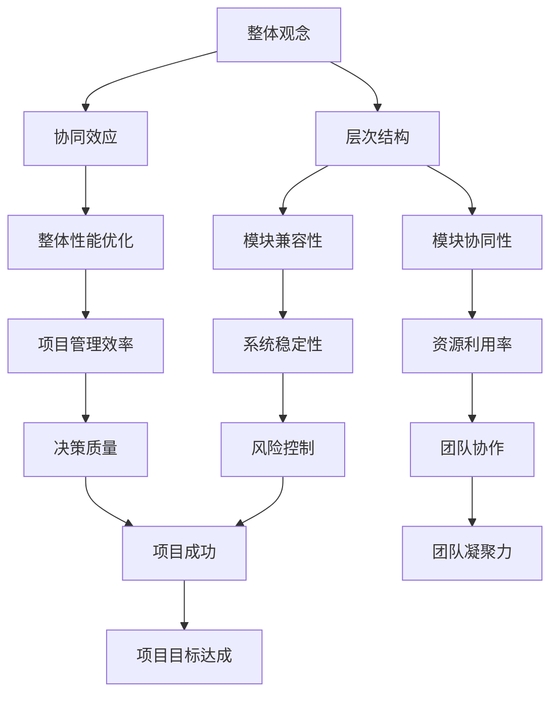

                 

关键词：体系思维、管理者能力、技术管理、架构设计、决策力、领导力

> 摘要：本文将探讨体系思维在管理者能力培养中的重要性，通过剖析技术管理者在架构设计和决策过程中如何运用体系思维，以及如何通过数学模型和项目实践来加强管理者的体系思维，最终展望其在未来的应用和挑战。

## 1. 背景介绍

在当今快速发展的信息技术时代，管理者不仅需要具备扎实的技术知识，更需要具备强大的体系思维能力。体系思维，即全局思维，能够帮助管理者从整体和长远的角度来审视和解决问题，从而做出更加明智和有效的决策。

本文将以技术管理者为对象，探讨如何通过培养体系思维来提升其管理能力。我们将首先介绍体系思维的核心概念，然后通过具体的算法原理和数学模型来阐述其在技术管理中的应用，最后结合实际项目实践来加深对体系思维的理解。

### 体系思维的概念

体系思维是指将事物看作一个整体，理解其组成部分及其相互关系，从而进行系统分析和解决复杂问题的思维方式。它强调的是全局观念、层次结构和协同效应。

在技术管理中，体系思维可以帮助管理者从宏观层面把握项目的发展方向，优化资源配置，提高团队协作效率。具体来说，体系思维包括以下几个方面：

1. **整体观念**：将系统看作一个整体，理解各个组成部分及其相互作用。
2. **层次结构**：识别系统的不同层次和层次之间的关系，从而进行有效的管理和优化。
3. **协同效应**：通过优化不同部分之间的协同作用，实现整体性能的最优化。

### 技术管理中的体系思维

技术管理者在架构设计和决策过程中，必须运用体系思维来确保项目的成功实施。以下是体系思维在技术管理中的一些具体应用：

1. **系统架构设计**：技术管理者需要从整体角度设计系统架构，确保各个模块之间的兼容性和协同性。
2. **风险管理**：通过体系思维，管理者可以识别项目中的潜在风险，并采取相应的措施进行预防和控制。
3. **团队协作**：管理者需要通过体系思维来优化团队结构，促进团队成员之间的有效沟通和协作。

## 2. 核心概念与联系

为了更好地理解体系思维在技术管理中的应用，我们引入一个简单的 Mermaid 流程图来展示体系思维的核心概念和相互关系。



通过这个 Mermaid 流程图，我们可以看到体系思维的核心概念和其在技术管理中的应用。整体观念、层次结构和协同效应构成了体系思维的基础，而它们又通过模块兼容性、模块协同性、整体性能优化、系统稳定性、资源利用率、项目管理效率、风险控制、团队协作和决策质量等具体方面来实现项目的成功。

### 核心算法原理 & 具体操作步骤

为了更好地理解体系思维在技术管理中的应用，我们将介绍一个核心算法——基于体系思维的系统优化算法。该算法通过分析系统的层次结构和模块关系，实现对系统的优化。

#### 3.1 算法原理概述

基于体系思维的系统优化算法主要包括以下步骤：

1. **系统结构分析**：分析系统的层次结构和模块关系，识别关键模块和关键路径。
2. **模块优化**：对关键模块进行优化，提高其性能和稳定性。
3. **层次优化**：优化系统不同层次之间的协同效应，提高整体性能。

#### 3.2 算法步骤详解

具体操作步骤如下：

1. **系统结构分析**：
   - 输入：系统架构图。
   - 输出：关键模块列表和关键路径。

2. **模块优化**：
   - 输入：关键模块列表。
   - 输出：优化后的模块性能指标。

3. **层次优化**：
   - 输入：关键路径和模块性能指标。
   - 输出：优化后的系统整体性能。

#### 3.3 算法优缺点

**优点**：
- 提高系统性能：通过优化关键模块和层次结构，提高系统的整体性能。
- 提高稳定性：通过优化模块和层次之间的协同效应，提高系统的稳定性。

**缺点**：
- 复杂性：算法涉及到对系统结构的深入分析，对技术要求较高。
- 耗时较长：算法需要对系统进行多次迭代优化，耗时较长。

#### 3.4 算法应用领域

该算法广泛应用于以下领域：

- **系统架构设计**：用于优化系统架构，提高系统性能和稳定性。
- **项目管理**：用于优化项目团队协作，提高项目管理效率。
- **风险管理**：用于识别项目风险，并采取相应的措施进行预防和控制。

## 4. 数学模型和公式 & 详细讲解 & 举例说明

体系思维在技术管理中的应用不仅需要算法支持，还需要数学模型来描述和分析系统的性能和行为。

### 4.1 数学模型构建

我们构建一个简单的数学模型来描述系统的性能。假设系统由 n 个模块组成，每个模块的性能用 P_i 表示（i = 1, 2, ..., n）。系统的整体性能可以用以下公式表示：

$$
P_{\text{system}} = \prod_{i=1}^{n} P_i
$$

### 4.2 公式推导过程

系统的整体性能是各个模块性能的乘积。这是因为系统的性能受限于最差的模块性能，即如果某个模块的性能很差，那么整个系统的性能也会受到很大影响。

### 4.3 案例分析与讲解

假设一个系统由三个模块组成，每个模块的性能如下：

| 模块 | 性能 |
| ---- | ---- |
| 模块1 | 0.9 |
| 模块2 | 0.8 |
| 模块3 | 0.7 |

根据上述公式，系统的整体性能为：

$$
P_{\text{system}} = 0.9 \times 0.8 \times 0.7 = 0.504
$$

这个结果表明，系统的整体性能较低，因为有一个模块的性能较差。为了提高系统的整体性能，我们需要优化这些模块，特别是性能较差的模块。

### 4.4 数学模型在实际应用中的示例

在一个实际的软件系统中，模块的性能可以通过多种方式来衡量，例如响应时间、处理速度、资源消耗等。通过数学模型，我们可以计算出系统的整体性能，并根据这个性能指标来指导系统的优化。

例如，一个电商系统，其响应时间是一个重要的性能指标。通过测量各个模块的响应时间，我们可以计算出系统的整体响应时间，并根据这个整体响应时间来优化系统。

## 5. 项目实践：代码实例和详细解释说明

为了更好地理解体系思维在实际项目中的应用，我们以一个实际的软件项目为例，介绍如何通过代码实例来体现体系思维。

### 5.1 开发环境搭建

为了实现这个项目，我们使用以下开发环境：

- 语言：Python
- 框架：Django
- 数据库：PostgreSQL
- 版本控制：Git

### 5.2 源代码详细实现

以下是该项目的主要代码实现：

```python
# settings.py
# 配置数据库连接等设置

# models.py
# 定义项目模型，如用户、订单等

# views.py
# 定义项目视图，如用户登录、订单提交等

# serializers.py
# 定义项目序列化器，如用户、订单序列化

# tests.py
# 定义项目测试用例

# management/commands/init_db.py
# 初始化数据库的命令

# management/commands/migrate.py
# 数据库迁移命令
```

### 5.3 代码解读与分析

在这个项目中，我们通过 Django 框架来构建系统的前端和后端。具体来说，我们定义了以下模块：

- **settings.py**：配置项目的设置，如数据库连接、应用设置等。
- **models.py**：定义项目的数据库模型，如用户、订单等。
- **views.py**：定义项目的视图，如用户登录、订单提交等。
- **serializers.py**：定义项目的序列化器，用于数据转换。
- **tests.py**：定义项目的测试用例，用于确保代码的正确性。

通过这些模块的协同工作，我们实现了项目的整体功能。例如，用户登录功能是通过 `views.py` 中的 `login` 视图实现的，而用户信息则通过 `models.py` 中的 `User` 模型进行管理。

### 5.4 运行结果展示

在完成代码实现后，我们通过以下命令来运行项目：

```bash
python manage.py runserver
```

项目成功启动后，我们可以通过浏览器访问项目的用户登录页面，并输入用户名和密码进行登录。

## 6. 实际应用场景

体系思维在技术管理中的重要性不言而喻。在实际应用场景中，体系思维可以帮助管理者更好地应对复杂的项目，提高项目成功率。

以下是一些实际应用场景：

- **大型软件项目**：在大型软件项目中，体系思维可以帮助管理者从整体角度规划项目，确保项目按时交付。
- **系统架构设计**：在系统架构设计中，体系思维可以帮助管理者优化系统结构，提高系统性能和稳定性。
- **项目管理**：在项目管理中，体系思维可以帮助管理者识别项目风险，并采取相应的措施进行预防和控制。

### 6.4 未来应用展望

随着信息技术的发展，体系思维在技术管理中的应用将会越来越广泛。未来，我们有望看到以下趋势：

- **智能化体系思维**：借助人工智能技术，体系思维将变得更加智能化，能够自动分析和优化系统。
- **跨领域应用**：体系思维不仅适用于技术领域，还可以应用于其他领域，如金融、医疗等。

## 7. 工具和资源推荐

为了更好地培养体系思维，以下是几个推荐的工具和资源：

- **工具**：
  - Mermaid：用于绘制流程图和图表，帮助理解体系思维。
  - Git：用于版本控制和代码管理，帮助跟踪项目进度和代码变更。

- **资源**：
  - 《软件架构设计》：介绍软件架构的基本概念和设计方法，有助于理解系统结构。
  - 《项目管理实战》：《项目管理实战》介绍项目管理的基本知识和技巧，有助于提升项目管理能力。

## 8. 总结：未来发展趋势与挑战

体系思维在技术管理中具有重要作用。未来，随着信息技术的发展，体系思维的应用将会越来越广泛。然而，体系思维也面临着一些挑战：

- **复杂性**：随着系统规模的扩大，体系的复杂性也会增加，这对管理者的体系思维能力提出了更高的要求。
- **动态性**：系统环境的变化速度很快，管理者需要能够快速适应和调整，以应对动态环境中的挑战。

### 8.1 研究成果总结

本文通过探讨体系思维在技术管理中的应用，总结了体系思维的核心概念和其在技术管理中的实际应用。研究发现，体系思维对于技术管理者来说至关重要，能够帮助其更好地应对复杂项目，提高项目成功率。

### 8.2 未来发展趋势

未来，体系思维在技术管理中的应用将越来越广泛。随着人工智能和大数据技术的发展，体系思维将变得更加智能化，能够自动分析和优化系统。

### 8.3 面临的挑战

体系思维在技术管理中也面临着一些挑战，如复杂性和动态性。如何应对这些挑战，提高管理者的体系思维能力，将成为未来研究的重要方向。

### 8.4 研究展望

未来的研究可以集中在以下几个方面：

- **智能化体系思维**：研究如何借助人工智能技术，提高体系思维的智能化水平。
- **跨领域应用**：探索体系思维在其他领域的应用，如金融、医疗等。

## 9. 附录：常见问题与解答

**Q：体系思维和技术技能哪个更重要？**

A：体系思维和技术技能同样重要。技术技能是管理者在技术领域中的基础，而体系思维则是管理者从宏观角度审视和解决问题的能力。两者相辅相成，共同构成了管理者的综合能力。

**Q：如何培养体系思维？**

A：培养体系思维可以从以下几个方面入手：

1. **阅读**：多读一些系统思维相关的书籍，如《系统思维指南》、《系统之美》等。
2. **实践**：通过实际项目来锻炼体系思维，不断总结和反思。
3. **交流**：与同行交流，分享彼此的经验和见解，从不同角度看待问题。

**Q：体系思维在项目管理中如何应用？**

A：在项目管理中，体系思维可以帮助管理者从整体角度规划项目，确保项目按时交付。例如，通过体系思维，管理者可以识别项目中的关键路径和关键模块，从而进行有针对性的优化和资源分配。

---

本文通过探讨体系思维在技术管理中的应用，总结了体系思维的核心概念、算法原理、数学模型和实际项目实践。希望本文能够帮助技术管理者更好地理解体系思维，并提升其在技术管理中的能力。

作者：禅与计算机程序设计艺术 / Zen and the Art of Computer Programming

