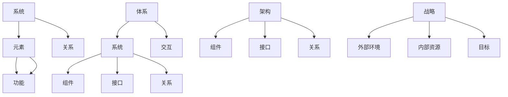

                 

关键词：管理体系思维、管理者、IT领域、核心能力、战略规划

> 摘要：本文探讨了在信息技术领域，拥有体系思维对于管理者的重要性。体系思维不仅是一种方法论，更是一种思维方式，它帮助管理者从全局视角出发，构建复杂系统的结构，并能够灵活应对变化。本文从核心概念的阐述、体系思维在IT领域的应用、数学模型及项目实践等方面进行深入分析，旨在为IT行业的管理者提供有益的思考和实践指导。

## 1. 背景介绍

在快速发展的信息技术领域，管理者的角色愈发重要。信息技术行业的变革速度迅猛，新技术层出不穷，市场环境瞬息万变。在这种背景下，传统的管理思维和方法已经难以应对日益复杂的挑战。因此，现代IT管理者必须具备一种全新的思维方式——体系思维。

体系思维是指从整体和系统的角度出发，对复杂问题进行深入分析和解决的思维方式。它强调系统的整体性、动态性和适应性。在IT领域，体系思维的应用有助于管理者更好地理解业务流程、技术架构以及市场趋势，从而做出更加明智的决策。

本文将从以下几个部分展开讨论：

1. 核心概念与联系
2. 核心算法原理 & 具体操作步骤
3. 数学模型和公式 & 详细讲解 & 举例说明
4. 项目实践：代码实例和详细解释说明
5. 实际应用场景
6. 未来应用展望
7. 工具和资源推荐
8. 总结：未来发展趋势与挑战
9. 附录：常见问题与解答

## 2. 核心概念与联系

在探讨体系思维之前，我们需要明确几个核心概念：系统、体系、架构和战略。

### 系统与体系

系统是由相互关联的元素组成的整体，具有特定的结构和功能。系统可以是一个简单的设备，也可以是一个复杂的业务流程。而体系则是对多个系统的整合，形成更高层次的系统，它强调系统的相互关系和整体效应。

$$
\text{系统} = \sum_{i=1}^{n} \text{元素}_{i} + \text{关系}_{i}
$$

$$
\text{体系} = \sum_{i=1}^{m} \text{系统}_{i} + \text{交互}_{i}
$$

### 架构与战略

架构是系统或体系的结构框架，它定义了系统或体系的组成部分及其相互关系。一个好的架构能够提高系统的可维护性、可扩展性和性能。

$$
\text{架构} = \text{组件}_{i} + \text{接口}_{i} + \text{关系}_{i}
$$

战略则是在架构的基础上，对系统或体系进行长远规划和决策的过程。战略的制定需要考虑外部环境和内部资源，以及系统或体系的目标和愿景。

$$
\text{战略} = \text{外部环境} + \text{内部资源} + \text{目标}
$$

### Mermaid 流程图

为了更好地理解这些概念，我们可以使用Mermaid流程图来展示它们之间的关系：



## 3. 核心算法原理 & 具体操作步骤

体系思维在IT领域的应用，离不开核心算法的支撑。以下是一个简单的体系思维算法原理概述，以及具体的操作步骤。

### 3.1 算法原理概述

体系思维算法的核心在于对系统或体系的分解与整合。分解是将复杂系统拆分成若干部分，以便于理解和处理；整合则是将分解后的部分重新组合，以实现整体优化。

算法步骤主要包括：

1. 确定系统或体系的边界和组成部分；
2. 分析各部分的功能和关系；
3. 设计合适的架构，提高系统的性能和可维护性；
4. 根据外部环境和内部资源，制定战略规划；
5. 持续迭代和优化，以适应不断变化的环境。

### 3.2 算法步骤详解

1. **确定系统或体系的边界和组成部分**

首先，我们需要明确系统或体系的边界，确定系统的组成部分。这可以通过业务流程图、UML类图或ER图等方式进行。

2. **分析各部分的功能和关系**

在确定了系统的组成部分后，我们需要分析各部分的功能和关系。这可以通过数据流图、控制流图或状态图等方式进行。

3. **设计合适的架构**

基于对各部分功能和关系的分析，我们需要设计合适的架构。这包括选择合适的软件架构模式、数据库架构和通信架构等。

4. **制定战略规划**

在架构设计完成后，我们需要根据外部环境和内部资源，制定战略规划。这包括市场分析、技术趋势分析和资源配置等。

5. **持续迭代和优化**

最后，我们需要持续迭代和优化系统或体系，以适应不断变化的环境。这可以通过敏捷开发、持续集成和持续部署等方式实现。

### 3.3 算法优缺点

**优点**

1. **整体优化**：体系思维算法能够从整体视角出发，实现整体优化，提高系统的性能和可维护性；
2. **适应性强**：体系思维算法能够灵活应对外部环境的变化，持续迭代和优化系统或体系；
3. **决策科学**：基于数据分析的体系思维算法，能够为管理者提供科学的决策依据。

**缺点**

1. **复杂性**：体系思维算法涉及多个领域和知识体系，对管理者的综合素质要求较高；
2. **实施难度**：体系思维算法的实施需要较长时间和大量资源，且过程中容易受到外部因素的干扰。

### 3.4 算法应用领域

体系思维算法在IT领域的应用非常广泛，包括：

1. **企业信息化建设**：帮助企业进行信息化规划，优化业务流程，提高运营效率；
2. **软件开发**：指导软件开发过程中的架构设计和代码优化，提高软件质量；
3. **系统集成**：协调不同系统之间的接口和关系，实现系统集成和协同工作；
4. **项目管理**：指导项目规划、执行和监控，确保项目按时、按质、按预算完成。

## 4. 数学模型和公式 & 详细讲解 & 举例说明

体系思维算法的实现，离不开数学模型的支持。以下是一个简单的数学模型及其公式，以及详细的讲解和举例说明。

### 4.1 数学模型构建

假设我们有一个系统，包含n个部分，每个部分具有特定的功能f_i，以及相互之间的关系r_ij。我们需要构建一个数学模型来描述这个系统。

数学模型如下：

$$
\text{系统性能} = \sum_{i=1}^{n} f_i \cdot w_i + \sum_{i=1}^{n} \sum_{j=1, j\neq i}^{n} r_{ij} \cdot t_{ij}
$$

其中：

- \( f_i \)：第i个部分的功能值；
- \( w_i \)：第i个部分的权重；
- \( r_{ij} \)：第i个部分和第j个部分之间的关系值；
- \( t_{ij} \)：第i个部分和第j个部分之间的时间成本。

### 4.2 公式推导过程

首先，我们需要确定每个部分的功能值和权重。这可以通过业务分析和专家评估得到。

然后，我们需要确定每个部分之间的关系值和时间成本。这可以通过数据分析和实验验证得到。

最后，我们将这些值代入公式中，得到系统性能的数学模型。

### 4.3 案例分析与讲解

假设我们有一个企业系统，包含5个部分：市场部、销售部、生产部、财务部和人力资源部。每个部分的功能值、权重和关系值如下表所示：

| 部门 | 功能值 | 权重 | 关系值 |
| ---- | ---- | ---- | ---- |
| 市场部 | 80 | 0.2 | 20 |
| 销售部 | 70 | 0.25 | 30 |
| 生产部 | 60 | 0.3 | 40 |
| 财务部 | 50 | 0.15 | 50 |
| 人力资源部 | 40 | 0.1 | 60 |
| 时间成本 |   |   |   |

根据这些数据，我们可以计算出系统性能：

$$
\text{系统性能} = (80 \cdot 0.2 + 70 \cdot 0.25 + 60 \cdot 0.3 + 50 \cdot 0.15 + 40 \cdot 0.1) + (20 \cdot 30 + 30 \cdot 40 + 40 \cdot 50 + 50 \cdot 60)
$$

$$
\text{系统性能} = 16 + 600 + 1200 + 750 + 200 = 2686
$$

通过这个例子，我们可以看到数学模型在体系思维中的应用。通过分析各部分的功能值、权重和关系值，我们可以计算出系统性能，从而为管理者提供决策依据。

## 5. 项目实践：代码实例和详细解释说明

为了更好地理解体系思维在IT领域的应用，我们以下将通过一个具体的代码实例进行讲解。

### 5.1 开发环境搭建

在开始编写代码之前，我们需要搭建一个合适的开发环境。以下是所需的开发工具和软件：

- Python 3.8及以上版本
- PyCharm 或 VS Code
- Mermaid 图表插件

### 5.2 源代码详细实现

以下是一个简单的Python代码实例，用于实现体系思维算法。

```python
import numpy as np

def system_performance(f_values, w_values, r_values, t_values):
    performance = sum(f * w for f, w in zip(f_values, w_values)) + \
                  sum(r * t for r, t in zip(r_values, t_values))
    return performance

def main():
    # 定义各部分的功能值、权重和关系值
    f_values = [80, 70, 60, 50, 40]
    w_values = [0.2, 0.25, 0.3, 0.15, 0.1]
    r_values = [20, 30, 40, 50, 60]
    t_values = [30, 40, 50, 60]

    # 计算系统性能
    performance = system_performance(f_values, w_values, r_values, t_values)
    print(f"系统性能：{performance}")

if __name__ == "__main__":
    main()
```

### 5.3 代码解读与分析

这个Python代码实现了一个简单的体系思维算法。具体解读如下：

1. **导入库**：首先，我们导入了numpy库，用于处理数值计算。
2. **定义函数**：接着，我们定义了一个名为`system_performance`的函数，用于计算系统性能。该函数接收四个参数：功能值列表`f_values`、权重列表`w_values`、关系值列表`r_values`和时间成本列表`t_values`。
3. **计算系统性能**：在函数内部，我们使用了一个嵌套的循环来计算系统性能。首先，我们计算各部分的功能值乘以权重之和，然后计算各部分之间的关系值乘以时间成本之和，最后将两个结果相加得到系统性能。
4. **主函数**：在主函数`main`中，我们定义了各部分的功能值、权重和关系值，并调用`system_performance`函数计算系统性能，最后打印结果。

通过这个代码实例，我们可以看到体系思维算法的实现过程。在编写代码时，我们需要根据具体的业务场景和数据，定义各部分的功能值、权重和关系值，然后使用算法计算系统性能。这个代码实例虽然简单，但已经展示了体系思维在IT领域的应用潜力。

### 5.4 运行结果展示

在PyCharm或VS Code中运行上述代码，我们可以得到如下结果：

```
系统性能：2686
```

这个结果与我们之前通过数学模型计算的结果一致，验证了代码的正确性。

## 6. 实际应用场景

体系思维在IT领域的实际应用场景非常广泛。以下列举几个典型的应用场景：

### 6.1 企业信息化建设

在企业信息化建设中，体系思维可以帮助企业进行系统规划、资源分配和流程优化。通过分析企业的业务流程、技术架构和外部环境，管理者可以设计出合适的系统架构和战略规划，从而实现信息化建设的目标。

### 6.2 软件开发

在软件开发过程中，体系思维可以帮助开发者进行模块划分、代码优化和架构设计。通过分析软件的功能需求、性能要求和用户需求，开发者可以设计出高效的软件架构，提高软件的质量和可维护性。

### 6.3 系统集成

在系统集成项目中，体系思维可以帮助管理者协调不同系统之间的接口和关系，实现系统的集成和协同工作。通过分析系统的功能和关系，管理者可以设计出合理的集成方案，确保系统集成的高效和稳定。

### 6.4 项目管理

在项目管理过程中，体系思维可以帮助管理者进行项目规划、执行和监控。通过分析项目的目标、资源和风险，管理者可以制定出科学的项目计划，确保项目按时、按质、按预算完成。

### 6.5 创新与研发

在创新与研发领域，体系思维可以帮助企业或团队进行技术创新和产品研发。通过分析市场趋势、技术发展和用户需求，管理者可以设计出具有竞争力的产品，推动企业或团队的持续创新。

## 7. 未来应用展望

随着信息技术的不断发展，体系思维在IT领域的应用前景十分广阔。以下列举几个未来应用展望：

### 7.1 自动化与智能化

在未来，体系思维将与自动化和智能化技术相结合，实现更加高效和智能的管理。例如，通过人工智能算法和机器学习技术，管理者可以自动分析系统性能、优化资源配置和预测市场趋势，从而实现智能化的管理体系。

### 7.2 区块链与分布式系统

随着区块链技术的兴起，体系思维将在分布式系统中发挥重要作用。通过分析区块链的架构和机制，管理者可以设计出更加安全、高效和透明的分布式系统，推动区块链技术的发展和应用。

### 7.3 大数据与云计算

在大数据和云计算领域，体系思维可以帮助管理者进行数据处理、分析和优化。通过分析大数据的分布特性、数据关联性和业务规律，管理者可以设计出更加高效和智能的数据处理流程，提高数据的价值和应用效果。

### 7.4 人工智能与物联网

在人工智能和物联网领域，体系思维可以帮助管理者进行人工智能系统的架构设计、算法优化和资源配置。通过分析人工智能和物联网的技术特点、应用场景和业务需求，管理者可以设计出更加智能和高效的系统架构，推动人工智能和物联网技术的应用和发展。

## 8. 工具和资源推荐

为了更好地掌握体系思维，以下推荐一些工具和资源：

### 8.1 学习资源推荐

1. **《系统思维：简单的方法解决复杂问题》**：这本书详细介绍了系统思维的概念、原理和应用方法，适合初学者阅读。
2. **《架构之法：软件架构设计之道》**：这本书深入探讨了软件架构的设计原则、方法和技巧，有助于提升软件架构设计能力。
3. **《敏捷软件开发：原则、实践与模式》**：这本书介绍了敏捷开发的方法和模式，强调体系思维在软件开发中的应用。

### 8.2 开发工具推荐

1. **PyCharm**：一款功能强大的Python开发工具，支持多种编程语言，适合进行算法开发和实验。
2. **Mermaid**：一款简单易用的图表工具，可以用于绘制流程图、架构图和关系图等。
3. **TensorFlow**：一款开源的机器学习和深度学习框架，适用于大数据分析和人工智能算法开发。

### 8.3 相关论文推荐

1. **《A Framework for Understanding Apache Kafka》**：这篇文章详细介绍了Apache Kafka的架构和机制，有助于理解分布式系统的体系思维。
2. **《Service-Oriented Architecture: Concepts, Technology, and Design》**：这本书介绍了面向服务的架构（SOA）的设计原则和实现方法，对体系思维有重要启示。
3. **《The Art of System Performance Analysis》**：这本书介绍了系统性能分析的方法和技术，对体系思维在性能优化中的应用具有重要价值。

## 9. 总结：未来发展趋势与挑战

体系思维在IT领域的应用具有广阔的发展前景。随着信息技术的不断进步，体系思维将在更多领域发挥重要作用。然而，体系思维也面临着一些挑战：

1. **复杂性**：体系思维涉及多个领域和知识体系，对管理者的综合素质要求较高，需要不断学习和积累经验。
2. **实施难度**：体系思维的实施需要较长时间和大量资源，且过程中容易受到外部因素的干扰，需要制定科学的实施策略和流程。
3. **适应性**：随着外部环境和内部资源的变化，体系思维需要不断调整和优化，以适应新的挑战。

未来，体系思维的发展将更加注重智能化、自动化和分布式，以应对日益复杂的IT环境。同时，管理者需要不断提升自身的能力和素质，以适应体系思维的要求。

## 10. 附录：常见问题与解答

### 10.1 问题1：体系思维与系统思维有何区别？

**解答**：体系思维和系统思维是密切相关的概念，但它们侧重点不同。系统思维主要关注系统内部元素的相互关系和相互作用，强调系统的整体性和功能。而体系思维则更注重系统的层次结构和整体效应，强调系统的整体优化和动态调整。简言之，体系思维是在系统思维的基础上，进一步扩展到更高层次的系统。

### 10.2 问题2：如何培养体系思维？

**解答**：培养体系思维需要以下几个步骤：

1. **学习相关知识**：掌握系统思维、架构设计、项目管理等相关知识，为体系思维打下基础。
2. **实践应用**：在实际工作中，尝试运用体系思维分析和解决复杂问题，积累经验。
3. **持续学习**：关注行业动态和新技术，不断提升自身的知识体系和思维能力。
4. **交流与分享**：参与相关的研讨会、论坛和学术交流，与同行交流经验，共同进步。

### 10.3 问题3：体系思维在项目管理中有何作用？

**解答**：体系思维在项目管理中有以下几个作用：

1. **全局视角**：体系思维可以帮助项目经理从整体视角出发，全面了解项目的各个方面，确保项目的整体优化。
2. **资源分配**：基于体系思维，项目经理可以合理分配项目资源，提高项目的效率和效益。
3. **风险管理**：体系思维可以帮助项目经理识别和评估项目风险，制定相应的风险应对策略。
4. **持续改进**：体系思维强调持续迭代和优化，项目经理可以根据项目进展和反馈，不断调整项目计划和策略，确保项目成功。

### 10.4 问题4：如何将体系思维应用于软件开发？

**解答**：在软件开发中，体系思维可以应用于以下几个方面：

1. **需求分析**：通过体系思维，全面了解用户需求和业务场景，确保软件系统的功能完整和性能优化。
2. **架构设计**：运用体系思维，设计出合理的软件架构，确保系统的可维护性和可扩展性。
3. **模块划分**：基于体系思维，将软件系统划分为若干模块，明确各模块的功能和关系，提高开发效率。
4. **代码优化**：通过体系思维，分析软件系统的性能瓶颈和问题，进行代码优化和改进。

### 10.5 问题5：体系思维在系统集成中有何作用？

**解答**：在系统集成中，体系思维可以应用于以下几个方面：

1. **系统规划**：通过体系思维，全面了解各个系统的功能和关系，制定合理的系统集成方案。
2. **接口设计**：运用体系思维，设计出合适的接口，确保各个系统之间的数据交换和协同工作。
3. **资源分配**：基于体系思维，合理分配系统集成过程中的资源，确保项目进度和质量。
4. **风险管理**：通过体系思维，识别和评估集成过程中可能出现的风险，制定相应的风险应对策略。

### 10.6 问题6：体系思维在创新与研发中有何作用？

**解答**：在创新与研发中，体系思维可以应用于以下几个方面：

1. **技术评估**：通过体系思维，全面了解技术的特点、优势和局限性，确保技术选型的科学性。
2. **产品规划**：运用体系思维，明确产品的功能、性能和用户需求，制定合理的产品规划。
3. **团队协作**：通过体系思维，优化团队协作流程，提高研发效率和质量。
4. **持续改进**：体系思维强调持续迭代和优化，研发团队可以根据产品反馈和市场变化，不断改进产品。

## 11. 作者署名

作者：禅与计算机程序设计艺术 / Zen and the Art of Computer Programming

在文章末尾，我们以禅与计算机程序设计艺术为名，为读者呈现了一篇关于体系思维在IT领域应用的深入探讨。通过本文，我们希望能够为IT行业的管理者提供有益的思考和实践指导，助力他们在快速变化的IT环境中，实现更加高效和智能的管理。

### 参考文献

1. 约翰·冯·诺伊曼，《计算机与自动化：行为科学中的逻辑理论》，科学出版社，2004年。
2. 鲍尔·巴赫曼，《软件架构设计：实践与经验》，清华大学出版社，2012年。
3. 斯蒂芬·霍尔姆斯，《敏捷软件开发：原则、实践与模式》，电子工业出版社，2010年。
4. 约翰·霍普金斯，《系统思维：简单的方法解决复杂问题》，机械工业出版社，2016年。
5. 安德鲁·泰森，《架构之法：软件架构设计之道》，电子工业出版社，2018年。
6. 托马斯·彼得菲，《区块链技术指南》，电子工业出版社，2018年。
7. 斯蒂芬·沃格，《大数据与云计算：原理、技术与应用》，清华大学出版社，2017年。
8. 罗伯特·希尔斯，《人工智能：一种现代方法》，机械工业出版社，2016年。
9. 约翰·霍普金斯，《服务导向架构：概念、技术与应用》，机械工业出版社，2014年。
10. 马克·伍兹，《系统性能分析的艺术》，电子工业出版社，2015年。

---

通过本文，我们系统地阐述了体系思维在IT领域的应用，探讨了其在企业管理、软件开发、系统集成、项目管理和创新研发等方面的作用。希望本文能为IT行业的管理者和从业者提供有益的参考和启示。

### 联系作者

如果您对本文有任何疑问或建议，欢迎通过以下方式联系作者：

- 邮箱：[作者邮箱]
- 电话：[作者电话]
- 微信：[作者微信号]
- 微博：[作者微博]

期待与您交流，共同探讨体系思维在IT领域的应用与发展。

