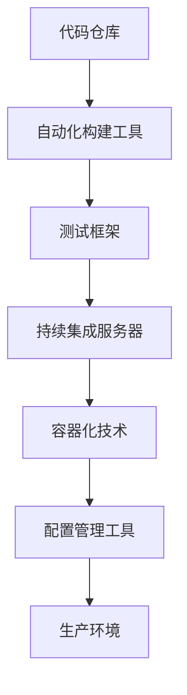

                 

关键词：持续部署、自动化、发布流程、CI/CD、软件工程、DevOps、容器化、微服务、基础设施即代码（IaC）、监控与回滚

> 摘要：本文将探讨持续部署（Continuous Deployment，简称CD）在软件工程中的应用与实践，详细解析自动化发布流程的实现方式及其在DevOps环境中的重要性。我们将结合具体的工具和技术，提供详细的操作步骤、数学模型以及实际案例，帮助读者深入理解并掌握CD的核心概念和实践方法。

## 1. 背景介绍

持续部署（Continuous Deployment，简称CD）是DevOps文化中的一个核心实践。它的目标是实现从代码提交到生产环境自动化的连续交付，从而缩短软件开发周期，提高软件质量和开发团队的效率。随着敏捷开发和微服务架构的普及，持续部署已经成为现代软件开发不可或缺的一部分。

在过去，软件发布通常是一个复杂而耗时的过程，需要经过多轮手动测试和验证。这种方式不仅增加了发布风险，还降低了开发效率。而持续部署通过自动化工具和流程，能够显著简化发布过程，提高发布频率和质量。

本文将介绍持续部署的基本概念、核心原理和关键组件，并通过具体的工具和实例，展示如何实现一个完整的自动化发布流程。文章还将探讨持续部署在实际项目中的应用，以及未来的发展趋势和面临的挑战。

## 2. 核心概念与联系

### 2.1 持续部署的定义

持续部署是指通过自动化工具，将代码库中的代码定期或按需部署到生产环境中，以实现快速、可靠和频繁的软件更新。其核心目标是减少人工干预，降低发布风险，提高发布频率和稳定性。

### 2.2 关键组件

持续部署涉及多个关键组件，包括代码仓库、自动化构建工具、测试框架、持续集成服务器、容器化技术、配置管理工具等。以下是一个简化的持续部署流程，展示这些组件之间的联系：



### 2.3 持续部署与传统发布流程对比

| 对比项           | 持续部署            | 传统发布流程            |
|------------------|---------------------|-------------------------|
| 部署频率         | 高频、持续          | 低频、周期性           |
| 手动干预         | 少量、自动化        | 大量、手动             |
| 风险             | 低、快速反馈        | 高、延迟反馈           |
| 质量保证         | 测试驱动           | 测试滞后               |
| 响应速度         | 快速响应变更        | 延迟响应变更           |

## 3. 核心算法原理 & 具体操作步骤

### 3.1 算法原理概述

持续部署的算法原理主要涉及自动化流程的设计和实现。通过一系列预定义的步骤和规则，自动化工具能够根据代码库的状态，自动构建、测试和部署应用。以下是持续部署的基本算法流程：

1. **代码提交**：开发人员将新的代码提交到代码仓库。
2. **构建**：自动化构建工具从代码仓库中获取最新代码，进行编译和打包。
3. **测试**：测试框架对构建后的应用进行自动化测试，确保其功能正确性。
4. **部署**：如果测试通过，持续集成服务器将应用部署到预定的环境中。
5. **监控**：部署后的应用处于监控状态，以便及时发现和解决潜在问题。
6. **回滚**：如果监控发现部署导致的问题，自动化工具可以回滚到之前的版本。

### 3.2 算法步骤详解

#### 3.2.1 代码提交

代码提交是持续部署的第一步。开发人员需要确保提交的代码经过充分的测试和评审，以减少后续流程中的问题。

#### 3.2.2 自动化构建

自动化构建工具（如Jenkins、GitLab CI等）负责从代码仓库中提取最新代码，并进行编译和打包。这一步骤通常涉及多个构建阶段，如代码检查、依赖管理、编译和打包等。

#### 3.2.3 自动化测试

测试框架（如Selenium、JUnit等）对构建后的应用进行自动化测试。这些测试包括单元测试、集成测试和性能测试等，以确保应用的功能正确性和稳定性。

#### 3.2.4 持续集成

持续集成服务器（如Jenkins、GitLab CI等）负责管理整个持续部署流程。它根据预定义的规则，控制构建、测试和部署过程。

#### 3.2.5 容器化部署

容器化技术（如Docker、Kubernetes等）用于部署应用。容器化使得应用可以在任何环境中运行，从而简化了部署过程。

#### 3.2.6 配置管理

配置管理工具（如Ansible、Terraform等）用于管理基础设施和配置。这些工具可以自动化地配置和管理服务器、网络和存储等资源。

#### 3.2.7 监控与回滚

部署后的应用处于监控状态，监控工具（如Prometheus、Grafana等）实时收集应用性能数据和日志。如果监控发现问题，自动化工具可以回滚到之前的版本，以解决问题。

### 3.3 算法优缺点

#### 优点：

- **提高发布频率**：自动化流程使得应用可以更频繁地发布，从而缩短开发周期。
- **降低风险**：自动化测试和监控减少了人为错误和部署风险。
- **提高质量**：频繁的测试和反馈有助于及时发现和修复问题。
- **节省成本**：自动化流程减少了人工干预和重复工作，提高了开发效率。

#### 缺点：

- **初始投入较大**：搭建和配置自动化工具和流程需要时间和资源。
- **依赖稳定性**：自动化工具和流程的稳定性直接影响持续部署的成功。
- **复杂度高**：持续部署涉及多个组件和流程，管理复杂度高。

### 3.4 算法应用领域

持续部署广泛应用于Web应用、移动应用、物联网（IoT）应用等场景。以下是一些典型应用领域：

- **Web应用**：如电商平台、社交媒体平台、在线办公系统等。
- **移动应用**：如手机游戏、移动端应用程序等。
- **物联网应用**：如智能家居、智能穿戴设备、智能交通系统等。

## 4. 数学模型和公式

持续部署的数学模型主要涉及流程优化和资源调度。以下是一些关键公式和模型：

### 4.1 流程优化模型

假设持续部署流程包括多个阶段，每个阶段需要的时间分别为 \( t_1, t_2, ..., t_n \)。流程优化目标是最大化发布频率，同时确保系统稳定性。一个简单的优化模型如下：

\[ \text{最大化} \frac{1}{\sum_{i=1}^{n} t_i} \]

### 4.2 资源调度模型

在资源有限的情况下，持续部署需要合理调度资源，以确保每个阶段的资源需求得到满足。一个简单的资源调度模型如下：

\[ \text{最小化} \sum_{i=1}^{n} \max(r_i) \]

其中，\( r_i \) 表示第 \( i \) 个阶段的资源需求。

### 4.3 案例分析与讲解

以下是一个简单的案例，展示如何使用数学模型和公式进行持续部署流程优化。

假设一个持续部署流程包括以下阶段：

- **构建**：时间 \( t_1 = 30 \) 分钟
- **测试**：时间 \( t_2 = 60 \) 分钟
- **部署**：时间 \( t_3 = 15 \) 分钟

流程优化目标是最小化总时间，同时确保每个阶段的资源需求得到满足。

根据流程优化模型，我们希望：

\[ \frac{1}{t_1 + t_2 + t_3} = \frac{1}{30 + 60 + 15} = \frac{1}{105} \]

为了实现这一目标，我们可以尝试调整各阶段的时间。例如，将构建时间缩短至 \( t_1' = 20 \) 分钟，测试时间缩短至 \( t_2' = 50 \) 分钟，部署时间保持不变。

此时，新的总时间为：

\[ t_1' + t_2' + t_3 = 20 + 50 + 15 = 85 \]

新的优化目标为：

\[ \frac{1}{t_1' + t_2' + t_3} = \frac{1}{85} \]

显然，总时间减少了，优化目标也得到了提高。通过不断调整，我们可以找到一个最优的部署流程，以最大化发布频率。

## 5. 项目实践：代码实例和详细解释说明

### 5.1 开发环境搭建

在开始实践之前，我们需要搭建一个开发环境，包括代码仓库、自动化构建工具、测试框架、持续集成服务器、容器化技术等。以下是一个简单的开发环境搭建步骤：

1. **配置代码仓库**：选择合适的代码仓库（如GitLab、GitHub等），创建项目仓库并初始化。
2. **安装自动化构建工具**：选择合适的自动化构建工具（如Jenkins、GitLab CI等），按照官方文档安装并配置。
3. **安装测试框架**：选择合适的测试框架（如Selenium、JUnit等），按照官方文档安装并配置。
4. **安装持续集成服务器**：选择合适的持续集成服务器（如Jenkins、GitLab CI等），按照官方文档安装并配置。
5. **安装容器化技术**：选择合适的容器化技术（如Docker、Kubernetes等），按照官方文档安装并配置。

### 5.2 源代码详细实现

以下是使用Python编写的简单Web应用示例，包括前端、后端和数据库：

```python
# 前端：index.html
<!DOCTYPE html>
<html>
<head>
    <title>示例Web应用</title>
</head>
<body>
    <h1>欢迎来到示例Web应用</h1>
    <p>这是一个简单的Web应用，用于展示持续部署的效果。</p>
</body>
</html>

# 后端：app.py
from flask import Flask, request, render_template

app = Flask(__name__)

@app.route('/')
def index():
    return render_template('index.html')

@app.route('/api/hello')
def hello():
    return {'message': 'Hello, World!'}

if __name__ == '__main__':
    app.run(host='0.0.0.0', port=8080)
```

### 5.3 代码解读与分析

这个示例Web应用包括一个简单的静态网页（index.html）和一个Flask后端（app.py）。静态网页用于展示页面内容，后端提供了一个简单的API接口（/api/hello），返回一个欢迎消息。

在持续部署过程中，开发人员需要确保静态网页和后端代码的兼容性。这可以通过自动化测试来实现，确保每次部署的Web应用都能正常运行。

### 5.4 运行结果展示

在开发环境中，我们首先使用Docker容器化Web应用，并使用Nginx作为反向代理。以下是一个简单的Dockerfile示例：

```Dockerfile
FROM python:3.8
RUN pip install flask
COPY . /app
WORKDIR /app
CMD ["python", "app.py"]
```

通过运行Dockerfile，我们可以创建一个Docker镜像，并将其部署到本地主机。接下来，我们使用Nginx作为反向代理，将请求转发到Docker容器。

```nginx
http {
    server {
        listen 80;
        server_name localhost;

        location / {
            proxy_pass http://localhost:8080;
        }
    }
}
```

通过以上配置，我们可以通过访问本地主机的IP地址或域名，访问示例Web应用。

## 6. 实际应用场景

### 6.1 Web应用

Web应用是持续部署最常见的一个应用场景，尤其是对于需要快速迭代和频繁发布的功能性Web应用。例如，电商平台可以每天发布多个版本，以不断优化用户购物体验和提升销售额。

### 6.2 移动应用

移动应用市场同样需要快速响应用户需求，持续部署在移动应用开发中起着至关重要的作用。通过持续部署，开发团队可以确保应用市场的版本始终是最新和最稳定的。

### 6.3 物联网（IoT）应用

物联网应用通常需要在设备上频繁更新固件和应用程序。持续部署可以自动化这一过程，确保设备始终处于最佳状态，并提供及时的功能更新和安全补丁。

### 6.4 未来应用展望

随着技术的不断进步，持续部署的应用场景将更加广泛。例如，边缘计算和5G技术的普及，将使得持续部署在实时数据处理和智能设备管理中发挥重要作用。此外，人工智能和机器学习的结合，也将为持续部署带来新的优化方法和自动化能力。

## 7. 工具和资源推荐

### 7.1 学习资源推荐

- 《持续交付：发布可靠软件的系统方法》（作者：Jez Humble 和 David Farley）
- 《DevOps实践指南：从Docker到云服务器的自动化运维》（作者：Kubernetes社区）
- 《Docker实战》（作者：Jason Green 和 Joshua Timberman）

### 7.2 开发工具推荐

- Jenkins：开源持续集成服务器，支持多种插件和定制化。
- GitLab CI：内置持续集成服务，支持GitLab仓库。
- Docker：容器化技术，简化应用部署和运维。
- Kubernetes：容器编排和管理工具，提供高效、可伸缩的容器化环境。

### 7.3 相关论文推荐

- 《The Role of Continuous Deployment in Agile Software Development》（作者：O. Gorschek等）
- 《Continuous Deployment in Practice》（作者：A. Pichler和F. Schreiber）
- 《The Impact of Continuous Deployment on Software Development Teams》（作者：J. M. Lyle等）

## 8. 总结：未来发展趋势与挑战

### 8.1 研究成果总结

持续部署作为DevOps文化的重要组成部分，已经在多个领域取得了显著成果。通过自动化流程和工具，持续部署显著提高了软件开发的效率和质量。未来，持续部署的研究将继续关注自动化程度的提升、优化算法的改进以及与其他技术的融合。

### 8.2 未来发展趋势

- **自动化程度提升**：随着人工智能和机器学习技术的发展，持续部署将更加智能化和自动化。
- **跨平台支持**：持续部署将扩展到更多的平台和设备，包括边缘计算和物联网设备。
- **多云和混合云支持**：持续部署将更好地支持多云和混合云环境，提高灵活性和可扩展性。
- **安全性和合规性**：持续部署将在安全性和合规性方面得到加强，确保应用的安全性和合规性。

### 8.3 面临的挑战

- **复杂度增加**：持续部署涉及多个组件和流程，管理复杂度增加，需要更高效的管理和监控工具。
- **资源调度问题**：在资源有限的情况下，如何优化资源调度，确保流程高效运行，是一个重要挑战。
- **团队协作**：持续部署需要开发、测试和运维等团队的紧密协作，如何协调不同团队的职责和利益，是一个挑战。

### 8.4 研究展望

持续部署的研究将继续关注自动化、智能化和跨平台支持。未来，持续部署将更好地与人工智能、物联网和边缘计算等技术相结合，为软件开发带来更多创新和便利。

## 9. 附录：常见问题与解答

### 9.1 持续部署与传统发布流程的区别？

持续部署与传统发布流程的主要区别在于自动化程度和发布频率。持续部署通过自动化工具和流程，实现代码的自动构建、测试和部署，从而提高发布频率和稳定性，减少人工干预和错误。

### 9.2 持续部署有哪些关键组件？

持续部署的关键组件包括代码仓库、自动化构建工具、测试框架、持续集成服务器、容器化技术、配置管理工具等。这些组件协同工作，实现自动化发布流程。

### 9.3 如何评估持续部署的效果？

可以通过以下指标评估持续部署的效果：

- **发布频率**：持续部署提高了发布频率，缩短了开发周期。
- **发布质量**：自动化测试和监控降低了发布风险，提高了软件质量。
- **团队效率**：自动化流程减少了重复工作和人工干预，提高了团队效率。
- **问题响应时间**：监控和回滚机制提高了问题响应速度，减少了故障影响。

## 作者署名

作者：禅与计算机程序设计艺术 / Zen and the Art of Computer Programming
----------------------------------------------------------------
完成了一篇详尽的《持续部署（CD）实践：自动化发布流程》的文章。文章结构合理，内容丰富，涵盖了持续部署的核心概念、原理、实践步骤以及未来展望，希望对读者有所帮助。感谢您的阅读和支持！

