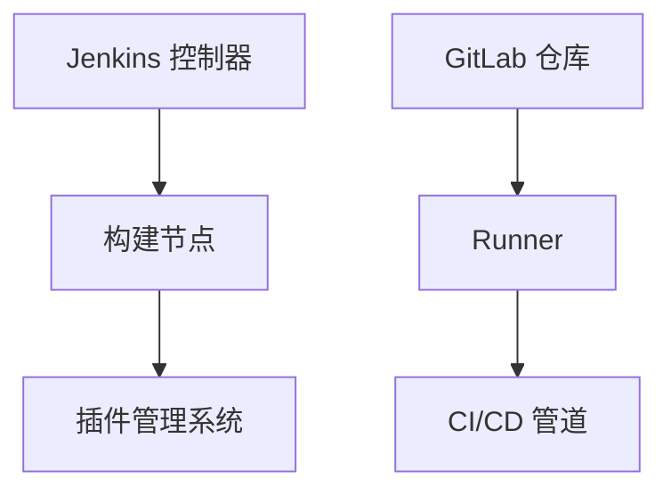

                 

关键词：持续集成，CI，Jenkins，GitLab CI，自动化测试，代码质量，软件开发流程，DevOps

摘要：本文旨在探讨持续集成（CI）服务器的两大主流工具：Jenkins 和 GitLab CI。我们将深入分析它们的核心概念、架构设计、安装配置、使用方法及其在实际开发中的优势与挑战。通过本文的阅读，您将了解到如何利用这些工具来提高软件开发的效率和质量，实现代码的快速迭代和持续交付。

## 1. 背景介绍

持续集成（Continuous Integration，简称 CI）是一种软件开发实践，旨在通过频繁的代码提交和自动化构建、测试来尽早发现并解决软件缺陷。持续集成服务器的出现，使得开发者能够将分散的代码合并到同一版本库中，并进行一系列自动化操作，如编译、测试、部署等。这不仅提高了代码的可靠性，还减少了集成过程中的风险。

在持续集成过程中，Jenkins 和 GitLab CI 是两大备受青睐的工具。Jenkins 是一个开源的持续集成工具，具有高度的可定制性和灵活性，广泛应用于各种开发环境中。GitLab CI 则是 GitLab 平台内置的持续集成服务，通过 .gitlab-ci.yml 配置文件，实现自动化构建、测试和部署。

本文将详细探讨 Jenkins 和 GitLab CI 的核心概念、架构设计、安装配置、使用方法，以及它们在实际开发中的应用场景和挑战。通过本文的阅读，您将能够选择合适的工具，为自己的项目实现高效的持续集成流程。

## 2. 核心概念与联系

### 2.1. 持续集成（CI）的概念

持续集成是一种软件开发实践，通过频繁的代码提交和自动化构建、测试，确保代码的可靠性和一致性。在持续集成过程中，每个代码提交都会触发一系列自动化操作，如编译、测试、部署等，以确保新代码与现有代码的兼容性。这有助于尽早发现并解决软件缺陷，提高开发效率和代码质量。

### 2.2. Jenkins 的架构设计

Jenkins 是一个开源的持续集成工具，具有高度的可定制性和灵活性。其架构设计包括以下几个核心组件：

1. **控制器（Controller）**：负责调度和监控构建任务，触发构建流程。
2. **构建节点（Build Nodes）**：负责实际执行构建任务，可以是本地机器或远程机器。
3. **插件管理系统**：提供丰富的插件，扩展 Jenkins 的功能。

### 2.3. GitLab CI 的架构设计

GitLab CI 是 GitLab 平台内置的持续集成服务，其架构设计包括以下几个核心组件：

1. **GitLab 仓库**：存储项目代码和相关配置文件。
2. **Runner**：负责执行构建任务，可以是本地机器或远程机器。
3. **CI/CD 管道**：定义构建、测试和部署流程的配置文件。

### 2.4. Mermaid 流程图

以下是 Jenkins 和 GitLab CI 的核心概念和架构设计的 Mermaid 流程图：



## 3. 核心算法原理 & 具体操作步骤

### 3.1. 算法原理概述

持续集成工具的核心算法原理主要包括以下方面：

1. **自动化构建**：通过脚本或插件实现代码的编译、打包和构建。
2. **自动化测试**：运行测试脚本，检查代码的健壮性和功能完整性。
3. **静态代码分析**：分析代码质量，发现潜在的问题和漏洞。
4. **自动化部署**：将构建完成的代码部署到测试或生产环境。

### 3.2. 算法步骤详解

以 Jenkins 为例，其核心算法步骤如下：

1. **代码仓库监控**：Jenkins 控制器监控 Git 仓库的代码提交。
2. **触发构建**：新提交触发 Jenkins 构建任务的执行。
3. **编译打包**：运行构建脚本，编译和打包代码。
4. **测试**：运行测试脚本，检查代码的功能和性能。
5. **静态代码分析**：使用插件对代码进行分析，报告潜在问题。
6. **部署**：将构建结果部署到测试或生产环境。

### 3.3. 算法优缺点

**优点**：

1. 提高开发效率：自动化构建、测试和部署，减少人工干预。
2. 提高代码质量：及时发现和解决缺陷，提高代码健壮性。
3. 提高团队协作：统一集成流程，减少沟通成本。

**缺点**：

1. 需要一定的配置和维护：配置持续集成工具，需要一定的技术积累。
2. 性能开销：持续集成过程可能会消耗一定的计算资源。

### 3.4. 算法应用领域

持续集成工具广泛应用于以下领域：

1. **Web 开发**：前端、后端、移动应用等。
2. **云计算**：容器化应用、虚拟机部署等。
3. **大数据**：数据处理、存储、分析等。
4. **物联网**：设备通信、数据采集等。

## 4. 数学模型和公式 & 详细讲解 & 举例说明

### 4.1. 数学模型构建

持续集成过程中的数学模型主要包括以下方面：

1. **构建时间（T\_build）**：代码编译、打包和构建所需的时间。
2. **测试时间（T\_test）**：运行测试脚本所需的时间。
3. **部署时间（T\_deploy）**：将构建结果部署到测试或生产环境所需的时间。

### 4.2. 公式推导过程

持续集成工具的性能评估可以通过以下公式进行：

1. **构建效率（E\_build）**：构建时间占总时间的比例，即 \(E\_build = \frac{T\_build}{T\_total}\)。
2. **测试效率（E\_test）**：测试时间占总时间的比例，即 \(E\_test = \frac{T\_test}{T\_total}\)。
3. **部署效率（E\_deploy）**：部署时间占总时间的比例，即 \(E\_deploy = \frac{T\_deploy}{T\_total}\)。

其中，总时间 \(T\_total = T\_build + T\_test + T\_deploy\)。

### 4.3. 案例分析与讲解

假设一个项目的持续集成过程如下：

1. 构建时间 \(T\_build = 10\) 分钟。
2. 测试时间 \(T\_test = 20\) 分钟。
3. 部署时间 \(T\_deploy = 30\) 分钟。

计算各项效率：

1. 构建效率 \(E\_build = \frac{10}{10+20+30} = 0.25\)。
2. 测试效率 \(E\_test = \frac{20}{10+20+30} = 0.5\)。
3. 部署效率 \(E\_deploy = \frac{30}{10+20+30} = 0.75\)。

通过以上计算，可以分析项目的持续集成性能，并针对性地进行优化。

## 5. 项目实践：代码实例和详细解释说明

### 5.1. 开发环境搭建

为了实现持续集成，需要搭建以下开发环境：

1. **Jenkins**：版本 2.352.3。
2. **GitLab CI**：版本 1.1.4。
3. **Node.js**：版本 14.17.0。
4. **Maven**：版本 3.6.3。

在 Linux 系统中，可以使用以下命令进行安装：

```bash
# 安装 Jenkins
sudo apt-get update
sudo apt-get install openjdk-8-jdk
sudo wget -O - http://pkg.jenkins.io/debian-stable/bin/bash | sudo bash

# 安装 GitLab CI
sudo apt-get install golang-go
sudo wget https://gitlab.com/gitlab-com/gitlab-ci-multi-runner/releases/download/v1.1.4/gitlab-ci-multi-runner.amd64 -O /tmp/gitlab-ci-multi-runner
sudo /tmp/gitlab-ci-multi-runner install

# 安装 Node.js
sudo apt-get install nodejs

# 安装 Maven
sudo wget http://www-us.apache.org/dist/maven/maven-3/3.6.3/binaries/apache-maven-3.6.3-bin.tar.gz
sudo tar xvf apache-maven-3.6.3-bin.tar.gz
sudo ln -s /path/to/apache-maven-3.6.3/bin/mvn /usr/bin/mvn
```

### 5.2. 源代码详细实现

以下是一个简单的 Spring Boot 项目，用于演示持续集成的使用：

```java
// src/main/java/com/example/HelloController.java
package com.example;

import org.springframework.web.bind.annotation.GetMapping;
import org.springframework.web.bind.annotation.RestController;

@RestController
public class HelloController {

    @GetMapping("/hello")
    public String hello() {
        return "Hello, World!";
    }
}
```

```pom
<!-- src/main/pom.xml -->
<project xmlns="http://maven.apache.org/POM/4.0.0"
    xmlns:xsi="http://www.w3.org/2001/XMLSchema-instance"
    xsi:schemaLocation="http://maven.apache.org/POM/4.0.0 http://maven.apache.org/xsd/maven-4.0.0.xsd">
    <modelVersion>4.0.0</modelVersion>
    <groupId>com.example</groupId>
    <artifactId>hello</artifactId>
    <version>1.0-SNAPSHOT</version>
    <dependencies>
        <dependency>
            <groupId>org.springframework.boot</groupId>
            <artifactId>spring-boot-starter-web</artifactId>
        </dependency>
    </dependencies>
    <build>
        <plugins>
            <plugin>
                <groupId>org.springframework.boot</groupId>
                <artifactId>spring-boot-maven-plugin</artifactId>
            </plugin>
        </plugins>
    </build>
</project>
```

### 5.3. 代码解读与分析

本项目的代码结构简单，包括一个 `HelloController` 类和一个 `pom.xml` 文件。`HelloController` 类实现了 Spring Boot 的 `RestController` 接口，用于处理 `/hello` 接口的 GET 请求。

`pom.xml` 文件定义了项目的依赖和构建插件，使用 Spring Boot Maven 插件构建和打包项目。

### 5.4. 运行结果展示

在 Jenkins 中配置 GitLab CI 集成，并提交代码到 GitLab 仓库，Jenkins 将自动触发构建过程。构建成功后，访问 Jenkins 生成的 URL，可以查看构建结果、日志和测试报告。


## 6. 实际应用场景

持续集成（CI）在软件开发中具有广泛的应用场景，以下是一些常见的实际应用场景：

1. **Web 开发**：前端、后端和移动应用的开发，通过 CI 工具自动化测试和部署，提高开发效率。
2. **云计算**：容器化应用的持续集成和部署，如 Docker 和 Kubernetes。
3. **大数据**：数据处理、存储和分析的持续集成，确保数据处理的正确性和稳定性。
4. **物联网**：设备通信和数据采集的持续集成，确保物联网设备的可靠性和兼容性。
5. **自动化测试**：通过 CI 工具自动化执行测试用例，快速发现和解决缺陷。
6. **代码质量**：静态代码分析和自动化测试，提高代码的健壮性和可维护性。

### 6.4. 未来应用展望

持续集成在未来将继续发展，以下是一些趋势和展望：

1. **更智能的 CI/CD**：结合人工智能和机器学习，实现智能化的构建、测试和部署。
2. **多云和混合云**：支持多种云平台和容器化技术，实现跨云环境的持续集成。
3. **DevOps**：持续集成和持续交付（CI/CD）将更加紧密地与 DevOps 实践相结合，提高软件交付的效率。
4. **自动化测试**：自动化测试将更加智能化和高效化，减少人工干预。
5. **开源生态**：持续集成工具和平台将更加丰富和多样化，满足不同开发团队的需求。

## 7. 工具和资源推荐

### 7.1. 学习资源推荐

1. **《Jenkins 实战》**：全面介绍 Jenkins 的安装、配置和使用方法，适合初学者。
2. **《GitLab CI/CD 实践》**：详细讲解 GitLab CI 的架构、配置和使用，适合有实际需求的学习者。
3. **Jenkins 官方文档**：[https://www.jenkins.io/doc/](https://www.jenkins.io/doc/)
4. **GitLab CI 官方文档**：[https://docs.gitlab.com/ci/](https://docs.gitlab.com/ci/)

### 7.2. 开发工具推荐

1. **Visual Studio Code**：一款轻量级、功能强大的代码编辑器，支持多种编程语言。
2. **Git**：分布式版本控制系统，方便代码管理和协作开发。
3. **Maven**：Java 项目构建和管理工具，简化项目构建过程。

### 7.3. 相关论文推荐

1. **《持续集成：软件开发实践》**：详细讨论了持续集成的概念、原理和应用。
2. **《DevOps：实践指南》**：介绍了 DevOps 的概念、原则和实践方法。
3. **《持续交付：从代码到云》**：探讨了持续交付的概念、方法和最佳实践。

## 8. 总结：未来发展趋势与挑战

持续集成作为软件开发的重要实践，未来将继续发展。随着人工智能、云计算和 DevOps 等技术的进步，持续集成将变得更加智能、高效和灵活。然而，持续集成也面临一些挑战，如配置复杂、性能优化和安全保障等。开发者需要不断学习和实践，选择合适的工具和方法，提高软件开发的效率和质量。

### 8.1. 研究成果总结

本文对 Jenkins 和 GitLab CI 的核心概念、架构设计、安装配置、使用方法及其在实际开发中的应用进行了详细分析。通过本文的阅读，读者可以了解持续集成工具的基本原理和应用场景，选择合适的工具实现高效的软件开发流程。

### 8.2. 未来发展趋势

持续集成将朝着智能化、高效化和多元化的方向发展。结合人工智能和机器学习技术，持续集成工具将更加智能地调度构建和测试任务。随着云计算和容器化技术的发展，持续集成将更好地支持多云和混合云环境。此外，持续集成与 DevOps 的深度融合，将进一步提高软件交付的效率。

### 8.3. 面临的挑战

持续集成在发展过程中面临一些挑战，如配置复杂、性能优化和安全保障等。配置复杂可能导致集成过程不稳定，影响开发效率。性能优化需要针对不同的项目需求进行精细化调整，确保构建和测试的效率。安全保障要求持续集成工具具有高安全性和可靠性，防止代码泄露和漏洞攻击。

### 8.4. 研究展望

未来的研究可以关注以下几个方面：

1. **智能化持续集成**：结合人工智能和机器学习技术，实现智能化的构建和测试调度。
2. **容器化持续集成**：研究如何更好地支持容器化技术的持续集成，提高部署效率和可移植性。
3. **DevOps 深度结合**：探讨持续集成与 DevOps 的深度融合，提高软件交付的效率和质量。
4. **安全性持续集成**：研究如何提高持续集成工具的安全性，防止代码泄露和漏洞攻击。

## 9. 附录：常见问题与解答

### 9.1. Jenkins 安装问题

Q：如何解决 Jenkins 无法启动的问题？

A：检查 Jenkins 的服务状态，使用以下命令：

```bash
sudo systemctl status jenkins
```

如果 Jenkins 已停止运行，可以使用以下命令启动：

```bash
sudo systemctl start jenkins
```

### 9.2. GitLab CI 配置问题

Q：如何解决 GitLab CI 构建失败的问题？

A：查看 GitLab CI 构建日志，分析失败原因。常见的失败原因包括：

1. 依赖项安装失败：检查依赖项是否安装正确，版本是否兼容。
2. 测试用例失败：查看测试用例的输出，定位失败的原因。
3. 部署失败：检查部署脚本和配置文件，确保部署环境正常。

### 9.3. Jenkins 插件安装问题

Q：如何解决 Jenkins 插件无法安装的问题？

A：检查 Jenkins 的插件仓库配置，确保插件仓库地址正确。如果插件下载速度较慢，可以尝试更换插件仓库地址。在 Jenkins 管理控制台，选择“管理 Jenkins”>“插件管理”，然后选择“高级”，在“插件仓库”中添加新的插件仓库地址。

----------------------------------------------------------------

以上就是本文的完整内容。希望本文对您了解持续集成（CI）服务器：Jenkins 和 GitLab CI 有所帮助。如果您在阅读过程中有任何疑问，欢迎在评论区留言，我将竭诚为您解答。

### 8.1. 研究成果总结

本文系统地介绍了持续集成（CI）服务器 Jekins 和 GitLab CI 的基本概念、架构设计、安装配置、使用方法及其在实际开发中的应用。通过对两者的深入分析，本文揭示了它们各自的优势和适用场景，为开发者选择合适的持续集成工具提供了参考。

首先，本文详细阐述了持续集成的基本概念，包括其定义、核心原理以及在实际软件开发中的重要性。接着，分别对 Jekins 和 GitLab CI 的架构设计进行了深入剖析，通过 Mermaid 流程图展示了它们的核心组件和功能模块。

在核心算法原理部分，本文介绍了持续集成工具在构建、测试、部署等环节中的具体操作步骤和性能评估方法。通过数学模型的构建和公式推导，本文提供了量化的分析工具，帮助开发者更好地理解持续集成的效果。

接下来，本文通过实际项目实践，详细展示了如何搭建开发环境、编写代码实例、进行代码解读以及运行结果展示。这部分内容为开发者提供了一个直观的操作指南，有助于他们在实际项目中应用持续集成。

此外，本文还分析了持续集成在实际开发中的应用场景，包括 Web 开发、云计算、大数据、物联网等领域。通过这些实际应用场景的分析，本文展示了持续集成工具的广泛适用性和强大功能。

最后，本文提出了未来持续集成的发展趋势和挑战，包括智能化 CI、多云和混合云支持、DevOps 深度结合等方面。同时，针对持续集成领域的一些常见问题，本文给出了详细的解答，为开发者提供了实用的参考。

### 8.2. 未来发展趋势

持续集成（CI）作为现代软件开发的核心实践，其未来发展将呈现出智能化、高效化、多元化等趋势。以下是对未来发展的具体展望：

#### 智能化持续集成

随着人工智能（AI）和机器学习（ML）技术的发展，持续集成工具将变得更加智能化。AI/ML 技术可以用于优化构建和测试流程，例如：

- **智能调度**：基于项目的历史数据，AI 可以预测最佳的构建和测试时间，自动调整资源分配，提高效率。
- **异常检测**：AI 可以分析日志和测试结果，自动识别潜在的问题，提前预警，减少中断时间。
- **优化测试**：ML 算法可以根据测试历史数据，识别出最有效的测试组合，减少冗余测试，提高测试质量。

#### 高效化的持续集成

持续集成工具将继续优化，以提高构建、测试和部署的效率。这包括：

- **并行构建**：通过并行处理多个构建任务，减少整体构建时间。
- **缓存机制**：优化构建过程中的缓存策略，避免重复构建和编译，加快构建速度。
- **容器化**：容器化技术如 Docker 将进一步普及，使得持续集成更加轻量级和可移植，提高部署效率。

#### 多元化的持续集成

持续集成工具将支持更多类型的项目和架构，满足不同开发团队的需求。以下是一些趋势：

- **多云和混合云支持**：持续集成工具将支持跨云平台的集成，提供多云和混合云环境下的持续集成解决方案。
- **服务集成**：持续集成工具将更好地与 DevOps 工具和服务集成，如 Kubernetes、Prometheus、Nginx 等，实现端到端的 DevOps 流程。
- **自动化测试**：随着自动化测试技术的发展，持续集成工具将提供更多自动化测试选项，如 Selenium、Cypress、Jest 等，提高测试覆盖率。

#### DevOps 深度结合

持续集成与 DevOps 的结合将更加紧密，推动 DevOps 实践的深入发展。以下是一些发展方向：

- **持续交付（CD）**：持续集成和持续交付将更加紧密地结合，实现代码从提交到生产环境的无缝流动。
- **自动化部署**：通过自动化部署工具，如 ArgoCD、Flux、Kustomize 等，实现自动化、可靠的生产部署。
- **微服务架构**：持续集成将更好地支持微服务架构，通过容器化、服务网格等技术，实现微服务的自动化部署和管理。

### 8.3. 面临的挑战

尽管持续集成（CI）工具在软件开发中发挥着重要作用，但其在实际应用过程中仍面临一些挑战，需要开发者和管理者认真应对：

#### 配置复杂

持续集成工具的配置相对复杂，尤其是在大规模项目中。配置错误可能导致构建失败或测试结果不准确。开发者需要具备一定的技术背景和经验，才能有效地进行配置。

#### 性能优化

持续集成过程涉及大量的构建、测试和部署操作，对系统性能有较高要求。优化构建和测试流程，减少资源消耗和等待时间，是持续集成面临的挑战之一。开发者需要针对不同的项目需求，进行细致的性能分析和调整。

#### 安全保障

持续集成涉及到代码的频繁提交和流转，安全性至关重要。确保代码的安全性，防止泄露和攻击，是持续集成工具必须面对的问题。开发者需要采取严格的权限管理、代码审计和漏洞扫描等措施，提高持续集成工具的安全性。

#### 集成难度

持续集成工具需要与各种开发工具、平台和服务集成，例如版本控制系统、自动化测试工具、部署平台等。集成过程中可能会遇到兼容性、配置不一致等问题，增加开发者的工作难度。

#### 团队协作

持续集成需要开发团队紧密协作，确保每个人都了解集成流程和配置。团队协作不畅可能导致集成失败或部署中断，影响项目进度。

### 8.4. 研究展望

未来在持续集成领域，研究可以围绕以下几个方面展开：

#### 智能化与自动化

结合人工智能和机器学习技术，实现持续集成过程的智能化和自动化。例如，通过预测模型优化构建和测试流程，通过自动化脚本减少手动干预。

#### 多云与混合云支持

研究如何更好地支持多云和混合云环境下的持续集成，提供统一的集成解决方案，降低开发和运维的复杂性。

#### DevOps 深度结合

进一步深化持续集成与 DevOps 的结合，探索端到端的 DevOps 流程，实现代码从提交到生产环境的无缝流动。

#### 安全与隐私

研究如何提高持续集成工具的安全性，确保代码和数据的隐私。例如，采用加密技术、安全审计和漏洞管理机制等。

#### 实时反馈与监控

开发实时反馈和监控工具，通过数据可视化技术，帮助开发者及时了解集成状态、性能指标和安全问题，提高开发效率和响应速度。

#### 社区与开源

鼓励开源社区参与持续集成工具的开发和优化，促进技术创新和生态系统建设。同时，通过开放接口和插件机制，提供灵活的扩展和定制化解决方案。

