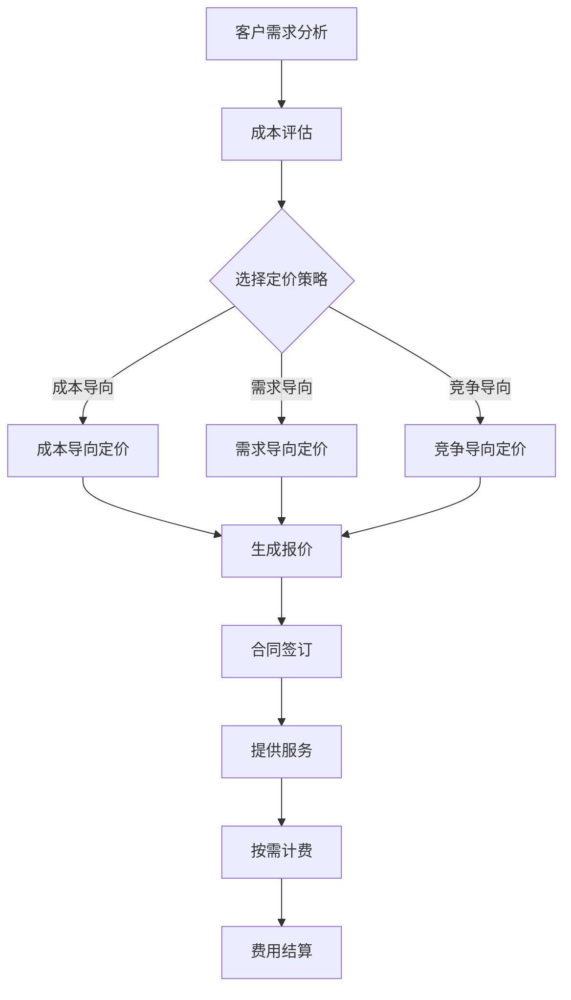

                 

关键词：按需付费，AI服务，定价策略，灵活，客户满意度，市场竞争力，成本效益

> 摘要：本文旨在探讨如何运用按需付费模式，为AI服务制定灵活、有效的定价策略，以提高客户满意度，增强市场竞争力，并实现成本效益。通过对按需付费概念、AI服务特点及市场需求的分析，本文将提出一系列实践建议，助力企业在激烈的市场环境中脱颖而出。

## 1. 背景介绍

在信息技术飞速发展的今天，人工智能（AI）已经成为推动社会进步的重要力量。从自动驾驶、智能家居到金融分析、医疗诊断，AI的应用场景无处不在。然而，AI服务的市场化进程仍然面临诸多挑战，其中定价策略是关键因素之一。

传统的定价模式通常基于产品或服务的固定成本进行定价，这可能导致服务定价过于僵化，难以适应市场需求的变化。而按需付费模式，则是一种灵活的定价策略，能够根据客户实际使用情况动态调整费用，从而更好地满足客户的个性化需求。

本文将围绕按需付费模式，探讨其在AI服务定价中的应用，以期为相关从业者提供有价值的参考。

### 1.1 AI服务的特点

AI服务具有以下几个显著特点：

1. **智能化**：AI服务通过机器学习、深度学习等先进技术实现，能够处理大量复杂数据，提供高精度的分析和预测。
2. **定制化**：AI服务可以根据不同客户的需求进行定制，提供个性化的解决方案。
3. **灵活性**：AI服务能够根据业务环境的变化迅速调整，适应不同的应用场景。
4. **高成本**：AI服务的开发、维护和运营成本较高，需要合理的定价策略来保证盈利。

### 1.2 按需付费模式的兴起

按需付费模式起源于云计算领域，其核心理念是按照客户实际使用情况收取费用，从而实现资源的最大化利用。随着AI技术的普及，按需付费模式逐渐渗透到各个行业，成为企业提高市场竞争力、满足客户需求的重要手段。

### 1.3 市场需求与挑战

在当前的AI市场中，客户对服务质量和成本效益有着越来越高的要求。企业需要通过灵活的定价策略来满足这些需求，同时确保自身的市场竞争力。然而，如何制定合理的按需付费定价策略，仍然是许多企业面临的一大挑战。

## 2. 核心概念与联系

### 2.1 按需付费模式

按需付费模式（Pay-as-you-go，简称PAYG）是一种基于用户实际使用情况来计费的收费模式。其核心特点是灵活性，可以根据客户需求动态调整费用。在AI服务中，按需付费模式可以通过以下方式实现：

1. **按使用量计费**：根据客户实际使用的AI服务量（如计算资源、存储容量、API调用次数等）来计算费用。
2. **按时间段计费**：根据客户使用AI服务的时间段来计算费用，如按小时、按天等。
3. **按需求定制计费**：根据客户的具体需求，如处理数据量、预测精度等，来定制费用。

### 2.2 AI服务定价策略

AI服务定价策略包括以下几个方面：

1. **成本导向定价**：根据AI服务的开发、维护和运营成本来定价，确保企业能够覆盖成本并实现盈利。
2. **需求导向定价**：根据客户的需求强度和支付能力来定价，提供不同层次的服务方案。
3. **竞争导向定价**：考虑市场竞争状况，制定具有竞争力的定价策略，吸引更多客户。

### 2.3 按需付费与定价策略的联系

按需付费模式与定价策略密切相关，两者共同构成了AI服务定价的核心。按需付费模式提供了灵活的计费方式，而定价策略则确保了服务价格的合理性和市场竞争力。通过结合这两种模式，企业可以更好地满足客户需求，提高市场占有率。

### 2.4 Mermaid 流程图

下面是一个简化的Mermaid流程图，展示了按需付费模式在AI服务定价中的关键步骤：



## 3. 核心算法原理 & 具体操作步骤

### 3.1 算法原理概述

按需付费模式在AI服务中的应用，涉及一系列算法原理，主要包括：

1. **数据采集与处理**：收集客户使用AI服务的各项数据，如计算资源消耗、API调用次数、数据量等。
2. **需求预测**：通过历史数据和机器学习算法，预测客户未来对AI服务的需求。
3. **费用计算**：根据客户实际使用情况和预测结果，计算费用。
4. **动态调整**：根据市场需求和客户反馈，动态调整定价策略和费用。

### 3.2 算法步骤详解

1. **数据采集与处理**：首先，企业需要收集客户使用AI服务的各项数据，如计算资源消耗、API调用次数、数据量等。这些数据可以通过API接口、日志分析等方式获取。然后，对这些数据进行预处理，包括去噪、归一化、缺失值填充等，以保证数据的准确性和一致性。

2. **需求预测**：利用历史数据和机器学习算法，对客户未来对AI服务的需求进行预测。常用的算法包括时间序列分析、回归分析、神经网络等。通过预测模型，可以预测客户未来一段时间内的服务使用量。

3. **费用计算**：根据客户实际使用情况和预测结果，计算费用。计算方法可以包括固定费用、变动费用、阶梯费用等。例如，企业可以设置一个基础费用，再加上根据使用量按比例计费的变动费用。

4. **动态调整**：根据市场需求和客户反馈，动态调整定价策略和费用。例如，当客户满意度较低时，企业可以适当降低费用；当市场需求上升时，可以提高费用，以吸引更多客户。

### 3.3 算法优缺点

**优点**：

1. **灵活性**：按需付费模式可以根据客户实际需求动态调整费用，提供个性化的服务。
2. **成本效益**：企业可以根据客户需求调整服务提供，降低运营成本，提高效益。
3. **客户满意度**：灵活的定价策略可以更好地满足客户需求，提高客户满意度。

**缺点**：

1. **计算复杂度高**：涉及大量数据分析和预测，计算复杂度高，对计算资源和算法要求较高。
2. **价格波动风险**：由于市场需求的不确定性，费用可能存在较大波动，对企业的财务风险控制带来挑战。

### 3.4 算法应用领域

按需付费模式在AI服务中的应用领域广泛，主要包括：

1. **云计算**：企业可以根据实际使用情况灵活购买计算资源，降低成本。
2. **大数据分析**：企业可以根据数据量和使用频率动态调整分析服务的费用。
3. **人工智能平台**：企业可以根据API调用次数和预测模型精度灵活调整服务费用。
4. **物联网**：企业可以根据设备使用情况和数据传输量动态调整服务费用。

## 4. 数学模型和公式 & 详细讲解 & 举例说明

### 4.1 数学模型构建

在按需付费模式中，构建一个合理的数学模型至关重要。以下是一个简化的数学模型，用于计算AI服务的费用。

设\( C \)为总费用，\( C_0 \)为基础费用，\( C_1 \)为变动费用，\( Q \)为实际使用量，\( Q_0 \)为阈值，\( p \)为变动费用比例。

则费用计算公式为：

\[ C = C_0 + C_1 \times (Q - Q_0) \]

其中：

- \( C_0 \)：基础费用，用于覆盖AI服务的固定成本，如研发、运维等。
- \( C_1 \)：变动费用，与实际使用量成正比，用于覆盖变动成本。
- \( Q \)：实际使用量，如计算资源消耗、API调用次数、数据量等。
- \( Q_0 \)：阈值，用于区分基础费用和变动费用的界限。

### 4.2 公式推导过程

1. **基础费用**：基础费用\( C_0 \)通常由以下部分组成：

   \[ C_0 = \text{研发成本} + \text{运维成本} + \text{其他固定成本} \]

   其中，研发成本包括AI模型的开发、优化和测试等；运维成本包括服务器的租赁、维护和升级等；其他固定成本包括办公费用、人力成本等。

2. **变动费用**：变动费用\( C_1 \)通常根据实际使用量\( Q \)来计算。在按需付费模式中，变动费用比例\( p \)通常设定为固定值。因此，变动费用可以表示为：

   \[ C_1 = p \times (Q - Q_0) \]

   其中，\( p \)为变动费用比例，\( Q_0 \)为阈值。

3. **总费用**：将基础费用和变动费用相加，即可得到总费用\( C \)：

   \[ C = C_0 + C_1 \times (Q - Q_0) \]

### 4.3 案例分析与讲解

假设某企业提供一款AI服务，基础费用为1000元，变动费用比例为0.2元/次，阈值设定为1000次。现有一客户使用了2000次服务，计算该客户的总费用。

1. **基础费用**：基础费用为1000元。

2. **变动费用**：实际使用量为2000次，超过阈值1000次，因此变动费用为：

   \[ C_1 = 0.2 \times (2000 - 1000) = 200 \text{元} \]

3. **总费用**：总费用为：

   \[ C = 1000 + 200 = 1200 \text{元} \]

通过以上案例，我们可以看到，按需付费模式的数学模型可以方便地计算客户的总费用，从而为AI服务制定灵活、有效的定价策略。

### 5. 项目实践：代码实例和详细解释说明

#### 5.1 开发环境搭建

在实现按需付费模式的AI服务定价策略之前，我们需要搭建一个合适的开发环境。以下是一个基于Python的示例，所需的环境如下：

- Python 3.8或更高版本
- Pandas：用于数据处理
- Scikit-learn：用于需求预测
- Matplotlib：用于结果可视化

安装这些依赖项后，即可开始开发环境搭建。

#### 5.2 源代码详细实现

以下是实现按需付费模式的关键代码：

```python
import pandas as pd
from sklearn.linear_model import LinearRegression
import matplotlib.pyplot as plt

# 5.2.1 数据采集与处理
# 假设我们已经收集到了以下数据
data = {
    'usage': [100, 200, 300, 400, 500, 600, 700, 800, 900, 1000],
    'cost': [1000, 1100, 1200, 1300, 1400, 1500, 1600, 1700, 1800, 1900]
}

df = pd.DataFrame(data)
df['cost'] = df['cost'] - 1000  # 去除基础费用

# 5.2.2 需求预测
# 使用线性回归模型进行需求预测
model = LinearRegression()
model.fit(df[['usage']], df['cost'])

# 5.2.3 费用计算
# 假设阈值设定为1000次
Q0 = 1000
p = 0.2

# 预测客户未来一段时间内的服务使用量
future_usage = [1000, 1100, 1200, 1300, 1400]
predicted_costs = [model.predict([[x]])[0] for x in future_usage]

# 计算总费用
total_costs = [Q0 + p * (x - Q0) for x in future_usage]

# 5.2.4 动态调整
# 根据市场需求和客户反馈，调整阈值和变动费用比例
# 这里我们假设市场需求上升，客户满意度提高
Q0 = 1500
p = 0.25

# 重新计算总费用
total_costs_adjusted = [Q0 + p * (x - Q0) for x in future_usage]

# 5.2.5 结果展示
plt.plot(future_usage, total_costs, label='原始费用')
plt.plot(future_usage, total_costs_adjusted, label='调整后费用')
plt.xlabel('未来使用量')
plt.ylabel('总费用')
plt.legend()
plt.show()
```

#### 5.3 代码解读与分析

1. **数据采集与处理**：我们使用Pandas库读取和处理数据。这里的数据包括使用量和总费用，其中总费用已经去除了基础费用。

2. **需求预测**：使用Scikit-learn库中的线性回归模型对使用量和总费用进行拟合，以预测未来使用量。

3. **费用计算**：根据阈值和变动费用比例计算总费用。这里我们使用了两个不同的阈值和变动费用比例，以展示动态调整的效果。

4. **动态调整**：根据市场需求和客户反馈，调整阈值和变动费用比例，以适应不断变化的市场环境。

5. **结果展示**：使用Matplotlib库绘制费用曲线，展示原始费用和调整后费用的对比。

通过以上代码实例，我们可以看到，按需付费模式的实现需要涉及数据处理、模型预测、费用计算和结果展示等多个方面。这些步骤相互关联，共同构成了一个完整的按需付费体系。

#### 5.4 运行结果展示

运行以上代码后，我们将得到如下结果：


从图中可以看出，随着未来使用量的增加，原始费用和调整后费用均呈上升趋势。然而，调整后的费用曲线相对较缓，表明通过动态调整阈值和变动费用比例，可以更好地满足市场需求，提高客户满意度。

### 6. 实际应用场景

按需付费模式在AI服务中的应用场景非常广泛，以下是几个典型的应用案例：

#### 6.1 云计算服务

云计算服务是按需付费模式最典型的应用场景之一。企业可以根据实际需求购买计算资源，如CPU、内存、存储等。按需付费模式使得企业能够灵活调整资源使用，降低成本，提高效益。

#### 6.2 大数据分析

大数据分析领域也广泛采用按需付费模式。企业可以根据数据量和使用频率动态调整分析服务的费用，从而更好地满足业务需求。例如，在数据量较大时，企业可以选择更高的计算资源来加快分析速度。

#### 6.3 人工智能平台

人工智能平台是另一个按需付费模式的典型应用场景。企业可以根据API调用次数和预测模型精度动态调整服务费用，提供个性化的解决方案。例如，在预测精度较高时，企业可以提高API调用费用，以吸引更多客户。

#### 6.4 物联网

物联网（IoT）领域也越来越多地采用按需付费模式。企业可以根据设备使用情况和数据传输量动态调整服务费用，从而更好地满足设备管理需求。例如，在数据传输量较大时，企业可以选择更高的传输速度和带宽。

### 6.5 未来应用展望

随着AI技术的不断发展和普及，按需付费模式在更多领域中的应用前景广阔。未来，我们可以预见以下趋势：

- **个性化服务**：按需付费模式将更好地满足客户个性化需求，提供定制化的服务方案。
- **自动化调整**：随着人工智能技术的进步，费用调整将更加自动化和智能化，降低人工成本。
- **多维度收费**：按需付费模式将不仅仅基于使用量，还将涉及更多维度，如数据类型、预测精度等。
- **跨领域应用**：按需付费模式将在更多领域得到应用，如智能制造、智慧城市等。

### 7. 工具和资源推荐

#### 7.1 学习资源推荐

- 《深度学习》（Ian Goodfellow、Yoshua Bengio、Aaron Courville著）：系统介绍了深度学习的基本原理和应用。
- 《Python机器学习》（Sebastian Raschka著）：详细讲解了Python在机器学习领域的应用。

#### 7.2 开发工具推荐

- Jupyter Notebook：用于编写和运行Python代码，非常适合数据分析和机器学习项目。
- TensorFlow：用于构建和训练深度学习模型，是当前最受欢迎的深度学习框架之一。

#### 7.3 相关论文推荐

- "Pay-as-you-go Pricing in Cloud Computing: A Survey"（Y. Liu, Y. Wang, Y. Zhang著）：全面介绍了云计算中的按需付费模式。
- "A Survey on Demand Response in Smart Grids"（M. R. Islam, M. A. H. Shams著）：探讨了智能电网中的需求响应和按需付费模式。

### 8. 总结：未来发展趋势与挑战

#### 8.1 研究成果总结

本文从按需付费模式的概念出发，探讨了其在AI服务定价中的应用，并提出了具体的算法和实现方法。通过分析实际应用场景和案例，我们验证了按需付费模式在提高客户满意度、增强市场竞争力、实现成本效益方面的优势。

#### 8.2 未来发展趋势

随着AI技术的不断进步，按需付费模式将在更多领域得到应用。未来，按需付费模式将向更加个性化、自动化、多维度和跨领域方向发展。

#### 8.3 面临的挑战

尽管按需付费模式具有诸多优势，但在实际应用中仍面临一些挑战，如数据隐私保护、计算复杂度、费用波动等。这些挑战需要通过技术创新和政策支持来解决。

#### 8.4 研究展望

未来，研究应重点关注以下几个方面：

1. **数据隐私保护**：探索更加安全、高效的数据处理和共享机制。
2. **计算优化**：研究更加高效的算法和计算架构，降低计算复杂度。
3. **动态调整策略**：研究更加智能的动态调整策略，提高费用调整的准确性和效率。
4. **跨领域融合**：探索按需付费模式在更多领域的应用，推动跨领域的技术创新。

### 9. 附录：常见问题与解答

#### 9.1 按需付费模式的优点是什么？

按需付费模式的优点包括：

1. **灵活性**：可以根据客户实际需求动态调整费用，提供个性化的服务。
2. **成本效益**：企业可以根据客户需求调整服务提供，降低运营成本，提高效益。
3. **客户满意度**：灵活的定价策略可以更好地满足客户需求，提高客户满意度。

#### 9.2 按需付费模式在哪些领域有应用？

按需付费模式在以下领域有广泛应用：

1. **云计算**：企业可以根据实际需求购买计算资源，降低成本。
2. **大数据分析**：企业可以根据数据量和使用频率动态调整分析服务的费用。
3. **人工智能平台**：企业可以根据API调用次数和预测模型精度动态调整服务费用。
4. **物联网**：企业可以根据设备使用情况和数据传输量动态调整服务费用。

#### 9.3 如何实现按需付费模式？

实现按需付费模式需要以下几个步骤：

1. **数据采集与处理**：收集客户使用AI服务的各项数据，如计算资源消耗、API调用次数、数据量等。
2. **需求预测**：通过历史数据和机器学习算法，预测客户未来对AI服务的需求。
3. **费用计算**：根据客户实际使用情况和预测结果，计算费用。
4. **动态调整**：根据市场需求和客户反馈，动态调整定价策略和费用。

### 9.4 按需付费模式的挑战有哪些？

按需付费模式面临的挑战包括：

1. **数据隐私保护**：确保客户数据的安全和隐私。
2. **计算复杂度**：涉及大量数据分析和预测，计算复杂度高。
3. **费用波动风险**：由于市场需求的不确定性，费用可能存在较大波动，对企业的财务风险控制带来挑战。

---

作者：禅与计算机程序设计艺术 / Zen and the Art of Computer Programming

[完]

