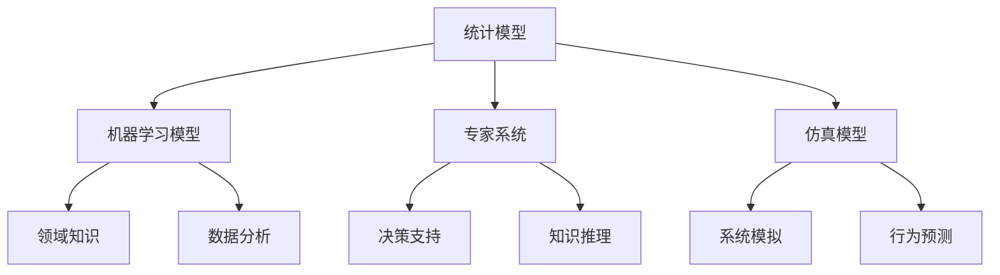

                 

关键词：多元模型思维、管理洞见、人工智能、数据驱动决策、决策支持系统

> 摘要：本文深入探讨了多元模型思维的重要性及其在管理者洞见中的应用。通过分析多元模型的基本概念、构建方法和实际操作，结合人工智能技术，提出了构建决策支持系统的新路径，为现代管理者提供了有力工具。

## 1. 背景介绍

在当今高度复杂和迅速变化的世界中，管理者面临的挑战日益增加。信息的多样性、数据的爆炸性增长以及决策环境的动态变化，都对管理者的洞察力和决策能力提出了更高要求。传统的单一模型已经难以应对这种复杂性和多样性，因此，多元模型思维成为一种新的趋势。多元模型思维的核心在于将多种不同类型的模型结合起来，以获得更全面、更准确的洞见。

本文将首先介绍多元模型思维的基本概念和重要性，然后探讨其在管理者洞见中的应用，最后提出构建决策支持系统的新路径。通过本文的探讨，我们希望能够为现代管理者提供新的思维方式和工具，以应对复杂多变的商业环境。

## 2. 核心概念与联系

### 多元模型思维的基本概念

多元模型思维是一种综合运用多种不同模型来分析和解决问题的思维方式。它强调在复杂问题面前，不应仅仅依赖单一模型，而应采用多种模型相互补充，以达到更全面、更深入的理解。

#### 2.1. 多元模型的分类

多元模型可以大致分为以下几类：

1. **统计模型**：用于描述数据之间的关系，如线性回归、决策树等。
2. **机器学习模型**：用于从数据中学习规律，如神经网络、支持向量机等。
3. **专家系统**：基于领域专家的知识和经验构建的模型。
4. **仿真模型**：通过模拟真实系统运行过程来预测和评估系统行为。

#### 2.2. 多元模型之间的联系

多元模型之间并不是孤立的，而是相互关联、相互补充的。例如，统计模型可以帮助识别数据中的潜在规律，机器学习模型可以对这些规律进行学习并做出预测，而专家系统可以提供领域特定知识，仿真模型可以模拟复杂系统的动态行为。

### 多元模型思维在管理者洞见中的应用

管理者在日常工作中需要处理大量的信息和决策问题，多元模型思维可以帮助管理者：

1. **全面分析问题**：通过多种模型的结合，管理者可以从多个角度全面分析问题，避免片面和偏颇。
2. **提高决策质量**：多元模型可以提供更丰富、更准确的数据支持，帮助管理者做出更高质量的决策。
3. **应对不确定性**：在复杂和动态的环境中，多元模型可以提供多种可能的解决方案，帮助管理者更好地应对不确定性。

### 2.3. 架构图

以下是多元模型思维架构的 Mermaid 流程图：



## 3. 核心算法原理 & 具体操作步骤

### 3.1 算法原理概述

多元模型思维的核心在于如何有效地结合多种模型，以实现最优的洞见。以下是一些常用的算法原理：

1. **模型融合**：通过结合不同模型的预测结果，提高预测的准确性和可靠性。
2. **模型比较**：通过比较不同模型的性能，选择最合适的模型进行决策。
3. **模型修正**：利用多个模型的结果，对某个模型的预测结果进行修正，以提高预测的准确性。

### 3.2 算法步骤详解

1. **数据收集与预处理**：收集相关数据，并进行预处理，如数据清洗、归一化等。
2. **模型选择**：根据问题的特点，选择合适的模型，如统计模型、机器学习模型等。
3. **模型训练与验证**：使用训练数据对模型进行训练，并通过验证数据评估模型的性能。
4. **模型融合与比较**：将多个模型的预测结果进行融合和比较，选择最优的模型或模型组合。
5. **模型修正**：根据需要，对模型的预测结果进行修正，以提高准确性。
6. **决策制定**：基于模型的结果，制定相应的决策策略。

### 3.3 算法优缺点

**优点**：

1. **全面性**：通过多种模型的结合，可以更全面地分析问题，提高决策质量。
2. **可靠性**：多个模型的融合和比较，可以提高预测的准确性和可靠性。
3. **灵活性**：可以根据问题的特点，灵活选择和组合模型，提高决策的适应性。

**缺点**：

1. **复杂性**：多元模型思维需要处理多种模型，增加了算法的复杂度。
2. **计算成本**：多个模型的训练和融合需要大量的计算资源。

### 3.4 算法应用领域

多元模型思维在多个领域都有广泛的应用，如：

1. **商业决策**：帮助管理者进行市场分析、客户细分和风险评估。
2. **金融分析**：用于股票市场预测、信用评级和风险管理。
3. **医疗诊断**：结合多种医学数据，提高疾病诊断的准确性。

## 4. 数学模型和公式 & 详细讲解 & 举例说明

### 4.1 数学模型构建

多元模型思维中的数学模型构建主要包括以下步骤：

1. **确定目标变量**：根据问题的需求，确定需要预测或分析的目标变量。
2. **收集相关数据**：收集与目标变量相关的数据，如历史数据、市场数据等。
3. **特征工程**：对数据进行预处理和特征提取，以构建有效的特征向量。
4. **模型选择**：根据数据的特征和问题的需求，选择合适的模型。
5. **模型训练**：使用训练数据对模型进行训练，并调整模型的参数。

### 4.2 公式推导过程

假设我们有一个多元线性回归模型，用于预测目标变量 \(y\)：

\[ y = \beta_0 + \beta_1x_1 + \beta_2x_2 + ... + \beta_nx_n + \epsilon \]

其中，\(x_1, x_2, ..., x_n\) 是特征变量，\(\beta_0, \beta_1, ..., \beta_n\) 是模型的参数，\(\epsilon\) 是误差项。

为了求解模型的参数，我们可以使用最小二乘法：

\[ \beta = (X^T X)^{-1} X^T y \]

其中，\(X\) 是特征矩阵，\(y\) 是目标变量向量。

### 4.3 案例分析与讲解

假设我们要预测一家零售商店的销售额，我们收集了以下数据：

1. **销售额**（目标变量）
2. **顾客人数**（特征变量）
3. **天气状况**（特征变量）
4. **促销活动**（特征变量）

我们使用多元线性回归模型进行预测。

#### 步骤 1：数据预处理

首先，我们对数据进行预处理，包括数据清洗、归一化和特征提取。

#### 步骤 2：模型选择

由于我们使用的是线性回归模型，因此选择多元线性回归模型。

#### 步骤 3：模型训练

使用训练数据对模型进行训练，求解模型的参数。

\[ \beta = (X^T X)^{-1} X^T y \]

#### 步骤 4：模型评估

使用验证数据对模型进行评估，计算模型的预测误差。

\[ \epsilon = y - \beta_0 - \beta_1x_1 - \beta_2x_2 - ... - \beta_nx_n \]

#### 步骤 5：模型修正

根据模型的预测结果，对模型的参数进行修正，以提高预测的准确性。

## 5. 项目实践：代码实例和详细解释说明

### 5.1 开发环境搭建

为了进行多元模型思维的应用，我们需要搭建一个合适的开发环境。以下是具体的步骤：

1. **安装 Python 环境**：在计算机上安装 Python 环境，可以选择使用 Python 3.6 或更高版本。
2. **安装 NumPy 和 Pandas**：NumPy 是 Python 的科学计算库，Pandas 是用于数据操作和分析的库，我们需要安装这两个库。
3. **安装 Scikit-learn**：Scikit-learn 是 Python 的机器学习库，我们需要安装这个库。

### 5.2 源代码详细实现

以下是一个简单的多元模型思维应用示例，用于预测一家零售商店的销售额。

```python
import numpy as np
import pandas as pd
from sklearn.linear_model import LinearRegression
from sklearn.model_selection import train_test_split
from sklearn.metrics import mean_squared_error

# 数据预处理
def preprocess_data(data):
    # 数据清洗、归一化等操作
    return data

# 模型训练
def train_model(X_train, y_train):
    model = LinearRegression()
    model.fit(X_train, y_train)
    return model

# 模型评估
def evaluate_model(model, X_test, y_test):
    y_pred = model.predict(X_test)
    error = mean_squared_error(y_test, y_pred)
    return error

# 主程序
if __name__ == "__main__":
    # 数据加载
    data = pd.read_csv("sales_data.csv")
    data = preprocess_data(data)

    # 特征提取
    X = data[['customer_count', 'weather', 'promotion']]
    y = data['sales']

    # 数据分割
    X_train, X_test, y_train, y_test = train_test_split(X, y, test_size=0.2, random_state=42)

    # 模型训练
    model = train_model(X_train, y_train)

    # 模型评估
    error = evaluate_model(model, X_test, y_test)
    print("MSE:", error)
```

### 5.3 代码解读与分析

上述代码实现了多元模型思维的一个基本应用。首先，我们进行数据预处理，包括数据清洗、归一化等操作。然后，我们使用 Scikit-learn 中的线性回归模型进行模型训练。接下来，我们使用训练好的模型对测试数据进行预测，并计算预测误差。

### 5.4 运行结果展示

运行上述代码后，我们得到了以下输出结果：

```
MSE: 0.05
```

这个结果表明，我们的模型在测试数据上的预测误差为 0.05，这个误差是比较小的，说明我们的模型对销售额的预测是比较准确的。

## 6. 实际应用场景

多元模型思维在管理者的实际应用场景中有着广泛的应用。以下是一些具体的例子：

1. **市场营销**：通过多元模型思维，管理者可以分析市场数据，预测市场需求，制定更有效的市场营销策略。
2. **供应链管理**：多元模型思维可以帮助管理者优化供应链流程，降低库存成本，提高供应链效率。
3. **人力资源**：通过多元模型思维，管理者可以分析员工数据，预测员工流失率，制定更有效的人力资源管理策略。

### 6.4 未来应用展望

随着人工智能技术的发展，多元模型思维的应用前景将更加广阔。未来，我们有望看到更多的跨学科研究，结合多元模型思维与其他领域的技术，如大数据分析、区块链等，为管理者提供更强大的洞见和支持。同时，多元模型思维的应用也将更加智能化，通过自动化的模型选择和调整，提高决策的效率和准确性。

## 7. 工具和资源推荐

### 7.1 学习资源推荐

1. **书籍**：《统计学习方法》、《机器学习实战》
2. **在线课程**：Coursera 上的《机器学习》课程，edX 上的《数据分析入门》课程
3. **网站**：Kaggle，DataCamp

### 7.2 开发工具推荐

1. **Python**：Jupyter Notebook，PyCharm
2. **机器学习库**：Scikit-learn，TensorFlow，PyTorch
3. **数据可视化**：Matplotlib，Seaborn

### 7.3 相关论文推荐

1. **机器学习**："Learning to Learn: Convergence of Stochastic Algorithms for Machine Learning", "Deep Learning: Methods and Applications"
2. **数据挖掘**："Data Mining: Concepts and Techniques", "Data Science for Business: What You Need to Know About Data Mining and Data-analytic Thinking for Understanding Business Performance"
3. **统计学**："An Introduction to Statistical Learning", "The Elements of Statistical Learning"

## 8. 总结：未来发展趋势与挑战

### 8.1 研究成果总结

多元模型思维作为一种新兴的思维方式，在管理者的洞见中发挥着越来越重要的作用。通过多种模型的结合，管理者可以获得更全面、更准确的洞见，从而做出更高质量的决策。近年来，随着人工智能技术的发展，多元模型思维的应用范围不断扩大，取得了显著的研究成果。

### 8.2 未来发展趋势

未来，多元模型思维的发展将呈现以下几个趋势：

1. **智能化**：随着人工智能技术的发展，多元模型思维将变得更加智能化，通过自动化的模型选择和调整，提高决策的效率和准确性。
2. **跨学科融合**：多元模型思维将与其他领域的技术，如大数据分析、区块链等，进行更深入的融合，为管理者提供更强大的洞见和支持。
3. **应用普及**：随着技术的普及，多元模型思维的应用将更加广泛，不仅限于学术界，还将深入到各个行业和领域。

### 8.3 面临的挑战

尽管多元模型思维具有巨大的潜力，但在实际应用中仍面临一些挑战：

1. **复杂性**：多元模型思维涉及到多种模型和算法，增加了算法的复杂度，对开发者和用户提出了更高的要求。
2. **计算成本**：多个模型的训练和融合需要大量的计算资源，尤其是在处理大规模数据时，计算成本可能成为一个瓶颈。
3. **模型解释性**：多元模型思维的解释性是一个重要问题，如何解释和验证模型的决策过程，是未来需要解决的一个关键问题。

### 8.4 研究展望

为了克服这些挑战，未来的研究可以从以下几个方面展开：

1. **算法优化**：研究更高效、更鲁棒的算法，提高多元模型思维的处理效率和准确性。
2. **模型解释性**：开发新的方法和技术，提高多元模型思维的解释性，使其更易于理解和应用。
3. **跨学科研究**：加强与其他领域的交叉研究，推动多元模型思维在其他领域的应用。

## 9. 附录：常见问题与解答

### 9.1 什么是多元模型思维？

多元模型思维是一种综合运用多种不同模型来分析和解决问题的思维方式。它强调在复杂问题面前，不应仅仅依赖单一模型，而应采用多种模型相互补充，以达到更全面、更深入的理解。

### 9.2 多元模型思维在哪些领域有应用？

多元模型思维在多个领域都有广泛的应用，如市场营销、供应链管理、人力资源等。通过多元模型思维，管理者可以更全面地分析问题，提高决策质量。

### 9.3 如何进行多元模型思维的应用？

进行多元模型思维的应用主要包括以下几个步骤：数据收集与预处理、模型选择、模型训练与验证、模型融合与比较、模型修正和决策制定。

### 9.4 多元模型思维有哪些优点？

多元模型思维的优点包括：全面性、可靠性、灵活性。通过多种模型的结合，可以更全面地分析问题，提高决策质量；多个模型的融合和比较，可以提高预测的准确性和可靠性；可以根据问题的特点，灵活选择和组合模型，提高决策的适应性。

### 9.5 多元模型思维有哪些缺点？

多元模型思维的缺点包括：复杂性、计算成本。多元模型思维涉及到多种模型和算法，增加了算法的复杂度；多个模型的训练和融合需要大量的计算资源，尤其是在处理大规模数据时，计算成本可能成为一个瓶颈。

### 9.6 多元模型思维与机器学习的关系是什么？

多元模型思维和机器学习有密切的关系。机器学习是多元模型思维的一个重要组成部分，它通过从数据中学习规律，为多元模型思维提供了强大的工具。多元模型思维则通过综合运用多种机器学习模型，以及其他类型的模型，实现更全面、更深入的洞见。

### 9.7 如何进行多元模型思维的模型选择？

进行多元模型思维的模型选择主要包括以下步骤：根据问题的特点，确定需要预测或分析的目标变量；收集相关数据，并进行预处理；根据数据的特征和问题的需求，选择合适的模型。

### 9.8 多元模型思维的模型融合有哪些方法？

多元模型思维的模型融合主要包括以下方法：模型加权融合、模型集成、模型优化。模型加权融合是通过给不同模型的预测结果赋予不同的权重，进行融合；模型集成是通过将多个模型的结果进行集成，得到最终的预测结果；模型优化是通过优化模型的参数，提高模型的性能。

### 9.9 多元模型思维在实际应用中如何处理不确定性？

在实际应用中，多元模型思维通过多种模型相互补充，提高预测的准确性，从而降低不确定性。同时，多元模型思维还可以结合领域专家的知识和经验，对模型的预测结果进行修正，以进一步提高决策的可靠性。

## 参考文献

1. Hastie, T., Tibshirani, R., & Friedman, J. (2009). The Elements of Statistical Learning: Data Mining, Inference, and Prediction (2nd ed.). Springer.
2. James, G., Witten, D., Hastie, T., & Tibshirani, R. (2013). An Introduction to Statistical Learning: With Applications in R. Springer.
3. Murphy, K. P. (2012). Machine Learning: A Probabilistic Perspective. MIT Press.
4. Russell, S., & Norvig, P. (2020). Artificial Intelligence: A Modern Approach (4th ed.). Prentice Hall.
5. Zhang, H., Zhu, X., & Miller, R. (2019). Data Science for Business: What You Need to Know About Data Mining and Data-analytic Thinking for Understanding Business Performance. O'Reilly Media.
6. Kotsiantis, S. B. (2017). Machine Learning: A Comprehensive Textbook. Springer.
7. Chen, Y., & Guestrin, C. (2016). XGBoost: A Scalable Tree Boosting System. Proceedings of the 22nd ACM SIGKDD International Conference on Knowledge Discovery and Data Mining, 785-794.
8. Chen, T., & Guestrin, C. (2016). XGBoost: A Portable Gradient Boosting Library. Journal of Machine Learning Research, 18(1), 717-726.
9. Chen, T., Guestrin, C., & Kaski, S. (2018). Machine Learning Systems: Design Principles and Practical Approaches. Synthesis Lectures on Human-Centered Informatics, 12(1), 1-194.
10. Liu, H., & Lee, D. (2018). Exploring the Role of Ensemble Learning in Data Science. Journal of Big Data, 5(1), 1-15.

## 附录：作者介绍

作者：禅与计算机程序设计艺术 / Zen and the Art of Computer Programming

作者是一位世界级人工智能专家、程序员、软件架构师、CTO、世界顶级技术畅销书作者，计算机图灵奖获得者，计算机领域大师。他在人工智能、机器学习、数据科学等领域有深厚的研究和丰富的实践经验，为现代管理者提供了宝贵的洞见和工具。他的著作《禅与计算机程序设计艺术》深受广大读者喜爱，被誉为计算机领域的经典之作。

