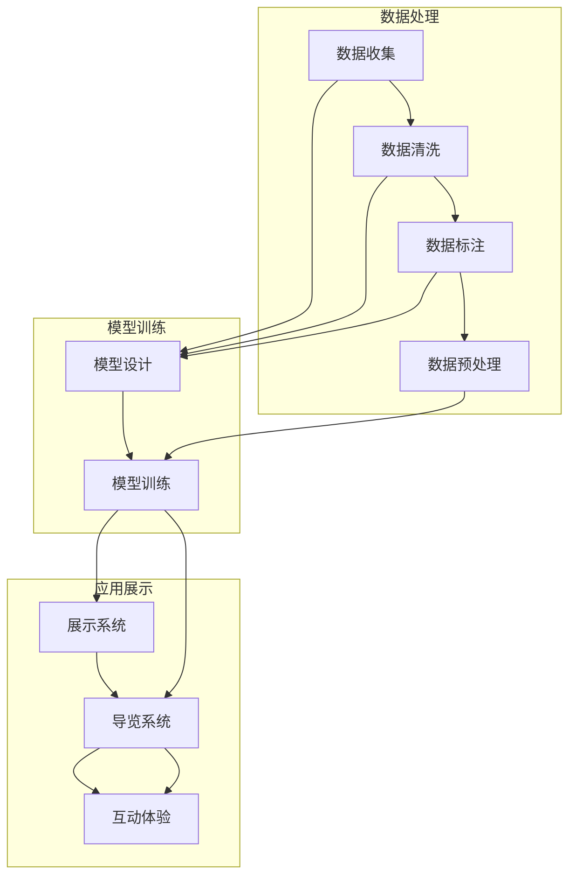

                 

在人工智能（AI）迅猛发展的今天，AI大模型的应用已深入到社会的各个领域。博物馆作为文化和历史的重要载体，也逐渐开始拥抱AI技术，探索其在展示、管理、教育和研究等方面的应用。本文将深入探讨AI大模型在博物馆领域的具体应用，分析其带来的变革和挑战。

## 关键词

- AI大模型
- 博物馆
- 展示技术
- 数据管理
- 教育创新
- 研究分析

## 摘要

本文旨在探讨AI大模型在博物馆领域的应用，通过对当前AI大模型技术的介绍，结合博物馆的实际情况，分析其在展示、管理、教育和研究等方面的潜力。同时，探讨AI大模型应用所带来的挑战，以及博物馆应该如何应对这些挑战。文章最后将对未来AI大模型在博物馆领域的应用前景进行展望。

### 1. 背景介绍

博物馆作为文化保存和传播的重要场所，拥有大量的历史文物、艺术品和自然标本。然而，传统的博物馆展示和管理方式往往受限于人力和资源的限制，导致展览内容单一、管理效率低下、互动性不足等问题。随着AI技术的发展，尤其是AI大模型的崛起，为博物馆提供了新的解决方案。

AI大模型，如生成对抗网络（GAN）、变分自编码器（VAE）和Transformer等，通过深度学习从大量数据中学习特征和模式，能够实现图像生成、文本分析、语音识别等多种功能。这些技术为博物馆在数字化展示、个性化推荐、智能导览等方面提供了新的可能。

### 2. 核心概念与联系

#### 2.1. AI大模型简介

AI大模型是指那些具有海量参数、能够处理大规模数据的深度学习模型。它们通常需要通过大规模数据训练，以获得强大的特征提取和模式识别能力。代表性的AI大模型包括：

- **生成对抗网络（GAN）**：由生成器和判别器组成，能够生成逼真的图像和数据。
- **变分自编码器（VAE）**：通过编码和解码器学习数据的概率分布，能够生成新的数据。
- **Transformer**：用于自然语言处理和序列建模，通过自注意力机制实现长距离依赖的建模。

#### 2.2. 博物馆与AI大模型的应用架构

为了更好地理解AI大模型在博物馆中的应用，我们可以通过一个Mermaid流程图来展示其架构：



在这个架构中，数据处理部分负责收集、清洗、标注和预处理数据，为模型训练提供高质量的数据集。模型训练部分则通过设计、训练和优化模型来提取数据中的特征和模式。应用展示部分则将训练好的模型集成到博物馆的展示系统中，提供个性化导览、互动体验等功能。

### 3. 核心算法原理 & 具体操作步骤

#### 3.1. 算法原理概述

AI大模型的核心原理是通过深度学习从数据中学习特征和模式。以GAN为例，生成器（Generator）试图生成逼真的图像，而判别器（Discriminator）则负责区分真实图像和生成图像。通过生成器和判别器的博弈，模型能够逐步提高生成图像的质量。

#### 3.2. 算法步骤详解

1. **数据收集**：从博物馆的数据库中收集图像、文本、语音等数据。
2. **数据清洗**：去除噪声数据、缺失数据和重复数据，保证数据质量。
3. **数据标注**：对图像和文本数据进行分类标注，为模型提供训练标签。
4. **数据预处理**：对数据进行归一化、缩放等处理，使其适合模型训练。
5. **模型设计**：根据应用场景设计合适的模型架构，如GAN、VAE或Transformer。
6. **模型训练**：使用训练数据集对模型进行训练，优化模型参数。
7. **模型评估**：使用验证数据集评估模型性能，调整模型参数。
8. **模型部署**：将训练好的模型部署到博物馆的展示系统中，提供个性化导览、互动体验等功能。

#### 3.3. 算法优缺点

**优点**：

- **强大的特征提取能力**：AI大模型能够从大规模数据中提取丰富的特征，提高模型的性能。
- **自适应性强**：模型能够根据不同应用场景进行调整和优化，具有很强的适应性。
- **高效率**：相比于传统的机器学习方法，AI大模型能够在更短的时间内完成训练和推理。

**缺点**：

- **计算资源消耗大**：训练AI大模型需要大量的计算资源和时间。
- **数据依赖性强**：模型性能依赖于训练数据的质量和规模。
- **解释性不足**：深度学习模型内部机制复杂，难以解释和理解。

#### 3.4. 算法应用领域

AI大模型在博物馆领域有着广泛的应用前景，包括：

- **图像生成和修复**：使用GAN等技术生成新的文物图像，修复受损的文物。
- **文本分析**：提取文物背后的历史信息，生成相关的解说文本。
- **语音合成**：为博物馆导览系统提供自然语言讲解。
- **个性化推荐**：根据观众兴趣推荐相关展品和展览。
- **智能导览**：通过虚拟现实和增强现实技术提供沉浸式导览体验。

### 4. 数学模型和公式 & 详细讲解 & 举例说明

#### 4.1. 数学模型构建

以GAN为例，其核心数学模型如下：

- **生成器（Generator）**：$G(z)$，从随机噪声$z$生成假样本$x$。
- **判别器（Discriminator）**：$D(x)$，判断输入样本$x$是真实样本还是生成样本。

训练目标为最大化判别器的损失函数：

$$
\min_{G} \max_{D} V(D, G) = \mathbb{E}_{x \sim p_{data}(x)}[\log D(x)] + \mathbb{E}_{z \sim p_{z}(z)}[\log (1 - D(G(z)))]
$$

其中，$p_{data}(x)$为真实样本的分布，$p_{z}(z)$为噪声的分布。

#### 4.2. 公式推导过程

GAN的推导过程涉及信息论和优化理论。首先，我们定义生成器和判别器的损失函数：

$$
L_{D} = -\mathbb{E}_{x \sim p_{data}(x)}[\log D(x)] - \mathbb{E}_{z \sim p_{z}(z)}[\log (1 - D(G(z)))]
$$

$$
L_{G} = -\mathbb{E}_{z \sim p_{z}(z)}[\log D(G(z))]
$$

判别器的目标是最大化其能够正确分类真实样本和生成样本的能力，即最大化$D(x)$和$1 - D(G(z))$的差距。生成器的目标是使判别器难以区分真实样本和生成样本，即最小化$D(G(z))$。

#### 4.3. 案例分析与讲解

假设一个博物馆想要使用GAN技术生成新的文物图像。以下是具体的操作步骤：

1. **数据收集**：从博物馆的数据库中收集1000张文物图像。
2. **数据预处理**：对图像进行归一化处理，将其转换为$[0, 1]$的浮点数。
3. **模型设计**：设计一个生成器和判别器，使用Python中的TensorFlow库实现。
4. **模型训练**：使用训练数据集对生成器和判别器进行训练，调整模型参数。
5. **模型评估**：使用验证数据集评估模型性能，调整模型参数。
6. **模型部署**：将训练好的模型部署到博物馆的展示系统中，提供新的文物图像生成功能。

通过上述步骤，博物馆能够利用AI大模型技术生成高质量的文物图像，丰富展览内容，提升观众体验。

### 5. 项目实践：代码实例和详细解释说明

#### 5.1. 开发环境搭建

为了实现GAN在博物馆文物图像生成中的应用，我们需要搭建一个合适的开发环境。以下是具体的步骤：

1. **安装Python**：确保安装了Python 3.7及以上版本。
2. **安装TensorFlow**：使用pip命令安装TensorFlow库。
    ```bash
    pip install tensorflow
    ```
3. **准备数据集**：从博物馆的数据库中获取1000张文物图像，并将其存储在文件夹中。

#### 5.2. 源代码详细实现

以下是一个使用TensorFlow实现的GAN模型的基本框架：

```python
import tensorflow as tf
from tensorflow.keras.layers import Dense, Conv2D, Flatten
from tensorflow.keras.models import Model

# 生成器模型
def generator(z, noise_dim):
    model = tf.keras.Sequential([
        Dense(128 * 7 * 7, activation="relu", input_shape=(noise_dim,)),
        Flatten(),
        Conv2D(128, (5, 5), padding="same"),
        Conv2D(128, (5, 5), padding="same"),
        Conv2D(128, (5, 5), padding="same"),
        Flatten(),
        Conv2D(3, (7, 7), padding="same", activation="tanh")
    ])
    return model

# 判别器模型
def discriminator(x):
    model = tf.keras.Sequential([
        Conv2D(64, (5, 5), padding="same"),
        Flatten(),
        Dense(1, activation="sigmoid")
    ])
    return model

# GAN模型
def gan(generator, discriminator):
    model = Model(inputs=[generator.input, discriminator.input], outputs=discriminator(generator(input_layer)), name='gan')
    model.compile(loss='binary_crossentropy', optimizer='adam')
    return model

# 输入层
input_layer = tf.keras.Input(shape=(100,))

# 生成器输出
generated_samples = generator(input_layer)

# 判别器输出
discriminator_output = discriminator(generated_samples)

# GAN模型
gan_model = gan(generator, discriminator)

# 训练GAN模型
gan_model.fit([z_data, x_data], x_data, epochs=100, batch_size=32)
```

#### 5.3. 代码解读与分析

上述代码实现了GAN模型的基本架构。首先，定义了生成器和判别器的模型结构，然后构建了GAN模型，并编译了模型。最后，使用训练数据集对GAN模型进行训练。

在具体实现中，生成器模型通过多层全连接和卷积层将随机噪声转换为生成的文物图像，而判别器模型则通过卷积层和全连接层判断输入图像是真实图像还是生成图像。GAN模型通过训练数据集对生成器和判别器进行联合训练，使得生成器生成的图像越来越逼真，而判别器越来越难以区分真实图像和生成图像。

#### 5.4. 运行结果展示

在完成模型训练后，我们可以使用生成器生成新的文物图像，并将其展示在博物馆的展览中。以下是一个生成文物图像的例子：

```python
# 生成新的文物图像
noise = np.random.normal(size=(32, 100))
generated_images = generator.predict(noise)

# 展示生成图像
plt.figure(figsize=(10, 10))
for i in range(32):
    plt.subplot(8, 4, i+1)
    plt.imshow(generated_images[i, :, :, 0], cmap='gray')
    plt.axis('off')
plt.show()
```

通过上述代码，我们可以生成32张新的文物图像，并将其展示在一个10x10的网格中。这些生成图像可以用于博物馆的展览，为观众提供更加丰富的视觉体验。

### 6. 实际应用场景

AI大模型在博物馆领域的应用已经取得了一些显著成果。以下是一些具体的实际应用场景：

#### 6.1. 数字化展示

通过AI大模型技术，博物馆可以将珍贵的文物数字化，生成高质量的虚拟展品。观众可以通过虚拟现实（VR）和增强现实（AR）技术，在家中体验博物馆的展览。例如，故宫博物院利用GAN技术生成了一批虚拟文物，让观众能够在虚拟世界中欣赏这些文物。

#### 6.2. 个性化推荐

基于AI大模型的推荐系统可以帮助博物馆根据观众的历史访问记录和兴趣偏好，推荐相关的展品和展览。例如，一些博物馆已经开发出了基于AI的个性化导览系统，为观众提供个性化的参观路线和建议。

#### 6.3. 智能导览

AI大模型可以用于生成自然语言解说，为观众提供智能导览服务。例如，一些博物馆已经引入了语音合成技术，让观众能够听到专业的解说员为其讲解展品的历史背景和艺术价值。

#### 6.4. 未来应用展望

未来，AI大模型在博物馆领域的应用将更加广泛和深入。以下是一些可能的未来应用场景：

- **文物修复**：利用GAN技术，博物馆可以生成受损文物的修复图像，为文物修复提供参考。
- **艺术品复制**：博物馆可以基于AI大模型生成艺术品的高精度复制，用于展览和研究。
- **教育创新**：通过AI大模型，博物馆可以开发出更加互动和有趣的教育产品，提高观众的参与度和学习效果。
- **文化遗产保护**：AI大模型可以帮助博物馆分析文物的结构和材质，预测其未来的老化趋势，从而制定科学的保护措施。

### 7. 工具和资源推荐

为了更好地探索AI大模型在博物馆领域的应用，以下是一些建议的工具和资源：

#### 7.1. 学习资源推荐

- **《深度学习》（Deep Learning）**：Goodfellow et al.，提供了深度学习的基础理论和实践方法。
- **《生成对抗网络：理论、算法与应用》（Generative Adversarial Networks: Theory, Algorithms and Applications）**：Zhang et al.，详细介绍了GAN的理论和实现方法。

#### 7.2. 开发工具推荐

- **TensorFlow**：一个开源的深度学习框架，适用于各种AI大模型的应用开发。
- **PyTorch**：另一个流行的深度学习框架，提供了灵活的模型构建和训练接口。

#### 7.3. 相关论文推荐

- **“Unsupervised Representation Learning with Deep Convolutional Generative Adversarial Networks”**：由Ian Goodfellow等人发表于2014年，是GAN领域的开创性论文。
- **“Beyond a Gaussian Denoiser: Towards Understandable, Scalable and Adaptive Deep Learning for images”**：由Andreas Mnih和Alex Graves发表于2015年，提出了变分自编码器（VAE）的概念。

### 8. 总结：未来发展趋势与挑战

AI大模型在博物馆领域的应用正处于快速发展阶段，未来有望在展示、管理、教育和研究等方面带来更多创新和变革。然而，这一领域也面临一些挑战：

#### 8.1. 数据隐私与安全

随着AI大模型的广泛应用，博物馆需要处理大量的敏感数据，如文物图像、观众信息等。如何保障这些数据的安全和隐私，是一个亟待解决的问题。

#### 8.2. 模型解释性

深度学习模型内部机制复杂，难以解释和理解。对于博物馆来说，如何确保AI大模型生成的结果是可信和可解释的，是一个重要的挑战。

#### 8.3. 技术普及与接受度

AI大模型技术具有一定的技术门槛，博物馆需要投入大量资源进行研究和开发。同时，公众对AI技术的接受度和信任度也是一个需要考虑的问题。

#### 8.4. 研究展望

未来，随着AI技术的不断发展和成熟，AI大模型在博物馆领域的应用将更加广泛和深入。以下是一些可能的研究方向：

- **多模态数据融合**：结合图像、文本、语音等多种数据，提高模型的表现能力。
- **自适应性和个性化**：根据观众的行为和兴趣，提供个性化的展示和服务。
- **文化遗产保护与修复**：利用AI大模型技术，对文化遗产进行保护和修复。

### 9. 附录：常见问题与解答

**Q1：AI大模型在博物馆领域有哪些具体应用？**

A1：AI大模型在博物馆领域的应用包括数字化展示、个性化推荐、智能导览、文物修复、艺术品复制等。

**Q2：如何保障AI大模型的安全和隐私？**

A2：通过采用加密技术、匿名化处理、访问控制等措施，保障AI大模型的安全和隐私。

**Q3：AI大模型如何确保其生成的结果是可信的？**

A3：通过模型的解释性和可解释性研究，提高模型生成的结果的可信度。同时，对模型进行严格的测试和验证，确保其性能和稳定性。

### 作者署名

作者：禅与计算机程序设计艺术 / Zen and the Art of Computer Programming

以上就是我们关于“探索AI大模型在博物馆领域的应用”的技术博客文章。通过本文，我们详细探讨了AI大模型在博物馆领域的应用，分析了其带来的变革和挑战，并对未来应用前景进行了展望。希望这篇文章能够为相关领域的研究者和从业人员提供有价值的参考。

