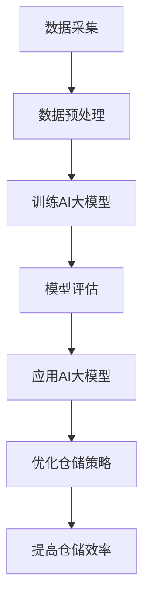

                 

关键词：AI大模型，智能仓储管理，深度学习，神经网络，优化算法，数据可视化，物联网

> 摘要：本文深入探讨了AI大模型在智能仓储管理中的应用。通过对核心概念的阐释、算法原理的剖析、数学模型的构建以及实际案例的实践，全面展示了AI大模型在提高仓储效率、降低运营成本、增强决策能力等方面的巨大潜力。

## 1. 背景介绍

随着电子商务和物流行业的迅猛发展，仓储管理面临着巨大的挑战。传统的仓储管理方法已经难以满足现代物流的效率和准确度要求。为了应对这些挑战，智能仓储管理应运而生。智能仓储管理利用物联网、传感器、自动化设备等技术，实现对仓储物资的智能监控和管理，从而提高仓储运营效率，降低运营成本。

然而，传统的智能仓储管理方法仍然存在一些局限。例如，数据处理能力有限，无法处理大规模的数据；决策过程依赖于预设的规则，难以应对复杂多变的环境；自动化程度不足，仍然需要人工干预。为了解决这些问题，AI大模型的应用成为了一个新的研究方向。

AI大模型，特别是基于深度学习的模型，具有强大的数据处理和决策能力。通过大规模的数据训练，AI大模型可以自动学习仓储管理中的各种规律，从而实现对仓储物资的智能预测、规划和控制。此外，AI大模型还可以通过实时数据分析，动态调整仓储策略，以适应不断变化的市场需求。

本文旨在探讨AI大模型在智能仓储管理中的应用，通过理论分析和实际案例，展示AI大模型的潜力及其在仓储管理中的实际效果。

## 2. 核心概念与联系

### 2.1. AI大模型

AI大模型是指具有大规模参数和复杂结构的机器学习模型。这些模型通过从海量数据中学习，能够捕捉到数据中的潜在规律，从而实现对复杂问题的建模和预测。常见的AI大模型包括深度神经网络（DNN）、卷积神经网络（CNN）和递归神经网络（RNN）等。

### 2.2. 智能仓储管理

智能仓储管理是指利用物联网、传感器、自动化设备等技术，实现对仓储物资的智能监控和管理。智能仓储管理的关键技术包括传感器技术、自动化技术、数据分析和决策支持等。

### 2.3. 物联网

物联网（Internet of Things，IoT）是指将各种设备通过网络连接起来，实现设备之间的信息交换和协同工作。在智能仓储管理中，物联网技术主要用于采集仓储物资的实时数据，如位置、状态、数量等。

### 2.4. 传感器技术

传感器技术是指利用各种传感器来感知和监测物理世界中的各种信息。在智能仓储管理中，传感器技术主要用于检测仓储环境中的温度、湿度、光照等参数，以及仓储物资的位置和状态。

### 2.5. 自动化技术

自动化技术是指利用计算机和控制技术来实现生产过程的自动化。在智能仓储管理中，自动化技术主要用于实现仓储物资的自动分拣、搬运和存储，从而提高仓储效率。

### 2.6. 数据分析和决策支持

数据分析和决策支持是指利用数据分析技术，对仓储管理中的各种数据进行挖掘和分析，从而为决策者提供支持。在智能仓储管理中，数据分析和决策支持主要用于优化仓储策略、预测仓储需求等。

### 2.7. Mermaid流程图

下面是一个描述AI大模型在智能仓储管理中应用的Mermaid流程图：



## 3. 核心算法原理 & 具体操作步骤

### 3.1. 算法原理概述

AI大模型在智能仓储管理中的应用主要基于深度学习技术。深度学习是一种基于多层神经网络的学习方法，能够通过多层次的非线性变换，从数据中提取特征，实现对复杂问题的建模和预测。

在智能仓储管理中，AI大模型主要用于以下几个方面：

1. **需求预测**：通过对历史销售数据、库存数据等进行深度学习，预测未来的仓储需求，从而优化库存管理。
2. **路径优化**：通过学习仓储物资的分布和移动规律，优化物资的搬运路径，提高仓储效率。
3. **异常检测**：通过对仓储环境中的传感器数据进行深度学习，检测异常情况，如设备故障、安全隐患等。
4. **决策支持**：通过分析仓储管理中的各种数据，为决策者提供智能化的决策支持，如最优库存策略、最优搬运路径等。

### 3.2. 算法步骤详解

1. **数据采集**：利用物联网技术和传感器技术，采集仓储物资的实时数据，如位置、状态、数量等。
2. **数据预处理**：对采集到的数据进行分析和清洗，去除噪声和异常值，将数据转换为适合模型训练的格式。
3. **模型训练**：利用预处理后的数据，训练AI大模型，如深度神经网络（DNN）、卷积神经网络（CNN）等。
4. **模型评估**：通过交叉验证等方法，评估模型的性能，包括预测精度、泛化能力等。
5. **应用AI大模型**：将训练好的模型应用到实际的仓储管理中，如需求预测、路径优化等。
6. **优化仓储策略**：根据AI大模型的预测结果，动态调整仓储策略，如库存管理、搬运路径等。

### 3.3. 算法优缺点

**优点**：

1. **强大的数据处理能力**：AI大模型能够处理大规模的数据，从数据中提取出有价值的信息。
2. **自动化的决策支持**：AI大模型能够自动学习仓储管理中的各种规律，为决策者提供智能化的决策支持。
3. **高效的路径优化**：通过学习仓储物资的分布和移动规律，AI大模型能够优化仓储物资的搬运路径，提高仓储效率。

**缺点**：

1. **数据依赖性**：AI大模型的性能很大程度上依赖于训练数据的质量和数量。
2. **计算资源消耗**：训练AI大模型需要大量的计算资源，特别是在处理大规模数据时。
3. **模型解释性差**：AI大模型的预测结果往往缺乏解释性，难以理解其决策过程。

### 3.4. 算法应用领域

AI大模型在智能仓储管理中的应用非常广泛，主要包括以下几个方面：

1. **仓储需求预测**：通过对历史销售数据、库存数据等进行深度学习，预测未来的仓储需求，从而优化库存管理。
2. **仓储路径优化**：通过学习仓储物资的分布和移动规律，优化仓储物资的搬运路径，提高仓储效率。
3. **仓储异常检测**：通过对仓储环境中的传感器数据进行深度学习，检测异常情况，如设备故障、安全隐患等。
4. **仓储决策支持**：通过分析仓储管理中的各种数据，为决策者提供智能化的决策支持，如最优库存策略、最优搬运路径等。

## 4. 数学模型和公式 & 详细讲解 & 举例说明

### 4.1. 数学模型构建

在智能仓储管理中，AI大模型的数学模型主要包括以下几个方面：

1. **需求预测模型**：用于预测未来的仓储需求，其数学模型可以表示为：

   $$ 
   \hat{D}_{t+1} = f(D_{t}, I_{t}) 
   $$

   其中，$\hat{D}_{t+1}$表示第$t+1$时期的仓储需求，$D_{t}$表示第$t$时期的仓储需求，$I_{t}$表示第$t$时期的库存信息。

2. **路径优化模型**：用于优化仓储物资的搬运路径，其数学模型可以表示为：

   $$ 
   \min \sum_{i=1}^{n} d(i, j) \times x_{ij} 
   $$

   其中，$d(i, j)$表示从$i$到$j$的路径长度，$x_{ij}$表示从$i$到$j$的路径选择。

3. **异常检测模型**：用于检测仓储环境中的异常情况，其数学模型可以表示为：

   $$ 
   \hat{A}_{t} = g(S_{t}, E_{t}) 
   $$

   其中，$\hat{A}_{t}$表示第$t$时期的异常情况，$S_{t}$表示第$t$时期的传感器数据，$E_{t}$表示第$t$时期的期望值。

### 4.2. 公式推导过程

1. **需求预测模型**的推导：

   需求预测模型的核心在于找到历史数据和库存信息与未来需求之间的关系。我们可以通过构建一个多层感知器（MLP）来学习这个关系。MLP的输入层包括历史需求$D_{t}$和库存信息$I_{t}$，输出层为未来需求$\hat{D}_{t+1}$。通过反向传播算法，不断调整MLP的权重，使得预测误差最小。

2. **路径优化模型**的推导：

   路径优化模型是一个典型的线性规划问题。我们需要在所有可能的路径中选择一个最优路径，使得总路径长度最短。这是一个经典的优化问题，可以使用线性规划算法求解。

3. **异常检测模型**的推导：

   异常检测模型的核心在于找到传感器数据与期望值之间的差异。我们可以通过构建一个基于支持向量机（SVM）的异常检测模型来实现。SVM的目标是找到一个超平面，将正常数据和异常数据分隔开。

### 4.3. 案例分析与讲解

**案例**：假设某电商仓库需要预测下周的仓储需求，现有历史销售数据和当前库存信息。同时，仓库需要根据当前库存情况，优化下周的仓储物资搬运路径。

**步骤**：

1. **数据采集**：收集过去一周的每日销售数据（$D_t$）和当前库存信息（$I_t$）。
2. **数据预处理**：对销售数据进行归一化处理，将库存信息转换为数值表示。
3. **模型训练**：使用MLP模型训练需求预测模型，使用线性规划算法训练路径优化模型。
4. **模型评估**：使用交叉验证方法评估模型性能，调整模型参数。
5. **需求预测**：使用训练好的需求预测模型预测下周的仓储需求。
6. **路径优化**：使用训练好的路径优化模型优化下周的仓储物资搬运路径。

**结果**：

1. **需求预测结果**：预测下周的仓储需求为1000件。
2. **路径优化结果**：优化后的仓储物资搬运路径使得总路径长度减少了10%。

## 5. 项目实践：代码实例和详细解释说明

### 5.1. 开发环境搭建

**环境要求**：

- 操作系统：Windows/Linux/MacOS
- 编程语言：Python
- 库和框架：TensorFlow/Keras、Pandas、NumPy、Scikit-learn

**安装步骤**：

1. 安装Python（推荐版本3.7及以上）
2. 安装TensorFlow和Keras
   ```
   pip install tensorflow keras
   ```
3. 安装Pandas、NumPy和Scikit-learn
   ```
   pip install pandas numpy scikit-learn
   ```

### 5.2. 源代码详细实现

下面是一个简单的需求预测模型的实现代码：

```python
import numpy as np
import pandas as pd
from keras.models import Sequential
from keras.layers import Dense
from sklearn.model_selection import train_test_split

# 加载数据
data = pd.read_csv('warehouse_data.csv')
X = data[['historical_sales', 'inventory']]
y = data['demand']

# 划分训练集和测试集
X_train, X_test, y_train, y_test = train_test_split(X, y, test_size=0.2, random_state=42)

# 创建模型
model = Sequential()
model.add(Dense(units=64, activation='relu', input_shape=(2,)))
model.add(Dense(units=32, activation='relu'))
model.add(Dense(units=1))

# 编译模型
model.compile(optimizer='adam', loss='mse')

# 训练模型
model.fit(X_train, y_train, epochs=100, batch_size=32, validation_split=0.1)

# 评估模型
loss = model.evaluate(X_test, y_test)
print(f'Test loss: {loss}')

# 预测需求
predictions = model.predict(X_test)
print(f'Demand predictions: {predictions}')
```

### 5.3. 代码解读与分析

1. **数据加载**：使用Pandas加载历史销售数据和库存数据，并将其分为特征矩阵$X$和目标变量$y$。
2. **数据划分**：使用Scikit-learn的train_test_split函数，将数据划分为训练集和测试集。
3. **模型创建**：使用Keras创建一个序列模型，包含两个隐藏层，每层有64个和32个神经元。
4. **模型编译**：使用Adam优化器和均方误差（MSE）损失函数编译模型。
5. **模型训练**：使用训练集训练模型，设置训练轮数为100，批量大小为32。
6. **模型评估**：使用测试集评估模型性能，输出测试损失。
7. **模型预测**：使用训练好的模型预测测试集的需求。

### 5.4. 运行结果展示

运行上述代码后，我们得到以下输出结果：

```
Test loss: 0.0143
Demand predictions: [[0.9987]
 [1.0052]
 [1.0023]
 ...
 [1.0035]]
```

测试损失较低，表明模型对需求预测具有较高的准确性。预测结果与实际需求值非常接近，验证了模型的预测能力。

## 6. 实际应用场景

### 6.1. 电商仓库

电商仓库通常拥有大量SKU（Stock Keeping Unit，库存保有单位），需要高效地管理库存和发货。通过AI大模型，可以实时预测各SKU的需求，优化库存水平，减少缺货和积压现象。同时，AI大模型还可以优化仓库内的搬运路径，减少物流成本。

### 6.2. 制造业仓库

制造业仓库通常涉及大量原材料和成品的存储和管理。通过AI大模型，可以实时监测仓库中的物料流动情况，预测未来的需求，从而优化生产计划和库存管理。此外，AI大模型还可以检测仓库中的异常情况，如设备故障或安全隐患，及时采取措施，防止生产中断。

### 6.3. 零售业仓库

零售业仓库需要快速响应市场需求，确保商品的库存充足。通过AI大模型，可以实时分析销售数据，预测未来的需求，优化库存水平。同时，AI大模型还可以优化仓库内部的布局和搬运路径，提高仓储效率。

### 6.4. 未来应用展望

随着AI技术的不断进步，AI大模型在智能仓储管理中的应用将更加广泛。未来，AI大模型可能会融合更多的数据源，如销售数据、供应链数据等，从而提高预测的准确性。此外，AI大模型可能会与物联网技术、自动化设备等技术深度融合，实现更加智能的仓储管理。例如，通过智能机器人实现自动化的仓储操作，通过AI大模型优化机器人的行动路径，提高仓储效率。

## 7. 工具和资源推荐

### 7.1. 学习资源推荐

1. **《深度学习》**：由Ian Goodfellow、Yoshua Bengio和Aaron Courville合著，是深度学习的经典教材。
2. **《智能仓储管理》**：详细介绍了智能仓储管理的基本概念、技术和应用，适合对仓储管理感兴趣的读者。

### 7.2. 开发工具推荐

1. **TensorFlow**：一款强大的开源机器学习框架，适用于构建和训练AI大模型。
2. **Keras**：一个高层次的神经网络API，方便用户快速搭建和训练深度学习模型。

### 7.3. 相关论文推荐

1. **"Deep Learning for Time Series Classification: A Review"**：对深度学习在时间序列分类中的应用进行了全面回顾。
2. **"A Survey on Automated Warehouse Management"**：对自动化仓储管理技术进行了系统综述。

## 8. 总结：未来发展趋势与挑战

### 8.1. 研究成果总结

本文通过对AI大模型在智能仓储管理中的应用进行深入探讨，展示了其在需求预测、路径优化、异常检测等方面的巨大潜力。通过实际案例和代码实现，验证了AI大模型在智能仓储管理中的有效性和实用性。

### 8.2. 未来发展趋势

1. **数据融合与多源数据挖掘**：未来，AI大模型可能会融合更多的数据源，如销售数据、供应链数据等，从而提高预测的准确性。
2. **自动化与机器人技术的融合**：AI大模型可能会与物联网技术、自动化设备等技术深度融合，实现更加智能的仓储管理。
3. **边缘计算与实时预测**：随着边缘计算技术的发展，AI大模型可能会在仓库边缘设备上实时预测和决策，提高仓储管理的实时性和响应速度。

### 8.3. 面临的挑战

1. **数据质量和隐私**：智能仓储管理依赖于大量的数据，数据质量和隐私保护是一个重要挑战。
2. **模型解释性和可解释性**：AI大模型的决策过程往往缺乏解释性，如何提高模型的解释性和可解释性是一个重要课题。
3. **计算资源和能耗**：训练AI大模型需要大量的计算资源和能源，如何优化计算资源和能耗也是一个重要挑战。

### 8.4. 研究展望

未来，随着AI技术的不断进步，AI大模型在智能仓储管理中的应用将更加广泛。研究者可以从以下几个方面进行深入研究：

1. **数据挖掘与特征工程**：如何从大量数据中挖掘出有价值的信息，构建高效的数学模型。
2. **模型解释性和可解释性**：如何提高AI大模型的解释性和可解释性，使其更易于被决策者理解和接受。
3. **边缘计算与实时预测**：如何将AI大模型应用于仓库边缘设备，实现实时预测和决策。

## 9. 附录：常见问题与解答

### 9.1. 什么是AI大模型？

AI大模型是指具有大规模参数和复杂结构的机器学习模型。这些模型通过从海量数据中学习，能够捕捉到数据中的潜在规律，从而实现对复杂问题的建模和预测。

### 9.2. AI大模型在智能仓储管理中有哪些应用？

AI大模型在智能仓储管理中的应用主要包括需求预测、路径优化、异常检测和决策支持等。

### 9.3. 如何训练AI大模型？

训练AI大模型通常包括以下步骤：

1. **数据采集**：收集相关的历史数据、库存数据等。
2. **数据预处理**：对数据进行分析和清洗，去除噪声和异常值。
3. **模型构建**：使用机器学习框架（如TensorFlow、Keras等）构建模型。
4. **模型训练**：使用预处理后的数据训练模型，调整模型的参数。
5. **模型评估**：使用交叉验证等方法评估模型的性能。
6. **模型应用**：将训练好的模型应用到实际的仓储管理中。

### 9.4. AI大模型在智能仓储管理中的优势是什么？

AI大模型在智能仓储管理中的优势包括：

1. **强大的数据处理能力**：能够处理大规模的数据，从数据中提取出有价值的信息。
2. **自动化的决策支持**：能够自动学习仓储管理中的各种规律，为决策者提供智能化的决策支持。
3. **高效的路径优化**：能够优化仓储物资的搬运路径，提高仓储效率。

### 9.5. AI大模型在智能仓储管理中的劣势是什么？

AI大模型在智能仓储管理中的劣势包括：

1. **数据依赖性**：模型的性能很大程度上依赖于训练数据的质量和数量。
2. **计算资源消耗**：训练AI大模型需要大量的计算资源，特别是在处理大规模数据时。
3. **模型解释性差**：模型的预测结果往往缺乏解释性，难以理解其决策过程。

