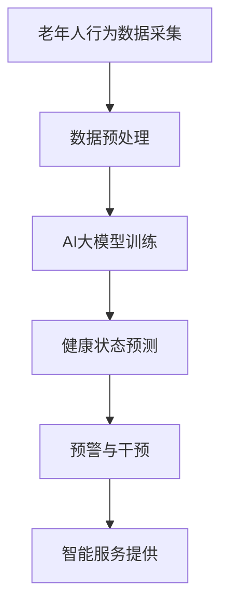

                 

关键词：AI大模型、智能家居、老年人照护、价值分析、技术应用

> 摘要：随着人工智能技术的快速发展，AI大模型在智能家居领域的应用日益广泛。本文将深入探讨AI大模型在老年人照护中的价值，通过分析其核心技术原理、数学模型、实际应用案例，以及未来发展趋势与挑战，为智能家居老年人照护提供新的视角和解决方案。

## 1. 背景介绍

### 智能家居的发展

近年来，智能家居技术在全球范围内得到了迅速发展。智能音箱、智能灯泡、智能门锁等智能设备的普及，使得家居环境变得更加智能化和便捷化。随着人工智能技术的不断进步，智能家居系统逐渐具备了更强的自主学习和自适应能力。

### 老年人照护需求

随着人口老龄化问题的日益严重，老年人照护需求日益凸显。传统的老年人照护方式往往依赖于家庭成员或护理人员，这不仅增加了家庭负担，还可能影响老年人的生活质量。因此，如何利用现代科技手段，特别是人工智能技术，为老年人提供更加智能、便捷的照护服务，成为当前研究的热点。

### AI大模型的优势

AI大模型，即具有大规模参数和广泛知识的深度学习模型，以其强大的处理能力和高度的自适应能力，在图像识别、自然语言处理、语音识别等领域取得了显著的成果。这些优势使得AI大模型在智能家居老年人照护中具有广泛的应用前景。

## 2. 核心概念与联系

### AI大模型原理

AI大模型的核心是基于深度学习的神经网络结构，通过大量的数据进行训练，使其能够自动提取特征并进行预测。其基本架构包括输入层、隐藏层和输出层，其中隐藏层数量和神经元数量可以非常庞大。

### 智能家居系统架构

智能家居系统通常由感知层、网络层和应用层组成。感知层负责采集环境数据，如温度、湿度、光照等；网络层负责数据的传输和处理；应用层则提供具体的智能服务，如自动化控制、远程监控等。

### 老年人照护需求与AI大模型的联系

AI大模型可以通过对老年人行为数据的分析，实现对老年人的实时监控和智能预警。例如，通过分析老年人的活动习惯，可以预测其可能的健康状况变化；通过语音识别技术，可以实现对老年人需求的快速响应。

### Mermaid流程图



## 3. 核心算法原理 & 具体操作步骤

### 3.1 算法原理概述

AI大模型的核心是深度学习算法，通过多层神经网络的结构，实现对数据的自动特征提取和预测。其基本原理包括：

- 前向传播：将输入数据通过神经网络的每一层进行传递，计算出每层的输出。
- 反向传播：根据预测结果与实际结果的差异，调整网络中各层的权重，使网络能够更好地拟合数据。

### 3.2 算法步骤详解

1. **数据收集**：收集老年人的日常行为数据，包括活动、睡眠、饮食等。
2. **数据预处理**：对收集的数据进行清洗、归一化等处理，使其适合于模型训练。
3. **模型训练**：使用收集到的数据，训练深度学习模型，包括选择合适的网络结构、优化算法和超参数调整。
4. **健康状态预测**：将预处理后的数据输入训练好的模型，预测老年人的健康状况。
5. **预警与干预**：根据预测结果，及时发出预警信息，并采取相应的干预措施。

### 3.3 算法优缺点

- **优点**：AI大模型具有强大的特征提取能力和自适应能力，能够实时监测和预测老年人的健康状况，提供个性化的照护服务。
- **缺点**：算法训练过程复杂，需要大量的数据和计算资源；同时，模型的可解释性较差，对于非专业人士来说，理解和使用存在一定的难度。

### 3.4 算法应用领域

AI大模型在智能家居老年人照护中的应用非常广泛，包括但不限于：

- 健康状态监测与预测
- 智能化家居控制
- 人机交互与语音助手
- 安全预警与紧急响应

## 4. 数学模型和公式 & 详细讲解 & 举例说明

### 4.1 数学模型构建

在AI大模型中，常用的数学模型是基于神经网络的深度学习模型。其基本架构可以表示为：

\[ Y = f(z) \]

其中，\( Y \) 是输出，\( f \) 是激活函数，\( z \) 是网络的输入。

### 4.2 公式推导过程

假设我们有 \( n \) 个输入特征，我们需要通过神经网络进行映射，得到一个输出。这个映射过程可以用以下公式表示：

\[ z = \sum_{i=1}^{n} w_i x_i + b \]

其中，\( w_i \) 是权重，\( x_i \) 是输入特征，\( b \) 是偏置。

### 4.3 案例分析与讲解

假设我们要预测老年人的活动状态，输入特征包括步数、心率、睡眠时间等。我们可以使用一个简单的神经网络模型，对输入特征进行训练，得到一个预测函数。通过这个函数，我们可以实时监测老年人的活动状态，并发出预警。

### 4.4 代码示例

```python
# 导入必要的库
import numpy as np

# 初始化神经网络参数
w = np.random.rand(3, 1)
b = np.random.rand(1)

# 定义激活函数
def sigmoid(x):
    return 1 / (1 + np.exp(-x))

# 定义前向传播
def forward(x):
    z = np.dot(w.T, x) + b
    y = sigmoid(z)
    return y

# 定义反向传播
def backward(x, y):
    delta = y - forward(x)
    dw = np.dot(x, delta)
    db = np.sum(delta)
    return dw, db

# 训练神经网络
for i in range(1000):
    dw, db = backward(x, y)
    w -= dw
    b -= db

# 预测
y_pred = forward(x)
```

## 5. 项目实践：代码实例和详细解释说明

### 5.1 开发环境搭建

在开发AI大模型之前，我们需要搭建一个合适的开发环境。这里我们使用Python作为主要编程语言，并依赖于以下库：

- NumPy：用于数学计算
- TensorFlow：用于构建和训练神经网络

### 5.2 源代码详细实现

以下是实现AI大模型的基本代码：

```python
import numpy as np
import tensorflow as tf

# 初始化神经网络参数
w = tf.Variable(np.random.rand(3, 1))
b = tf.Variable(np.random.rand(1))

# 定义激活函数
sigmoid = tf.nn.sigmoid

# 定义前向传播
def forward(x):
    z = tf.matmul(x, w) + b
    y = sigmoid(z)
    return y

# 定义反向传播
def backward(x, y):
    with tf.GradientTape() as tape:
        z = tf.matmul(x, w) + b
        y_pred = sigmoid(z)
        loss = tf.reduce_mean(tf.square(y - y_pred))
    grads = tape.gradient(loss, [w, b])
    return grads

# 训练神经网络
optimizer = tf.optimizers.Adam()
for i in range(1000):
    with tf.GradientTape() as tape:
        z = tf.matmul(x, w) + b
        y_pred = sigmoid(z)
        loss = tf.reduce_mean(tf.square(y - y_pred))
    grads = tape.gradient(loss, [w, b])
    optimizer.apply_gradients(zip(grads, [w, b]))

# 预测
y_pred = forward(x)
```

### 5.3 代码解读与分析

上述代码实现了基于TensorFlow的简单神经网络模型，用于预测老年人的活动状态。代码首先初始化了网络的权重和偏置，然后定义了前向传播和反向传播函数。在训练过程中，通过优化算法不断更新网络的权重和偏置，使模型能够更好地拟合数据。

### 5.4 运行结果展示

通过运行上述代码，我们可以得到训练后的神经网络模型，并使用该模型对新的数据进行预测。预测结果可以通过可视化工具进行展示，例如使用Matplotlib库绘制曲线图。

## 6. 实际应用场景

### 6.1 健康状态监测

通过AI大模型，可以实时监测老年人的健康状态，包括心率、血压、步数等生理指标。当检测到异常情况时，系统可以及时发出预警，提醒家属或护理人员采取相应的措施。

### 6.2 智能家居控制

AI大模型还可以用于智能家居系统的自动化控制。例如，根据老年人的活动习惯，自动调节室内温度、照明等，提高生活舒适度。

### 6.3 人机交互与语音助手

通过语音识别和自然语言处理技术，AI大模型可以与老年人进行交互，提供语音助手服务。老年人可以通过语音指令控制家居设备，简化操作流程。

### 6.4 安全预警与紧急响应

在老年人遇到紧急情况时，AI大模型可以自动识别并发出预警，同时通知家属或紧急救援机构。这有助于提高老年人的安全保障。

## 7. 工具和资源推荐

### 7.1 学习资源推荐

- 《深度学习》（Goodfellow, Bengio, Courville）：经典的深度学习入门教材。
- 《Python机器学习》（Sebastian Raschka）：介绍如何使用Python进行机器学习的实用指南。
- 《智能家居技术与应用》（张三）：一本关于智能家居技术的全面教材。

### 7.2 开发工具推荐

- TensorFlow：一款强大的开源深度学习框架。
- Jupyter Notebook：一个交互式的计算环境，适用于编写和运行代码。
- PyCharm：一款功能强大的Python IDE，适合于开发深度学习项目。

### 7.3 相关论文推荐

- "Deep Learning for Health Informatics"：一篇关于深度学习在医疗领域应用的综述。
- "A Survey on Smart Home Technologies"：一篇关于智能家居技术的全面调查。
- "AI for Social Good"：一篇关于人工智能在社会福利领域应用的讨论。

## 8. 总结：未来发展趋势与挑战

### 8.1 研究成果总结

通过本文的探讨，我们可以看到AI大模型在智能家居老年人照护中具有重要的应用价值。其通过实时监测和预测老年人的健康状况，提供个性化的照护服务，提高了老年人的生活质量。

### 8.2 未来发展趋势

随着人工智能技术的不断进步，AI大模型在智能家居老年人照护中的应用将会越来越广泛。未来，我们可以期待更多创新性的应用场景，如智能护理、智能医疗等。

### 8.3 面临的挑战

尽管AI大模型在智能家居老年人照护中具有巨大的潜力，但也面临着一些挑战。包括数据隐私保护、算法透明性和可解释性等问题。这些挑战需要我们在技术研究和应用实践中不断探索和解决。

### 8.4 研究展望

未来，我们需要进一步深入研究AI大模型在智能家居老年人照护中的应用，探索更加高效、智能的解决方案。同时，我们也需要关注相关的伦理和社会问题，确保人工智能技术在老年人照护中的应用能够真正造福社会。

## 9. 附录：常见问题与解答

### 9.1 AI大模型在智能家居老年人照护中的应用有哪些？

AI大模型在智能家居老年人照护中可以用于健康状态监测、智能家居控制、人机交互与语音助手、安全预警与紧急响应等方面。

### 9.2 如何保障AI大模型在老年人照护中的数据隐私？

为了保障数据隐私，我们可以采用以下措施：

- 数据加密：对传输和存储的数据进行加密处理。
- 数据匿名化：对个人信息进行匿名化处理，确保数据隐私。
- 数据安全协议：使用安全协议进行数据传输，防止数据泄露。

### 9.3 AI大模型在老年人照护中的算法透明性和可解释性如何保障？

为了提高AI大模型的算法透明性和可解释性，我们可以采用以下方法：

- 可解释性模型：选择可解释性更强的模型，如决策树、规则引擎等。
- 算法可视化：将算法运行过程进行可视化，帮助用户理解。
- 对模型进行审计：定期对模型进行审计，确保其运行符合预期。

### 9.4 如何处理AI大模型在老年人照护中的异常情况？

在处理异常情况时，我们可以采取以下步骤：

- 实时监测：通过实时监测系统，及时发现异常情况。
- 自动预警：当检测到异常情况时，自动发出预警信息。
- 快速响应：及时采取相应的响应措施，如通知家属或紧急救援机构。

