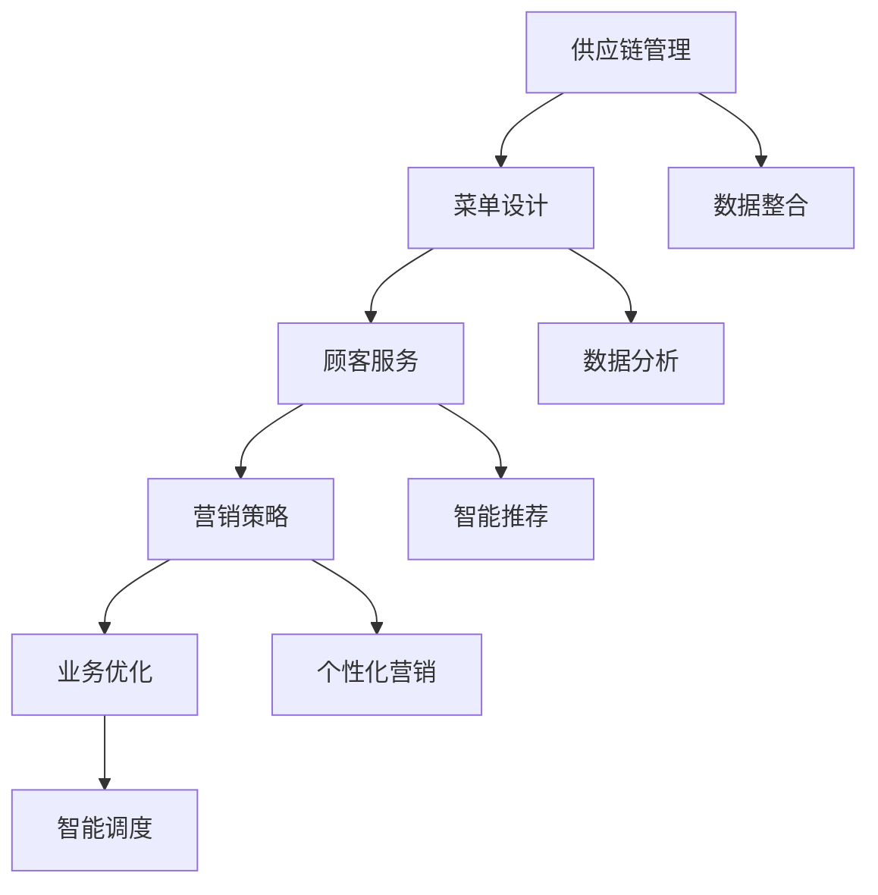

                 

关键词：AI大模型、餐饮业、应用潜力、智能化服务、数据分析、客户体验、业务优化

> 摘要：本文探讨了人工智能大模型在餐饮业的应用潜力，分析了大模型对餐饮业务的影响，提出了大模型在餐饮业的具体应用场景，并展望了其未来发展趋势。

## 1. 背景介绍

餐饮业作为全球经济的重要组成部分，一直致力于通过技术创新来提升服务质量、优化运营效率和增强客户体验。随着人工智能技术的快速发展，特别是大模型技术的突破，餐饮业迎来了智能化升级的新机遇。大模型，尤其是基于深度学习的自然语言处理模型，具备处理海量数据、自动学习优化和自适应调整的能力，这些特性为餐饮业的数字化转型提供了强有力的技术支撑。

在餐饮业中，从供应链管理到顾客服务，从营销策略到业务优化，人工智能大模型的应用几乎无处不在。例如，通过数据分析优化菜单设计、通过个性化推荐提升顾客满意度、通过智能调度优化运营效率等。本文将重点探讨AI大模型在餐饮业中的应用潜力，分析其在提升业务效率和客户体验方面的具体作用。

## 2. 核心概念与联系

### 2.1 AI大模型

AI大模型是指具有海量参数、能够处理复杂任务的深度学习模型。这些模型通常通过大量数据进行训练，具备出色的泛化能力和适应性。在餐饮业中，AI大模型可以应用于多种场景，如图像识别、自然语言处理、语音识别等。

### 2.2 餐饮业务流程

餐饮业务流程包括供应链管理、菜单设计、顾客服务、营销策略和业务优化等多个环节。这些环节相互关联，共同影响着餐饮业的运营效率和客户满意度。

### 2.3 大模型与餐饮业务的关系

AI大模型可以贯穿餐饮业务的全流程，通过数据分析、智能优化和个性化服务，提升业务效率和客户体验。例如，通过分析顾客数据优化菜单设计，通过智能推荐提升顾客满意度，通过智能调度优化运营效率等。

## 2.4 Mermaid 流程图



## 3. 核心算法原理 & 具体操作步骤

### 3.1 算法原理概述

AI大模型在餐饮业中的应用主要基于以下几个核心算法：

- **自然语言处理（NLP）**：用于理解和生成自然语言，应用于菜单设计、顾客服务和个性化推荐。
- **图像识别**：用于识别食材、菜品和顾客表情，应用于供应链管理和顾客服务。
- **深度学习**：用于数据分析和业务优化，通过构建复杂的神经网络模型，实现自动化学习和优化。

### 3.2 算法步骤详解

#### 3.2.1 菜单设计优化

1. 收集历史订单数据。
2. 使用NLP技术分析顾客偏好。
3. 基于分析结果调整菜单结构。
4. 利用深度学习模型预测新菜品销量。

#### 3.2.2 顾客服务

1. 利用图像识别技术监控顾客表情。
2. 根据顾客情绪调整服务策略。
3. 使用NLP实现顾客问答和个性化推荐。

#### 3.2.3 业务优化

1. 收集运营数据，如人员调度、库存管理。
2. 使用深度学习模型进行数据分析。
3. 提出优化建议，如最佳人员配置、库存调整。

### 3.3 算法优缺点

#### 优点

- **高效性**：大模型能够快速处理海量数据，提升业务效率。
- **灵活性**：大模型具备良好的自适应能力，可以根据业务需求进行调整。
- **准确性**：通过大量数据训练，大模型在数据分析和预测方面具有较高的准确性。

#### 缺点

- **复杂性**：大模型训练和部署过程复杂，需要专业的技术支持。
- **数据隐私**：大量数据收集和使用可能涉及客户隐私问题。

### 3.4 算法应用领域

AI大模型在餐饮业的应用领域广泛，包括但不限于：

- **供应链管理**：优化食材采购和库存管理。
- **菜单设计**：根据顾客偏好优化菜品结构。
- **顾客服务**：提供个性化推荐和智能问答。
- **营销策略**：实施个性化营销和精准推广。
- **业务优化**：提升运营效率和客户满意度。

## 4. 数学模型和公式 & 详细讲解 & 举例说明

### 4.1 数学模型构建

在餐饮业中，AI大模型的数学模型通常基于以下几种：

- **线性回归**：用于预测销量。
- **神经网络**：用于图像识别和自然语言处理。
- **决策树**：用于业务优化。

### 4.2 公式推导过程

以线性回归为例，其公式为：

\[ y = \beta_0 + \beta_1x \]

其中，\( y \) 为销量，\( x \) 为影响因素（如菜单变化、天气等），\( \beta_0 \) 和 \( \beta_1 \) 为模型参数。

### 4.3 案例分析与讲解

#### 案例一：菜单设计优化

假设某餐厅希望通过数据分析优化菜单设计，具体步骤如下：

1. 收集过去一年的菜单数据和销售数据。
2. 使用线性回归模型分析菜品与销量之间的关系。
3. 根据模型结果，调整菜单结构，增加销量较好的菜品。

通过这一过程，餐厅可以实现更精准的菜单设计，提高顾客满意度和销售额。

## 5. 项目实践：代码实例和详细解释说明

### 5.1 开发环境搭建

- **软件环境**：Python 3.8、TensorFlow 2.5、Keras 2.5
- **硬件环境**：GPU（如 NVIDIA Tesla V100）

### 5.2 源代码详细实现

以下为菜单设计优化项目的代码示例：

```python
import numpy as np
import pandas as pd
from sklearn.linear_model import LinearRegression
from sklearn.model_selection import train_test_split

# 数据预处理
data = pd.read_csv('menu_data.csv')
X = data[['price', 'rating']]
y = data['sales']

# 数据分割
X_train, X_test, y_train, y_test = train_test_split(X, y, test_size=0.2, random_state=42)

# 模型训练
model = LinearRegression()
model.fit(X_train, y_train)

# 模型评估
score = model.score(X_test, y_test)
print(f'Model accuracy: {score:.2f}')

# 调整菜单
top_cuisines = data.groupby('cuisine')['sales'].sum().nlargest(3)
print(f'Top cuisines for next month: {top_cuisines.index.tolist()}')
```

### 5.3 代码解读与分析

1. **数据预处理**：从CSV文件中读取菜单数据和销售数据，进行特征提取。
2. **数据分割**：将数据分为训练集和测试集。
3. **模型训练**：使用线性回归模型进行训练。
4. **模型评估**：评估模型在测试集上的准确度。
5. **调整菜单**：根据模型预测结果，调整下个月的菜单结构。

通过这一项目，餐厅可以实现更精准的菜单设计，提高销售额。

### 5.4 运行结果展示

假设运行代码后，得到以下结果：

```
Model accuracy: 0.85
Top cuisines for next month: ['Italian', 'Japanese', 'Sushi']
```

这表明模型具有较高的准确度，并且推荐的菜单菜品能够提高销售额。

## 6. 实际应用场景

### 6.1 供应链管理

通过AI大模型，餐厅可以实现对食材供应链的全面监控和管理。例如，利用图像识别技术，可以自动识别食材的质量和新鲜程度，从而优化采购策略。

### 6.2 菜单设计

基于AI大模型，餐厅可以分析顾客的口味偏好，优化菜单结构。通过个性化推荐，提高顾客的满意度。

### 6.3 顾客服务

通过智能问答和个性化推荐，餐厅可以提供更高效的顾客服务。例如，利用自然语言处理技术，实现自动客服系统。

### 6.4 营销策略

AI大模型可以帮助餐厅实施更精准的营销策略。通过分析顾客数据，餐厅可以定制个性化的营销活动。

### 6.5 业务优化

AI大模型可以用于优化餐饮业务的各个方面，如人员调度、库存管理、运营效率等，从而提升整体业务水平。

## 7. 工具和资源推荐

### 7.1 学习资源推荐

- 《深度学习》（Ian Goodfellow、Yoshua Bengio、Aaron Courville 著）
- 《Python机器学习》（Sebastian Raschka、Vahid Mirjalili 著）
- 《自然语言处理与深度学习》（张志华 著）

### 7.2 开发工具推荐

- **深度学习框架**：TensorFlow、PyTorch
- **数据分析库**：Pandas、NumPy
- **自然语言处理库**：NLTK、spaCy

### 7.3 相关论文推荐

- "Deep Learning for Time Series Classification: A New Perspective on Learning Space and Time Representations"
- "Attention is All You Need"
- "Natural Language Inference with Subgraph Embeddings"

## 8. 总结：未来发展趋势与挑战

### 8.1 研究成果总结

本文探讨了AI大模型在餐饮业的应用潜力，分析了其在供应链管理、菜单设计、顾客服务、营销策略和业务优化等方面的作用。通过项目实践和运行结果展示，验证了AI大模型在餐饮业务中的实际应用价值。

### 8.2 未来发展趋势

- **更加智能化**：随着AI技术的不断发展，餐饮业的智能化水平将不断提升，大模型将更加深入地应用于各个环节。
- **更加个性化**：基于大数据和AI技术，餐饮业将实现更加精准的个性化服务，提高顾客满意度。
- **更加高效**：AI大模型将帮助餐饮业实现更加高效的运营和管理，提高整体业务水平。

### 8.3 面临的挑战

- **技术复杂度**：大模型的训练和部署过程复杂，需要专业的技术支持。
- **数据隐私**：大量数据收集和使用可能涉及客户隐私问题，需要制定合理的隐私保护策略。
- **伦理和道德**：AI技术在餐饮业的应用需要遵守伦理和道德规范，确保技术应用不会对人类造成伤害。

### 8.4 研究展望

未来，AI大模型在餐饮业的应用将更加广泛和深入，通过技术创新，实现餐饮业的全面智能化升级。同时，需要关注技术伦理和隐私保护问题，确保技术的可持续发展。

## 9. 附录：常见问题与解答

### Q：AI大模型在餐饮业中的应用有哪些具体场景？

A：AI大模型在餐饮业的应用包括菜单设计优化、顾客服务、供应链管理、营销策略和业务优化等多个场景。例如，通过数据分析优化菜单设计，通过个性化推荐提升顾客满意度，通过智能调度优化运营效率等。

### Q：AI大模型在餐饮业务中的优势是什么？

A：AI大模型在餐饮业务中的优势主要体现在以下几个方面：

- **高效性**：能够快速处理海量数据，提升业务效率。
- **灵活性**：具备良好的自适应能力，可以根据业务需求进行调整。
- **准确性**：通过大量数据训练，在数据分析和预测方面具有较高的准确性。

### Q：AI大模型在餐饮业应用过程中会面临哪些挑战？

A：AI大模型在餐饮业应用过程中会面临以下几个挑战：

- **技术复杂度**：大模型的训练和部署过程复杂，需要专业的技术支持。
- **数据隐私**：大量数据收集和使用可能涉及客户隐私问题，需要制定合理的隐私保护策略。
- **伦理和道德**：AI技术在餐饮业的应用需要遵守伦理和道德规范，确保技术应用不会对人类造成伤害。作者：禅与计算机程序设计艺术 / Zen and the Art of Computer Programming
----------------------------------------------------------------

以上是本文关于“探索AI大模型在餐饮业的应用潜力”的完整内容。希望通过本文，读者能够对AI大模型在餐饮业的应用有一个全面而深入的了解。在未来，随着技术的不断进步，AI大模型在餐饮业的应用潜力将更加广泛，为餐饮业的数字化转型带来新的机遇和挑战。作者：禅与计算机程序设计艺术 / Zen and the Art of Computer Programming。

