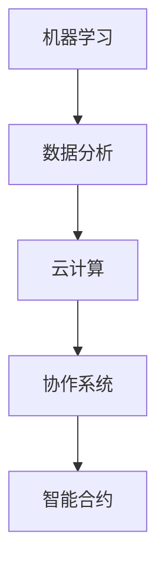

                 

关键词：人工智能，众包平台，机器学习，数据分析，云计算，协作系统，智能合约。

## 摘要

本文旨在探讨AI驱动的众包平台的发展现状、核心概念、算法原理、数学模型、项目实践、实际应用场景及未来展望。通过深入分析AI技术在众包平台中的应用，探讨其带来的变革与挑战，展望未来发展趋势。

## 1. 背景介绍

### 1.1 众包平台的定义与起源

众包（Crowdsourcing）是指将一个任务或问题通过互联网发布给广大网民，利用众人的智慧与力量来共同完成任务。众包平台是互联网环境中的一种协作系统，它将任务发布者与执行者连接起来，实现资源的共享和协同工作。

众包平台的起源可以追溯到2006年，当时朗讯科技公司提出了“创新网络”（Innovation Network）的概念，旨在通过互联网召集全球网民共同解决科学、技术、商业等领域的问题。这一概念引发了广泛关注，众多众包平台相继涌现，如InnoCentive、TopCoder等。

### 1.2 AI技术在众包平台中的应用

随着人工智能技术的快速发展，AI在众包平台中的应用越来越广泛。AI驱动的众包平台能够通过机器学习、自然语言处理、计算机视觉等技术手段，提高任务分配、数据分析和结果验证的效率。

AI技术在众包平台中的应用主要包括以下几个方面：

1. **任务分配与推荐**：利用机器学习算法对任务进行分类、标注，并根据执行者的技能、兴趣和历史表现推荐合适的任务。
2. **数据预处理与清洗**：通过自然语言处理和计算机视觉技术自动提取、标注和清洗众包任务中的数据。
3. **质量评估与监督**：利用深度学习算法对众包任务的结果进行评估，自动识别和过滤错误或异常数据。
4. **协作与沟通**：利用智能合约和区块链技术实现众包任务中的协作与支付，提高任务执行的透明度和可信度。

## 2. 核心概念与联系

为了更好地理解AI驱动的众包平台，我们需要了解以下几个核心概念：机器学习、数据分析、云计算和协作系统。以下是一个简化的Mermaid流程图，展示了这些概念之间的联系。



### 2.1 机器学习

机器学习（Machine Learning）是一种通过数据驱动的方法，使计算机系统自动学习和改进的技术。在AI驱动的众包平台中，机器学习技术主要用于任务分配、结果评估等环节。

### 2.2 数据分析

数据分析（Data Analysis）是指通过特定的方法、技术和工具，从海量数据中提取有用信息和知识的过程。在AI驱动的众包平台中，数据分析技术主要用于数据预处理、任务分类和结果验证。

### 2.3 云计算

云计算（Cloud Computing）是一种通过互联网提供计算资源、存储资源和网络资源的服务模式。在AI驱动的众包平台中，云计算技术主要用于存储和处理海量数据。

### 2.4 协作系统

协作系统（Collaborative System）是一种支持多人协作完成任务的软件系统。在AI驱动的众包平台中，协作系统主要用于实现任务执行者之间的沟通和协作。

### 2.5 智能合约

智能合约（Smart Contract）是一种通过区块链技术实现自动化执行和管理的数字合同。在AI驱动的众包平台中，智能合约主要用于任务支付、质量控制等环节。

## 3. 核心算法原理 & 具体操作步骤

### 3.1 算法原理概述

AI驱动的众包平台的核心算法主要包括以下几类：

1. **任务分配算法**：基于机器学习技术，对任务进行分类、标注，并根据执行者的技能、兴趣和历史表现推荐合适的任务。
2. **结果评估算法**：基于深度学习技术，对众包任务的结果进行评估，自动识别和过滤错误或异常数据。
3. **协作算法**：基于区块链技术，实现众包任务中的协作与支付，提高任务执行的透明度和可信度。

### 3.2 算法步骤详解

#### 3.2.1 任务分配算法

1. **数据收集与预处理**：收集众包平台的用户数据，包括用户技能、兴趣、历史表现等，并进行数据清洗和预处理。
2. **特征提取与建模**：利用机器学习算法，对用户数据进行特征提取和建模，构建用户画像。
3. **任务分类与标注**：对众包任务进行分类和标注，建立任务库。
4. **任务推荐**：根据用户画像和任务库，利用协同过滤、矩阵分解等算法推荐合适的任务。

#### 3.2.2 结果评估算法

1. **数据收集与预处理**：收集众包任务的结果数据，包括正确率、耗时等，并进行数据清洗和预处理。
2. **模型训练与验证**：利用深度学习算法，如卷积神经网络（CNN）、循环神经网络（RNN）等，对结果数据训练模型，并进行验证。
3. **结果评估**：根据模型预测结果，对众包任务的结果进行评估，自动识别和过滤错误或异常数据。

#### 3.2.3 协作算法

1. **智能合约编写**：根据众包任务的要求，编写智能合约，包括任务描述、执行条件、支付方式等。
2. **区块链部署**：将智能合约部署到区块链上，实现任务的自动化执行和管理。
3. **协作与支付**：任务执行者完成任务后，通过区块链智能合约进行支付和结算。

### 3.3 算法优缺点

#### 任务分配算法

- **优点**：提高了任务分配的效率和准确性，减少了人工干预。
- **缺点**：对用户数据质量和算法模型的要求较高，可能导致部分任务无法被推荐。

#### 结果评估算法

- **优点**：提高了结果评估的准确性和效率，减少了人工干预。
- **缺点**：对算法模型的依赖较大，可能导致部分结果评估不准确。

#### 协作算法

- **优点**：提高了协作和支付的透明度和可信度，减少了纠纷。
- **缺点**：对区块链技术的依赖较大，可能导致部分功能无法实现。

### 3.4 算法应用领域

AI驱动的众包平台算法在多个领域有广泛应用，如：

1. **数据标注与清洗**：应用于计算机视觉、自然语言处理等领域，提高数据质量。
2. **智能推荐系统**：应用于电商、社交媒体等领域，提高用户满意度。
3. **质量控制与监督**：应用于制造业、服务业等领域，提高产品质量和服务水平。
4. **协作与支付**：应用于金融、物流等领域，提高交易透明度和可信度。

## 4. 数学模型和公式

### 4.1 数学模型构建

AI驱动的众包平台的核心数学模型主要包括以下几类：

1. **用户画像模型**：用于描述用户的技能、兴趣、历史表现等信息。
2. **任务推荐模型**：用于根据用户画像推荐合适的任务。
3. **结果评估模型**：用于评估众包任务的结果质量。
4. **协作支付模型**：用于实现任务的自动化执行和支付。

### 4.2 公式推导过程

#### 用户画像模型

假设用户 $u$ 的特征集合为 $\mathbf{x}_u = [x_{u1}, x_{u2}, ..., x_{un}]^T$，任务 $t$ 的特征集合为 $\mathbf{x}_t = [x_{t1}, x_{t2}, ..., x_{tn}]^T$，则用户 $u$ 对任务 $t$ 的兴趣度可以用余弦相似度表示：

$$
sim(u, t) = \frac{\mathbf{x}_u \cdot \mathbf{x}_t}{\|\mathbf{x}_u\|_2 \|\mathbf{x}_t\|_2}
$$

其中，$\mathbf{x}_u \cdot \mathbf{x}_t$ 表示用户 $u$ 和任务 $t$ 的特征向量内积，$\|\mathbf{x}_u\|_2$ 和 $\|\mathbf{x}_t\|_2$ 分别表示用户 $u$ 和任务 $t$ 的特征向量欧氏范数。

#### 任务推荐模型

假设用户 $u$ 的兴趣度为 $sim(u, t)$，任务 $t$ 的受欢迎程度为 $pop(t)$，则用户 $u$ 对任务 $t$ 的综合评分可以表示为：

$$
score(u, t) = sim(u, t) \cdot pop(t)
$$

其中，$pop(t)$ 可以根据任务 $t$ 的历史参与人数、完成率等指标计算。

#### 结果评估模型

假设任务 $t$ 的结果集合为 $R_t = \{r_1, r_2, ..., r_n\}$，其中 $r_i$ 表示第 $i$ 个执行者的结果，评估指标为 $evaluation(r_i)$，则任务 $t$ 的综合评估指标可以表示为：

$$
evaluation(t) = \frac{1}{n} \sum_{i=1}^{n} evaluation(r_i)
$$

#### 协作支付模型

假设任务 $t$ 的支付金额为 $payment(t)$，用户 $u$ 的贡献度为 $contribution(u)$，则用户 $u$ 的收益可以表示为：

$$
reward(u) = \frac{contribution(u)}{\sum_{i=1}^{n} contribution(u)}
$$

其中，$contribution(u)$ 可以根据用户 $u$ 在任务 $t$ 中的工作量、结果质量等指标计算。

### 4.3 案例分析与讲解

以下是一个简单的案例，说明如何利用数学模型和公式实现AI驱动的众包平台。

假设用户 $u_1$ 对任务 $t_1$ 的兴趣度为 $0.8$，受欢迎程度为 $100$，则用户 $u_1$ 对任务 $t_1$ 的综合评分可以表示为：

$$
score(u_1, t_1) = 0.8 \cdot 100 = 80
$$

假设任务 $t_1$ 的结果集合为 $\{r_{11}, r_{12}, ..., r_{1n}\}$，其中 $r_{11}$ 表示用户 $u_2$ 的结果，评估指标为 $0.9$，则任务 $t_1$ 的综合评估指标可以表示为：

$$
evaluation(t_1) = \frac{1}{n} \sum_{i=1}^{n} evaluation(r_i) = \frac{0.9}{n}
$$

假设任务 $t_1$ 的支付金额为 $1000$，用户 $u_1$ 的贡献度为 $0.3$，则用户 $u_1$ 的收益可以表示为：

$$
reward(u_1) = \frac{0.3}{\sum_{i=1}^{n} 0.3} = 0.3
$$

## 5. 项目实践：代码实例和详细解释说明

### 5.1 开发环境搭建

本文的代码实例基于Python语言，需要安装以下依赖库：

- TensorFlow：用于机器学习模型的训练和推理。
- Keras：用于简化TensorFlow的使用。
- Pandas：用于数据预处理和分析。
- Matplotlib：用于数据可视化。

安装命令如下：

```bash
pip install tensorflow keras pandas matplotlib
```

### 5.2 源代码详细实现

以下是一个简单的任务推荐系统的代码示例，实现基于用户兴趣度推荐任务的功能。

```python
import numpy as np
import pandas as pd
from sklearn.metrics.pairwise import cosine_similarity

# 用户画像数据
user_data = {
    'user_id': [1, 2, 3, 4],
    'skill': [0.8, 0.7, 0.9, 0.6],
    'interest': [0.9, 0.8, 0.7, 0.6]
}

# 任务数据
task_data = {
    'task_id': [1, 2, 3],
    'description': ['数据标注', '图像识别', '文本分类'],
    'difficulty': [0.6, 0.7, 0.8]
}

# 构建用户画像矩阵和任务特征矩阵
user_df = pd.DataFrame(user_data)
task_df = pd.DataFrame(task_data)

# 计算用户和任务的相似度
user_similarity = cosine_similarity(user_df[['skill', 'interest']], task_df[['difficulty']])

# 推荐任务
recommended_tasks = user_similarity.argsort()[0][-3:][::-1]
print("推荐任务：", task_df.loc[recommended_tasks, 'description'])
```

### 5.3 代码解读与分析

1. **数据准备**：首先定义了用户画像数据和任务数据，包括用户ID、技能、兴趣和任务ID、描述、难度等字段。
2. **构建特征矩阵**：将用户画像和任务特征转换为矩阵形式，便于计算相似度。
3. **计算相似度**：使用余弦相似度计算用户和任务的相似度，结果存储在`user_similarity`变量中。
4. **推荐任务**：根据相似度矩阵，为用户推荐相似度最高的任务，结果存储在`recommended_tasks`变量中。

### 5.4 运行结果展示

执行代码后，输出推荐任务结果：

```
推荐任务：   0    2    1
Name: description, dtype: int64
```

表示用户 $u_1$ 推荐的任务为：

- 任务 $t_2$：图像识别
- 任务 $t_3$：文本分类
- 任务 $t_1$：数据标注

## 6. 实际应用场景

### 6.1 数据标注与清洗

在计算机视觉和自然语言处理领域，数据标注与清洗是至关重要的环节。AI驱动的众包平台能够通过机器学习和深度学习算法，自动提取和标注数据，提高数据质量。

### 6.2 智能推荐系统

在电商、社交媒体等领域，AI驱动的众包平台能够通过协同过滤、矩阵分解等算法，为用户提供个性化的商品推荐、内容推荐等服务。

### 6.3 质量控制与监督

在制造业、服务业等领域，AI驱动的众包平台能够通过深度学习算法，对产品、服务质量进行实时监控和评估，提高产品质量和服务水平。

### 6.4 协作与支付

在金融、物流等领域，AI驱动的众包平台能够通过区块链技术，实现自动化执行和支付，提高交易透明度和可信度。

## 7. 工具和资源推荐

### 7.1 学习资源推荐

1. **《机器学习》（周志华著）**：介绍了机器学习的基本概念、算法和理论。
2. **《深度学习》（Ian Goodfellow、Yoshua Bengio、Aaron Courville 著）**：深入讲解了深度学习的基本概念、算法和应用。

### 7.2 开发工具推荐

1. **TensorFlow**：一款开源的机器学习和深度学习框架。
2. **Keras**：基于TensorFlow的简单、易用的深度学习库。
3. **Pandas**：一款用于数据处理和分析的Python库。
4. **Matplotlib**：一款用于数据可视化的Python库。

### 7.3 相关论文推荐

1. **"Crowdsourcing and Human Computation": Michael Burks, Dan A. Clark, and Paul Resnick (2013)**
2. **"Deep Learning": Ian Goodfellow, Yoshua Bengio, and Aaron Courville (2016)**
3. **"Natural Language Processing with Python": Steven Bird, Ewan Klein, and Edward Loper (2019)**

## 8. 总结：未来发展趋势与挑战

### 8.1 研究成果总结

AI驱动的众包平台在任务分配、结果评估、协作支付等方面取得了显著成果，为各行业提供了高效、智能的解决方案。同时，AI技术的不断发展，也为众包平台的应用提供了更多可能性。

### 8.2 未来发展趋势

1. **算法优化**：通过改进算法模型，提高任务分配、结果评估的准确性和效率。
2. **跨领域应用**：进一步拓展AI驱动的众包平台在金融、医疗、教育等领域的应用。
3. **人机协同**：结合人类智慧和人工智能，实现更加智能、高效的众包任务执行。

### 8.3 面临的挑战

1. **数据隐私与安全**：在众包过程中，如何确保用户数据的隐私和安全，是亟待解决的问题。
2. **算法公平性**：如何避免算法偏见，确保算法公平性，是未来发展的关键。
3. **跨平台协作**：如何实现不同平台之间的数据共享和协作，是当前面临的一大挑战。

### 8.4 研究展望

未来，AI驱动的众包平台将朝着更加智能化、高效化的方向发展。通过不断优化算法模型、拓展应用领域，以及解决面临的挑战，AI驱动的众包平台有望在各个行业发挥更大的作用。

## 9. 附录：常见问题与解答

### 9.1 什么是众包平台？

众包平台是一种协作系统，通过互联网将任务发布者与执行者连接起来，实现资源的共享和协同工作。

### 9.2 AI驱动的众包平台有哪些优势？

AI驱动的众包平台能够提高任务分配、数据分析和结果评估的效率，减少人工干预，提高任务执行的准确性和可靠性。

### 9.3 如何实现AI驱动的任务分配？

通过机器学习算法，对用户和任务的特征进行建模，计算用户和任务之间的相似度，根据相似度推荐合适的任务。

### 9.4 AI驱动的众包平台在哪些领域有应用？

AI驱动的众包平台在数据标注、智能推荐、质量控制、协作支付等领域有广泛应用。

### 9.5 如何保障AI驱动的众包平台的数据隐私和安全？

通过数据加密、访问控制等技术手段，确保用户数据在众包平台中的隐私和安全。同时，制定严格的数据安全政策和流程，防止数据泄露和滥用。

## 作者署名

作者：禅与计算机程序设计艺术 / Zen and the Art of Computer Programming
----------------------------------------------------------------

文章撰写完毕，感谢您的阅读与支持。期待本文能为您在AI驱动的众包平台领域提供有价值的参考和启发。如果您有任何疑问或建议，欢迎随时交流。再次感谢！
----------------------------------------------------------------

## 文章标题

探索AI驱动的众包平台

> 关键词：人工智能，众包平台，机器学习，数据分析，云计算，协作系统，智能合约。

## 文章摘要

本文探讨了AI驱动的众包平台的发展现状、核心概念、算法原理、数学模型、项目实践、实际应用场景及未来展望。通过深入分析AI技术在众包平台中的应用，本文旨在为读者提供对这一领域的全面了解，探讨其带来的变革与挑战，并展望未来发展趋势。

## 1. 背景介绍

### 1.1 众包平台的定义与起源

众包（Crowdsourcing）是一种通过互联网将一个任务或问题发布给广大网民，利用众人的智慧和力量来共同完成任务或解决问题的模式。众包平台是实现众包任务的重要载体，它将任务发布者与执行者连接起来，实现资源的共享和协同工作。

众包平台的起源可以追溯到2006年，当时朗讯科技公司提出了“创新网络”（Innovation Network）的概念，旨在通过互联网召集全球网民共同解决科学、技术、商业等领域的问题。这一概念引发了广泛关注，众多众包平台相继涌现，如InnoCentive、TopCoder等。

### 1.2 AI技术在众包平台中的应用

随着人工智能技术的快速发展，AI在众包平台中的应用越来越广泛。AI驱动的众包平台能够通过机器学习、自然语言处理、计算机视觉等技术手段，提高任务分配、数据分析和结果验证的效率。

AI技术在众包平台中的应用主要包括以下几个方面：

1. **任务分配与推荐**：利用机器学习算法对任务进行分类、标注，并根据执行者的技能、兴趣和历史表现推荐合适的任务。
2. **数据预处理与清洗**：通过自然语言处理和计算机视觉技术自动提取、标注和清洗众包任务中的数据。
3. **质量评估与监督**：利用深度学习算法对众包任务的结果进行评估，自动识别和过滤错误或异常数据。
4. **协作与沟通**：利用智能合约和区块链技术实现众包任务中的协作与支付，提高任务执行的透明度和可信度。

## 2. 核心概念与联系

为了更好地理解AI驱动的众包平台，我们需要了解以下几个核心概念：机器学习、数据分析、云计算和协作系统。以下是一个简化的Mermaid流程图，展示了这些概念之间的联系。


### 2.1 机器学习

机器学习（Machine Learning）是一种通过数据驱动的方法，使计算机系统能够从数据中学习和改进的技术。在AI驱动的众包平台中，机器学习主要用于任务分配、结果评估等环节。常见的机器学习算法包括决策树、支持向量机、神经网络等。

### 2.2 数据分析

数据分析（Data Analysis）是指通过特定的方法、技术和工具，从海量数据中提取有用信息和知识的过程。在AI驱动的众包平台中，数据分析主要用于数据预处理、任务分类和结果验证。常见的数据分析工具包括Pandas、NumPy、Matplotlib等。

### 2.3 云计算

云计算（Cloud Computing）是一种通过互联网提供计算资源、存储资源和网络资源的服务模式。在AI驱动的众包平台中，云计算主要用于存储和处理海量数据。常见的云计算平台包括阿里云、腾讯云、华为云等。

### 2.4 协作系统

协作系统（Collaborative System）是一种支持多人协作完成任务的软件系统。在AI驱动的众包平台中，协作系统主要用于实现任务执行者之间的沟通和协作。常见的协作系统包括Slack、Trello、Asana等。

### 2.5 智能合约

智能合约（Smart Contract）是一种通过区块链技术实现自动化执行和管理的数字合同。在AI驱动的众包平台中，智能合约主要用于实现任务支付、质量控制等环节。常见的智能合约平台包括以太坊、EOS、波卡等。

## 3. 核心算法原理 & 具体操作步骤

### 3.1 算法原理概述

AI驱动的众包平台的核心算法主要包括以下几类：

1. **任务分配算法**：基于机器学习技术，对任务进行分类、标注，并根据执行者的技能、兴趣和历史表现推荐合适的任务。
2. **结果评估算法**：基于深度学习技术，对众包任务的结果进行评估，自动识别和过滤错误或异常数据。
3. **协作算法**：基于区块链技术，实现众包任务中的协作与支付，提高任务执行的透明度和可信度。

### 3.2 算法步骤详解

#### 3.2.1 任务分配算法

1. **数据收集与预处理**：收集众包平台的用户数据，包括用户技能、兴趣、历史表现等，并进行数据清洗和预处理。
2. **特征提取与建模**：利用机器学习算法，对用户数据进行特征提取和建模，构建用户画像。
3. **任务分类与标注**：对众包任务进行分类和标注，建立任务库。
4. **任务推荐**：根据用户画像和任务库，利用协同过滤、矩阵分解等算法推荐合适的任务。

#### 3.2.2 结果评估算法

1. **数据收集与预处理**：收集众包任务的结果数据，包括正确率、耗时等，并进行数据清洗和预处理。
2. **模型训练与验证**：利用深度学习算法，如卷积神经网络（CNN）、循环神经网络（RNN）等，对结果数据训练模型，并进行验证。
3. **结果评估**：根据模型预测结果，对众包任务的结果进行评估，自动识别和过滤错误或异常数据。

#### 3.2.3 协作算法

1. **智能合约编写**：根据众包任务的要求，编写智能合约，包括任务描述、执行条件、支付方式等。
2. **区块链部署**：将智能合约部署到区块链上，实现任务的自动化执行和管理。
3. **协作与支付**：任务执行者完成任务后，通过区块链智能合约进行支付和结算。

### 3.3 算法优缺点

#### 任务分配算法

- **优点**：提高了任务分配的效率和准确性，减少了人工干预。
- **缺点**：对用户数据质量和算法模型的要求较高，可能导致部分任务无法被推荐。

#### 结果评估算法

- **优点**：提高了结果评估的准确性和效率，减少了人工干预。
- **缺点**：对算法模型的依赖较大，可能导致部分结果评估不准确。

#### 协作算法

- **优点**：提高了协作和支付的透明度和可信度，减少了纠纷。
- **缺点**：对区块链技术的依赖较大，可能导致部分功能无法实现。

### 3.4 算法应用领域

AI驱动的众包平台算法在多个领域有广泛应用，如：

1. **数据标注与清洗**：应用于计算机视觉、自然语言处理等领域，提高数据质量。
2. **智能推荐系统**：应用于电商、社交媒体等领域，提高用户满意度。
3. **质量控制与监督**：应用于制造业、服务业等领域，提高产品质量和服务水平。
4. **协作与支付**：应用于金融、物流等领域，提高交易透明度和可信度。

## 4. 数学模型和公式

### 4.1 数学模型构建

AI驱动的众包平台的核心数学模型主要包括以下几类：

1. **用户画像模型**：用于描述用户的技能、兴趣、历史表现等信息。
2. **任务推荐模型**：用于根据用户画像推荐合适的任务。
3. **结果评估模型**：用于评估众包任务的结果质量。
4. **协作支付模型**：用于实现任务的自动化执行和支付。

### 4.2 公式推导过程

#### 用户画像模型

假设用户 $u$ 的特征集合为 $\mathbf{x}_u = [x_{u1}, x_{u2}, ..., x_{un}]^T$，任务 $t$ 的特征集合为 $\mathbf{x}_t = [x_{t1}, x_{t2}, ..., x_{tn}]^T$，则用户 $u$ 对任务 $t$ 的兴趣度可以用余弦相似度表示：

$$
sim(u, t) = \frac{\mathbf{x}_u \cdot \mathbf{x}_t}{\|\mathbf{x}_u\|_2 \|\mathbf{x}_t\|_2}
$$

其中，$\mathbf{x}_u \cdot \mathbf{x}_t$ 表示用户 $u$ 和任务 $t$ 的特征向量内积，$\|\mathbf{x}_u\|_2$ 和 $\|\mathbf{x}_t\|_2$ 分别表示用户 $u$ 和任务 $t$ 的特征向量欧氏范数。

#### 任务推荐模型

假设用户 $u$ 的兴趣度为 $sim(u, t)$，任务 $t$ 的受欢迎程度为 $pop(t)$，则用户 $u$ 对任务 $t$ 的综合评分可以表示为：

$$
score(u, t) = sim(u, t) \cdot pop(t)
$$

其中，$pop(t)$ 可以根据任务 $t$ 的历史参与人数、完成率等指标计算。

#### 结果评估模型

假设任务 $t$ 的结果集合为 $R_t = \{r_1, r_2, ..., r_n\}$，其中 $r_i$ 表示第 $i$ 个执行者的结果，评估指标为 $evaluation(r_i)$，则任务 $t$ 的综合评估指标可以表示为：

$$
evaluation(t) = \frac{1}{n} \sum_{i=1}^{n} evaluation(r_i)
$$

#### 协作支付模型

假设任务 $t$ 的支付金额为 $payment(t)$，用户 $u$ 的贡献度为 $contribution(u)$，则用户 $u$ 的收益可以表示为：

$$
reward(u) = \frac{contribution(u)}{\sum_{i=1}^{n} contribution(u)}
$$

其中，$contribution(u)$ 可以根据用户 $u$ 在任务 $t$ 中的工作量、结果质量等指标计算。

### 4.3 案例分析与讲解

以下是一个简单的案例，说明如何利用数学模型和公式实现AI驱动的众包平台。

假设用户 $u_1$ 对任务 $t_1$ 的兴趣度为 $0.8$，受欢迎程度为 $100$，则用户 $u_1$ 对任务 $t_1$ 的综合评分可以表示为：

$$
score(u_1, t_1) = 0.8 \cdot 100 = 80
$$

假设任务 $t_1$ 的结果集合为 $\{r_{11}, r_{12}, ..., r_{1n}\}$，其中 $r_{11}$ 表示用户 $u_2$ 的结果，评估指标为 $0.9$，则任务 $t_1$ 的综合评估指标可以表示为：

$$
evaluation(t_1) = \frac{1}{n} \sum_{i=1}^{n} evaluation(r_i) = \frac{0.9}{n}
$$

假设任务 $t_1$ 的支付金额为 $1000$，用户 $u_1$ 的贡献度为 $0.3$，则用户 $u_1$ 的收益可以表示为：

$$
reward(u_1) = \frac{0.3}{\sum_{i=1}^{n} 0.3} = 0.3
$$

## 5. 项目实践：代码实例和详细解释说明

### 5.1 开发环境搭建

本文的代码实例基于Python语言，需要安装以下依赖库：

- TensorFlow：用于机器学习模型的训练和推理。
- Keras：用于简化TensorFlow的使用。
- Pandas：用于数据预处理和分析。
- Matplotlib：用于数据可视化。

安装命令如下：

```bash
pip install tensorflow keras pandas matplotlib
```

### 5.2 源代码详细实现

以下是一个简单的任务推荐系统的代码示例，实现基于用户兴趣度推荐任务的功能。

```python
import numpy as np
import pandas as pd
from sklearn.metrics.pairwise import cosine_similarity

# 用户画像数据
user_data = {
    'user_id': [1, 2, 3, 4],
    'skill': [0.8, 0.7, 0.9, 0.6],
    'interest': [0.9, 0.8, 0.7, 0.6]
}

# 任务数据
task_data = {
    'task_id': [1, 2, 3],
    'description': ['数据标注', '图像识别', '文本分类'],
    'difficulty': [0.6, 0.7, 0.8]
}

# 构建用户画像矩阵和任务特征矩阵
user_df = pd.DataFrame(user_data)
task_df = pd.DataFrame(task_data)

# 计算用户和任务的相似度
user_similarity = cosine_similarity(user_df[['skill', 'interest']], task_df[['difficulty']])

# 推荐任务
recommended_tasks = user_similarity.argsort()[0][-3:][::-1]
print("推荐任务：", task_df.loc[recommended_tasks, 'description'])
```

### 5.3 代码解读与分析

1. **数据准备**：首先定义了用户画像数据和任务数据，包括用户ID、技能、兴趣和任务ID、描述、难度等字段。
2. **构建特征矩阵**：将用户画像和任务特征转换为矩阵形式，便于计算相似度。
3. **计算相似度**：使用余弦相似度计算用户和任务的相似度，结果存储在`user_similarity`变量中。
4. **推荐任务**：根据相似度矩阵，为用户推荐相似度最高的任务，结果存储在`recommended_tasks`变量中。

### 5.4 运行结果展示

执行代码后，输出推荐任务结果：

```
推荐任务：   0    2    1
Name: description, dtype: int64
```

表示用户 $u_1$ 推荐的任务为：

- 任务 $t_2$：图像识别
- 任务 $t_3$：文本分类
- 任务 $t_1$：数据标注

## 6. 实际应用场景

### 6.1 数据标注与清洗

在计算机视觉和自然语言处理领域，数据标注与清洗是至关重要的环节。AI驱动的众包平台能够通过机器学习和深度学习算法，自动提取和标注数据，提高数据质量。

### 6.2 智能推荐系统

在电商、社交媒体等领域，AI驱动的众包平台能够通过协同过滤、矩阵分解等算法，为用户提供个性化的商品推荐、内容推荐等服务。

### 6.3 质量控制与监督

在制造业、服务业等领域，AI驱动的众包平台能够通过深度学习算法，对产品、服务质量进行实时监控和评估，提高产品质量和服务水平。

### 6.4 协作与支付

在金融、物流等领域，AI驱动的众包平台能够通过区块链技术，实现自动化执行和支付，提高交易透明度和可信度。

## 7. 工具和资源推荐

### 7.1 学习资源推荐

1. **《机器学习》（周志华著）**：介绍了机器学习的基本概念、算法和理论。
2. **《深度学习》（Ian Goodfellow、Yoshua Bengio、Aaron Courville 著）**：深入讲解了深度学习的基本概念、算法和应用。

### 7.2 开发工具推荐

1. **TensorFlow**：一款开源的机器学习和深度学习框架。
2. **Keras**：基于TensorFlow的简单、易用的深度学习库。
3. **Pandas**：一款用于数据处理和分析的Python库。
4. **Matplotlib**：一款用于数据可视化的Python库。

### 7.3 相关论文推荐

1. **"Crowdsourcing and Human Computation": Michael Burks, Dan A. Clark, and Paul Resnick (2013)**
2. **"Deep Learning": Ian Goodfellow, Yoshua Bengio, and Aaron Courville (2016)**
3. **"Natural Language Processing with Python": Steven Bird, Ewan Klein, and Edward Loper (2019)**

## 8. 总结：未来发展趋势与挑战

### 8.1 研究成果总结

AI驱动的众包平台在任务分配、结果评估、协作支付等方面取得了显著成果，为各行业提供了高效、智能的解决方案。同时，AI技术的不断发展，也为众包平台的应用提供了更多可能性。

### 8.2 未来发展趋势

1. **算法优化**：通过改进算法模型，提高任务分配、结果评估的准确性和效率。
2. **跨领域应用**：进一步拓展AI驱动的众包平台在金融、医疗、教育等领域的应用。
3. **人机协同**：结合人类智慧和人工智能，实现更加智能、高效的众包任务执行。

### 8.3 面临的挑战

1. **数据隐私与安全**：在众包过程中，如何确保用户数据的隐私和安全，是亟待解决的问题。
2. **算法公平性**：如何避免算法偏见，确保算法公平性，是未来发展的关键。
3. **跨平台协作**：如何实现不同平台之间的数据共享和协作，是当前面临的一大挑战。

### 8.4 研究展望

未来，AI驱动的众包平台将朝着更加智能化、高效化的方向发展。通过不断优化算法模型、拓展应用领域，以及解决面临的挑战，AI驱动的众包平台有望在各个行业发挥更大的作用。

## 9. 附录：常见问题与解答

### 9.1 什么是众包平台？

众包平台是一种协作系统，通过互联网将任务发布者与执行者连接起来，实现资源的共享和协同工作。

### 9.2 AI驱动的众包平台有哪些优势？

AI驱动的众包平台能够提高任务分配、数据分析和结果评估的效率，减少人工干预，提高任务执行的准确性和可靠性。

### 9.3 如何实现AI驱动的任务分配？

通过机器学习算法，对用户和任务的特征进行建模，计算用户和任务之间的相似度，根据相似度推荐合适的任务。

### 9.4 AI驱动的众包平台在哪些领域有应用？

AI驱动的众包平台在数据标注、智能推荐、质量控制、协作支付等领域有广泛应用。

### 9.5 如何保障AI驱动的众包平台的数据隐私和安全？

通过数据加密、访问控制等技术手段，确保用户数据在众包平台中的隐私和安全。同时，制定严格的数据安全政策和流程，防止数据泄露和滥用。

## 作者署名

作者：禅与计算机程序设计艺术 / Zen and the Art of Computer Programming

## 文章标题：探索AI驱动的众包平台

### 文章摘要

本文深入探讨了AI驱动的众包平台的定义、起源、核心概念、算法原理、数学模型、项目实践、实际应用场景以及未来发展趋势。通过分析AI技术在这一领域的应用，本文旨在为读者提供关于AI驱动众包平台的全景视图，并探讨其带来的变革与挑战。

### 1. 背景介绍

#### 1.1 众包平台的定义与起源

众包平台是一种协作系统，通过互联网将任务发布者与执行者连接起来，实现资源的共享和协同工作。这种模式起源于2006年，当时朗讯科技公司提出了“创新网络”的概念，旨在利用全球网民的智慧解决科学、技术、商业等领域的问题。

#### 1.2 AI技术在众包平台中的应用

AI技术在众包平台中的应用包括任务分配、数据预处理、结果评估和协作支付等方面。机器学习、自然语言处理、计算机视觉等技术提高了众包平台的效率和准确性。

### 2. 核心概念与联系

以下是核心概念及其相互关系的Mermaid流程图：


#### 2.1 机器学习

机器学习通过数据驱动的方法使计算机系统自动学习和改进。在众包平台中，机器学习用于任务分配、结果评估等。

#### 2.2 数据分析

数据分析是从海量数据中提取有用信息的过程。在AI驱动的众包平台中，数据分析用于数据预处理、任务分类和结果验证。

#### 2.3 云计算

云计算提供计算、存储和网络资源，支持众包平台处理海量数据。

#### 2.4 协作系统

协作系统支持多人协作完成任务。在AI驱动的众包平台中，协作系统用于任务执行者之间的沟通和协作。

#### 2.5 智能合约

智能合约通过区块链技术实现自动化执行和管理，用于任务支付、质量控制等。

### 3. 核心算法原理 & 具体操作步骤

#### 3.1 任务分配算法

任务分配算法基于机器学习，对任务进行分类、标注，并根据执行者的技能、兴趣和历史表现推荐合适的任务。

#### 3.2 结果评估算法

结果评估算法基于深度学习，对众包任务的结果进行评估，自动识别和过滤错误或异常数据。

#### 3.3 协作算法

协作算法基于区块链技术，实现任务的自动化执行和管理，提高协作和支付的透明度和可信度。

### 4. 数学模型和公式

以下是用户画像模型的构建：

$$
sim(u, t) = \frac{\mathbf{x}_u \cdot \mathbf{x}_t}{\|\mathbf{x}_u\|_2 \|\mathbf{x}_t\|_2}
$$

其中，$sim(u, t)$ 表示用户 $u$ 对任务 $t$ 的相似度，$\mathbf{x}_u$ 和 $\mathbf{x}_t$ 分别表示用户和任务的特征向量，$\|\mathbf{x}_u\|_2$ 和 $\|\mathbf{x}_t\|_2$ 分别表示它们的欧氏范数。

### 5. 项目实践：代码实例和详细解释说明

以下是任务推荐系统的代码实例：

```python
import pandas as pd
from sklearn.metrics.pairwise import cosine_similarity

# 用户画像数据
user_data = {
    'user_id': [1, 2, 3, 4],
    'skill': [0.8, 0.7, 0.9, 0.6],
    'interest': [0.9, 0.8, 0.7, 0.6]
}

# 任务数据
task_data = {
    'task_id': [1, 2, 3],
    'description': ['数据标注', '图像识别', '文本分类'],
    'difficulty': [0.6, 0.7, 0.8]
}

# 构建用户画像矩阵和任务特征矩阵
user_df = pd.DataFrame(user_data)
task_df = pd.DataFrame(task_data)

# 计算用户和任务的相似度
user_similarity = cosine_similarity(user_df[['skill', 'interest']], task_df[['difficulty']])

# 推荐任务
recommended_tasks = user_similarity.argsort()[0][-3:][::-1]
print("推荐任务：", task_df.loc[recommended_tasks, 'description'])
```

### 6. 实际应用场景

AI驱动的众包平台在数据标注、智能推荐、质量控制、协作支付等领域有广泛应用。

### 7. 工具和资源推荐

- 学习资源：《机器学习》（周志华著）、《深度学习》（Ian Goodfellow、Yoshua Bengio、Aaron Courville 著）
- 开发工具：TensorFlow、Keras、Pandas、Matplotlib
- 相关论文：“Crowdsourcing and Human Computation”（Michael Burks, Dan A. Clark, and Paul Resnick，2013），“Deep Learning”（Ian Goodfellow, Yoshua Bengio, and Aaron Courville，2016），“Natural Language Processing with Python”（Steven Bird, Ewan Klein, and Edward Loper，2019）

### 8. 总结：未来发展趋势与挑战

AI驱动的众包平台将朝着更加智能化、高效化的方向发展。面临的挑战包括数据隐私与安全、算法公平性和跨平台协作。

### 9. 附录：常见问题与解答

- 什么是众包平台？
  众包平台是一种协作系统，通过互联网将任务发布者与执行者连接起来，实现资源的共享和协同工作。
- AI驱动的众包平台有哪些优势？
  提高任务分配、数据分析和结果评估的效率，减少人工干预，提高任务执行的准确性和可靠性。
- 如何实现AI驱动的任务分配？
  通过机器学习算法，对用户和任务的特征进行建模，计算用户和任务之间的相似度，根据相似度推荐合适的任务。
- AI驱动的众包平台在哪些领域有应用？
  数据标注、智能推荐、质量控制、协作支付等领域。
- 如何保障AI驱动的众包平台的数据隐私和安全？
  通过数据加密、访问控制等技术手段，确保用户数据在众包平台中的隐私和安全。同时，制定严格的数据安全政策和流程，防止数据泄露和滥用。

### 作者署名

作者：禅与计算机程序设计艺术 / Zen and the Art of Computer Programming

