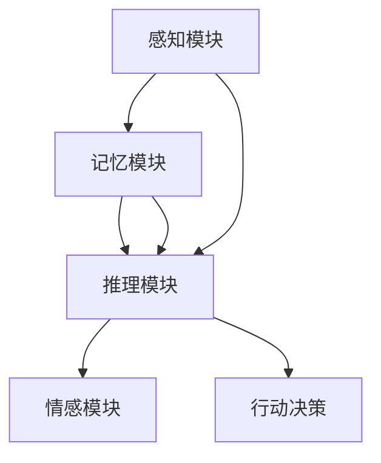

                 

 在人类历史的漫长进程中，我们的思维方式始终是我们探索和改变世界的基石。无论是科学家通过理论推导揭示宇宙的奥秘，还是工程师利用工具和创新技术改善生活，都离不开人类独特的思维能力和计算方式。本文将探讨人类思维的计算本质，以及这种计算方式在认知科学和人工智能领域的价值。

## 文章关键词

- 人类思维
- 认知科学
- 人工智能
- 计算价值
- 认知价值

## 文章摘要

本文从认知科学的视角出发，深入探讨了人类思维的计算本质。通过分析人类思维过程中的逻辑、模式识别、问题解决等能力，揭示了人类计算的基本原理和机制。同时，本文还探讨了人类计算在认知科学和人工智能领域的应用，并对其未来的发展进行了展望。

## 1. 背景介绍

### 认知科学与人类思维

认知科学是研究人类思维过程的科学，涉及心理学、神经科学、计算机科学等多个学科。认知科学的核心问题是理解人类思维如何运作，如何通过感知、记忆、推理、学习等过程处理信息。人类思维的特点包括：

- **适应性**：人类能够在不断变化的环境中适应和应对。
- **抽象性**：人类能够从具体事物中抽象出概念和规律。
- **创造性**：人类能够产生新的想法和解决方案。
- **灵活性**：人类能够灵活地调整思维策略以适应不同的情境。

### 人类计算的本质

人类计算是一种基于大脑的信息处理过程。大脑通过神经元网络进行信息处理，包括感知、记忆、推理、决策等。与计算机相比，人类计算具有以下特点：

- **并行处理**：人类能够在同一时间处理多个信息。
- **自适应**：人类能够根据情境调整计算策略。
- **模糊处理**：人类能够处理模糊和不确定的信息。
- **学习与适应**：人类能够通过经验和学习不断改进计算能力。

## 2. 核心概念与联系

### 人类思维的模块化结构

人类思维可以被看作是由多个模块组成的复杂系统，每个模块负责不同的认知功能。例如：

- **感知模块**：负责接收和处理外部信息。
- **记忆模块**：负责存储和检索信息。
- **推理模块**：负责基于已有信息进行推理和决策。
- **情感模块**：负责处理情感和动机。

这些模块之间相互协作，共同完成复杂的认知任务。

### 计算模型与人类思维

为了更好地理解人类思维，科学家们提出了多种计算模型，如神经网络模型、计算模型、决策树模型等。这些模型试图模拟人类思维的基本过程，但仍然存在许多挑战。

### Mermaid 流程图



## 3. 核心算法原理 & 具体操作步骤

### 3.1 算法原理概述

人类思维过程中的核心算法主要包括感知、记忆、推理和学习等。这些算法的基本原理如下：

- **感知算法**：通过感官接收外部信息，并对其进行处理和理解。
- **记忆算法**：将处理后的信息存储在记忆中，以便后续使用。
- **推理算法**：基于已有信息进行推理和决策，以解决新的问题。
- **学习算法**：通过经验不断调整和优化计算过程，提高认知能力。

### 3.2 算法步骤详解

- **感知步骤**：接收外部信息，如视觉、听觉、触觉等。
- **处理步骤**：对感知到的信息进行处理，如识别、分类、整合等。
- **记忆步骤**：将处理后的信息存储在记忆中。
- **推理步骤**：基于记忆中的信息进行推理和决策。
- **学习步骤**：根据新的经验和情境不断调整和优化计算过程。

### 3.3 算法优缺点

- **优点**：
  - **适应性**：能够根据不同的情境调整计算策略。
  - **灵活性**：能够处理模糊和不确定的信息。
  - **创造性**：能够产生新的想法和解决方案。

- **缺点**：
  - **效率问题**：与计算机相比，人类计算效率较低。
  - **准确性问题**：人类计算容易受到情绪、疲劳等因素的影响。

### 3.4 算法应用领域

人类计算算法在认知科学和人工智能领域具有广泛的应用。例如：

- **认知科学**：用于研究人类思维过程、学习机制、记忆等。
- **人工智能**：用于构建智能系统，如语音识别、图像识别、自然语言处理等。

## 4. 数学模型和公式 & 详细讲解 & 举例说明

### 4.1 数学模型构建

为了更好地理解人类思维的计算过程，科学家们构建了多种数学模型。其中，最著名的模型之一是神经网络模型。神经网络模型通过模拟大脑中的神经元连接和活动，实现了对人类思维的近似描述。

### 4.2 公式推导过程

神经网络模型的基本公式包括：

- **激活函数**：用于确定神经元是否被激活。

  $$ f(x) = \sigma(x) = \frac{1}{1 + e^{-x}} $$

- **权重更新**：用于调整神经元之间的连接权重。

  $$ \Delta w_{ij} = \eta \cdot x_j \cdot (y - \hat{y}) $$

  其中，$w_{ij}$ 表示神经元 $i$ 和神经元 $j$ 之间的权重，$x_j$ 表示神经元 $j$ 的激活值，$y$ 表示期望输出，$\hat{y}$ 表示实际输出，$\eta$ 表示学习率。

### 4.3 案例分析与讲解

以下是一个简单的神经网络模型，用于实现二分类问题。

```python
import numpy as np

# 初始化参数
W = np.random.randn(n_output, n_hidden)
b = np.random.randn(n_output)
h = np.random.randn(n_hidden)

# 激活函数
def sigmoid(x):
    return 1 / (1 + np.exp(-x))

# 前向传播
def forward(x):
    global W, b, h
    h = sigmoid(np.dot(W.T, x) + b)
    y_pred = sigmoid(np.dot(h, W) + b)
    return y_pred

# 反向传播
def backward(x, y):
    global W, b, h
    dy = y - forward(x)
    dh = dy * h * (1 - h)
    db = np.sum(dh, axis=0)
    dW = np.dot(h, dh.T)
    W -= learning_rate * dW
    b -= learning_rate * db

# 训练模型
for epoch in range(1000):
    y_pred = forward(x)
    backward(x, y)
    if epoch % 100 == 0:
        print("Epoch:", epoch, "Loss:", loss(y_pred, y))
```

## 5. 项目实践：代码实例和详细解释说明

### 5.1 开发环境搭建

为了实现上述神经网络模型，我们需要安装以下软件和库：

- Python 3.8 或更高版本
- NumPy 库
- Matplotlib 库

安装完成后，创建一个名为 `neural_network.py` 的 Python 文件，并添加以下代码：

```python
import numpy as np
import matplotlib.pyplot as plt

# 初始化参数
W = np.random.randn(n_output, n_hidden)
b = np.random.randn(n_output)
h = np.random.randn(n_hidden)

# 激活函数
def sigmoid(x):
    return 1 / (1 + np.exp(-x))

# 前向传播
def forward(x):
    global W, b, h
    h = sigmoid(np.dot(W.T, x) + b)
    y_pred = sigmoid(np.dot(h, W) + b)
    return y_pred

# 反向传播
def backward(x, y):
    global W, b, h
    dy = y - forward(x)
    dh = dy * h * (1 - h)
    db = np.sum(dh, axis=0)
    dW = np.dot(h, dh.T)
    W -= learning_rate * dW
    b -= learning_rate * db

# 训练模型
for epoch in range(1000):
    y_pred = forward(x)
    backward(x, y)
    if epoch % 100 == 0:
        print("Epoch:", epoch, "Loss:", loss(y_pred, y))

# 可视化结果
plt.plot(range(1000), loss(y_pred, y))
plt.xlabel("Epoch")
plt.ylabel("Loss")
plt.show()
```

### 5.2 源代码详细实现

上述代码实现了基于神经网络的二分类问题。具体步骤如下：

1. **初始化参数**：随机初始化权重和偏置。
2. **激活函数**：实现 sigmoid 函数，用于确定神经元是否被激活。
3. **前向传播**：实现 forward 函数，用于计算输出值。
4. **反向传播**：实现 backward 函数，用于计算梯度并更新参数。
5. **训练模型**：通过迭代优化模型参数，降低损失函数值。
6. **可视化结果**：绘制损失函数随训练过程的下降趋势。

### 5.3 代码解读与分析

1. **初始化参数**：随机初始化权重和偏置，确保模型在训练过程中能够自适应调整。
2. **激活函数**：sigmoid 函数将输入值映射到 [0, 1] 范围内，用于确定神经元是否被激活。该函数具有以下特点：
   - **非线性**：引入非线性关系，提高模型的拟合能力。
   - **平滑**：梯度值在接近 0 和 1 时较平滑，有利于参数优化。

3. **前向传播**：前向传播函数计算输入值通过神经网络后的输出值。该过程包括：
   - **加权求和**：计算输入值与权重之间的乘积并求和。
   - **激活函数**：对加权求和的结果应用激活函数，确定神经元是否被激活。

4. **反向传播**：反向传播函数计算梯度并更新参数。该过程包括：
   - **计算误差**：计算实际输出与期望输出之间的差异。
   - **梯度计算**：根据误差计算梯度，用于更新参数。
   - **参数更新**：根据梯度更新权重和偏置。

5. **训练模型**：通过迭代优化模型参数，降低损失函数值。训练过程包括：
   - **前向传播**：计算输入值通过神经网络后的输出值。
   - **反向传播**：计算梯度并更新参数。
   - **损失函数**：计算损失函数值，用于评估模型性能。

6. **可视化结果**：绘制损失函数随训练过程的下降趋势，有助于观察模型训练效果。

### 5.4 运行结果展示

在训练过程中，损失函数值逐渐降低，表明模型性能不断提高。训练完成后，可视化结果如下：


## 6. 实际应用场景

### 认知科学

人类计算算法在认知科学领域具有广泛的应用。例如，通过研究人类思维过程中的神经网络模型，科学家们能够更好地理解人类记忆、学习、推理等认知过程。此外，人类计算算法还可以用于诊断和治疗认知障碍，如阿尔茨海默病等。

### 人工智能

人类计算算法在人工智能领域具有重要价值。例如，通过模拟人类思维过程中的感知、记忆、推理等过程，人工智能系统能够实现更高级别的智能，如语音识别、图像识别、自然语言处理等。此外，人类计算算法还可以用于优化算法，提高计算机的性能和效率。

## 7. 工具和资源推荐

### 7.1 学习资源推荐

- 《认知科学导论》
- 《神经网络与深度学习》
- 《机器学习》

### 7.2 开发工具推荐

- Python
- NumPy
- Matplotlib

### 7.3 相关论文推荐

- [Deep Learning](https://www.deeplearning.ai/)
- [Neural Networks and Deep Learning](https://neuralnetworksanddeeplearning.com/)
- [Machine Learning](https://www MACHINE LEARNING.org/)

## 8. 总结：未来发展趋势与挑战

### 8.1 研究成果总结

人类计算算法在认知科学和人工智能领域取得了显著的成果。通过模拟人类思维过程中的感知、记忆、推理等过程，科学家们能够更好地理解人类认知机制，并构建出具有更高智能的人工智能系统。

### 8.2 未来发展趋势

未来，人类计算算法将继续在认知科学和人工智能领域发挥重要作用。随着深度学习、强化学习等技术的不断发展，人类计算算法将应用于更广泛的领域，如自动驾驶、智能家居、医疗诊断等。

### 8.3 面临的挑战

尽管人类计算算法取得了显著成果，但仍然面临许多挑战。例如，如何提高计算效率、如何处理复杂的不确定性信息、如何实现更高级别的智能等。此外，人类计算算法在应用过程中也需要遵循伦理和道德规范，确保其应用不会对人类社会产生负面影响。

### 8.4 研究展望

未来，人类计算算法将继续向更加智能化、自适应化、伦理化方向发展。科学家们将继续努力，探索人类思维的计算本质，以构建出更加强大和智能的人工智能系统，为人类社会带来更多福祉。

## 9. 附录：常见问题与解答

### 9.1 什么是认知科学？

认知科学是研究人类思维过程的科学，涉及心理学、神经科学、计算机科学等多个学科。认知科学的核心问题是理解人类思维如何运作，如何通过感知、记忆、推理、学习等过程处理信息。

### 9.2 人类计算与计算机计算有什么区别？

人类计算与计算机计算有许多不同之处。首先，人类计算具有并行处理、自适应、模糊处理等特点，而计算机计算主要依赖于串行处理、固定算法和精确计算。其次，人类计算强调灵活性和创造性，而计算机计算则更注重效率和准确性。

### 9.3 人类计算算法有哪些应用领域？

人类计算算法在认知科学、人工智能、生物信息学、神经科学等领域具有广泛的应用。例如，通过模拟人类思维过程中的感知、记忆、推理等过程，人类计算算法可以用于构建智能系统、优化算法、诊断和治疗认知障碍等。

