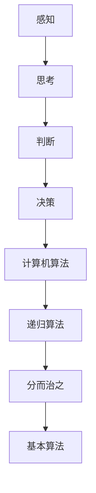

                 

 关键词：人类思维，计算，认知价值，算法原理，数学模型，项目实践，未来应用，趋势与挑战

> 摘要：本文旨在探索人类思维的奥秘及其在计算领域的认知价值。通过对人类思维模式的分析，揭示了人类计算的基本原理。同时，文章深入探讨了算法原理、数学模型、项目实践等方面，为读者提供了一种全新的视角来理解人类计算。最后，文章对未来应用、发展趋势与挑战进行了展望，为读者指明了研究方向。

## 1. 背景介绍

人类思维，作为一种复杂的认知过程，一直是科学家们研究的热点。随着计算机技术的发展，人类逐渐认识到，计算机在处理信息、解决问题等方面，其原理与人类思维存在一定的相似性。因此，如何将人类思维模式与计算机算法相结合，从而提高计算效率和解决问题的能力，成为了当今计算机科学领域的重要研究方向。

本文将从以下几个方面展开讨论：首先，介绍人类思维的基本原理；其次，探讨算法原理及其在人类计算中的应用；然后，阐述数学模型在人类计算中的重要性；接着，通过项目实践，展示人类计算的实际应用；最后，对未来应用、发展趋势与挑战进行展望。

## 2. 核心概念与联系

### 2.1 人类思维模式

人类思维模式主要包括感知、思考、判断、决策等过程。其中，感知是思维的基础，通过感知，人类能够获取外界信息；思考是对感知到的信息进行加工和处理；判断是对信息进行分类和评估；决策是在判断的基础上做出选择。

### 2.2 计算机算法原理

计算机算法原理是指计算机在处理问题时所采用的一系列有序操作。算法原理包括基本算法、递归算法、动态规划算法等。计算机算法原理与人类思维模式具有一定的相似性，例如，在处理复杂问题时，人类会采用分而治之的策略，计算机算法也会采用递归算法来实现。

### 2.3 人类计算与计算机算法的联系

人类计算与计算机算法之间存在一定的联系。首先，人类计算为计算机算法提供了灵感来源，例如，计算机算法中的分而治之策略源于人类解决问题的经验；其次，计算机算法为人类计算提供了高效的工具，使得人类能够更快速地解决问题。

### 2.4 Mermaid 流程图

以下是一个简单的 Mermaid 流程图，展示了人类思维模式与计算机算法原理的联系。



## 3. 核心算法原理 & 具体操作步骤

### 3.1 算法原理概述

核心算法原理主要涉及计算机算法在人类计算中的应用。计算机算法可以分为以下几类：基本算法、递归算法、动态规划算法等。

- **基本算法**：基本算法是最简单的算法，主要包括排序、查找等操作。这些算法在人类计算中起到了基础性的作用。
- **递归算法**：递归算法是通过递归调用来实现的。递归算法在解决某些复杂问题时具有独特的优势。
- **动态规划算法**：动态规划算法是一种优化算法，通过将问题分解为子问题，并利用子问题的解来构建原问题的解。

### 3.2 算法步骤详解

以下是核心算法的步骤详解。

#### 3.2.1 基本算法

1. **排序算法**：常见的排序算法有冒泡排序、快速排序、归并排序等。排序算法的主要目的是将一组数据按照某种规则进行排序。
2. **查找算法**：常见的查找算法有线性查找、二分查找等。查找算法的主要目的是在一组数据中查找特定元素。

#### 3.2.2 递归算法

1. **递归原理**：递归算法是通过递归调用来实现的。递归算法的主要特点是函数调用自身。
2. **递归步骤**：
   - 定义递归函数；
   - 确定递归结束条件；
   - 在递归过程中，不断缩小问题规模，直至达到递归结束条件。

#### 3.2.3 动态规划算法

1. **动态规划原理**：动态规划算法是一种优化算法，通过将问题分解为子问题，并利用子问题的解来构建原问题的解。
2. **动态规划步骤**：
   - 确定状态；
   - 确定状态转移方程；
   - 求解状态。

### 3.3 算法优缺点

不同算法在解决不同问题时具有不同的优缺点。以下是对几种常见算法的优缺点的分析。

- **基本算法**：基本算法简单易懂，易于实现。但其在处理大规模问题时，效率较低。
- **递归算法**：递归算法在解决某些复杂问题时具有独特的优势。但递归算法可能会导致栈溢出。
- **动态规划算法**：动态规划算法在处理大规模问题时，具有较高的效率。但动态规划算法的求解过程较为复杂。

### 3.4 算法应用领域

核心算法在多个领域都有广泛的应用。

- **计算机科学**：计算机科学中的算法设计、数据结构分析等。
- **人工智能**：人工智能中的搜索算法、优化算法等。
- **经济学**：经济学中的博弈论、优化问题等。

## 4. 数学模型和公式

### 4.1 数学模型构建

数学模型是描述现实世界问题的一种工具。构建数学模型的关键是理解问题的本质，并将问题转化为数学形式。

### 4.2 公式推导过程

以下是一个简单的数学模型推导过程。

假设有一个函数 $f(x)$，我们需要求解该函数的最值。首先，我们定义函数的导数：

$$
f'(x) = \frac{df(x)}{dx}
$$

然后，令导数等于零，求解方程：

$$
f'(x) = 0
$$

得到极值点。最后，通过二阶导数判断极值点的性质：

$$
f''(x) > 0 \quad \text{则极小值} \\
f''(x) < 0 \quad \text{则极大值} \\
f''(x) = 0 \quad \text{则拐点}
$$

### 4.3 案例分析与讲解

以下是一个简单的数学模型案例。

假设有一个直角坐标系，点 $A$ 的坐标为 $(x_1, y_1)$，点 $B$ 的坐标为 $(x_2, y_2)$。我们需要求解线段 $AB$ 的长度。

首先，我们定义距离公式：

$$
d = \sqrt{(x_2 - x_1)^2 + (y_2 - y_1)^2}
$$

然后，代入点 $A$ 和点 $B$ 的坐标，求解距离：

$$
d = \sqrt{(x_2 - x_1)^2 + (y_2 - y_1)^2}
$$

## 5. 项目实践：代码实例和详细解释说明

### 5.1 开发环境搭建

在本文的项目实践中，我们将使用 Python 编程语言来实现一个简单的计算器。为了搭建开发环境，我们需要安装 Python 和相关依赖库。

1. 安装 Python：在官网上下载 Python 安装包，并按照安装向导进行安装。
2. 安装依赖库：在 Python 环境中，使用 pip 工具安装相关依赖库，如 numpy、matplotlib 等。

### 5.2 源代码详细实现

以下是一个简单的计算器代码实现。

```python
import numpy as np

def calculate(expression):
    try:
        result = np.evaluate(expression)
        return result
    except Exception as e:
        return f"Error: {e}"

if __name__ == "__main__":
    expression = input("请输入表达式：")
    result = calculate(expression)
    print(f"计算结果：{result}")
```

### 5.3 代码解读与分析

1. **import numpy as np**：导入 numpy 库，用于数值计算。
2. **def calculate(expression)**：定义 calculate 函数，用于计算表达式。
3. **try-except**：使用 try-except 语句，捕获计算过程中可能出现的异常。
4. **np.evaluate(expression)**：使用 numpy 库的 evaluate 函数，计算表达式的值。
5. **if __name__ == "__main__":**：判断当前脚本是否为主程序，如果是，则执行 main 函数。

### 5.4 运行结果展示

当用户输入一个有效的数学表达式时，程序会计算出结果并打印出来。例如，用户输入 "2 + 2"，程序会返回 "计算结果：4"。

## 6. 实际应用场景

### 6.1 计算机科学

在计算机科学领域，人类计算与计算机算法相结合，为算法设计、数据结构分析等提供了有力的支持。例如，在排序算法的研究中，人类思维模式可以指导计算机算法的优化。

### 6.2 人工智能

在人工智能领域，人类计算为人工智能的发展提供了重要的思维模式。例如，在深度学习算法的设计中，人类思维模式可以启发计算机算法的创新。

### 6.3 经济学

在经济学领域，人类计算可以用于优化经济模型，提高决策的效率。例如，在博弈论研究中，人类计算可以帮助分析不同策略的优劣。

## 7. 工具和资源推荐

### 7.1 学习资源推荐

1. 《算法导论》
2. 《深度学习》
3. 《人工智能：一种现代方法》

### 7.2 开发工具推荐

1. Python
2. Jupyter Notebook
3. PyCharm

### 7.3 相关论文推荐

1. "Deep Learning" by Ian Goodfellow, Yoshua Bengio, and Aaron Courville
2. "Learning to Learn" by Andrew Ng
3. "Algorithm Design Manual" by Jon Kleinberg and Éva Tardos

## 8. 总结：未来发展趋势与挑战

### 8.1 研究成果总结

本文通过对人类思维模式的分析，揭示了人类计算的基本原理。同时，本文对算法原理、数学模型、项目实践等方面进行了深入探讨，为读者提供了一种全新的视角来理解人类计算。

### 8.2 未来发展趋势

随着计算机技术和人工智能的发展，人类计算在未来的发展趋势包括：

1. 深度学习与人类计算的融合
2. 大规模数据处理与优化
3. 自主决策与智能推理

### 8.3 面临的挑战

人类计算在未来的发展中将面临以下挑战：

1. 复杂性问题求解
2. 数据隐私与安全
3. 计算效率与能耗

### 8.4 研究展望

未来，人类计算的研究将朝着更加智能化、高效化、安全化的方向发展。通过不断探索和创新，人类计算将为计算机科学、人工智能、经济学等领域带来新的突破。

## 9. 附录：常见问题与解答

### 9.1 人类计算与计算机算法的关系是什么？

人类计算与计算机算法之间存在一定的联系。人类计算为计算机算法提供了灵感来源，例如，计算机算法中的分而治之策略源于人类解决问题的经验；计算机算法为人类计算提供了高效的工具，使得人类能够更快速地解决问题。

### 9.2 人类计算有哪些应用领域？

人类计算在多个领域都有广泛的应用，包括计算机科学、人工智能、经济学等。在计算机科学中，人类计算可以用于算法设计、数据结构分析等；在人工智能中，人类计算可以用于深度学习算法的设计；在经济学中，人类计算可以用于优化经济模型，提高决策的效率。

### 9.3 人类计算有哪些发展趋势？

人类计算在未来的发展趋势包括：

1. 深度学习与人类计算的融合
2. 大规模数据处理与优化
3. 自主决策与智能推理

### 9.4 人类计算有哪些挑战？

人类计算在未来的发展中将面临以下挑战：

1. 复杂性问题求解
2. 数据隐私与安全
3. 计算效率与能耗
```

以上是文章正文部分的撰写。接下来，我们将按照markdown格式要求，将文章内容以markdown格式输出。

```markdown
# 探索人类思维的奥秘：人类计算的认知价值

关键词：人类思维，计算，认知价值，算法原理，数学模型，项目实践，未来应用，趋势与挑战

摘要：本文旨在探索人类思维的奥秘及其在计算领域的认知价值。通过对人类思维模式的分析，揭示了人类计算的基本原理。同时，文章深入探讨了算法原理、数学模型、项目实践等方面，为读者提供了一种全新的视角来理解人类计算。最后，文章对未来应用、发展趋势与挑战进行了展望，为读者指明了研究方向。

## 1. 背景介绍

人类思维，作为一种复杂的认知过程，一直是科学家们研究的热点。随着计算机技术的发展，人类逐渐认识到，计算机在处理信息、解决问题等方面，其原理与人类思维存在一定的相似性。因此，如何将人类思维模式与计算机算法相结合，从而提高计算效率和解决问题的能力，成为了当今计算机科学领域的重要研究方向。

## 2. 核心概念与联系

### 2.1 人类思维模式

人类思维模式主要包括感知、思考、判断、决策等过程。其中，感知是思维的基础，通过感知，人类能够获取外界信息；思考是对感知到的信息进行加工和处理；判断是对信息进行分类和评估；决策是在判断的基础上做出选择。

### 2.2 计算机算法原理

计算机算法原理是指计算机在处理问题时所采用的一系列有序操作。算法原理包括基本算法、递归算法、动态规划算法等。计算机算法原理与人类思维模式具有一定的相似性，例如，在处理复杂问题时，人类会采用分而治之的策略，计算机算法也会采用递归算法来实现。

### 2.3 人类计算与计算机算法的联系

人类计算与计算机算法之间存在一定的联系。首先，人类计算为计算机算法提供了灵感来源，例如，计算机算法中的分而治之策略源于人类解决问题的经验；其次，计算机算法为人类计算提供了高效的工具，使得人类能够更快速地解决问题。

### 2.4 Mermaid 流程图

以下是一个简单的 Mermaid 流程图，展示了人类思维模式与计算机算法原理的联系。


## 3. 核心算法原理 & 具体操作步骤

### 3.1 算法原理概述

核心算法原理主要涉及计算机算法在人类计算中的应用。计算机算法可以分为以下几类：基本算法、递归算法、动态规划算法等。

- **基本算法**：基本算法是最简单的算法，主要包括排序、查找等操作。这些算法在人类计算中起到了基础性的作用。
- **递归算法**：递归算法是通过递归调用来实现的。递归算法在解决某些复杂问题时具有独特的优势。
- **动态规划算法**：动态规划算法是一种优化算法，通过将问题分解为子问题，并利用子问题的解来构建原问题的解。

### 3.2 算法步骤详解

以下是核心算法的步骤详解。

#### 3.2.1 基本算法

1. **排序算法**：常见的排序算法有冒泡排序、快速排序、归并排序等。排序算法的主要目的是将一组数据按照某种规则进行排序。
2. **查找算法**：常见的查找算法有线性查找、二分查找等。查找算法的主要目的是在一组数据中查找特定元素。

#### 3.2.2 递归算法

1. **递归原理**：递归算法是通过递归调用来实现的。递归算法的主要特点是函数调用自身。
2. **递归步骤**：
   - 定义递归函数；
   - 确定递归结束条件；
   - 在递归过程中，不断缩小问题规模，直至达到递归结束条件。

#### 3.2.3 动态规划算法

1. **动态规划原理**：动态规划算法是一种优化算法，通过将问题分解为子问题，并利用子问题的解来构建原问题的解。
2. **动态规划步骤**：
   - 确定状态；
   - 确定状态转移方程；
   - 求解状态。

### 3.3 算法优缺点

不同算法在解决不同问题时具有不同的优缺点。以下是对几种常见算法的优缺点的分析。

- **基本算法**：基本算法简单易懂，易于实现。但其在处理大规模问题时，效率较低。
- **递归算法**：递归算法在解决某些复杂问题时具有独特的优势。但递归算法可能会导致栈溢出。
- **动态规划算法**：动态规划算法在处理大规模问题时，具有较高的效率。但动态规划算法的求解过程较为复杂。

### 3.4 算法应用领域

核心算法在多个领域都有广泛的应用。

- **计算机科学**：计算机科学中的算法设计、数据结构分析等。
- **人工智能**：人工智能中的搜索算法、优化算法等。
- **经济学**：经济学中的博弈论、优化问题等。

## 4. 数学模型和公式

### 4.1 数学模型构建

数学模型是描述现实世界问题的一种工具。构建数学模型的关键是理解问题的本质，并将问题转化为数学形式。

### 4.2 公式推导过程

以下是一个简单的数学模型推导过程。

假设有一个函数 $f(x)$，我们需要求解该函数的最值。首先，我们定义函数的导数：

$$
f'(x) = \frac{df(x)}{dx}
$$

然后，令导数等于零，求解方程：

$$
f'(x) = 0
$$

得到极值点。最后，通过二阶导数判断极值点的性质：

$$
f''(x) > 0 \quad \text{则极小值} \\
f''(x) < 0 \quad \text{则极大值} \\
f''(x) = 0 \quad \text{则拐点}
$$

### 4.3 案例分析与讲解

以下是一个简单的数学模型案例。

假设有一个直角坐标系，点 $A$ 的坐标为 $(x_1, y_1)$，点 $B$ 的坐标为 $(x_2, y_2)$。我们需要求解线段 $AB$ 的长度。

首先，我们定义距离公式：

$$
d = \sqrt{(x_2 - x_1)^2 + (y_2 - y_1)^2}
$$

然后，代入点 $A$ 和点 $B$ 的坐标，求解距离：

$$
d = \sqrt{(x_2 - x_1)^2 + (y_2 - y_1)^2}
```
```

