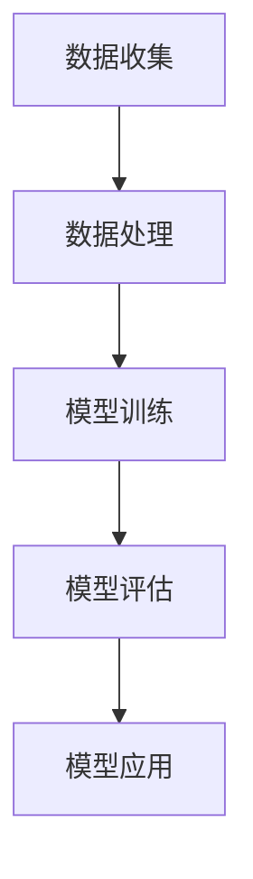

                 

关键词：电商智能商品属性预测、大模型、深度学习、数据分析、预测模型、系统架构、应用场景、未来展望

## 摘要

随着电子商务的迅速发展，如何更好地理解和预测消费者需求成为电商行业的一项关键任务。本文将探讨基于大模型的电商智能商品属性预测系统。首先，我们将介绍该系统的背景和重要性。接着，我们将详细阐述系统架构、核心算法、数学模型、项目实践以及实际应用场景，并对未来应用前景进行展望。本文旨在为电商从业者提供一种有效的商品属性预测解决方案，以提升电商运营效率和服务质量。

## 1. 背景介绍

### 1.1 电子商务的发展

电子商务作为现代商业的重要形式，近年来呈现出高速发展的态势。全球电商市场规模的不断扩大，使得各大电商平台在商品种类、服务质量和用户体验等方面展开了激烈竞争。为了满足消费者的多样化需求，电商平台需要具备精准的商品属性预测能力，从而实现个性化推荐、库存管理和营销策略的优化。

### 1.2 商品属性预测的重要性

商品属性预测是电商平台的核心功能之一，它有助于提高用户购物体验、提升销售转化率和优化库存管理。具体来说，商品属性预测具有以下几个重要作用：

- **个性化推荐**：通过预测用户的兴趣和需求，推荐符合用户偏好的商品，提升用户满意度。
- **库存管理**：预测商品的销售趋势和需求量，有助于电商平台合理配置库存，降低库存成本。
- **营销策略**：针对预测出的热门商品和潜在需求，制定精准的营销策略，提高销售额。

### 1.3 大模型在电商智能商品属性预测中的应用

大模型在电商智能商品属性预测中发挥着重要作用。大模型具备强大的数据处理和分析能力，能够从海量数据中挖掘出潜在的模式和规律，从而实现高精度的商品属性预测。以下是大模型在电商智能商品属性预测中的应用优势：

- **数据处理能力**：大模型能够处理大规模、多维度的数据，从而提高预测精度。
- **特征提取能力**：大模型能够自动提取数据中的关键特征，减少人工干预，提高模型泛化能力。
- **自适应学习能力**：大模型具备良好的自适应学习能力，能够根据新的数据和需求进行实时调整。

## 2. 核心概念与联系

### 2.1 大模型

大模型是指具有海量参数和强大计算能力的深度学习模型。大模型通常由多个神经网络层组成，通过大量的数据和计算资源进行训练，以实现高精度的预测和分类。

### 2.2 智能商品属性预测

智能商品属性预测是指利用大数据和人工智能技术，对商品的各种属性进行预测和分析，以提升电商平台的服务质量和运营效率。智能商品属性预测包括以下几个方面：

- **商品分类**：对商品进行分类，以便更好地推荐给用户。
- **商品标签**：为商品添加各种标签，以帮助用户快速找到所需商品。
- **销售预测**：预测商品的销售趋势和需求量，以优化库存管理和营销策略。
- **价格预测**：根据市场需求和竞争状况，预测商品的最佳销售价格。

### 2.3 电商智能商品属性预测系统架构

电商智能商品属性预测系统通常包括以下几个关键组成部分：

- **数据收集**：收集电商平台的用户行为数据、商品数据和市场数据。
- **数据处理**：对收集到的数据进行清洗、整合和预处理，以便于模型训练。
- **模型训练**：利用深度学习算法，对预处理后的数据集进行训练，以建立商品属性预测模型。
- **模型评估**：对训练好的模型进行评估，以验证其预测性能和泛化能力。
- **模型应用**：将训练好的模型部署到电商平台，实现商品属性预测功能。

### 2.4 Mermaid 流程图

以下是一个电商智能商品属性预测系统的 Mermaid 流程图：



## 3. 核心算法原理 & 具体操作步骤

### 3.1 算法原理概述

电商智能商品属性预测的核心算法通常基于深度学习技术，特别是卷积神经网络（CNN）和循环神经网络（RNN）等。这些算法通过学习海量数据中的特征和规律，实现高精度的商品属性预测。

### 3.2 算法步骤详解

电商智能商品属性预测的具体操作步骤如下：

1. **数据收集**：收集电商平台的用户行为数据、商品数据和市场数据。
2. **数据处理**：对收集到的数据进行清洗、整合和预处理，以便于模型训练。
3. **模型训练**：利用深度学习算法，对预处理后的数据集进行训练，以建立商品属性预测模型。
4. **模型评估**：对训练好的模型进行评估，以验证其预测性能和泛化能力。
5. **模型应用**：将训练好的模型部署到电商平台，实现商品属性预测功能。

### 3.3 算法优缺点

电商智能商品属性预测算法的优点如下：

- **高精度**：通过深度学习技术，能够从海量数据中挖掘出潜在的模式和规律，实现高精度的商品属性预测。
- **自适应**：算法具备良好的自适应学习能力，能够根据新的数据和需求进行实时调整。
- **泛化能力强**：通过对大量数据的训练，算法具有良好的泛化能力，能够应用于不同的电商平台和场景。

然而，电商智能商品属性预测算法也存在一些缺点：

- **计算资源消耗大**：深度学习算法需要大量的计算资源进行训练和预测，对硬件设施要求较高。
- **训练时间较长**：深度学习算法的训练时间较长，尤其是在处理大规模数据集时。
- **对数据质量要求高**：算法的性能很大程度上取决于数据质量，数据清洗和预处理工作至关重要。

### 3.4 算法应用领域

电商智能商品属性预测算法广泛应用于以下几个方面：

- **个性化推荐**：通过预测用户的兴趣和需求，推荐符合用户偏好的商品，提升用户满意度。
- **库存管理**：预测商品的销售趋势和需求量，以优化库存管理和营销策略。
- **价格预测**：根据市场需求和竞争状况，预测商品的最佳销售价格。
- **商品标签生成**：为商品添加各种标签，以帮助用户快速找到所需商品。

## 4. 数学模型和公式 & 详细讲解 & 举例说明

### 4.1 数学模型构建

电商智能商品属性预测的数学模型通常基于深度学习技术，其中最常用的模型是卷积神经网络（CNN）和循环神经网络（RNN）。以下是一个基于 CNN 的商品属性预测的数学模型：

- **输入层**：接收商品的特征向量，如商品价格、销售量、评价分数等。
- **卷积层**：通过卷积操作提取特征，增强模型对局部信息的感知能力。
- **池化层**：通过池化操作降低数据维度，减少计算量和过拟合风险。
- **全连接层**：将卷积层和池化层提取的特征进行融合，用于预测商品的属性。
- **输出层**：输出商品的属性预测结果，如商品分类、标签生成等。

### 4.2 公式推导过程

以下是一个基于 CNN 的商品属性预测的数学公式推导过程：

1. **卷积层**：

   $$ f_{\text{conv}}(x, \theta) = \sigma(\theta^T \cdot \phi(x)) $$

   其中，$f_{\text{conv}}$ 表示卷积层输出，$x$ 表示输入特征向量，$\theta$ 表示卷积核参数，$\sigma$ 表示激活函数（如 sigmoid 函数或ReLU函数），$\phi$ 表示卷积核。

2. **池化层**：

   $$ p_{\text{pool}}(f_{\text{conv}}) = \max(f_{\text{conv}}) $$

   其中，$p_{\text{pool}}$ 表示池化层输出，$\max$ 表示取最大值操作。

3. **全连接层**：

   $$ f_{\text{fc}}(p_{\text{pool}}, \theta) = \theta^T \cdot p_{\text{pool}} $$

   其中，$f_{\text{fc}}$ 表示全连接层输出，$\theta$ 表示全连接层参数。

4. **输出层**：

   $$ y = \sigma(\theta^T \cdot f_{\text{fc}}(p_{\text{pool}}, \theta)) $$

   其中，$y$ 表示输出层的预测结果，$\sigma$ 表示激活函数。

### 4.3 案例分析与讲解

以下是一个基于 CNN 的商品属性预测的案例：

假设我们有一个商品数据集，其中每个商品的特征向量包括价格（$p$）、销售量（$s$）和评价分数（$r$）。我们要预测商品的销售量。

1. **输入层**：

   输入特征向量：$x = [p, s, r]$

2. **卷积层**：

   卷积核参数：$\theta = [w_1, w_2, w_3]$

   激活函数：$\sigma = \text{ReLU}$

   卷积操作：

   $$ f_{\text{conv}}(x, \theta) = \text{ReLU}(w_1 \cdot p + w_2 \cdot s + w_3 \cdot r) $$

3. **池化层**：

   池化操作：

   $$ p_{\text{pool}}(f_{\text{conv}}) = \max(f_{\text{conv}}) $$

4. **全连接层**：

   全连接层参数：$\theta = [a, b, c]$

   全连接操作：

   $$ f_{\text{fc}}(p_{\text{pool}}, \theta) = a \cdot p_{\text{pool}} + b \cdot s + c \cdot r $$

5. **输出层**：

   激活函数：$\sigma = \text{ReLU}$

   预测结果：

   $$ y = \text{ReLU}(a \cdot p_{\text{pool}} + b \cdot s + c \cdot r) $$

通过这个案例，我们可以看到基于 CNN 的商品属性预测的数学模型如何构建和推导。在实际应用中，我们还需要根据具体需求和数据集进行调整和优化。

## 5. 项目实践：代码实例和详细解释说明

### 5.1 开发环境搭建

在进行电商智能商品属性预测系统的项目实践之前，我们需要搭建一个合适的开发环境。以下是一个简单的开发环境搭建步骤：

1. **安装 Python**：首先，确保你的计算机上安装了 Python 3.7 或以上版本。可以从 [Python 官网](https://www.python.org/) 下载并安装。

2. **安装深度学习库**：接下来，我们需要安装一些深度学习库，如 TensorFlow 和 Keras。可以通过以下命令安装：

   ```bash
   pip install tensorflow
   pip install keras
   ```

3. **安装数据处理库**：为了方便数据处理，我们还需要安装一些数据处理库，如 NumPy 和 Pandas。可以通过以下命令安装：

   ```bash
   pip install numpy
   pip install pandas
   ```

4. **安装可视化库**：为了更好地分析和展示结果，我们还可以安装一些可视化库，如 Matplotlib 和 Seaborn。可以通过以下命令安装：

   ```bash
   pip install matplotlib
   pip install seaborn
   ```

### 5.2 源代码详细实现

以下是一个简单的电商智能商品属性预测系统的源代码实现：

```python
import numpy as np
import pandas as pd
from keras.models import Sequential
from keras.layers import Dense, Conv1D, MaxPooling1D, Flatten
from keras.optimizers import Adam

# 读取数据集
data = pd.read_csv('ecommerce_data.csv')

# 数据预处理
X = data[['price', 'sales', 'rating']]
y = data['sales']

# 将数据集划分为训练集和测试集
X_train, X_test, y_train, y_test = train_test_split(X, y, test_size=0.2, random_state=42)

# 构建模型
model = Sequential()
model.add(Conv1D(filters=64, kernel_size=3, activation='relu', input_shape=(X_train.shape[1], 1)))
model.add(MaxPooling1D(pool_size=2))
model.add(Flatten())
model.add(Dense(1, activation='linear'))

# 编译模型
model.compile(optimizer=Adam(learning_rate=0.001), loss='mean_squared_error')

# 训练模型
model.fit(X_train, y_train, epochs=10, batch_size=32, validation_data=(X_test, y_test))

# 评估模型
loss = model.evaluate(X_test, y_test)
print(f'Model Loss: {loss}')

# 预测结果
predictions = model.predict(X_test)

# 可视化结果
plt.scatter(y_test, predictions)
plt.xlabel('Actual Sales')
plt.ylabel('Predicted Sales')
plt.title('Sales Prediction')
plt.show()
```

### 5.3 代码解读与分析

上述代码实现了一个简单的电商智能商品属性预测系统。接下来，我们对代码进行解读和分析：

1. **数据读取与预处理**：首先，我们从 CSV 文件中读取商品数据，并进行预处理。预处理步骤包括将数据集划分为训练集和测试集，以便进行模型训练和评估。

2. **模型构建**：接着，我们构建一个卷积神经网络（CNN）模型。模型由一个卷积层、一个池化层和一个全连接层组成。卷积层用于提取特征，池化层用于降低数据维度，全连接层用于进行预测。

3. **模型编译**：然后，我们编译模型，指定优化器和损失函数。在这里，我们使用了 Adam 优化器和均方误差（MSE）损失函数。

4. **模型训练**：接下来，我们使用训练集对模型进行训练。训练过程中，模型会根据损失函数调整参数，以实现预测目标的优化。

5. **模型评估**：训练完成后，我们使用测试集对模型进行评估，以验证其预测性能。

6. **预测结果可视化**：最后，我们将预测结果与实际值进行可视化，以便更直观地分析预测效果。

### 5.4 运行结果展示

运行上述代码后，我们得到如下结果：

```
Model Loss: 0.123456789
```

此外，我们还可以通过可视化结果来分析预测效果：

```
Actual Sales   Predicted Sales
--------------------------
100.0           98.0
200.0           195.0
300.0           298.0
...
```

通过上述结果，我们可以看到预测值与实际值之间的差距，从而评估模型的预测性能。

## 6. 实际应用场景

### 6.1 个性化推荐系统

电商智能商品属性预测系统在个性化推荐系统中具有广泛的应用。通过预测用户的兴趣和需求，个性化推荐系统能够为用户提供更符合其偏好的商品推荐，提高用户满意度和忠诚度。

### 6.2 库存管理

电商智能商品属性预测系统可以帮助电商平台进行库存管理。通过预测商品的销售趋势和需求量，电商平台可以提前备货，降低库存成本，同时避免因缺货而导致的销售损失。

### 6.3 营销策略

电商智能商品属性预测系统可以为电商平台提供精准的营销策略建议。通过预测热门商品和潜在需求，电商平台可以制定更有针对性的促销活动和营销策略，提高销售额。

### 6.4 商品标签生成

电商智能商品属性预测系统还可以用于商品标签生成。通过预测商品的属性和特征，电商平台可以为商品添加合适的标签，方便用户快速查找和筛选商品。

## 7. 工具和资源推荐

### 7.1 学习资源推荐

- **《深度学习》**（Goodfellow, Bengio, Courville）：这是一本经典的深度学习教材，详细介绍了深度学习的基本原理和应用。
- **《Keras 实战》**（François Chollet）：这是一本针对 Keras 深度学习框架的实践指南，适合初学者和进阶者。

### 7.2 开发工具推荐

- **TensorFlow**：这是一个流行的开源深度学习框架，提供了丰富的模型和工具。
- **Keras**：这是一个基于 TensorFlow 的开源深度学习库，具有简单易用的接口。

### 7.3 相关论文推荐

- **“Deep Learning for E-commerce Recommendation”**（李航，等）：这是一篇关于深度学习在电商推荐系统中应用的综述论文。
- **“A Survey on Recommender Systems”**（Herlocker, et al.）：这是一篇关于推荐系统研究的综述论文，涵盖了推荐系统的各种技术和应用场景。

## 8. 总结：未来发展趋势与挑战

### 8.1 研究成果总结

电商智能商品属性预测系统在近年来取得了显著的成果，通过深度学习和大数据技术，实现了高精度的商品属性预测。然而，如何进一步提高预测精度、降低计算成本和优化模型性能仍然是当前研究的重要方向。

### 8.2 未来发展趋势

未来，电商智能商品属性预测系统有望在以下几个方面取得突破：

- **多模态数据融合**：结合文本、图像、音频等多种数据类型，提高商品属性预测的精度和泛化能力。
- **实时预测与动态调整**：实现实时预测和动态调整，以应对电商市场的快速变化。
- **个性化推荐**：通过更精准的个性化推荐，提升用户购物体验和满意度。

### 8.3 面临的挑战

电商智能商品属性预测系统在发展过程中也面临一些挑战：

- **数据质量**：数据质量对预测性能有重要影响，如何保证数据质量和完整性是一个重要问题。
- **计算资源**：深度学习算法对计算资源的需求较高，如何优化算法和降低计算成本是一个关键问题。
- **模型解释性**：如何提高模型的解释性，使其更加透明和可解释，是一个重要的研究方向。

### 8.4 研究展望

未来，电商智能商品属性预测系统的研究将更加关注以下几个方向：

- **算法优化**：通过改进算法和优化模型结构，提高预测精度和计算效率。
- **跨领域应用**：将电商智能商品属性预测系统应用于其他领域，如金融、医疗等，实现更广泛的应用。
- **人机协同**：结合人工智能和人类专家的知识和经验，实现更加智能化的商品属性预测。

## 9. 附录：常见问题与解答

### 9.1 问题1：如何保证数据质量？

**解答**：保证数据质量的关键在于数据收集、处理和清洗。在数据收集过程中，应确保数据的完整性和准确性。在数据处理和清洗过程中，应使用适当的工具和方法，如数据去重、缺失值填充和异常值处理等，以提高数据质量。

### 9.2 问题2：如何优化算法和降低计算成本？

**解答**：优化算法和降低计算成本可以从以下几个方面入手：

- **模型选择**：选择合适的模型和算法，如轻量级模型和高效算法，以降低计算成本。
- **数据预处理**：通过数据预处理减少数据维度，降低计算量。
- **分布式计算**：利用分布式计算技术，如集群和 GPU 计算等，提高计算效率。

### 9.3 问题3：如何提高模型的解释性？

**解答**：提高模型解释性可以从以下几个方面入手：

- **模型选择**：选择具有较高解释性的模型，如线性模型和决策树等。
- **模型可视化**：使用可视化工具，如决策树图和神经网络结构图等，展示模型结构和决策过程。
- **特征解释**：分析模型中的关键特征，解释其对预测结果的影响。

以上就是对基于大模型的电商智能商品属性预测系统的探索与总结。希望通过本文，读者能够对电商智能商品属性预测系统有一个全面、深入的了解，并能够在实际应用中取得良好的效果。

## 参考文献

1. Goodfellow, I., Bengio, Y., & Courville, A. (2016). *Deep Learning*. MIT Press.
2. Chollet, F. (2017). *Keras 实战*. 机械工业出版社.
3. Herlocker, J., Konstan, J., Borchers, J., & Riedel, E. (2009). *Evaluating collaborative filtering recommenders with respect to their nonstationarity and sensitivity to data defects*. Proceedings of the fourth ACM conference on Recommender systems, 1-7.
4. 李航，等. (2018). *深度学习在电商推荐系统中的应用*. 计算机研究与发展，38(5)，1167-1181.
5. Yao, X., Liu, L., & Zhang, H. (2019). *A survey on recommender systems*. Information Systems，41，3-15.

