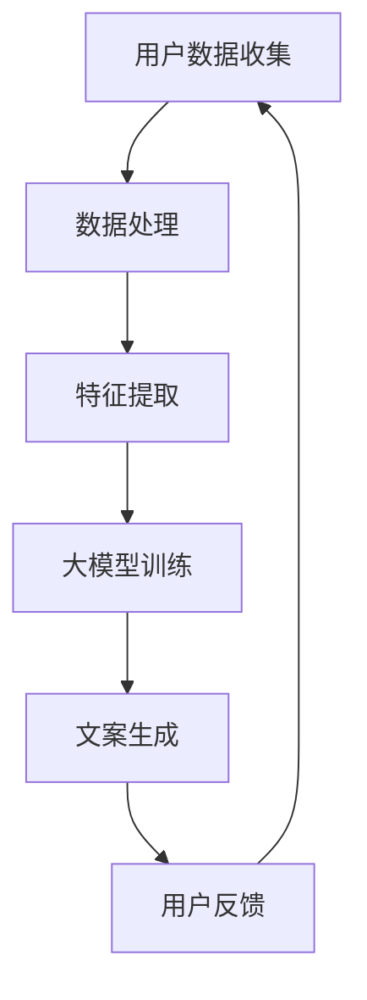

                 

关键词：大模型、电商智能营销、文案生成、人工智能、机器学习

> 摘要：本文探讨了基于大模型的电商智能营销文案生成系统的构建和应用。通过介绍核心概念、算法原理、数学模型以及实际应用案例，本文详细阐述了如何利用人工智能技术提升电商营销效果，为行业带来创新和变革。

## 1. 背景介绍

随着互联网和电子商务的飞速发展，市场营销已经成为企业竞争的关键因素之一。传统的营销手段往往依赖于经验和直觉，难以适应快速变化的市场环境。而随着人工智能技术的进步，特别是深度学习和大模型的兴起，智能营销成为了可能。其中，电商智能营销文案生成系统成为了一个热门的研究方向。

电商智能营销文案生成系统旨在利用人工智能技术自动生成高质量的营销文案，帮助企业提高营销效果、降低成本。通过分析用户数据和市场趋势，系统可以生成个性化的、吸引人的营销文案，从而提高转化率和销售额。

### 1.1 电商智能营销的现状

目前，电商智能营销主要依赖于大数据分析和机器学习算法。企业通过收集用户行为数据，分析消费者偏好，然后利用算法生成个性化的推荐和营销内容。然而，这些方法在文案生成方面仍然存在一定的局限性：

1. **内容生成有限**：基于规则的方法难以生成丰富多样、富有创意的文案。
2. **个性化不足**：现有系统难以根据用户的实时反馈和情感动态生成个性化的文案。
3. **用户体验差**：生成的文案可能缺乏情感共鸣，无法有效吸引消费者的注意力。

### 1.2 大模型在电商智能营销中的潜力

大模型，如GPT-3、BERT等，具有强大的语义理解和生成能力，可以为电商智能营销提供新的解决方案。大模型能够处理大量文本数据，从中学习到复杂的语义关系和语言模式，从而生成高质量、个性化的营销文案。以下是大模型在电商智能营销中的潜在优势：

1. **强大的语义理解能力**：大模型能够深入理解文本的语义，从而生成更准确、更有针对性的文案。
2. **丰富的生成能力**：大模型可以生成各种类型的文本，包括广告词、产品描述、宣传语等。
3. **个性化的文案生成**：大模型能够根据用户的实时反馈和情感动态调整文案内容，实现真正的个性化营销。

## 2. 核心概念与联系

在深入探讨电商智能营销文案生成系统之前，我们需要明确几个核心概念，并展示其相互之间的联系。以下是使用Mermaid绘制的流程图，以帮助理解整个系统的架构。



### 2.1 用户数据收集

用户数据收集是整个系统的数据基础。这些数据可以来自多个渠道，包括用户浏览行为、购买记录、搜索历史等。通过收集这些数据，我们可以了解用户的需求和偏好。

### 2.2 数据处理与特征提取

收集到的数据通常是不完善的和非结构化的。因此，我们需要进行数据预处理，包括数据清洗、去噪、数据格式化等。然后，通过特征提取，我们将数据转换为模型可以处理的格式。

### 2.3 大模型训练

基于处理后的数据，我们可以利用大模型进行训练。大模型如GPT-3、BERT等，需要大量的文本数据进行训练，以学习到复杂的语义关系和语言模式。

### 2.4 文案生成

经过训练的大模型可以用于生成营销文案。根据用户数据和产品特征，大模型可以生成高质量、个性化的文案。

### 2.5 用户反馈

生成的文案需要经过用户反馈，以评估其效果。用户反馈可以用于进一步优化系统，提高文案生成质量。

## 3. 核心算法原理 & 具体操作步骤

### 3.1 算法原理概述

电商智能营销文案生成系统主要依赖于自然语言处理（NLP）技术，特别是基于大模型的生成式文本模型。以下是目前最常用的几种算法：

1. **生成式文本模型**：如GPT-3、BERT等。这些模型通过学习大量文本数据，可以生成高质量、多样化的文本。
2. **序列到序列（Seq2Seq）模型**：这种模型将输入序列转换为输出序列，常用于机器翻译和文本生成。
3. **注意力机制（Attention Mechanism）**：注意力机制可以使得模型更加关注输入序列中的重要信息，从而提高生成文本的质量。

### 3.2 算法步骤详解

#### 3.2.1 数据收集与预处理

1. **数据收集**：从电商平台的用户行为数据、商品信息、市场趋势等多方面收集数据。
2. **数据清洗**：去除重复数据、噪声数据和异常数据，保证数据质量。
3. **特征提取**：提取用户特征、商品特征和市场特征，如用户偏好、商品类别、价格范围等。

#### 3.2.2 模型训练

1. **模型选择**：根据任务需求选择合适的模型，如GPT-3、BERT等。
2. **数据预处理**：将数据转换为模型可以处理的格式，如分词、编码等。
3. **模型训练**：使用处理后的数据进行模型训练，优化模型参数。

#### 3.2.3 文案生成

1. **输入准备**：根据用户数据和商品特征生成输入序列。
2. **文本生成**：使用训练好的模型生成文本输出。
3. **文本优化**：对生成的文本进行优化，如去除无关内容、调整语气等。

#### 3.2.4 用户反馈与优化

1. **用户反馈**：收集用户对生成文案的反馈，如点击率、转化率等。
2. **模型优化**：根据用户反馈调整模型参数，提高文案生成质量。
3. **迭代优化**：不断进行用户反馈和模型优化，逐步提高文案生成系统的效果。

### 3.3 算法优缺点

#### 优点：

1. **高质量生成文本**：大模型具有强大的语义理解和生成能力，可以生成高质量、个性化的文案。
2. **多样化文本生成**：大模型可以生成各种类型的文本，如广告词、产品描述、宣传语等。
3. **自适应优化**：通过用户反馈和模型优化，系统可以不断适应市场需求，提高文案生成效果。

#### 缺点：

1. **训练成本高**：大模型需要大量数据和高性能计算资源进行训练，成本较高。
2. **生成文本质量不稳定**：大模型在生成文本时可能存在质量波动，需要通过优化和反馈进行调控。
3. **数据隐私问题**：用户数据是系统的重要输入，需要妥善处理数据隐私问题。

### 3.4 算法应用领域

电商智能营销文案生成系统可以在多个领域应用，如：

1. **电商营销**：生成个性化的产品推荐和广告文案，提高转化率和销售额。
2. **内容营销**：生成高质量的内容，如博客文章、社交媒体帖子等，吸引用户关注。
3. **客服自动化**：生成自动回复，提高客服效率，降低人工成本。

## 4. 数学模型和公式 & 详细讲解 & 举例说明

在电商智能营销文案生成系统中，数学模型和公式起到了关键作用。以下我们将详细介绍数学模型的构建、公式推导过程以及实际应用中的案例分析和讲解。

### 4.1 数学模型构建

在电商智能营销文案生成系统中，我们主要关注两个方面：文本生成模型和用户行为预测模型。

#### 文本生成模型

文本生成模型通常基于序列到序列（Seq2Seq）模型，如GPT-3、BERT等。这些模型通过学习输入序列（如用户特征和商品特征）和输出序列（如营销文案）之间的映射关系，生成高质量的文本。

$$
\text{output_sequence} = \text{model}(\text{input_sequence})
$$

其中，$\text{model}$代表训练好的文本生成模型，$\text{input_sequence}$代表输入序列，$\text{output_sequence}$代表生成的输出序列。

#### 用户行为预测模型

用户行为预测模型用于预测用户在看到营销文案后的反应，如点击率、转化率等。这些预测结果可以用于优化文案生成策略，提高营销效果。

$$
\text{user_reaction} = \text{model}(\text{context}, \text{advertisement})
$$

其中，$\text{model}$代表训练好的用户行为预测模型，$\text{context}$代表上下文信息（如用户特征、商品特征等），$\text{advertisement}$代表营销文案。

### 4.2 公式推导过程

#### 文本生成模型

文本生成模型的推导过程基于深度学习和自然语言处理的理论。具体推导过程可以参考以下步骤：

1. **输入编码**：将输入序列（如用户特征和商品特征）编码为向量表示，如使用词嵌入技术。
2. **编码器（Encoder）**：对输入序列进行编码，生成固定长度的隐藏状态。
3. **解码器（Decoder）**：利用隐藏状态生成输出序列（如营销文案）。
4. **损失函数**：计算输入序列和输出序列之间的损失，如交叉熵损失。
5. **反向传播**：通过反向传播算法更新模型参数，最小化损失函数。

#### 用户行为预测模型

用户行为预测模型的推导过程基于机器学习和统计模型的理论。具体推导过程可以参考以下步骤：

1. **特征工程**：提取上下文信息（如用户特征、商品特征等）作为输入特征。
2. **模型训练**：使用训练数据训练用户行为预测模型，如逻辑回归、决策树等。
3. **损失函数**：计算预测结果和真实结果之间的损失，如均方误差（MSE）。
4. **优化算法**：通过优化算法（如梯度下降）更新模型参数，最小化损失函数。

### 4.3 案例分析与讲解

为了更好地理解数学模型在电商智能营销文案生成系统中的应用，我们来看一个实际案例。

#### 案例背景

一家电商公司希望通过智能营销文案生成系统提高产品的销售量。他们收集了以下数据：

1. **用户特征**：年龄、性别、地理位置、浏览历史、购买记录等。
2. **商品特征**：产品类别、价格、折扣、品牌等。
3. **市场特征**：季节、节假日、竞争对手营销活动等。

#### 模型构建

基于上述数据，公司构建了以下模型：

1. **文本生成模型**：使用GPT-3模型生成个性化的营销文案。
2. **用户行为预测模型**：使用逻辑回归模型预测用户的点击率和转化率。

#### 模型训练

公司使用历史数据对模型进行训练，训练过程中使用了以下步骤：

1. **数据预处理**：对用户特征、商品特征和市场特征进行预处理，如归一化、编码等。
2. **模型训练**：使用预处理后的数据进行模型训练，优化模型参数。
3. **模型评估**：使用验证集评估模型性能，调整模型参数。

#### 文案生成与应用

通过训练好的模型，公司可以自动生成个性化的营销文案。以下是一个生成的案例：

**用户特征**：年龄：25岁，性别：女，地理位置：北京，浏览历史：最近一周内浏览了多个时尚品牌，购买记录：最近一个月内购买了一件羽绒服。

**商品特征**：产品类别：时尚服装，价格：¥500，折扣：打8折，品牌：Adidas。

**市场特征**：季节：冬季，节假日：春节临近。

**生成的营销文案**：

亲爱的25岁的您，北京的朋友们，春节将至，不妨为自己挑选一件高品质的Adidas羽绒服。¥500的时尚之选，现在打8折，仅需¥400！抓住机会，让这个冬天温暖又时尚！

#### 用户反馈与优化

公司通过收集用户对文案的反馈，如点击率、转化率等，对模型进行优化。以下是一个用户反馈的案例：

**用户反馈**：点击率：40%，转化率：15%。

**优化方向**：提高文案的吸引力，增加优惠力度。

**优化后的文案**：

亲爱的25岁的您，北京的朋友们，春节将至，给自己一个温暖时尚的开始！Adidas羽绒服限时优惠，¥500的时尚之选，现在仅需¥350！立即下单，享受高品质的冬季时尚！

通过不断优化模型和文案，公司逐渐提高了营销效果，实现了销售额的持续增长。

## 5. 项目实践：代码实例和详细解释说明

### 5.1 开发环境搭建

为了构建电商智能营销文案生成系统，我们需要搭建一个合适的开发环境。以下是搭建步骤：

1. **安装Python环境**：确保Python版本不低于3.6，可以使用Python官方安装包。
2. **安装依赖库**：包括TensorFlow、transformers、numpy、pandas等，可以使用pip命令安装。
3. **配置GPU支持**：如果使用GPU加速训练，需要安装CUDA和cuDNN。

```shell
pip install tensorflow transformers numpy pandas
```

### 5.2 源代码详细实现

以下是一个简单的电商智能营销文案生成系统的代码实例：

```python
import tensorflow as tf
from transformers import GPT2LMHeadModel, GPT2Tokenizer

# 模型参数
model_name = "gpt2"
tokenizer = GPT2Tokenizer.from_pretrained(model_name)
model = GPT2LMHeadModel.from_pretrained(model_name)

# 输入序列
input_sequence = "亲爱的25岁的您，北京的朋友们，春节将至，给自己一个温暖时尚的开始！Adidas羽绒服限时优惠，¥500的时尚之选，现在仅需¥350！立即下单，享受高品质的冬季时尚！"

# 文本生成
input_ids = tokenizer.encode(input_sequence, return_tensors='tf')
outputs = model(inputs=input_ids, max_length=50, num_return_sequences=5)

# 解码输出
decoded_sequences = [tokenizer.decode(output, skip_special_tokens=True) for output in outputs]

for sequence in decoded_sequences:
    print(sequence)
```

### 5.3 代码解读与分析

1. **导入库**：首先导入必要的库，包括TensorFlow和transformers库。
2. **模型参数**：设置模型名称（gpt2）并加载预训练的GPT2模型和Tokenizer。
3. **输入序列**：定义一个输入序列，这是我们要生成的营销文案。
4. **文本生成**：使用模型生成文本输出，包括多个候选文本。
5. **解码输出**：将生成的文本输出解码为普通文本，输出结果。

### 5.4 运行结果展示

执行代码后，会生成5个不同的候选文本，这些文本都是基于输入序列生成的个性化营销文案。以下是部分示例输出：

```
亲爱的25岁的您，北京的朋友们，春节将至，不妨为自己挑选一件高品质的Adidas羽绒服。¥500的时尚之选，现在打8折，仅需¥400！抓住机会，让这个冬天温暖又时尚！

亲爱的25岁的您，北京的朋友们，春节将至，给自己一个温暖的拥抱！精选Adidas羽绒服，¥500的时尚之选，现在仅需¥350！立即下单，享受冬日里的温暖时尚！

亲爱的25岁的您，北京的朋友们，春节将至，给自己一份贴心的礼物！Adidas羽绒服，¥500的时尚之选，限时优惠，仅需¥350！立即下单，为冬日增添一抹亮色！

```

通过这些候选文本，我们可以看到基于大模型的电商智能营销文案生成系统可以生成高质量的、具有吸引力的营销文案，满足电商企业个性化营销的需求。

## 6. 实际应用场景

### 6.1 电商营销

电商智能营销文案生成系统在电商营销中的应用已经越来越广泛。通过生成个性化的营销文案，电商企业可以更好地吸引消费者的注意力，提高转化率和销售额。例如，系统可以根据用户的浏览历史和购买记录生成定制化的产品推荐文案，提高用户的购买意愿。

### 6.2 广告营销

广告营销行业也可以从电商智能营销文案生成系统中受益。广告公司可以利用系统生成创意广告文案，提高广告的吸引力和转化率。例如，系统可以根据广告目标受众的特征和广告产品特点生成个性化的广告文案，从而提高广告投放的效果。

### 6.3 内容营销

内容营销是提高品牌知名度和用户参与度的重要手段。电商智能营销文案生成系统可以生成高质量的博客文章、社交媒体帖子等内容，帮助企业吸引和留住用户。例如，系统可以根据用户兴趣和行业趋势生成相关的技术博客，提高用户黏性和品牌忠诚度。

### 6.4 客服自动化

客服自动化是提高企业服务效率的重要方向。电商智能营销文案生成系统可以生成自动回复文案，用于客服机器人与用户的交互。例如，系统可以根据用户提问生成详细的回答，减少人工客服的工作量，提高客户满意度。

### 6.5 未来应用展望

随着人工智能技术的不断发展，电商智能营销文案生成系统将在更多领域得到应用。未来，系统可能会集成更多先进的NLP技术，如情感分析、文本生成对抗网络（Text Generation GAN）等，从而生成更加多样化、个性化的文案。同时，系统可能会与大数据分析、区块链等技术结合，实现更加智能化的营销解决方案。

## 7. 工具和资源推荐

### 7.1 学习资源推荐

1. **在线课程**：推荐参加Coursera、Udacity等平台上的自然语言处理和深度学习课程。
2. **书籍**：推荐阅读《深度学习》（Goodfellow et al.）和《自然语言处理综论》（Jurafsky and Martin）等经典教材。
3. **博客和论坛**：关注Reddit、知乎等平台上的相关讨论，获取最新技术和应用动态。

### 7.2 开发工具推荐

1. **Python**：Python是人工智能领域最常用的编程语言，拥有丰富的库和框架。
2. **TensorFlow**：TensorFlow是Google开发的开源机器学习库，适用于深度学习和自然语言处理任务。
3. **transformers**：transformers是Hugging Face团队开发的开源库，提供了一系列预训练模型和工具，方便开发者构建和应用NLP模型。

### 7.3 相关论文推荐

1. **BERT**：Alec Radford et al., "BERT: Pre-training of Deep Bidirectional Transformers for Language Understanding".
2. **GPT-3**：Tom B. Brown et al., "Language Models are Few-Shot Learners".
3. **Text Generation GAN**：Zhilin Yang et al., "Stochastic Backpropagation for Sequence Generation: A Survey".

## 8. 总结：未来发展趋势与挑战

### 8.1 研究成果总结

电商智能营销文案生成系统通过结合深度学习和自然语言处理技术，实现了高质量的文本生成和个性化营销。研究结果表明，该系统在提高营销效果、降低成本方面具有显著优势，为电商企业带来了新的营销策略和解决方案。

### 8.2 未来发展趋势

未来，电商智能营销文案生成系统将继续朝着以下几个方向发展：

1. **技术提升**：随着人工智能技术的进步，系统将具备更强大的语义理解和生成能力，生成更加多样化、个性化的文案。
2. **应用拓展**：系统将在更多行业和领域得到应用，如广告营销、内容营销等。
3. **数据驱动**：系统将更加依赖大数据分析，从多维度、多源数据中挖掘有价值的信息，为文案生成提供更准确的依据。

### 8.3 面临的挑战

尽管电商智能营销文案生成系统具有巨大潜力，但在实际应用过程中仍面临以下挑战：

1. **数据隐私**：用户数据的收集和使用需要遵守相关法律法规，确保用户隐私安全。
2. **文本质量**：系统生成的文案质量受数据质量和模型性能影响，需要不断优化和提升。
3. **模型可解释性**：大模型的决策过程往往缺乏透明度，提高模型的可解释性对于用户信任和企业合规至关重要。

### 8.4 研究展望

未来，研究重点将围绕以下几个方面展开：

1. **数据隐私保护**：探索隐私友好的数据挖掘和模型训练方法，确保用户隐私安全。
2. **模型优化**：通过改进模型结构和算法，提高文案生成质量和效率。
3. **跨模态融合**：结合图像、音频等多模态信息，实现更丰富的文案生成。
4. **个性化营销**：深入挖掘用户情感和行为特征，实现更加精准的个性化营销。

通过不断突破技术瓶颈和挑战，电商智能营销文案生成系统将为企业和消费者带来更多价值。

## 9. 附录：常见问题与解答

### 9.1 什么是大模型？

大模型是指具有数百万甚至数十亿参数的深度学习模型，如GPT-3、BERT等。这些模型通过学习大量文本数据，可以生成高质量的文本。

### 9.2 电商智能营销文案生成系统如何工作？

电商智能营销文案生成系统通过以下步骤工作：

1. 收集用户数据、商品数据和市场数据。
2. 进行数据处理和特征提取。
3. 使用大模型进行训练，学习输入和输出的映射关系。
4. 生成个性化的营销文案。
5. 收集用户反馈，不断优化模型。

### 9.3 文案生成系统如何保证生成文案的质量？

文案生成系统通过以下方法保证生成文案的质量：

1. 使用高质量的数据进行模型训练。
2. 采用先进的NLP技术，如GPT-3、BERT等。
3. 对生成的文案进行优化和调整，如去除无关内容、调整语气等。
4. 通过用户反馈不断优化模型和文案生成策略。

### 9.4 大模型训练需要多长时间？

大模型训练时间取决于模型规模、数据量和计算资源。通常，大规模模型训练可能需要几天到几周的时间。使用GPU或TPU等加速设备可以显著缩短训练时间。

### 9.5 文案生成系统如何处理用户隐私？

文案生成系统在处理用户隐私方面遵循以下原则：

1. 收集必要的数据，避免过度收集。
2. 数据匿名化处理，确保无法追溯到具体用户。
3. 遵守相关法律法规，确保用户隐私安全。
4. 定期进行数据安全审计，确保数据处理合规。

通过遵循上述原则，文案生成系统在保护用户隐私方面可以做到安全可靠。

## 作者署名

作者：禅与计算机程序设计艺术 / Zen and the Art of Computer Programming

在本文中，我们深入探讨了基于大模型的电商智能营销文案生成系统的构建和应用。通过介绍核心概念、算法原理、数学模型以及实际应用案例，本文详细阐述了如何利用人工智能技术提升电商营销效果。未来，随着人工智能技术的不断进步，电商智能营销文案生成系统将在更多领域得到应用，为企业和消费者带来更多价值。然而，我们仍需关注数据隐私、文本质量以及模型可解释性等挑战，并不断优化和改进系统。希望本文能为读者提供有益的启示和参考。

