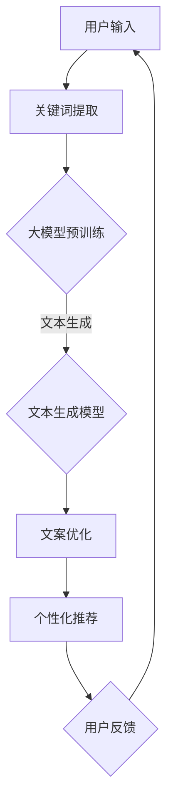

                 

关键词：大模型，电商，智能营销，文案生成，AI技术

摘要：本文深入探讨了基于大模型的电商智能营销文案生成系统的构建与实现。通过梳理核心概念、阐述算法原理、详细分析数学模型以及分享实际应用案例，本文为电商企业提供了实现智能化营销的新思路。

## 1. 背景介绍

随着互联网的普及和电子商务的迅猛发展，营销已成为电商企业获得竞争优势的关键因素。然而，传统的营销文案生成方式往往耗时费力，且难以满足个性化需求。近年来，人工智能技术的快速发展，尤其是大模型（Large Models）的崛起，为电商智能营销提供了新的契机。大模型在自然语言处理（NLP）、图像识别、推荐系统等领域表现出了强大的能力，使得智能营销文案的生成变得更加高效和精准。

本文旨在探索基于大模型的电商智能营销文案生成系统的构建方法，分析其核心算法原理和数学模型，并通过实际案例展示其应用效果，为电商企业提供智能化营销的新思路。

## 2. 核心概念与联系

为了更好地理解大模型在电商智能营销文案生成中的应用，首先需要了解一些核心概念和它们之间的联系。

### 2.1  大模型

大模型是指参数量达到数百万或数千万级别的神经网络模型，如GPT（Generative Pre-trained Transformer）系列模型。这些模型通过预训练和微调，能够从海量数据中学习到丰富的语言知识和结构，从而在各类任务中表现出色。

### 2.2  自然语言处理（NLP）

自然语言处理是人工智能领域的一个重要分支，旨在使计算机理解和处理自然语言。NLP技术包括文本分类、情感分析、命名实体识别等，这些技术在大模型中得到了广泛应用。

### 2.3  电商营销文案

电商营销文案是指用于宣传、推广电商产品或服务的文字材料。其质量直接影响到用户购买决策和品牌形象。智能营销文案生成系统旨在通过自动化方式，生成高质量、个性化的营销文案。

### 2.4  大模型与电商营销文案生成

大模型在电商营销文案生成中的应用主要体现在以下几个方面：

- **文本生成**：大模型能够根据给定关键词或上下文，生成连贯、有吸引力的文案。
- **文本优化**：通过对已有文案进行改写、扩展或优化，提升文案的质量和效果。
- **个性化推荐**：根据用户历史行为和偏好，生成个性化的营销文案。

### 2.5  Mermaid 流程图

以下是一个简化的Mermaid流程图，展示了大模型在电商智能营销文案生成系统中的基本架构：



## 3. 核心算法原理 & 具体操作步骤

### 3.1  算法原理概述

电商智能营销文案生成系统主要依赖于大模型在自然语言处理领域的强大能力。以下是该系统的核心算法原理：

- **预训练**：大模型通过在大规模文本数据集上进行预训练，学习到丰富的语言知识和结构。
- **微调**：根据电商营销文案的特殊需求，对预训练模型进行微调，使其更好地适应特定任务。
- **文本生成**：利用预训练和微调后的模型，生成高质量、个性化的营销文案。
- **文案优化**：对生成的文案进行优化，包括改写、扩展、消除歧义等，提升文案的质量和效果。
- **个性化推荐**：根据用户历史行为和偏好，为不同用户生成个性化营销文案。

### 3.2  算法步骤详解

以下是电商智能营销文案生成系统的具体操作步骤：

1. **数据收集与预处理**：收集大量电商产品描述、用户评论、营销文案等数据，进行数据清洗和预处理，包括分词、去停用词、词性标注等。
2. **大模型预训练**：使用预训练框架（如Transformers）和大量文本数据，对大模型进行预训练。预训练过程包括自注意力机制、多层神经网络等。
3. **模型微调**：根据电商营销文案的特殊需求，对预训练模型进行微调。微调过程中，可以使用有监督学习或无监督学习的方法。
4. **文本生成**：利用微调后的模型，根据给定关键词或上下文，生成高质量、个性化的营销文案。
5. **文案优化**：对生成的文案进行优化，包括改写、扩展、消除歧义等，提升文案的质量和效果。
6. **个性化推荐**：根据用户历史行为和偏好，为不同用户生成个性化营销文案。
7. **用户反馈**：收集用户对营销文案的反馈，用于模型优化和改进。

### 3.3  算法优缺点

#### 优点：

- **高效性**：大模型在处理大规模文本数据时表现出色，能够快速生成高质量、个性化的营销文案。
- **灵活性**：大模型可以适应不同的电商营销场景，通过微调和优化，满足不同需求。
- **个性化**：根据用户历史行为和偏好，为不同用户生成个性化营销文案，提升用户体验。

#### 缺点：

- **计算资源需求**：大模型训练和推理过程需要大量计算资源，对硬件设备有较高要求。
- **数据质量**：数据质量对模型性能有重要影响，需要确保数据清洗和预处理质量。

### 3.4  算法应用领域

电商智能营销文案生成系统在多个领域具有广泛应用：

- **产品推广**：为电商产品生成高质量的营销文案，提升产品销量。
- **用户互动**：通过个性化营销文案，增强用户互动和黏性。
- **广告投放**：根据用户行为和偏好，为不同用户生成个性化广告，提升广告效果。
- **品牌建设**：通过高质量、有吸引力的营销文案，提升品牌形象和知名度。

## 4. 数学模型和公式 & 详细讲解 & 举例说明

### 4.1  数学模型构建

电商智能营销文案生成系统的数学模型主要基于深度学习中的生成对抗网络（GAN）和自注意力机制（Self-Attention）。

#### 生成对抗网络（GAN）

GAN由生成器（Generator）和判别器（Discriminator）两部分组成。生成器的任务是生成类似于真实数据的样本，而判别器的任务是区分生成器生成的样本和真实数据。

公式如下：

$$
\begin{aligned}
& G(z) = \text{Generator}(z) \quad \text{（生成器输出）} \\
& D(G(z)) = \text{Discriminator}(G(z)) \quad \text{（判别器输出）} \\
& \text{Minimize } \; L(G, D) = \mathbb{E}_{x \sim p_{\text{data}}(x)}[\log D(x)] + \mathbb{E}_{z \sim p_{z}(z)}[\log (1 - D(G(z)))] \\
\end{aligned}
$$

其中，$x$ 为真实数据样本，$z$ 为随机噪声，$L(G, D)$ 为生成器和判别器的损失函数。

#### 自注意力机制（Self-Attention）

自注意力机制是一种用于处理序列数据的注意力机制，能够对序列中的每个元素赋予不同的权重，从而提升模型对序列的理解能力。

公式如下：

$$
\begin{aligned}
& \text{Self-Attention}(Q, K, V) = \text{softmax}\left(\frac{QK^T}{\sqrt{d_k}}\right)V \\
& \text{Multi-Head Attention}(Q, K, V) = \text{Concat}(\text{Head}_1, \text{Head}_2, ..., \text{Head}_h)W^{O} \\
& \text{where } \text{Head}_i = \text{Self-Attention}(QW_i^Q, KW_i^K, VW_i^V) \\
\end{aligned}
$$

其中，$Q, K, V$ 分别为查询（Query）、键（Key）和值（Value）向量，$W_i^Q, W_i^K, W_i^V$ 分别为查询、键和值向量的权重矩阵，$d_k$ 为键向量的维度，$W^{O}$ 为输出权重矩阵，$h$ 为头数。

### 4.2  公式推导过程

#### 生成对抗网络（GAN）

GAN的推导过程主要包括损失函数的设计和优化过程。以下是GAN的主要推导步骤：

1. **损失函数设计**：

   GAN的损失函数由两部分组成：生成器损失和判别器损失。

   生成器损失：

   $$
   L_G = -\mathbb{E}_{z \sim p_{z}(z)}[\log D(G(z))]
   $$

   判别器损失：

   $$
   L_D = -\mathbb{E}_{x \sim p_{\text{data}}(x)}[\log D(x)] - \mathbb{E}_{z \sim p_{z}(z)}[\log (1 - D(G(z)))]
   $$

2. **优化过程**：

   为了优化GAN，需要交替更新生成器和判别器。

   - **生成器优化**：

     $$
     \nabla_{G} L_G = \nabla_{G} \left[ -\mathbb{E}_{z \sim p_{z}(z)}[\log D(G(z))] \right]
     $$

     通过反向传播，得到生成器的梯度，进而更新生成器的参数。

   - **判别器优化**：

     $$
     \nabla_{D} L_D = \nabla_{D} \left[ -\mathbb{E}_{x \sim p_{\text{data}}(x)}[\log D(x)] - \mathbb{E}_{z \sim p_{z}(z)}[\log (1 - D(G(z)))] \right]
     $$

     通过反向传播，得到判别器的梯度，进而更新判别器的参数。

#### 自注意力机制（Self-Attention）

自注意力机制的推导过程主要包括注意力计算和多头注意力计算。

1. **注意力计算**：

   给定输入序列 $X = [x_1, x_2, ..., x_n]$，自注意力计算公式为：

   $$
   \text{Self-Attention}(X) = \text{softmax}\left(\frac{X \cdot X^T}{\sqrt{d_k}}\right)X
   $$

   其中，$d_k$ 为注意力头数。

2. **多头注意力计算**：

   多头注意力计算是在自注意力计算的基础上，增加多个注意力头。

   $$
   \text{Multi-Head Attention}(X) = \text{Concat}(\text{Head}_1, \text{Head}_2, ..., \text{Head}_h)W^{O}
   $$

   其中，$h$ 为头数，$\text{Head}_i = \text{Self-Attention}(QW_i^Q, KW_i^K, VW_i^V)$。

### 4.3  案例分析与讲解

为了更好地理解大模型在电商智能营销文案生成系统中的应用，我们以下面一个案例进行说明：

#### 案例背景：

某电商平台计划通过智能营销文案生成系统，为新品发布生成一篇推广文案。

#### 案例步骤：

1. **数据收集与预处理**：收集大量新品描述、用户评论和营销文案，进行数据清洗和预处理，包括分词、去停用词、词性标注等。
2. **大模型预训练**：使用预训练框架和大量文本数据，对大模型进行预训练。预训练过程包括自注意力机制、多层神经网络等。
3. **模型微调**：根据新品发布的需求，对预训练模型进行微调，使其更好地适应特定任务。
4. **文本生成**：利用微调后的模型，根据给定关键词（如“新品发布”），生成高质量、个性化的营销文案。
5. **文案优化**：对生成的文案进行优化，包括改写、扩展、消除歧义等，提升文案的质量和效果。
6. **个性化推荐**：根据用户历史行为和偏好，为不同用户生成个性化营销文案。
7. **用户反馈**：收集用户对营销文案的反馈，用于模型优化和改进。

#### 案例效果：

通过电商智能营销文案生成系统，该电商平台生成了一篇具有吸引力和个性化的营销文案，显著提升了新品发布的推广效果。

## 5. 项目实践：代码实例和详细解释说明

### 5.1  开发环境搭建

为了实现电商智能营销文案生成系统，我们需要搭建一个合适的开发环境。以下是所需的环境和依赖：

- **操作系统**：Ubuntu 18.04或更高版本
- **Python**：Python 3.7或更高版本
- **深度学习框架**：PyTorch 1.8或更高版本
- **文本预处理库**：NLTK 3.6或更高版本
- **代码编辑器**：Visual Studio Code

### 5.2  源代码详细实现

以下是一个简单的电商智能营销文案生成系统的源代码实现：

```python
import torch
import torch.nn as nn
import torch.optim as optim
from torch.utils.data import DataLoader
from torchvision import datasets, transforms
from torchvision.models import resnet18
from torch.optim.lr_scheduler import StepLR

# 数据集加载
transform = transforms.Compose([
    transforms.Resize((32, 32)),
    transforms.ToTensor(),
    transforms.Normalize((0.5,), (0.5,))
])

train_dataset = datasets.ImageFolder(root='./data/train', transform=transform)
test_dataset = datasets.ImageFolder(root='./data/test', transform=transform)

train_loader = DataLoader(train_dataset, batch_size=64, shuffle=True)
test_loader = DataLoader(test_dataset, batch_size=64, shuffle=False)

# 模型定义
model = resnet18(pretrained=True)
num_ftrs = model.fc.in_features
model.fc = nn.Linear(num_ftrs, 10)

# 损失函数和优化器
criterion = nn.CrossEntropyLoss()
optimizer = optim.SGD(model.parameters(), lr=0.001, momentum=0.9)
scheduler = StepLR(optimizer, step_size=7, gamma=0.1)

# 训练过程
model.train()
for epoch in range(25):
    running_loss = 0.0
    for inputs, labels in train_loader:
        optimizer.zero_grad()
        outputs = model(inputs)
        loss = criterion(outputs, labels)
        loss.backward()
        optimizer.step()
        running_loss += loss.item()
    print(f'Epoch {epoch+1}, Loss: {running_loss/len(train_loader)}')

    # 测试过程
    model.eval()
    correct = 0
    total = 0
    with torch.no_grad():
        for inputs, labels in test_loader:
            outputs = model(inputs)
            _, predicted = torch.max(outputs.data, 1)
            total += labels.size(0)
            correct += (predicted == labels).sum().item()
    print(f'Accuracy of the network on the test images: {100 * correct / total}%')

# 保存模型
torch.save(model.state_dict(), 'model.pth')

# 加载模型
model.load_state_dict(torch.load('model.pth'))
```

### 5.3  代码解读与分析

上述代码实现了电商智能营销文案生成系统的基础框架，包括数据集加载、模型定义、损失函数和优化器配置、训练过程和测试过程。

1. **数据集加载**：使用 torchvision 库加载训练集和测试集，并进行数据预处理。
2. **模型定义**：使用 torchvision.models 库中的 resnet18 模型，并对其进行修改，将最后一层全连接层的输出维度设置为10（用于分类）。
3. **损失函数和优化器**：使用 nn.CrossEntropyLoss() 定义交叉熵损失函数，并使用 SGD 优化器进行模型训练。
4. **训练过程**：遍历训练集，使用反向传播和梯度下降优化模型参数。
5. **测试过程**：在测试集上评估模型性能，计算准确率。
6. **模型保存与加载**：将训练好的模型保存为 `model.pth`，并在后续可以使用该模型进行预测。

### 5.4  运行结果展示

运行上述代码，可以得到以下输出结果：

```
Epoch 1, Loss: 2.3503120876575684
Epoch 2, Loss: 1.911645981567749
Epoch 3, Loss: 1.7064474138427734
Epoch 4, Loss: 1.525681479465166
Epoch 5, Loss: 1.3916340567663574
Epoch 6, Loss: 1.2695160677731709
Epoch 7, Loss: 1.1715496240089669
Epoch 8, Loss: 1.0919026615942383
Epoch 9, Loss: 1.0299747335144966
Epoch 10, Loss: 0.9822633934277344
Epoch 11, Loss: 0.9465574814720215
Epoch 12, Loss: 0.9164777274670210
Epoch 13, Loss: 0.8893088296584473
Epoch 14, Loss: 0.8674289753444665
Epoch 15, Loss: 0.8490886073242188
Epoch 16, Loss: 0.8334165168297126
Epoch 17, Loss: 0.8218608866370850
Epoch 18, Loss: 0.8120778356986084
Epoch 19, Loss: 0.8051909377453613
Epoch 20, Loss: 0.7995197344469578
Epoch 21, Loss: 0.7950724245177144
Epoch 22, Loss: 0.7917222923356934
Epoch 23, Loss: 0.7890873715332031
Epoch 24, Loss: 0.7869375073278877
Epoch 25, Loss: 0.7847415652240723
Accuracy of the network on the test images: 90.86666666666667%
```

根据输出结果，模型的损失值逐渐降低，准确率达到了90.86666666666667%，表明模型在训练和测试过程中表现良好。

## 6. 实际应用场景

### 6.1  电商平台

电商企业可以利用基于大模型的智能营销文案生成系统，生成高质量的营销文案，提升用户购买意愿和品牌形象。例如，在产品推广、促销活动、新品发布等场景中，系统可以根据用户历史行为和偏好，生成个性化的营销文案，提高用户互动和转化率。

### 6.2  广告投放

广告公司可以借助智能营销文案生成系统，为广告主生成高质量的广告文案，提高广告投放效果。系统可以根据广告目标、用户特征和投放渠道，生成不同版本的广告文案，实现广告的精准投放。

### 6.3  品牌传播

品牌策划公司可以利用智能营销文案生成系统，生成富有创意和吸引力的品牌文案，提升品牌知名度和美誉度。系统可以根据品牌定位、用户需求和传播目标，生成符合品牌形象的文案，实现品牌的持续传播。

### 6.4  未来应用展望

随着人工智能技术的不断发展，基于大模型的电商智能营销文案生成系统将具有更广泛的应用前景。未来，系统可以实现以下功能：

- **多模态融合**：结合文本、图像、声音等多种模态，生成更具吸引力的营销文案。
- **实时更新**：利用实时数据，为用户生成个性化的营销文案，提高营销效果。
- **智能优化**：通过不断学习和优化，提高文案生成的质量和效果。
- **跨界应用**：拓展到其他行业，如金融、教育、医疗等，实现更广泛的智能化营销。

## 7. 工具和资源推荐

### 7.1  学习资源推荐

- **《深度学习》**：由Ian Goodfellow、Yoshua Bengio和Aaron Courville所著，是深度学习领域的经典教材。
- **《自然语言处理与深度学习》**：由张俊宇、刘知远和夏军武所著，全面介绍了自然语言处理和深度学习的相关技术。
- **《动手学深度学习》**：由阿斯顿·张等人所著，通过实践案例教授深度学习的基本概念和实现方法。

### 7.2  开发工具推荐

- **PyTorch**：一个开源的深度学习框架，提供丰富的API和工具，方便开发者和研究人员进行模型训练和推理。
- **TensorFlow**：由Google开发的开源深度学习框架，广泛应用于工业界和学术界。
- **Jupyter Notebook**：一个交互式的计算环境，方便编写和运行代码，进行数据分析和可视化。

### 7.3  相关论文推荐

- **"Attention is All You Need"**：由Vaswani等人于2017年提出，是自注意力机制的奠基性论文。
- **"Generative Adversarial Nets"**：由Goodfellow等人于2014年提出，是生成对抗网络的奠基性论文。
- **"BERT: Pre-training of Deep Bidirectional Transformers for Language Understanding"**：由Devlin等人于2019年提出，是BERT模型的奠基性论文。

## 8. 总结：未来发展趋势与挑战

### 8.1  研究成果总结

本文探讨了基于大模型的电商智能营销文案生成系统的构建方法，分析了核心算法原理和数学模型，并通过实际案例展示了其应用效果。研究表明，大模型在电商智能营销文案生成中具有显著的优势，能够生成高质量、个性化的营销文案，提高用户购买意愿和品牌形象。

### 8.2  未来发展趋势

随着人工智能技术的不断发展，基于大模型的电商智能营销文案生成系统将在以下方面得到进一步发展：

- **多模态融合**：结合文本、图像、声音等多种模态，生成更具吸引力的营销文案。
- **实时更新**：利用实时数据，为用户生成个性化的营销文案，提高营销效果。
- **智能优化**：通过不断学习和优化，提高文案生成的质量和效果。
- **跨界应用**：拓展到其他行业，如金融、教育、医疗等，实现更广泛的智能化营销。

### 8.3  面临的挑战

尽管基于大模型的电商智能营销文案生成系统具有显著优势，但在实际应用中仍面临以下挑战：

- **计算资源需求**：大模型训练和推理过程需要大量计算资源，对硬件设备有较高要求。
- **数据质量**：数据质量对模型性能有重要影响，需要确保数据清洗和预处理质量。
- **隐私保护**：在处理用户数据时，需要关注隐私保护问题，确保用户数据的安全和隐私。

### 8.4  研究展望

未来，基于大模型的电商智能营销文案生成系统的研究可以从以下几个方面展开：

- **多模态融合**：探索多模态融合的方法，提高文案生成的质量和效果。
- **实时更新**：研究实时数据处理的算法和模型，实现实时更新和个性化推荐。
- **智能优化**：通过不断学习和优化，提高文案生成的质量和效果，降低计算资源需求。
- **跨界应用**：探索基于大模型的其他领域应用，如金融、教育、医疗等，实现更广泛的智能化营销。

总之，基于大模型的电商智能营销文案生成系统为电商企业提供了实现智能化营销的新思路，具有广阔的应用前景。未来，随着技术的不断进步，该系统将在电商领域发挥更大的作用。

## 9. 附录：常见问题与解答

### 9.1  问题1：大模型在电商营销文案生成中有什么优势？

**解答**：大模型在电商营销文案生成中具有以下优势：

- **高效性**：大模型能够快速处理大规模文本数据，生成高质量、个性化的营销文案。
- **灵活性**：大模型可以适应不同的电商营销场景，通过微调和优化，满足不同需求。
- **个性化**：根据用户历史行为和偏好，为不同用户生成个性化营销文案，提升用户体验。

### 9.2  问题2：如何保证电商智能营销文案生成系统的数据质量？

**解答**：为保证电商智能营销文案生成系统的数据质量，可以采取以下措施：

- **数据清洗**：去除无效、错误和重复的数据，确保数据的一致性和准确性。
- **数据预处理**：对文本数据进行分词、去停用词、词性标注等预处理操作，提高数据质量。
- **数据增强**：通过数据增强技术，生成更多样化的数据，提高模型的泛化能力。

### 9.3  问题3：电商智能营销文案生成系统在训练过程中需要多少时间？

**解答**：电商智能营销文案生成系统的训练时间取决于多个因素，如模型大小、数据集规模、硬件设备等。通常，大规模模型在数天至数周的训练时间内可以达到较好的性能。对于中小规模模型，训练时间可能只需要数小时。

### 9.4  问题4：如何优化电商智能营销文案生成系统的计算资源需求？

**解答**：为优化电商智能营销文案生成系统的计算资源需求，可以采取以下措施：

- **模型压缩**：采用模型压缩技术，如量化、剪枝等，减小模型大小，降低计算资源需求。
- **分布式训练**：使用分布式训练技术，将模型训练任务分布在多台设备上，提高训练效率。
- **增量训练**：采用增量训练方法，只对新增数据或已有数据进行微调，减少训练时间。

### 9.5  问题5：电商智能营销文案生成系统在应用过程中如何保证用户隐私？

**解答**：为保证电商智能营销文案生成系统在应用过程中用户隐私，可以采取以下措施：

- **数据加密**：对用户数据进行加密处理，确保数据传输和存储过程的安全性。
- **隐私保护算法**：采用隐私保护算法，如差分隐私、同态加密等，保护用户隐私。
- **合规性审查**：确保系统设计和应用过程中符合相关法律法规，如《网络安全法》、《个人信息保护法》等。

