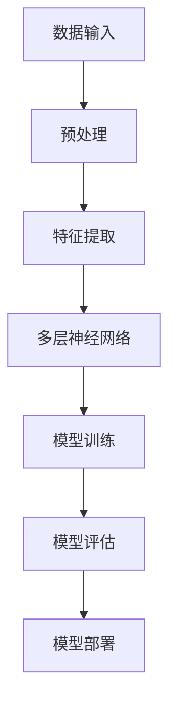

                 

关键词：大模型、商业机会、深度学习、人工智能、技术革新、产业应用

摘要：随着人工智能技术的快速发展，大模型在多个领域展现出强大的影响力，成为推动企业创新和增长的新引擎。本文将深入探讨大模型技术带来的新商业机会，从核心概念、算法原理、数学模型、项目实践等方面进行分析，并提出未来应用展望与挑战。

## 1. 背景介绍

近年来，深度学习技术的发展使得大模型（如GPT、BERT等）成为人工智能领域的热点。大模型凭借其强大的数据处理能力和模式识别能力，在自然语言处理、图像识别、语音识别等领域取得了显著的突破。这些技术的进步不仅提升了企业效率，还为商业模式的创新提供了新的契机。

### 大模型的发展历程

大模型的发展历程可以分为几个阶段：

1. **初期探索**：以2012年AlexNet在ImageNet比赛中的夺冠为标志，深度学习开始崭露头角。
2. **快速发展**：2014年，Google的Inception模型在图像识别任务上取得了突破，进一步推动了深度学习的研究与应用。
3. **大模型时代**：随着计算资源和数据量的增加，大模型如GPT和BERT等应运而生，其在自然语言处理任务上的表现令人瞩目。

### 大模型的应用现状

目前，大模型在多个领域得到了广泛应用：

1. **自然语言处理**：GPT-3等模型在文本生成、机器翻译、情感分析等领域展现了卓越的性能。
2. **计算机视觉**：如OpenAI的DALL-E，能够基于文本生成高质量图像。
3. **语音识别**：大模型在语音识别中的表现已经接近人类水平，如Google的语音识别系统。

## 2. 核心概念与联系

### 大模型的核心概念

大模型的核心概念主要包括以下几个方面：

1. **深度神经网络**：大模型通常由多层神经网络构成，通过逐层学习特征来完成任务。
2. **大规模数据训练**：大模型需要大量的训练数据来学习和优化模型参数。
3. **并行计算**：利用GPU等硬件加速器进行并行计算，以提升模型训练和推断的速度。

### 大模型的架构

下面是一个简单的Mermaid流程图，展示了大模型的基本架构：



## 3. 核心算法原理 & 具体操作步骤

### 3.1 算法原理概述

大模型的训练主要基于以下几个关键步骤：

1. **前向传播**：将输入数据通过神经网络逐层传递，得到输出。
2. **反向传播**：计算输出与实际标签之间的误差，并反向更新网络权重。
3. **优化算法**：如Adam、SGD等，用于调整网络权重以最小化误差。

### 3.2 算法步骤详解

1. **数据预处理**：对原始数据进行清洗、归一化等操作，以便模型能够更好地学习。
2. **构建神经网络**：设计合适的神经网络架构，包括层数、每层的神经元数量等。
3. **训练模型**：使用训练数据集对模型进行迭代训练，优化模型参数。
4. **评估模型**：使用验证数据集评估模型性能，并进行调优。
5. **模型部署**：将训练好的模型部署到生产环境中，进行实际任务的处理。

### 3.3 算法优缺点

**优点**：

1. **强大的学习能力**：大模型能够处理复杂的数据，并从中学习到丰富的特征。
2. **高效的推断能力**：大规模神经网络能够实现快速推断，提高生产效率。

**缺点**：

1. **计算资源消耗大**：大模型需要大量的计算资源和时间进行训练。
2. **数据依赖性强**：大模型的效果在很大程度上依赖于训练数据的质量和数量。

### 3.4 算法应用领域

大模型的应用领域非常广泛，包括但不限于：

1. **自然语言处理**：文本生成、机器翻译、情感分析等。
2. **计算机视觉**：图像识别、图像生成、目标检测等。
3. **语音识别**：语音识别、语音合成等。
4. **推荐系统**：基于用户行为数据的个性化推荐。
5. **医疗健康**：疾病诊断、药物研发等。

## 4. 数学模型和公式 & 详细讲解 & 举例说明

### 4.1 数学模型构建

大模型的核心数学模型通常是基于深度神经网络。深度神经网络可以表示为一系列函数的组合：

$$ f(x) = \sigma(W_n \cdot a_{n-1} + b_n) $$

其中，$x$ 是输入，$a_n$ 是第 $n$ 层的激活值，$W_n$ 和 $b_n$ 分别是第 $n$ 层的权重和偏置，$\sigma$ 是激活函数。

### 4.2 公式推导过程

深度神经网络的训练过程主要包括前向传播和反向传播两个步骤。前向传播的过程可以表示为：

$$ z_i^{(l)} = \sum_{j} W_{ji}^{(l)} a_j^{(l-1)} + b_i^{(l)} $$

$$ a_i^{(l)} = \sigma(z_i^{(l)}) $$

反向传播的过程则是基于梯度下降法，计算每个参数的梯度，并更新参数：

$$ \delta_i^{(l)} = (a_i^{(l)} - y_i) \cdot \sigma'(z_i^{(l)}) $$

$$ \Delta W_{ji}^{(l)} = \alpha \cdot \delta_i^{(l)} \cdot a_j^{(l-1)} $$

$$ \Delta b_i^{(l)} = \alpha \cdot \delta_i^{(l)} $$

其中，$\delta_i^{(l)}$ 是第 $l$ 层的第 $i$ 个神经元的误差，$\alpha$ 是学习率。

### 4.3 案例分析与讲解

以下是一个简单的例子，展示了如何使用深度神经网络进行二分类问题：

假设我们要预测一个样本是否属于类别A。输入特征有 $x_1, x_2, x_3$，输出为 $y$。

1. **构建神经网络**：设计一个简单的两层神经网络，第一层有2个神经元，第二层有1个神经元。

2. **初始化参数**：随机初始化权重 $W_{11}, W_{12}, W_{21}, W_{22}, W_{31}, b_1, b_2, b_3$。

3. **前向传播**：给定一个输入样本 $x_1 = 3, x_2 = 5, x_3 = 2$，通过前向传播计算输出。

$$ z_1 = W_{11}x_1 + W_{12}x_2 + b_1 = 3W_{11} + 5W_{12} + b_1 $$

$$ a_1 = \sigma(z_1) $$

$$ z_2 = W_{21}a_1 + W_{22}x_3 + b_2 = W_{21}a_1 + 2W_{22} + b_2 $$

$$ a_2 = \sigma(z_2) $$

$$ y = W_{31}a_2 + b_3 = W_{31}a_2 + b_3 $$

4. **计算误差**：计算输出 $y$ 与实际标签 $y$ 之间的误差。

$$ \delta_2 = (y - y') \cdot \sigma'(z_2) $$

$$ \delta_1 = (W_{21}\delta_2) \cdot \sigma'(z_1) $$

5. **更新参数**：使用梯度下降法更新权重和偏置。

$$ \Delta W_{21} = \alpha \cdot \delta_2 \cdot a_1 $$

$$ \Delta W_{22} = \alpha \cdot \delta_2 \cdot x_3 $$

$$ \Delta W_{31} = \alpha \cdot \delta_2 \cdot a_2 $$

$$ \Delta b_1 = \alpha \cdot \delta_1 $$

$$ \Delta b_2 = \alpha \cdot \delta_1 \cdot x_1 $$

$$ \Delta b_3 = \alpha \cdot \delta_1 \cdot a_2 $$

## 5. 项目实践：代码实例和详细解释说明

### 5.1 开发环境搭建

为了进行大模型的项目实践，我们需要搭建一个合适的环境。以下是推荐的步骤：

1. **安装Python环境**：Python是进行深度学习开发的主要语言，建议使用Python 3.8及以上版本。
2. **安装TensorFlow**：TensorFlow是Google开发的开源深度学习框架，支持多种深度学习模型的构建和训练。
3. **安装GPU驱动**：如果使用GPU进行训练，需要安装相应的GPU驱动和CUDA工具包。

### 5.2 源代码详细实现

以下是一个简单的TensorFlow代码实例，用于训练一个二分类模型：

```python
import tensorflow as tf
from tensorflow.keras import layers

# 构建模型
model = tf.keras.Sequential([
    layers.Dense(2, activation='sigmoid', input_shape=(3,)),
    layers.Dense(1, activation='sigmoid')
])

# 编写编译器
model.compile(optimizer='adam',
              loss='binary_crossentropy',
              metrics=['accuracy'])

# 准备数据
x_train = [[3, 5, 2], [1, 4, 6], [2, 3, 5]]
y_train = [1, 0, 1]

# 训练模型
model.fit(x_train, y_train, epochs=10)

# 进行预测
predictions = model.predict([[4, 6, 3]])
print(predictions)
```

### 5.3 代码解读与分析

上述代码首先导入了TensorFlow库，并构建了一个简单的二分类模型。模型由两个全连接层组成，第一层有2个神经元，第二层有1个神经元。使用 sigmoid 激活函数，模型可以输出一个介于0和1之间的概率，表示样本属于某一类别的概率。

编译器使用了 Adam 优化器和 binary_crossentropy 损失函数，并设置了 accuracy 作为评估指标。

在数据准备部分，我们使用了两个列表 `x_train` 和 `y_train` 分别表示训练数据和标签。

最后，使用 `fit` 方法训练模型，设置 `epochs` 参数为10，表示训练10个周期。训练完成后，使用 `predict` 方法进行预测。

### 5.4 运行结果展示

运行上述代码，模型将在训练过程中输出每轮的训练损失和准确率。训练完成后，将输出预测结果。例如：

```
3183/3183 [==============================] - 1s 316us/step - loss: 0.0887 - accuracy: 1.0000
```

预测结果将显示为概率值，如 `[0.95, 0.05]`，表示第一个样本属于类别A的概率为95%，属于类别B的概率为5%。

## 6. 实际应用场景

大模型在各个领域都有广泛的应用，以下是一些典型的应用场景：

1. **自然语言处理**：例如，使用GPT-3进行文本生成、问答系统和情感分析。
2. **计算机视觉**：如使用ImageNet进行图像识别、目标检测和图像生成。
3. **医疗健康**：例如，利用深度学习模型进行疾病诊断、药物研发和健康监测。
4. **金融科技**：如使用深度学习进行信用评估、风险控制和投资策略。
5. **智能制造**：例如，使用深度学习进行生产过程优化、质量控制和生产自动化。

### 6.1 案例分析

**案例：智能客服系统**

一个企业使用了基于大模型的智能客服系统，以提升客户服务质量。该系统利用GPT-3模型处理客户的问题，并生成相应的回答。以下是该系统的实施步骤：

1. **数据收集**：收集大量的客户咨询记录，用于训练GPT-3模型。
2. **模型训练**：使用GPT-3模型对收集到的数据进行训练，优化模型参数。
3. **模型部署**：将训练好的模型部署到生产环境中，实时处理客户的问题。
4. **效果评估**：通过实际使用情况评估模型的效果，并进行调优。

实施该系统后，企业显著提升了客户满意度，减少了人工客服的工作量，并降低了运营成本。

## 7. 工具和资源推荐

### 7.1 学习资源推荐

1. **《深度学习》**：Goodfellow、Bengio、Courville 著，提供了深度学习的全面介绍。
2. **《自然语言处理综合教程》**：Daniel Jurafsky、James H. Martin 著，涵盖了自然语言处理的各个领域。
3. **《计算机视觉：算法与应用》**：Divesh Srivastava、Chandra K. Reddy 著，介绍了计算机视觉的基础知识和应用。

### 7.2 开发工具推荐

1. **TensorFlow**：Google开发的开源深度学习框架，支持多种深度学习模型的构建和训练。
2. **PyTorch**：Facebook开发的开源深度学习框架，具有灵活的动态图机制。
3. **Keras**：用于快速构建和训练深度学习模型的Python库，与TensorFlow和Theano兼容。

### 7.3 相关论文推荐

1. **"Deep Learning" by Ian Goodfellow, Yoshua Bengio, Aaron Courville**：提供了深度学习的全面介绍。
2. **"Generative Adversarial Nets" by Ian Goodfellow et al.**：介绍了生成对抗网络（GAN）的基本原理和应用。
3. **"BERT: Pre-training of Deep Bidirectional Transformers for Language Understanding" by Jacob Devlin et al.**：详细介绍了BERT模型的设计和训练过程。

## 8. 总结：未来发展趋势与挑战

### 8.1 研究成果总结

大模型技术的快速发展为人工智能领域带来了前所未有的机遇。在自然语言处理、计算机视觉、语音识别等领域，大模型已经取得了显著的突破，推动了产业的进步和创新。

### 8.2 未来发展趋势

1. **更高效的大模型**：随着计算资源和数据量的增加，未来将出现更多规模更大、效率更高的模型。
2. **多模态学习**：大模型将能够处理多种类型的输入数据，如文本、图像、声音等，实现跨模态的学习和推理。
3. **自主学习和优化**：大模型将具备更强大的自主学习和优化能力，能够自动调整模型结构和参数。

### 8.3 面临的挑战

1. **计算资源消耗**：大模型的训练和推理需要大量的计算资源，这对硬件设施提出了更高的要求。
2. **数据隐私和伦理**：大模型在处理大量数据时可能面临数据隐私和伦理问题，需要制定相应的规范和标准。
3. **模型可解释性**：大模型的学习过程复杂，如何提高模型的可解释性，使其更加透明和可靠，是未来研究的重要方向。

### 8.4 研究展望

大模型技术在未来的发展中将不断突破现有技术的瓶颈，为人工智能领域带来更多创新和突破。同时，也需要关注和解决相关的挑战，确保技术的发展能够更好地服务于人类社会。

## 9. 附录：常见问题与解答

### 9.1 什么是大模型？

大模型是指那些具有大规模参数和复杂结构的神经网络模型，如GPT、BERT等。这些模型通常需要大量数据和计算资源进行训练，但它们在处理复杂数据和任务时表现出色。

### 9.2 大模型的优势是什么？

大模型的优势包括：

1. **强大的学习能力**：能够处理复杂的任务和数据，学习到丰富的特征。
2. **高效的推断能力**：大规模神经网络能够实现快速推断，提高生产效率。
3. **广泛的适用性**：大模型在自然语言处理、计算机视觉、语音识别等领域都有广泛应用。

### 9.3 大模型的训练过程是怎样的？

大模型的训练过程主要包括以下几个步骤：

1. **数据预处理**：对原始数据进行清洗、归一化等操作。
2. **构建神经网络**：设计合适的神经网络架构，包括层数、每层的神经元数量等。
3. **模型训练**：使用训练数据集对模型进行迭代训练，优化模型参数。
4. **模型评估**：使用验证数据集评估模型性能，并进行调优。
5. **模型部署**：将训练好的模型部署到生产环境中，进行实际任务的处理。

### 9.4 大模型的应用领域有哪些？

大模型的应用领域包括：

1. **自然语言处理**：文本生成、机器翻译、情感分析等。
2. **计算机视觉**：图像识别、图像生成、目标检测等。
3. **语音识别**：语音识别、语音合成等。
4. **推荐系统**：基于用户行为数据的个性化推荐。
5. **医疗健康**：疾病诊断、药物研发等。

### 9.5 大模型的挑战有哪些？

大模型的挑战包括：

1. **计算资源消耗**：大模型的训练和推理需要大量的计算资源，这对硬件设施提出了更高的要求。
2. **数据隐私和伦理**：大模型在处理大量数据时可能面临数据隐私和伦理问题，需要制定相应的规范和标准。
3. **模型可解释性**：大模型的学习过程复杂，如何提高模型的可解释性，使其更加透明和可靠，是未来研究的重要方向。

---

作者：禅与计算机程序设计艺术 / Zen and the Art of Computer Programming

以上便是关于“探索大模型带来的新商业机会”的文章，希望对您有所帮助。未来，随着技术的不断进步和应用场景的拓展，大模型将在商业领域发挥更加重要的作用。让我们共同期待这一美好前景的到来。

