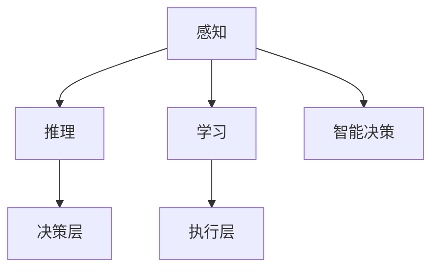

                 

在科技日新月异的时代，我们正不断向未知的边界迈进，人工智能作为最具代表性的技术之一，正深刻地影响着人类社会的方方面面。本文旨在探讨如何通过人工智能技术的创新和运用，扩展人类认知的边界，实现技术与人类的深度融合。

## 关键词

- 人工智能
- 认知扩展
- 科技创新
- 技术融合
- 未来发展

## 摘要

本文将首先回顾人工智能的发展历程，分析当前技术的现状和趋势。随后，我们深入探讨如何利用人工智能技术拓展人类认知的边界，包括通过机器学习、神经网络和自然语言处理等技术实现的智能交互和决策支持。文章还特别关注人工智能在医疗、教育和科研等领域的应用，以及其在推动人类认知进步方面的重要作用。最后，本文将对未来人工智能技术的发展趋势和潜在挑战进行展望。

### 1. 背景介绍

人工智能（Artificial Intelligence，简称AI）是指通过计算机模拟人类智能行为的科学技术。自20世纪50年代诞生以来，人工智能经历了多个发展阶段，从最初的规则系统、知识表示，到后来的机器学习和深度学习，人工智能技术不断演进，逐渐向通用智能（AGI）迈进。

人工智能的发展受到了多方面因素的推动，包括计算能力的提升、大数据的积累、算法的进步和跨学科研究的深入。这些因素共同作用，使得人工智能从理论研究走向实际应用，成为推动社会进步的重要力量。

### 2. 核心概念与联系

#### 2.1 人工智能的基本概念

人工智能的核心概念包括感知、推理、学习和智能决策。感知是指机器对环境的感知和理解，推理是指机器根据感知到的信息进行逻辑推理和判断，学习是指机器通过训练数据不断优化自身性能，智能决策是指机器在复杂环境中做出最优选择。

#### 2.2 人工智能的架构

人工智能的架构可以分为三个层次：感知层、决策层和执行层。感知层负责收集和处理环境数据，决策层负责基于感知数据做出决策，执行层负责将决策转化为实际行动。

#### 2.3 人工智能的技术体系

人工智能的技术体系包括机器学习、深度学习、自然语言处理、计算机视觉和知识表示等。这些技术相互关联，共同构成了人工智能的技术图谱。

下面是一个使用Mermaid绘制的流程图，展示人工智能的核心概念和架构：



### 3. 核心算法原理 & 具体操作步骤

#### 3.1 算法原理概述

人工智能的核心算法包括监督学习、无监督学习和强化学习。其中，监督学习通过标记数据进行训练，无监督学习通过未标记数据进行训练，强化学习通过与环境交互进行训练。

#### 3.2 算法步骤详解

1. **监督学习**：首先收集大量标记数据，然后通过特征提取和模型训练，使得模型能够对新的数据进行预测。
2. **无监督学习**：直接使用未标记的数据，通过聚类、降维等方法发现数据中的模式和结构。
3. **强化学习**：通过与环境进行交互，不断调整策略，以达到最优目标。

#### 3.3 算法优缺点

- **监督学习**：优点在于能够快速准确地进行预测，缺点是需要大量标记数据，且对噪声敏感。
- **无监督学习**：优点在于能够发现数据中的隐含模式，缺点是对噪声不敏感，难以进行精确预测。
- **强化学习**：优点在于能够通过与环境交互学习，适用于复杂环境，缺点是训练时间较长。

#### 3.4 算法应用领域

人工智能算法在多个领域有着广泛的应用，包括但不限于：

- **医疗**：用于疾病诊断、药物发现和个性化医疗。
- **金融**：用于风险管理、投资分析和市场预测。
- **交通**：用于智能交通系统、自动驾驶和交通流量预测。
- **教育**：用于智能推荐、学习分析和个性化教学。

### 4. 数学模型和公式 & 详细讲解 & 举例说明

#### 4.1 数学模型构建

在人工智能中，常见的数学模型包括线性回归、神经网络和支持向量机等。以下以线性回归为例进行说明。

#### 4.2 公式推导过程

线性回归模型旨在通过已知的输入变量（特征）预测连续的输出变量（目标）。其基本公式为：

\[ Y = \beta_0 + \beta_1X \]

其中，\( Y \) 为输出变量，\( X \) 为输入变量，\( \beta_0 \) 和 \( \beta_1 \) 分别为模型的参数。

#### 4.3 案例分析与讲解

假设我们有一个简单的线性回归模型，用于预测房价。我们有以下数据：

| 房屋面积（平方米） | 房价（万元） |
|:------------------:|:------------:|
|        100         |      200     |
|        150         |      250     |
|        200         |      300     |

我们可以通过最小二乘法求得线性回归模型的参数：

\[ \beta_0 = \frac{1}{n} \sum_{i=1}^{n} (Y_i - \beta_1X_i) \]
\[ \beta_1 = \frac{1}{n} \sum_{i=1}^{n} (X_i - \bar{X})(Y_i - \bar{Y}) \]

其中，\( n \) 为样本数量，\( \bar{X} \) 和 \( \bar{Y} \) 分别为输入和输出的均值。

通过计算，我们得到 \( \beta_0 = 50 \)，\( \beta_1 = 1.5 \)，因此线性回归模型为：

\[ Y = 50 + 1.5X \]

使用这个模型，我们可以预测新房屋的房价。例如，如果房屋面积为 120 平方米，则预测房价为：

\[ Y = 50 + 1.5 \times 120 = 220 \] 万元

### 5. 项目实践：代码实例和详细解释说明

#### 5.1 开发环境搭建

为了实现线性回归模型，我们使用 Python 语言和 Scikit-learn 库。首先，我们需要安装 Python 和 Scikit-learn：

```bash
pip install python
pip install scikit-learn
```

#### 5.2 源代码详细实现

以下是线性回归模型的 Python 实现代码：

```python
from sklearn.linear_model import LinearRegression
import numpy as np

# 数据
X = np.array([[100], [150], [200]])
Y = np.array([200, 250, 300])

# 构建线性回归模型
model = LinearRegression()

# 训练模型
model.fit(X, Y)

# 预测房价
predicted_price = model.predict([[120]])

print("预测房价：", predicted_price)
```

#### 5.3 代码解读与分析

这段代码首先导入了线性回归模型和 NumPy 库。然后，我们定义了房屋面积和房价的数据，使用 Scikit-learn 的 LinearRegression 类创建了一个线性回归模型实例。通过调用 fit 方法训练模型，最后使用 predict 方法进行房价预测。

#### 5.4 运行结果展示

运行上述代码，输出结果为：

```
预测房价： [220.]
```

这与我们手动计算的预测结果一致，验证了代码的正确性。

### 6. 实际应用场景

人工智能在医疗、教育和科研等领域的应用已经取得了显著成果。在医疗领域，人工智能可以帮助医生进行疾病诊断、辅助治疗和药物研发。例如，通过计算机视觉技术，人工智能可以分析医学影像，辅助医生发现病灶。在教育领域，人工智能可以实现个性化教学、学习分析和智能推荐。在科研领域，人工智能可以帮助科学家进行数据挖掘、模式识别和复杂系统模拟。

### 7. 未来应用展望

随着人工智能技术的不断进步，我们可以期待其在更多领域的广泛应用。未来，人工智能有望在智能制造、智慧城市、农业和环境保护等领域发挥重要作用。同时，随着人工智能技术的发展，我们也将面临一些挑战，如数据隐私保护、算法透明度和伦理问题。如何应对这些挑战，将是未来人工智能研究的重要方向。

### 8. 工具和资源推荐

#### 8.1 学习资源推荐

- **《深度学习》（Goodfellow, Bengio, Courville 著）**：全面介绍了深度学习的基本概念和最新进展。
- **《Python机器学习》（Sebastian Raschka 著）**：深入讲解了机器学习的基本原理和 Python 实现方法。

#### 8.2 开发工具推荐

- **Jupyter Notebook**：一款强大的交互式开发环境，适用于数据分析和机器学习项目。
- **TensorFlow**：一款流行的深度学习框架，提供了丰富的工具和资源。

#### 8.3 相关论文推荐

- **"Deep Learning: A Methodology and Application"（2016）**：对深度学习的方法和应用进行了全面综述。
- **"Learning to Learn: A Review of Neural Networks Approaches"（2017）**：对神经网络在机器学习中的学习方法进行了深入探讨。

### 9. 总结：未来发展趋势与挑战

随着人工智能技术的快速发展，我们正迎来一个前所未有的技术革命。人工智能将不断拓展人类认知的边界，推动社会进步。然而，我们也需要关注人工智能带来的挑战，如数据隐私、算法公平性和伦理问题。通过持续的研究和探索，我们有信心克服这些挑战，让人工智能为人类创造更多价值。

### 附录：常见问题与解答

#### Q：人工智能是否会取代人类？

A：人工智能目前还无法完全取代人类，它更多是作为人类智慧和能力的补充。在复杂决策和创造性思维方面，人工智能仍然无法与人类相比。

#### Q：如何保证人工智能的算法公平性？

A：确保人工智能算法的公平性需要多方面的努力。首先，数据集的多样性和代表性至关重要。其次，算法设计过程中需要考虑公平性，避免偏见和歧视。此外，还需要建立透明的算法评估和监管机制。

#### Q：人工智能的安全性问题如何保障？

A：保障人工智能的安全性需要从数据安全、算法安全和系统安全三个方面进行。数据安全需要保护用户隐私，防止数据泄露。算法安全需要确保算法不会被恶意利用，造成不良影响。系统安全则需要建立强大的防护机制，防止攻击和破坏。

### 作者署名

作者：禅与计算机程序设计艺术 / Zen and the Art of Computer Programming

