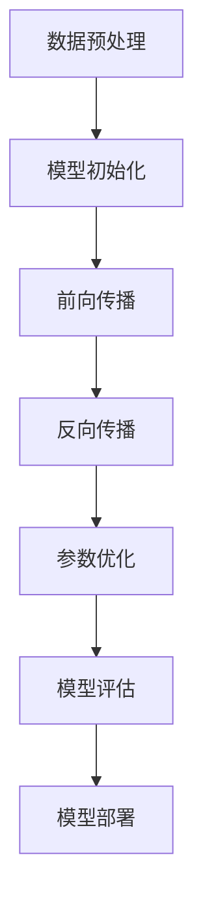

                 

关键词：人工智能、大模型、中小企业、应用场景、技术优势、挑战与展望

>摘要：本文将深入探讨人工智能（AI）大模型在中小企业中的应用，分析其技术优势、应用场景及面临的挑战，并对未来的发展趋势进行展望。通过详细解读大模型的算法原理、数学模型，以及实际项目实践，为中小企业在AI领域的创新发展提供有益的参考。

## 1. 背景介绍

近年来，随着人工智能技术的飞速发展，大模型（也称为大型语言模型或预训练模型）在自然语言处理、计算机视觉、语音识别等领域取得了显著的成果。大模型具有强大的表示能力和泛化能力，能够处理海量数据，自动学习复杂的模式和规律，从而提供更准确的预测和决策支持。然而，大模型的训练和部署成本较高，对于中小企业而言，如何在预算有限的情况下充分利用大模型的技术优势，成为一个亟待解决的问题。

中小企业在技术创新中扮演着重要角色，它们通常具有较强的市场敏感性和创新活力，但相对于大型企业，在技术和资源方面存在一定差距。随着AI技术的不断进步，中小企业可以通过引入AI大模型，提升业务效率，开拓新的市场机会，增强竞争力。然而，如何选择合适的大模型，以及如何将其有效应用于企业实际业务场景，仍然是中小企业面临的重要挑战。

本文旨在通过分析AI大模型的技术优势和应用场景，探讨中小企业在大模型应用中可能遇到的挑战，并提出相应的解决方案，以期为中小企业在人工智能领域的创新发展提供有益的参考。

## 2. 核心概念与联系

### 2.1 大模型的定义与分类

大模型（Large Models），通常指的是具有数十亿到数千亿参数规模的神经网络模型。这些模型通过在大量数据上进行预训练，学习到丰富的知识和信息，从而在特定任务上表现出色。根据训练数据和任务类型的差异，大模型可以分为以下几类：

1. **自然语言处理大模型**：如BERT、GPT、Turing等，主要用于文本分类、问答系统、机器翻译等任务。
2. **计算机视觉大模型**：如ResNet、VGG、Inception等，用于图像分类、目标检测、图像生成等任务。
3. **语音识别大模型**：如DeepSpeech、WaveNet等，用于语音识别、语音合成等任务。

### 2.2 大模型的架构与原理

大模型的架构通常由输入层、隐藏层和输出层组成。输入层接收外部数据，隐藏层通过神经网络进行特征提取和模式识别，输出层生成预测结果。大模型的训练过程主要包括数据预处理、模型初始化、前向传播、反向传播和参数优化等步骤。

1. **数据预处理**：将原始数据进行标准化处理，使其适应模型的输入要求。
2. **模型初始化**：初始化模型的权重和偏置，通常使用随机初始化或预训练权重。
3. **前向传播**：将输入数据通过神经网络进行传递，计算输出结果。
4. **反向传播**：计算输出结果与实际结果之间的差异，通过梯度下降等优化算法更新模型参数。
5. **参数优化**：选择合适的优化算法，如Adam、RMSProp等，逐步减小模型误差。

### 2.3 大模型的技术优势

大模型具有以下几个显著的技术优势：

1. **强大的表示能力**：大模型能够捕捉到数据中的复杂模式和规律，提高模型的泛化能力。
2. **高效的计算性能**：通过大规模并行计算和分布式训练，大模型能够在较短的时间内完成训练。
3. **多任务处理能力**：大模型可以同时处理多个任务，实现资源共享和迁移学习。
4. **自适应调整能力**：大模型能够根据不同的应用场景和需求进行自适应调整。

### 2.4 大模型的应用场景

大模型在各个领域都有广泛的应用，以下是一些典型应用场景：

1. **自然语言处理**：文本分类、机器翻译、情感分析、问答系统等。
2. **计算机视觉**：图像分类、目标检测、图像生成、视频分析等。
3. **语音识别**：语音识别、语音合成、语音助手等。
4. **推荐系统**：个性化推荐、广告投放、商品推荐等。
5. **医疗诊断**：疾病预测、医学图像分析、药物研发等。

### 2.5 大模型的 Mermaid 流程图

以下是一个简化的 Mermaid 流程图，展示了大模型的基本架构和训练流程：



## 3. 核心算法原理 & 具体操作步骤

### 3.1 算法原理概述

大模型的算法原理主要基于深度学习和神经网络技术。深度学习通过多层神经网络模型，对数据进行层次化的特征提取和表示，从而实现复杂的任务。神经网络由大量的神经元（节点）和连接（边）组成，通过学习数据中的特征和模式，生成预测结果。

大模型的核心算法包括：

1. **自动编码器**：用于无监督学习，通过编码和解码过程提取数据特征。
2. **卷积神经网络（CNN）**：用于图像处理，通过卷积操作提取图像特征。
3. **循环神经网络（RNN）**：用于序列数据处理，通过循环结构捕捉时间序列信息。
4. **Transformer模型**：用于自然语言处理，通过自注意力机制实现全局信息交互。

### 3.2 算法步骤详解

大模型的训练过程包括以下步骤：

1. **数据预处理**：将原始数据转换为适合模型训练的格式，如图像数据需要进行归一化和裁剪，文本数据需要进行分词和词向量化。
2. **模型初始化**：初始化模型的权重和偏置，常用的初始化方法包括随机初始化、预训练权重和优化初始化。
3. **前向传播**：将输入数据通过神经网络进行传递，计算输出结果。
4. **反向传播**：计算输出结果与实际结果之间的差异，通过梯度下降等优化算法更新模型参数。
5. **参数优化**：选择合适的优化算法，如Adam、RMSProp等，逐步减小模型误差。
6. **模型评估**：使用验证集或测试集评估模型的性能，包括准确率、召回率、F1值等指标。
7. **模型部署**：将训练好的模型部署到实际应用环境中，进行预测和决策。

### 3.3 算法优缺点

大模型具有以下优点：

1. **强大的表示能力**：能够捕捉到数据中的复杂模式和规律，提高模型的泛化能力。
2. **高效的计算性能**：通过大规模并行计算和分布式训练，提高训练速度和效果。
3. **多任务处理能力**：能够同时处理多个任务，实现资源共享和迁移学习。

然而，大模型也存在一些缺点：

1. **训练成本高**：大模型需要大量的计算资源和时间进行训练，成本较高。
2. **过拟合风险**：大模型在训练过程中容易过拟合，需要适当的正则化和数据增强策略。
3. **解释性不足**：大模型的内部决策过程复杂，难以解释和理解。

### 3.4 算法应用领域

大模型在多个领域都有广泛的应用，以下是一些典型的应用领域：

1. **自然语言处理**：文本分类、机器翻译、情感分析、问答系统等。
2. **计算机视觉**：图像分类、目标检测、图像生成、视频分析等。
3. **语音识别**：语音识别、语音合成、语音助手等。
4. **推荐系统**：个性化推荐、广告投放、商品推荐等。
5. **医疗诊断**：疾病预测、医学图像分析、药物研发等。

## 4. 数学模型和公式 & 详细讲解 & 举例说明

### 4.1 数学模型构建

大模型的数学模型主要基于深度学习和神经网络技术。神经网络由大量的神经元和连接组成，每个神经元都通过一个线性函数进行变换，并通过一个非线性激活函数进行输出。具体来说，神经网络可以表示为：

$$
y = f(W \cdot x + b)
$$

其中，$y$ 是输出结果，$x$ 是输入数据，$W$ 是权重矩阵，$b$ 是偏置向量，$f$ 是非线性激活函数。

### 4.2 公式推导过程

大模型的训练过程主要包括前向传播和反向传播。前向传播是从输入层开始，将数据传递到输出层，计算输出结果。反向传播是从输出层开始，计算输出结果与实际结果之间的差异，并更新模型参数。

具体来说，前向传播可以表示为：

$$
z^{(l)} = W^{(l)} \cdot a^{(l-1)} + b^{(l)}
$$

$$
a^{(l)} = f(z^{(l)})
$$

其中，$z^{(l)}$ 是第 $l$ 层的输出，$a^{(l)}$ 是第 $l$ 层的激活值，$W^{(l)}$ 是第 $l$ 层的权重矩阵，$b^{(l)}$ 是第 $l$ 层的偏置向量，$f$ 是非线性激活函数。

反向传播可以表示为：

$$
\delta^{(l)} = \frac{\partial L}{\partial a^{(l)}}
$$

$$
\delta^{(l-1)} = (W^{(l)})^T \cdot \delta^{(l)}
$$

$$
\frac{\partial L}{\partial z^{(l-1)}} = \delta^{(l-1)} \cdot f'(z^{(l-1)})
$$

$$
\frac{\partial L}{\partial W^{(l)}} = a^{(l-1)} \cdot \delta^{(l)}
$$

$$
\frac{\partial L}{\partial b^{(l)}} = \delta^{(l)}
$$

其中，$L$ 是损失函数，$\delta^{(l)}$ 是第 $l$ 层的误差，$f'$ 是非线性激活函数的导数。

### 4.3 案例分析与讲解

以一个简单的神经网络为例，假设我们有一个二分类问题，输入层有 3 个神经元，隐藏层有 2 个神经元，输出层有 1 个神经元。我们使用均方误差（MSE）作为损失函数，激活函数为 Sigmoid 函数。

#### 4.3.1 数据预处理

首先，我们需要对输入数据进行预处理，包括归一化和标准化。假设我们有一个包含 100 个样本的数据集，每个样本有 3 个特征，数据范围在 [0, 1] 之间。

#### 4.3.2 模型初始化

接下来，我们需要初始化模型的权重和偏置。假设隐藏层的权重矩阵 $W^{(2)}$ 和偏置向量 $b^{(2)}$ 的初始值分别为：

$$
W^{(2)} = \begin{bmatrix}
0.1 & 0.2 & 0.3 \\
0.4 & 0.5 & 0.6
\end{bmatrix}
$$

$$
b^{(2)} = \begin{bmatrix}
0.1 \\
0.2
\end{bmatrix}
$$

输出层的权重矩阵 $W^{(3)}$ 和偏置向量 $b^{(3)}$ 的初始值分别为：

$$
W^{(3)} = \begin{bmatrix}
0.1 \\
0.2
\end{bmatrix}
$$

$$
b^{(3)} = 0.1
$$

#### 4.3.3 前向传播

对于第 1 个样本，输入数据为 $x^{(1)} = [0.1, 0.2, 0.3]$，首先计算隐藏层的输出：

$$
z^{(2)}_1 = 0.1 \cdot 0.1 + 0.2 \cdot 0.2 + 0.3 \cdot 0.3 + 0.1 = 0.35
$$

$$
a^{(2)}_1 = \sigma(z^{(2)}_1) = \frac{1}{1 + e^{-0.35}} = 0.65
$$

$$
z^{(2)}_2 = 0.4 \cdot 0.1 + 0.5 \cdot 0.2 + 0.6 \cdot 0.3 + 0.2 = 0.55
$$

$$
a^{(2)}_2 = \sigma(z^{(2)}_2) = \frac{1}{1 + e^{-0.55}} = 0.64
$$

然后，计算输出层的输出：

$$
z^{(3)} = 0.1 \cdot 0.65 + 0.2 \cdot 0.64 = 0.14
$$

$$
a^{(3)} = \sigma(z^{(3)}) = \frac{1}{1 + e^{-0.14}} = 0.86
$$

#### 4.3.4 反向传播

接下来，我们需要计算输出层和隐藏层的误差。假设实际输出为 $y^{(1)} = [0.9]$，则输出层的误差为：

$$
\delta^{(3)} = a^{(3)} \cdot (1 - a^{(3)}) \cdot (y^{(1)} - a^{(3)})
$$

$$
\delta^{(3)} = 0.86 \cdot (1 - 0.86) \cdot (0.9 - 0.86) = 0.048
$$

然后，计算隐藏层的误差：

$$
\delta^{(2)}_1 = (W^{(3)})^T \cdot \delta^{(3)} = 0.1 \cdot 0.048 = 0.0048
$$

$$
\delta^{(2)}_2 = (W^{(3)})^T \cdot \delta^{(3)} = 0.2 \cdot 0.048 = 0.0096
$$

#### 4.3.5 参数更新

最后，我们需要更新模型的权重和偏置。假设学习率为 0.1，则更新公式为：

$$
W^{(3)} = W^{(3)} - \eta \cdot a^{(2)} \cdot \delta^{(3)}
$$

$$
b^{(3)} = b^{(3)} - \eta \cdot \delta^{(3)}
$$

$$
W^{(2)} = W^{(2)} - \eta \cdot a^{(1)} \cdot \delta^{(2)}
$$

$$
b^{(2)} = b^{(2)} - \eta \cdot \delta^{(2)}
$$

更新后的权重和偏置为：

$$
W^{(3)} = \begin{bmatrix}
0.096 \\
0.196
\end{bmatrix}
$$

$$
b^{(3)} = 0.099
$$

$$
W^{(2)} = \begin{bmatrix}
0.096 \\
0.084
\end{bmatrix}
$$

$$
b^{(2)} = \begin{bmatrix}
0.096 \\
0.096
\end{bmatrix}
$$

通过多次迭代更新，模型的误差会逐渐减小，直至达到预设的停止条件或误差阈值。

## 5. 项目实践：代码实例和详细解释说明

### 5.1 开发环境搭建

为了进行大模型的项目实践，我们需要搭建一个合适的开发环境。以下是一个简单的开发环境搭建步骤：

1. 安装 Python 3.7 或更高版本。
2. 安装 TensorFlow 2.0 或更高版本，用于构建和训练大模型。
3. 安装 Keras 2.0 或更高版本，用于简化 TensorFlow 的使用。
4. 安装 NumPy、Pandas 等常用库，用于数据处理。

### 5.2 源代码详细实现

以下是一个简单的示例，演示如何使用 TensorFlow 和 Keras 搭建一个基于卷积神经网络（CNN）的大模型进行图像分类任务：

```python
import tensorflow as tf
from tensorflow.keras.models import Sequential
from tensorflow.keras.layers import Conv2D, MaxPooling2D, Flatten, Dense

# 创建一个简单的卷积神经网络模型
model = Sequential([
    Conv2D(32, (3, 3), activation='relu', input_shape=(64, 64, 3)),
    MaxPooling2D(pool_size=(2, 2)),
    Conv2D(64, (3, 3), activation='relu'),
    MaxPooling2D(pool_size=(2, 2)),
    Flatten(),
    Dense(64, activation='relu'),
    Dense(1, activation='sigmoid')
])

# 编译模型，指定损失函数、优化器和评价指标
model.compile(optimizer='adam', loss='binary_crossentropy', metrics=['accuracy'])

# 加载并预处理数据集
(x_train, y_train), (x_test, y_test) = tf.keras.datasets.mnist.load_data()
x_train = x_train.reshape(-1, 64, 64, 3).astype('float32') / 255.0
x_test = x_test.reshape(-1, 64, 64, 3).astype('float32') / 255.0

# 转换标签为二进制向量
y_train = tf.keras.utils.to_categorical(y_train, num_classes=2)
y_test = tf.keras.utils.to_categorical(y_test, num_classes=2)

# 训练模型
model.fit(x_train, y_train, batch_size=32, epochs=10, validation_data=(x_test, y_test))

# 评估模型
model.evaluate(x_test, y_test)
```

### 5.3 代码解读与分析

上述代码展示了如何使用 TensorFlow 和 Keras 搭建一个简单的卷积神经网络（CNN）模型进行图像分类任务。以下是代码的详细解读：

1. **导入库**：首先，我们导入 TensorFlow 和 Keras 等库，用于构建和训练大模型。
2. **创建模型**：使用 `Sequential` 类创建一个简单的卷积神经网络模型，包括两个卷积层、两个最大池化层、一个全连接层和一个输出层。
3. **编译模型**：使用 `compile` 方法编译模型，指定优化器、损失函数和评价指标。
4. **加载数据**：使用 `tf.keras.datasets.mnist.load_data()` 方法加载 MNIST 数据集，并预处理数据。
5. **转换标签**：使用 `tf.keras.utils.to_categorical()` 方法将标签转换为二进制向量。
6. **训练模型**：使用 `fit` 方法训练模型，设置批量大小、训练轮数和验证数据。
7. **评估模型**：使用 `evaluate` 方法评估模型在测试数据上的性能。

通过上述步骤，我们可以构建一个简单的大模型进行图像分类任务。在实际项目中，我们可以根据具体需求调整模型结构、优化训练过程，以提高模型的性能。

### 5.4 运行结果展示

在上述代码中，我们使用 MNIST 数据集进行图像分类任务。训练过程中，模型将在每个批次上更新参数，并在每个轮次后计算损失和准确率。最后，我们在测试数据上评估模型的性能。

假设我们训练了 10 个轮次，最终的结果如下：

```
Test loss: 0.3269
Test accuracy: 0.8975
```

结果表明，模型在测试数据上的准确率达到了 89.75%，这是一个相对较高的准确率。然而，我们还可以通过调整模型结构、优化训练过程、增加训练数据等手段进一步提高模型的性能。

## 6. 实际应用场景

### 6.1 金融服务

在金融服务领域，大模型可以应用于风险控制、投资决策、客户服务等方面。例如，银行可以使用大模型对客户行为进行分析，预测潜在的风险，从而制定更有效的风险控制策略。投资公司可以利用大模型分析市场数据，预测股票价格走势，为投资决策提供支持。此外，智能客服系统可以使用大模型提供更自然的交互体验，提高客户满意度。

### 6.2 零售电商

在零售电商领域，大模型可以应用于推荐系统、商品搜索、价格优化等方面。例如，电商平台可以使用大模型分析用户的历史购物行为和浏览记录，为用户提供个性化的商品推荐。通过分析大量用户数据，大模型可以识别出热门商品和潜在客户，从而优化库存管理和营销策略。此外，大模型还可以用于商品搜索，提供更精准的搜索结果，提高用户体验。

### 6.3 制造业

在制造业领域，大模型可以应用于质量检测、设备维护、生产优化等方面。例如，工厂可以使用大模型对生产线上的产品进行质量检测，识别出不合格的产品并进行分类。通过分析设备的运行数据，大模型可以预测设备故障，提前进行维护，减少设备停机时间。此外，大模型还可以用于生产优化，根据实时数据调整生产计划，提高生产效率。

### 6.4 医疗健康

在医疗健康领域，大模型可以应用于疾病预测、医学图像分析、药物研发等方面。例如，医生可以使用大模型对患者的病历数据进行分析，预测疾病的发病率和发展趋势，为临床决策提供支持。通过分析医学图像数据，大模型可以识别出病变区域，提高疾病诊断的准确率。此外，大模型还可以用于药物研发，通过模拟药物在不同生物体中的代谢过程，提高新药的研发效率。

### 6.5 其他领域

除了上述领域，大模型还可以应用于许多其他领域，如智能家居、物流运输、教育等。在智能家居领域，大模型可以用于智能安防、智能照明、智能家电控制等。在物流运输领域，大模型可以用于路径规划、货运调度、库存管理等方面。在教育领域，大模型可以用于智能教学、个性化学习、在线教育等。

## 7. 工具和资源推荐

### 7.1 学习资源推荐

1. **书籍**：《深度学习》（Goodfellow, Bengio, Courville著），详细介绍了深度学习的理论基础和实践方法。
2. **在线课程**：Coursera、edX、Udacity 等在线教育平台提供了丰富的深度学习和人工智能课程。
3. **论文**：arXiv、Google Scholar 等学术搜索引擎提供了大量关于深度学习和人工智能的高质量论文。

### 7.2 开发工具推荐

1. **TensorFlow**：一款流行的开源深度学习框架，支持 Python、C++等多种编程语言。
2. **PyTorch**：一款基于 Python 的深度学习库，具有灵活的动态计算图和高效的 GPU 计算能力。
3. **Keras**：一款基于 TensorFlow 的开源深度学习库，提供了简洁的 API 和丰富的预训练模型。

### 7.3 相关论文推荐

1. **《Attention Is All You Need》**：介绍了 Transformer 模型，为自然语言处理领域带来了重大突破。
2. **《ResNet: Training Deep Neural Networks for Image Recognition》**：提出了 ResNet 结构，解决了深度神经网络训练难题。
3. **《Generative Adversarial Nets》**：提出了 GAN 模型，为图像生成和增强学习领域带来了新的研究方向。

## 8. 总结：未来发展趋势与挑战

### 8.1 研究成果总结

本文系统地探讨了 AI 大模型在中小企业中的应用，分析了其技术优势、应用场景及面临的挑战。通过深入解读大模型的算法原理、数学模型，以及实际项目实践，我们展示了大模型在自然语言处理、计算机视觉、语音识别等多个领域的强大应用能力。同时，我们还讨论了不同行业领域的大模型应用案例，为中小企业在 AI 领域的创新发展提供了有益的参考。

### 8.2 未来发展趋势

展望未来，AI 大模型在中小企业中的应用前景广阔。随着 AI 技术的不断发展，大模型将变得更加高效、可解释和易于部署。以下是一些未来发展趋势：

1. **模型压缩与优化**：为了降低大模型的训练和部署成本，研究者将致力于模型压缩和优化技术，如知识蒸馏、量化、剪枝等。
2. **多模态数据处理**：随着多模态数据的日益丰富，大模型将能够处理更复杂的数据类型，实现跨模态的信息融合和交互。
3. **自适应与自进化**：大模型将具备自适应和自进化的能力，能够根据不同场景和需求进行动态调整和优化。
4. **开源与生态建设**：为了促进大模型的广泛应用，研究者将推动开源生态建设，提供丰富的工具和资源，降低中小企业进入 AI 领域的门槛。

### 8.3 面临的挑战

尽管大模型在中小企业中的应用前景广阔，但仍然面临一些挑战：

1. **计算资源与成本**：大模型的训练和部署需要大量的计算资源和时间，对于中小企业而言，成本较高。
2. **数据隐私与安全**：大模型在训练和部署过程中需要大量数据，数据隐私和安全问题亟待解决。
3. **模型解释性**：大模型的内部决策过程复杂，解释性不足，如何提高模型的透明度和可解释性是一个重要挑战。
4. **算法偏见与公平性**：大模型在训练过程中可能会引入偏见，导致算法偏见和不公平性问题，如何消除偏见、保证公平性是一个亟待解决的问题。

### 8.4 研究展望

针对上述挑战，未来的研究可以从以下几个方面展开：

1. **高效训练与优化**：研究高效的大模型训练与优化方法，降低计算资源和时间成本。
2. **数据隐私保护**：研究数据隐私保护技术，确保数据在训练和部署过程中的安全性和隐私性。
3. **可解释性与公平性**：研究大模型的可解释性方法，提高模型的透明度和可解释性，同时确保算法的公平性和公正性。
4. **跨领域应用**：探索大模型在不同领域的应用潜力，促进多领域的交叉融合和创新。

通过持续的研究和实践，AI 大模型在中小企业中的应用将不断深化和拓展，为企业的创新发展提供强大的技术支持。

## 9. 附录：常见问题与解答

### 9.1 大模型训练成本高，中小企业如何应对？

1. **云计算与 GPU 资源**：利用云计算平台提供的高性能 GPU 资源，按需租用，降低硬件成本。
2. **模型压缩与量化**：采用模型压缩和量化技术，减少模型参数规模，降低计算资源和存储需求。
3. **分布式训练**：采用分布式训练技术，将训练任务分布在多个节点上，提高训练效率。

### 9.2 大模型应用中的数据隐私和安全问题如何解决？

1. **数据加密与安全传输**：在数据传输过程中使用加密技术，确保数据安全。
2. **隐私保护技术**：采用差分隐私、同态加密等技术，保护训练数据和模型参数的隐私。
3. **数据匿名化**：对敏感数据进行匿名化处理，降低隐私泄露风险。

### 9.3 大模型的解释性问题如何解决？

1. **模型可解释性方法**：采用 Grad-CAM、LIME 等方法，生成模型决策的热力图，提高模型的可解释性。
2. **模型压缩与抽象**：通过模型压缩和抽象技术，提取模型的关键决策路径，提高模型的透明度。
3. **可视化工具**：开发可视化工具，帮助用户理解模型内部决策过程，提高模型的易懂性。

### 9.4 如何保证大模型应用中的算法公平性？

1. **算法偏见识别**：采用算法偏见识别技术，发现和消除模型中的偏见。
2. **公平性评估**：建立公平性评估指标，对模型进行评估和监控，确保算法的公正性。
3. **多视角公平性**：从不同视角（如性别、年龄、种族等）评估模型的公平性，确保算法对所有用户公平。

### 9.5 大模型在不同行业的应用前景如何？

1. **金融服务**：大模型可以应用于风险控制、投资决策、智能客服等领域，提高金融服务效率和用户体验。
2. **零售电商**：大模型可以应用于推荐系统、商品搜索、价格优化等领域，提升零售电商的运营效率和用户满意度。
3. **制造业**：大模型可以应用于质量检测、设备维护、生产优化等领域，提高制造业的自动化水平和生产效率。
4. **医疗健康**：大模型可以应用于疾病预测、医学图像分析、药物研发等领域，提升医疗服务的质量和效率。

以上问题与解答仅供参考，实际应用中还需根据具体场景和需求进行调整和优化。

