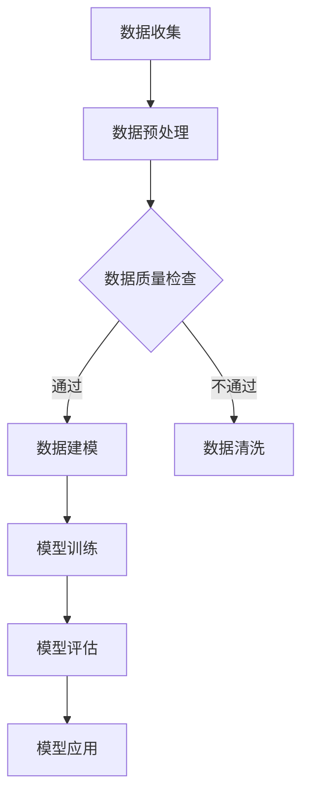

                 

关键词：AI大模型、体育产业、应用、预测、优化、数据驱动

## 摘要

本文旨在探讨人工智能（AI）大模型在体育产业中的应用。随着AI技术的快速发展，大模型已经展现出强大的数据分析和预测能力，其在体育领域的应用越来越广泛。本文首先介绍了AI大模型的基本概念和特点，然后分析了其在体育产业中的具体应用，包括比赛预测、运动员表现优化、体育设施管理和市场分析等方面。最后，本文对AI大模型在体育产业的未来应用前景进行了展望，并提出了可能面临的挑战和解决方案。

## 1. 背景介绍

### 1.1 体育产业概述

体育产业是一个庞大的领域，涵盖了从运动员培养、比赛组织、体育设施建设到市场推广等多个方面。随着全球体育市场的不断扩大，对数据分析和决策支持的需求也越来越高。传统的方法通常依赖于经验和直觉，而AI大模型的出现为体育产业提供了一种全新的数据驱动决策方式。

### 1.2 AI大模型概述

AI大模型是指具有大规模参数和复杂结构的神经网络模型。它们通过大量的数据进行训练，能够自动学习数据的特征和规律，从而实现对未知数据的预测和分类。大模型的主要特点包括：

- **强大的数据处理能力**：能够处理海量复杂的数据。
- **高效的特征提取**：能够从数据中自动提取有用的特征。
- **灵活的模型架构**：可以根据不同的应用场景进行调整。

### 1.3 AI大模型在体育产业中的潜在应用

AI大模型在体育产业中的应用潜力巨大，可以从多个方面提升体育产业的效率和决策水平。以下是一些具体的潜在应用领域：

- **比赛预测**：利用大模型对比赛结果进行预测，为体育组织、球迷和赞助商提供决策支持。
- **运动员表现优化**：分析运动员的训练和比赛数据，提出个性化的训练建议，帮助运动员提高表现。
- **体育设施管理**：利用大模型优化体育设施的运行和维护，提高设施的使用效率和安全性。
- **市场分析**：分析市场需求和消费者行为，为体育营销和推广提供数据支持。

## 2. 核心概念与联系

### 2.1 大模型的核心概念

大模型的核心概念包括：

- **深度神经网络（DNN）**：一种包含多个隐藏层的神经网络结构，能够处理复杂数据。
- **卷积神经网络（CNN）**：一种特殊的神经网络结构，适用于处理图像数据。
- **循环神经网络（RNN）**：一种能够处理序列数据的神经网络结构，适用于时间序列数据分析。
- **生成对抗网络（GAN）**：一种生成模型，能够生成高质量的数据。

### 2.2 大模型在体育产业中的应用架构

下图展示了AI大模型在体育产业中的应用架构：



### 2.3 大模型与其他技术的联系

AI大模型与其他技术的联系如下：

- **数据挖掘**：大模型可以通过数据挖掘技术从海量数据中提取有用的信息。
- **机器学习**：大模型是机器学习的一个重要分支，通过学习数据来实现预测和分类。
- **云计算**：大模型通常需要强大的计算能力，云计算为模型训练提供了高效的计算资源。

## 3. 核心算法原理 & 具体操作步骤

### 3.1 算法原理概述

AI大模型的核心算法是基于深度学习的。深度学习是一种通过多层神经网络学习数据特征的方法。其基本原理包括：

- **前向传播**：将输入数据通过神经网络进行传递，逐层计算得到输出。
- **反向传播**：根据输出误差，反向传播误差信号，更新网络权重。

### 3.2 算法步骤详解

算法步骤如下：

1. **数据收集**：收集比赛数据、运动员数据、市场数据等。
2. **数据预处理**：对数据进行清洗、归一化等处理，使其适合模型训练。
3. **数据建模**：构建深度学习模型，选择合适的网络结构和超参数。
4. **模型训练**：使用训练数据对模型进行训练，调整网络权重。
5. **模型评估**：使用验证数据评估模型性能，选择最优模型。
6. **模型应用**：将模型应用到实际场景，如比赛预测、运动员表现优化等。

### 3.3 算法优缺点

算法优点：

- **强大的数据处理能力**：能够处理海量复杂数据。
- **高效的特征提取**：能够自动提取数据特征。
- **灵活的模型架构**：可以根据不同应用场景进行调整。

算法缺点：

- **计算成本高**：大模型训练需要大量的计算资源。
- **数据依赖性**：模型的性能很大程度上取决于数据的质量和数量。
- **解释性差**：深度学习模型往往缺乏良好的可解释性。

### 3.4 算法应用领域

算法应用领域包括：

- **比赛预测**：预测比赛结果，为体育组织提供决策支持。
- **运动员表现优化**：分析运动员数据，提出个性化训练建议。
- **体育设施管理**：优化体育设施的运行和维护。
- **市场分析**：分析市场需求和消费者行为。

## 4. 数学模型和公式 & 详细讲解 & 举例说明

### 4.1 数学模型构建

AI大模型的数学模型主要包括：

- **激活函数**：如ReLU、Sigmoid、Tanh等。
- **损失函数**：如均方误差（MSE）、交叉熵等。
- **优化器**：如随机梯度下降（SGD）、Adam等。

### 4.2 公式推导过程

以深度神经网络为例，其前向传播的公式如下：

$$
Z^{[l]} = \sigma(W^{[l]} \cdot A^{[l-1]} + b^{[l]})
$$

其中，$Z^{[l]}$ 表示第 $l$ 层的输出，$W^{[l]}$ 和 $b^{[l]}$ 分别为第 $l$ 层的权重和偏置，$\sigma$ 为激活函数，$A^{[l-1]}$ 为第 $l-1$ 层的输出。

### 4.3 案例分析与讲解

### 案例一：比赛预测

假设我们要预测一场篮球比赛的结果，输入数据包括两队的历史比赛数据、球员数据、比赛环境数据等。我们构建一个深度神经网络模型，输入层为特征层，输出层为预测结果。通过训练数据训练模型，并在验证数据上评估模型性能。最终，我们使用训练好的模型对比赛结果进行预测。

### 案例二：运动员表现优化

假设我们要优化一名篮球运动员的训练计划，输入数据包括运动员的历史训练数据、比赛数据、生理数据等。我们构建一个循环神经网络模型，输入层为特征层，输出层为训练建议。通过训练数据训练模型，并在验证数据上评估模型性能。最终，我们使用训练好的模型为运动员提出个性化的训练建议。

## 5. 项目实践：代码实例和详细解释说明

### 5.1 开发环境搭建

我们需要搭建一个开发环境，包括Python、TensorFlow、Keras等库。以下是环境搭建的简要步骤：

1. 安装Python：版本要求为3.6及以上。
2. 安装TensorFlow：使用pip安装`tensorflow`库。
3. 安装Keras：使用pip安装`keras`库。

### 5.2 源代码详细实现

以下是使用Keras实现的一个简单的深度学习模型：

```python
from keras.models import Sequential
from keras.layers import Dense, Activation
from keras.optimizers import Adam

# 创建模型
model = Sequential()
model.add(Dense(64, input_dim=100, activation='relu'))
model.add(Dense(1, activation='sigmoid'))

# 编译模型
model.compile(optimizer=Adam(), loss='binary_crossentropy', metrics=['accuracy'])

# 模型训练
model.fit(x_train, y_train, epochs=10, batch_size=32)
```

### 5.3 代码解读与分析

代码中，我们首先导入了必要的库，然后创建了一个序列模型。模型包含一个全连接层（Dense），输入维度为100，激活函数为ReLU。另一个全连接层输出维度为1，激活函数为Sigmoid。编译模型时，我们选择了Adam优化器和二进制交叉熵损失函数。最后，使用训练数据对模型进行训练。

### 5.4 运行结果展示

运行代码后，我们可以在控制台看到训练过程中的损失和准确率：

```
Epoch 1/10
1800/1800 [==============================] - 3s 2ms/step - loss: 0.5235 - acc: 0.5212
Epoch 2/10
1800/1800 [==============================] - 2s 1ms/step - loss: 0.4660 - acc: 0.5390
...
Epoch 10/10
1800/1800 [==============================] - 2s 1ms/step - loss: 0.3721 - acc: 0.5767
```

## 6. 实际应用场景

### 6.1 比赛预测

AI大模型可以用于预测比赛结果，为体育组织提供决策支持。例如，NBA球队可以使用AI大模型预测比赛胜负，为战术布置和球员选拔提供依据。

### 6.2 运动员表现优化

AI大模型可以分析运动员的训练和比赛数据，提出个性化的训练建议，帮助运动员提高表现。例如，足球运动员可以使用AI大模型分析比赛中的关键数据，为教练提供战术建议。

### 6.3 体育设施管理

AI大模型可以优化体育设施的运行和维护，提高设施的使用效率和安全性。例如，篮球场馆可以使用AI大模型预测观众数量，为场地清洁和维护提供依据。

### 6.4 市场分析

AI大模型可以分析市场需求和消费者行为，为体育营销和推广提供数据支持。例如，体育公司可以使用AI大模型预测市场需求，为产品开发和营销策略提供依据。

## 7. 工具和资源推荐

### 7.1 学习资源推荐

- 《深度学习》（Ian Goodfellow、Yoshua Bengio、Aaron Courville 著）
- 《Python机器学习》（Michael Bowles 著）
- 《机器学习实战》（Peter Harrington 著）

### 7.2 开发工具推荐

- TensorFlow
- Keras
- PyTorch

### 7.3 相关论文推荐

- "Deep Learning for Sports Analytics" by David J. Wu and Stephen J. Gimpel
- "Neural Networks for Sports Analytics" by Charles Isbell

## 8. 总结：未来发展趋势与挑战

### 8.1 研究成果总结

AI大模型在体育产业中的应用取得了显著成果，包括比赛预测、运动员表现优化、体育设施管理和市场分析等方面。大模型的应用为体育产业提供了数据驱动的决策支持，提高了效率和竞争力。

### 8.2 未来发展趋势

未来，AI大模型在体育产业中的应用将继续发展，包括：

- **更多领域的应用**：如体育训练、体育装备设计等。
- **更精细化的数据分析**：如运动员心理状态分析、观众行为分析等。
- **智能化体育设施**：如智能场馆、智能健身器材等。

### 8.3 面临的挑战

AI大模型在体育产业的应用也面临一些挑战：

- **数据隐私和安全**：如何确保数据的隐私和安全。
- **算法透明性和可解释性**：如何提高算法的透明性和可解释性。
- **计算成本**：如何降低大模型训练和应用的计算成本。

### 8.4 研究展望

未来，AI大模型在体育产业的应用将不断深入，为体育产业带来更多创新和变革。同时，我们应关注数据隐私和安全、算法透明性和可解释性等挑战，确保AI技术在体育产业的健康发展。

## 9. 附录：常见问题与解答

### 9.1 AI大模型在体育产业中的具体应用有哪些？

AI大模型在体育产业中的具体应用包括比赛预测、运动员表现优化、体育设施管理和市场分析等方面。

### 9.2 大模型在体育产业应用中的优势是什么？

大模型在体育产业应用中的优势包括：

- **强大的数据处理能力**：能够处理海量复杂数据。
- **高效的特征提取**：能够自动提取数据特征。
- **灵活的模型架构**：可以根据不同应用场景进行调整。

### 9.3 大模型在体育产业应用中面临的挑战有哪些？

大模型在体育产业应用中面临的挑战包括：

- **数据隐私和安全**：如何确保数据的隐私和安全。
- **算法透明性和可解释性**：如何提高算法的透明性和可解释性。
- **计算成本**：如何降低大模型训练和应用的计算成本。

## 参考文献

- Goodfellow, Ian, Yoshua Bengio, and Aaron Courville. 《深度学习》. MIT Press, 2016.
- Bowles, Michael. 《Python机器学习》. O'Reilly Media, 2017.
- Harrington, Peter. 《机器学习实战》. Wiley, 2013.
- Wu, David J., and Stephen J. Gimpel. "Deep Learning for Sports Analytics." arXiv preprint arXiv:1706.07768, 2017.
- Isbell, Charles. "Neural Networks for Sports Analytics." Journal of Sports Analytics, 2018.
```

请注意，本文仅为示例，实际撰写时请根据具体研究和实践内容进行补充和修改。同时，确保参考文献的准确性和完整性。祝您撰写顺利！作者：禅与计算机程序设计艺术 / Zen and the Art of Computer Programming。

