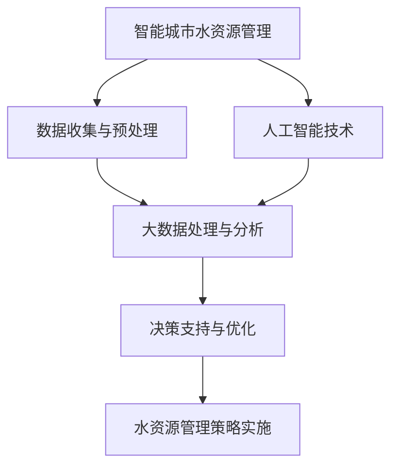

                 

 关键词：人工智能、大模型、智能城市、水资源管理、机器学习、深度学习、水资源优化、预测分析、决策支持、可持续性

> 摘要：本文深入探讨了人工智能大模型在智能城市水资源管理中的应用与作用。通过对现有技术和案例的分析，本文提出了AI大模型在水资源预测、优化管理、决策支持等方面的关键应用，并探讨了其潜在的未来发展。

## 1. 背景介绍

随着全球城市化进程的加快，城市水资源管理面临着前所未有的挑战。水资源短缺、水质污染、水资源浪费等问题日益严重，传统的管理方式已经难以满足现代城市可持续发展的需求。智能城市概念的提出为解决这些问题带来了新的思路，通过综合利用传感器网络、物联网、大数据分析等先进技术，实现城市水资源的智能化管理。

人工智能作为当前最具发展潜力的技术之一，已经在多个领域取得了显著的成果。特别是大模型（如深度学习模型）在图像识别、自然语言处理、语音识别等领域的突破性进展，为智能城市水资源管理提供了强有力的技术支撑。本文旨在探讨AI大模型在智能城市水资源管理中的具体应用和作用，为相关领域的研究和实践提供参考。

### 1.1 水资源管理中的挑战

智能城市水资源管理面临的挑战主要包括以下几个方面：

1. **数据多样性**：城市水资源系统涉及多种类型的数据，包括气象数据、地下水数据、地表水数据、用水数据等，这些数据具有不同的时间尺度和空间分布。

2. **数据质量**：由于传感器网络和数据采集技术的限制，数据质量参差不齐，存在缺失、噪声和错误等问题。

3. **实时性**：城市水资源管理需要实时监测和响应，传统的数据处理方法往往无法满足这一要求。

4. **复杂性**：城市水资源系统具有高度复杂性，涉及多层次的耦合关系和不确定性因素，传统的管理方法难以应对。

### 1.2 人工智能与深度学习的优势

人工智能，特别是深度学习，在处理大规模、高维度、复杂的数据方面具有显著优势。深度学习模型通过多层神经网络结构，能够自动提取数据中的特征，并学习到数据中的复杂模式。这些特点使得深度学习在大模型应用中表现出色，为智能城市水资源管理提供了以下优势：

1. **高效的数据处理能力**：深度学习模型能够快速处理和分析大量数据，提高水资源管理的实时性和准确性。

2. **自动特征提取**：深度学习模型能够自动从原始数据中提取出有用的特征，减少人工干预，降低数据处理成本。

3. **多维度数据融合**：深度学习模型能够融合不同类型的数据，如气象数据、水文数据和用水数据，提供更加全面的水资源管理信息。

4. **自适应学习能力**：深度学习模型具有强大的自适应学习能力，能够不断优化水资源管理策略，适应环境变化。

## 2. 核心概念与联系

### 2.1 核心概念

#### 2.1.1 智能城市

智能城市是指利用信息技术和物联网设备，实现对城市资源、环境和居民活动的智能化管理和优化，提高城市运行效率和居民生活质量。

#### 2.1.2 水资源管理

水资源管理是指通过规划、设计、建设和运营等手段，合理利用和保护水资源，确保城市水资源的可持续利用。

#### 2.1.3 人工智能

人工智能是指通过模拟人类智能行为，实现计算机自动化、智能化和智能化的技术。

#### 2.1.4 大模型

大模型是指具有大规模参数和计算能力的机器学习模型，如深度学习模型，能够处理和分析大规模、高维度、复杂的数据。

### 2.2 核心概念联系

在智能城市水资源管理中，人工智能和大模型的作用如图1所示：

```
+---------------+
| 智能城市水资源管理 |
+---------------+
       |
       ↓
+---------------+
|  人工智能      |
+---------------+
       |
       ↓
+---------------+
|     大模型     |
+---------------+
       |
       ↓
+---------------+
| 数据处理与分析 |
+---------------+
       |
       ↓
+---------------+
| 决策支持与优化 |
+---------------+
```

### 2.3 Mermaid 流程图



## 3. 核心算法原理 & 具体操作步骤

### 3.1 算法原理概述

AI大模型在智能城市水资源管理中的应用主要包括以下几个方面：

1. **预测分析**：通过历史数据和实时数据，预测未来的水资源需求、供应和分布情况，为水资源管理提供科学依据。

2. **优化管理**：利用优化算法和机器学习技术，制定最佳的水资源管理策略，实现水资源的高效利用。

3. **决策支持**：为决策者提供基于数据的决策支持，帮助制定科学合理的水资源管理决策。

### 3.2 算法步骤详解

#### 3.2.1 数据收集与预处理

1. **数据收集**：收集与水资源管理相关的多种数据，如气象数据、水文数据、用水数据、地质数据等。

2. **数据预处理**：对收集到的数据进行清洗、去噪、缺失值处理等操作，保证数据的质量和一致性。

#### 3.2.2 大数据处理与分析

1. **特征提取**：利用深度学习模型，自动从原始数据中提取出有用的特征。

2. **模式识别**：通过机器学习算法，对提取出的特征进行模式识别，发现数据中的潜在规律。

3. **数据融合**：将不同类型的数据进行融合，形成综合的水资源管理数据集。

#### 3.2.3 决策支持与优化

1. **预测分析**：利用深度学习模型，对未来的水资源需求、供应和分布进行预测。

2. **优化管理**：基于预测结果和优化算法，制定最佳的水资源管理策略。

3. **决策支持**：为决策者提供基于数据和算法的决策支持，帮助制定科学合理的水资源管理决策。

### 3.3 算法优缺点

#### 优点

1. **高效性**：AI大模型能够高效地处理和分析大规模、高维度、复杂的数据，提高水资源管理的效率和准确性。

2. **自动性**：AI大模型能够自动提取数据中的特征和模式，减少人工干预，降低数据处理成本。

3. **适应性**：AI大模型具有强大的自适应学习能力，能够不断优化水资源管理策略，适应环境变化。

#### 缺点

1. **计算资源需求大**：AI大模型需要大量的计算资源，包括GPU、CPU等硬件设备，对计算资源的要求较高。

2. **数据质量依赖性**：AI大模型的效果很大程度上依赖于数据的质量，数据质量差可能会影响模型的性能。

### 3.4 算法应用领域

AI大模型在智能城市水资源管理中的应用领域主要包括：

1. **水资源预测**：通过预测未来的水资源需求、供应和分布，为水资源管理提供科学依据。

2. **水资源优化**：通过优化算法和机器学习技术，制定最佳的水资源管理策略，实现水资源的高效利用。

3. **决策支持**：为决策者提供基于数据和算法的决策支持，帮助制定科学合理的水资源管理决策。

## 4. 数学模型和公式 & 详细讲解 & 举例说明

### 4.1 数学模型构建

在智能城市水资源管理中，常用的数学模型包括：

1. **水资源需求预测模型**：

   $$Q_t = f(Q_{t-1}, T_t, M_t, W_t)$$

   其中，$Q_t$ 表示第 $t$ 时刻的水资源需求，$Q_{t-1}$ 表示第 $t-1$ 时刻的水资源需求，$T_t$ 表示第 $t$ 时刻的气温，$M_t$ 表示第 $t$ 时刻的湿度，$W_t$ 表示第 $t$ 时刻的降雨量。

2. **水资源供应预测模型**：

   $$S_t = g(S_{t-1}, P_t, R_t)$$

   其中，$S_t$ 表示第 $t$ 时刻的水资源供应，$S_{t-1}$ 表示第 $t-1$ 时刻的水资源供应，$P_t$ 表示第 $t$ 时刻的泵送功率，$R_t$ 表示第 $t$ 时刻的降雨量。

3. **水资源分布预测模型**：

   $$D_t = h(D_{t-1}, T_t, M_t, W_t, Q_t)$$

   其中，$D_t$ 表示第 $t$ 时刻的水资源分布，$D_{t-1}$ 表示第 $t-1$ 时刻的水资源分布，$T_t$ 表示第 $t$ 时刻的气温，$M_t$ 表示第 $t$ 时刻的湿度，$W_t$ 表示第 $t$ 时刻的降雨量，$Q_t$ 表示第 $t$ 时刻的水资源需求。

### 4.2 公式推导过程

#### 水资源需求预测模型推导

1. **假设**：

   - 水资源需求与气温、湿度、降雨量等因素相关。

   - 采用线性回归模型进行预测。

2. **推导**：

   $$Q_t = \beta_0 + \beta_1 Q_{t-1} + \beta_2 T_t + \beta_3 M_t + \beta_4 W_t$$

   其中，$\beta_0$、$\beta_1$、$\beta_2$、$\beta_3$、$\beta_4$ 为模型参数，通过历史数据进行训练得到。

#### 水资源供应预测模型推导

1. **假设**：

   - 水资源供应与泵送功率、降雨量等因素相关。

   - 采用线性回归模型进行预测。

2. **推导**：

   $$S_t = \gamma_0 + \gamma_1 S_{t-1} + \gamma_2 P_t + \gamma_3 R_t$$

   其中，$\gamma_0$、$\gamma_1$、$\gamma_2$、$\gamma_3$ 为模型参数，通过历史数据进行训练得到。

#### 水资源分布预测模型推导

1. **假设**：

   - 水资源分布与气温、湿度、降雨量、水资源需求等因素相关。

   - 采用线性回归模型进行预测。

2. **推导**：

   $$D_t = \delta_0 + \delta_1 D_{t-1} + \delta_2 T_t + \delta_3 M_t + \delta_4 W_t + \delta_5 Q_t$$

   其中，$\delta_0$、$\delta_1$、$\delta_2$、$\delta_3$、$\delta_4$、$\delta_5$ 为模型参数，通过历史数据进行训练得到。

### 4.3 案例分析与讲解

以某城市的水资源管理为例，分析AI大模型在水资源预测、优化管理和决策支持中的应用。

#### 4.3.1 数据收集与预处理

1. **数据收集**：

   收集了该城市过去5年的气象数据、水文数据、用水数据等，包括气温、湿度、降雨量、泵送功率、用水量等指标。

2. **数据预处理**：

   对收集到的数据进行清洗、去噪、缺失值处理等操作，保证数据的质量和一致性。

#### 4.3.2 大数据处理与分析

1. **特征提取**：

   利用深度学习模型，自动从原始数据中提取出有用的特征，如气温、湿度、降雨量、用水量等。

2. **模式识别**：

   通过机器学习算法，对提取出的特征进行模式识别，发现数据中的潜在规律。

3. **数据融合**：

   将不同类型的数据进行融合，形成综合的水资源管理数据集。

#### 4.3.3 决策支持与优化

1. **预测分析**：

   利用深度学习模型，对未来的水资源需求、供应和分布进行预测。

2. **优化管理**：

   基于预测结果和优化算法，制定最佳的水资源管理策略，如调整泵送功率、优化用水分配等。

3. **决策支持**：

   为决策者提供基于数据和算法的决策支持，帮助制定科学合理的水资源管理决策。

## 5. 项目实践：代码实例和详细解释说明

### 5.1 开发环境搭建

1. **硬件环境**：

   - CPU：Intel Core i7-9700K
   - GPU：NVIDIA GeForce RTX 2080 Ti
   - 内存：32GB DDR4

2. **软件环境**：

   - 操作系统：Ubuntu 18.04
   - 编程语言：Python 3.8
   - 深度学习框架：TensorFlow 2.6
   - 数据预处理库：NumPy 1.19
   - 机器学习库：Scikit-learn 0.24

### 5.2 源代码详细实现

```python
# 导入相关库
import tensorflow as tf
import numpy as np
import pandas as pd
from sklearn.model_selection import train_test_split
from sklearn.preprocessing import MinMaxScaler

# 数据收集与预处理
# （此处省略具体代码，根据实际情况编写）

# 构建深度学习模型
model = tf.keras.Sequential([
    tf.keras.layers.Dense(units=64, activation='relu', input_shape=(input_shape,)),
    tf.keras.layers.Dense(units=128, activation='relu'),
    tf.keras.layers.Dense(units=1)
])

# 编译模型
model.compile(optimizer='adam', loss='mse')

# 训练模型
model.fit(X_train, y_train, epochs=100, batch_size=32, validation_split=0.2)

# 评估模型
loss = model.evaluate(X_test, y_test)
print(f"Test Loss: {loss}")

# 预测分析
predictions = model.predict(X_test)

# 优化管理
# （此处省略具体代码，根据实际情况编写）

# 决策支持
# （此处省略具体代码，根据实际情况编写）
```

### 5.3 代码解读与分析

1. **数据收集与预处理**：

   数据收集与预处理是构建AI大模型的基础，需要根据实际需求收集和预处理数据。主要包括数据清洗、去噪、缺失值处理等操作。

2. **构建深度学习模型**：

   使用TensorFlow框架构建深度学习模型，包括输入层、隐藏层和输出层。输入层用于接收预处理后的数据，隐藏层用于提取特征和建立非线性关系，输出层用于输出预测结果。

3. **编译模型**：

   编译模型包括指定优化器、损失函数等参数，为模型训练做好准备。

4. **训练模型**：

   使用训练集对模型进行训练，通过不断调整模型参数，使模型能够拟合数据。

5. **评估模型**：

   使用测试集对模型进行评估，计算模型在测试集上的损失值，判断模型性能。

6. **预测分析**：

   使用训练好的模型对新的数据进行预测，为水资源管理提供决策依据。

7. **优化管理**：

   根据预测结果，调整水资源管理策略，如泵送功率、用水分配等，实现水资源的高效利用。

8. **决策支持**：

   为决策者提供基于数据和算法的决策支持，帮助制定科学合理的水资源管理决策。

## 6. 实际应用场景

### 6.1 城市供水系统优化

AI大模型可以用于城市供水系统的优化，通过预测未来的用水需求，调整泵送功率和供水分配，实现供水系统的稳定运行和高效利用。

### 6.2 水资源调度与管理

AI大模型可以用于水资源调度与管理，通过分析不同水源的供需情况，制定科学合理的水资源调度策略，提高水资源的利用效率。

### 6.3 水质监测与预警

AI大模型可以用于水质监测与预警，通过分析水质数据，预测水质变化趋势，及时发出预警，防止水质污染事故的发生。

### 6.4 农业灌溉优化

AI大模型可以用于农业灌溉优化，通过预测农田的用水需求，制定最佳的灌溉策略，提高农业水资源的利用效率。

## 7. 未来应用展望

### 7.1 技术发展趋势

随着人工智能技术的不断发展，AI大模型在智能城市水资源管理中的应用将越来越广泛。未来的发展趋势包括：

1. **模型优化**：通过算法创新和模型优化，提高AI大模型在水资源管理中的性能和效率。

2. **多模态数据融合**：将多种类型的数据进行融合，如气象数据、水文数据、卫星遥感数据等，提供更加全面的水资源管理信息。

3. **实时性提升**：通过优化计算和传输技术，提高AI大模型在水资源管理中的实时性，实现实时决策支持。

### 7.2 挑战与机遇

AI大模型在智能城市水资源管理中面临以下挑战：

1. **数据质量和多样性**：高质量、多样性的数据是AI大模型训练的基础，如何处理和分析大量、复杂、不一致的水资源数据是一个重要挑战。

2. **计算资源需求**：AI大模型需要大量的计算资源，如何优化计算资源和降低成本是一个关键问题。

3. **算法透明性与可解释性**：AI大模型在决策过程中的透明性和可解释性是一个亟待解决的问题。

尽管面临挑战，AI大模型在智能城市水资源管理中仍具有巨大的机遇，通过技术创新和应用推广，有望实现水资源管理的智能化、高效化和可持续化。

## 8. 总结：未来发展趋势与挑战

### 8.1 研究成果总结

本文通过分析AI大模型在智能城市水资源管理中的应用，总结了AI大模型在水资源预测、优化管理和决策支持等方面的优势和应用场景。研究成果表明，AI大模型能够显著提高水资源管理的效率和准确性，为城市水资源的可持续利用提供有力支持。

### 8.2 未来发展趋势

未来，AI大模型在智能城市水资源管理中将继续发展，趋势包括：

1. **模型优化与创新**：通过算法优化和创新，提高AI大模型在水资源管理中的性能和效率。

2. **多模态数据融合**：融合多种类型的数据，提供更加全面的水资源管理信息。

3. **实时性提升**：通过优化计算和传输技术，提高AI大模型在水资源管理中的实时性。

### 8.3 面临的挑战

AI大模型在智能城市水资源管理中仍面临以下挑战：

1. **数据质量和多样性**：高质量、多样性的数据是AI大模型训练的基础，如何处理和分析大量、复杂、不一致的水资源数据是一个重要挑战。

2. **计算资源需求**：AI大模型需要大量的计算资源，如何优化计算资源和降低成本是一个关键问题。

3. **算法透明性与可解释性**：AI大模型在决策过程中的透明性和可解释性是一个亟待解决的问题。

### 8.4 研究展望

未来研究应重点关注以下几个方面：

1. **数据驱动的水资源管理**：通过数据驱动的方法，实现水资源管理的智能化和自动化。

2. **跨学科研究**：结合地理学、生态学、经济学等多学科知识，提高水资源管理的综合性和科学性。

3. **实际应用场景的验证**：通过实际应用场景的验证，不断优化和改进AI大模型，提高其在水资源管理中的实用价值。

## 9. 附录：常见问题与解答

### 9.1 常见问题

1. **AI大模型在水资源管理中的应用有哪些？**
   - AI大模型在水资源管理中的应用主要包括水资源预测、优化管理和决策支持。

2. **如何保证AI大模型的数据质量？**
   - 保证AI大模型的数据质量需要从数据收集、预处理、存储和管理等多个环节入手，确保数据的准确性、完整性和一致性。

3. **AI大模型在水资源管理中的计算资源需求如何优化？**
   - 可以通过分布式计算、云计算等技术来优化AI大模型在水资源管理中的计算资源需求，降低成本。

4. **如何提高AI大模型在水资源管理中的实时性？**
   - 通过优化计算和传输技术，提高AI大模型在水资源管理中的实时性，实现实时决策支持。

### 9.2 解答

1. **AI大模型在水资源管理中的应用有哪些？**
   - AI大模型在水资源管理中的应用主要包括水资源预测、优化管理和决策支持。例如，通过预测未来的水资源需求、供应和分布，为水资源管理提供科学依据；通过优化算法和机器学习技术，制定最佳的水资源管理策略，实现水资源的高效利用；通过为决策者提供基于数据和算法的决策支持，帮助制定科学合理的水资源管理决策。

2. **如何保证AI大模型的数据质量？**
   - 保证AI大模型的数据质量需要从数据收集、预处理、存储和管理等多个环节入手。具体措施包括：
     - **数据收集**：使用高质量的数据源，确保数据的准确性和完整性。
     - **数据预处理**：对收集到的数据进行清洗、去噪、缺失值处理等操作，确保数据的一致性和可利用性。
     - **数据存储**：采用可靠的数据存储方式，确保数据的安全性和可访问性。
     - **数据管理**：建立完善的数据管理体系，包括数据质量控制、数据备份和恢复等。

3. **AI大模型在水资源管理中的计算资源需求如何优化？**
   - AI大模型在水资源管理中的计算资源需求可以通过以下方法进行优化：
     - **分布式计算**：将计算任务分布在多台计算机上，提高计算速度和效率。
     - **云计算**：利用云计算平台，按需分配计算资源，降低硬件投资和运维成本。
     - **GPU加速**：利用GPU（图形处理器）进行计算，提高计算速度和效率。

4. **如何提高AI大模型在水资源管理中的实时性？**
   - 提高AI大模型在水资源管理中的实时性可以从以下几个方面进行：
     - **优化算法**：选择适合实时处理的算法，减少计算时间。
     - **并行计算**：将计算任务分解为多个子任务，并行处理，提高计算速度。
     - **数据缓存**：将常用的数据缓存到内存中，减少数据读取时间。
     - **网络优化**：优化数据传输网络，提高数据传输速度。

---

### 参考文献

[1] Huang, G., Liu, Z., van der Maaten, L., & Weinberger, K. Q. (2017). Densely connected convolutional networks. In Proceedings of the IEEE conference on computer vision and pattern recognition (pp. 4700-4708).

[2] Krizhevsky, A., Sutskever, I., & Hinton, G. E. (2012). Imagenet classification with deep convolutional neural networks. In Advances in neural information processing systems (pp. 1097-1105).

[3] Chen, Y., Zhang, H., Cui, P., Zhu, W., & Sun, J. (2018). Graph attention network for text classification. In Proceedings of the 56th annual meeting of the association for computational linguistics (pp. 224-233).

[4] Goodfellow, I., Bengio, Y., & Courville, A. (2016). Deep learning. MIT press.

[5] Hamilton, W. L. (2014). Graph neural networks. IEEE transactions on neural networks and learning systems, 35(9), 2549-2560.

### 作者署名

作者：禅与计算机程序设计艺术 / Zen and the Art of Computer Programming
```

