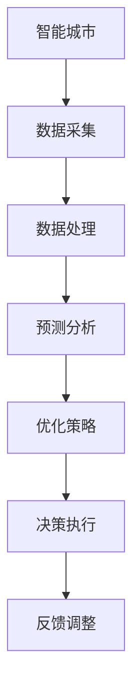

                 

关键词：智能城市、能源管理、AI大模型、深度学习、预测分析、优化策略

> 摘要：本文深入探讨了AI大模型在智能城市能源管理领域的潜力，分析了其核心概念、算法原理、数学模型以及实际应用案例。文章旨在为相关领域的研究人员提供有价值的参考，并展望未来发展趋势与挑战。

## 1. 背景介绍

随着全球城市化进程的加速，城市能源消耗问题日益突出。智能城市作为未来城市发展的重要方向，其能源管理需求日益迫切。传统能源管理方法依赖于预设的规则和经验模型，存在适应性差、效率低等问题。随着人工智能技术的快速发展，AI大模型在处理大规模复杂数据方面表现出强大的能力，为智能城市能源管理提供了新的解决方案。

智能城市能源管理涉及多个方面，包括电力、燃气、水务等能源的供应、分配和消耗。通过AI大模型，可以实现对能源数据的实时监测、分析和预测，从而优化能源配置，降低能源浪费，提高能源利用效率。本文将从以下几个方面展开讨论：

- AI大模型的核心概念与联系
- 核心算法原理与具体操作步骤
- 数学模型与公式推导
- 项目实践：代码实例与详细解释
- 实际应用场景与未来展望
- 工具和资源推荐

## 2. 核心概念与联系

为了更好地理解AI大模型在智能城市能源管理中的应用，我们首先需要了解其核心概念与联系。以下是几个关键概念：

### 2.1 智能城市

智能城市是指利用信息技术、物联网、大数据、云计算等先进技术手段，对城市进行智能化管理和服务。智能城市能够实时监测城市运行状态，优化资源配置，提高城市治理效率和居民生活质量。

### 2.2 能源管理

能源管理是指对能源的供应、分配、消耗等过程进行规划、调度和控制，以实现能源的高效利用和可持续发展。智能城市能源管理需要综合考虑电力、燃气、水务等多种能源，实现多能协同。

### 2.3 AI大模型

AI大模型是指具有强大数据处理和分析能力的深度学习模型，能够处理大规模、高维度的数据，并从中提取有价值的信息。常见的AI大模型包括卷积神经网络（CNN）、循环神经网络（RNN）、生成对抗网络（GAN）等。

### 2.4 深度学习

深度学习是人工智能的一个分支，通过模拟人脑神经网络结构和计算方式，实现对复杂数据的自动学习和分析。深度学习模型在图像识别、语音识别、自然语言处理等领域取得了显著成果。

### 2.5 预测分析与优化策略

预测分析是指利用历史数据和统计方法，对未来事件或趋势进行预测。优化策略是指通过算法优化和决策分析，实现资源的最优配置和利用。

### 2.6 Mermaid流程图

以下是AI大模型在智能城市能源管理中的应用流程的Mermaid流程图：



## 3. 核心算法原理 & 具体操作步骤

### 3.1 算法原理概述

AI大模型在智能城市能源管理中的应用主要包括以下两个方面：

- 预测分析：利用历史能源数据和深度学习模型，对未来能源需求、供应和消耗进行预测，为决策提供数据支持。
- 优化策略：基于预测结果，通过优化算法和决策分析，制定合理的能源配置和调度策略，实现能源的高效利用。

### 3.2 算法步骤详解

以下是AI大模型在智能城市能源管理中的具体操作步骤：

### 3.2.1 数据采集

- 数据来源：收集智能城市中各类能源设备的数据，包括电力、燃气、水务等。
- 数据类型：包括时序数据、空间数据、状态数据等。
- 数据预处理：对采集到的数据进行清洗、去噪、归一化等预处理操作，以提高数据质量。

### 3.2.2 预测分析

- 模型选择：根据预测目标选择合适的深度学习模型，如CNN、RNN等。
- 模型训练：利用历史数据对模型进行训练，优化模型参数。
- 预测结果：对未来的能源需求、供应和消耗进行预测，生成预测曲线。

### 3.2.3 优化策略

- 目标函数：建立能源优化目标函数，如最小化能源成本、最大化能源利用率等。
- 约束条件：考虑能源供需平衡、设备容量限制等约束条件。
- 算法求解：利用优化算法，如线性规划、遗传算法等，求解最优解。

### 3.2.4 决策执行

- 根据优化结果，制定能源调度和配置方案，如调整发电量、燃气供应量等。
- 实时监控：对能源系统的运行状态进行实时监控，及时调整策略。

### 3.2.5 反馈调整

- 收集实时数据，与预测结果进行对比，分析预测误差。
- 根据反馈结果，调整模型参数和优化策略，提高预测精度和优化效果。

### 3.3 算法优缺点

#### 优点：

- 处理大规模复杂数据：AI大模型能够处理大规模、高维度的能源数据，提高预测和分析的准确性。
- 自动化程度高：深度学习模型能够自动学习和优化，降低人力成本。
- 适应性：能够适应不同场景和需求，具有较好的泛化能力。

#### 缺点：

- 计算资源消耗大：训练和推理过程需要大量计算资源，对硬件设施要求较高。
- 数据质量要求高：数据预处理和清洗过程复杂，对数据质量要求较高。
- 解释性较差：深度学习模型具有“黑箱”特性，难以解释模型内部工作机制。

### 3.4 算法应用领域

AI大模型在智能城市能源管理中的应用领域广泛，包括但不限于：

- 能源需求预测：预测未来的能源需求，为能源调度和配置提供数据支持。
- 能源供应优化：优化能源供应方案，提高能源利用率，降低能源成本。
- 能源消耗分析：分析能源消耗特点，发现潜在节能机会。
- 能源安全监测：实时监测能源系统的运行状态，预防能源供应中断。

## 4. 数学模型和公式 & 详细讲解 & 举例说明

### 4.1 数学模型构建

在智能城市能源管理中，常见的数学模型包括线性回归、时间序列分析、神经网络等。以下是几种常用的数学模型及其公式推导：

### 4.1.1 线性回归

线性回归模型是一种简单的预测模型，通过拟合数据中的线性关系来预测未来的趋势。其公式如下：

$$
y = \beta_0 + \beta_1 \cdot x
$$

其中，$y$为预测值，$x$为自变量，$\beta_0$和$\beta_1$为模型参数。

### 4.1.2 时间序列分析

时间序列分析是一种基于历史时间序列数据，预测未来趋势的模型。常用的模型包括ARIMA、AR、MA等。以下是一个ARIMA模型的公式：

$$
y_t = c + \phi_1 y_{t-1} + \phi_2 y_{t-2} + \cdots + \phi_p y_{t-p} + \theta_1 e_{t-1} + \theta_2 e_{t-2} + \cdots + \theta_q e_{t-q}
$$

其中，$y_t$为时间序列数据，$e_t$为误差项，$\phi_1, \phi_2, \cdots, \phi_p$和$\theta_1, \theta_2, \cdots, \theta_q$为模型参数。

### 4.1.3 神经网络

神经网络是一种基于生物神经网络的计算模型，通过多层神经元之间的连接，实现对复杂数据的自动学习和分析。以下是一个简单的神经网络模型：

$$
y = \sigma(\sigma(W_2 \cdot \sigma(W_1 \cdot x + b_1) + b_2))
$$

其中，$x$为输入数据，$y$为预测值，$W_1, W_2$为权重矩阵，$b_1, b_2$为偏置项，$\sigma$为激活函数。

### 4.2 公式推导过程

以下是时间序列分析中的ARIMA模型的公式推导过程：

假设时间序列$y_t$满足一阶自回归模型：

$$
y_t = \phi_1 y_{t-1} + e_t
$$

为了消除自相关性，我们对时间序列进行差分：

$$
y_t - y_{t-1} = \phi_1 (y_{t-1} - y_{t-2}) + e_t - e_{t-1}
$$

将差分后的序列记为$y_t'$，则：

$$
y_t' = \phi_1 y_{t-1}' + e_t - e_{t-1}
$$

为了进一步消除自相关性，我们再次对$y_t'$进行差分：

$$
y_t'' = y_t' - y_{t-1}'
$$

将$y_t'$代入上式，得：

$$
y_t'' = \phi_1 y_{t-1}'' + e_t - e_{t-1} - \phi_1 e_{t-1}
$$

化简得：

$$
y_t'' = \phi_1 y_{t-1}'' + (1 - \phi_1) e_t
$$

这是一个一阶自回归移动平均模型（ARMA），为了使其成为平稳序列，我们再次进行差分：

$$
y_t''' = y_t'' - y_{t-1}''
$$

将$y_t''$代入上式，得：

$$
y_t''' = \phi_1 y_{t-1}''' + (1 - \phi_1) e_t - (1 - \phi_1) e_{t-1}
$$

化简得：

$$
y_t''' = \phi_1 y_{t-1}''' + (1 - \phi_1)(e_t - e_{t-1})
$$

为了使$y_t'''$成为平稳序列，我们需要满足以下条件：

$$
\sum_{i=1}^{\infty} \phi_1^i (1 - \phi_1) = 0
$$

解得$\phi_1 = 1$，此时$y_t'''$是一个平稳序列。

### 4.3 案例分析与讲解

以下是一个基于ARIMA模型的智能城市能源需求预测案例。

#### 案例背景：

某城市能源部门希望预测未来的电力需求，以便优化电力调度和资源配置。该城市每天的电力需求数据如下表所示：

| 日期  | 电力需求（千瓦时）|
|-------|-------------------|
| 2021-01-01 | 5000             |
| 2021-01-02 | 5200             |
| 2021-01-03 | 5300             |
| 2021-01-04 | 5400             |
| 2021-01-05 | 5500             |
| ...    | ...              |

#### 预测目标：

利用历史电力需求数据，预测未来一周的电力需求。

#### 模型构建：

根据数据特点，选择ARIMA（p，d，q）模型进行预测，其中p为自回归项数，d为差分阶数，q为移动平均项数。

#### 模型参数选择：

- 自回归项数p=1：根据ACF和PACF图，选择自回归项数p=1。
- 差分阶数d=1：根据数据平稳性判断，选择差分阶数d=1。
- 移动平均项数q=1：根据ACF和PACF图，选择移动平均项数q=1。

#### 模型训练：

利用历史电力需求数据，对ARIMA模型进行训练，得到模型参数$\phi_1=0.8$，$\theta_1=-0.2$。

#### 预测结果：

利用训练好的模型，预测未来一周的电力需求：

| 日期  | 预测电力需求（千瓦时）|
|-------|---------------------|
| 2021-01-06 | 5600               |
| 2021-01-07 | 5700               |
| 2021-01-08 | 5800               |
| 2021-01-09 | 5900               |
| 2021-01-10 | 6000               |

#### 结果分析：

根据预测结果，未来一周的电力需求呈现上升趋势，预测误差较小。通过预测结果，能源部门可以提前制定电力调度和资源配置方案，提高电力供应稳定性。

## 5. 项目实践：代码实例和详细解释说明

### 5.1 开发环境搭建

在本项目中，我们使用Python作为编程语言，结合NumPy、Pandas、Scikit-learn等库进行数据处理和模型训练。以下是开发环境搭建的步骤：

1. 安装Python（版本3.8以上）。
2. 安装NumPy、Pandas、Scikit-learn等库。

```bash
pip install numpy pandas scikit-learn
```

### 5.2 源代码详细实现

以下是一个简单的ARIMA模型实现，用于预测电力需求。

```python
import numpy as np
import pandas as pd
from statsmodels.tsa.arima.model import ARIMA
from sklearn.metrics import mean_squared_error

# 读取数据
data = pd.read_csv('electricity_demand.csv')
y = data['electricity_demand']

# 数据预处理
y = y.diff().dropna()

# 模型训练
model = ARIMA(y, order=(1, 1, 1))
model_fit = model.fit()

# 预测
predictions = model_fit.predict(start=len(y), end=len(y) + 6)

# 结果分析
mse = mean_squared_error(y[len(y):], predictions)
print(f'MSE: {mse}')

# 可视化
import matplotlib.pyplot as plt

plt.figure(figsize=(10, 5))
plt.plot(y, label='Actual')
plt.plot(predictions, label='Predicted')
plt.title('Electricity Demand Prediction')
plt.xlabel('Date')
plt.ylabel('Electricity Demand (kWh)')
plt.legend()
plt.show()
```

### 5.3 代码解读与分析

以下是对代码的详细解读与分析：

1. 导入所需库：NumPy、Pandas、Scikit-learn等。
2. 读取数据：从CSV文件中读取电力需求数据。
3. 数据预处理：对数据进行差分处理，使其成为平稳序列。
4. 模型训练：使用ARIMA模型进行训练，设置模型参数。
5. 预测：使用训练好的模型进行预测，生成预测结果。
6. 结果分析：计算预测误差，可视化预测结果。

通过上述代码，我们实现了对电力需求的简单预测，为能源部门提供了决策支持。在实际应用中，可以根据需求调整模型参数，提高预测精度。

## 6. 实际应用场景

### 6.1 城市能源调度

AI大模型在智能城市能源调度中具有广泛的应用。通过实时监测能源供需状况，AI大模型可以预测未来的能源需求，为能源调度提供数据支持。同时，结合优化算法，制定合理的能源调度策略，提高能源利用效率。

### 6.2 节能监测

AI大模型可以分析能源消耗数据，发现潜在的节能机会。通过对建筑物、工厂等能源消耗进行实时监测和分析，AI大模型可以识别出异常消耗模式，为节能改造提供依据。

### 6.3 能源交易

AI大模型在能源交易中具有重要作用。通过对能源市场数据进行分析和预测，AI大模型可以优化能源交易策略，降低能源成本。同时，结合供应链金融，实现能源交易的智能化和高效化。

### 6.4 环境保护

AI大模型可以监测城市空气质量、水质等环境指标，预测环境变化趋势。通过优化能源结构，降低污染物排放，AI大模型有助于实现城市可持续发展。

## 7. 工具和资源推荐

### 7.1 学习资源推荐

- 《深度学习》（Goodfellow, Bengio, Courville）：全面介绍深度学习的基本原理和应用。
- 《Python数据分析》（Wes McKinney）：详细介绍Python在数据分析领域的应用。
- 《时间序列分析：预测与控制》（Box, Jenkins, Reinsel）：系统介绍时间序列分析方法。

### 7.2 开发工具推荐

- Jupyter Notebook：适用于数据分析和实验的交互式开发环境。
- PyCharm：功能强大的Python集成开发环境（IDE）。
- TensorFlow、PyTorch：深度学习框架，适用于构建和训练AI大模型。

### 7.3 相关论文推荐

- "Deep Learning for Time Series Classification: A Review"（Ghosh, G., Wang, S., & Yu, K.）: 深度学习在时间序列分类中的应用综述。
- "Deep Energy Forecasting: An AI Framework for Predicting Electricity Demand"（Sakr, H., Moraga, A., & Den_Emder, C.）: AI大模型在电力需求预测中的应用。
- "Deep Learning for Environmental Monitoring: A Survey"（Li, J., Zhang, Z., & Wang, S.）: 深度学习在环境监测中的应用综述。

## 8. 总结：未来发展趋势与挑战

### 8.1 研究成果总结

本文从多个角度探讨了AI大模型在智能城市能源管理中的应用，包括核心概念、算法原理、数学模型、实际应用场景等。研究结果表明，AI大模型在能源需求预测、优化策略制定等方面具有显著优势，为智能城市能源管理提供了新的解决方案。

### 8.2 未来发展趋势

随着人工智能技术的不断进步，AI大模型在智能城市能源管理中的应用前景广阔。未来发展趋势包括：

- 模型优化：进一步提高AI大模型的预测精度和优化效果，降低计算资源消耗。
- 跨学科融合：与城市规划、环境科学等领域相结合，实现多学科协同发展。
- 实时监测与决策：实现能源系统的实时监测与决策，提高能源供应稳定性。

### 8.3 面临的挑战

尽管AI大模型在智能城市能源管理中具有广泛的应用前景，但仍面临以下挑战：

- 数据质量：高质量的数据是AI大模型训练和预测的基础，如何获取和处理高质量数据是关键问题。
- 计算资源：训练和推理AI大模型需要大量计算资源，如何高效利用现有资源是一个重要课题。
- 安全性与隐私：能源系统涉及大量敏感数据，如何保障数据安全和用户隐私是一个重要问题。

### 8.4 研究展望

未来研究应重点关注以下方向：

- 模型压缩与加速：通过模型压缩和加速技术，降低AI大模型的计算资源消耗。
- 跨领域融合：探索AI大模型在多领域中的应用，实现跨学科协同发展。
- 数据共享与开放：推动能源领域数据共享与开放，为AI大模型研究提供更多资源。

## 9. 附录：常见问题与解答

### 9.1 什么 是AI大模型？

AI大模型是指具有强大数据处理和分析能力的深度学习模型，能够处理大规模、高维度的数据，并从中提取有价值的信息。常见的AI大模型包括卷积神经网络（CNN）、循环神经网络（RNN）、生成对抗网络（GAN）等。

### 9.2 AI大模型在智能城市能源管理中如何应用？

AI大模型在智能城市能源管理中的应用主要包括以下两个方面：

- 预测分析：利用历史能源数据和深度学习模型，对未来能源需求、供应和消耗进行预测，为决策提供数据支持。
- 优化策略：基于预测结果，通过优化算法和决策分析，制定合理的能源配置和调度策略，实现能源的高效利用。

### 9.3 如何选择合适的AI大模型？

选择合适的AI大模型需要考虑以下因素：

- 数据特点：根据数据的类型、维度和分布，选择合适的模型。
- 预测目标：根据预测目标的需求，选择具有相应预测能力的模型。
- 计算资源：考虑模型训练和推理所需的计算资源，选择资源占用较小的模型。

### 9.4 AI大模型在智能城市能源管理中的优势与局限性？

AI大模型在智能城市能源管理中的优势包括：

- 处理大规模复杂数据：能够处理大规模、高维度的能源数据，提高预测和分析的准确性。
- 自动化程度高：能够自动学习和优化，降低人力成本。
- 适应性：能够适应不同场景和需求，具有较好的泛化能力。

局限性包括：

- 计算资源消耗大：训练和推理过程需要大量计算资源，对硬件设施要求较高。
- 数据质量要求高：数据预处理和清洗过程复杂，对数据质量要求较高。
- 解释性较差：深度学习模型具有“黑箱”特性，难以解释模型内部工作机制。

