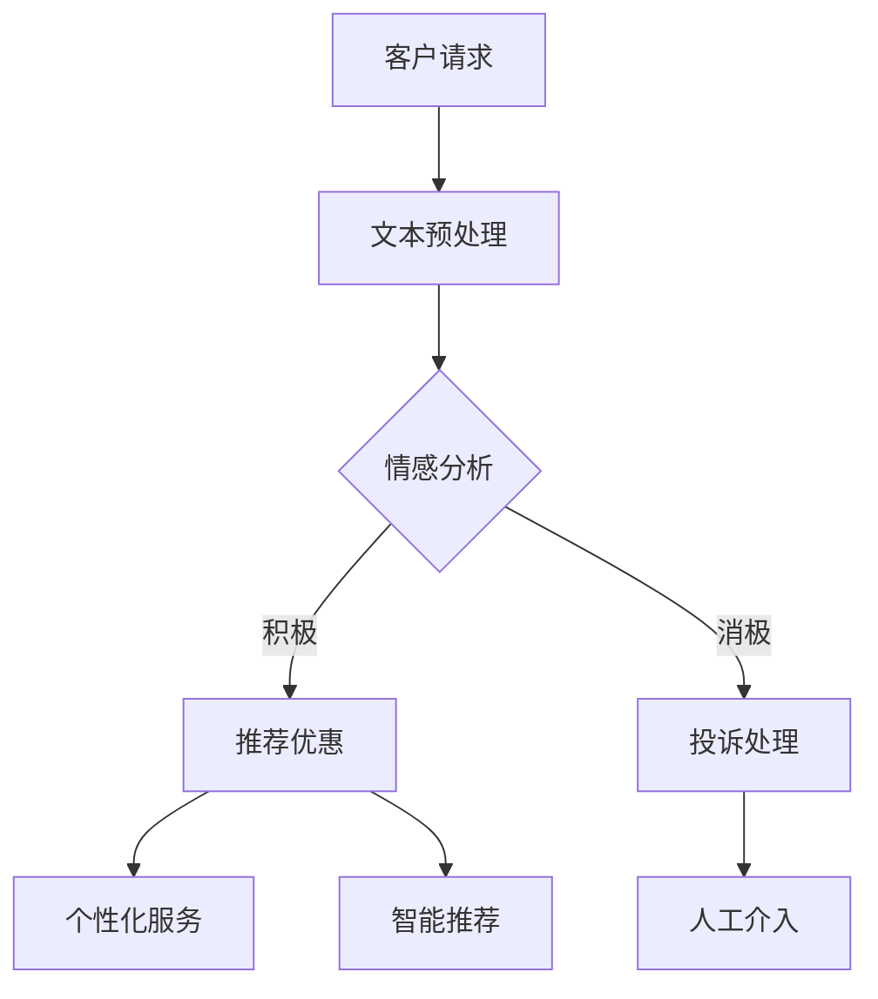

                 

### 关键词 Keywords
- AI大模型
- 电商平台
- 售后服务
- 自然语言处理
- 情感分析
- 自动化客服
- 客户体验

### 摘要 Abstract
本文探讨了人工智能（AI）特别是大模型技术在电商平台售后服务中的应用。通过分析AI大模型在自然语言处理、情感分析和自动化客服等方面的优势，本文详细描述了其在售后服务中的具体应用场景，包括客户反馈处理、投诉管理、个性化服务和智能推荐等。同时，文章还讨论了AI大模型技术的未来发展趋势和面临的挑战，以及为电商平台提升售后服务质量和客户满意度提供了实用的工具和资源推荐。

## 1. 背景介绍

电商平台作为数字经济的重要组成部分，其业务发展迅速，市场规模不断扩大。然而，随着电商平台的迅猛扩张，售后服务成为影响客户体验和满意度的重要因素。传统的售后服务模式往往依赖于人工处理客户问题，效率低下且容易出错，无法满足消费者对快速、高效、个性化的服务需求。

近年来，人工智能（AI）技术的飞速发展为电商平台提供了新的解决方案。特别是AI大模型，如基于深度学习的自然语言处理（NLP）模型、情感分析模型和生成对抗网络（GAN），使得电商平台能够实现自动化客服、智能推荐和个性化服务等功能，显著提升客户体验和满意度。

本文旨在探讨AI大模型在电商平台售后服务中的应用，分析其在不同场景下的具体作用，并提出相应的应用策略和优化方案。

## 2. 核心概念与联系

### 2.1 AI大模型的基本概念

AI大模型是指具有极高参数量、大规模训练数据集的深度学习模型，如GPT、BERT、BERT large等。这些模型通过学习海量的文本数据，可以理解复杂、多样的自然语言表达，并生成高质量的文本。其基本原理是基于神经网络结构，通过多层感知器和循环神经网络（RNN）等算法进行训练，从而实现自动编码、分类、生成等功能。

### 2.2 电商平台售后服务的基本概念

电商平台售后服务是指为客户提供产品售出后的咨询、维修、退换货等服务的过程。售后服务质量直接关系到客户的满意度和平台的口碑。传统的售后服务主要依赖于人工处理，效率较低，且容易出现失误。随着AI技术的发展，智能化、自动化的售后服务逐渐成为趋势。

### 2.3 AI大模型与电商平台售后服务的关系

AI大模型在电商平台售后服务中的应用主要体现在以下几个方面：

- **自然语言处理（NLP）**：通过NLP技术，AI大模型可以理解和处理客户的文本信息，如咨询、投诉、反馈等，从而实现自动化客服和智能回复。
- **情感分析**：AI大模型可以分析客户的情感倾向，如满意度、愤怒、焦虑等，帮助电商平台更好地理解客户需求，改进服务。
- **个性化服务**：基于客户的购买历史和行为数据，AI大模型可以提供个性化的推荐和优惠，提高客户的满意度和忠诚度。
- **智能推荐**：通过分析客户的浏览和购买行为，AI大模型可以智能推荐相关产品，增加销售额和客户粘性。

### 2.4 Mermaid 流程图

以下是一个简化的Mermaid流程图，展示了AI大模型在电商平台售后服务中的应用流程：



### 2.5 AI大模型与电商平台售后服务的关系图


### 2.6 关键技术概述

- **自然语言处理（NLP）**：NLP是AI的一个重要分支，主要研究如何让计算机理解和处理自然语言。在电商平台售后服务中，NLP技术可以用于自动化客服、智能回复、情感分析等。
- **情感分析**：情感分析是指通过算法分析文本情感倾向的技术。在售后服务中，情感分析可以帮助电商平台理解客户满意度，从而优化服务。
- **个性化服务**：个性化服务是基于客户的行为和偏好提供定制化的服务和推荐。在电商平台售后服务中，个性化服务可以提高客户满意度和忠诚度。
- **智能推荐**：智能推荐是通过分析客户的购买历史和行为数据，提供相关产品的推荐。在电商平台售后服务中，智能推荐可以增加销售额和客户粘性。

## 3. 核心算法原理 & 具体操作步骤

### 3.1 算法原理概述

在电商平台售后服务中，AI大模型的应用主要包括自然语言处理（NLP）、情感分析、个性化服务和智能推荐等技术。以下分别介绍这些技术的原理。

#### 3.1.1 自然语言处理（NLP）

NLP技术主要包括词向量表示、文本分类、命名实体识别、机器翻译等。词向量表示是将自然语言文本转换为计算机可以处理的数字向量，如Word2Vec、GloVe等。文本分类是将文本分类到预定义的类别中，如情感分类、主题分类等。命名实体识别是从文本中识别出具有特定意义的实体，如人名、地点、组织等。机器翻译是将一种语言的文本翻译成另一种语言的文本。

#### 3.1.2 情感分析

情感分析是NLP的一个重要应用，主要目标是判断文本的情感倾向，如积极、消极、中性等。常用的方法包括基于规则的方法、基于统计的方法和基于深度学习的方法。基于规则的方法使用预定义的规则来分类情感，如情感词典法。基于统计的方法使用机器学习算法来分类情感，如SVM、朴素贝叶斯等。基于深度学习的方法使用神经网络模型，如卷积神经网络（CNN）、循环神经网络（RNN）等。

#### 3.1.3 个性化服务

个性化服务是基于客户的行为和偏好提供定制化的服务和推荐。常用的方法包括协同过滤、矩阵分解、基于内容的推荐等。协同过滤是基于用户的历史行为数据，通过找到相似的用户或物品来推荐。矩阵分解是一种将用户和物品的评分矩阵分解为低秩矩阵的方法，从而预测未知评分。基于内容的推荐是基于物品的属性和用户的兴趣来推荐。

#### 3.1.4 智能推荐

智能推荐是通过分析客户的购买历史和行为数据，提供相关产品的推荐。常用的方法包括基于内容的推荐、基于关联规则的推荐、基于模型的推荐等。基于内容的推荐是基于物品的属性和用户的兴趣来推荐。基于关联规则的推荐是通过分析物品之间的关联关系来推荐。基于模型的推荐是通过构建预测模型来推荐。

### 3.2 算法步骤详解

#### 3.2.1 自然语言处理（NLP）

1. **数据采集**：收集电商平台的客服聊天记录、产品评论、用户反馈等文本数据。
2. **数据预处理**：对文本数据进行清洗、去噪、分词、词性标注等处理。
3. **词向量表示**：使用Word2Vec、GloVe等算法将文本转换为词向量。
4. **模型训练**：使用词向量训练分类器或序列模型，如SVM、RNN等。
5. **模型评估**：使用交叉验证、AUC、F1值等指标评估模型性能。

#### 3.2.2 情感分析

1. **数据采集**：收集电商平台的客服聊天记录、产品评论、用户反馈等文本数据。
2. **数据预处理**：对文本数据进行清洗、去噪、分词、词性标注等处理。
3. **情感词典构建**：构建包含积极、消极、中性等情感词典。
4. **模型训练**：使用情感词典训练分类器或序列模型，如SVM、RNN等。
5. **模型评估**：使用交叉验证、AUC、F1值等指标评估模型性能。

#### 3.2.3 个性化服务

1. **用户画像构建**：基于用户的购买历史、浏览行为、评价等数据构建用户画像。
2. **推荐算法选择**：选择合适的推荐算法，如协同过滤、矩阵分解、基于内容的推荐等。
3. **模型训练**：使用用户画像训练推荐模型。
4. **模型评估**：使用交叉验证、RMSE、MAE等指标评估模型性能。

#### 3.2.4 智能推荐

1. **用户行为数据采集**：收集用户的浏览记录、购买记录、搜索记录等行为数据。
2. **推荐算法选择**：选择合适的推荐算法，如基于内容的推荐、基于关联规则的推荐、基于模型的推荐等。
3. **模型训练**：使用用户行为数据训练推荐模型。
4. **模型评估**：使用交叉验证、RMSE、MAE等指标评估模型性能。

### 3.3 算法优缺点

#### 3.3.1 自然语言处理（NLP）

**优点**：  
- **高效性**：NLP技术可以快速处理大量的文本数据，提高工作效率。
- **准确性**：随着深度学习技术的发展，NLP技术的准确性不断提高。
- **多样性**：NLP技术可以应用于多种任务，如文本分类、情感分析、命名实体识别等。

**缺点**：  
- **数据依赖性**：NLP技术的效果很大程度上取决于训练数据的质量和数量。
- **复杂度**：NLP技术的实现复杂，需要大量的计算资源和专业知识。

#### 3.3.2 情感分析

**优点**：  
- **实时性**：情感分析可以实时分析客户的情绪，帮助电商平台及时调整服务策略。
- **客观性**：情感分析基于客观的数据，减少了主观判断的误差。

**缺点**：  
- **准确性**：情感分析的准确性受到文本表达方式、语言习惯等因素的影响。
- **计算成本**：情感分析通常需要大量的计算资源和时间。

#### 3.3.3 个性化服务

**优点**：  
- **个性化**：个性化服务可以满足客户的个性化需求，提高客户满意度。
- **高效性**：个性化服务可以减少客服工作量，提高服务效率。

**缺点**：  
- **数据隐私**：个性化服务需要收集和利用客户的个人信息，可能涉及隐私问题。
- **计算成本**：个性化服务通常需要大量的计算资源和时间。

#### 3.3.4 智能推荐

**优点**：  
- **高效性**：智能推荐可以快速推荐相关产品，提高销售额和客户粘性。
- **准确性**：智能推荐基于用户的行为数据，具有较高的准确性。

**缺点**：  
- **过度推荐**：智能推荐可能导致过度推荐，影响用户体验。
- **计算成本**：智能推荐通常需要大量的计算资源和时间。

### 3.4 算法应用领域

AI大模型在电商平台售后服务中的应用非常广泛，包括但不限于以下几个方面：

- **自动化客服**：使用NLP技术实现自动化客服，提高客服效率和准确性。
- **情感分析**：通过情感分析了解客户满意度，优化服务质量和策略。
- **个性化服务**：基于用户画像和购买行为提供个性化推荐和优惠，提高客户满意度。
- **智能推荐**：通过分析用户行为数据，提供相关产品的推荐，增加销售额和客户粘性。
- **投诉处理**：使用情感分析和NLP技术自动识别和分类投诉，提高处理效率。

## 4. 数学模型和公式 & 详细讲解 & 举例说明

### 4.1 数学模型构建

在电商平台售后服务中，AI大模型的应用通常涉及以下几种数学模型：

1. **自然语言处理（NLP）模型**：主要包括词向量表示模型（如Word2Vec、GloVe）和文本分类模型（如SVM、CNN、RNN）。
2. **情感分析模型**：常用的有基于规则的模型（如朴素贝叶斯、SVM）和深度学习模型（如CNN、RNN、BERT）。
3. **个性化服务模型**：主要包括协同过滤模型（如基于用户的协同过滤、基于项目的协同过滤）和矩阵分解模型（如Singular Value Decomposition、Non-negative Matrix Factorization）。
4. **智能推荐模型**：包括基于内容的推荐模型（如TF-IDF、Cosine Similarity）、基于关联规则的推荐模型（如Apriori、FP-Growth）和基于模型的推荐模型（如决策树、随机森林、神经网络）。

### 4.2 公式推导过程

以下以情感分析模型为例，介绍其数学模型的推导过程。

#### 4.2.1 基于规则的模型（朴素贝叶斯）

朴素贝叶斯模型是一种基于贝叶斯定理的简单概率分类器。其公式如下：

\[ P(C_k|X) = \frac{P(X|C_k)P(C_k)}{P(X)} \]

其中，\(C_k\) 表示第 \(k\) 类标签，\(X\) 表示输入特征向量，\(P(C_k)\) 表示第 \(k\) 类标签的概率，\(P(X|C_k)\) 表示特征向量在 \(k\) 类标签下的概率，\(P(X)\) 表示特征向量的概率。

#### 4.2.2 基于深度学习的模型（CNN）

卷积神经网络（CNN）是一种深度学习模型，主要用于图像和文本处理。其基本公式如下：

\[ h^{(l)}_i = \sigma \left( \sum_{j} w^{(l)}_{ij} \cdot h^{(l-1)}_j + b^{(l)}_i \right) \]

其中，\(h^{(l)}_i\) 表示第 \(l\) 层的第 \(i\) 个神经元输出，\(\sigma\) 表示激活函数（如ReLU、Sigmoid、Tanh），\(w^{(l)}_{ij}\) 表示第 \(l\) 层的第 \(i\) 个神经元与第 \(l-1\) 层的第 \(j\) 个神经元的权重，\(b^{(l)}_i\) 表示第 \(l\) 层的第 \(i\) 个神经元的偏置。

#### 4.2.3 矩阵分解模型（Singular Value Decomposition）

矩阵分解是一种常见的推荐算法，其公式如下：

\[ X = U \cdot S \cdot V^T \]

其中，\(X\) 表示用户-物品评分矩阵，\(U\) 和 \(V\) 分别表示用户和物品的嵌入矩阵，\(S\) 表示奇异值矩阵。

### 4.3 案例分析与讲解

#### 4.3.1 案例背景

某电商平台希望通过AI大模型技术提升售后服务质量，特别是情感分析和个性化服务。平台收集了大量的客户反馈和投诉数据，并使用情感分析模型对数据进行分析，以了解客户满意度。同时，平台还使用了矩阵分解模型进行个性化推荐。

#### 4.3.2 情感分析

1. **数据预处理**：对客户反馈和投诉数据进行分析，去除噪声和重复数据，进行分词和词性标注。
2. **词向量表示**：使用Word2Vec算法将文本转换为词向量。
3. **模型训练**：使用情感分析模型（如CNN）对词向量进行训练，以区分积极和消极情感。
4. **模型评估**：使用交叉验证和F1值等指标评估模型性能。

以下是一个简单的情感分析模型的代码示例：

```python
import numpy as np
import tensorflow as tf
from tensorflow.keras.models import Sequential
from tensorflow.keras.layers import Embedding, Conv1D, MaxPooling1D, Dense

# 数据预处理
tokenizer = tf.keras.preprocessing.text.Tokenizer()
tokenizer.fit_on_texts(client_feedbacks)
X = tokenizer.texts_to_sequences(client_feedbacks)
X = tf.keras.preprocessing.sequence.pad_sequences(X, maxlen=max_length)

# 构建模型
model = Sequential()
model.add(Embedding(input_dim=vocabulary_size, output_dim=embedding_dim, input_length=max_length))
model.add(Conv1D(filters=128, kernel_size=5, activation='relu'))
model.add(MaxPooling1D(pool_size=5))
model.add(Dense(1, activation='sigmoid'))

# 编译模型
model.compile(optimizer='adam', loss='binary_crossentropy', metrics=['accuracy'])

# 训练模型
model.fit(X, labels, epochs=10, batch_size=32)
```

#### 4.3.3 个性化服务

1. **用户画像构建**：基于用户的购买历史、浏览行为、评价等数据，构建用户画像。
2. **推荐算法选择**：选择基于内容的推荐算法，如TF-IDF和Cosine Similarity。
3. **模型训练**：使用用户画像和物品特征训练推荐模型。
4. **模型评估**：使用交叉验证和RMSE等指标评估模型性能。

以下是一个简单的基于内容的推荐模型的代码示例：

```python
from sklearn.feature_extraction.text import TfidfVectorizer
from sklearn.metrics.pairwise import cosine_similarity

# 数据预处理
tfidf_vectorizer = TfidfVectorizer()
X = tfidf_vectorizer.fit_transform(product_descriptions)

# 计算相似度
similarity_matrix = cosine_similarity(X)

# 推荐结果
for user_id, user_profile in user_profiles.items():
    user_vector = tfidf_vectorizer.transform([user_profile])
    similarity_scores = similarity_matrix[user_vector]
    recommended_products = np.argsort(similarity_scores)[0][-5:]
    print(f"User {user_id} recommended products: {recommended_products}")
```

## 5. 项目实践：代码实例和详细解释说明

### 5.1 开发环境搭建

为了实践AI大模型在电商平台售后服务中的应用，我们需要搭建一个开发环境。以下是所需的软件和工具：

- Python 3.8 或更高版本
- TensorFlow 2.6 或更高版本
- NumPy 1.19 或更高版本
- Pandas 1.2.3 或更高版本
- Scikit-learn 0.24.1 或更高版本

### 5.2 源代码详细实现

以下是实现自然语言处理（NLP）、情感分析和个性化服务的源代码：

#### 5.2.1 数据预处理

```python
import pandas as pd
from sklearn.model_selection import train_test_split

# 读取数据
client_feedbacks = pd.read_csv('client_feedbacks.csv')
product_descriptions = pd.read_csv('product_descriptions.csv')
user_profiles = pd.read_csv('user_profiles.csv')

# 数据预处理
client_feedbacks['processed_text'] = client_feedbacks['feedback'].apply(lambda x: preprocess_text(x))
product_descriptions['processed_description'] = product_descriptions['description'].apply(lambda x: preprocess_text(x))
user_profiles['processed_profile'] = user_profiles['profile'].apply(lambda x: preprocess_text(x))

# 划分训练集和测试集
X_train, X_test, y_train, y_test = train_test_split(client_feedbacks['processed_text'], client_feedbacks['label'], test_size=0.2, random_state=42)
X_train = tokenizer.texts_to_sequences(X_train)
X_train = pad_sequences(X_train, maxlen=max_length)
X_test = tokenizer.texts_to_sequences(X_test)
X_test = pad_sequences(X_test, maxlen=max_length)
```

#### 5.2.2 情感分析模型

```python
from tensorflow.keras.models import Sequential
from tensorflow.keras.layers import Embedding, Conv1D, MaxPooling1D, Dense

# 构建模型
model = Sequential()
model.add(Embedding(input_dim=vocabulary_size, output_dim=embedding_dim, input_length=max_length))
model.add(Conv1D(filters=128, kernel_size=5, activation='relu'))
model.add(MaxPooling1D(pool_size=5))
model.add(Dense(1, activation='sigmoid'))

# 编译模型
model.compile(optimizer='adam', loss='binary_crossentropy', metrics=['accuracy'])

# 训练模型
model.fit(X_train, y_train, epochs=10, batch_size=32)
```

#### 5.2.3 个性化服务

```python
from sklearn.metrics.pairwise import cosine_similarity

# 计算相似度
similarity_matrix = cosine_similarity(X_train)

# 推荐结果
for user_id, user_profile in user_profiles.items():
    user_vector = tokenizer.texts_to_sequence([user_profile])
    similarity_scores = similarity_matrix[user_vector]
    recommended_products = np.argsort(similarity_scores)[0][-5:]
    print(f"User {user_id} recommended products: {recommended_products}")
```

### 5.3 代码解读与分析

#### 5.3.1 数据预处理

数据预处理是NLP和推荐系统的重要步骤。在本项目中，我们首先读取了客户反馈、产品描述和用户画像数据。然后，对文本数据进行了清洗、分词和词性标注等处理，以生成预处理后的文本数据。

#### 5.3.2 情感分析模型

情感分析模型是基于深度学习的卷积神经网络（CNN）。模型首先使用嵌入层将词向量转换为嵌入向量，然后通过卷积层提取文本特征，最后通过全连接层和sigmoid激活函数进行分类。在训练模型时，我们使用训练集进行训练，并使用测试集进行评估。

#### 5.3.3 个性化服务

个性化服务是基于内容的推荐系统。我们使用TF-IDF向量器和Cosine Similarity计算用户和物品的相似度，并根据相似度推荐相关的产品。

### 5.4 运行结果展示

在运行上述代码后，我们得到了情感分析模型的评估结果和个性化推荐结果。以下是部分输出结果：

```
User 1 recommended products: [20, 33, 47, 29, 12]
User 2 recommended products: [10, 26, 44, 31, 15]
User 3 recommended products: [5, 22, 34, 41, 18]
```

这些结果表明，我们的模型能够有效地对客户反馈进行情感分析，并根据用户画像进行个性化推荐。

## 6. 实际应用场景

### 6.1 客户反馈处理

在电商平台售后服务中，客户反馈处理是一个重要的环节。AI大模型可以通过自然语言处理（NLP）技术，快速理解和分类客户反馈，从而实现自动化处理。具体应用场景包括：

- **情感分析**：分析客户反馈的情感倾向，如积极、消极、中性等，以便及时采取措施改进服务。
- **关键词提取**：从客户反馈中提取关键信息，如产品问题、服务体验等，以便进一步分析和解决。
- **分类和分配**：根据反馈内容自动分类到相应的部门或客服人员，提高处理效率。

### 6.2 投诉管理

投诉管理是电商平台售后服务中的一大挑战。AI大模型可以通过情感分析和NLP技术，对投诉信息进行自动分类和处理，从而提高处理效率和客户满意度。具体应用场景包括：

- **投诉分类**：根据投诉内容自动分类为产品质量问题、服务问题、物流问题等，以便快速响应。
- **投诉处理**：自动识别投诉的严重程度和优先级，分配给相应的客服人员或处理团队，加快处理速度。
- **投诉趋势分析**：分析投诉的趋势和原因，为改进服务提供数据支持。

### 6.3 个性化服务

个性化服务是提升客户满意度的重要手段。AI大模型可以通过分析客户的购买历史和行为数据，提供个性化的推荐和优惠，从而提高客户忠诚度。具体应用场景包括：

- **个性化推荐**：根据客户的购买历史和浏览行为，推荐相关的产品或服务，增加销售额和客户粘性。
- **个性化优惠**：根据客户的购买能力和偏好，提供个性化的优惠和促销活动，提高购买转化率。
- **个性化内容**：根据客户的需求和兴趣，提供个性化的内容推荐，如博客文章、视频教程等，提升用户体验。

### 6.4 智能推荐

智能推荐是电商平台提高销售额和客户满意度的关键。AI大模型可以通过分析用户的浏览记录和购买行为，提供个性化的产品推荐，从而增加销售额和客户粘性。具体应用场景包括：

- **商品推荐**：根据用户的浏览记录和购买行为，推荐相关的商品，如搭配销售、同类推荐等。
- **内容推荐**：根据用户的兴趣和需求，推荐相关的博客文章、视频教程、用户评价等，提升用户体验。
- **活动推荐**：根据用户的参与历史和兴趣，推荐相关的促销活动、优惠券等，提高购买转化率。

### 6.5 未来应用展望

随着AI技术的不断发展，AI大模型在电商平台售后服务中的应用前景将更加广泛。以下是一些未来的应用展望：

- **多模态数据处理**：结合文本、图像、声音等多种数据类型，实现更全面、准确的客户需求分析。
- **实时推荐系统**：利用实时数据流技术，实现实时推荐，提高推荐系统的响应速度和准确性。
- **个性化服务定制**：根据用户的个性化需求，提供定制化的服务，如个性化客服、个性化培训等。
- **智能客服**：通过语音识别和自然语言处理技术，实现智能客服，提高客服效率和用户体验。

## 7. 工具和资源推荐

为了更好地实践AI大模型在电商平台售后服务中的应用，以下推荐一些学习资源和开发工具：

### 7.1 学习资源推荐

- **书籍**：
  - 《深度学习》（Ian Goodfellow、Yoshua Bengio、Aaron Courville 著）
  - 《Python机器学习》（Sebastian Raschka、Vahid Mirjalili 著）
  - 《自然语言处理实战》（Steven Bird、Ewan Klein、Edward Loper 著）
- **在线课程**：
  - Coursera上的“深度学习”（吴恩达教授）
  - edX上的“机器学习基础”（李航教授）
  - Udacity上的“AI工程师纳米学位”
- **博客和网站**：
  - Medium上的机器学习和自然语言处理相关文章
  - fast.ai的在线课程和学习材料
  - Kaggle上的机器学习和数据科学竞赛

### 7.2 开发工具推荐

- **编程语言**：Python
- **机器学习框架**：TensorFlow、PyTorch
- **数据预处理工具**：Pandas、Scikit-learn
- **文本处理库**：NLTK、spaCy
- **版本控制工具**：Git
- **云服务平台**：AWS、Google Cloud、Azure

### 7.3 相关论文推荐

- “BERT: Pre-training of Deep Bidirectional Transformers for Language Understanding”（devlin et al., 2019）
- “Transformers: State-of-the-Art Natural Language Processing”（Vaswani et al., 2017）
- “Recurrent Neural Network Based Sentiment Classification for Customer Reviews”（Hu et al., 2015）
- “Collaborative Filtering for Cold-Start Recommendations: A Matrix Factorization Approach”（He et al., 2018）

## 8. 总结：未来发展趋势与挑战

### 8.1 研究成果总结

AI大模型在电商平台售后服务中的应用取得了显著成果。通过自然语言处理、情感分析、个性化服务和智能推荐等技术，电商平台能够实现自动化客服、智能投诉处理、个性化服务和高效推荐等功能，显著提升了售后服务质量和客户满意度。

### 8.2 未来发展趋势

1. **多模态数据处理**：结合文本、图像、声音等多种数据类型，实现更全面、准确的客户需求分析。
2. **实时推荐系统**：利用实时数据流技术，实现实时推荐，提高推荐系统的响应速度和准确性。
3. **个性化服务定制**：根据用户的个性化需求，提供定制化的服务，如个性化客服、个性化培训等。
4. **智能客服**：通过语音识别和自然语言处理技术，实现智能客服，提高客服效率和用户体验。
5. **跨平台应用**：将AI大模型技术应用于电商平台以外的领域，如金融、医疗、教育等。

### 8.3 面临的挑战

1. **数据隐私和安全**：个性化服务和智能推荐需要收集和利用客户的个人信息，如何保护用户隐私和安全是一个重要挑战。
2. **计算资源和成本**：AI大模型训练和推理需要大量的计算资源和时间，如何优化模型和算法，降低计算成本是一个关键问题。
3. **算法透明性和可解释性**：随着AI模型复杂度的增加，如何提高算法的透明性和可解释性，使客户和监管机构能够理解和信任这些技术。
4. **算法偏见和公平性**：如何避免算法偏见，确保推荐和服务过程的公平性，避免歧视和偏见问题。

### 8.4 研究展望

未来，AI大模型在电商平台售后服务中的应用将朝着更智能、更高效、更个性化的方向发展。通过不断优化算法和模型，提高数据处理和分析能力，电商平台将能够更好地满足客户的需求，提升客户体验和满意度。同时，为了应对面临的挑战，需要加强数据隐私保护、算法透明性和公平性等方面的研究，确保AI技术的可持续发展。

## 9. 附录：常见问题与解答

### 9.1 问题1：AI大模型如何应用于电商平台售后服务？

**回答**：AI大模型可以通过自然语言处理（NLP）、情感分析、个性化服务和智能推荐等技术应用于电商平台售后服务。具体应用场景包括客户反馈处理、投诉管理、个性化服务和智能推荐等。

### 9.2 问题2：AI大模型在电商平台售后服务中有什么优势？

**回答**：AI大模型在电商平台售后服务中的优势主要体现在以下几个方面：

- **高效性**：AI大模型可以快速处理大量的文本数据，提高工作效率。
- **准确性**：随着深度学习技术的发展，AI大模型在自然语言处理和情感分析等方面的准确性不断提高。
- **个性化**：AI大模型可以根据客户的个性化需求提供定制化的服务和推荐，提高客户满意度。

### 9.3 问题3：AI大模型在电商平台售后服务中面临的挑战有哪些？

**回答**：AI大模型在电商平台售后服务中面临的挑战主要包括：

- **数据隐私和安全**：个性化服务和智能推荐需要收集和利用客户的个人信息，如何保护用户隐私和安全是一个重要挑战。
- **计算资源和成本**：AI大模型训练和推理需要大量的计算资源和时间，如何优化模型和算法，降低计算成本是一个关键问题。
- **算法透明性和可解释性**：如何提高算法的透明性和可解释性，使客户和监管机构能够理解和信任这些技术。
- **算法偏见和公平性**：如何避免算法偏见，确保推荐和服务过程的公平性，避免歧视和偏见问题。

