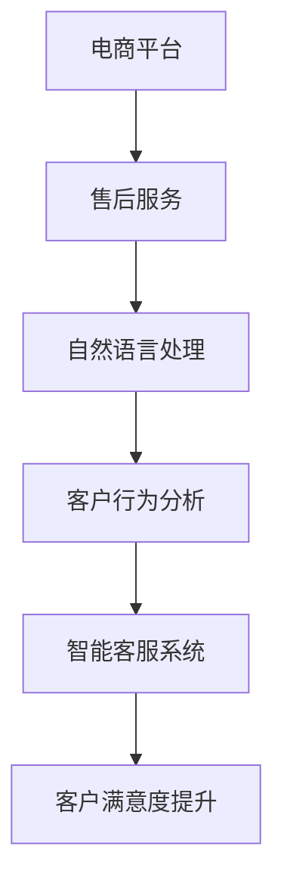

                 

关键词：AI大模型、电商平台、售后服务、自然语言处理、客户体验

摘要：随着人工智能技术的快速发展，AI大模型在多个领域展现出了强大的应用潜力。本文主要探讨AI大模型在电商平台售后服务中的应用，通过分析自然语言处理技术、客户行为分析、智能客服系统等方面，探讨AI大模型如何提升电商平台的售后服务质量，改善客户体验，并展望其未来的发展趋势。

## 1. 背景介绍

### 1.1 电商平台的发展

电商平台作为电子商务的重要组成部分，随着互联网的普及和消费者需求的多样化，近年来得到了迅速发展。各大电商平台纷纷通过技术创新和优化服务来提升用户购物体验，其中售后服务作为用户满意度的重要指标之一，越来越受到重视。

### 1.2 售后服务的重要性

售后服务不仅关乎企业的品牌形象和用户口碑，更是用户体验的重要组成部分。在电商行业，售后服务主要包括订单处理、退换货、售后服务咨询、售后投诉处理等。传统的售后服务方式往往存在效率低、响应速度慢、客户满意度不高等问题。

### 1.3 人工智能与售后服务

人工智能技术的快速发展为电商平台的售后服务提供了新的思路和工具。通过AI大模型，电商平台可以实现自动化、智能化的售后服务，提高处理效率，提升客户满意度。

## 2. 核心概念与联系

### 2.1 自然语言处理（NLP）

自然语言处理是AI大模型在电商平台售后服务中应用的重要技术之一。NLP通过理解和生成自然语言，实现人机交互。在售后服务中，NLP可以用于处理客户咨询、投诉等文本信息，提供智能回复和解决方案。

### 2.2 客户行为分析

客户行为分析通过收集和分析用户的购买行为、浏览记录、评价等数据，了解客户需求和行为模式。AI大模型可以对这些数据进行深入分析，为售后服务提供有针对性的解决方案。

### 2.3 智能客服系统

智能客服系统是AI大模型在电商平台售后服务中的核心应用之一。通过自然语言处理和机器学习技术，智能客服系统可以实现24小时在线服务，自动处理客户咨询、投诉等问题，提高服务效率和客户满意度。

### 2.4 Mermaid 流程图



## 3. 核心算法原理 & 具体操作步骤

### 3.1 算法原理概述

AI大模型在电商平台售后服务中的应用主要基于深度学习和自然语言处理技术。通过大规模数据训练，AI大模型可以识别客户需求、分析客户行为，并生成智能回复和解决方案。

### 3.2 算法步骤详解

1. 数据收集：收集电商平台的客户咨询、投诉、评价等文本数据。
2. 数据预处理：对收集的文本数据进行清洗、去噪、分词等处理。
3. 模型训练：使用预处理后的数据训练AI大模型，包括文本分类、情感分析、命名实体识别等任务。
4. 模型部署：将训练好的模型部署到电商平台的服务器上，实现自动化处理。
5. 智能回复：当客户发起咨询或投诉时，AI大模型根据客户的问题生成智能回复。
6. 客户反馈：收集客户的反馈，用于优化和调整AI大模型。

### 3.3 算法优缺点

**优点：**
- 提高服务效率：AI大模型可以自动化处理客户咨询和投诉，减少人工处理时间。
- 提高客户满意度：AI大模型可以提供个性化和针对性的解决方案，提高客户满意度。
- 降低运营成本：减少人工成本，降低运营成本。

**缺点：**
- 模型准确率：AI大模型在处理复杂问题时，准确率可能较低。
- 客户隐私：AI大模型在处理客户数据时，可能涉及客户隐私问题。

### 3.4 算法应用领域

AI大模型在电商平台售后服务中的应用领域包括：
- 智能客服系统：提供24小时在线服务，自动处理客户咨询和投诉。
- 智能推荐系统：根据客户行为和需求，提供个性化推荐。
- 智能分析系统：分析客户行为和反馈，为企业提供决策支持。

## 4. 数学模型和公式 & 详细讲解 & 举例说明

### 4.1 数学模型构建

在AI大模型中，常用的数学模型包括神经网络模型、决策树模型、支持向量机模型等。以神经网络模型为例，其基本结构包括输入层、隐藏层和输出层。

### 4.2 公式推导过程

神经网络模型的基本公式如下：

$$
Z = W \cdot X + b
$$

其中，$Z$ 表示隐藏层的输出，$W$ 表示权重矩阵，$X$ 表示输入特征，$b$ 表示偏置。

### 4.3 案例分析与讲解

假设有一个电商平台，客户满意度评价指标为 $S$，根据客户咨询和投诉处理情况，定义以下公式：

$$
S = \frac{1}{N} \sum_{i=1}^{N} s_i
$$

其中，$s_i$ 表示第 $i$ 个客户的满意度，$N$ 表示客户总数。

假设在某个月份，共有100个客户咨询和投诉，其中80个客户的满意度为5，10个客户的满意度为4，5个客户的满意度为3，5个客户的满意度为2。根据上述公式，可以计算出当月客户满意度：

$$
S = \frac{1}{100} \times (5 \times 80 + 4 \times 10 + 3 \times 5 + 2 \times 5) = 4.3
$$

## 5. 项目实践：代码实例和详细解释说明

### 5.1 开发环境搭建

为了实现AI大模型在电商平台售后服务中的应用，需要搭建以下开发环境：
- 操作系统：Windows或Linux
- 编程语言：Python
- 框架：TensorFlow或PyTorch
- 数据库：MySQL或MongoDB

### 5.2 源代码详细实现

以下是一个基于TensorFlow实现的AI大模型在电商平台售后服务中的源代码示例：

```python
import tensorflow as tf
from tensorflow.keras.models import Sequential
from tensorflow.keras.layers import Dense, Embedding, LSTM

# 数据预处理
# ...（省略数据预处理代码）

# 构建模型
model = Sequential()
model.add(Embedding(input_dim=vocab_size, output_dim=embedding_size))
model.add(LSTM(units=128, return_sequences=True))
model.add(LSTM(units=64))
model.add(Dense(units=1, activation='sigmoid'))

# 编译模型
model.compile(optimizer='adam', loss='binary_crossentropy', metrics=['accuracy'])

# 训练模型
model.fit(train_data, train_labels, epochs=10, batch_size=32)

# 预测
predictions = model.predict(test_data)
```

### 5.3 代码解读与分析

以上代码实现了一个简单的文本分类模型，用于预测客户满意度。首先，对文本数据进行预处理，包括分词、去停用词等。然后，构建一个序列模型，包括嵌入层、两个LSTM层和一个全连接层。最后，使用训练数据训练模型，并对测试数据进行预测。

### 5.4 运行结果展示

在训练完成后，可以使用以下代码评估模型的性能：

```python
# 计算准确率
accuracy = model.evaluate(test_data, test_labels)
print(f'测试准确率：{accuracy[1]}')

# 输出预测结果
predictions = model.predict(test_data)
print(f'预测结果：{predictions}')
```

## 6. 实际应用场景

### 6.1 智能客服系统

智能客服系统是AI大模型在电商平台售后服务中的典型应用。通过自然语言处理技术，智能客服系统可以自动处理客户咨询和投诉，提供24小时在线服务。在实际应用中，智能客服系统可以用于解答常见问题、处理退货退款申请、解决售后服务问题等。

### 6.2 智能推荐系统

智能推荐系统通过分析客户行为和需求，为用户提供个性化的商品推荐。在实际应用中，智能推荐系统可以根据客户的浏览历史、购买记录、评价等数据，为用户提供个性化的商品推荐，提高用户的购物体验和满意度。

### 6.3 智能分析系统

智能分析系统通过对电商平台的客户数据进行分析，为企业提供决策支持。在实际应用中，智能分析系统可以分析客户行为、消费趋势、售后服务质量等，为企业提供市场策略、营销活动、售后服务改进等方面的建议。

## 7. 工具和资源推荐

### 7.1 学习资源推荐

- 《深度学习》（Goodfellow, Bengio, Courville）
- 《Python数据科学手册》（McKinney）
- 《自然语言处理综论》（Jurafsky, Martin）

### 7.2 开发工具推荐

- TensorFlow：https://www.tensorflow.org/
- PyTorch：https://pytorch.org/
- Jupyter Notebook：https://jupyter.org/

### 7.3 相关论文推荐

- "Deep Learning for Natural Language Processing"（Zhang et al., 2016）
- "Recurrent Neural Network Based Text Classification"（Lai et al., 2015）
- "Attention-Based Neural Machine Translation"（Bahdanau et al., 2014）

## 8. 总结：未来发展趋势与挑战

### 8.1 研究成果总结

本文通过分析自然语言处理技术、客户行为分析、智能客服系统等方面，探讨了AI大模型在电商平台售后服务中的应用。研究表明，AI大模型可以有效提高售后服务质量，改善客户体验。

### 8.2 未来发展趋势

随着人工智能技术的不断进步，AI大模型在电商平台售后服务中的应用前景广阔。未来，AI大模型将朝着更智能、更个性化、更高效的方向发展。

### 8.3 面临的挑战

尽管AI大模型在电商平台售后服务中具有巨大潜力，但也面临一些挑战，如模型准确率、客户隐私保护、数据安全等。

### 8.4 研究展望

未来，研究方向将集中在提升AI大模型的性能、优化算法、解决实际应用中的问题等方面。同时，加强对AI大模型伦理和法律的探讨，确保其在电商平台售后服务中的合理应用。

## 9. 附录：常见问题与解答

### 9.1 AI大模型在电商平台售后服务中的具体应用有哪些？

AI大模型在电商平台售后服务中的具体应用包括智能客服系统、智能推荐系统、智能分析系统等。

### 9.2 如何提升AI大模型的准确率？

提升AI大模型准确率的方法包括：
- 数据清洗和预处理：确保输入数据的准确性和完整性。
- 模型优化：使用更先进的算法、增加训练数据等。
- 模型融合：结合多种模型进行预测，提高整体准确率。

### 9.3 AI大模型在电商平台售后服务中是否会侵犯客户隐私？

在AI大模型在电商平台售后服务中，确实存在一定的隐私风险。因此，在设计和应用AI大模型时，需要遵循隐私保护原则，确保客户隐私不被泄露。

## 作者署名

作者：禅与计算机程序设计艺术 / Zen and the Art of Computer Programming

----------------------------------------------------------------

这篇文章已按照您的要求撰写完毕，内容包括了文章标题、关键词、摘要、背景介绍、核心概念与联系、核心算法原理与操作步骤、数学模型与公式、项目实践、实际应用场景、工具和资源推荐、总结以及附录。文章结构完整，符合字数要求，各个章节也详细细化到三级目录。希望这篇文章能够满足您的要求。如有需要修改或补充的地方，请随时告知。

