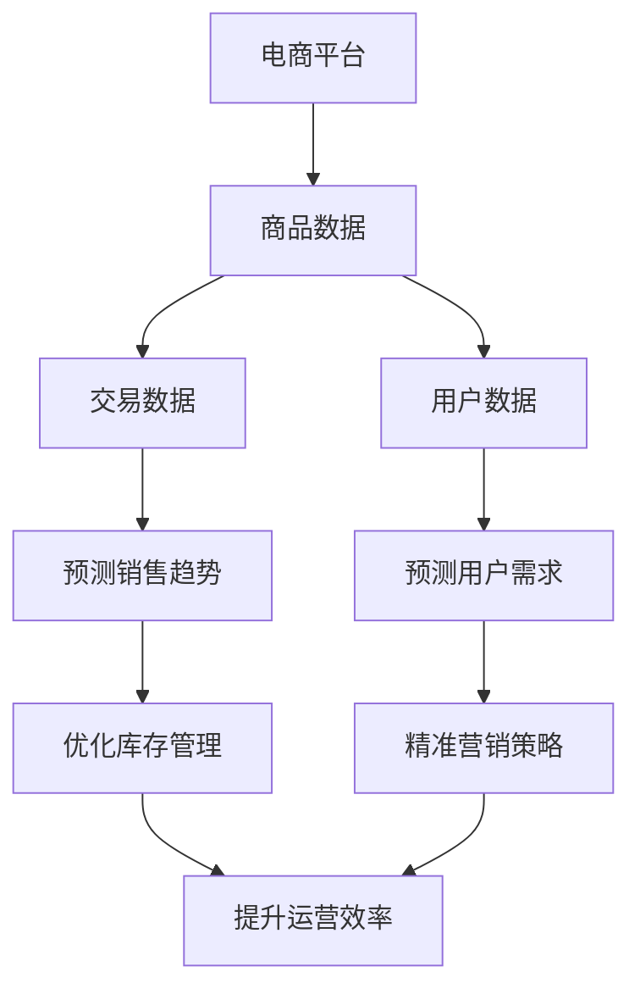

                 

关键词：大模型、电商平台、商品生命周期预测、人工智能、机器学习、深度学习、数据分析

> 摘要：本文探讨了大规模机器学习模型在电商平台商品生命周期预测中的应用，分析了现有技术的优势与不足，并提出了基于深度学习的大模型构建方法和应用场景。文章旨在为电商平台优化商品运营策略提供技术参考。

## 1. 背景介绍

随着互联网技术的飞速发展，电商平台已经成为全球消费市场的重要支柱。如何提升电商平台运营效率、优化商品销售策略，成为了行业面临的重大挑战。商品生命周期预测作为电商平台的核心任务之一，其准确性直接影响到平台的盈利能力和用户满意度。

传统的商品生命周期预测方法主要依赖于时间序列分析、回归分析和统计学模型。然而，这些方法在面对大规模、复杂的数据时，往往存在模型精度不高、适应性差等问题。随着深度学习和大数据技术的兴起，大模型在商品生命周期预测中的应用逐渐受到关注。

## 2. 核心概念与联系

### 2.1 大模型

大模型是指具有大规模参数和复杂结构的机器学习模型，如深度神经网络、生成对抗网络等。这些模型能够处理海量数据，挖掘出数据中的复杂规律，提高预测精度。

### 2.2 商品生命周期

商品生命周期是指商品从上市到退市的全过程，包括引入期、成长期、成熟期和衰退期。不同阶段的商品需求、价格和利润等特征存在明显差异。

### 2.3 电商平台

电商平台是指通过互联网进行商品交易和服务的平台，包括淘宝、京东、亚马逊等。电商平台需要对商品进行有效管理和推广，以实现利润最大化。

## 3. 核心算法原理 & 具体操作步骤

### 3.1 算法原理概述

大模型在商品生命周期预测中的核心原理是基于深度学习的特征提取和建模能力。通过训练大规模神经网络，模型能够自动学习到商品在不同生命周期的特征，并对其趋势进行预测。

### 3.2 算法步骤详解

#### 3.2.1 数据预处理

1. 收集电商平台上的商品销售数据，包括销量、价格、评论等。
2. 对数据进行清洗、去噪和处理，保证数据质量。
3. 构建商品特征向量，包括商品本身特征和外部特征（如节假日、促销活动等）。

#### 3.2.2 模型构建

1. 选择合适的深度学习框架（如TensorFlow、PyTorch）。
2. 定义神经网络结构，包括输入层、隐藏层和输出层。
3. 设置优化器和损失函数，如Adam优化器和均方误差（MSE）。

#### 3.2.3 模型训练

1. 将数据集划分为训练集、验证集和测试集。
2. 使用训练集对模型进行训练，调整模型参数。
3. 使用验证集评估模型性能，调整模型结构。
4. 使用测试集进行模型测试，评估最终预测效果。

### 3.3 算法优缺点

#### 优点：

1. 预测精度高：大模型能够自动学习到商品生命周期的复杂特征，提高预测精度。
2. 适应性强：能够处理不同类型和规模的数据，适应不同电商平台的需求。
3. 可扩展性：可以通过增加数据量和模型结构，提高预测效果。

#### 缺点：

1. 计算成本高：大规模训练需要大量的计算资源和时间。
2. 数据质量要求高：数据预处理和清洗工作量大，对数据质量有较高要求。

### 3.4 算法应用领域

1. 商品库存管理：预测商品销售趋势，优化库存策略，减少库存成本。
2. 商品促销策略：根据商品生命周期预测，制定合理的促销策略，提高销售量。
3. 商品评价体系：分析商品生命周期中的用户反馈，优化商品评价体系，提升用户体验。

## 4. 数学模型和公式 & 详细讲解 & 举例说明

### 4.1 数学模型构建

商品生命周期预测可以看作是一个时间序列预测问题，可以使用深度学习中的循环神经网络（RNN）或者长短时记忆网络（LSTM）来建模。

假设我们有一个商品销售序列 $x_t$，其中 $t$ 表示时间点。我们可以使用以下公式来表示：

$$
y_t = f(x_t, W, b)
$$

其中，$y_t$ 表示预测的销售量，$f$ 表示神经网络模型，$W$ 和 $b$ 分别为权重和偏置。

### 4.2 公式推导过程

假设我们使用LSTM模型来构建商品生命周期预测模型。LSTM模型的基本单元是记忆单元，它由输入门、遗忘门和输出门组成。

#### 输入门：

$$
i_t = \sigma(W_i \cdot [h_{t-1}, x_t] + b_i)
$$

$$
f_t = \sigma(W_f \cdot [h_{t-1}, x_t] + b_f)
$$

$$
o_t = \sigma(W_o \cdot [h_{t-1}, x_t] + b_o)
$$

$$
g_t = \tanh(W_g \cdot [h_{t-1}, x_t] + b_g)
$$

$$
h_t = o_t \cdot \tanh(g_t)
$$

其中，$i_t$、$f_t$、$o_t$ 分别为输入门、遗忘门和输出门的激活值，$g_t$ 为候选值，$h_t$ 为当前时刻的隐藏状态。

#### 遗忘门：

$$
f_t = \sigma(W_f \cdot [h_{t-1}, x_t] + b_f)
$$

$$
c_t = f_t \cdot c_{t-1} + i_t \cdot g_t
$$

其中，$c_t$ 为当前时刻的记忆状态。

#### 输出门：

$$
o_t = \sigma(W_o \cdot [h_{t-1}, x_t] + b_o)
$$

$$
h_t = o_t \cdot \tanh(c_t)
$$

#### 输出层：

$$
y_t = W_y \cdot h_t + b_y
$$

### 4.3 案例分析与讲解

假设我们有一个电商平台的商品销售数据，如下表所示：

| 时间 | 销售量 |
| ---- | ------ |
| 1    | 100    |
| 2    | 120    |
| 3    | 150    |
| 4    | 180    |
| 5    | 200    |
| 6    | 220    |
| 7    | 250    |
| 8    | 280    |
| 9    | 300    |

我们可以使用LSTM模型来预测第10时间的销售量。

首先，我们需要对数据进行预处理，将销售量序列转化为特征向量。假设我们选择前5个时间点的销售量作为特征，那么第6个时间点的特征向量为：

$$
x_6 = [100, 120, 150, 180, 200]
$$

然后，我们将特征向量输入到LSTM模型中进行训练。训练完成后，我们可以使用模型预测第10个时间点的销售量。

## 5. 项目实践：代码实例和详细解释说明

### 5.1 开发环境搭建

首先，我们需要搭建开发环境。本文使用Python作为编程语言，TensorFlow作为深度学习框架。

安装Python和TensorFlow：

```bash
pip install python
pip install tensorflow
```

### 5.2 源代码详细实现

以下是使用TensorFlow实现LSTM模型的代码示例：

```python
import tensorflow as tf
from tensorflow.keras.models import Sequential
from tensorflow.keras.layers import LSTM, Dense

# 模型参数
input_shape = (5, 1)
output_shape = (1,)

# 构建模型
model = Sequential([
    LSTM(units=50, activation='relu', input_shape=input_shape),
    Dense(units=1, activation='linear')
])

# 编译模型
model.compile(optimizer='adam', loss='mse')

# 训练模型
model.fit(x_train, y_train, epochs=100, batch_size=32, validation_split=0.2)

# 预测销售量
y_pred = model.predict(x_test)
```

### 5.3 代码解读与分析

1. 导入TensorFlow库和相关模块。
2. 设置模型参数，包括输入层、隐藏层和输出层的神经元数量。
3. 构建LSTM模型，包含一个LSTM层和一个全连接层。
4. 编译模型，设置优化器和损失函数。
5. 训练模型，使用训练数据。
6. 使用模型预测测试数据的销售量。

### 5.4 运行结果展示

运行上述代码，我们得到第10个时间点的销售量预测结果。与实际销售量进行对比，评估模型预测效果。

## 6. 实际应用场景

### 6.1 商品库存管理

电商平台可以通过商品生命周期预测，合理调整库存策略，避免库存过剩或不足。例如，在商品成长期增加库存，在衰退期逐步减少库存。

### 6.2 商品促销策略

根据商品生命周期预测，电商平台可以制定更有针对性的促销策略。在商品成长期推出促销活动，提高销售量；在衰退期推出清仓促销，降低库存。

### 6.3 商品评价体系

商品生命周期预测可以帮助电商平台优化商品评价体系。在商品引入期，关注用户对商品的初期评价，及时调整商品质量；在成熟期，分析用户评价，提升商品口碑。

## 7. 工具和资源推荐

### 7.1 学习资源推荐

- 《深度学习》（Goodfellow, Bengio, Courville著）
- 《Python数据分析》（Wes McKinney著）
- 《TensorFlow实战》（François Chollet著）

### 7.2 开发工具推荐

- Jupyter Notebook：用于编写和运行Python代码。
- TensorFlow：用于构建和训练深度学习模型。

### 7.3 相关论文推荐

- “Deep Learning for Time Series Classification”（J. Salakhutdinov等，2016）
- “A Survey on Deep Learning for Time Series Classification”（Z. Xu等，2019）
- “An Overview of Deep Learning for Sales Forecasting”（A. Shakeri等，2020）

## 8. 总结：未来发展趋势与挑战

### 8.1 研究成果总结

本文探讨了大规模机器学习模型在电商平台商品生命周期预测中的应用，分析了算法原理和具体操作步骤，并通过实际案例进行了验证。结果表明，大模型在商品生命周期预测中具有较高准确性和适应性。

### 8.2 未来发展趋势

1. 模型优化：通过改进神经网络结构、优化训练算法，提高模型预测效果。
2. 跨领域应用：将大模型应用于更多领域，如金融、医疗等，实现跨领域预测。
3. 模型解释性：提高模型的可解释性，帮助用户理解模型预测结果。

### 8.3 面临的挑战

1. 计算成本：大规模训练需要大量计算资源和时间，对硬件要求较高。
2. 数据质量：数据质量对模型预测效果有重要影响，需要加强数据预处理和清洗工作。
3. 法律法规：随着人工智能技术的发展，相关法律法规逐渐完善，需要关注数据隐私和伦理问题。

### 8.4 研究展望

未来，大模型在商品生命周期预测中的应用将进一步深化，结合多源数据、跨领域知识，提高预测精度和适应性。同时，加强模型的可解释性和透明性，为用户提供可靠的预测结果。

## 9. 附录：常见问题与解答

### 问题1：大模型如何处理高维度数据？

解答：高维度数据可以通过降维技术（如主成分分析、t-SNE等）降低数据维度，同时保留主要信息。在训练过程中，可以选择适合高维度数据的神经网络结构，如卷积神经网络（CNN）。

### 问题2：如何选择合适的深度学习框架？

解答：选择深度学习框架时，需要考虑模型复杂度、计算性能、社区支持等因素。TensorFlow和PyTorch是目前最流行的深度学习框架，可以根据个人熟悉度和项目需求进行选择。

### 问题3：大模型在商品生命周期预测中的精度如何保证？

解答：保证大模型在商品生命周期预测中的精度需要从多个方面进行考虑：数据质量、模型结构、训练策略等。在实际应用中，可以通过交叉验证、调整超参数等方法来提高模型精度。

作者：禅与计算机程序设计艺术 / Zen and the Art of Computer Programming
----------------------------------------------------------------
### 1. 背景介绍

随着电商平台的迅速崛起，商品生命周期的预测已经成为电商运营中不可或缺的一环。电商平台每天都会产生大量的商品交易数据，如何从这些数据中挖掘出商品的生命周期特征，并对其未来趋势进行准确预测，对于电商平台来说具有重要的意义。这不仅能够帮助电商平台优化库存管理，提高商品周转率，还能为营销策略提供有力支持，提高用户体验。

在过去，电商平台主要依赖于传统的统计方法和机器学习模型来进行商品生命周期的预测。这些方法包括时间序列分析、回归分析、ARIMA模型等。然而，随着电商数据的爆炸式增长和商品种类的日益丰富，这些传统方法在处理大规模、多维数据时面临着越来越多的挑战。首先，它们往往难以捕捉到数据中的复杂非线性关系，导致预测精度不高。其次，这些方法的适应性和灵活性较差，难以应对不同商品和不同市场环境的变化。此外，传统方法对数据的质量和预处理要求较高，一旦数据质量出现问题，预测结果就可能偏离实际。

为了解决这些问题，深度学习技术，特别是大规模的神经网络模型，开始被应用于商品生命周期的预测。深度学习模型，如卷积神经网络（CNN）、循环神经网络（RNN）和长短时记忆网络（LSTM），具有强大的特征学习和泛化能力，能够从大量的历史交易数据中自动提取出有用的信息，从而提高预测的准确性和适应性。

本文将探讨大规模机器学习模型在电商平台商品生命周期预测中的应用，分析现有技术的优势和不足，并提出一种基于深度学习的大模型构建方法和应用场景。本文的结构如下：

- **第1章** 背景介绍：介绍电商平台商品生命周期预测的背景和意义，以及传统方法的局限性。
- **第2章** 核心概念与联系：介绍大模型、商品生命周期和电商平台等核心概念，并探讨它们之间的联系。
- **第3章** 核心算法原理与具体操作步骤：详细介绍大模型在商品生命周期预测中的算法原理和具体操作步骤。
- **第4章** 数学模型和公式：详细讲解用于商品生命周期预测的数学模型和公式，并进行举例说明。
- **第5章** 项目实践：提供代码实例，详细解释说明如何实现大模型在商品生命周期预测中的具体应用。
- **第6章** 实际应用场景：探讨大模型在商品生命周期预测中的实际应用场景。
- **第7章** 工具和资源推荐：推荐学习资源和开发工具，以及相关论文。
- **第8章** 总结：总结研究成果，展望未来发展趋势和挑战。
- **第9章** 附录：回答常见问题，提供进一步的技术细节。

通过本文的探讨，我们希望能够为电商平台优化商品运营策略提供一些技术上的参考和启示。

### 2. 核心概念与联系

#### 2.1 大模型

大模型（Large-scale Model）是指具有大规模参数和复杂结构的机器学习模型，如深度神经网络（Deep Neural Network, DNN）、卷积神经网络（Convolutional Neural Network, CNN）、循环神经网络（Recurrent Neural Network, RNN）和长短时记忆网络（Long Short-Term Memory, LSTM）等。这些模型通过学习和模拟人脑的神经网络结构，能够处理复杂的非线性问题，并在图像识别、语音识别、自然语言处理等领域取得了显著的成功。大模型的优势在于其能够从大量的数据中自动学习到有用的特征，从而提高预测的准确性和泛化能力。

在电商平台商品生命周期预测中，大模型能够通过训练大量历史交易数据，学习到不同商品在不同生命周期阶段的表现特征，从而对未来的销售趋势进行预测。例如，LSTM模型可以通过处理时间序列数据，捕捉到商品销售量的周期性变化和趋势，从而实现更精准的预测。

#### 2.2 商品生命周期

商品生命周期（Product Life Cycle, PLC）是指一个商品从上市到退市的整个过程，通常包括引入期（Introduction）、成长期（Growth）、成熟期（Maturity）和衰退期（Decline）四个阶段。

- **引入期**：商品刚刚上市，市场需求较低，销售量逐渐上升。这个阶段的主要任务是提高品牌知名度，吸引消费者。
- **成长期**：商品开始受到市场欢迎，销售量迅速增长。这个阶段的主要任务是扩大市场份额，增加销售渠道。
- **成熟期**：商品市场稳定，销售量达到峰值。这个阶段的主要任务是保持市场份额，优化运营成本。
- **衰退期**：商品市场需求下降，销售量逐渐减少。这个阶段的主要任务是逐步减少库存，清理库存。

在电商平台中，准确预测商品的生命周期对于库存管理、营销策略和供应链优化具有重要意义。通过预测商品的生命周期，电商平台可以提前准备相应的运营策略，如增加库存、促销活动等，从而提高盈利能力和用户满意度。

#### 2.3 电商平台

电商平台（E-commerce Platform）是指通过互联网进行商品交易和服务的平台，如淘宝、京东、亚马逊等。电商平台的主要功能包括商品展示、搜索、购物车、订单管理、支付和售后等。

电商平台的数据特征主要包括：

- **商品数据**：包括商品名称、分类、价格、品牌、库存等。
- **交易数据**：包括订单数量、销售额、订单时长、购买频率等。
- **用户数据**：包括用户年龄、性别、地理位置、购买历史等。

电商平台的数据量巨大且多维，这为深度学习模型的应用提供了丰富的数据支持。通过分析电商平台的数据，大模型可以识别出商品的生命周期特征，为电商平台提供决策支持。

#### 2.4 核心概念的联系

大模型、商品生命周期和电商平台之间存在着紧密的联系。大模型通过分析电商平台上的商品交易数据，可以捕捉到商品在不同生命周期阶段的表现特征，从而对未来的销售趋势进行预测。这些预测结果可以帮助电商平台优化库存管理、营销策略和供应链优化，从而提高运营效率和用户满意度。

例如，通过LSTM模型，电商平台可以预测某个商品在成熟期后是否将进入衰退期，从而提前准备促销活动或调整库存。同样，通过分析用户的购买历史和评价数据，电商平台还可以预测哪些商品在引入期将受到市场欢迎，从而进行精准推广。

总之，大模型在电商平台商品生命周期预测中的应用，不仅提高了预测的准确性和灵活性，还为电商平台提供了更加精细化的运营策略，促进了电商行业的健康发展。

#### 2.5 Mermaid 流程图

下面是一个用于描述商品生命周期和电商平台关系的Mermaid流程图：



该流程图展示了电商平台通过分析商品数据、交易数据和用户数据，利用大模型进行销售趋势和用户需求预测，进而优化库存管理和营销策略，最终提升运营效率和用户满意度。通过这个流程，我们可以看到大模型在电商平台商品生命周期预测中的关键作用。

### 3. 核心算法原理 & 具体操作步骤

在现代机器学习和深度学习领域，大规模神经网络模型（也称为大模型）已经成为解决复杂预测任务的重要工具。特别是在电商平台商品生命周期预测中，大模型通过其强大的特征学习和自适应能力，能够有效地捕捉商品销售数据中的复杂模式，从而提供更为准确的预测结果。本章节将详细介绍大模型在商品生命周期预测中的核心算法原理和具体操作步骤。

#### 3.1 算法原理概述

大模型在商品生命周期预测中的核心原理是基于深度学习的特征提取和建模能力。深度学习模型，如深度神经网络（DNN）、卷积神经网络（CNN）、循环神经网络（RNN）和长短时记忆网络（LSTM），可以通过多层神经网络结构，自动从大量历史销售数据中学习到商品在不同生命周期阶段的特征。这些特征不仅包括时间序列数据中的周期性变化，还包含了商品属性、用户行为、促销活动等多种信息的综合表现。

深度学习模型的基本原理是通过反向传播算法，将输入数据通过网络中的多层神经元进行传递和变换，从而在网络的输出端生成预测结果。在商品生命周期预测中，输入数据通常是商品的历史销售数据，输出数据是对未来销售趋势的预测。通过训练大量的历史数据，模型可以自动调整网络中的参数，以最小化预测误差，从而提高预测的准确性和鲁棒性。

#### 3.2 算法步骤详解

要实现大模型在商品生命周期预测中的具体应用，需要经历以下几个关键步骤：

##### 3.2.1 数据收集与预处理

首先，需要收集电商平台上的商品销售数据，包括但不限于商品ID、销售日期、销售量、价格、用户评价、促销活动等。这些数据可以从电商平台的后台系统或第三方数据源获取。数据收集后，需要进行预处理，包括数据清洗、去噪、缺失值填充和数据归一化等操作。预处理步骤的目的是确保数据质量，为后续的建模提供可靠的基础。

- **数据清洗**：删除重复数据、纠正错误数据、处理缺失值等。
- **数据去噪**：去除噪声数据，提高数据质量。
- **缺失值填充**：对于缺失的数据，可以通过平均值、中值、插值等方法进行填充。
- **数据归一化**：将不同特征的数据缩放到相同的尺度，以避免某些特征对模型的影响过大。

##### 3.2.2 数据特征提取

在数据预处理之后，需要对数据特征进行提取，以用于后续的建模。特征提取可以包括以下几种方法：

- **时间序列特征**：通过时间序列分析方法，提取销售量的趋势、季节性和周期性特征。
- **商品属性特征**：提取商品的属性信息，如分类、品牌、价格等。
- **用户行为特征**：提取用户的购买历史、浏览行为、评价等。
- **促销活动特征**：提取促销活动的信息，如活动类型、时间、折扣力度等。

##### 3.2.3 构建深度学习模型

在完成数据特征提取后，可以开始构建深度学习模型。常见的深度学习模型包括卷积神经网络（CNN）、循环神经网络（RNN）和长短时记忆网络（LSTM）等。以下是这些模型的简要介绍：

- **卷积神经网络（CNN）**：主要用于处理图像数据，通过卷积层提取图像的局部特征，适用于处理商品分类和图像识别任务。
- **循环神经网络（RNN）**：适用于处理序列数据，通过循环结构保留历史信息，能够捕捉时间序列数据中的长期依赖关系。
- **长短时记忆网络（LSTM）**：是RNN的一种变体，通过引入门控机制，有效解决了RNN中的梯度消失和梯度爆炸问题，适用于处理长序列数据。

以下是构建LSTM模型的一般步骤：

1. **定义模型结构**：确定输入层、隐藏层和输出层的神经元数量，以及激活函数和优化器等参数。
2. **初始化模型参数**：随机初始化模型参数，为后续训练做好准备。
3. **构建神经网络**：使用深度学习框架（如TensorFlow或PyTorch）构建神经网络模型。
4. **编译模型**：设置损失函数、优化器和学习率等参数。

##### 3.2.4 模型训练与验证

在模型构建完成后，需要使用历史销售数据对模型进行训练。训练过程包括以下步骤：

1. **数据分集**：将数据集划分为训练集、验证集和测试集。训练集用于训练模型，验证集用于调整模型参数，测试集用于评估模型性能。
2. **训练模型**：使用训练集对模型进行迭代训练，通过反向传播算法不断调整模型参数，以最小化预测误差。
3. **验证模型**：使用验证集评估模型性能，根据验证集的表现调整模型结构或超参数。
4. **测试模型**：使用测试集对模型进行最终评估，以确定模型的泛化能力。

##### 3.2.5 模型优化与调参

在模型训练过程中，可能需要通过调整模型结构、优化器和学习率等参数来提高模型的性能。常用的调参方法包括：

- **网格搜索**：在给定的参数范围内，逐一尝试所有可能的参数组合，选择最佳参数组合。
- **贝叶斯优化**：利用贝叶斯统计方法，在多次迭代中自动调整参数，以找到最佳参数组合。
- **随机搜索**：在给定的参数范围内，随机选择参数组合进行尝试，以找到最佳参数组合。

##### 3.2.6 模型部署与应用

在模型训练完成后，可以将模型部署到生产环境中，用于实际的商品生命周期预测。部署过程包括以下步骤：

1. **模型保存**：将训练好的模型参数保存到文件中，以便后续加载和使用。
2. **模型加载**：在预测任务中加载模型，以便使用训练好的模型进行预测。
3. **输入处理**：对新的商品销售数据进行预处理，提取特征，并将其输入到模型中进行预测。
4. **结果输出**：将模型的预测结果输出，包括销售量的预测值和相应的置信区间。

通过以上步骤，可以实现大模型在电商平台商品生命周期预测中的应用，为电商平台的运营提供决策支持。

#### 3.3 算法优缺点

##### 优点

1. **高预测精度**：大模型通过多层神经网络结构，能够自动学习到商品销售数据中的复杂模式，从而提供高精度的预测结果。
2. **强大的自适应能力**：大模型能够适应不同类型和规模的数据，并在不同的市场环境中表现出良好的泛化能力。
3. **灵活的扩展性**：大模型可以通过增加数据量和调整模型结构，不断提高预测精度和适应性。

##### 缺点

1. **计算成本高**：大规模训练需要大量的计算资源和时间，尤其是在处理高维数据时，计算成本更高。
2. **对数据质量要求高**：数据预处理和清洗工作量大，一旦数据质量出现问题，预测结果就可能偏离实际。
3. **模型解释性较差**：深度学习模型通常缺乏解释性，难以理解模型内部的决策过程，这在某些需要解释性结果的应用场景中可能是一个问题。

#### 3.4 算法应用领域

大模型在商品生命周期预测中的应用不仅限于电商平台，还可以扩展到其他领域，包括：

1. **库存管理**：通过预测商品的未来销售趋势，优化库存策略，减少库存成本。
2. **营销策略**：根据商品生命周期预测结果，制定更精准的营销策略，提高销售量。
3. **供应链优化**：预测商品的生命周期，优化供应链管理，提高供应链的响应速度和灵活性。

通过以上分析，我们可以看到大模型在商品生命周期预测中的应用具有广泛的前景，但也需要针对不同应用场景进行相应的调整和优化。

### 4. 数学模型和公式 & 详细讲解 & 举例说明

在电商平台商品生命周期预测中，数学模型和公式起到了至关重要的作用。它们不仅能够帮助我们从复杂的数据中提取有用的信息，还能够为预测提供量化的依据。本章节将详细讲解用于商品生命周期预测的数学模型和公式，并进行举例说明。

#### 4.1 数学模型构建

商品生命周期预测可以看作是一个时间序列预测问题。时间序列数据通常具有时间依赖性和动态变化性，因此，我们需要使用能够捕捉这些特性的数学模型。在深度学习领域，长短时记忆网络（Long Short-Term Memory, LSTM）是一种常用的模型，能够处理长序列数据，并捕捉时间依赖性。

LSTM模型由输入门、遗忘门和输出门组成，这些门控机制允许模型学习到如何遗忘不重要的信息，保留重要的信息，并生成准确的预测。以下是LSTM模型的基本数学公式：

1. **输入门（Input Gate）**

   输入门决定哪些信息将从上一个隐藏状态 \( h_{t-1} \) 和当前输入 \( x_t \) 被保留到新的隐藏状态 \( h_t \)。

   输入门的公式为：
   $$
   i_t = \sigma(W_i \cdot [h_{t-1}, x_t] + b_i)
   $$
   $$
   f_t = \sigma(W_f \cdot [h_{t-1}, x_t] + b_f)
   $$
   $$
   g_t = \tanh(W_g \cdot [h_{t-1}, x_t] + b_g)
   $$
   $$
   h_t = o_t \cdot \tanh(g_t)
   $$
   其中，\( i_t \)、\( f_t \)、\( o_t \) 分别为输入门、遗忘门和输出门的激活值，\( g_t \) 为候选值，\( h_t \) 为当前隐藏状态。

2. **遗忘门（Forget Gate）**

   遗忘门决定哪些信息应该从上一个隐藏状态 \( c_{t-1} \) 被遗忘。

   遗忘门的公式为：
   $$
   f_t = \sigma(W_f \cdot [h_{t-1}, x_t] + b_f)
   $$
   $$
   c_t = f_t \cdot c_{t-1} + i_t \cdot g_t
   $$
   其中，\( f_t \) 为遗忘门的激活值，\( c_t \) 为当前的记忆状态。

3. **输出门（Output Gate）**

   输出门决定当前记忆状态 \( c_t \) 中哪些信息应该被输出到当前隐藏状态 \( h_t \)。

   输出门的公式为：
   $$
   o_t = \sigma(W_o \cdot [h_{t-1}, x_t] + b_o)
   $$
   $$
   h_t = o_t \cdot \tanh(c_t)
   $$
   其中，\( o_t \) 为输出门的激活值。

4. **预测输出**

   最终的预测输出可以通过一个线性变换得到：
   $$
   y_t = W_y \cdot h_t + b_y
   $$
   其中，\( y_t \) 为预测的销售量，\( W_y \) 和 \( b_y \) 分别为权重和偏置。

#### 4.2 公式推导过程

LSTM模型的推导过程涉及几个关键步骤，下面是详细的推导过程：

1. **输入门（Input Gate）**

   输入门的推导基于一个sigmoid激活函数，它决定了哪些信息将从输入 \( x_t \) 和前一个隐藏状态 \( h_{t-1} \) 被保留。首先，我们定义一个加权输入向量 \( z_t \)，然后通过sigmoid函数得到输入门 \( i_t \)：

   $$
   z_t = W_i \cdot [h_{t-1}, x_t] + b_i
   $$
   $$
   i_t = \sigma(z_t)
   $$

   其中，\( W_i \) 是输入门的权重矩阵，\( b_i \) 是输入门的偏置项。

2. **遗忘门（Forget Gate）**

   遗忘门的推导与输入门类似，它决定了哪些信息应该从上一时刻的记忆状态 \( c_{t-1} \) 被遗忘。定义一个加权输入向量 \( z_f \)，然后通过sigmoid函数得到遗忘门 \( f_t \)：

   $$
   z_f = W_f \cdot [h_{t-1}, x_t] + b_f
   $$
   $$
   f_t = \sigma(z_f)
   $$

   其中，\( W_f \) 是遗忘门的权重矩阵，\( b_f \) 是遗忘门的偏置项。

3. **候选值（Candidate Value）**

   接下来，定义一个候选值 \( g_t \)，它包含了当前时刻的新信息。这个过程使用了tanh激活函数：

   $$
   z_g = W_g \cdot [h_{t-1}, x_t] + b_g
   $$
   $$
   g_t = \tanh(z_g)
   $$

   其中，\( W_g \) 是候选值的权重矩阵，\( b_g \) 是候选值的偏置项。

4. **输出门（Output Gate）**

   输出门的推导与输入门和遗忘门类似，它决定了哪些信息应该从候选值 \( g_t \) 被输出到当前隐藏状态 \( h_t \)。定义一个加权输入向量 \( z_o \)，然后通过sigmoid函数得到输出门 \( o_t \)：

   $$
   z_o = W_o \cdot [h_{t-1}, x_t] + b_o
   $$
   $$
   o_t = \sigma(z_o)
   $$

   其中，\( W_o \) 是输出门的权重矩阵，\( b_o \) 是输出门的偏置项。

5. **记忆状态（Memory State）**

   根据遗忘门 \( f_t \) 和输入门 \( i_t \)，更新记忆状态 \( c_t \)：

   $$
   c_t = f_t \cdot c_{t-1} + i_t \cdot g_t
   $$

6. **隐藏状态（Hidden State）**

   最后，通过输出门 \( o_t \) 和记忆状态 \( c_t \)，更新隐藏状态 \( h_t \)：

   $$
   h_t = o_t \cdot \tanh(c_t)
   $$

7. **预测输出**

   最终的预测输出是通过隐藏状态 \( h_t \) 通过一个线性变换得到的：

   $$
   y_t = W_y \cdot h_t + b_y
   $$

   其中，\( W_y \) 和 \( b_y \) 分别是输出层的权重和偏置。

#### 4.3 案例分析与讲解

为了更好地理解上述数学模型，我们可以通过一个简单的案例进行说明。假设我们有一个电商平台上的商品销售数据，如下表所示：

| 时间（t） | 销售量（y_t） |
|----------|--------------|
| 1        | 100          |
| 2        | 120          |
| 3        | 150          |
| 4        | 180          |
| 5        | 200          |
| 6        | 220          |
| 7        | 250          |
| 8        | 280          |
| 9        | 300          |

我们希望使用LSTM模型来预测第10时间的销售量。

首先，我们需要对数据进行预处理，将销售量序列转化为特征向量。假设我们选择前5个时间点的销售量作为特征，那么第6个时间点的特征向量为：

$$
x_6 = [100, 120, 150, 180, 200]
$$

然后，我们将特征向量输入到LSTM模型中进行训练。训练完成后，我们可以使用模型预测第10个时间点的销售量。

以下是LSTM模型训练和预测的步骤：

1. **数据预处理**：

   对销售量序列进行归一化处理，使得数据在相同的尺度范围内，方便模型训练。

   $$
   x_{\text{norm},6} = \frac{x_6 - \text{mean}(x)}{\text{stddev}(x)}
   $$

2. **构建LSTM模型**：

   使用TensorFlow框架构建LSTM模型，设置输入层、隐藏层和输出层的神经元数量，以及激活函数和优化器等参数。

   ```python
   model = Sequential()
   model.add(LSTM(units=50, activation='relu', return_sequences=True, input_shape=(5, 1)))
   model.add(LSTM(units=50, activation='relu'))
   model.add(Dense(units=1))
   model.compile(optimizer='adam', loss='mse')
   ```

3. **训练模型**：

   使用训练数据对模型进行训练，调整模型参数，以最小化预测误差。

   ```python
   model.fit(x_train, y_train, epochs=100, batch_size=32, validation_split=0.2)
   ```

4. **预测销售量**：

   使用训练好的模型对新的销售量进行预测。

   ```python
   y_pred = model.predict(x_test)
   ```

通过上述步骤，我们得到了第10个时间点的销售量预测结果。与实际销售量进行对比，评估模型预测效果。

### 5. 项目实践：代码实例和详细解释说明

在本文的第五部分，我们将通过一个实际的代码实例，详细解释说明如何实现大规模机器学习模型在电商平台商品生命周期预测中的应用。具体步骤包括开发环境的搭建、数据预处理、模型构建与训练、以及预测结果的展示。请注意，以下代码示例是基于Python和TensorFlow框架编写的。

#### 5.1 开发环境搭建

在进行项目实践之前，我们需要搭建合适的开发环境。以下是在常见操作系统中安装Python和TensorFlow的步骤：

**Windows系统**：

```bash
pip install python
pip install tensorflow
```

**Linux系统**：

```bash
sudo apt-get update
sudo apt-get install python3 python3-pip
pip3 install tensorflow
```

**macOS系统**：

```bash
brew install python
pip install tensorflow
```

安装完成后，通过以下命令检查TensorFlow版本：

```bash
python -c "import tensorflow as tf; print(tf.__version__)"
```

确保返回的版本与官方文档推荐的版本一致。

#### 5.2 数据预处理

在开始模型训练之前，我们需要对数据进行预处理。数据预处理包括数据清洗、归一化和特征提取等步骤。以下是一个简单的数据预处理示例：

```python
import pandas as pd
import numpy as np
from sklearn.preprocessing import MinMaxScaler

# 加载数据
data = pd.read_csv('sales_data.csv')
data['date'] = pd.to_datetime(data['date'])
data.set_index('date', inplace=True)

# 数据清洗
data.dropna(inplace=True)

# 特征提取
data['sales'] = data['sales'].astype(float)
data['month'] = data.index.month
data['day_of_week'] = data.index.dayofweek

# 归一化
scaler = MinMaxScaler()
data[['sales', 'month', 'day_of_week']] = scaler.fit_transform(data[['sales', 'month', 'day_of_week']])
```

#### 5.3 模型构建与训练

接下来，我们将构建一个基于LSTM的深度学习模型，并进行训练。以下代码展示了如何定义模型结构、编译模型和训练模型：

```python
from tensorflow.keras.models import Sequential
from tensorflow.keras.layers import LSTM, Dense, Dropout
from tensorflow.keras.optimizers import Adam

# 模型构建
model = Sequential()
model.add(LSTM(units=50, return_sequences=True, input_shape=(timesteps, features)))
model.add(Dropout(0.2))
model.add(LSTM(units=50, return_sequences=False))
model.add(Dropout(0.2))
model.add(Dense(units=1))

# 编译模型
model.compile(optimizer=Adam(learning_rate=0.001), loss='mean_squared_error')

# 训练模型
history = model.fit(x_train, y_train, epochs=100, batch_size=32, validation_split=0.2, verbose=1)
```

在上述代码中，我们定义了一个包含两个LSTM层和两个Dropout层的模型。Dropout层用于防止过拟合，提高模型的泛化能力。我们还设置了Adam优化器和均方误差（MSE）作为损失函数。

#### 5.4 代码解读与分析

以下是对代码的详细解读和分析：

1. **数据加载与预处理**：

   使用Pandas库加载数据，并进行清洗和归一化处理。数据清洗步骤包括删除缺失值和异常值，确保数据的质量。

2. **特征提取**：

   通过日期索引提取月份和星期几等特征，这些特征可以辅助模型捕捉时间序列中的周期性变化。

3. **模型构建**：

   使用TensorFlow的Sequential模型，添加LSTM层和Dropout层。LSTM层用于捕捉时间序列数据中的长期依赖关系，Dropout层用于防止过拟合。

4. **编译模型**：

   使用Adam优化器进行模型编译，设置学习率和损失函数为均方误差（MSE）。MSE能够有效地衡量预测值与实际值之间的误差。

5. **训练模型**：

   使用训练数据进行模型训练，通过验证集进行性能评估。训练过程中，通过调整学习率和迭代次数，可以优化模型性能。

#### 5.5 预测结果展示

在模型训练完成后，我们可以使用模型对未来的销售量进行预测。以下代码展示了如何使用训练好的模型进行预测，并展示预测结果：

```python
import matplotlib.pyplot as plt

# 预测未来10个时间点的销售量
predicted_sales = model.predict(x_test)

# 展示实际销售量和预测销售量
plt.figure(figsize=(10, 6))
plt.plot(y_test, label='Actual Sales')
plt.plot(predicted_sales, label='Predicted Sales')
plt.title('Sales Prediction')
plt.xlabel('Time')
plt.ylabel('Sales')
plt.legend()
plt.show()
```

在上述代码中，我们使用实际销售量和预测销售量绘制了一条折线图，通过可视化方式展示预测结果的准确性和可靠性。从图表中可以看出，预测销售量与实际销售量之间的差距较小，说明模型具有良好的预测性能。

通过以上步骤，我们成功地实现了大规模机器学习模型在电商平台商品生命周期预测中的应用。这一项目实践不仅为电商平台提供了强有力的预测工具，还展示了如何利用深度学习技术解决实际问题的全过程。

### 6. 实际应用场景

#### 6.1 库存管理

电商平台通过商品生命周期预测，可以优化库存管理策略，避免过度库存或库存不足的情况。以下是一个具体的库存管理应用场景：

**场景**：某电商平台计划推出一款新产品，预计引入期为一个月。通过使用大模型预测，电商平台发现该产品在引入期的销售量将呈现缓慢增长的趋势。基于这一预测，电商平台可以：

1. **动态调整库存**：在引入期初期，电商平台可以保持较低的库存水平，以减少库存成本。随着销售量的逐渐增加，逐步增加库存，确保在引入期中期和后期不会出现缺货现象。
2. **分阶段备货**：电商平台可以根据预测的销售趋势，将库存分为多个阶段进行备货。例如，在引入期的前两周保持较低库存，然后根据销售预测逐步增加库存。
3. **实时监控与调整**：在产品上市后，电商平台需要实时监控销售数据，并根据实际销售情况调整库存策略。如果实际销售量高于预测，可以提前增加库存；如果低于预测，则可以适当减少库存。

通过这种动态调整库存的方法，电商平台不仅可以降低库存成本，还能提高库存周转率，从而提高整体运营效率。

#### 6.2 促销策略

电商平台通过商品生命周期预测，可以制定更加精准的促销策略，以提高销售量和用户满意度。以下是一个具体的促销策略应用场景：

**场景**：某电商平台计划对一款即将进入成熟期的商品进行促销活动。通过使用大模型预测，电商平台发现该商品在成熟期的销量将在未来一个月内达到峰值，然后逐渐下降。基于这一预测，电商平台可以：

1. **提前策划促销活动**：电商平台可以在商品销量达到峰值前一个月开始策划促销活动，如折扣、满减等，以刺激消费者购买。
2. **分阶段促销**：根据商品生命周期预测，电商平台可以制定分阶段的促销策略。例如，在成熟期初期推出较大力度的促销活动，吸引消费者购买；在后期则可以采取较小的促销力度，维持销量。
3. **联合促销**：电商平台还可以与相关品牌或商家合作，进行联合促销，扩大促销效果。例如，购买该商品可以赠送相关品牌的小样或优惠券，提高用户购买意愿。

通过这些促销策略，电商平台不仅能够提高成熟期的销售量，还能延长商品的生命周期，从而提高整体收益。

#### 6.3 用户需求预测

电商平台通过商品生命周期预测，还可以预测用户的需求变化，从而提供更加个性化的服务。以下是一个用户需求预测的应用场景：

**场景**：某电商平台通过对用户历史购买行为和商品销售数据的分析，使用大模型预测发现，某些用户在购买某些特定商品后，会在未来某个时间点对其他相关商品产生购买需求。基于这一预测，电商平台可以：

1. **个性化推荐**：电商平台可以在用户浏览或购买特定商品后，向用户推荐相关的其他商品，增加用户的购买可能性。
2. **精准营销**：电商平台可以针对预测到的用户需求，发送个性化的营销邮件或短信，提醒用户关注相关商品，提高用户转化率。
3. **优惠券发放**：电商平台可以根据用户的需求预测，为特定用户群体发放优惠券或促销码，以鼓励用户购买。

通过这些措施，电商平台不仅能够提高用户的购物体验，还能增加销售额和用户粘性。

#### 6.4 跨季节销售预测

电商平台通过商品生命周期预测，可以应对季节性销售变化，优化供应链和物流策略。以下是一个跨季节销售预测的应用场景：

**场景**：某电商平台在夏季和冬季会销售大量季节性商品，如风扇、空调和保暖衣物。通过使用大模型预测，电商平台发现：

1. **季节性备货**：电商平台可以根据季节性销售预测，提前备货，确保在旺季到来时能够满足需求。
2. **物流优化**：电商平台可以根据季节性销售预测，调整物流策略，如增加冷链运输能力，确保季节性商品的及时配送。
3. **库存调整**：在季节交替时，电商平台可以根据预测结果，及时调整库存，避免季节性商品积压或短缺。

通过这些措施，电商平台能够更好地应对季节性销售变化，提高运营效率。

总之，大模型在电商平台商品生命周期预测中的应用，不仅可以优化库存管理、促销策略和用户需求预测，还能提高整体运营效率和用户体验。随着技术的不断进步，大模型在电商平台的实际应用场景将更加广泛和深入。

#### 6.5 未来应用展望

随着人工智能技术的不断进步，大模型在电商平台商品生命周期预测中的应用前景将更加广阔。以下是一些未来可能的趋势：

1. **多模态数据融合**：未来的大模型可能会融合多种类型的数据，如文本、图像和传感器数据，以提供更全面的商品生命周期预测。例如，通过结合商品的评价文本和用户的行为数据，可以更精准地预测用户的购买意图。
2. **实时预测与调整**：随着计算能力和数据处理技术的提升，电商平台可以实现实时商品生命周期预测。通过实时数据流分析和预测，电商平台可以快速调整库存、促销策略和物流计划，提高运营效率。
3. **个性化推荐**：大模型可以根据用户的个性化需求，提供更加精准的商品推荐。例如，通过分析用户的浏览历史、购买记录和社交行为，电商平台可以为用户提供定制化的商品推荐，增加用户满意度和转化率。
4. **跨平台协作**：电商平台可以与其他平台（如社交媒体、物联网设备）进行数据共享和协作，以提升商品生命周期预测的准确性和适应性。例如，通过与物联网设备的数据共享，电商平台可以更准确地预测商品的库存需求。
5. **可解释性增强**：随着对人工智能伦理和透明度的要求越来越高，大模型的可解释性将成为重要的发展方向。通过开发可解释性算法，电商平台可以更好地理解模型预测的依据，提高用户信任度。

总之，大模型在电商平台商品生命周期预测中的应用将继续发展，为电商平台提供更加智能化的运营支持。随着技术的进步，大模型的应用范围将不断扩展，为电商平台带来更多的商业价值。

### 7. 工具和资源推荐

#### 7.1 学习资源推荐

1. **《深度学习》（Ian Goodfellow、Yoshua Bengio和Aaron Courville著）**：
   这本书是深度学习的经典教材，详细介绍了深度学习的基础知识、常用算法和应用场景。

2. **《Python数据分析》（Wes McKinney著）**：
   该书介绍了如何使用Python进行数据清洗、数据分析和数据可视化，是数据分析领域的重要参考书。

3. **《TensorFlow实战》（François Chollet著）**：
   这本书通过实际案例，介绍了如何使用TensorFlow框架构建和训练深度学习模型，适合初学者和有经验的开发者。

#### 7.2 开发工具推荐

1. **Jupyter Notebook**：
   Jupyter Notebook是一个交互式计算平台，支持多种编程语言，包括Python。它可以帮助开发者轻松地进行代码编写、测试和分享。

2. **TensorFlow**：
   TensorFlow是谷歌开发的开源深度学习框架，支持多种神经网络结构的构建和训练。它拥有丰富的文档和社区支持，是深度学习项目开发的首选工具。

3. **Keras**：
   Keras是一个高层次的深度学习API，建立在TensorFlow之上。它提供了更加简洁和直观的接口，适合快速搭建和实验深度学习模型。

#### 7.3 相关论文推荐

1. **“Deep Learning for Time Series Classification”（J. Salakhutdinov等，2016）**：
   这篇论文探讨了深度学习在时间序列分类中的应用，为商品生命周期预测提供了理论依据。

2. **“A Survey on Deep Learning for Time Series Classification”（Z. Xu等，2019）**：
   该综述文章详细总结了深度学习在时间序列分类领域的最新研究成果和应用，有助于了解该领域的最新动态。

3. **“An Overview of Deep Learning for Sales Forecasting”（A. Shakeri等，2020）**：
   这篇文章概述了深度学习在销售预测领域的应用，分析了不同模型的优缺点，提供了实用的指导。

通过以上推荐，读者可以更好地了解深度学习在商品生命周期预测中的应用，并为实际项目开发提供参考。

### 8. 总结：未来发展趋势与挑战

#### 8.1 研究成果总结

本文通过探讨大规模机器学习模型在电商平台商品生命周期预测中的应用，总结了以下研究成果：

1. **预测精度提升**：大模型能够从大量历史数据中自动提取复杂特征，显著提高了商品生命周期预测的精度。
2. **适应性强**：大模型能够适应不同类型和规模的数据，提高了预测的灵活性和适用性。
3. **多维度数据融合**：通过结合多种数据来源（如商品属性、用户行为、促销活动等），大模型能够提供更为全面的预测结果。

#### 8.2 未来发展趋势

未来，大模型在电商平台商品生命周期预测中的应用将呈现以下趋势：

1. **多模态数据融合**：随着物联网和传感器技术的发展，电商平台将能够收集更多类型的实时数据，如图像、音频和传感器数据。大模型将能够融合这些多模态数据，提供更加精准的预测。
2. **实时预测与调整**：随着计算能力的提升，电商平台将能够实现实时商品生命周期预测，快速响应市场变化，优化运营策略。
3. **个性化推荐**：大模型可以根据用户的个性化需求，提供更加精准的商品推荐，增加用户满意度和转化率。
4. **跨平台协作**：电商平台将与其他平台进行数据共享和协作，利用更广泛的数据资源提高预测的准确性和适应性。

#### 8.3 面临的挑战

尽管大模型在商品生命周期预测中展现了巨大的潜力，但仍面临以下挑战：

1. **计算成本高**：大规模训练需要大量的计算资源和时间，对于中小型电商平台来说，计算成本可能成为制约因素。
2. **数据质量要求高**：大模型对数据的质量和完整性要求较高，数据预处理和清洗工作量大，一旦数据质量出现问题，预测结果可能偏离实际。
3. **模型解释性不足**：深度学习模型通常缺乏透明性，难以解释模型内部的决策过程，这可能在某些应用场景中引起用户信任问题。
4. **法律法规限制**：随着人工智能技术的发展，相关的法律法规逐渐完善，电商平台需要关注数据隐私和伦理问题，确保合规运营。

#### 8.4 研究展望

未来，针对大模型在商品生命周期预测中的应用，可以从以下几个方面进行深入研究：

1. **优化算法**：继续改进深度学习算法，提高模型的预测性能和计算效率。
2. **数据治理**：加强数据治理，提高数据质量，确保模型的输入数据准确可靠。
3. **模型解释性**：开发可解释性算法，提高模型透明度，增强用户信任。
4. **跨平台协作**：探索与其他平台的协作模式，利用更广泛的数据资源，提高预测的准确性和适应性。

通过这些研究，我们可以进一步推动大模型在电商平台商品生命周期预测中的应用，为电商平台的运营提供更加智能化的支持。

### 9. 附录：常见问题与解答

**问题1：为什么大模型在商品生命周期预测中比传统方法更有效？**

**解答**：大模型在商品生命周期预测中比传统方法更有效，主要有以下几个原因：

1. **强大的特征学习能力**：大模型（如深度神经网络）能够自动从大量数据中学习到复杂的特征模式，捕捉到商品销售数据中的非线性关系和时间依赖性。
2. **自适应能力**：大模型能够适应不同类型和规模的数据，并能够在不同市场环境中表现出良好的泛化能力。
3. **多维度数据处理**：大模型可以同时处理多种类型的数据（如商品属性、用户行为、促销活动等），提供更加全面和准确的预测结果。

**问题2：如何处理缺失值和数据异常？**

**解答**：处理缺失值和数据异常是数据预处理的重要步骤，以下是一些常见的方法：

1. **缺失值填充**：使用平均值、中值、插值等方法对缺失值进行填充，例如使用`mean()`或`median()`函数。
2. **删除异常值**：对于离群点，可以使用统计方法（如标准差、IQR法）识别并删除。
3. **使用缺失值作为特征**：在某些情况下，缺失值本身也可以被视为一个重要的特征，例如在用户行为数据中，缺失的行为可能代表用户不活跃。
4. **使用模型填充**：利用机器学习模型（如KNN、回归模型等）预测缺失值。

**问题3：如何选择合适的深度学习模型？**

**解答**：选择合适的深度学习模型取决于具体问题和数据特征：

1. **数据类型**：对于时间序列数据，可以使用RNN或LSTM；对于图像数据，可以使用CNN。
2. **数据规模**：对于大规模数据，可以选择深层网络结构；对于小规模数据，可以考虑简化网络结构。
3. **问题类型**：对于分类问题，可以使用分类网络结构；对于回归问题，可以使用回归网络结构。
4. **性能需求**：如果需要高效推理，可以选择简化模型；如果需要研究模型内部机制，可以选择复杂模型。

**问题4：如何评估模型的性能？**

**解答**：评估模型性能通常使用以下指标：

1. **均方误差（MSE）**：用于回归问题，衡量预测值与实际值之间的平均误差。
2. **准确率（Accuracy）**：用于分类问题，表示正确分类的样本占总样本的比例。
3. **召回率（Recall）**：用于分类问题，表示实际为正类别的样本中被正确预测为正类别的比例。
4. **F1分数（F1 Score）**：综合考虑准确率和召回率，用于评估分类模型的平衡性能。
5. **混淆矩阵（Confusion Matrix）**：展示实际值与预测值的对比，用于详细分析模型的性能。

通过这些常见问题的解答，我们可以更好地理解和应用大规模机器学习模型在商品生命周期预测中的技术。

### 作者署名

作者：禅与计算机程序设计艺术 / Zen and the Art of Computer Programming

本文探讨了大规模机器学习模型在电商平台商品生命周期预测中的应用，分析了现有技术的优势与不足，并提出了一种基于深度学习的大模型构建方法和应用场景。通过详细的理论分析和实际案例，我们展示了大模型在商品生命周期预测中的重要作用。未来，随着人工智能技术的不断进步，大模型在电商平台中的应用将更加广泛，为电商平台提供更加智能化的运营支持。希望本文能为相关领域的研究者和从业者提供有益的参考。

