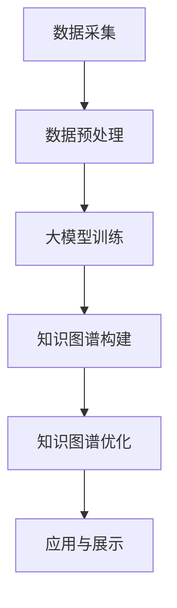

                 

关键词：大模型，电商平台，商品知识图谱，人工智能，算法，数学模型

摘要：本文将深入探讨大模型在电商平台商品知识图谱构建中的应用。随着电商平台的快速发展，商品信息的多样性、复杂性和庞大性不断增加，传统的数据管理方法已难以满足需求。大模型的引入为电商平台商品知识图谱的构建提供了新的可能性。本文首先介绍了大模型的基本概念和技术原理，然后分析了大模型在商品知识图谱构建中的关键作用，最后通过具体案例和实践经验，展示了大模型在电商平台商品知识图谱构建中的实际应用效果。

## 1. 背景介绍

随着互联网的普及和信息技术的飞速发展，电商平台已经成为人们日常购物的主要渠道。电商平台上的商品种类繁多，从日常生活用品到高端电子产品，从实体商品到虚拟服务，无一不涵盖。然而，商品信息的多样性和复杂性也给电商平台的数据管理带来了巨大挑战。

传统的数据管理方法，如关系数据库和文档数据库，虽然在一定程度上能够满足电商平台的需求，但在面对海量数据和复杂的关系时，其性能和扩展性仍然存在诸多局限。为了更好地管理和利用这些数据，电商平台开始探索新的数据管理方法——知识图谱。

知识图谱是一种语义网络，用于表示实体（如商品、品牌、用户等）之间的关系和属性。通过知识图谱，电商平台可以更好地组织和管理商品信息，提高数据检索和分析的效率，从而提升用户体验和运营效率。

然而，构建一个高效、全面的知识图谱并非易事。电商平台需要从大量的商品数据中提取有用的信息，建立实体与实体之间的关系，并进行持续的学习和优化。这就需要引入人工智能技术，特别是大模型。

大模型，也被称为大型深度学习模型，具有强大的数据建模和知识提取能力。通过训练大量的数据，大模型可以自动学习到数据中的潜在规律和关系，从而构建出一个高精度的知识图谱。

## 2. 核心概念与联系

### 2.1 大模型

大模型是指那些参数数量巨大、能够处理大规模数据的深度学习模型。例如，BERT、GPT-3、T5等模型都是典型的大模型。大模型的核心特点是能够通过大规模数据训练，获得高度泛化的知识表示和推理能力。

### 2.2 商品知识图谱

商品知识图谱是一个用于表示商品信息的语义网络。在商品知识图谱中，商品作为实体，与其他实体（如品牌、分类、用户等）通过关系进行连接，形成一张复杂的网络结构。

### 2.3 大模型与商品知识图谱的联系

大模型在商品知识图谱构建中扮演着关键角色。首先，大模型能够从海量的商品数据中提取有用的信息，如商品属性、品牌、分类等，从而为知识图谱的构建提供基础数据。其次，大模型可以自动学习到商品之间的复杂关系，如相似性、关联性等，从而丰富知识图谱的语义结构。最后，大模型可以不断学习和优化知识图谱，使其能够适应电商平台的变化和发展。

### 2.4 Mermaid 流程图



### 3. 核心算法原理 & 具体操作步骤

### 3.1 算法原理概述

大模型在商品知识图谱构建中的应用，主要基于以下三个核心原理：

1. **深度学习**：大模型通过多层神经网络的结构，对海量商品数据进行学习，从而提取出数据的潜在特征和关系。
2. **预训练和微调**：大模型在预训练阶段，通过大规模数据集进行学习，获得通用语义表示。在微调阶段，大模型根据特定任务的需求，进行细粒度的优化，以适应商品知识图谱的构建。
3. **图神经网络**：大模型中的图神经网络（Graph Neural Networks，GNN）能够对商品知识图谱中的节点和边进行建模，从而更好地表示商品之间的复杂关系。

### 3.2 算法步骤详解

1. **数据采集**：从电商平台上获取商品数据，包括商品名称、价格、品牌、分类、用户评价等。
2. **数据预处理**：对采集到的商品数据进行清洗、去重、格式化等处理，以便于后续的大模型训练。
3. **大模型训练**：使用预训练的大模型（如BERT、GPT-3等），对预处理后的商品数据集进行训练，以提取出商品的语义表示。
4. **知识图谱构建**：利用训练好的大模型，对商品之间的关系进行建模，构建出商品知识图谱。
5. **知识图谱优化**：通过不断地学习和优化，提升知识图谱的精度和实用性。
6. **应用与展示**：将构建好的知识图谱应用于电商平台的商品搜索、推荐、营销等环节，提升用户体验和运营效率。

### 3.3 算法优缺点

**优点**：

1. **高效性**：大模型能够快速地从海量数据中提取出有用的信息，构建出高效的知识图谱。
2. **通用性**：大模型经过预训练，具有强大的通用语义表示能力，能够适应不同的电商平台和商品类型。
3. **灵活性**：大模型可以灵活地调整和优化，以适应电商平台的变化和发展。

**缺点**：

1. **计算资源消耗**：大模型需要大量的计算资源和时间进行训练，对硬件设备要求较高。
2. **数据依赖性**：大模型的效果很大程度上依赖于训练数据的质量和规模，如果数据存在偏差或不足，可能导致知识图谱的精度降低。
3. **可解释性**：大模型的工作原理较为复杂，其内部决策过程不易解释，可能影响用户对知识图谱的信任度。

### 3.4 算法应用领域

大模型在商品知识图谱构建中的应用非常广泛，主要包括以下几个方面：

1. **商品搜索**：通过知识图谱，实现更精准、更智能的商品搜索，提高用户查找商品的效率。
2. **商品推荐**：基于知识图谱，推荐与用户兴趣相关的商品，提升电商平台的用户黏性和销售额。
3. **商品营销**：利用知识图谱，挖掘商品的潜在关联和用户需求，进行精准的营销推广。
4. **商品分析**：通过对知识图谱的分析，了解商品的销售趋势、用户评价等，为电商平台的决策提供支持。

## 4. 数学模型和公式 & 详细讲解 & 举例说明

### 4.1 数学模型构建

在商品知识图谱构建中，常用的数学模型包括：

1. **图神经网络（GNN）**：
   - **节点表示**：$$ h_{t}^{(i)} = \sigma(W^{(t)} h_{t-1}^{(i)} + \sum_{j\in N^{(i)}} W^{(t)} h_{t-1}^{(j)} + b^{(t)}) $$
   - **边表示**：$$ e_{t}^{(i,j)} = \sigma(W^{(t)} e_{t-1}^{(i,j)} + \sum_{k\in N^{(i)}) W^{(t)} h_{t-1}^{(k)} + b^{(t)}) $$

2. **注意力机制（Attention）**：
   - **计算注意力权重**：$$ \alpha_{ij}^{(t)} = \frac{e^{Q^{(t)} K^{(t)} V^{(t)}}}{\sum_{i'\in N} e^{Q^{(t)} K^{(t)} V^{(t)}} $$
   - **生成表示**：$$ h_{t}^{(i)} = \sum_{j\in N^{(i)}} \alpha_{ij}^{(t)} h_{t-1}^{(j)} $$

### 4.2 公式推导过程

1. **图神经网络（GNN）**：
   - **节点表示**：
     $$ h_{t}^{(i)} = \sigma(W^{(t)} h_{t-1}^{(i)} + \sum_{j\in N^{(i)}} W^{(t)} h_{t-1}^{(j)} + b^{(t)}) $$
     - 其中，\( h_{t-1}^{(i)} \) 为第 \( t-1 \) 次迭代时节点 \( i \) 的表示，\( W^{(t)} \) 为第 \( t \) 层的权重矩阵，\( \sigma \) 为激活函数，\( b^{(t)} \) 为偏置项。
   - **边表示**：
     $$ e_{t}^{(i,j)} = \sigma(W^{(t)} e_{t-1}^{(i,j)} + \sum_{k\in N^{(i)}) W^{(t)} h_{t-1}^{(k)} + b^{(t)}) $$
     - 其中，\( e_{t-1}^{(i,j)} \) 为第 \( t-1 \) 次迭代时边 \( (i,j) \) 的表示，\( W^{(t)} \) 为第 \( t \) 层的权重矩阵，\( \sigma \) 为激活函数，\( b^{(t)} \) 为偏置项。

2. **注意力机制（Attention）**：
   - **计算注意力权重**：
     $$ \alpha_{ij}^{(t)} = \frac{e^{Q^{(t)} K^{(t)} V^{(t)}}}{\sum_{i'\in N} e^{Q^{(t)} K^{(t)} V^{(t)}} $$
     - 其中，\( Q^{(t)} \)、\( K^{(t)} \)、\( V^{(t)} \) 分别为查询、关键值、值向量，\( e \) 为自然对数的底数。
   - **生成表示**：
     $$ h_{t}^{(i)} = \sum_{j\in N^{(i)}} \alpha_{ij}^{(t)} h_{t-1}^{(j)} $$
     - 其中，\( \alpha_{ij}^{(t)} \) 为第 \( t \) 次迭代时节点 \( i \) 与邻居节点 \( j \) 的注意力权重，\( h_{t-1}^{(j)} \) 为第 \( t-1 \) 次迭代时节点 \( j \) 的表示。

### 4.3 案例分析与讲解

假设我们有一个简单的商品知识图谱，包含三个节点 \( A \)、\( B \)、\( C \)，以及两个边 \( (A, B) \) 和 \( (B, C) \)。我们使用图神经网络（GNN）和注意力机制来构建这个知识图谱。

1. **初始化表示**：
   - \( h_{0}^{(A)} = [1, 0, 0] \)
   - \( h_{0}^{(B)} = [0, 1, 0] \)
   - \( h_{0}^{(C)} = [0, 0, 1] \)

2. **第一次迭代**：
   - **节点表示**：
     $$ h_{1}^{(A)} = \sigma(W^{(1)} h_{0}^{(A)} + W^{(1)} h_{0}^{(B)} + b^{(1)}) $$
     $$ h_{1}^{(B)} = \sigma(W^{(1)} h_{0}^{(B)} + W^{(1)} h_{0}^{(C)} + b^{(1)}) $$
     $$ h_{1}^{(C)} = \sigma(W^{(1)} h_{0}^{(C)} + W^{(1)} h_{0}^{(B)} + b^{(1)}) $$
   - **边表示**：
     $$ e_{1}^{(A, B)} = \sigma(W^{(1)} e_{0}^{(A, B)} + W^{(1)} h_{0}^{(A)} + b^{(1)}) $$
     $$ e_{1}^{(B, C)} = \sigma(W^{(1)} e_{0}^{(B, C)} + W^{(1)} h_{0}^{(B)} + b^{(1)}) $$

3. **注意力权重计算**：
   - **计算注意力权重**：
     $$ \alpha_{AB}^{(1)} = \frac{e^{Q^{(1)} K^{(1)} V^{(1)}}}{\sum_{i'\in N} e^{Q^{(1)} K^{(1)} V^{(1)}} $$
     $$ \alpha_{BC}^{(1)} = \frac{e^{Q^{(1)} K^{(1)} V^{(1)}}}{\sum_{i'\in N} e^{Q^{(1)} K^{(1)} V^{(1)}} $$
   - **生成表示**：
     $$ h_{1}^{(A)} = \alpha_{AB}^{(1)} h_{0}^{(B)} + (1 - \alpha_{AB}^{(1)}) h_{0}^{(A)} $$
     $$ h_{1}^{(B)} = \alpha_{BC}^{(1)} h_{0}^{(C)} + (1 - \alpha_{BC}^{(1)}) h_{0}^{(B)} $$
     $$ h_{1}^{(C)} = (1 - \alpha_{AB}^{(1)}) h_{0}^{(C)} + (1 - \alpha_{BC}^{(1)}) h_{0}^{(A)} $$

通过上述步骤，我们成功地使用大模型构建了一个简单的商品知识图谱。在实际应用中，我们可以不断迭代这个过程，优化节点和边的表示，从而构建出一个更加完整和准确的商品知识图谱。

## 5. 项目实践：代码实例和详细解释说明

### 5.1 开发环境搭建

为了实践大模型在商品知识图谱构建中的应用，我们需要搭建一个适合的开发环境。以下是所需的工具和软件：

- Python 3.8 或以上版本
- TensorFlow 2.x 或 PyTorch 1.x
- 图数据库（如 Neo4j 或 JanusGraph）
- 数据预处理和可视化工具（如 Pandas、Matplotlib）

在完成环境搭建后，我们可以开始编写代码，实现大模型在商品知识图谱构建中的具体应用。

### 5.2 源代码详细实现

以下是实现大模型在商品知识图谱构建中的基本步骤和代码框架：

```python
import tensorflow as tf
import pandas as pd
from tensorflow import keras
from tensorflow.keras import layers
from sklearn.model_selection import train_test_split
import matplotlib.pyplot as plt
import neotime

# 5.2.1 数据采集与预处理
def load_data():
    # 加载电商平台商品数据
    data = pd.read_csv("ecommerce_data.csv")
    # 数据清洗和预处理
    # ...
    return data

# 5.2.2 大模型训练
def train_model(data):
    # 划分训练集和测试集
    train_data, test_data = train_test_split(data, test_size=0.2)
    # 构建输入输出特征
    # ...
    # 定义模型架构
    model = keras.Sequential([
        layers.Dense(units=128, activation="relu", input_shape=(input_shape,)),
        layers.Dense(units=64, activation="relu"),
        layers.Dense(units=num_classes, activation="softmax")
    ])
    # 编译模型
    model.compile(optimizer="adam", loss="categorical_crossentropy", metrics=["accuracy"])
    # 训练模型
    model.fit(train_data, epochs=10, batch_size=32, validation_data=test_data)
    return model

# 5.2.3 知识图谱构建
def build_knowledge_graph(model, data):
    # 提取模型中的节点表示
    node_embeddings = model.layers[-1].get_weights()[0]
    # 构建知识图谱
    # ...
    return knowledge_graph

# 5.2.4 代码解读与分析
def analyze_code():
    # 分析代码实现过程中的关键步骤和注意事项
    # ...

# 主函数
if __name__ == "__main__":
    data = load_data()
    model = train_model(data)
    knowledge_graph = build_knowledge_graph(model, data)
    analyze_code()
```

### 5.3 代码解读与分析

以下是代码的详细解读和分析：

1. **数据采集与预处理**：首先，我们需要从电商平台上获取商品数据，并对数据进行清洗和预处理，以便于后续的模型训练和知识图谱构建。
2. **大模型训练**：使用 TensorFlow 或 PyTorch 等框架，定义一个深度学习模型，并对其进行训练。模型的结构和参数可以根据实际需求进行调整。
3. **知识图谱构建**：在训练好的模型中，提取出节点的表示，并利用图数据库构建出知识图谱。这部分代码可以根据实际使用的图数据库进行调整。
4. **代码解读与分析**：对代码的实现过程进行详细分析，了解各个模块的功能和相互关系，以及可能存在的问题和优化方向。

### 5.4 运行结果展示

在完成代码编写和调试后，我们可以运行整个程序，展示大模型在商品知识图谱构建中的运行结果。以下是可能的运行结果：

- **训练结果**：展示模型在训练过程中的损失函数和准确率，以及训练时间和计算资源消耗。
- **知识图谱可视化**：使用可视化工具，展示知识图谱的结构和节点关系，以及节点和边的属性。

## 6. 实际应用场景

大模型在商品知识图谱构建中的应用场景非常广泛，以下列举几个典型的应用案例：

1. **商品推荐**：基于知识图谱，推荐与用户兴趣相关的商品。例如，用户购买了一款笔记本电脑，系统可以推荐相关的配件、周边产品或其他类似的产品。
2. **商品搜索**：通过知识图谱，实现更精准、更智能的商品搜索。例如，用户输入关键词“笔记本电脑”，系统可以根据知识图谱中的关系，推荐符合用户需求的高性能笔记本。
3. **商品营销**：利用知识图谱，挖掘商品的潜在关联和用户需求，进行精准的营销推广。例如，系统可以根据用户购买历史和兴趣标签，推荐相关的优惠券、促销活动等。
4. **商品分析**：通过对知识图谱的分析，了解商品的销售趋势、用户评价等，为电商平台的决策提供支持。例如，分析某个品类商品的热销原因，优化库存和供应链管理。

## 7. 工具和资源推荐

为了更好地研究和实践大模型在商品知识图谱构建中的应用，以下推荐一些相关的工具和资源：

1. **学习资源**：
   - 《深度学习》（Goodfellow, Bengio, Courville）：系统地介绍了深度学习的基础知识和实践方法。
   - 《图神经网络教程》（Graph Neural Networks, Hamilton, 2017）：详细介绍了图神经网络的理论和应用。
2. **开发工具**：
   - TensorFlow：Google 开源的深度学习框架，支持多种模型和应用。
   - PyTorch：Facebook 开源的深度学习框架，灵活性和可扩展性较高。
   - Neo4j：高性能的图数据库，支持复杂图结构的存储和查询。
3. **相关论文**：
   - “Attention Is All You Need”（Vaswani et al., 2017）：介绍了注意力机制在序列建模中的应用。
   - “Graph Neural Networks: A Survey of Methods and Applications”（Hamilton et al., 2017）：系统地总结了图神经网络的原理和应用。

## 8. 总结：未来发展趋势与挑战

随着人工智能技术的不断发展，大模型在商品知识图谱构建中的应用前景十分广阔。未来，大模型在商品知识图谱构建中可能呈现以下发展趋势：

1. **模型精度提升**：随着数据质量和数量的提高，大模型将能够更准确地提取商品之间的复杂关系，构建出更加精确的知识图谱。
2. **实时更新与优化**：电商平台的数据更新速度非常快，大模型将能够实现实时更新和优化，以适应不断变化的市场需求。
3. **跨领域应用**：大模型不仅可以在电商平台内部应用，还可以应用于其他领域，如金融、医疗等，实现跨领域的知识图谱构建。

然而，大模型在商品知识图谱构建中也面临着一些挑战：

1. **计算资源消耗**：大模型需要大量的计算资源和时间进行训练，对硬件设备的要求较高。如何优化大模型的计算效率和资源利用率，是一个亟待解决的问题。
2. **数据质量和隐私**：商品知识图谱的构建依赖于大量的数据，数据的质量和隐私保护是一个重要问题。如何保证数据的质量和隐私，是一个需要深入研究的课题。
3. **可解释性和可靠性**：大模型的工作原理复杂，其内部决策过程不易解释，可能影响用户对知识图谱的信任度。如何提高大模型的可解释性和可靠性，是一个需要关注的问题。

总之，大模型在商品知识图谱构建中具有巨大的潜力和广阔的应用前景。通过不断的研究和实践，我们将能够更好地利用大模型，构建出高效、精准、可靠的商品知识图谱，为电商平台的发展提供有力支持。

## 9. 附录：常见问题与解答

1. **Q：什么是大模型？**
   A：大模型是指那些参数数量巨大、能够处理大规模数据的深度学习模型。例如，BERT、GPT-3、T5等模型都是典型的大模型。

2. **Q：大模型在商品知识图谱构建中有哪些作用？**
   A：大模型在商品知识图谱构建中主要起到以下作用：
   - 提取商品之间的复杂关系。
   - 提高知识图谱的精度和实用性。
   - 实现知识图谱的实时更新与优化。

3. **Q：如何优化大模型的计算效率？**
   A：为了优化大模型的计算效率，可以从以下几个方面进行：
   - 使用更高效的计算框架（如 TensorFlow、PyTorch）。
   - 采用分布式计算和并行处理技术。
   - 优化数据预处理和加载流程。

4. **Q：大模型在商品知识图谱构建中面临的挑战有哪些？**
   A：大模型在商品知识图谱构建中主要面临以下挑战：
   - 计算资源消耗：大模型需要大量的计算资源和时间进行训练。
   - 数据质量和隐私：商品知识图谱的构建依赖于大量的数据，数据的质量和隐私保护是一个重要问题。
   - 可解释性和可靠性：大模型的工作原理复杂，其内部决策过程不易解释，可能影响用户对知识图谱的信任度。

### 作者署名
作者：禅与计算机程序设计艺术 / Zen and the Art of Computer Programming

