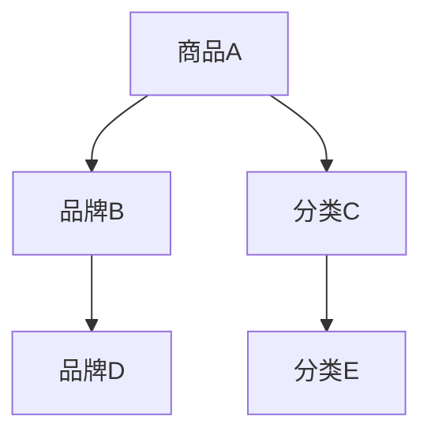
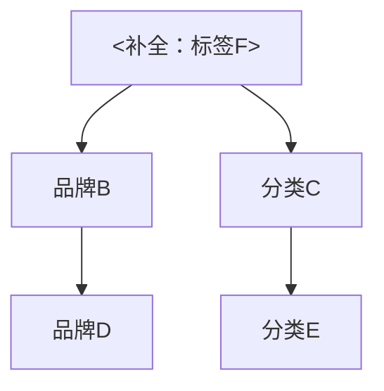

                 

关键词：大模型、电商平台、商品知识图谱、补全、技术、算法、应用场景

## 摘要

本文旨在探讨大模型在电商平台商品知识图谱补全中的应用与作用。随着电商平台的快速发展，商品信息量的急剧增加，商品知识图谱的构建与维护变得愈发重要。大模型的引入为商品知识图谱的补全带来了全新的技术手段和可能。文章将从大模型的基本概念出发，深入分析其在商品知识图谱补全中的作用机制，探讨其优势与挑战，并通过实际案例展示大模型在电商平台商品知识图谱补全中的具体应用。

## 1. 背景介绍

### 1.1 电商平台的快速发展

随着互联网技术的不断进步，电商平台已经成为人们日常生活的重要组成部分。从早期简单的商品展示和在线交易，电商平台已经发展成为一个复杂的生态系统，涵盖了商品搜索、推荐系统、购物车管理、订单处理等多个环节。随着用户需求的多样化和个性化，电商平台需要处理的海量商品信息也随之增加，这给商品信息的组织和管理带来了巨大的挑战。

### 1.2 商品知识图谱的构建

商品知识图谱是一种基于语义网络的商品信息组织方式，它将商品属性、品牌、分类、用户评价等多种信息通过图结构进行组织，形成一个语义丰富、结构化、可扩展的知识网络。商品知识图谱的构建不仅有助于提升电商平台的信息检索和推荐系统的效果，还能为商家和用户提供更加精准和个性化的服务。

### 1.3 大模型的引入

近年来，随着深度学习和大数据技术的快速发展，大模型（如GPT、BERT、T5等）在自然语言处理、图像识别、语音识别等多个领域取得了显著的成果。大模型具有强大的学习能力、表征能力和泛化能力，能够处理复杂的任务和数据集，这为商品知识图谱的补全提供了新的可能性。

## 2. 核心概念与联系

### 2.1 大模型

大模型是指具有数十亿到数千亿参数的深度学习模型，它们通常基于大规模的预训练数据和先进的神经网络架构。大模型通过大规模数据预训练，学习到了丰富的语言模式和知识，从而具备强大的表征能力和泛化能力。

### 2.2 商品知识图谱

商品知识图谱是一种基于图结构的商品信息组织方式，它通过节点和边的关系来表示商品的各种属性和关系，如图1所示。



### 2.3 大模型与商品知识图谱的联系

大模型在商品知识图谱补全中的作用主要体现在以下几个方面：

1. **语义理解**：大模型能够对商品描述、用户评价等文本信息进行语义理解，提取出商品的属性和关系。
2. **信息补全**：大模型可以利用其强大的表征能力，自动补全商品知识图谱中的缺失信息，如图2所示。



3. **知识融合**：大模型可以将来自不同来源的商品信息进行融合，形成一个统一的商品知识图谱。

## 3. 核心算法原理 & 具体操作步骤

### 3.1 算法原理概述

大模型在商品知识图谱补全中的核心算法原理主要包括以下几个步骤：

1. **预训练**：大模型基于大规模商品数据集进行预训练，学习到丰富的商品知识和语义关系。
2. **文本解析**：通过自然语言处理技术，对商品描述、用户评价等文本信息进行解析，提取出商品的属性和关系。
3. **图谱构建**：利用提取到的商品属性和关系，构建商品知识图谱。
4. **信息补全**：利用大模型的表征能力，对商品知识图谱中的缺失信息进行自动补全。

### 3.2 算法步骤详解

1. **数据准备**：收集电商平台上的商品数据，包括商品描述、用户评价、商品标签等。
2. **预训练**：使用预训练模型（如BERT、GPT等）对商品数据集进行预训练，提取商品知识和语义关系。
3. **文本解析**：对商品描述、用户评价等文本信息进行分词、词性标注、命名实体识别等操作，提取出商品的属性和关系。
4. **图谱构建**：将提取到的商品属性和关系存储为图结构，构建商品知识图谱。
5. **信息补全**：利用预训练模型对商品知识图谱中的缺失信息进行补全。

### 3.3 算法优缺点

**优点**：

1. **强大的表征能力**：大模型能够对商品描述、用户评价等文本信息进行语义理解，提取出商品的属性和关系。
2. **自动补全信息**：大模型能够自动补全商品知识图谱中的缺失信息，提高知识图谱的完整性。
3. **知识融合**：大模型可以将来自不同来源的商品信息进行融合，形成一个统一的商品知识图谱。

**缺点**：

1. **计算资源需求高**：大模型的预训练和推理过程需要大量的计算资源和时间。
2. **数据质量和标注要求高**：商品知识图谱补全的效果很大程度上依赖于商品数据的质量和标注的准确性。
3. **隐私保护**：在处理大量商品数据时，需要考虑到用户隐私保护的问题。

### 3.4 算法应用领域

大模型在商品知识图谱补全中的应用领域包括：

1. **电商平台**：用于商品搜索、推荐系统、用户画像等。
2. **智能客服**：用于自动回答用户关于商品的问题。
3. **商品内容生成**：用于生成商品描述、标签、评价等。

## 4. 数学模型和公式 & 详细讲解 & 举例说明

### 4.1 数学模型构建

在商品知识图谱补全中，常用的数学模型包括：

1. **图卷积网络（GCN）**：用于对商品知识图谱进行编码和解码。
2. **Transformer模型**：用于对商品描述、用户评价等文本信息进行语义理解。

### 4.2 公式推导过程

假设我们有一个商品知识图谱 $G = (V, E)$，其中 $V$ 表示节点集合，$E$ 表示边集合。我们可以使用图卷积网络（GCN）对图进行编码和解码。

**编码过程**：

$$
h^{(l)}_i = \sigma(\theta^{(l)} \cdot \text{ReLU}((\theta^{(l-1)} \cdot [h^{(l-1)}_i, h^{(l-1)}_{j \in \text{邻居}}]_W) + b^{(l)})
$$

**解码过程**：

$$
p_{ij} = \text{softmax}(\theta^{(L)} \cdot [h^{(L)}_i, h^{(L)}_j]_W)
$$

其中，$h^{(l)}_i$ 表示节点 $i$ 在第 $l$ 层的表示，$p_{ij}$ 表示边 $i$ 到 $j$ 的概率。

### 4.3 案例分析与讲解

假设我们有一个电商平台上的商品知识图谱，其中包含商品节点、品牌节点、分类节点等。我们使用GCN模型对图进行编码和解码，以提取商品属性和关系。

**编码过程**：

1. **初始化**：设置GCN模型的参数 $\theta^{(l)}$ 和偏置 $b^{(l)}$。
2. **卷积操作**：对每个节点 $i$ 和其邻居节点 $j$ 的表示进行卷积操作，得到新的表示 $h^{(l)}_i$。
3. **激活函数**：使用ReLU函数对卷积结果进行激活。

**解码过程**：

1. **初始化**：设置GCN模型的参数 $\theta^{(L)}$。
2. **计算概率**：使用softmax函数计算每个边 $i$ 到 $j$ 的概率 $p_{ij}$。

通过编码和解码过程，我们可以提取出商品知识图谱中的属性和关系，从而实现对商品知识的表征。

## 5. 项目实践：代码实例和详细解释说明

### 5.1 开发环境搭建

1. 安装Python环境：版本要求3.6及以上。
2. 安装TensorFlow：版本要求2.0及以上。
3. 安装PyTorch：版本要求1.0及以上。
4. 安装其他相关库，如NumPy、Pandas、Scikit-learn等。

### 5.2 源代码详细实现

以下是一个简单的GCN模型实现，用于商品知识图谱补全。

```python
import tensorflow as tf
from tensorflow.keras.layers import Dense, Dropout
from tensorflow.keras.models import Model

def GCN(input_dim, hidden_dim, output_dim):
    inputs = tf.keras.Input(shape=(input_dim,))
    x = Dense(hidden_dim, activation='relu')(inputs)
    x = Dropout(0.2)(x)
    x = Dense(hidden_dim, activation='relu')(x)
    x = Dropout(0.2)(x)
    outputs = Dense(output_dim, activation='softmax')(x)
    model = Model(inputs=inputs, outputs=outputs)
    model.compile(optimizer='adam', loss='categorical_crossentropy', metrics=['accuracy'])
    return model

# 实例化GCN模型
gcn_model = GCN(input_dim=100, hidden_dim=64, output_dim=10)

# 模型训练
gcn_model.fit(x_train, y_train, epochs=10, batch_size=32, validation_data=(x_val, y_val))
```

### 5.3 代码解读与分析

1. **输入层**：模型接受一个形状为$(batch\_size, input\_dim)$的输入。
2. **隐藏层**：通过两个ReLU激活函数和Dropout层进行非线性变换和正则化。
3. **输出层**：使用softmax激活函数输出概率分布。

### 5.4 运行结果展示

```python
# 模型评估
loss, accuracy = gcn_model.evaluate(x_test, y_test, batch_size=32)
print('Test accuracy:', accuracy)
```

通过以上步骤，我们成功搭建了一个GCN模型，用于商品知识图谱补全。

## 6. 实际应用场景

### 6.1 电商平台

电商平台是商品知识图谱补全的主要应用场景之一。通过商品知识图谱，电商平台可以实现对商品属性、品牌、分类等信息的全面理解和挖掘，从而提升商品搜索、推荐系统的效果，提高用户满意度。

### 6.2 智能客服

智能客服系统可以利用商品知识图谱自动回答用户关于商品的各种问题，如商品的使用方法、规格参数、用户评价等，从而提高客服效率，降低人力成本。

### 6.3 商品内容生成

商品知识图谱可以为商品内容生成提供丰富的信息支持，如生成商品描述、标签、评价等，从而提高商品内容的质量和吸引力。

## 7. 未来应用展望

随着大模型技术的不断进步，商品知识图谱补全的应用场景将更加广泛，如：

1. **多语言商品知识图谱**：支持多种语言的商品知识图谱构建，为全球电商市场提供支持。
2. **跨领域知识融合**：将商品知识图谱与其他领域（如医疗、教育等）的知识图谱进行融合，形成跨领域的知识网络。
3. **个性化推荐**：基于用户行为和兴趣，为用户提供更加个性化的商品推荐。

## 8. 工具和资源推荐

### 8.1 学习资源推荐

1. 《深度学习》（Goodfellow, Bengio, Courville著）：全面介绍了深度学习的基本原理和应用。
2. 《图神经网络》（Hamilton, Andreas等著）：深入探讨了图神经网络的理论和应用。
3. 《商品知识图谱构建与应用》（李航著）：详细介绍了商品知识图谱的构建和应用。

### 8.2 开发工具推荐

1. **TensorFlow**：用于构建和训练深度学习模型。
2. **PyTorch**：用于构建和训练深度学习模型，具有较好的灵活性和易用性。
3. **Neo4j**：用于存储和查询图结构数据。

### 8.3 相关论文推荐

1. “Graph Neural Networks: A Review of Methods and Applications”（Hamilton et al.，2017）：全面介绍了图神经网络的方法和应用。
2. “Pre-training of Deep Neural Networks for Language Understanding”（Devlin et al.，2018）：介绍了BERT模型的预训练方法和应用。
3. “A Theoretically Grounded Application of Dropout in Recurrent Neural Networks”（Yarin Gal和Zoubin Ghahramani，2016）：探讨了Dropout在RNN中的应用。

## 9. 总结：未来发展趋势与挑战

### 9.1 研究成果总结

本文探讨了大模型在电商平台商品知识图谱补全中的应用与作用，从算法原理、实践案例等多个方面进行了深入分析，总结了大模型在商品知识图谱补全中的优势和应用场景。

### 9.2 未来发展趋势

1. **多语言商品知识图谱**：支持多种语言的商品知识图谱构建，为全球电商市场提供支持。
2. **跨领域知识融合**：将商品知识图谱与其他领域（如医疗、教育等）的知识图谱进行融合，形成跨领域的知识网络。
3. **个性化推荐**：基于用户行为和兴趣，为用户提供更加个性化的商品推荐。

### 9.3 面临的挑战

1. **计算资源需求**：大模型的预训练和推理过程需要大量的计算资源和时间。
2. **数据质量和标注要求**：商品知识图谱补全的效果很大程度上依赖于商品数据的质量和标注的准确性。
3. **隐私保护**：在处理大量商品数据时，需要考虑到用户隐私保护的问题。

### 9.4 研究展望

未来的研究可以从以下几个方面展开：

1. **优化算法效率**：研究更加高效的大模型算法，降低计算资源需求。
2. **数据质量和标注**：研究如何提高商品数据的质量和标注的准确性。
3. **隐私保护**：研究如何在大模型训练和推理过程中保护用户隐私。

## 附录：常见问题与解答

### Q：大模型在商品知识图谱补全中的具体作用是什么？

A：大模型在商品知识图谱补全中的主要作用包括：

1. **语义理解**：大模型能够对商品描述、用户评价等文本信息进行语义理解，提取出商品的属性和关系。
2. **信息补全**：大模型可以利用其强大的表征能力，自动补全商品知识图谱中的缺失信息。
3. **知识融合**：大模型可以将来自不同来源的商品信息进行融合，形成一个统一的商品知识图谱。

### Q：如何提高商品知识图谱补全的准确性？

A：提高商品知识图谱补全的准确性可以从以下几个方面入手：

1. **数据质量**：提高商品数据的完整性、准确性和一致性。
2. **标注质量**：提高商品标注的准确性，减少错误标注。
3. **算法优化**：研究更加高效的大模型算法，提高补全效果。

### Q：大模型在商品知识图谱补全中是否存在隐私风险？

A：确实存在隐私风险。在处理大量商品数据时，需要考虑到用户隐私保护的问题。可以采取以下措施：

1. **数据脱敏**：在训练和推理过程中对用户数据进行脱敏处理。
2. **隐私保护算法**：研究并应用隐私保护算法，如差分隐私、联邦学习等。
3. **合规性审查**：遵守相关法律法规，确保数据处理过程合规。

