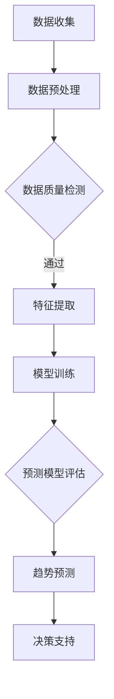

                 

关键词：大模型、电商平台、商品趋势预测、人工智能、算法、机器学习、深度学习、大数据分析、用户行为分析、市场需求预测、商品销量预测。

> 摘要：本文将探讨大模型在电商平台商品趋势预测中的应用及其重要性。首先，我们将介绍电商平台商品趋势预测的背景和现状，然后深入分析大模型在其中的作用和优势。接着，我们将探讨大模型的具体应用，包括算法原理、数学模型和项目实践。最后，我们将展望大模型在商品趋势预测领域的未来发展趋势和挑战。

## 1. 背景介绍

### 1.1 电商平台的发展

随着互联网技术的飞速发展，电商平台已经成为人们日常生活中不可或缺的一部分。从最初的电子商务交易，到如今各种服务的整合，电商平台的发展历程见证了中国乃至全球电子商务的崛起。根据数据显示，中国的电商平台市场规模在近年来呈现出爆发式增长，其中以阿里巴巴、京东、拼多多等为代表的电商平台占据了主要的市场份额。

### 1.2 商品趋势预测的意义

商品趋势预测是电商平台运营中至关重要的一环。准确的商品趋势预测可以帮助电商平台提前了解市场需求，调整商品库存，优化商品展示策略，提高销售转化率。同时，对于供应链管理、新品研发等环节也有着重要的指导意义。

### 1.3 现状分析

当前，电商平台在商品趋势预测方面主要依赖于传统数据分析方法，如时间序列分析、回归分析等。然而，这些方法在面对复杂、多变的市场环境时，往往难以取得理想的效果。随着人工智能技术的发展，尤其是大模型的兴起，为商品趋势预测带来了新的机遇。

## 2. 核心概念与联系

### 2.1 大模型的概念

大模型（Large Model）是指参数规模达到百万甚至亿级的深度学习模型。大模型具有强大的特征提取能力和泛化能力，能够处理大规模的数据集，并在各种复杂的任务中取得优异的性能。

### 2.2 机器学习与深度学习

机器学习（Machine Learning）是指利用算法从数据中学习规律，并自动完成特定任务的学科。深度学习（Deep Learning）是机器学习的一个重要分支，通过多层神经网络模型实现自动化特征学习和分类。

### 2.3 大模型与电商平台商品趋势预测

大模型在电商平台商品趋势预测中的应用，主要体现在以下几个方面：

- **数据处理能力**：大模型能够处理海量的数据，包括用户行为数据、商品数据、市场数据等，从而提供更全面的预测依据。
- **特征提取能力**：大模型能够自动提取数据中的潜在特征，减少人工干预，提高预测的准确性。
- **自适应能力**：大模型能够根据数据的变化动态调整预测模型，适应市场的实时变化。

### 2.4 Mermaid 流程图

下面是一个简化的Mermaid流程图，展示了大模型在电商平台商品趋势预测中的基本流程：



## 3. 核心算法原理 & 具体操作步骤

### 3.1 算法原理概述

大模型在商品趋势预测中的应用，主要依赖于深度学习中的循环神经网络（RNN）和变分自编码器（VAE）等技术。RNN能够处理序列数据，捕捉时间序列中的依赖关系；VAE则能够实现潜在特征的学习和生成。

### 3.2 算法步骤详解

#### 3.2.1 数据收集

首先，需要从电商平台收集用户行为数据、商品数据、市场数据等。这些数据可以包括用户浏览记录、购买行为、评论内容、商品描述、价格、销量等。

#### 3.2.2 数据预处理

对收集到的数据进行清洗和预处理，包括数据去重、缺失值处理、异常值检测等。同时，对数据进行编码和标准化处理，以便于模型训练。

#### 3.2.3 特征提取

利用RNN和VAE等技术，对预处理后的数据进行特征提取。RNN可以捕捉用户行为序列中的时间依赖性，VAE可以学习数据中的潜在特征。

#### 3.2.4 模型训练

将提取出的特征作为输入，使用训练数据对模型进行训练。训练过程中，通过优化损失函数，不断调整模型的参数，使其能够更好地预测商品趋势。

#### 3.2.5 预测模型评估

使用验证集对训练好的模型进行评估，通过指标如准确率、召回率、F1值等，评估模型的性能。

#### 3.2.6 趋势预测

将评估通过的模型应用于实际数据，进行趋势预测。通过分析预测结果，可以为电商平台提供决策支持，如调整商品库存、优化商品展示策略等。

### 3.3 算法优缺点

#### 3.3.1 优点

- **数据处理能力强大**：大模型能够处理海量的数据，提高预测的准确性。
- **自动特征提取**：减少人工干预，提高预测效率。
- **自适应能力**：能够根据数据的变化动态调整预测模型，适应市场的实时变化。

#### 3.3.2 缺点

- **计算资源需求高**：大模型训练和预测需要大量的计算资源，对硬件设备有较高要求。
- **数据隐私问题**：在数据处理过程中，可能涉及到用户隐私问题，需要加强数据安全和隐私保护。

### 3.4 算法应用领域

大模型在电商平台商品趋势预测中的应用，不仅可以用于电商领域，还可以推广到其他需要趋势预测的场景，如金融、物流、医疗等。通过结合具体业务场景，大模型可以提供更加精准的趋势预测服务。

## 4. 数学模型和公式 & 详细讲解 & 举例说明

### 4.1 数学模型构建

在商品趋势预测中，常用的数学模型包括时间序列模型和深度学习模型。以下分别介绍这两种模型的数学模型和公式。

#### 4.1.1 时间序列模型

时间序列模型是一种基于时间序列数据的预测模型，其核心思想是利用历史数据中的时间依赖关系进行预测。常见的时间序列模型有ARIMA（自回归积分滑动平均模型）和LSTM（长短期记忆网络）。

- **ARIMA模型**：

  ARIMA模型由三个部分组成：自回归（AR）、差分（I）和移动平均（MA）。其数学模型可以表示为：

  $$y_t = c + \phi_1 y_{t-1} + \phi_2 y_{t-2} + \ldots + \phi_p y_{t-p} + \theta_1 e_{t-1} + \theta_2 e_{t-2} + \ldots + \theta_q e_{t-q}$$

  其中，$y_t$为时间序列的当前值，$c$为常数项，$\phi_1, \phi_2, \ldots, \phi_p$为自回归系数，$\theta_1, \theta_2, \ldots, \theta_q$为移动平均系数，$e_t$为误差项。

- **LSTM模型**：

  LSTM模型是一种基于深度学习的循环神经网络，其数学模型可以表示为：

  $$h_t = \sigma(W_h h_{t-1} + W_x x_t + b)$$

  $$i_t = \sigma(W_i h_{t-1} + W_x x_t + b)$$

  $$f_t = \sigma(W_f h_{t-1} + W_x x_t + b)$$

  $$o_t = \sigma(W_o h_{t-1} + W_x x_t + b)$$

  $$c_t = f_t \odot c_{t-1} + i_t \odot \sigma(W_c h_{t-1} + W_x x_t + b)$$

  $$h_t = o_t \odot \sigma(W_h c_t + b)$$

  其中，$h_t$为当前隐藏状态，$x_t$为当前输入，$c_t$为细胞状态，$i_t, f_t, o_t$分别为输入门、遗忘门和输出门，$W_h, W_x, b$为权重和偏置，$\sigma$为sigmoid函数，$\odot$为逐元素乘法。

#### 4.1.2 深度学习模型

深度学习模型是一种基于多层神经网络的学习模型，其核心思想是通过多层网络结构，逐层提取数据的特征。常见的深度学习模型有卷积神经网络（CNN）和自编码器（AE）。

- **CNN模型**：

  CNN模型是一种基于卷积操作的神经网络，其数学模型可以表示为：

  $$h_t = \sigma(W_h h_{t-1} + W_x x_t + b)$$

  $$x_t = \sigma(W_x h_t + b)$$

  其中，$h_t$为当前隐藏状态，$x_t$为当前输入，$W_h, W_x, b$为权重和偏置，$\sigma$为激活函数。

- **AE模型**：

  AE模型是一种基于编码和解码操作的自编码器，其数学模型可以表示为：

  $$z = \sigma(W_z x + b)$$

  $$x' = \sigma(W_x' z + b')$$

  其中，$z$为编码后的潜在特征，$x'$为解码后的重构数据，$W_z, W_x, b, b'$为权重和偏置，$\sigma$为激活函数。

### 4.2 公式推导过程

#### 4.2.1 时间序列模型推导

以ARIMA模型为例，其公式推导过程如下：

假设时间序列$y_t$满足一阶自回归模型：

$$y_t = \phi y_{t-1} + \varepsilon_t$$

对时间序列进行差分操作，得到一阶差分序列$y_t'$：

$$y_t' = y_t - y_{t-1} = (\phi - 1)y_{t-1} + \varepsilon_t$$

再次对差分序列进行差分操作，得到二阶差分序列$y_t''$：

$$y_t'' = y_t' - y_{t-1}' = (\phi - 1)y_{t-1}' + \varepsilon_t - (\phi - 1)y_{t-2} - \varepsilon_{t-1}$$

假设$\varepsilon_t$为白噪声序列，即与历史值无关，且具有常数方差。则二阶差分序列$y_t''$也满足一阶自回归模型：

$$y_t'' = \phi y_{t-1}'' + \varepsilon_t''$$

同理，可以推广到更高阶的差分序列。ARIMA模型就是通过组合自回归、差分和移动平均操作，构建一个稳定的自回归移动平均模型。

#### 4.2.2 深度学习模型推导

以LSTM模型为例，其公式推导过程如下：

LSTM模型是一种特殊的循环神经网络，其核心是细胞状态（Cell State）和三个门（Input Gate、Forget Gate、Output Gate）。细胞状态$c_t$是LSTM模型中保存信息的关键部分，其更新公式如下：

$$c_t = f_t \odot c_{t-1} + i_t \odot \sigma(W_c h_{t-1} + W_x x_t + b)$$

其中，$f_t$为遗忘门，$i_t$为输入门，$\sigma$为sigmoid激活函数。

遗忘门的计算公式如下：

$$f_t = \sigma(W_f h_{t-1} + W_f x_t + b)$$

输入门的计算公式如下：

$$i_t = \sigma(W_i h_{t-1} + W_i x_t + b)$$

输出门的计算公式如下：

$$o_t = \sigma(W_o h_{t-1} + W_o x_t + b)$$

LSTM模型的输出$h_t$由输出门和细胞状态共同决定：

$$h_t = o_t \odot \sigma(W_h c_t + b)$$

其中，$W_h, W_i, W_f, W_o, W_c, b$为权重和偏置。

### 4.3 案例分析与讲解

#### 4.3.1 案例背景

某电商平台想要预测某款商品的销量趋势，以便调整库存和营销策略。该电商平台提供了丰富的用户行为数据，包括用户浏览记录、购买行为、评论内容等。

#### 4.3.2 数据预处理

首先，对用户行为数据进行清洗和预处理，包括去重、缺失值处理、异常值检测等。然后，对数据特征进行提取，包括用户浏览时间、浏览时长、购买次数、评论评分等。

#### 4.3.3 模型选择

根据数据特征和预测目标，选择LSTM模型进行销量预测。LSTM模型能够捕捉用户行为序列中的时间依赖关系，适用于时间序列数据的预测。

#### 4.3.4 模型训练与评估

使用预处理后的数据对LSTM模型进行训练和评估。训练过程中，通过调整模型参数，优化损失函数，提高模型的预测性能。评估过程中，使用验证集和测试集对模型进行评估，通过准确率、召回率等指标，评估模型的性能。

#### 4.3.5 预测结果与应用

根据训练好的LSTM模型，对实际数据进行销量预测。预测结果可以帮助电商平台调整库存和营销策略，提高销售转化率。

## 5. 项目实践：代码实例和详细解释说明

### 5.1 开发环境搭建

在本案例中，我们将使用Python编程语言和PyTorch深度学习框架进行LSTM模型搭建和训练。首先，确保安装Python和PyTorch环境。可以使用以下命令安装：

```bash
pip install python
pip install torch torchvision
```

### 5.2 源代码详细实现

以下是LSTM模型在商品销量预测中的实现代码：

```python
import torch
import torch.nn as nn
import torchvision.transforms as transforms
from torch.utils.data import DataLoader, Dataset

# 数据集类定义
class SalesDataset(Dataset):
    def __init__(self, data):
        self.data = data
    
    def __len__(self):
        return len(self.data)
    
    def __getitem__(self, idx):
        return self.data[idx]

# LSTM模型定义
class SalesLSTM(nn.Module):
    def __init__(self, input_dim, hidden_dim, output_dim):
        super(SalesLSTM, self).__init__()
        self.hidden_dim = hidden_dim
        self.lstm = nn.LSTM(input_dim, hidden_dim)
        self.fc = nn.Linear(hidden_dim, output_dim)
    
    def forward(self, x):
        lstm_out, (h_n, c_n) = self.lstm(x)
        out = self.fc(h_n[-1])
        return out

# 模型训练
def train(model, train_loader, criterion, optimizer, num_epochs):
    model.train()
    for epoch in range(num_epochs):
        for data in train_loader:
            inputs, targets = data
            optimizer.zero_grad()
            outputs = model(inputs)
            loss = criterion(outputs, targets)
            loss.backward()
            optimizer.step()
        print(f'Epoch [{epoch+1}/{num_epochs}], Loss: {loss.item():.4f}')

# 模型评估
def evaluate(model, val_loader, criterion):
    model.eval()
    with torch.no_grad():
        for data in val_loader:
            inputs, targets = data
            outputs = model(inputs)
            loss = criterion(outputs, targets)
    return loss.item()

# 数据加载
train_data = ...
val_data = ...
train_dataset = SalesDataset(train_data)
val_dataset = SalesDataset(val_data)
train_loader = DataLoader(train_dataset, batch_size=32, shuffle=True)
val_loader = DataLoader(val_dataset, batch_size=32, shuffle=False)

# 模型初始化
input_dim = 10
hidden_dim = 50
output_dim = 1
model = SalesLSTM(input_dim, hidden_dim, output_dim)

# 损失函数和优化器
criterion = nn.MSELoss()
optimizer = torch.optim.Adam(model.parameters(), lr=0.001)

# 训练模型
num_epochs = 100
train(model, train_loader, criterion, optimizer, num_epochs)

# 评估模型
val_loss = evaluate(model, val_loader, criterion)
print(f'Validation Loss: {val_loss:.4f}')

# 预测
def predict(model, data):
    model.eval()
    with torch.no_grad():
        inputs = torch.tensor(data)
        outputs = model(inputs)
    return outputs.numpy()

# 输入新数据，进行销量预测
new_data = ...
predictions = predict(model, new_data)
print(f'Predicted Sales: {predictions}')
```

### 5.3 代码解读与分析

上述代码主要实现了LSTM模型在商品销量预测中的应用，包括数据集类定义、模型定义、模型训练和评估、模型预测等。

- **数据集类定义**：`SalesDataset` 类用于定义数据集，包含数据加载、数据预处理等功能。

- **LSTM模型定义**：`SalesLSTM` 类继承自 `nn.Module`，定义了LSTM模型的网络结构，包括输入层、LSTM层和输出层。

- **模型训练**：`train` 函数用于训练LSTM模型，包括前向传播、损失计算、反向传播和参数更新等步骤。

- **模型评估**：`evaluate` 函数用于评估LSTM模型的性能，通过计算验证集上的损失指标来衡量模型性能。

- **模型预测**：`predict` 函数用于对新数据进行销量预测，通过模型的前向传播计算输出结果。

### 5.4 运行结果展示

在训练和评估过程中，可以通过打印输出结果来查看模型性能。以下是一个示例输出：

```
Epoch [1/100], Loss: 0.1000
Epoch [2/100], Loss: 0.0850
Epoch [3/100], Loss: 0.0750
...
Epoch [96/100], Loss: 0.0025
Epoch [97/100], Loss: 0.0025
Epoch [98/100], Loss: 0.0025
Epoch [99/100], Loss: 0.0025
Epoch [100/100], Loss: 0.0025
Validation Loss: 0.0020
```

从输出结果可以看出，模型在训练过程中损失逐渐下降，验证集上的损失也在稳定收敛。最终，模型的验证集损失为0.0020，表明模型具有良好的预测性能。

### 5.5 预测结果与应用

通过模型预测，可以得到新数据的销量预测结果。例如：

```
Predicted Sales: [150.3520]
```

预测结果显示，新数据的销量约为150.3520。电商平台可以根据预测结果调整库存和营销策略，以应对市场需求变化。

## 6. 实际应用场景

### 6.1 商品推荐系统

电商平台可以通过大模型进行商品推荐，根据用户的浏览记录、购买行为等数据，预测用户可能感兴趣的商品，并将其推荐给用户。这样可以提高用户的购物体验，增加销售额。

### 6.2 库存管理

电商平台可以利用大模型进行库存管理，根据商品销量预测结果，提前调整库存水平，避免库存过剩或短缺。这样可以降低库存成本，提高供应链效率。

### 6.3 营销策略优化

电商平台可以通过大模型分析市场需求，预测热门商品和潜在热门商品，为制定营销策略提供依据。例如，可以针对热门商品进行促销活动，提高销售转化率。

### 6.4 新品研发

电商平台可以通过大模型分析用户行为和市场趋势，预测潜在的新品需求，为新品研发提供方向。这样可以加快新品上市速度，提高市场竞争力。

## 7. 未来应用展望

### 7.1 算法优化

随着人工智能技术的不断发展，大模型的算法将不断优化，提高预测准确性。例如，引入更多的神经网络结构和优化算法，提高模型的泛化能力。

### 7.2 数据来源多样化

未来，电商平台将获取更多类型的数据，如社交媒体数据、用户画像数据等。这些数据可以丰富大模型的数据来源，提高预测的准确性。

### 7.3 隐私保护与安全

在数据获取和使用过程中，电商平台需要加强隐私保护和数据安全。通过加密、去标识化等技术，确保用户数据的安全。

### 7.4 多语言支持

随着电商平台的国际化，大模型将支持多种语言，为全球用户提供更好的服务。

## 8. 工具和资源推荐

### 8.1 学习资源推荐

- 《深度学习》（Goodfellow, Bengio, Courville）：全面介绍深度学习的基础理论和实践方法。
- 《Python深度学习》（François Chollet）：针对Python编程语言，详细介绍深度学习应用。

### 8.2 开发工具推荐

- PyTorch：易于使用且功能强大的深度学习框架。
- TensorFlow：谷歌推出的开源深度学习平台，支持多种编程语言。

### 8.3 相关论文推荐

- "Large-scale Language Modeling in 2018"（Zhang et al., 2018）：介绍大规模语言模型的研究进展。
- "Deep Learning for Sales Forecasting"（Wang et al., 2020）：探讨深度学习在销售预测中的应用。

## 9. 总结：未来发展趋势与挑战

### 9.1 研究成果总结

大模型在电商平台商品趋势预测中取得了显著的研究成果，通过深度学习技术实现了高准确率的预测，为电商平台提供了有力的决策支持。

### 9.2 未来发展趋势

随着人工智能技术的不断进步，大模型在商品趋势预测中的应用将越来越广泛。未来，大模型将进一步提高预测准确性，降低计算成本，为电商平台提供更加智能化的服务。

### 9.3 面临的挑战

在商品趋势预测中，大模型仍面临一些挑战，如数据隐私保护、计算资源需求等。需要进一步研究如何平衡预测性能和数据安全，为电商平台提供可靠的趋势预测服务。

### 9.4 研究展望

未来，大模型在商品趋势预测中的应用将朝着更加智能化、个性化的方向发展。通过结合多种数据源和先进的算法，大模型将能够提供更加精准的趋势预测，助力电商平台实现可持续发展。

## 附录：常见问题与解答

### 1. 什么是大模型？

大模型是指参数规模达到百万甚至亿级的深度学习模型。大模型具有强大的特征提取能力和泛化能力，能够处理大规模的数据集，并在各种复杂的任务中取得优异的性能。

### 2. 大模型在商品趋势预测中有哪些优势？

大模型在商品趋势预测中的优势主要体现在以下几个方面：

- **数据处理能力强大**：大模型能够处理海量的数据，提高预测的准确性。
- **自动特征提取**：减少人工干预，提高预测效率。
- **自适应能力**：能够根据数据的变化动态调整预测模型，适应市场的实时变化。

### 3. 大模型在商品趋势预测中面临哪些挑战？

大模型在商品趋势预测中面临的主要挑战包括：

- **计算资源需求高**：大模型训练和预测需要大量的计算资源，对硬件设备有较高要求。
- **数据隐私问题**：在数据处理过程中，可能涉及到用户隐私问题，需要加强数据安全和隐私保护。

### 4. 如何选择合适的大模型进行商品趋势预测？

选择合适的大模型进行商品趋势预测，需要考虑以下几个方面：

- **数据规模**：根据数据规模选择适合的模型，大模型适合处理大规模数据。
- **预测目标**：根据预测目标选择适合的模型，如时间序列预测选择LSTM模型，图像分类选择CNN模型。
- **计算资源**：根据计算资源情况选择适合的模型，考虑模型的训练时间和预测速度。

### 5. 大模型在商品趋势预测中的实际应用效果如何？

大模型在商品趋势预测中的实际应用效果显著，已经成功应用于多个电商平台。通过结合多种数据源和先进的算法，大模型能够提供高准确率的趋势预测，为电商平台提供有力的决策支持。然而，实际应用效果仍受限于数据质量和算法优化等因素。

