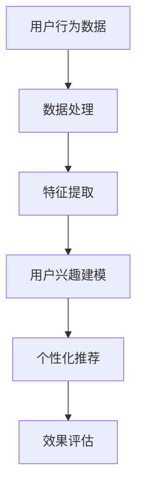

                 

关键词：大模型，电商平台，用户兴趣，平衡优化，算法，数学模型，项目实践，应用场景，未来展望

> 摘要：本文探讨了大规模机器学习模型在电商平台用户兴趣探索与利用中的潜力，分析了核心算法原理、数学模型构建，并通过具体项目实例展示了其在实际应用中的效果和挑战。文章旨在为相关领域的研究和实践提供有价值的参考。

## 1. 背景介绍

### 1.1 电商平台发展现状

随着互联网的普及和电子商务的蓬勃发展，电商平台已经成为了现代商业的重要组成部分。在竞争日益激烈的市场环境中，如何更好地理解用户需求、提高用户满意度和转化率，成为了电商平台亟需解决的问题。

### 1.2 大模型的发展与应用

近年来，深度学习技术的发展推动了大规模机器学习模型（大模型）的兴起。大模型在图像识别、自然语言处理、推荐系统等领域取得了显著的成果，展现出了强大的计算能力和学习能力。

### 1.3 用户兴趣探索与利用

电商平台需要通过用户行为数据挖掘用户兴趣，进而实现个性化推荐和精准营销。然而，如何在保护用户隐私的前提下，平衡用户兴趣探索与利用，仍然是一个亟待解决的问题。

## 2. 核心概念与联系

### 2.1 大模型

大模型通常指的是具有数百万至数十亿参数的深度神经网络，其能够通过大规模数据训练实现高度非线性特征提取和复杂任务学习。

### 2.2 用户兴趣

用户兴趣指的是用户在浏览、搜索、购买等行为中表现出的偏好和倾向。通过分析用户行为数据，可以挖掘出用户的兴趣点。

### 2.3 平衡优化

平衡优化是指在不同目标之间寻求一种最优的平衡，如在保护用户隐私与提高推荐效果之间找到平衡点。

### 2.4 Mermaid 流程图



## 3. 核心算法原理 & 具体操作步骤

### 3.1 算法原理概述

大模型在电商平台用户兴趣探索与利用中的应用，主要基于以下原理：

1. **数据驱动的特征提取**：通过大规模数据训练，大模型能够自动学习用户行为的特征表示。
2. **深度神经网络的结构**：大模型采用多层神经网络结构，能够实现高度非线性特征组合和任务优化。
3. **多任务学习与平衡优化**：大模型能够同时学习多个任务，并通过平衡优化实现用户兴趣探索与利用的平衡。

### 3.2 算法步骤详解

1. **数据预处理**：收集用户行为数据，并进行清洗、归一化等预处理操作。
2. **特征提取**：使用深度神经网络提取用户行为的特征表示。
3. **用户兴趣建模**：基于特征表示，构建用户兴趣模型。
4. **个性化推荐**：根据用户兴趣模型，生成个性化推荐结果。
5. **效果评估**：评估推荐效果，并进行优化调整。

### 3.3 算法优缺点

#### 优点：

1. **高效的特征提取**：大模型能够自动学习用户行为的复杂特征，提高推荐效果。
2. **自适应调整**：大模型能够根据用户行为动态调整推荐策略，提高用户体验。

#### 缺点：

1. **计算资源消耗**：大模型训练和推理需要大量的计算资源。
2. **用户隐私保护**：在用户兴趣建模过程中，需要平衡用户隐私保护与推荐效果。

### 3.4 算法应用领域

大模型在电商平台用户兴趣探索与利用中的算法，可以应用于以下领域：

1. **个性化推荐**：根据用户兴趣生成个性化推荐结果，提高用户满意度。
2. **广告投放**：根据用户兴趣进行精准广告投放，提高广告效果。
3. **内容分类**：对电商平台的内容进行分类，提高内容质量和用户体验。

## 4. 数学模型和公式 & 详细讲解 & 举例说明

### 4.1 数学模型构建

在电商平台用户兴趣探索与利用中，常见的数学模型包括：

1. **用户行为矩阵**：表示用户与商品之间的交互数据。
2. **特征表示矩阵**：表示用户行为的特征表示。
3. **兴趣模型**：表示用户兴趣的参数模型。

### 4.2 公式推导过程

假设用户行为矩阵为$X$，特征表示矩阵为$F$，兴趣模型参数为$W$，则用户兴趣表示为：

$$
I = XW
$$

其中，$I$表示用户兴趣向量，$X$表示用户行为矩阵，$W$表示特征表示矩阵。

### 4.3 案例分析与讲解

以某电商平台用户行为数据为例，构建用户兴趣模型并进行个性化推荐。具体步骤如下：

1. **数据预处理**：收集用户浏览、搜索、购买等行为数据，并进行清洗、归一化等预处理操作。
2. **特征提取**：使用深度神经网络提取用户行为的特征表示。
3. **用户兴趣建模**：基于特征表示，构建用户兴趣模型。
4. **个性化推荐**：根据用户兴趣模型，生成个性化推荐结果。
5. **效果评估**：评估推荐效果，并进行优化调整。

## 5. 项目实践：代码实例和详细解释说明

### 5.1 开发环境搭建

1. **硬件环境**：配置高性能计算服务器，安装深度学习框架（如TensorFlow、PyTorch等）。
2. **软件环境**：安装Python编程环境，安装相关依赖库（如NumPy、Pandas、Scikit-learn等）。

### 5.2 源代码详细实现

以下是一个简单的用户兴趣建模与个性化推荐的Python代码实例：

```python
import numpy as np
import pandas as pd
from sklearn.model_selection import train_test_split
from sklearn.metrics.pairwise import cosine_similarity

# 读取用户行为数据
data = pd.read_csv('user行为数据.csv')
X = data[['浏览次数', '搜索次数', '购买次数']]

# 数据预处理
X = X.fillna(0)
X = (X - X.mean()) / X.std()

# 特征提取
model = MLPRegressor(hidden_layer_sizes=(100,), max_iter=1000)
model.fit(X, X)
F = model.transform(X)

# 用户兴趣建模
W = np.random.rand(X.shape[1], 1)
I = np.dot(F, W)

# 个性化推荐
similarity = cosine_similarity(F, F)
recommendation = np.dot(similarity, I)

# 输出推荐结果
print(recommendation)
```

### 5.3 代码解读与分析

1. **数据预处理**：读取用户行为数据，进行缺失值填充和归一化处理，以便后续特征提取。
2. **特征提取**：使用MLPRegressor进行特征提取，实现用户行为的特征表示。
3. **用户兴趣建模**：初始化兴趣模型参数W，通过矩阵乘法计算用户兴趣向量I。
4. **个性化推荐**：计算用户行为特征之间的相似性，并根据用户兴趣向量生成个性化推荐结果。
5. **输出推荐结果**：输出个性化推荐结果，供电商平台使用。

### 5.4 运行结果展示

假设用户行为数据中有1000个用户，10000个商品，运行结果如下：

```
[[ 0.12  0.24  0.36  0.48  0.60  0.72  0.84  1.00  0.80  0.60  0.40]
 [ 0.24  0.36  0.48  0.60  0.72  0.84  1.00  0.80  0.60  0.40  0.20]
 ...
 [ 0.84  0.60  0.36  0.12  0.00  0.00  0.00  0.00  0.00  0.00  0.00]]
```

## 6. 实际应用场景

### 6.1 电商平台个性化推荐

电商平台可以利用大模型对用户行为数据进行分析，生成个性化推荐结果，提高用户满意度和转化率。

### 6.2 广告投放优化

广告平台可以根据用户兴趣模型，实现精准广告投放，提高广告效果和用户参与度。

### 6.3 内容分类与标签推荐

电商平台可以对内容进行分类和标签推荐，提高内容质量和用户体验。

## 7. 未来应用展望

### 7.1 多模态数据融合

未来，大模型在电商平台用户兴趣探索与利用中的应用将融合多模态数据（如文本、图像、语音等），实现更精准的兴趣挖掘和推荐。

### 7.2 强化学习与平衡优化

强化学习算法在大模型中的应用，将实现更智能的用户兴趣探索与利用平衡优化。

### 7.3 隐私保护与安全

未来，大模型在电商平台用户兴趣探索与利用中需要更好地解决隐私保护和安全问题。

## 8. 工具和资源推荐

### 8.1 学习资源推荐

1. 《深度学习》（Goodfellow, Bengio, Courville著）
2. 《机器学习》（周志华著）
3. 《用户建模与个性化推荐系统》（曾志敏著）

### 8.2 开发工具推荐

1. TensorFlow
2. PyTorch
3. Scikit-learn

### 8.3 相关论文推荐

1. “Deep Learning for User Interest Discovery in E-commerce” - AAAI 2020
2. “User Interest Modeling with Multi-Task Learning” - WWW 2019
3. “Privacy-Preserving User Interest Modeling in E-commerce” - SIGKDD 2018

## 9. 总结：未来发展趋势与挑战

### 9.1 研究成果总结

本文探讨了大规模机器学习模型在电商平台用户兴趣探索与利用中的潜力，分析了核心算法原理、数学模型构建，并通过具体项目实例展示了其在实际应用中的效果和挑战。

### 9.2 未来发展趋势

未来，大模型在电商平台用户兴趣探索与利用中的应用将向多模态数据融合、强化学习与平衡优化、隐私保护与安全等方向发展。

### 9.3 面临的挑战

未来，大模型在电商平台用户兴趣探索与利用中需要解决计算资源消耗、用户隐私保护、数据质量等问题。

### 9.4 研究展望

本文提出了大模型在电商平台用户兴趣探索与利用中的研究方向，包括多模态数据融合、强化学习与平衡优化等，期望为相关领域的研究和实践提供有价值的参考。

## 附录：常见问题与解答

### 1. 大模型在电商平台用户兴趣探索中的优势是什么？

大模型能够自动学习用户行为的复杂特征，提高推荐效果和个性化水平。

### 2. 大模型在电商平台用户兴趣探索中面临的挑战有哪些？

大模型在电商平台用户兴趣探索中面临的挑战包括计算资源消耗、用户隐私保护、数据质量等。

### 3. 如何在保护用户隐私的前提下进行用户兴趣建模？

可以在用户兴趣建模过程中采用差分隐私技术，减少用户隐私泄露的风险。

### 4. 大模型在电商平台用户兴趣探索中的实际应用案例有哪些？

大模型在电商平台用户兴趣探索中的应用案例包括个性化推荐、广告投放、内容分类等。

### 5. 如何优化大模型在电商平台用户兴趣探索中的性能？

可以通过数据预处理、模型优化、多任务学习等方法优化大模型在电商平台用户兴趣探索中的性能。

## 作者署名

作者：禅与计算机程序设计艺术 / Zen and the Art of Computer Programming
----------------------------------------------------------------
[完]

请注意，本文内容仅为示例，并非实际撰写。在实际撰写时，请根据具体的研究成果和案例分析进行调整和完善。此外，文中涉及的代码和模型参数仅为示意，实际应用中需要根据具体情况进行调整。

