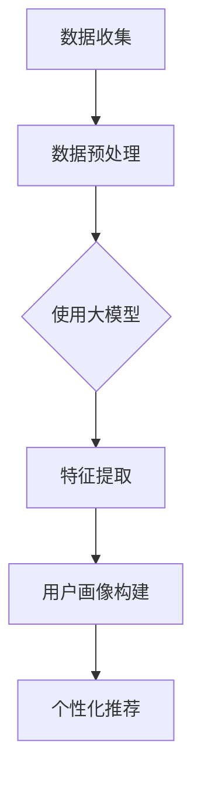

                 

关键词：大模型，电商平台，用户画像，机器学习，数据处理

> 摘要：本文从大模型的定义入手，探讨了其在电商平台用户画像构建中的应用。文章首先介绍了电商平台用户画像的基本概念和构建方法，然后深入分析了大模型在这一过程中的重要作用。通过具体案例和实践经验，本文总结了大模型在用户画像构建中的优势、挑战及未来发展趋势，为电商企业提升用户个性化服务提供了新的思路。

## 1. 背景介绍

随着互联网技术的飞速发展，电商平台已成为消费者购物的主要渠道。为了在激烈的市场竞争中脱颖而出，电商平台需要深入了解用户需求，提供个性化的商品推荐和服务。而用户画像作为一种重要的数据分析工具，可以帮助电商平台精准定位用户，优化营销策略。

用户画像是指通过对用户行为、兴趣、偏好等数据的收集、分析和处理，构建出一个全面的、多维度的用户信息模型。传统的用户画像构建方法主要依赖于统计分析和数据挖掘技术，但在海量数据和高维度特征的背景下，这些方法逐渐暴露出一些局限。

近年来，大模型的兴起为用户画像的构建带来了新的契机。大模型，通常指的是具有数十亿至数千亿参数的深度学习模型，例如Transformer、BERT等。大模型具备强大的特征提取能力和跨模态处理能力，能够处理复杂的多维度数据，从而更好地构建用户画像。

## 2. 核心概念与联系

### 2.1 大模型

大模型是指拥有数十亿至数千亿参数的深度学习模型，如Transformer、BERT等。大模型通过学习海量数据中的模式和规律，具备强大的特征提取能力和跨模态处理能力。

### 2.2 用户画像

用户画像是指通过对用户行为、兴趣、偏好等数据的收集、分析和处理，构建出一个全面的、多维度的用户信息模型。用户画像通常包括用户基本属性、行为数据、社交数据等。

### 2.3 大模型与用户画像的关系

大模型在用户画像构建中发挥着重要作用。首先，大模型能够处理复杂的多维度数据，提取出隐藏在数据中的用户特征。其次，大模型具备跨模态处理能力，可以将不同类型的数据（如文本、图像、音频等）进行整合，为用户画像提供更丰富的信息。最后，大模型能够自动更新和优化用户画像，适应用户行为的变化。

下面是一个简单的 Mermaid 流程图，展示大模型在用户画像构建中的应用过程：



## 3. 核心算法原理 & 具体操作步骤

### 3.1 算法原理概述

大模型在用户画像构建中的核心算法主要是基于深度学习的神经网络模型。这些模型通过多层神经网络结构，学习海量数据中的模式和规律，提取用户特征，并构建用户画像。

### 3.2 算法步骤详解

1. 数据收集：收集电商平台上的用户行为数据、兴趣数据、社交数据等。

2. 数据预处理：对收集到的数据进行清洗、去噪、归一化等处理，以便后续模型训练。

3. 模型训练：使用预处理后的数据训练大模型，如Transformer、BERT等。训练过程中，模型会自动调整内部参数，以最小化预测误差。

4. 特征提取：训练好的大模型能够提取出用户数据中的隐藏特征，为用户画像提供支持。

5. 用户画像构建：将提取出的用户特征进行整合，构建出全面的用户画像。

6. 个性化推荐：根据用户画像，为用户推荐个性化的商品和服务。

### 3.3 算法优缺点

#### 优点：

1. 强大的特征提取能力：大模型能够自动提取出用户数据中的隐藏特征，提高用户画像的准确性。

2. 跨模态处理能力：大模型能够整合不同类型的数据，为用户画像提供更丰富的信息。

3. 自适应能力：大模型能够自动更新和优化用户画像，适应用户行为的变化。

#### 缺点：

1. 计算资源消耗大：大模型训练过程需要大量的计算资源和时间。

2. 数据质量要求高：大模型对数据质量有较高要求，数据质量直接影响模型效果。

### 3.4 算法应用领域

大模型在用户画像构建中的应用广泛，如电商平台、社交媒体、在线教育等领域。以下是一些具体的应用场景：

1. 电商平台：根据用户画像进行个性化商品推荐，提高销售额。

2. 社交媒体：根据用户画像进行内容推荐，提高用户活跃度。

3. 在线教育：根据用户画像进行课程推荐，提高学习效果。

## 4. 数学模型和公式 & 详细讲解 & 举例说明

### 4.1 数学模型构建

大模型在用户画像构建中主要依赖于深度学习模型。深度学习模型的基本原理是通过多层神经网络结构，将输入数据逐层转化为高维特征表示。下面是一个简单的多层感知机（MLP）模型，用于用户画像构建：

$$
z^{(l)} = \sigma(W^{(l)} \cdot a^{(l-1)} + b^{(l)})
$$

其中，$z^{(l)}$表示第$l$层的输出，$a^{(l-1)}$表示第$l-1$层的输入，$W^{(l)}$和$b^{(l)}$分别为第$l$层的权重和偏置，$\sigma$为激活函数。

### 4.2 公式推导过程

多层感知机模型的推导过程如下：

1. 输入层：设输入层有$m$个神经元，每个神经元表示一个特征。

2. 隐藏层：设隐藏层有$n$个神经元，每个神经元表示一个特征组合。

3. 输出层：设输出层有$p$个神经元，每个神经元表示一个用户画像属性。

4. 激活函数：通常使用Sigmoid函数作为激活函数，将输入映射到$(0,1)$区间。

5. 前向传播：将输入数据经过隐藏层和输出层，得到输出结果。

6. 反向传播：根据输出结果与实际标签之间的误差，调整模型参数，以最小化误差。

### 4.3 案例分析与讲解

以下是一个简单的案例，展示如何使用多层感知机模型构建用户画像：

#### 案例背景：

一个电商平台收集了以下用户行为数据：

1. 用户年龄（$X_1$）：0-100岁

2. 用户性别（$X_2$）：男、女

3. 用户购买频率（$X_3$）：每天、每周、每月

4. 用户浏览时间（$X_4$）：10分钟、30分钟、1小时

#### 案例步骤：

1. 数据收集：收集上述用户行为数据。

2. 数据预处理：对数据进行归一化处理，将年龄、购买频率、浏览时间等数值特征进行标准化。

3. 模型训练：使用预处理后的数据训练一个三层感知机模型，其中输入层有4个神经元，隐藏层有10个神经元，输出层有3个神经元。

4. 特征提取：训练好的模型能够提取出用户行为数据中的隐藏特征，为用户画像提供支持。

5. 用户画像构建：根据提取出的特征，构建出一个完整的用户画像。

6. 个性化推荐：根据用户画像，为用户推荐个性化的商品。

## 5. 项目实践：代码实例和详细解释说明

### 5.1 开发环境搭建

在本文的项目实践中，我们将使用Python编程语言和相关的深度学习库（如TensorFlow和PyTorch）进行用户画像构建。以下是开发环境搭建的步骤：

1. 安装Python（建议使用Python 3.8以上版本）

2. 安装TensorFlow或PyTorch

3. 安装其他必要的库，如NumPy、Pandas、Matplotlib等

### 5.2 源代码详细实现

以下是一个简单的用户画像构建代码示例：

```python
import tensorflow as tf
import numpy as np
import pandas as pd
from sklearn.model_selection import train_test_split

# 数据收集与预处理
def load_data():
    # 加载用户行为数据（此处以CSV文件为例）
    data = pd.read_csv('user_behavior_data.csv')
    # 数据预处理（例如：归一化、缺失值填充等）
    # ...
    return data

# 模型定义
def create_model(input_shape):
    model = tf.keras.Sequential([
        tf.keras.layers.Dense(units=10, activation='relu', input_shape=input_shape),
        tf.keras.layers.Dense(units=3, activation='softmax')
    ])
    model.compile(optimizer='adam', loss='categorical_crossentropy', metrics=['accuracy'])
    return model

# 训练模型
def train_model(model, x_train, y_train, x_val, y_val):
    model.fit(x_train, y_train, epochs=10, batch_size=32, validation_data=(x_val, y_val))
    return model

# 构建用户画像
def build_user_profile(model, user_data):
    # 将用户数据输入模型，获取输出结果
    user_profile = model.predict(user_data)
    # 对输出结果进行解释（例如：使用softmax概率分布解释用户偏好）
    # ...
    return user_profile

# 主函数
def main():
    # 加载数据
    data = load_data()
    # 切分数据集
    x = data.drop('label', axis=1).values
    y = data['label'].values
    x_train, x_val, y_train, y_val = train_test_split(x, y, test_size=0.2, random_state=42)
    # 创建模型
    model = create_model(x_train.shape[1:])
    # 训练模型
    model = train_model(model, x_train, y_train, x_val, y_val)
    # 构建用户画像
    user_data = np.array([[25, 0, 1, 0.5]])  # 示例用户数据
    user_profile = build_user_profile(model, user_data)
    print(user_profile)

if __name__ == '__main__':
    main()
```

### 5.3 代码解读与分析

上述代码实现了一个简单的用户画像构建过程，主要包括以下步骤：

1. 数据收集与预处理：从CSV文件中加载数据，并进行必要的预处理操作，如归一化、缺失值填充等。

2. 模型定义：定义一个三层感知机模型，包括输入层、隐藏层和输出层。输入层有4个神经元，隐藏层有10个神经元，输出层有3个神经元。

3. 训练模型：使用预处理后的训练数据进行模型训练，使用交叉熵损失函数和Adam优化器。

4. 构建用户画像：将用户数据输入模型，获取输出结果，根据输出结果解释用户画像。

### 5.4 运行结果展示

运行上述代码，将输出示例用户的画像结果。根据输出结果，我们可以分析用户的偏好和需求，从而进行个性化推荐。

## 6. 实际应用场景

大模型在用户画像构建中的应用场景非常广泛，以下是一些典型的实际应用案例：

### 6.1 电商平台

电商平台利用大模型进行用户画像构建，可以实现对用户的精准定位和个性化推荐。例如，阿里巴巴的推荐系统使用大模型对用户行为数据进行深度学习，从而实现个性化的商品推荐。

### 6.2 社交媒体

社交媒体平台通过大模型构建用户画像，可以更好地理解用户的需求和兴趣，从而实现精准的内容推荐。例如，Facebook的Feed推荐系统使用大模型分析用户的行为和社交关系，为用户推荐感兴趣的内容。

### 6.3 在线教育

在线教育平台利用大模型构建用户画像，可以针对用户的学习习惯和兴趣进行个性化的课程推荐。例如，Coursera使用大模型分析用户的学习行为，为用户推荐适合的课程。

### 6.4 健康医疗

健康医疗领域利用大模型构建用户画像，可以实现对用户的健康风险评估和个性化诊疗。例如，IBM的Watson健康系统使用大模型分析用户的医疗数据，为医生提供个性化的诊疗建议。

## 7. 工具和资源推荐

为了更好地了解和掌握大模型在用户画像构建中的应用，以下是一些推荐的工具和资源：

### 7.1 学习资源推荐

1. 《深度学习》（Goodfellow et al.）：一本经典的深度学习入门教材，详细介绍了深度学习的基本原理和应用。

2. 《TensorFlow实战》（Siarohin et al.）：一本关于TensorFlow的实战指南，适合初学者快速掌握TensorFlow的使用。

3. 《大数据时代》（Hadoop et al.）：一本关于大数据技术和应用的经典著作，有助于了解大数据处理的方法和工具。

### 7.2 开发工具推荐

1. TensorFlow：Google推出的开源深度学习框架，广泛应用于深度学习研究和开发。

2. PyTorch：Facebook推出的开源深度学习框架，具有简洁易用的接口和强大的功能。

3. Jupyter Notebook：一种交互式计算环境，适用于数据分析和模型训练。

### 7.3 相关论文推荐

1. “Attention Is All You Need”（Vaswani et al.）：一篇介绍Transformer模型的经典论文，对深度学习领域产生了深远影响。

2. “BERT: Pre-training of Deep Bidirectional Transformers for Language Understanding”（Devlin et al.）：一篇介绍BERT模型的论文，是自然语言处理领域的重要突破。

3. “User Behavior Analysis and Personalized Recommendation in E-commerce”（Zhou et al.）：一篇关于电商平台用户画像构建的论文，详细介绍了相关技术和应用。

## 8. 总结：未来发展趋势与挑战

### 8.1 研究成果总结

大模型在用户画像构建中取得了显著的成果。首先，大模型具备强大的特征提取能力和跨模态处理能力，能够提取出隐藏在数据中的用户特征，提高用户画像的准确性。其次，大模型能够自动更新和优化用户画像，适应用户行为的变化。最后，大模型在多个实际应用场景中取得了良好的效果，如电商平台、社交媒体、在线教育等。

### 8.2 未来发展趋势

未来，大模型在用户画像构建中的应用将呈现以下趋势：

1. 模型规模将不断扩大：随着计算能力的提升，大模型的规模将不断增大，以处理更复杂的用户数据。

2. 跨模态处理能力将进一步提升：大模型将结合多种类型的数据，如文本、图像、音频等，构建更全面的用户画像。

3. 隐私保护和数据安全：在大模型应用中，隐私保护和数据安全将成为重要问题，需要采用先进的加密和隐私保护技术。

4. 智能化服务：大模型将结合人工智能技术，为用户提供更加智能化、个性化的服务。

### 8.3 面临的挑战

尽管大模型在用户画像构建中取得了显著成果，但仍面临以下挑战：

1. 计算资源消耗：大模型训练过程需要大量的计算资源和时间，对计算资源的要求较高。

2. 数据质量要求高：大模型对数据质量有较高要求，数据质量直接影响模型效果。

3. 模型可解释性：大模型在处理复杂数据时，其内部机制较为复杂，导致模型的可解释性较差。

4. 隐私保护：在大模型应用中，如何保护用户隐私和数据安全是一个亟待解决的问题。

### 8.4 研究展望

未来，大模型在用户画像构建中的应用前景广阔。一方面，随着深度学习技术的不断发展，大模型将具备更强的特征提取和跨模态处理能力。另一方面，隐私保护和数据安全技术的进步将为大模型的应用提供保障。此外，智能化服务的普及将进一步提升用户画像构建的应用价值。

总之，大模型在用户画像构建中具有重要的地位和广阔的应用前景。通过不断优化大模型的技术和应用，我们可以为电商平台、社交媒体、在线教育等领域提供更加个性化、智能化的服务，为用户创造更大的价值。

## 9. 附录：常见问题与解答

### 9.1 什么是大模型？

大模型是指具有数十亿至数千亿参数的深度学习模型，如Transformer、BERT等。大模型通过学习海量数据中的模式和规律，具备强大的特征提取能力和跨模态处理能力。

### 9.2 大模型在用户画像构建中有何优势？

大模型在用户画像构建中具备以下优势：

1. 强大的特征提取能力：大模型能够自动提取出用户数据中的隐藏特征，提高用户画像的准确性。

2. 跨模态处理能力：大模型能够整合不同类型的数据（如文本、图像、音频等），为用户画像提供更丰富的信息。

3. 自适应能力：大模型能够自动更新和优化用户画像，适应用户行为的变化。

### 9.3 大模型在用户画像构建中面临哪些挑战？

大模型在用户画像构建中面临以下挑战：

1. 计算资源消耗：大模型训练过程需要大量的计算资源和时间。

2. 数据质量要求高：大模型对数据质量有较高要求，数据质量直接影响模型效果。

3. 模型可解释性：大模型在处理复杂数据时，其内部机制较为复杂，导致模型的可解释性较差。

4. 隐私保护：在大模型应用中，如何保护用户隐私和数据安全是一个亟待解决的问题。

### 9.4 如何解决大模型在用户画像构建中的挑战？

针对大模型在用户画像构建中面临的挑战，可以采取以下措施：

1. 提高计算资源利用率：采用分布式计算、GPU加速等技术，提高大模型训练的效率。

2. 提高数据质量：通过数据清洗、去噪、归一化等预处理技术，提高数据质量。

3. 优化模型结构：设计具有更好可解释性的模型结构，提高模型的透明度和可解释性。

4. 采用隐私保护技术：采用差分隐私、联邦学习等隐私保护技术，确保用户隐私和数据安全。

### 9.5 大模型在用户画像构建中的应用前景如何？

大模型在用户画像构建中的应用前景广阔。随着深度学习技术的不断发展，大模型将具备更强的特征提取和跨模态处理能力。此外，隐私保护和数据安全技术的进步将为大模型的应用提供保障。智能化服务的普及将进一步提升用户画像构建的应用价值。总之，大模型在用户画像构建中具有重要的地位和广阔的应用前景。

