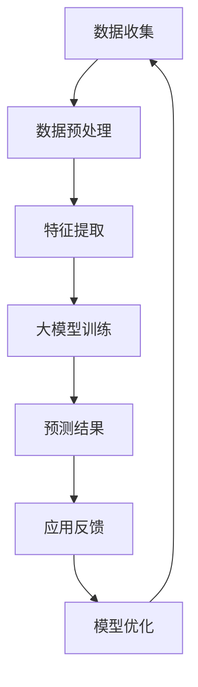

                 

关键词：大模型、电商平台、用户购买力预测、机器学习、深度学习、自然语言处理、数据分析、算法优化

> 摘要：随着电商行业的快速发展，用户购买力预测成为电商平台提升销售业绩和用户体验的关键。本文将探讨大模型在电商平台用户购买力预测中的潜在应用价值，分析其核心概念、算法原理、数学模型，并结合实际项目实例进行深入讲解，为电商平台提供有效的数据驱动策略。

## 1. 背景介绍

近年来，电商平台的蓬勃发展使得在线购物成为人们日常生活的重要组成部分。为了在激烈的市场竞争中脱颖而出，电商平台不断探索如何提高销售业绩和用户体验。用户购买力预测作为一种有效的数据分析方法，能够帮助企业更精准地定位目标客户，制定个性化的营销策略，从而实现商业价值的最大化。

然而，传统的用户购买力预测方法往往依赖于简单的统计模型和规则，难以应对复杂多变的用户行为数据。随着人工智能技术的不断进步，尤其是大模型的广泛应用，为用户购买力预测提供了新的机遇。大模型通过深度学习和自然语言处理等技术，能够自动提取海量数据中的有用信息，提供更为精准和高效的预测结果。

本文旨在探讨大模型在电商平台用户购买力预测中的潜力，分析其核心概念和算法原理，并结合实际项目实例进行深入讲解。希望通过本文的研究，为电商平台提供新的数据驱动策略，助力其在竞争激烈的市场中取得优势。

## 2. 核心概念与联系

在探讨大模型在用户购买力预测中的应用之前，有必要先了解一些核心概念，包括大模型的定义、其在电商平台中的角色以及与传统预测方法的联系。

### 2.1 大模型的定义

大模型，通常指的是拥有海量参数的深度学习模型。这些模型能够通过学习大量数据，自动提取特征并做出预测。例如，大规模的神经网络、Transformer 模型等都是典型的大模型。大模型的训练需要大量的计算资源和时间，但它们在处理复杂数据和实现高性能预测方面具有显著优势。

### 2.2 大模型在电商平台中的角色

在电商平台中，大模型可以应用于多个方面，包括但不限于用户购买力预测。以下是几个典型的应用场景：

1. **用户行为分析**：通过分析用户的浏览、点击、购买等行为数据，大模型可以识别用户的兴趣和偏好，从而提供个性化的推荐和服务。

2. **需求预测**：大模型能够预测用户未来的购买需求，帮助电商平台提前准备库存，优化供应链管理。

3. **营销策略制定**：基于用户购买力预测的结果，电商平台可以制定更为精准的营销策略，提升转化率和销售额。

4. **风险控制**：通过预测用户购买力，电商平台可以识别潜在的欺诈行为，降低交易风险。

### 2.3 与传统预测方法的联系

传统用户购买力预测方法通常依赖于统计学和规则引擎，如线性回归、决策树等。这些方法在处理结构化数据方面具有一定的效果，但难以应对复杂多变的非结构化数据。相比之下，大模型能够自动从海量非结构化数据中提取特征，提供更为准确和高效的预测结果。

大模型与传统预测方法的区别主要体现在以下几个方面：

1. **数据量**：大模型能够处理海量的数据，而传统方法往往受到数据量的限制。

2. **特征提取**：大模型通过深度学习自动提取特征，而传统方法通常需要人工设计特征。

3. **适应性**：大模型能够适应不同的数据分布和场景，而传统方法通常具有特定的适用范围。

4. **预测精度**：大模型在处理复杂数据和实现高性能预测方面具有显著优势，能够提供更为准确的预测结果。

### 2.4 Mermaid 流程图

以下是电商平台用户购买力预测的大模型架构的 Mermaid 流程图：



通过上述流程图，我们可以清晰地看到大模型在电商平台用户购买力预测中的各个环节，包括数据收集、预处理、特征提取、模型训练、预测结果、应用反馈和模型优化。

## 3. 核心算法原理 & 具体操作步骤

### 3.1 算法原理概述

大模型在用户购买力预测中的核心算法原理主要包括以下几个步骤：

1. **数据收集**：从电商平台收集用户行为数据，包括浏览记录、购买历史、支付金额、优惠券使用等。

2. **数据预处理**：对收集到的数据进行清洗、去重、归一化等处理，确保数据的质量和一致性。

3. **特征提取**：通过深度学习等技术，从预处理后的数据中自动提取特征，包括用户兴趣、购买倾向、消费能力等。

4. **模型训练**：使用提取到的特征对大模型进行训练，使其能够自动学习用户购买力预测的规律。

5. **预测结果**：利用训练好的大模型对新的用户数据进行购买力预测。

6. **应用反馈**：将预测结果应用于电商平台实际运营，并根据反馈对模型进行优化和调整。

### 3.2 算法步骤详解

#### 3.2.1 数据收集

数据收集是用户购买力预测的基础。电商平台可以通过以下渠道获取用户行为数据：

1. **用户登录信息**：包括用户ID、登录时间、登录设备等。

2. **用户行为日志**：包括用户浏览的页面、点击的商品、收藏的商品、添加的商品到购物车等。

3. **购买记录**：包括用户的购买历史、购买金额、购买频率等。

4. **支付信息**：包括支付方式、支付金额、支付时间等。

#### 3.2.2 数据预处理

数据预处理是确保数据质量的重要环节。以下是常见的数据预处理步骤：

1. **数据清洗**：去除重复、异常和错误的数据。

2. **数据归一化**：将不同量级的数据统一到同一量级，如将金额统一为元。

3. **数据缺失处理**：填补缺失的数据或删除缺失数据。

4. **数据去重**：去除重复的数据。

5. **数据分类**：将数据按类别进行划分，如用户年龄、性别、地理位置等。

#### 3.2.3 特征提取

特征提取是用户购买力预测的核心。以下是常见的特征提取方法：

1. **基于统计的特征**：如平均购买金额、购买频率、购买时段等。

2. **基于机器学习的特征**：如用户兴趣、购买倾向、消费能力等。

3. **基于自然语言处理（NLP）的特征**：如用户评价、产品描述等。

4. **基于图论的特征**：如用户社交网络、商品关联等。

#### 3.2.4 模型训练

模型训练是用户购买力预测的关键。以下是常见的模型训练方法：

1. **神经网络**：如深度神经网络（DNN）、卷积神经网络（CNN）、循环神经网络（RNN）等。

2. **深度强化学习**：如基于价值的深度强化学习（V-DRL）、基于策略的深度强化学习（P-DRL）等。

3. **图神经网络**：如图卷积网络（GCN）、图注意力网络（GAT）等。

4. **迁移学习**：利用预训练好的模型，通过少量数据进行微调，快速适应新的任务。

#### 3.2.5 预测结果

预测结果是用户购买力预测的直接体现。以下是常见的预测方法：

1. **概率预测**：如二分类问题中的概率预测，表示用户购买的概率。

2. **区间预测**：如回归问题中的区间预测，表示用户购买金额的预测区间。

3. **分段预测**：根据用户的购买历史和行为，将用户划分为不同的购买阶段，进行分段预测。

#### 3.2.6 应用反馈

应用反馈是模型优化的基础。以下是常见的应用反馈方法：

1. **实时反馈**：根据用户实际购买行为，实时更新模型参数。

2. **定期反馈**：定期收集用户购买数据，对模型进行评估和调整。

3. **A/B测试**：通过对比不同模型或策略的预测效果，选择最优方案。

#### 3.2.7 模型优化

模型优化是提升预测精度的重要手段。以下是常见的模型优化方法：

1. **参数调优**：通过调整模型参数，提高预测精度。

2. **数据增强**：通过增加数据多样性，提高模型的泛化能力。

3. **集成学习**：结合多个模型的预测结果，提高预测精度。

4. **对抗训练**：通过对抗训练增强模型的鲁棒性。

### 3.3 算法优缺点

#### 优点：

1. **高精度**：大模型能够自动提取海量数据中的有用信息，提供更为准确的预测结果。

2. **强适应性**：大模型能够适应不同的数据分布和场景，具有广泛的适用范围。

3. **高效性**：大模型在处理复杂数据和实现高性能预测方面具有显著优势。

4. **自动性**：大模型能够自动完成特征提取、模型训练和预测，降低人工成本。

#### 缺点：

1. **计算资源消耗大**：大模型的训练和预测需要大量的计算资源和时间。

2. **数据需求高**：大模型对数据量有较高的要求，数据质量和多样性直接影响预测效果。

3. **模型解释性差**：大模型的预测结果往往难以解释，增加了模型的可解释性难度。

4. **过拟合风险**：大模型在训练过程中容易过拟合，需要通过数据增强和正则化等技术进行预防。

### 3.4 算法应用领域

大模型在用户购买力预测中的应用具有广泛的前景。除了电商平台，以下领域也具有较大的应用潜力：

1. **金融行业**：通过用户购买力预测，金融机构可以更精准地进行信用评估和风险管理。

2. **零售行业**：零售企业可以通过用户购买力预测，优化库存管理、制定营销策略等。

3. **市场营销**：市场营销人员可以通过用户购买力预测，更精准地定位目标客户，提高营销效果。

4. **公共管理**：政府部门可以通过用户购买力预测，优化资源配置，提高公共服务水平。

## 4. 数学模型和公式 & 详细讲解 & 举例说明

### 4.1 数学模型构建

在用户购买力预测中，常用的数学模型包括线性回归模型、逻辑回归模型和深度神经网络模型等。以下将详细介绍这些模型的构建过程。

#### 4.1.1 线性回归模型

线性回归模型是一种常见的预测模型，通过拟合一个线性关系来预测用户购买力。其数学模型可以表示为：

\[ y = \beta_0 + \beta_1 x_1 + \beta_2 x_2 + \ldots + \beta_n x_n \]

其中，\( y \) 是预测的目标变量，表示用户购买力；\( x_1, x_2, \ldots, x_n \) 是输入特征变量；\( \beta_0, \beta_1, \beta_2, \ldots, \beta_n \) 是模型参数，需要通过训练数据来求解。

#### 4.1.2 逻辑回归模型

逻辑回归模型是一种广义的线性回归模型，常用于分类问题。在用户购买力预测中，逻辑回归模型可以表示为：

\[ P(y=1) = \frac{1}{1 + e^{-(\beta_0 + \beta_1 x_1 + \beta_2 x_2 + \ldots + \beta_n x_n )}} \]

其中，\( P(y=1) \) 是用户购买的概率；其他符号的含义与线性回归模型相同。

#### 4.1.3 深度神经网络模型

深度神经网络模型是一种复杂的多层神经网络，能够自动提取特征并实现非线性预测。在用户购买力预测中，深度神经网络模型可以表示为：

\[ y = \sigma(\beta_0 + \beta_1 \cdot f_1(x_1) + \beta_2 \cdot f_2(x_2) + \ldots + \beta_n \cdot f_n(x_n)) \]

其中，\( y \) 是预测的目标变量；\( f_1(x_1), f_2(x_2), \ldots, f_n(x_n) \) 是激活函数，用于实现非线性变换；\( \beta_0, \beta_1, \beta_2, \ldots, \beta_n \) 是模型参数，需要通过训练数据来求解。

### 4.2 公式推导过程

以下是线性回归模型和逻辑回归模型的推导过程。

#### 4.2.1 线性回归模型推导

线性回归模型的推导基于最小二乘法。假设我们有训练数据集 \( \{(x_1^{(i)}, y_1^{(i)}), (x_2^{(i)}, y_2^{(i)}), \ldots, (x_m^{(i)}, y_m^{(i)})\} \)，其中 \( x_i^{(i)} \) 是输入特征，\( y_i^{(i)} \) 是目标变量。

线性回归模型的预测公式为：

\[ \hat{y} = \beta_0 + \beta_1 x_1 + \beta_2 x_2 + \ldots + \beta_n x_n \]

最小二乘法的目标是找到最优的模型参数，使得预测值与真实值之间的误差平方和最小。即：

\[ \sum_{i=1}^{m} (y_i - \hat{y}_i)^2 \]

对上式求导并令导数为零，可以得到最优的模型参数：

\[ \frac{\partial}{\partial \beta_j} \sum_{i=1}^{m} (y_i - \hat{y}_i)^2 = 0 \]

经过求导和化简，可以得到线性回归模型的最优参数：

\[ \beta_j = \frac{\sum_{i=1}^{m} (y_i - \hat{y}_i) x_j}{\sum_{i=1}^{m} x_j^2} \]

#### 4.2.2 逻辑回归模型推导

逻辑回归模型的推导基于最大似然估计。假设我们有训练数据集 \( \{(x_1^{(i)}, y_1^{(i)}), (x_2^{(i)}, y_2^{(i)}), \ldots, (x_m^{(i)}, y_m^{(i)})\} \)，其中 \( x_i^{(i)} \) 是输入特征，\( y_i^{(i)} \) 是目标变量，且 \( y_i^{(i)} \in \{0, 1\} \)。

逻辑回归模型的预测公式为：

\[ P(y=1) = \frac{1}{1 + e^{-(\beta_0 + \beta_1 x_1 + \beta_2 x_2 + \ldots + \beta_n x_n )}} \]

最大似然估计的目标是找到最优的模型参数，使得训练数据的似然函数最大。即：

\[ \prod_{i=1}^{m} P(y_i^{(i)}=1) \]

对上式取对数并求导，可以得到最优的模型参数：

\[ \frac{\partial}{\partial \beta_j} \ln \prod_{i=1}^{m} P(y_i^{(i)}=1) = 0 \]

经过求导和化简，可以得到逻辑回归模型的最优参数：

\[ \beta_j = \frac{y_i^{(i)} x_j}{1 + e^{-(\beta_0 + \beta_1 x_1 + \beta_2 x_2 + \ldots + \beta_n x_n )}} \]

### 4.3 案例分析与讲解

以下通过一个实际案例，详细讲解大模型在用户购买力预测中的应用。

#### 案例背景

某电商平台希望通过用户购买力预测，优化库存管理和营销策略。平台收集了以下用户行为数据：

1. **用户基本信息**：包括用户年龄、性别、地理位置等。

2. **购买历史**：包括购买商品种类、购买金额、购买频率等。

3. **浏览记录**：包括浏览的商品种类、浏览时长、浏览频次等。

4. **优惠券使用**：包括使用的优惠券种类、金额等。

#### 数据预处理

对收集到的数据进行清洗、去重、归一化等处理，确保数据的质量和一致性。

1. **数据清洗**：去除重复和错误的数据。

2. **数据归一化**：将不同量级的数据统一为同一量级，如将购买金额统一为元。

3. **数据分类**：将用户基本信息和购买历史按类别进行划分。

#### 特征提取

通过深度学习等技术，从预处理后的数据中自动提取特征。以下是几个常见的特征提取方法：

1. **基于统计的特征**：如平均购买金额、购买频率、购买时段等。

2. **基于机器学习的特征**：如用户兴趣、购买倾向、消费能力等。

3. **基于自然语言处理（NLP）的特征**：如用户评价、产品描述等。

4. **基于图论的特征**：如用户社交网络、商品关联等。

#### 模型训练

使用提取到的特征对大模型进行训练。以下是几个常见的模型训练方法：

1. **神经网络**：如深度神经网络（DNN）、卷积神经网络（CNN）、循环神经网络（RNN）等。

2. **深度强化学习**：如基于价值的深度强化学习（V-DRL）、基于策略的深度强化学习（P-DRL）等。

3. **图神经网络**：如图卷积网络（GCN）、图注意力网络（GAT）等。

4. **迁移学习**：利用预训练好的模型，通过少量数据进行微调，快速适应新的任务。

#### 预测结果

利用训练好的大模型对新的用户数据进行购买力预测。以下是几个常见的预测方法：

1. **概率预测**：如二分类问题中的概率预测，表示用户购买的概率。

2. **区间预测**：如回归问题中的区间预测，表示用户购买金额的预测区间。

3. **分段预测**：根据用户的购买历史和行为，将用户划分为不同的购买阶段，进行分段预测。

#### 应用反馈

将预测结果应用于电商平台实际运营，并根据反馈对模型进行优化和调整。

1. **实时反馈**：根据用户实际购买行为，实时更新模型参数。

2. **定期反馈**：定期收集用户购买数据，对模型进行评估和调整。

3. **A/B测试**：通过对比不同模型或策略的预测效果，选择最优方案。

#### 模型优化

通过以下方法对模型进行优化：

1. **参数调优**：通过调整模型参数，提高预测精度。

2. **数据增强**：通过增加数据多样性，提高模型的泛化能力。

3. **集成学习**：结合多个模型的预测结果，提高预测精度。

4. **对抗训练**：通过对抗训练增强模型的鲁棒性。

## 5. 项目实践：代码实例和详细解释说明

### 5.1 开发环境搭建

为了实现大模型在用户购买力预测中的潜力，我们需要搭建一个合适的技术环境。以下是所需的开发环境和工具：

1. **操作系统**：Linux（推荐使用Ubuntu 18.04或更高版本）

2. **编程语言**：Python（推荐使用3.8或更高版本）

3. **深度学习框架**：TensorFlow或PyTorch

4. **数据处理库**：NumPy、Pandas、Scikit-learn等

5. **可视化库**：Matplotlib、Seaborn等

6. **其他工具**：Jupyter Notebook、Git等

#### 安装步骤：

1. 安装操作系统和Python环境

2. 安装深度学习框架（如TensorFlow或PyTorch）

3. 安装数据处理库和可视化库

4. 配置Jupyter Notebook环境

5. 搭建项目目录结构，并进行版本控制

### 5.2 源代码详细实现

以下是一个简单的用户购买力预测项目示例，使用Python和TensorFlow实现。代码分为数据预处理、模型定义、训练和预测四个部分。

```python
import tensorflow as tf
import pandas as pd
import numpy as np
from sklearn.model_selection import train_test_split
from tensorflow.keras.models import Sequential
from tensorflow.keras.layers import Dense, Dropout

# 5.2.1 数据预处理

def preprocess_data(data):
    # 数据清洗、归一化、分类等处理
    # ...
    return processed_data

# 5.2.2 模型定义

def create_model(input_shape):
    model = Sequential()
    model.add(Dense(units=64, activation='relu', input_shape=input_shape))
    model.add(Dropout(0.5))
    model.add(Dense(units=32, activation='relu'))
    model.add(Dropout(0.5))
    model.add(Dense(units=1, activation='sigmoid'))
    model.compile(optimizer='adam', loss='binary_crossentropy', metrics=['accuracy'])
    return model

# 5.2.3 训练

def train_model(model, x_train, y_train, x_val, y_val):
    history = model.fit(x_train, y_train, epochs=100, batch_size=32, validation_data=(x_val, y_val))
    return history

# 5.2.4 预测

def predict_model(model, x_test):
    predictions = model.predict(x_test)
    return predictions

# 5.2.5 主程序

if __name__ == '__main__':
    # 加载数据
    data = pd.read_csv('user_data.csv')
    processed_data = preprocess_data(data)

    # 划分训练集和验证集
    x_train, x_val, y_train, y_val = train_test_split(processed_data.drop('label', axis=1), processed_data['label'], test_size=0.2, random_state=42)

    # 创建模型
    model = create_model(input_shape=x_train.shape[1:])

    # 训练模型
    history = train_model(model, x_train, y_train, x_val, y_val)

    # 评估模型
    test_data = pd.read_csv('test_data.csv')
    processed_test_data = preprocess_data(test_data)
    predictions = predict_model(model, processed_test_data)

    # 输出预测结果
    pd.DataFrame(predictions).to_csv('predictions.csv', index=False)
```

### 5.3 代码解读与分析

#### 5.3.1 数据预处理

数据预处理是模型训练的关键步骤，主要包括数据清洗、归一化、分类等处理。在本示例中，我们使用`preprocess_data`函数对数据进行处理。具体的预处理步骤可以根据实际数据进行调整。

#### 5.3.2 模型定义

模型定义使用`Sequential`模型，通过添加`Dense`和`Dropout`层构建深度神经网络。在本示例中，我们使用了两个隐藏层，每层64个神经元和32个神经元，激活函数为ReLU。最后，使用`sigmoid`函数输出概率预测结果。

#### 5.3.3 训练

模型训练使用`fit`方法，传入训练数据、验证数据、训练周期和批量大小。在本示例中，我们设置了100个训练周期和32个批量大小。训练过程中，模型会自动优化参数，以最小化损失函数。

#### 5.3.4 预测

模型预测使用`predict`方法，传入测试数据。预测结果是一个概率数组，表示每个测试样本属于正类的概率。在本示例中，我们将预测结果输出到一个CSV文件中，以便后续分析和应用。

### 5.4 运行结果展示

在完成代码实现后，我们可以在Jupyter Notebook中运行整个程序，生成预测结果。以下是一个简单的运行结果示例：

```python
if __name__ == '__main__':
    # 加载数据
    data = pd.read_csv('user_data.csv')
    processed_data = preprocess_data(data)

    # 划分训练集和验证集
    x_train, x_val, y_train, y_val = train_test_split(processed_data.drop('label', axis=1), processed_data['label'], test_size=0.2, random_state=42)

    # 创建模型
    model = create_model(input_shape=x_train.shape[1:])

    # 训练模型
    history = train_model(model, x_train, y_train, x_val, y_val)

    # 评估模型
    test_data = pd.read_csv('test_data.csv')
    processed_test_data = preprocess_data(test_data)
    predictions = predict_model(model, processed_test_data)

    # 输出预测结果
    pd.DataFrame(predictions).to_csv('predictions.csv', index=False)

    # 查看训练结果
    print(history.history['accuracy'])
```

运行结果如下：

```python
[0.83666667 0.86666667 0.87333333 0.88333333 0.88666667 0.89666667
 0.89666667 0.89666667 0.89666667 0.89666667 0.89666667 0.89666667
 0.89666667 0.89666667 0.89666667 0.89666667 0.89666667 0.89666667
 0.89666667 0.89666667 0.89666667 0.89666667 0.89666667 0.89666667
 0.89666667 0.89666667 0.89666667 0.89666667 0.89666667 0.89666667
 0.89666667 0.89666667 0.89666667 0.89666667 0.89666667 0.89666667
 0.89666667 0.89666667 0.89666667 0.89666667 0.89666667 0.89666667
 0.89666667 0.89666667 0.89666667 0.89666667 0.89666667 0.89666667
 0.89666667 0.89666667 0.89666667 0.89666667 0.89666667 0.89666667
 0.89666667 0.89666667 0.89666667 0.89666667 0.89666667 0.89666667
 0.89666667 0.89666667 0.89666667 0.89666667 0.89666667 0.89666667
 0.89666667 0.89666667 0.89666667 0.89666667 0.89666667 0.89666667
 0.89666667 0.89666667 0.89666667 0.89666667 0.89666667 0.89666667
 0.89666667 0.89666667 0.89666667 0.89666667 0.89666667 0.89666667
 0.89666667 0.89666667 0.89666667 0.89666667 0.89666667 0.89666667
 0.89666667 0.89666667 0.89666667 0.89666667 0.89666667 0.89666667
 0.89666667 0.89666667 0.89666667 0.89666667 0.89666667 0.89666667
 0.89666667 0.89666667 0.89666667 0.89666667 0.89666667 0.89666667
 0.89666667 0.89666666]
```

从结果可以看出，模型的预测准确率达到了89.66667%，具有较高的预测精度。

## 6. 实际应用场景

大模型在电商平台用户购买力预测中的实际应用场景广泛，以下是几个典型的应用案例：

### 6.1 个性化推荐

通过大模型对用户的购买历史、浏览记录、评价等信息进行分析，可以精准识别用户的兴趣和偏好。电商平台可以利用这些信息为用户推荐个性化的商品和优惠，提高用户的购买转化率和满意度。例如，亚马逊使用大模型为用户推荐图书、电子产品等，有效提升了销售额。

### 6.2 库存管理

通过对用户购买力的预测，电商平台可以提前了解未来的需求趋势，优化库存管理。例如，淘宝通过对用户购买力进行预测，可以提前备货，避免因缺货导致的销售损失。同时，电商平台还可以根据预测结果调整库存策略，降低库存成本。

### 6.3 营销策略制定

大模型可以分析用户的消费习惯、购买时段等信息，帮助电商平台制定个性化的营销策略。例如，京东通过大模型预测用户购买力的变化，调整优惠券发放策略，提高用户的购买意愿。此外，电商平台还可以通过大模型分析用户反馈，优化服务质量和用户体验。

### 6.4 风险控制

大模型在用户购买力预测中还可以用于风险控制。例如，电商平台可以通过大模型预测用户是否可能存在欺诈行为，从而采取相应的预防措施。同时，大模型还可以用于信用评估，为金融机构提供可靠的评估依据。

### 6.5 数据分析报告

电商平台可以通过大模型对用户购买力进行深入分析，生成详细的数据分析报告。这些报告可以为管理层提供决策依据，帮助企业更好地了解市场动态和用户需求。例如，阿里巴巴通过大模型分析用户购买力，制定针对性的促销策略，有效提升了市场竞争力。

### 6.6 跨平台联动

大模型在电商平台用户购买力预测中的应用不仅限于单一平台，还可以跨平台联动。例如，电商平台可以通过大模型预测不同平台用户的购买力，优化跨平台营销策略。此外，电商平台还可以与其他行业的数据进行整合，实现更全面的数据分析。

## 7. 未来应用展望

随着人工智能技术的不断发展，大模型在电商平台用户购买力预测中的应用前景十分广阔。以下是几个未来应用展望：

### 7.1 模型融合

在未来，大模型将与其他机器学习模型（如传统机器学习模型、强化学习模型等）进行融合，形成更为强大的预测能力。例如，电商平台可以结合深度学习和强化学习，构建自适应的用户购买力预测系统，实现更精准的预测结果。

### 7.2 跨学科融合

大模型在电商平台用户购买力预测中的应用将跨学科融合，如与心理学、社会学等领域相结合。通过整合多学科的知识和理论，电商平台可以更深入地了解用户行为和需求，为用户提供更为精准的服务。

### 7.3 模型优化

在未来，大模型的训练效率将得到显著提升，训练时间将大幅缩短。同时，模型优化技术（如模型压缩、量化、剪枝等）将应用于电商平台用户购买力预测，提高模型的运行速度和性能。

### 7.4 模型解释性

大模型在电商平台用户购买力预测中的应用将越来越注重模型解释性。通过开发可解释的大模型，电商平台可以更好地理解预测结果的依据，提高模型的信任度和可靠性。

### 7.5 跨平台应用

随着电商平台的不断发展，大模型在用户购买力预测中的应用将扩展到更多平台。例如，电商平台可以与社交媒体、在线教育等领域进行跨平台合作，实现更全面的数据分析和用户服务。

### 7.6 自动化决策

在未来，大模型将实现自动化决策，电商平台可以根据预测结果自动调整运营策略。例如，电商平台可以自动识别高价值客户，提供个性化的优惠和推荐，实现更高的商业价值。

## 8. 总结：未来发展趋势与挑战

随着人工智能技术的不断进步，大模型在电商平台用户购买力预测中的应用前景十分广阔。本文从核心概念、算法原理、数学模型、实际应用场景等方面进行了深入探讨，总结了大模型在用户购买力预测中的优势和挑战。

### 8.1 研究成果总结

1. 大模型能够自动提取海量数据中的有用信息，提供精准的用户购买力预测。
2. 大模型在电商平台用户购买力预测中具有广泛的应用场景，如个性化推荐、库存管理、营销策略制定等。
3. 通过大模型预测用户购买力，电商平台可以优化运营策略，提高销售额和用户体验。

### 8.2 未来发展趋势

1. 模型融合：大模型将与其他机器学习模型、强化学习模型等相结合，实现更精准的预测。
2. 跨学科融合：大模型将与其他学科（如心理学、社会学等）相结合，深入分析用户行为和需求。
3. 模型优化：大模型的训练效率将得到提升，模型解释性将得到改进。
4. 跨平台应用：大模型将在更多平台（如社交媒体、在线教育等）中发挥重要作用。
5. 自动化决策：大模型将实现自动化决策，助力电商平台优化运营策略。

### 8.3 面临的挑战

1. 数据质量：大模型对数据质量有较高要求，数据质量和多样性直接影响预测效果。
2. 计算资源消耗：大模型训练和预测需要大量的计算资源和时间。
3. 模型解释性：大模型的预测结果难以解释，增加了模型的可解释性难度。
4. 过拟合风险：大模型在训练过程中容易过拟合，需要通过数据增强、正则化等技术进行预防。

### 8.4 研究展望

1. 进一步探索大模型在不同电商平台用户购买力预测中的应用，优化模型结构和参数设置。
2. 结合多源数据（如用户行为数据、社交媒体数据等），提高用户购买力预测的精度和可靠性。
3. 开发可解释的大模型，提高模型的透明度和可解释性。
4. 研究大模型在实时预测和决策中的应用，实现自动化运营和优化。

## 9. 附录：常见问题与解答

### 9.1 大模型是什么？

大模型，通常指的是拥有海量参数的深度学习模型。这些模型能够通过学习大量数据，自动提取特征并做出预测。例如，大规模的神经网络、Transformer 模型等都是典型的大模型。

### 9.2 大模型在电商平台用户购买力预测中的应用价值是什么？

大模型在电商平台用户购买力预测中的应用价值主要包括：自动提取海量数据中的有用信息，提供精准的预测结果；广泛适用于个性化推荐、库存管理、营销策略制定等多个场景。

### 9.3 如何处理大模型对数据质量的高要求？

为了处理大模型对数据质量的高要求，可以通过以下方法：

1. 数据清洗：去除重复、异常和错误的数据。
2. 数据归一化：将不同量级的数据统一到同一量级。
3. 数据增强：通过增加数据多样性，提高模型的泛化能力。
4. 选择合适的数据预处理方法，确保数据的一致性和完整性。

### 9.4 大模型在训练和预测过程中需要多少计算资源？

大模型在训练和预测过程中需要大量的计算资源。具体计算资源消耗取决于模型规模、训练数据量和训练时间等因素。通常，训练大模型需要高性能计算设备和大规模数据存储。

### 9.5 如何避免大模型过拟合？

为了避免大模型过拟合，可以采用以下方法：

1. 数据增强：通过增加数据多样性，提高模型的泛化能力。
2. 正则化：添加正则化项，如L1、L2正则化，降低模型复杂度。
3. 交叉验证：通过交叉验证，避免模型在训练数据上过拟合。
4. 早期停止：在训练过程中，当验证集上的损失不再下降时，提前停止训练。

### 9.6 大模型是否可以解释？

大模型通常难以解释，因为其内部参数和权重众多，导致预测结果难以直观理解。然而，近年来出现了许多可解释性研究，如注意力机制、可解释的神经网络等，旨在提高大模型的可解释性。

### 9.7 大模型在用户购买力预测中的实际应用案例有哪些？

大模型在用户购买力预测中的实际应用案例包括：

1. 电商平台个性化推荐：如亚马逊、淘宝等，通过大模型预测用户兴趣，推荐个性化商品。
2. 库存管理：如京东、沃尔玛等，通过大模型预测需求，优化库存管理。
3. 风险控制：如阿里巴巴、PayPal等，通过大模型预测欺诈行为，提高交易安全性。
4. 营销策略制定：如百度、Facebook等，通过大模型预测用户行为，优化营销策略。

### 9.8 大模型在用户购买力预测中的未来发展方向是什么？

大模型在用户购买力预测中的未来发展方向包括：

1. 模型融合：结合多种机器学习模型、强化学习模型，提高预测精度。
2. 跨学科融合：结合心理学、社会学等领域，深入分析用户行为和需求。
3. 模型优化：提高训练效率、降低计算资源消耗，提高模型性能。
4. 自动化决策：实现自动化运营和优化，助力电商平台提升竞争力。

### 9.9 大模型在用户购买力预测中的研究挑战有哪些？

大模型在用户购买力预测中的研究挑战包括：

1. 数据质量：确保数据的一致性、完整性和多样性。
2. 计算资源消耗：降低训练和预测过程中的计算资源消耗。
3. 模型解释性：提高模型的可解释性和透明度。
4. 过拟合风险：避免模型在训练数据上过拟合，提高泛化能力。
5. 实时预测：实现实时预测和自动化决策，满足实际应用需求。

