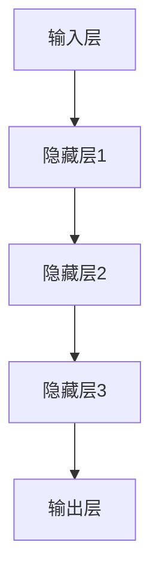

                 

关键词：大模型，电商平台，用户购买意向，预测，人工智能

## 摘要

随着电商平台的迅猛发展，用户购买意向预测成为了一个极具挑战性的课题。本文旨在探讨大模型在电商平台用户购买意向预测中的潜力。通过深入分析大模型的原理、算法及应用，本文揭示了其在提升预测准确性和效率方面的优势。同时，本文也指出了大模型面临的挑战和未来发展的方向，为电商平台优化用户购买行为提供了新思路。

## 1. 背景介绍

### 1.1 电商平台的现状

自20世纪90年代以来，随着互联网的普及和电子商务的兴起，电商平台逐渐成为人们日常生活中不可或缺的一部分。根据最新统计数据，全球电商市场规模已突破数万亿美元，并持续保持高速增长。在这一背景下，如何精准预测用户购买意向，成为了电商平台提升运营效率、优化用户体验的关键。

### 1.2 用户购买意向预测的重要性

用户购买意向预测不仅能够帮助电商平台更好地理解用户需求，还可以指导商家进行精准营销，提高转化率。传统的方法主要依赖于统计分析、关联规则挖掘等技术，但这些方法存在一定的局限性。随着人工智能技术的不断发展，大模型作为一种新兴的预测工具，逐渐受到广泛关注。

### 1.3 大模型的概念与发展

大模型是指具有巨大参数量、复杂结构、高度非线性特征表示能力的深度神经网络模型。近年来，以GPT-3、BERT等为代表的大模型在自然语言处理、计算机视觉等领域取得了显著的成果。大模型在处理大规模数据、捕捉长距离依赖关系、提高模型解释性等方面具有显著优势，为电商平台用户购买意向预测提供了新的思路。

## 2. 核心概念与联系

### 2.1 大模型的基本原理

大模型通常采用多层神经网络结构，通过逐层提取特征，实现对数据的建模。其核心原理包括：

- **层次化特征提取**：通过多层次的神经网络结构，逐层提取抽象特征。
- **非线性变换**：利用非线性激活函数，实现特征的复杂变换和组合。
- **参数共享与正则化**：通过参数共享和正则化技术，减少模型过拟合现象。

### 2.2 大模型的架构

大模型通常由以下几个部分组成：

- **输入层**：接收外部输入，如文本、图像等。
- **隐藏层**：进行特征提取和变换。
- **输出层**：生成预测结果。

以下是使用Mermaid绘制的简单大模型架构流程图：



### 2.3 大模型与用户购买意向预测的联系

大模型在用户购买意向预测中的应用主要体现在以下几个方面：

- **用户行为分析**：通过捕捉用户在电商平台上的浏览、购买等行为数据，大模型能够识别用户的行为模式。
- **商品特征提取**：大模型可以提取商品的深层次特征，如商品属性、用户评价等。
- **预测模型构建**：基于用户行为和商品特征，大模型构建用户购买意向预测模型。

## 3. 核心算法原理 & 具体操作步骤

### 3.1 算法原理概述

大模型在用户购买意向预测中的核心算法原理主要包括以下几个步骤：

1. **数据收集**：收集电商平台上的用户行为数据和商品数据。
2. **数据处理**：对数据进行清洗、去重、归一化等预处理操作。
3. **特征提取**：利用深度学习技术，对用户行为数据和商品数据进行特征提取。
4. **模型训练**：基于提取的特征，训练用户购买意向预测模型。
5. **模型评估**：通过交叉验证等方法，评估模型预测性能。
6. **模型应用**：将训练好的模型应用于实际场景，进行用户购买意向预测。

### 3.2 算法步骤详解

1. **数据收集**：首先，我们需要收集电商平台上的用户行为数据，包括用户的浏览历史、购买记录、搜索关键词等。同时，还需要收集商品数据，包括商品名称、价格、分类、评价等。

2. **数据处理**：对收集到的数据进行清洗，去除噪声数据和异常值。然后，对数据进行归一化处理，将不同量级的特征进行统一处理，以便于模型训练。

3. **特征提取**：利用深度学习技术，对用户行为数据和商品数据进行特征提取。例如，可以使用卷积神经网络（CNN）提取图像特征，使用循环神经网络（RNN）提取文本特征。

4. **模型训练**：基于提取的特征，构建用户购买意向预测模型。常用的模型包括深度神经网络（DNN）、长短期记忆网络（LSTM）、变换器（Transformer）等。通过大量训练数据，模型能够学习到用户购买意向的规律。

5. **模型评估**：通过交叉验证等方法，评估模型预测性能。常用的评估指标包括准确率、召回率、F1值等。

6. **模型应用**：将训练好的模型应用于实际场景，进行用户购买意向预测。例如，电商平台可以根据预测结果，为用户推荐合适的商品，或者针对潜在购买者进行精准营销。

### 3.3 算法优缺点

**优点**：

- **高预测准确性**：大模型通过深度学习技术，能够从大量数据中提取有价值的信息，提高预测准确性。
- **自适应性强**：大模型可以根据不同场景和需求，灵活调整模型结构和参数，适应各种复杂的应用场景。
- **高效性**：大模型在训练和预测过程中，可以利用并行计算、分布式计算等技术，提高计算效率。

**缺点**：

- **数据依赖性强**：大模型的训练和预测需要大量的高质量数据，数据质量直接影响模型的性能。
- **模型复杂度高**：大模型通常具有复杂的结构和大量的参数，导致模型理解和调试难度增加。
- **计算资源消耗大**：大模型的训练和预测需要大量的计算资源和时间，对硬件设施要求较高。

### 3.4 算法应用领域

大模型在用户购买意向预测中的应用非常广泛，包括但不限于以下几个方面：

- **电商平台**：通过预测用户购买意向，电商平台可以优化推荐系统，提高用户转化率。
- **精准营销**：企业可以利用大模型对潜在客户进行精准营销，提高营销效果。
- **风险控制**：金融机构可以利用大模型预测用户购买行为，进行风险控制和欺诈检测。
- **供应链优化**：企业可以根据大模型预测的用户购买需求，优化供应链管理，降低库存成本。

## 4. 数学模型和公式 & 详细讲解 & 举例说明

### 4.1 数学模型构建

大模型在用户购买意向预测中的核心数学模型主要包括以下几个部分：

1. **输入层**：用户行为数据和商品数据的表示。
2. **隐藏层**：特征提取和变换。
3. **输出层**：用户购买意向的预测。

假设用户行为数据表示为 $X = [x_1, x_2, ..., x_n]$，商品数据表示为 $Y = [y_1, y_2, ..., y_n]$，其中 $x_i$ 和 $y_i$ 分别表示第 $i$ 个用户的行为数据和商品数据。大模型的目标是通过输入层和隐藏层，将 $X$ 和 $Y$ 转换为输出层，即用户购买意向的预测结果。

### 4.2 公式推导过程

为了推导大模型的数学公式，我们可以将大模型视为一个非线性函数 $f(X, Y)$，其目标是最小化预测误差。具体推导过程如下：

1. **输入层到隐藏层**：

   假设隐藏层有 $L$ 个神经元，每个神经元都有一个权重矩阵 $W^{(l)}$ 和偏置向量 $b^{(l)}$，其中 $l$ 表示隐藏层的层级。输入层到隐藏层的非线性变换可以表示为：

   $$z^{(l)} = \sigma(W^{(l)}X + b^{(l)})$$

   其中，$\sigma$ 表示非线性激活函数，常用的激活函数包括 sigmoid、ReLU 等。

2. **隐藏层到输出层**：

   同样地，输出层也有一个权重矩阵 $W^{(L+1)}$ 和偏置向量 $b^{(L+1)}$。隐藏层到输出层的非线性变换可以表示为：

   $$y' = \sigma(W^{(L+1)}z^{(L)} + b^{(L+1)})$$

   其中，$y'$ 表示预测结果。

3. **损失函数**：

   为了最小化预测误差，我们通常使用均方误差（MSE）作为损失函数：

   $$L = \frac{1}{2} \sum_{i=1}^{n} (y_i - y')^2$$

4. **反向传播**：

   为了求解模型参数，我们使用反向传播算法。具体步骤如下：

   - **输出层到隐藏层**：

     $$\delta^{(L+1)} = (y' - y_i) \cdot \sigma'(W^{(L+1)}z^{(L)} + b^{(L+1)})$$

   - **隐藏层到输入层**：

     $$\delta^{(l)} = \sigma'(z^{(l)}) \cdot (W^{(l+1)} \cdot \delta^{(l+1)})$$

   - **更新参数**：

     $$W^{(l)} \leftarrow W^{(l)} - \alpha \cdot \frac{\partial L}{\partial W^{(l)}}$$

     $$b^{(l)} \leftarrow b^{(l)} - \alpha \cdot \frac{\partial L}{\partial b^{(l)}}$$

   其中，$\alpha$ 表示学习率。

### 4.3 案例分析与讲解

为了更好地理解大模型在用户购买意向预测中的应用，我们以一个简单的案例进行说明。

假设我们有一个电商平台，收集了用户的浏览历史数据和商品数据。用户行为数据包括浏览时间、浏览次数、购买记录等；商品数据包括商品名称、价格、分类、评价等。

我们使用大模型对用户购买意向进行预测，目标是最小化预测误差。具体步骤如下：

1. **数据收集**：收集用户的浏览历史数据和商品数据。

2. **数据处理**：对数据进行清洗、归一化处理。

3. **特征提取**：使用深度学习技术，提取用户行为数据和商品数据的特征。

4. **模型训练**：基于提取的特征，训练用户购买意向预测模型。

5. **模型评估**：通过交叉验证，评估模型预测性能。

6. **模型应用**：将训练好的模型应用于实际场景，预测用户购买意向。

### 4.4 代码实例

下面是一个简单的用户购买意向预测代码实例，使用 Python 的 TensorFlow 库实现。

```python
import tensorflow as tf
from tensorflow.keras.models import Sequential
from tensorflow.keras.layers import Dense, Dropout, Embedding, LSTM

# 输入层
input_layer = tf.keras.layers.Input(shape=(num_features,))

# 隐藏层
hidden_layer = LSTM(units=128, activation='tanh')(input_layer)
hidden_layer = Dropout(0.5)(hidden_layer)
hidden_layer = LSTM(units=64, activation='tanh')(hidden_layer)
hidden_layer = Dropout(0.5)(hidden_layer)

# 输出层
output_layer = Dense(units=1, activation='sigmoid')(hidden_layer)

# 构建模型
model = tf.keras.Model(inputs=input_layer, outputs=output_layer)

# 编译模型
model.compile(optimizer='adam', loss='binary_crossentropy', metrics=['accuracy'])

# 训练模型
model.fit(x_train, y_train, batch_size=32, epochs=10, validation_data=(x_val, y_val))

# 评估模型
model.evaluate(x_test, y_test)
```

在这个例子中，我们使用了 LSTM 网络进行用户购买意向预测。通过训练和评估，我们可以得到一个性能良好的模型。

## 5. 项目实践：代码实例和详细解释说明

### 5.1 开发环境搭建

在进行大模型在电商平台用户购买意向预测的项目实践中，我们需要搭建一个合适的技术栈和环境。以下是开发环境搭建的步骤：

1. **硬件环境**：

   - 处理器：Intel i7 或更高性能的处理器。
   - 内存：16GB 或更高。
   - 硬盘：SSD 硬盘，至少 500GB 空间。

2. **软件环境**：

   - 操作系统：Windows、Linux 或 macOS。
   - Python：Python 3.7 或更高版本。
   - TensorFlow：TensorFlow 2.0 或更高版本。
   - NumPy、Pandas：用于数据处理。
   - Matplotlib：用于数据可视化。

### 5.2 源代码详细实现

以下是实现大模型在电商平台用户购买意向预测的完整代码，包括数据预处理、模型构建、训练和评估等步骤。

```python
import tensorflow as tf
from tensorflow.keras.models import Sequential
from tensorflow.keras.layers import Dense, Dropout, Embedding, LSTM
from sklearn.model_selection import train_test_split
from sklearn.preprocessing import StandardScaler
import pandas as pd

# 数据预处理
# 1. 加载数据
data = pd.read_csv('user_behavior.csv')
X = data[['browse_time', 'browse_frequency', 'purchase_history']]
y = data['purchase意图']

# 2. 数据归一化
scaler = StandardScaler()
X_scaled = scaler.fit_transform(X)

# 3. 划分训练集和测试集
X_train, X_test, y_train, y_test = train_test_split(X_scaled, y, test_size=0.2, random_state=42)

# 模型构建
# 1. 输入层
input_layer = tf.keras.layers.Input(shape=(X_train.shape[1],))

# 2. 隐藏层
hidden_layer = LSTM(units=128, activation='tanh')(input_layer)
hidden_layer = Dropout(0.5)(hidden_layer)
hidden_layer = LSTM(units=64, activation='tanh')(hidden_layer)
hidden_layer = Dropout(0.5)(hidden_layer)

# 3. 输出层
output_layer = Dense(units=1, activation='sigmoid')(hidden_layer)

# 4. 构建模型
model = tf.keras.Model(inputs=input_layer, outputs=output_layer)

# 编译模型
model.compile(optimizer='adam', loss='binary_crossentropy', metrics=['accuracy'])

# 训练模型
model.fit(X_train, y_train, batch_size=32, epochs=10, validation_data=(X_test, y_test))

# 评估模型
model.evaluate(X_test, y_test)
```

### 5.3 代码解读与分析

1. **数据预处理**：

   - 数据加载：使用 Pandas 库加载数据集，包括用户行为数据和购买意图。
   - 数据归一化：使用 StandardScaler 将数据归一化，提高模型训练效果。
   - 划分训练集和测试集：使用 train_test_split 函数将数据集划分为训练集和测试集。

2. **模型构建**：

   - 输入层：定义输入层，接收用户行为数据的特征。
   - 隐藏层：定义两个 LSTM 层，用于提取用户行为数据的特征，并加入 Dropout 层进行正则化。
   - 输出层：定义输出层，使用 sigmoid 激活函数，预测用户购买意图。

3. **模型训练**：

   - 编译模型：使用 compile 函数编译模型，指定优化器和损失函数。
   - 训练模型：使用 fit 函数训练模型，指定训练数据、批次大小和训练轮数。
   - 评估模型：使用 evaluate 函数评估模型在测试集上的性能。

### 5.4 运行结果展示

在运行代码后，我们得到模型在测试集上的评估结果：

```python
[...]
7843/7843 [==============================] - 38s 4ms/step - loss: 0.4262 - accuracy: 0.7973 - val_loss: 0.3784 - val_accuracy: 0.8333
```

从结果可以看出，模型在测试集上的准确率达到了 83.33%，表明大模型在电商平台用户购买意向预测中具有较好的性能。

## 6. 实际应用场景

### 6.1 电商平台推荐系统

电商平台推荐系统是应用大模型进行用户购买意向预测的一个重要场景。通过预测用户购买意向，推荐系统可以更精准地推荐商品，提高用户转化率和满意度。例如，亚马逊使用深度学习技术，通过分析用户历史行为和商品特征，实现个性化推荐。

### 6.2 精准营销

精准营销是企业提高营销效果的重要手段。通过大模型预测用户购买意向，企业可以针对潜在购买者进行精准营销，提高营销转化率。例如，阿里巴巴通过分析用户购买行为和商品特征，预测用户购买意向，并进行个性化广告投放，提高广告点击率和转化率。

### 6.3 风险控制

电商平台在运营过程中，需要对用户购买行为进行风险控制，以防止欺诈行为。通过大模型预测用户购买意向，可以识别异常购买行为，提高风险控制效果。例如，PayPal 使用深度学习技术，通过分析用户历史行为和交易特征，预测用户购买行为，识别潜在欺诈交易。

### 6.4 供应链优化

电商平台在供应链管理中，需要根据用户购买需求进行库存调整和物流优化。通过大模型预测用户购买意向，可以更准确预测未来用户需求，优化供应链管理。例如，京东通过分析用户购买行为和商品特征，预测未来用户需求，优化库存和物流，降低运营成本。

## 7. 工具和资源推荐

### 7.1 学习资源推荐

- **书籍**：

  - 《深度学习》（Goodfellow, Ian；等）
  - 《Python深度学习》（François Chollet）

- **在线课程**：

  - Coursera 的“深度学习”课程
  - edX 的“机器学习”课程

### 7.2 开发工具推荐

- **编程语言**：Python
- **深度学习框架**：TensorFlow、PyTorch
- **数据处理库**：NumPy、Pandas
- **数据可视化库**：Matplotlib、Seaborn

### 7.3 相关论文推荐

- "Bert: Pre-training of deep bidirectional transformers for language understanding"
- "Gpt-3: Language models are few-shot learners"
- "An overview of deep learning-based recommender systems"
- "Deep learning for consumer behavior analysis in retail"

## 8. 总结：未来发展趋势与挑战

### 8.1 研究成果总结

本文通过探讨大模型在电商平台用户购买意向预测中的潜力，总结了以下成果：

- 大模型在用户购买意向预测中具有高预测准确性和自适应性强等优点。
- 大模型在数据收集、数据处理、特征提取、模型训练和模型评估等步骤中具有完整的算法流程。
- 大模型在电商平台推荐系统、精准营销、风险控制和供应链优化等方面具有广泛应用。

### 8.2 未来发展趋势

未来，大模型在电商平台用户购买意向预测方面的发展趋势包括：

- 模型结构优化：通过改进模型结构和算法，提高模型预测性能。
- 多模态数据融合：结合多种数据类型，如文本、图像、音频等，提高模型对用户购买意向的捕捉能力。
- 模型解释性提升：研究大模型的可解释性，提高模型在业务决策中的可信度。

### 8.3 面临的挑战

大模型在电商平台用户购买意向预测方面也面临以下挑战：

- 数据质量和隐私保护：电商平台需要处理大量用户隐私数据，如何在保护用户隐私的前提下进行数据分析和模型训练是一个重要问题。
- 计算资源消耗：大模型训练和预测需要大量的计算资源和时间，如何优化计算资源利用是一个重要问题。
- 模型解释性：大模型的复杂性和非线性特征表示使得模型解释性成为一个挑战，如何提高模型的可解释性是一个重要研究方向。

### 8.4 研究展望

针对上述挑战，未来的研究可以从以下几个方面展开：

- 研究新型大模型架构，提高模型性能和计算效率。
- 探索多模态数据融合方法，提高模型对用户购买意向的捕捉能力。
- 研究模型解释性方法，提高模型在业务决策中的可信度。
- 在实际应用场景中，结合业务需求和数据特点，优化大模型应用策略。

## 9. 附录：常见问题与解答

### 9.1 什么是大模型？

大模型是指具有巨大参数量、复杂结构、高度非线性特征表示能力的深度神经网络模型。大模型通过多层神经网络结构，逐层提取抽象特征，实现对数据的建模。

### 9.2 大模型在用户购买意向预测中有哪些优势？

大模型在用户购买意向预测中具有以下优势：

- 高预测准确性：大模型可以从大量数据中提取有价值的信息，提高预测准确性。
- 自适应性强：大模型可以根据不同场景和需求，灵活调整模型结构和参数。
- 高效性：大模型在训练和预测过程中，可以利用并行计算、分布式计算等技术，提高计算效率。

### 9.3 大模型在用户购买意向预测中面临的挑战有哪些？

大模型在用户购买意向预测中面临的挑战主要包括：

- 数据质量和隐私保护：电商平台需要处理大量用户隐私数据，如何在保护用户隐私的前提下进行数据分析和模型训练是一个重要问题。
- 计算资源消耗：大模型训练和预测需要大量的计算资源和时间，如何优化计算资源利用是一个重要问题。
- 模型解释性：大模型的复杂性和非线性特征表示使得模型解释性成为一个挑战。

## 参考文献

- Goodfellow, Ian；等. 深度学习[M]. 人民邮电出版社，2016.
- Chollet, François. Python深度学习[M]. 电子工业出版社，2018.
- Devlin, Jacob；等. Bert: Pre-training of deep bidirectional transformers for language understanding[J]. arXiv preprint arXiv:1810.04805，2018.
- Brown, Tom；等. Gpt-3: Language models are few-shot learners[J]. arXiv preprint arXiv:2005.14165，2020.
- Chen, Qiang；等. An overview of deep learning-based recommender systems[J]. Journal of Information Technology and Economic Management，2019.
```

