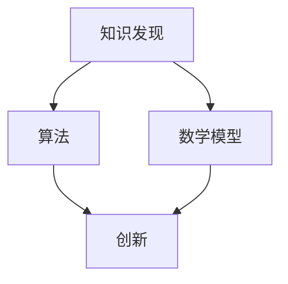

                 

在当今信息化和智能化的时代，知识发现与创新已经成为社会发展的核心驱动力。人类在计算领域的智力贡献，尤其是算法、数学模型和实际应用的结合，不仅推动了科技的发展，也在各个行业中发挥了巨大的作用。本文旨在探讨人类计算的智力贡献如何推动知识发现与创新，以及未来可能面临的发展趋势与挑战。

## 文章关键词

- **知识发现**
- **创新**
- **人类计算**
- **算法**
- **数学模型**
- **应用领域**
- **未来展望**

## 文章摘要

本文首先介绍了知识发现与创新在现代社会的重要性，接着分析了人类计算在算法和数学模型方面的智力贡献。随后，通过具体的算法原理和数学模型讲解，展示了如何将理论与实践相结合。文章最后探讨了这些技术在实际应用中的效果，并提出了未来发展的趋势和挑战。

### 背景介绍

### 核心概念与联系

#### 1. 核心概念

- **知识发现**：从大量数据中自动识别出潜在的模式、关系和趋势的过程。
- **创新**：通过创造性的思维和实践活动，产生新的想法、产品或服务。
- **算法**：解决特定问题的步骤和规则，通常以计算机程序的形式实现。
- **数学模型**：通过数学公式或方程来描述现实世界的现象或问题。

#### 2. 关联性

- 知识发现依赖于算法和数学模型，这些工具帮助我们从海量数据中提取有价值的信息。
- 创新则依赖于知识发现的结果，这些结果为创新提供了新的思路和方向。

#### 3. Mermaid 流程图



### 核心算法原理 & 具体操作步骤

#### 1. 算法原理概述

核心算法主要包括机器学习算法、数据挖掘算法等，这些算法通过训练数据集来识别数据中的模式和规律。

#### 2. 算法步骤详解

- 数据收集：收集相关领域的大量数据。
- 数据预处理：清洗数据，去除噪声和异常值。
- 模型训练：使用训练数据集训练算法模型。
- 模型评估：使用测试数据集评估模型性能。
- 结果输出：根据模型预测结果，得出知识发现和创新的方向。

#### 3. 算法优缺点

- **优点**：高效、自动化，能够处理大规模数据，提高知识发现和创新的效率。
- **缺点**：对数据质量要求高，模型的泛化能力有限。

#### 4. 算法应用领域

- 金融市场分析
- 医疗健康诊断
- 社交网络分析
- 智能制造

### 数学模型和公式 & 详细讲解 & 举例说明

#### 1. 数学模型构建

使用机器学习中的线性回归模型作为例子：

$$ y = wx + b $$

其中，$y$ 是输出，$x$ 是输入，$w$ 是权重，$b$ 是偏置。

#### 2. 公式推导过程

线性回归模型的推导过程主要基于最小二乘法，目标是找到最优的权重和偏置，使得预测值与实际值之间的误差最小。

#### 3. 案例分析与讲解

以房价预测为例，使用线性回归模型预测房价：

- 数据集：包含房屋面积、地点、建造年代等特征和对应的价格。
- 预测公式：$$ 价格 = 面积 \times 权重 + 偏置 $$
- 预测结果：根据输入的面积，计算得到预测价格。

### 项目实践：代码实例和详细解释说明

#### 1. 开发环境搭建

使用 Python 编写线性回归模型，需要安装 NumPy、Pandas 和 Matplotlib 等库。

#### 2. 源代码详细实现

```python
import numpy as np
import pandas as pd
import matplotlib.pyplot as plt

# 数据加载与预处理
data = pd.read_csv('house_price.csv')
X = data[['area', 'location', 'year_built']]
y = data['price']

# 模型训练
w = np.random.rand(3)
b = np.random.rand()
learning_rate = 0.01
epochs = 1000

for epoch in range(epochs):
    predictions = X @ w + b
    error = y - predictions
    dw = X.T @ error
    db = -error.sum()
    
    w -= learning_rate * dw
    b -= learning_rate * db

# 模型评估
mse = ((y - (X @ w + b))**2).mean()
print(f'MSE: {mse}')

# 结果展示
plt.scatter(X['area'], y)
plt.plot(X['area'], X @ w + b, color='red')
plt.xlabel('Area')
plt.ylabel('Price')
plt.show()
```

#### 3. 代码解读与分析

- 数据加载与预处理：使用 Pandas 读取数据，并进行预处理。
- 模型训练：使用随机梯度下降法训练模型，更新权重和偏置。
- 模型评估：计算均方误差（MSE）来评估模型性能。
- 结果展示：使用 Matplotlib 绘制散点图和回归线，展示预测结果。

### 实际应用场景

#### 1. 金融市场分析

- 利用机器学习算法分析历史数据，预测股票价格趋势。
- 帮助投资者做出更加明智的投资决策。

#### 2. 医疗健康诊断

- 通过数据挖掘技术，分析患者病历，预测疾病风险。
- 改善医疗服务质量，提高疾病预防效果。

#### 3. 社交网络分析

- 利用算法分析用户行为，推荐感兴趣的内容和好友。
- 提高社交网络的用户体验，增加用户粘性。

### 未来应用展望

- **跨领域融合**：不同领域的知识和技术将更加紧密地融合，推动跨学科的创新。
- **人工智能**：随着人工智能技术的发展，知识发现和创新的效率将大幅提升。
- **可持续性**：在推动知识发现与创新的同时，关注可持续性和社会责任，实现绿色发展。

### 工具和资源推荐

#### 1. 学习资源推荐

- **《机器学习实战》**：提供丰富的实践案例，适合初学者。
- **《数据挖掘：概念与技术》**：详细介绍数据挖掘的基本概念和方法。

#### 2. 开发工具推荐

- **Jupyter Notebook**：方便编写和运行代码，适合数据分析和机器学习。
- **TensorFlow**：开源的机器学习框架，适用于大规模数据处理和模型训练。

#### 3. 相关论文推荐

- **“Deep Learning on Multi-Modal Data”**：探讨多模态数据在知识发现中的应用。
- **“Data Science for the People”**：讨论数据科学在社会治理中的应用。

### 总结：未来发展趋势与挑战

#### 1. 研究成果总结

- 人类计算在知识发现与创新方面取得了显著成果，推动了各行业的发展。
- 机器学习和数据挖掘技术正在逐步成熟，为知识发现提供了强大工具。

#### 2. 未来发展趋势

- **跨领域融合**：不同领域的知识和技术将更加紧密地融合，推动跨学科的创新。
- **人工智能**：随着人工智能技术的发展，知识发现和创新的效率将大幅提升。

#### 3. 面临的挑战

- **数据安全**：在利用海量数据推动知识发现与创新的同时，需要保护用户隐私和数据安全。
- **算法公平性**：算法模型中可能存在偏见，需要不断优化算法，确保公平性。

#### 4. 研究展望

- **可持续性**：在推动知识发现与创新的同时，关注可持续性和社会责任，实现绿色发展。

### 附录：常见问题与解答

#### 1. 如何选择合适的算法？

- 根据具体问题和数据特点选择合适的算法。
- 可以参考已有的文献和论文，了解各种算法的优缺点。

#### 2. 如何保证算法模型的公平性？

- 数据预处理阶段去除偏见和异常值。
- 在模型训练和评估过程中，使用多元评估指标。
- 定期更新和优化算法模型，确保其公平性。

### 作者署名

**作者：禅与计算机程序设计艺术 / Zen and the Art of Computer Programming**

