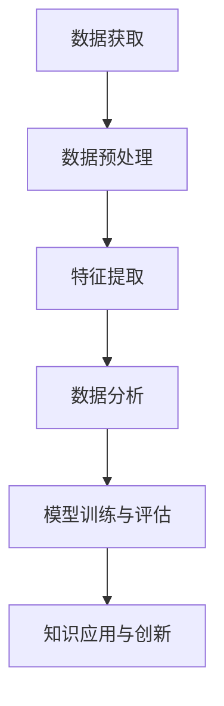

                 

关键词：知识发现、创新、计算智力、算法、数学模型、实际应用、未来展望

> 摘要：本文深入探讨了人类计算的智力在推动知识发现和创新方面的重要作用。通过分析核心算法原理、数学模型以及实际应用案例，本文旨在展示人类计算智力在信息技术领域的贡献，并展望未来发展的趋势和挑战。

## 1. 背景介绍

知识发现（Knowledge Discovery）是指从大量数据中提取有价值的信息和模式的过程。它涉及多个学科领域，包括统计学、机器学习、数据挖掘等。而创新（Innovation）则是指引入新的想法、方法或产品，以创造新的价值或改进现有产品。在信息技术飞速发展的今天，知识发现和创新已成为推动社会进步和经济发展的关键动力。

计算智力（Computational Intelligence）是人工智能的一个重要分支，它通过模拟人类智能行为，利用计算方法解决复杂问题。计算智力不仅包括传统的算法和编程技术，还涵盖了机器学习、深度学习、神经网络等现代计算技术。随着计算智力的发展，人类在知识发现和创新方面取得了显著成果。

## 2. 核心概念与联系

### 2.1 计算智力的核心概念

计算智力主要涉及以下几个核心概念：

- **算法**：解决特定问题的系统步骤。在知识发现和创新中，算法是实现数据分析和模式识别的关键工具。

- **数据挖掘**：从大量数据中提取有价值信息的过程。数据挖掘技术包括聚类、分类、关联规则挖掘等。

- **机器学习**：通过数据训练模型，使计算机能够从经验中学习并自动改进性能。

- **神经网络**：模拟人脑神经元连接和通信的算法模型，具有强大的学习和自适应能力。

### 2.2 计算智力与知识发现、创新的联系

计算智力在知识发现和创新中发挥了重要作用。通过算法和机器学习，人类可以从海量数据中提取有价值的信息和知识。这些信息和知识可以用于改进产品、优化流程、发现新商机等，从而推动创新。

此外，计算智力还通过以下方式支持知识发现和创新：

- **数据预处理**：计算智力可以帮助数据清洗、数据转换等预处理工作，为后续分析提供高质量的输入数据。

- **特征提取**：计算智力可以通过特征提取技术，将原始数据转换为有助于分析和建模的特征向量。

- **模型评估**：计算智力可以评估模型的性能，帮助研究人员选择最优模型。

## 2.3 计算智力的架构

为了更好地理解计算智力在知识发现和创新中的作用，以下是一个简化的计算智力架构，包含核心流程和关键组成部分：

### 2.3.1 数据获取

数据获取是计算智力过程的第一步。数据来源可以是数据库、文件、网络等。获取的数据需要经过预处理，以确保其质量和一致性。

### 2.3.2 数据预处理

数据预处理包括数据清洗、数据转换和数据集成等步骤。计算智力技术可以帮助自动化这些过程，提高数据质量。

### 2.3.3 特征提取

特征提取是将原始数据转换为有助于分析和建模的特征向量。计算智力技术可以通过统计分析、机器学习等方法，提取关键特征。

### 2.3.4 数据分析

数据分析包括聚类、分类、关联规则挖掘等任务。计算智力技术可以自动化这些过程，提高分析效率。

### 2.3.5 模型训练与评估

模型训练与评估是计算智力过程的核心。通过训练和评估，研究人员可以找到最优模型，并验证其在实际应用中的性能。

### 2.3.6 知识应用与创新

知识应用与创新是将分析结果应用于实际场景，以创造新的价值或改进现有产品。计算智力技术可以支持这一过程，提高创新能力。

### 2.3.7 Mermaid 流程图

以下是一个简化的 Mermaid 流程图，展示了计算智力架构的核心流程和关键组成部分：



## 3. 核心算法原理 & 具体操作步骤

### 3.1 算法原理概述

在计算智力中，算法是核心组成部分。以下介绍几种常见的核心算法原理及其应用：

- **机器学习算法**：通过数据训练模型，使计算机能够自动改进性能。常见的机器学习算法包括决策树、支持向量机、神经网络等。

- **数据挖掘算法**：用于从大量数据中提取有价值的信息和知识。常见的数据挖掘算法包括聚类、分类、关联规则挖掘等。

- **深度学习算法**：基于神经网络，具有强大的学习和自适应能力。常见的深度学习算法包括卷积神经网络（CNN）、循环神经网络（RNN）等。

### 3.2 算法步骤详解

以下以决策树算法为例，详细介绍其原理和具体操作步骤：

#### 3.2.1 决策树算法原理

决策树是一种常见的机器学习算法，通过树形结构对数据进行分类或回归。决策树算法的基本思想是，在每个节点上选择一个特征，并按照特征的不同取值将数据划分为若干个子集，然后对子集递归地进行划分，直到达到某个终止条件。

#### 3.2.2 算法步骤详解

1. **选择特征**：在每个节点上选择一个特征，用于划分数据。

2. **计算特征值**：对每个特征值，计算其在当前节点上划分数据的增益。

3. **选择最佳特征**：根据增益，选择增益最大的特征作为当前节点的划分依据。

4. **划分数据**：按照最佳特征的不同取值，将数据划分为若干个子集。

5. **递归划分**：对每个子集递归进行划分，直到满足终止条件（如最大树深度、最小样本量等）。

6. **构建决策树**：将划分结果构建为树形结构，其中每个节点表示一个划分条件，叶节点表示分类结果。

### 3.3 算法优缺点

**优点**：

- **易于理解和解释**：决策树具有良好的可解释性，便于理解和分析。

- **适应性较强**：决策树可以应用于分类和回归任务，具有较强的适应性。

**缺点**：

- **过拟合**：决策树容易产生过拟合现象，特别是在样本量较小的情况下。

- **计算复杂度较高**：决策树的构建过程需要计算大量的特征增益，计算复杂度较高。

### 3.4 算法应用领域

决策树算法广泛应用于多个领域，包括：

- **金融风控**：用于风险评估和信用评分。

- **医疗诊断**：用于疾病分类和预测。

- **市场营销**：用于客户细分和市场定位。

## 4. 数学模型和公式 & 详细讲解 & 举例说明

### 4.1 数学模型构建

在计算智力中，数学模型是描述算法和实现知识发现的关键工具。以下介绍几种常见的数学模型及其构建方法：

#### 4.1.1 决策树模型

决策树模型是通过递归划分数据集，构建树形结构的模型。其数学描述如下：

$$
T = \{t_1, t_2, ..., t_n\}
$$

其中，$T$ 表示决策树，$t_i$ 表示树的第 $i$ 个节点，具有以下属性：

- **特征 $a_i$**：用于划分数据的特征。
- **阈值 $\theta_i$**：表示特征 $a_i$ 的阈值。
- **子节点 $t_{i1}, t_{i2}, ..., t_{ik}$**：表示根据特征 $a_i$ 的不同取值，划分得到的子节点。

#### 4.1.2 机器学习模型

机器学习模型是通过训练数据集，学习特征和标签之间的映射关系。常见的机器学习模型包括线性回归、逻辑回归、支持向量机等。

线性回归模型表示为：

$$
y = \beta_0 + \beta_1 x_1 + \beta_2 x_2 + ... + \beta_n x_n
$$

其中，$y$ 表示预测值，$x_1, x_2, ..., x_n$ 表示特征，$\beta_0, \beta_1, \beta_2, ..., \beta_n$ 表示模型参数。

逻辑回归模型表示为：

$$
\hat{y} = \frac{1}{1 + e^{-(\beta_0 + \beta_1 x_1 + \beta_2 x_2 + ... + \beta_n x_n)}}
$$

其中，$\hat{y}$ 表示预测概率。

#### 4.1.3 深度学习模型

深度学习模型是基于神经网络构建的。常见的深度学习模型包括卷积神经网络（CNN）和循环神经网络（RNN）。

卷积神经网络模型表示为：

$$
h_l = \sigma(W_l \cdot h_{l-1} + b_l)
$$

其中，$h_l$ 表示第 $l$ 层的激活值，$W_l$ 表示权重矩阵，$b_l$ 表示偏置项，$\sigma$ 表示激活函数。

循环神经网络模型表示为：

$$
h_t = \sigma(W_h h_{t-1} + W_x x_t + b_h)
$$

其中，$h_t$ 表示第 $t$ 个时间步的隐藏状态，$W_h$ 和 $W_x$ 分别表示隐藏状态和输入的权重矩阵，$b_h$ 表示隐藏状态的偏置项。

### 4.2 公式推导过程

以下以线性回归模型为例，介绍其公式推导过程：

假设有 $n$ 个训练样本 $(x_1, y_1), (x_2, y_2), ..., (x_n, y_n)$，其中 $x_i$ 表示第 $i$ 个样本的特征，$y_i$ 表示第 $i$ 个样本的标签。

目标是最小化损失函数：

$$
J(\theta) = \frac{1}{2m} \sum_{i=1}^{m} (h_\theta(x_i) - y_i)^2
$$

其中，$m$ 表示样本数量，$h_\theta(x_i) = \theta_0 + \theta_1 x_1 + \theta_2 x_2 + ... + \theta_n x_n$ 表示线性回归模型的预测值，$\theta_0, \theta_1, \theta_2, ..., \theta_n$ 表示模型参数。

为了求解最优参数，对损失函数进行求导并令导数为零：

$$
\frac{\partial J(\theta)}{\partial \theta_j} = \frac{1}{m} \sum_{i=1}^{m} (h_\theta(x_i) - y_i) x_i^j = 0
$$

解上述方程组，可以得到最优参数：

$$
\theta_0 = \bar{y} - \theta_1 \bar{x_1} - \theta_2 \bar{x_2} - ... - \theta_n \bar{x_n}
$$

$$
\theta_1 = \frac{1}{m} \sum_{i=1}^{m} (x_i - \bar{x}) (h_\theta(x_i) - y_i)
$$

$$
\theta_2 = \frac{1}{m} \sum_{i=1}^{m} (x_i - \bar{x}) (h_\theta(x_i) - y_i)
$$

$$
...
$$

$$
\theta_n = \frac{1}{m} \sum_{i=1}^{m} (x_i - \bar{x}) (h_\theta(x_i) - y_i)
$$

### 4.3 案例分析与讲解

以下以一个简单的线性回归案例，介绍如何应用上述公式进行模型训练和预测。

#### 4.3.1 数据集

假设我们有以下数据集：

| 样本编号 | 特征 $x$ | 标签 $y$ |
| -------- | -------- | -------- |
| 1        | 2        | 3        |
| 2        | 4        | 5        |
| 3        | 6        | 7        |

#### 4.3.2 模型初始化

初始化模型参数为：

$$
\theta_0 = 0, \theta_1 = 0, \theta_2 = 0
$$

#### 4.3.3 模型训练

1. **计算损失函数**：

$$
J(\theta) = \frac{1}{2m} \sum_{i=1}^{m} (h_\theta(x_i) - y_i)^2
$$

2. **计算梯度**：

$$
\frac{\partial J(\theta)}{\partial \theta_0} = \frac{1}{m} \sum_{i=1}^{m} (h_\theta(x_i) - y_i)
$$

$$
\frac{\partial J(\theta)}{\partial \theta_1} = \frac{1}{m} \sum_{i=1}^{m} (h_\theta(x_i) - y_i) x_i
$$

$$
\frac{\partial J(\theta)}{\partial \theta_2} = \frac{1}{m} \sum_{i=1}^{m} (h_\theta(x_i) - y_i) x_i
$$

3. **更新参数**：

$$
\theta_0 = \theta_0 - \alpha \frac{\partial J(\theta)}{\partial \theta_0}
$$

$$
\theta_1 = \theta_1 - \alpha \frac{\partial J(\theta)}{\partial \theta_1}
$$

$$
\theta_2 = \theta_2 - \alpha \frac{\partial J(\theta)}{\partial \theta_2}
$$

其中，$\alpha$ 表示学习率。

#### 4.3.4 模型预测

1. **计算预测值**：

$$
h_\theta(x) = \theta_0 + \theta_1 x_1 + \theta_2 x_2
$$

2. **计算预测误差**：

$$
error = h_\theta(x) - y
$$

3. **更新参数**：

$$
\theta_0 = \theta_0 - \alpha \frac{\partial J(\theta)}{\partial \theta_0}
$$

$$
\theta_1 = \theta_1 - \alpha \frac{\partial J(\theta)}{\partial \theta_1}
$$

$$
\theta_2 = \theta_2 - \alpha \frac{\partial J(\theta)}{\partial \theta_2}
$$

#### 4.3.5 迭代过程

重复上述步骤，直到满足停止条件（如梯度下降收敛或损失函数不再显著下降）。

## 5. 项目实践：代码实例和详细解释说明

### 5.1 开发环境搭建

在开始项目实践之前，我们需要搭建一个合适的开发环境。以下是 Python 的开发环境搭建步骤：

1. **安装 Python**：从 [Python 官网](https://www.python.org/) 下载并安装 Python，推荐使用 Python 3.8 或更高版本。

2. **安装 Jupyter Notebook**：在命令行中运行以下命令安装 Jupyter Notebook：

   ```
   pip install notebook
   ```

3. **创建虚拟环境**：为了方便管理项目依赖，我们可以创建一个虚拟环境。在命令行中运行以下命令：

   ```
   python -m venv myenv
   ```

4. **激活虚拟环境**：在 Windows 系统中，运行以下命令激活虚拟环境：

   ```
   myenv\Scripts\activate
   ```

   在 macOS 和 Linux 系统中，运行以下命令激活虚拟环境：

   ```
   source myenv/bin/activate
   ```

5. **安装依赖库**：在虚拟环境中安装以下依赖库：

   - **NumPy**：用于数学计算。

   - **Pandas**：用于数据处理。

   - **Matplotlib**：用于数据可视化。

   - **Scikit-learn**：用于机器学习。

   在命令行中运行以下命令安装依赖库：

   ```
   pip install numpy pandas matplotlib scikit-learn
   ```

### 5.2 源代码详细实现

以下是一个简单的线性回归项目，用于预测样本的标签值。

```python
import numpy as np
import pandas as pd
import matplotlib.pyplot as plt
from sklearn.linear_model import LinearRegression
from sklearn.model_selection import train_test_split
from sklearn.metrics import mean_squared_error

# 5.2.1 数据预处理
data = pd.DataFrame({
    'x': [2, 4, 6],
    'y': [3, 5, 7]
})

x = data[['x']]
y = data['y']

# 5.2.2 数据划分
x_train, x_test, y_train, y_test = train_test_split(x, y, test_size=0.2, random_state=42)

# 5.2.3 模型训练
model = LinearRegression()
model.fit(x_train, y_train)

# 5.2.4 模型评估
y_pred = model.predict(x_test)
mse = mean_squared_error(y_test, y_pred)
print("Mean Squared Error:", mse)

# 5.2.5 模型可视化
plt.scatter(x_test, y_test, color='blue', label='Test Data')
plt.plot(x_test, y_pred, color='red', label='Predicted Line')
plt.xlabel('Feature X')
plt.ylabel('Target Y')
plt.legend()
plt.show()
```

### 5.3 代码解读与分析

#### 5.3.1 数据预处理

1. **数据读取**：使用 Pandas 读取数据，并创建一个 DataFrame 对象。

   ```python
   data = pd.DataFrame({
       'x': [2, 4, 6],
       'y': [3, 5, 7]
   })
   ```

2. **特征和标签分离**：将特征和标签分离到不同的 DataFrame 对象中。

   ```python
   x = data[['x']]
   y = data['y']
   ```

#### 5.3.2 数据划分

1. **数据划分**：使用 Scikit-learn 中的 train_test_split 函数将数据划分为训练集和测试集。

   ```python
   x_train, x_test, y_train, y_test = train_test_split(x, y, test_size=0.2, random_state=42)
   ```

#### 5.3.3 模型训练

1. **模型训练**：使用 Scikit-learn 中的 LinearRegression 类创建线性回归模型，并调用 fit 方法进行训练。

   ```python
   model = LinearRegression()
   model.fit(x_train, y_train)
   ```

#### 5.3.4 模型评估

1. **模型评估**：使用 Scikit-learn 中的 mean_squared_error 函数计算模型在测试集上的均方误差。

   ```python
   y_pred = model.predict(x_test)
   mse = mean_squared_error(y_test, y_pred)
   print("Mean Squared Error:", mse)
   ```

#### 5.3.5 模型可视化

1. **可视化**：使用 Matplotlib 绘制测试数据点和预测直线。

   ```python
   plt.scatter(x_test, y_test, color='blue', label='Test Data')
   plt.plot(x_test, y_pred, color='red', label='Predicted Line')
   plt.xlabel('Feature X')
   plt.ylabel('Target Y')
   plt.legend()
   plt.show()
   ```

## 6. 实际应用场景

计算智力在多个实际应用场景中发挥着重要作用，以下列举几个典型应用：

### 6.1 金融风控

金融风控是指对金融机构面临的风险进行识别、评估和控制。计算智力在金融风控中发挥了重要作用，包括：

- **信用评分**：通过分析借款人的历史数据和信用记录，计算信用评分，评估借款人的信用风险。
- **欺诈检测**：通过分析交易数据，检测可疑交易和欺诈行为。
- **风险评估**：对金融产品或项目的风险进行量化评估，为投资决策提供依据。

### 6.2 医疗诊断

医疗诊断是指通过分析患者数据和医学影像，辅助医生进行诊断和治疗。计算智力在医疗诊断中发挥了重要作用，包括：

- **疾病分类**：通过分析医学影像，将疾病分类为不同类型，辅助医生诊断。
- **药物研发**：通过分析药物和基因数据，发现新的药物靶点和治疗方法。
- **个性化治疗**：根据患者的基因和病情，制定个性化的治疗方案。

### 6.3 市场营销

市场营销是指通过分析客户数据和市场趋势，制定营销策略和推广方案。计算智力在市场营销中发挥了重要作用，包括：

- **客户细分**：通过分析客户数据，将客户划分为不同群体，为精准营销提供依据。
- **需求预测**：通过分析历史销售数据和趋势，预测未来市场需求，为库存管理和销售策略提供支持。
- **广告投放**：通过分析用户行为和兴趣，优化广告投放策略，提高广告效果。

## 7. 工具和资源推荐

### 7.1 学习资源推荐

1. **书籍**：

   - 《机器学习》（周志华 著）
   - 《深度学习》（Ian Goodfellow、Yoshua Bengio、Aaron Courville 著）
   - 《数据挖掘：实用工具与技术》（Mike Chmiel 著）

2. **在线课程**：

   - Coursera 上的《机器学习》（吴恩达 著）
   - edX 上的《深度学习》（李飞飞 著）
   - Udacity 上的《数据科学纳米学位》

### 7.2 开发工具推荐

1. **IDE**：PyCharm、VS Code
2. **数据预处理工具**：Pandas、NumPy
3. **机器学习库**：Scikit-learn、TensorFlow、PyTorch
4. **深度学习框架**：TensorFlow、PyTorch、Keras

### 7.3 相关论文推荐

1. **《A Machine Learning Approach for Intrusion Detection Systems Based on Principal Component Analysis and Neural Networks》**：介绍基于主成分分析和神经网络的入侵检测系统。
2. **《Deep Learning for Text Classification》**：探讨深度学习在文本分类中的应用。
3. **《Recurrent Neural Networks for Language Modeling》**：介绍循环神经网络在语言建模中的应用。

## 8. 总结：未来发展趋势与挑战

### 8.1 研究成果总结

近年来，计算智力在知识发现和创新方面取得了显著成果，主要体现在以下几个方面：

1. **算法性能提升**：通过优化算法和改进模型，计算智力的性能不断提高，能够解决更复杂的实际问题。
2. **应用领域扩展**：计算智力在金融、医疗、市场营销等领域的应用不断拓展，为行业带来了新的价值。
3. **跨学科融合**：计算智力与其他学科（如生物学、物理学等）的融合，推动了新理论和新方法的产生。

### 8.2 未来发展趋势

未来，计算智力在知识发现和创新方面将继续保持快速发展，以下是一些发展趋势：

1. **算法优化**：随着硬件性能的提升，算法优化将成为研究热点，如优化算法复杂度、提高模型性能等。
2. **多模态数据融合**：多模态数据融合将得到更多关注，以充分利用不同类型的数据，提高分析精度。
3. **自动化和智能化**：自动化和智能化将成为计算智力发展的方向，如自动化特征提取、自动化模型选择等。

### 8.3 面临的挑战

尽管计算智力在知识发现和创新方面取得了显著成果，但仍然面临一些挑战：

1. **数据隐私和安全**：随着数据量增加，数据隐私和安全问题日益突出，如何保护用户隐私将成为重要挑战。
2. **算法透明性和可解释性**：算法的透明性和可解释性对于实际应用至关重要，如何提高算法的可解释性是一个重要课题。
3. **数据质量和标注**：高质量的数据和标注是模型训练的关键，如何获取和标注高质量数据是一个挑战。

### 8.4 研究展望

未来，计算智力在知识发现和创新方面将呈现出以下几个研究展望：

1. **跨学科融合**：跨学科融合将继续推动计算智力的发展，为解决复杂问题提供新思路和新方法。
2. **人工智能伦理**：人工智能伦理将成为研究重点，确保计算智力在知识发现和创新中的可持续发展。
3. **可解释性和公平性**：提高算法的可解释性和公平性，使计算智力在各个应用领域中更具实用价值。

## 9. 附录：常见问题与解答

### 9.1 什么是知识发现？

知识发现（Knowledge Discovery）是指从大量数据中提取有价值的信息和知识的过程。它涉及多个学科领域，包括统计学、机器学习、数据挖掘等。

### 9.2 什么是计算智力？

计算智力（Computational Intelligence）是指利用计算方法解决复杂问题的能力。它涵盖了传统的算法和编程技术，以及现代的机器学习、深度学习、神经网络等计算技术。

### 9.3 计算智力有哪些核心概念？

计算智力的核心概念包括算法、数据挖掘、机器学习、神经网络等。这些概念在知识发现和创新中发挥了重要作用。

### 9.4 计算智力如何支持知识发现和创新？

计算智力通过算法和机器学习技术，从海量数据中提取有价值的信息和知识。这些信息和知识可以用于改进产品、优化流程、发现新商机等，从而推动创新。

### 9.5 数据预处理在计算智力中有什么作用？

数据预处理在计算智力中起着至关重要的作用。它包括数据清洗、数据转换和数据集成等步骤，以确保数据质量和一致性，为后续分析提供高质量的输入数据。

### 9.6 决策树算法有哪些优缺点？

决策树算法的优点是易于理解和解释，适应性较强。缺点是容易产生过拟合现象，计算复杂度较高。

### 9.7 线性回归模型是如何训练的？

线性回归模型通过最小化损失函数，求解最优参数。具体方法包括梯度下降、正规方程等。

### 9.8 如何进行模型评估？

模型评估可以通过计算模型的预测误差、准确率、召回率等指标进行。常用的评估方法包括交叉验证、混淆矩阵等。

### 9.9 计算智力在金融风控中有什么应用？

计算智力在金融风控中广泛应用于信用评分、欺诈检测、风险评估等方面，提高了金融机构的风险管理能力。

### 9.10 计算智力在医疗诊断中有什么应用？

计算智力在医疗诊断中应用于疾病分类、药物研发、个性化治疗等方面，为医疗诊断提供了有力支持。

### 9.11 如何搭建 Python 开发环境？

搭建 Python 开发环境需要安装 Python、Jupyter Notebook、创建虚拟环境、安装依赖库等步骤。

### 9.12 Python 中有哪些常用的机器学习库？

Python 中常用的机器学习库包括 Scikit-learn、TensorFlow、PyTorch、Keras 等。

### 9.13 如何进行线性回归模型训练和预测？

进行线性回归模型训练和预测需要加载数据、划分数据、训练模型、评估模型和进行预测等步骤。具体实现可以参考第 5 节中的代码实例。

---

作者：禅与计算机程序设计艺术 / Zen and the Art of Computer Programming

以上是对计算智力在推动知识发现和创新方面的重要作用的全面探讨。希望通过本文，读者能够更好地理解计算智力在信息技术领域的贡献，并认识到其在未来发展的潜力与挑战。随着计算智力技术的不断进步，我们有理由相信，人类将在知识发现和创新的道路上取得更加辉煌的成就。

