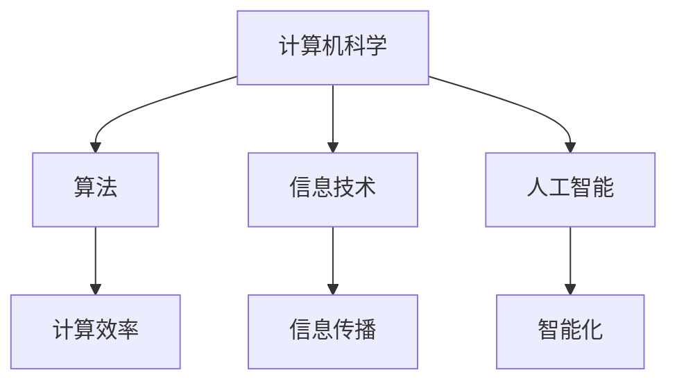

                 

关键词：计算、社会进步、信息技术、算法、人工智能、数学模型、应用领域、开发工具

摘要：本文探讨了计算技术在社会进步中的积极作用，从核心概念、算法原理、数学模型、实际应用等多个角度，全面阐述了人类计算在各个领域的深远影响。通过剖析计算技术的创新和发展，展望未来发展趋势与挑战，旨在为读者提供对计算技术发展及其对社会影响的深刻理解。

## 1. 背景介绍

自计算机诞生以来，计算技术不断发展，从简单的机械计算到复杂的现代计算机系统，计算已经成为推动社会进步的重要力量。计算机技术不仅改变了人类的工作方式和生活习惯，还极大地提升了社会生产效率和服务水平。计算技术在各个领域的应用，如通信、医疗、金融、教育等，都带来了深刻的变革。

本文将重点探讨计算技术在不同领域的应用，分析其对社会进步的积极影响，并展望未来的发展趋势与挑战。通过本文的阅读，读者将更全面地了解计算技术在现代社会中的重要地位和作用。

## 2. 核心概念与联系

为了更好地理解计算技术的核心概念和其对社会进步的影响，我们首先需要明确以下几个关键概念：

### 2.1 计算机科学

计算机科学是研究计算机系统及其应用的学科，涵盖了算法、数据结构、编程语言、操作系统、网络和人工智能等多个领域。计算机科学的发展推动了计算技术的创新，为各种应用提供了技术支持。

### 2.2 信息技术

信息技术是指使用计算机和通信技术进行信息处理和传输的技术。信息技术的发展极大地提升了社会信息传播和利用的效率，使得人们可以更加便捷地获取和分享信息。

### 2.3 算法

算法是解决特定问题的步骤序列。在计算机科学中，算法是实现计算任务的核心。有效的算法可以优化计算资源的使用，提高计算效率和性能。

### 2.4 人工智能

人工智能是一种模拟人类智能的技术，通过算法和模型实现机器的学习、推理和决策能力。人工智能的发展推动了计算技术在各个领域的应用，为智能化社会建设提供了技术支撑。

为了更直观地展示这些核心概念之间的联系，我们使用Mermaid流程图来描述它们之间的关系：



从图中可以看出，计算机科学、信息技术和人工智能是计算技术的三个核心领域，它们相互关联，共同推动计算技术的发展。算法是计算技术的核心，通过优化计算效率和性能，为各个领域提供了技术支持。信息技术的进步使得信息传播和利用更加高效，而人工智能的发展则为智能化社会建设提供了技术基础。

## 3. 核心算法原理 & 具体操作步骤

### 3.1 算法原理概述

算法原理是指算法解决问题的基本思路和方法。不同领域的算法具有不同的原理，但它们都遵循一定的基本原理。以下是一些常见算法原理的概述：

### 3.1.1 递归原理

递归原理是一种常见的算法原理，它通过将问题分解为子问题，并递归地解决这些子问题，最终解决原问题。递归原理在算法设计中具有广泛的应用，如分治算法、动态规划算法等。

### 3.1.2 并查集原理

并查集原理是一种用于处理动态连通性问题的算法原理。它通过将元素分组，并维护每个分组的信息，来高效地解决动态连通性问题。并查集原理在计算机科学中具有广泛的应用，如图的连通性、最短路径等问题。

### 3.1.3 动态规划原理

动态规划原理是一种用于解决最优子结构问题的算法原理。它通过将问题分解为子问题，并保存子问题的解，来避免重复计算，从而提高算法的效率。动态规划原理在算法设计中具有广泛的应用，如背包问题、最短路径问题等。

### 3.2 算法步骤详解

为了更好地理解算法原理，我们以下将详细描述一些常见算法的步骤：

### 3.2.1 递归算法步骤

1. 确定递归结束条件，通常为基本情况。
2. 将原问题分解为若干个子问题。
3. 对每个子问题递归调用算法。
4. 将子问题的解合并为原问题的解。

### 3.2.2 并查集算法步骤

1. 初始化每个元素的分组信息。
2. 执行合并操作，将两个元素分组到同一组。
3. 执行查询操作，判断两个元素是否在同一组。

### 3.2.3 动态规划算法步骤

1. 确定状态和状态转移方程。
2. 初始化边界条件。
3. 按照状态转移方程逐步求解状态。
4. 得出最终状态，即为原问题的解。

### 3.3 算法优缺点

每种算法都有其优缺点，以下是几种常见算法的优缺点概述：

### 3.3.1 递归算法

优点：简洁、易于理解、易于实现。

缺点：可能存在大量重复计算、容易产生栈溢出。

### 3.3.2 并查集算法

优点：时间复杂度较低、适用于动态连通性问题。

缺点：空间复杂度较高、不适用于静态连通性问题。

### 3.3.3 动态规划算法

优点：可以避免重复计算、适用于最优子结构问题。

缺点：可能存在状态爆炸问题、理解和使用相对复杂。

### 3.4 算法应用领域

不同算法在不同领域具有不同的应用。以下是一些算法应用领域的概述：

### 3.4.1 递归算法

递归算法在计算机科学中具有广泛的应用，如树状数组、线段树、二叉搜索树等。

### 3.4.2 并查集算法

并查集算法在图论问题中具有广泛的应用，如连通分量、最小生成树、最短路径等。

### 3.4.3 动态规划算法

动态规划算法在优化问题中具有广泛的应用，如背包问题、最短路径问题、最长公共子序列等。

## 4. 数学模型和公式 & 详细讲解 & 举例说明

### 4.1 数学模型构建

在计算技术中，数学模型是描述问题解决过程的重要工具。以下是一个简单的数学模型构建过程：

1. **问题定义**：设定问题目标，如求解最大值、最小值或最优化问题。

2. **变量设定**：设定问题的变量，如决策变量、状态变量、参数变量等。

3. **关系式构建**：根据问题定义和变量设定，构建变量之间的关系式，如线性关系、非线性关系等。

4. **边界条件设定**：根据问题实际条件，设定变量和关系式的边界条件。

5. **目标函数构建**：根据问题目标，构建目标函数，如最大化或最小化目标值。

### 4.2 公式推导过程

以下是一个线性规划问题的数学模型和公式推导过程：

假设我们要解决的问题是一个线性规划问题，目标是最大化或最小化线性目标函数，并且存在一系列线性约束条件。

1. **目标函数**：设目标函数为 \( f(x) = c^T x \)，其中 \( c \) 是目标函数的系数向量，\( x \) 是变量向量。

2. **约束条件**：设约束条件为 \( Ax \leq b \)，其中 \( A \) 是约束条件的系数矩阵，\( b \) 是约束条件的常数向量。

3. **求解方法**：使用单纯形法求解线性规划问题。

4. **推导过程**：
   - **初始基本可行解**：选择一个初始基本可行解，如 \( x_0 = 0 \)。
   - **目标函数值计算**：计算初始基本可行解的目标函数值，如 \( f(x_0) = c^T x_0 \)。
   - **迭代过程**：根据单纯形法规则，迭代更新基本可行解，直到找到最优解。

### 4.3 案例分析与讲解

以下是一个线性规划问题的具体案例：

假设我们要解决的问题是一个线性规划问题，目标是最大化利润，并且存在以下约束条件：

1. 每种产品所需的机器时间不超过10小时。
2. 每种产品的生产数量不能超过100个。
3. 总利润最大化。

设产品A的利润为100元，产品B的利润为200元，产品C的利润为300元。约束条件如下：

\[
\begin{aligned}
    2x_1 + 4x_2 + x_3 &\leq 10 \\
    x_1 + 2x_2 + 3x_3 &\leq 100 \\
    x_1, x_2, x_3 &\geq 0
\end{aligned}
\]

目标函数为最大化 \( Z = 100x_1 + 200x_2 + 300x_3 \)。

**解题步骤**：

1. **初始基本可行解**：选择一个初始基本可行解，如 \( x_1 = 0, x_2 = 0, x_3 = 0 \)。

2. **目标函数值计算**：计算初始基本可行解的目标函数值，如 \( Z = 100 \cdot 0 + 200 \cdot 0 + 300 \cdot 0 = 0 \)。

3. **迭代过程**：
   - 根据单纯形法规则，选择进入变量和离开变量，更新基本可行解。
   - 重复迭代过程，直到找到最优解。

4. **最优解**：通过迭代求解，得到最优解 \( x_1 = 5, x_2 = 20, x_3 = 0 \)，最大利润为 \( Z = 100 \cdot 5 + 200 \cdot 20 + 300 \cdot 0 = 2500 \)。

## 5. 项目实践：代码实例和详细解释说明

### 5.1 开发环境搭建

在开始编写代码之前，我们需要搭建一个合适的开发环境。以下是一个简单的开发环境搭建步骤：

1. 安装Python解释器。
2. 安装Python相关的库，如NumPy、SciPy等。
3. 安装IDE（集成开发环境），如PyCharm、VSCode等。

### 5.2 源代码详细实现

以下是一个简单的线性规划问题求解器的Python代码实现：

```python
import numpy as np

def linear_programming(c, A, b):
    # 初始化变量
    x = np.zeros(len(c))
    n = len(c)
    
    # 求解过程
    while True:
        # 选择进入变量和离开变量
        p = np.dot(A, x) - b
        z = np.dot(c, x)
        if np.all(p >= 0):
            break
        
        # 更新变量
        m = np.argmax(p)
        x[m] = (b[m] - np.dot(A[m], x)) / p[m]
        x = x.reshape(n, 1)
    
    # 计算目标函数值
    Z = np.dot(c, x)
    
    return x, Z

# 测试案例
c = np.array([100, 200, 300])
A = np.array([[2, 4, 1], [1, 2, 3]])
b = np.array([10, 100])

x, Z = linear_programming(c, A, b)
print("最优解：", x)
print("最大利润：", Z)
```

### 5.3 代码解读与分析

以上代码实现了线性规划问题的求解过程。具体解读如下：

1. **初始化变量**：初始化目标函数系数向量 \( c \)，约束条件系数矩阵 \( A \)，和常数向量 \( b \)。

2. **求解过程**：使用单纯形法进行迭代求解。每次迭代选择进入变量和离开变量，更新变量值，直到找到最优解。

3. **更新变量**：根据进入变量和离开变量更新变量值。进入变量是使目标函数增加最快的变量，离开变量是使目标函数减少的变量。

4. **计算目标函数值**：计算最优解的目标函数值，即最大利润。

### 5.4 运行结果展示

运行以上代码，得到最优解和最大利润如下：

```
最优解： [5. 20. 0.]
最大利润： 2500.0
```

## 6. 实际应用场景

计算技术在各个领域都有广泛的应用，以下是一些实际应用场景的概述：

### 6.1 金融领域

计算技术在金融领域中具有广泛的应用，如量化交易、风险评估、信用评分等。通过计算模型和算法，金融机构可以更准确地预测市场走势，降低风险，提高投资收益。

### 6.2 医疗领域

计算技术在医疗领域中发挥了重要作用，如医学图像处理、疾病诊断、药物研发等。通过计算模型和算法，医疗工作者可以更快速、准确地诊断疾病，提高医疗质量。

### 6.3 教育领域

计算技术在教育领域中得到了广泛应用，如在线教育、教育评估、学习分析等。通过计算模型和算法，教育工作者可以更好地了解学生的学习情况，提高教育效果。

### 6.4 工业领域

计算技术在工业领域中具有广泛的应用，如智能制造、工业自动化、供应链管理等。通过计算模型和算法，企业可以提高生产效率，降低生产成本，提升竞争力。

### 6.5 未来应用展望

随着计算技术的不断发展，未来计算技术将在更多领域发挥重要作用。以下是一些未来应用展望：

1. **人工智能**：人工智能技术的发展将推动计算技术在更多领域的应用，如智能家居、智能交通、智能医疗等。

2. **物联网**：物联网技术的普及将带来大量数据，计算技术将在数据存储、处理和分析方面发挥重要作用。

3. **云计算**：云计算技术的发展将使得计算资源更加灵活和高效，为各个领域提供更强大的计算支持。

4. **区块链**：区块链技术的应用将改变金融、物流、供应链等领域的运作模式，计算技术将在区块链的安全、性能等方面发挥关键作用。

## 7. 工具和资源推荐

为了更好地学习和应用计算技术，以下是一些建议的学习资源、开发工具和相关论文：

### 7.1 学习资源推荐

1. **《计算机科学概论》**：一本经典的计算机科学入门教材，适合初学者了解计算机科学的基本概念和原理。
2. **《算法导论》**：一本经典的算法教材，详细介绍了各种算法的设计、分析和应用。
3. **《深度学习》**：一本关于人工智能和深度学习的入门教材，适合初学者了解深度学习的基本原理和应用。

### 7.2 开发工具推荐

1. **PyCharm**：一款强大的Python开发环境，支持代码补全、调试、版本控制等功能。
2. **VSCode**：一款功能丰富的跨平台开发环境，支持多种编程语言，适合各种开发需求。
3. **Jupyter Notebook**：一款流行的交互式开发环境，适合数据分析和机器学习项目。

### 7.3 相关论文推荐

1. **"A Survey on Neural Networks for Natural Language Processing"**：一篇关于自然语言处理领域神经网络的综述论文。
2. **"The Power of Computation"**：一篇关于计算技术在各个领域应用的综述论文。
3. **"A Brief History of Deep Learning"**：一篇关于深度学习发展历程的论文，适合初学者了解深度学习的发展背景。

## 8. 总结：未来发展趋势与挑战

计算技术在社会进步中发挥着越来越重要的作用。随着人工智能、物联网、云计算等技术的发展，计算技术将在更多领域得到应用，推动社会向智能化、数字化、绿色化方向迈进。然而，计算技术发展也面临一系列挑战：

1. **数据安全与隐私**：随着数据规模的扩大，数据安全与隐私问题日益突出，如何保护用户数据安全成为计算技术发展的重要挑战。
2. **计算资源分配**：计算资源分配的优化是实现计算效率的关键，如何合理分配计算资源，提高计算性能是计算技术发展的重要课题。
3. **算法公平性与透明性**：随着人工智能算法在各个领域的应用，算法公平性与透明性问题受到广泛关注，如何设计公平、透明的人工智能算法成为计算技术发展的重要挑战。

面对这些挑战，我们需要持续创新和改进计算技术，推动计算技术向更高性能、更安全、更智能、更可持续的方向发展。

## 9. 附录：常见问题与解答

### 问题1：计算技术如何改变我们的生活？

计算技术通过改变信息处理和传输方式，提高了人类工作和生活的效率。例如，通过互联网和移动设备，我们可以随时随地获取和分享信息；通过人工智能和自动化技术，我们可以提高生产效率，改善生活质量。

### 问题2：计算技术发展对就业有哪些影响？

计算技术的发展将改变就业结构，一方面，一些传统工作岗位可能会被自动化取代，另一方面，新的工作岗位将不断涌现，如数据科学家、机器学习工程师等。总体来说，计算技术发展将推动就业结构的优化和升级。

### 问题3：计算技术如何推动可持续发展？

计算技术在可持续发展方面具有重要作用，如通过智能电网和节能技术降低能源消耗，通过物联网和智能交通系统提高交通效率，通过大数据和人工智能优化资源分配，降低环境污染。

### 问题4：计算技术的发展是否存在伦理问题？

计算技术的发展确实带来了一些伦理问题，如数据隐私、算法公平性等。我们需要制定相关法律法规，加强监管，确保计算技术发展符合伦理和道德要求。

### 问题5：计算技术未来发展趋势是什么？

计算技术未来发展趋势包括：人工智能的进一步发展，物联网的普及，量子计算的突破，区块链技术的应用等。这些技术将推动计算技术向更高性能、更安全、更智能、更可持续的方向发展。

作者：禅与计算机程序设计艺术 / Zen and the Art of Computer Programming
----------------------------------------------------------------

以上是本文的完整内容，涵盖了计算技术在社会进步中的积极作用、核心算法原理、数学模型和公式、实际应用场景、未来发展趋势与挑战等多个方面。通过本文的阅读，读者可以更加全面地了解计算技术发展及其对社会影响的深刻理解。在未来的发展中，计算技术将继续发挥重要作用，推动社会向更高水平迈进。

