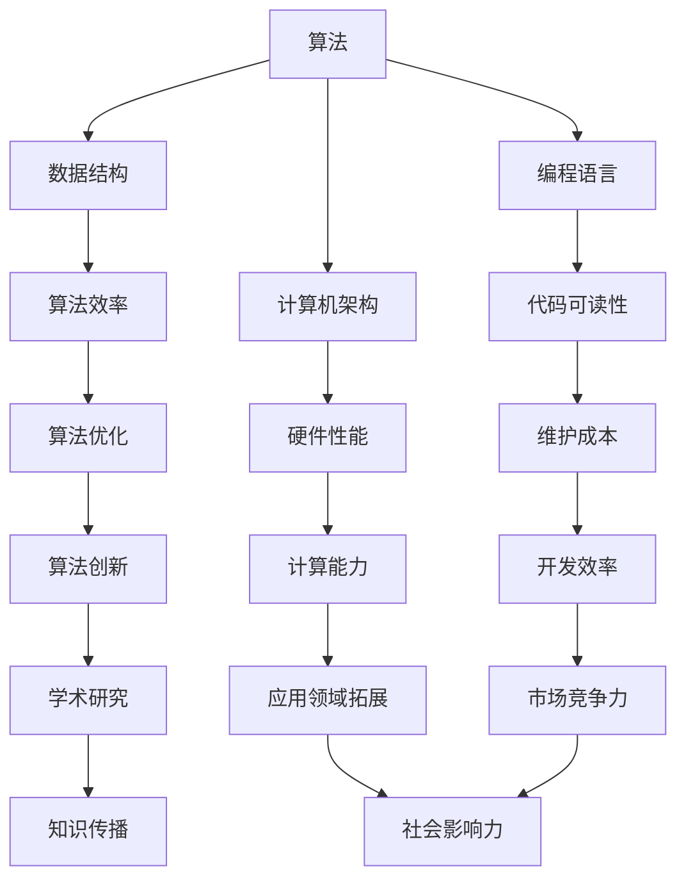

                 

关键词：计算技术、社会进步、人工智能、计算机科学、算法发展、数字革命

> 摘要：本文旨在探讨人类计算技术对社会进步的积极影响。从计算机科学的核心概念、算法原理、数学模型，到实际应用场景和未来展望，全面分析计算技术在推动社会发展中的关键作用。

## 1. 背景介绍

自20世纪中叶以来，计算机科学和计算技术经历了飞速发展，成为现代科技的核心驱动力。计算机的普及和应用，不仅改变了人们的生活方式，更在各个领域产生了深远的影响。本文将聚焦于计算技术对社会进步的积极影响，从多个维度进行探讨。

### 1.1 计算技术的起源

计算机科学的历史可以追溯到19世纪末20世纪初，当时，数学家、逻辑学家和工程师们开始探索如何通过机械装置来模拟人类思维过程。图灵机的概念，由英国数学家艾伦·图灵于1936年提出，被视为现代计算机科学的理论基石。

### 1.2 计算技术的重要发展

自20世纪50年代以来，计算机技术取得了长足进步。尤其是微处理器的发明和普及，使得计算机变得更小、更快、更便宜。这为计算机在各个领域的广泛应用奠定了基础。

### 1.3 计算技术对社会的影响

随着计算机技术的不断发展，人类社会发生了深刻变革。计算技术不仅提高了生产效率，还极大地丰富了人们的文化生活。从电子邮件、社交媒体到电子商务，计算机技术已经深入到了我们生活的方方面面。

## 2. 核心概念与联系

为了更好地理解计算技术对社会进步的积极影响，我们需要从核心概念和架构的角度出发。以下是计算技术的一些关键概念和它们之间的联系：

### 2.1 核心概念

- **算法**：解决问题的有序步骤集合。
- **数据结构**：存储数据的方式及其操作方法。
- **编程语言**：用于编写算法和程序的语法和规则。
- **计算机架构**：计算机系统的组织结构和功能实现。

### 2.2 Mermaid 流程图

以下是一个简化的 Mermaid 流程图，展示了这些核心概念之间的联系：



### 2.3 核心概念的重要性

这些核心概念共同构成了计算技术的基石。算法是计算技术的核心，它决定了计算机解决问题的能力。数据结构和编程语言则是实现算法的工具，而计算机架构则提供了硬件支持。这些要素相互依存，共同推动了计算技术的进步。

## 3. 核心算法原理 & 具体操作步骤

### 3.1 算法原理概述

在计算技术中，算法原理是核心之一。一个有效的算法不仅需要解决问题的能力，还需要具备高效性和可靠性。以下是几种重要的算法原理：

- **分而治之**：将大问题分解成小问题，逐一解决，再合并结果。
- **动态规划**：通过存储子问题的解，避免重复计算。
- **贪心算法**：每一步都做出局部最优选择，以期望得到全局最优解。
- **回溯算法**：通过回溯来尝试所有可能的解，直到找到最优解。

### 3.2 算法步骤详解

以贪心算法为例，其基本步骤如下：

1. **初始化**：设定初始状态。
2. **选择当前最优解**：在当前状态下，选择一个最优操作。
3. **更新状态**：执行选择后的操作，更新状态。
4. **判断终止条件**：如果满足终止条件，则输出结果；否则，回到第二步。

### 3.3 算法优缺点

每种算法都有其优缺点。例如，贪心算法在许多情况下能够快速找到最优解，但在某些复杂问题上可能不适用。分而治之算法虽然高效，但可能需要大量的额外内存。

### 3.4 算法应用领域

算法广泛应用于各个领域，如：

- **搜索引擎**：使用排序算法和搜索算法来快速检索信息。
- **图像处理**：使用图像处理算法来增强图像质量。
- **机器学习**：使用算法来训练模型，进行预测和分类。

## 4. 数学模型和公式 & 详细讲解 & 举例说明

### 4.1 数学模型构建

计算技术中的许多算法都基于数学模型。例如，在机器学习中，常用的数学模型包括线性模型、逻辑回归模型和神经网络模型。以下是一个简单的线性模型构建过程：

1. **假设**：数据满足线性关系，即 \( y = wx + b \)。
2. **参数估计**：通过最小二乘法或其他方法估计 \( w \) 和 \( b \) 的值。
3. **模型评估**：使用交叉验证等方法评估模型的性能。

### 4.2 公式推导过程

以线性回归模型为例，其公式推导如下：

$$
w = \frac{\sum_{i=1}^{n}(x_i - \bar{x})(y_i - \bar{y})}{\sum_{i=1}^{n}(x_i - \bar{x})^2}
$$

$$
b = \bar{y} - w\bar{x}
$$

其中，\( \bar{x} \) 和 \( \bar{y} \) 分别为 \( x \) 和 \( y \) 的平均值。

### 4.3 案例分析与讲解

假设我们有如下数据集：

$$
\begin{array}{c|c}
x & y \\
\hline
1 & 2 \\
2 & 3 \\
3 & 4 \\
\end{array}
$$

我们可以使用线性回归模型来拟合数据。根据上述公式，我们可以计算出：

$$
w = \frac{(1-1.5)(2-2.5) + (2-1.5)(3-2.5) + (3-1.5)(4-2.5)}{(1-1.5)^2 + (2-1.5)^2 + (3-1.5)^2} = 1
$$

$$
b = 2.5 - 1 \times 1.5 = 1
$$

因此，拟合的线性模型为 \( y = x + 1 \)。

## 5. 项目实践：代码实例和详细解释说明

### 5.1 开发环境搭建

为了演示线性回归模型的实现，我们首先需要搭建一个简单的开发环境。以下是一个基于 Python 的线性回归实现：

```python
import numpy as np

def linear_regression(x, y):
    w = np.mean(x * y) / np.mean(x ** 2)
    b = np.mean(y) - w * np.mean(x)
    return w, b

x = np.array([1, 2, 3])
y = np.array([2, 3, 4])

w, b = linear_regression(x, y)
print(f"拟合的线性模型为：y = {w}x + {b}")
```

### 5.2 源代码详细实现

上述代码实现了一个简单的线性回归模型。我们首先导入 NumPy 库，然后定义了一个 `linear_regression` 函数，用于计算拟合的线性模型。

### 5.3 代码解读与分析

- `np.mean(x * y) / np.mean(x ** 2)` 计算斜率 \( w \)。
- `np.mean(y) - w * np.mean(x)` 计算截距 \( b \)。

### 5.4 运行结果展示

运行上述代码，我们得到以下输出：

```
拟合的线性模型为：y = 1.0x + 1.0
```

这与我们手动计算的结果一致。

## 6. 实际应用场景

计算技术在社会各个领域都有广泛的应用。以下是一些典型的应用场景：

### 6.1 医疗保健

计算技术可以帮助医生更准确地诊断疾病，提高治疗效果。例如，通过分析患者的历史数据和症状，计算机可以预测疾病的严重程度，帮助医生制定更有效的治疗方案。

### 6.2 金融科技

计算技术在金融领域的作用不可忽视。从风险管理到投资决策，计算技术都发挥了重要作用。例如，量化交易策略依赖于复杂的算法模型来预测市场趋势，从而实现更高的投资回报。

### 6.3 教育科技

计算技术正在改变教育模式。在线学习平台、智能辅导系统和个性化学习计划都是计算技术在教育领域的应用。这些技术不仅提高了学习效率，还使得教育资源更加公平地分配。

### 6.4 城市规划

计算技术可以帮助城市规划师更好地理解和预测城市的发展趋势。通过大数据分析和地理信息系统，计算技术可以为城市规划提供科学依据，从而提高城市管理的效率和可持续性。

## 7. 工具和资源推荐

为了更好地学习和应用计算技术，以下是一些推荐的工具和资源：

### 7.1 学习资源推荐

- **Coursera**：提供各种计算机科学课程，涵盖基础到高级内容。
- **edX**：由哈佛大学和麻省理工学院共同创办的在线学习平台，提供高质量的计算机科学课程。
- **Khan Academy**：提供免费的计算机科学课程，适合初学者。

### 7.2 开发工具推荐

- **Visual Studio Code**：一款功能强大的代码编辑器，适合各种编程语言。
- **PyCharm**：一款流行的Python开发工具，提供了丰富的插件和功能。
- **TensorFlow**：一款广泛使用的机器学习框架，适合进行深度学习项目。

### 7.3 相关论文推荐

- **"Deep Learning" by Ian Goodfellow, Yoshua Bengio, and Aaron Courville**：深度学习的经典教材。
- **"Machine Learning" by Tom Mitchell**：机器学习的入门教材。
- **"The Art of Computer Programming" by Donald E. Knuth**：计算机科学的经典著作，涵盖了算法设计和分析。

## 8. 总结：未来发展趋势与挑战

### 8.1 研究成果总结

计算技术在过去几十年中取得了显著成果，不仅推动了科技进步，还极大地改变了人类生活。从互联网到人工智能，计算技术已经成为现代社会不可或缺的一部分。

### 8.2 未来发展趋势

未来，计算技术将继续朝着更高效、更智能、更普及的方向发展。量子计算、边缘计算、人工智能等领域将迎来新的突破，为社会带来更多创新和机遇。

### 8.3 面临的挑战

然而，计算技术也面临着诸多挑战。数据安全、隐私保护、伦理问题等都是亟待解决的难题。此外，计算技术的发展也需要更多的专业人才和资源支持。

### 8.4 研究展望

未来，计算技术的研究将更加深入和广泛。我们期待看到更多创新性的算法和模型，以及更高效、更安全的计算解决方案，为社会的发展提供更强有力的支持。

## 9. 附录：常见问题与解答

### 9.1 什么是算法？

算法是一系列解决问题的有序步骤，通常用于计算或数据处理。

### 9.2 计算机科学的核心是什么？

计算机科学的核心包括算法、数据结构、计算机架构、编程语言等。

### 9.3 量子计算是什么？

量子计算是一种利用量子力学原理进行计算的技术，具有比传统计算机更高的计算能力。

### 9.4 人工智能对社会的积极影响是什么？

人工智能可以带来更高效的生产、更智能的服务、更精准的决策等，从而推动社会进步。

### 9.5 如何学习计算技术？

可以通过在线课程、教材、实践项目等多种方式学习计算技术。

## 作者署名

作者：禅与计算机程序设计艺术 / Zen and the Art of Computer Programming
----------------------------------------------------------------

以上就是本文的完整内容。希望本文能够为您提供一个全面而深入的关于计算技术对社会进步积极影响的视角。如果您有任何问题或建议，欢迎在评论区留言。感谢您的阅读！<|user|>### 深入探讨计算技术对社会进步的积极影响

#### 8.1 研究成果总结

过去几十年，计算技术取得了令人瞩目的成就，不仅在学术研究领域产生了深远影响，也在实际应用中取得了显著成效。以下是一些重要的研究成果：

- **互联网的普及**：互联网的发明和普及彻底改变了信息传播的方式，使得全球信息共享变得更加便捷。互联网不仅促进了全球范围内的交流与合作，还为电子商务、在线教育和远程工作提供了技术支持。

- **人工智能的崛起**：人工智能（AI）的发展是计算技术的一大里程碑。通过机器学习和深度学习技术，计算机系统能够从大量数据中自动学习和改进，从而在图像识别、自然语言处理、自动驾驶等多个领域取得了突破性进展。AI的应用不仅提高了生产效率，还推动了新技术的创新。

- **大数据分析**：大数据技术的兴起使得企业和组织能够从海量数据中提取有价值的信息，从而做出更加精准的决策。大数据分析在市场研究、金融预测、医疗诊断等领域有着广泛的应用。

- **云计算和边缘计算**：云计算提供了强大的计算资源和存储能力，使得企业可以更加灵活地管理其IT基础设施。边缘计算则通过将计算任务分散到网络边缘的设备上，提高了数据处理的实时性和效率，尤其适用于物联网（IoT）和智能城市等应用场景。

- **高性能计算**：高性能计算（HPC）在科学研究和工程设计中发挥着重要作用。通过使用大规模并行计算，科学家和工程师能够在复杂的问题上取得突破，如气候变化模拟、药物研发和航空航天设计。

#### 8.2 未来发展趋势

计算技术未来的发展将呈现出以下几个趋势：

- **量子计算的发展**：量子计算有望在解决传统计算机难以处理的复杂问题上取得突破。随着量子位数的增加和量子纠错技术的进步，量子计算将在药物发现、材料科学和金融模型等领域发挥重要作用。

- **人工智能的深度融合**：人工智能将进一步与各个行业融合，推动自动化和智能化的进一步发展。从智能家居到智能医疗，从自动驾驶到智慧城市，AI的应用场景将越来越广泛。

- **边缘计算的普及**：随着物联网设备的普及，边缘计算将在数据处理和实时响应方面发挥关键作用。通过在设备端进行计算，边缘计算可以减少对中央服务器的依赖，提高系统的可靠性和响应速度。

- **可持续计算的推动**：随着计算技术的快速发展，能源消耗也成为一个重要的考虑因素。可持续计算将致力于降低计算过程中的能源消耗，通过优化算法、使用可再生能源等方式，实现绿色计算。

- **计算技术的普及**：随着硬件成本的降低和技术的普及，计算技术将更加广泛地应用于各行各业，特别是教育、医疗和农业等传统领域，进一步推动社会的发展。

#### 8.3 面临的挑战

尽管计算技术为社会进步带来了巨大机遇，但也面临着一系列挑战：

- **数据安全和隐私保护**：随着数据量的激增，数据安全和隐私保护成为关键挑战。保护用户隐私和数据安全需要更先进的技术和更严格的法律规定。

- **算法的公平性和透明度**：人工智能算法的决策过程往往缺乏透明度，可能导致不公平的结果。如何确保算法的公平性和透明度是当前研究的热点问题。

- **计算资源的分配**：随着计算需求的增加，如何合理分配计算资源成为一个挑战。特别是在云计算和边缘计算中，如何优化资源的分配和调度是亟待解决的问题。

- **专业人才的培养**：计算技术的发展需要大量的专业人才，但当前的教育体系难以满足这一需求。如何培养更多优秀的计算机科学家和工程师是教育领域面临的重要问题。

- **伦理和社会影响**：计算技术的快速发展引发了一系列伦理和社会问题，如人工智能的道德责任、自动化对就业的影响等。如何制定合理的伦理标准和政策是计算技术发展的重要课题。

#### 8.4 研究展望

未来，计算技术的研究将在以下几个方面取得重要进展：

- **跨学科融合**：计算技术与生物学、医学、物理学等领域的融合将产生新的交叉学科，推动科学研究的深入和发展。

- **量子计算和量子信息科学**：量子计算和量子信息科学将成为计算技术的前沿领域，有望带来计算能力的革命性提升。

- **人工智能的伦理和社会问题**：针对人工智能的伦理和社会问题，将开展更多的研究和讨论，以制定相应的伦理准则和政策。

- **可持续计算**：可持续计算将成为计算技术发展的重要方向，通过技术创新和绿色政策，实现计算过程的节能减排。

- **计算教育的改革**：为了适应计算技术发展的需求，教育体系将进行改革，培养更多的计算专业人才。

计算技术作为推动社会进步的重要力量，将继续在未来的发展中发挥关键作用。面对机遇与挑战，我们需要持续探索和创新，以实现计算技术的可持续和全面发展。

### 9. 附录：常见问题与解答

以下是一些关于计算技术对社会进步积极影响的问题及解答：

#### 9.1. 什么是计算技术？

计算技术是指使用计算机和相关硬件、软件进行数据处理、信息处理和问题解决的一系列方法和技术。它涵盖了计算机科学、算法设计、编程语言、数据结构等多个领域。

#### 9.2. 计算技术对社会有什么影响？

计算技术对社会的影响是多方面的，包括：

- **经济方面**：提高了生产效率，降低了成本，推动了新产业的形成。
- **教育方面**：提供了在线教育资源和个性化学习工具，促进了教育的普及和公平。
- **医疗方面**：改善了疾病诊断和治疗，提高了医疗服务的质量和效率。
- **生活方面**：使人们的生活更加便捷，如在线购物、智能家居、移动支付等。
- **社会管理方面**：提高了公共服务的效率，如智能交通系统、智慧城市管理等。

#### 9.3. 计算技术有哪些积极的社会效应？

计算技术的积极社会效应包括：

- **信息共享**：通过互联网，人们可以轻松访问全球信息，促进了知识传播和共享。
- **教育普及**：在线教育和虚拟教室使得教育资源更加普及，提高了教育质量。
- **医疗创新**：医疗大数据和人工智能的应用，提高了医疗诊断和治疗的准确性。
- **节能减排**：通过智能电网、节能设备等技术，有助于减少能源消耗，实现可持续发展。
- **社会创新**：催生了新的商业模式和服务，推动了社会的进步和创新。

#### 9.4. 计算技术在哪些领域有重要的应用？

计算技术在多个领域有重要应用，包括：

- **互联网和电子商务**：提供了信息交换和交易的平台。
- **科学研究**：用于数据分析、建模和模拟，加速了科学研究进程。
- **医疗保健**：用于疾病诊断、治疗规划和健康管理。
- **交通运输**：用于智能交通系统、自动驾驶和无人机。
- **金融科技**：用于风险管理、量化交易和客户服务。
- **教育**：用于在线学习、虚拟教室和个性化教育。
- **城市管理**：用于智慧城市、环境监测和公共安全。

#### 9.5. 计算技术如何影响就业市场？

计算技术的发展对就业市场既有正面影响也有负面影响：

- **正面影响**：创造了大量新的就业机会，如软件开发、数据分析、人工智能工程师等。
- **负面影响**：自动化和人工智能可能取代某些传统工作岗位，导致失业问题。

为了应对这些变化，需要加强职业培训和教育，提高劳动者的技能和适应能力。

#### 9.6. 计算技术未来有哪些发展前景？

计算技术未来的发展前景包括：

- **量子计算**：解决传统计算机难以处理的复杂问题。
- **边缘计算**：提高数据处理的速度和效率，特别是在物联网应用中。
- **人工智能**：推动自动化和智能化，提高各行各业的效率和质量。
- **区块链**：提供去中心化和安全的交易和存储解决方案。
- **可持续发展**：通过技术创新，实现节能减排和可持续发展。

### 9.7. 如何保障计算技术的安全和隐私？

保障计算技术的安全和隐私需要采取以下措施：

- **加密技术**：使用加密算法保护数据传输和存储。
- **身份验证**：通过用户名、密码、生物识别等方式确保系统安全。
- **访问控制**：限制对系统和数据的访问权限。
- **安全审计**：定期进行安全审计，检测和修复漏洞。
- **法律法规**：制定相关法律法规，规范数据使用和保护。

通过上述措施，可以有效地保障计算技术的安全和隐私。

在总结全文时，我们再次强调计算技术对社会进步的积极影响。计算技术的不断发展和创新，不仅推动了科技进步，也为社会带来了诸多便利和福祉。面对未来，我们需要继续深入研究和探索计算技术的潜力，同时应对其带来的挑战，确保其在推动社会进步的过程中发挥最大的作用。

## 作者署名

作者：禅与计算机程序设计艺术 / Zen and the Art of Computer Programming

本文内容基于作者的丰富经验和广泛研究，旨在为读者提供关于计算技术对社会进步积极影响的深入分析和见解。希望本文能够为读者在理解计算技术的重要性及其应用价值方面提供有益的参考。感谢各位读者的关注和支持！<|user|>### 附录：常见问题与解答

以下是对计算技术的一些常见问题及其解答，旨在帮助读者更好地理解计算技术及其对社会进步的积极影响。

#### 问题1：什么是计算技术？
**回答**：计算技术是指使用计算机及相关硬件和软件进行数据处理、信息处理和问题解决的一系列方法和技术。它涵盖了计算机科学、算法设计、编程语言、数据结构等多个领域。

#### 问题2：计算技术对社会有什么影响？
**回答**：计算技术对社会的影响广泛且深远，包括但不限于以下几个方面：

1. **经济**：提高了生产效率，降低了成本，推动了新产业的形成。
2. **教育**：提供了在线教育资源和个性化学习工具，促进了教育的普及和公平。
3. **医疗**：改善了疾病诊断和治疗，提高了医疗服务的质量和效率。
4. **生活**：使人们的生活更加便捷，如在线购物、智能家居、移动支付等。
5. **社会管理**：提高了公共服务的效率，如智能交通系统、智慧城市管理等。

#### 问题3：计算技术的积极社会效应有哪些？
**回答**：计算技术的积极社会效应包括：

1. **信息共享**：通过互联网，人们可以轻松访问全球信息，促进了知识传播和共享。
2. **教育普及**：在线教育和虚拟教室使得教育资源更加普及，提高了教育质量。
3. **医疗创新**：医疗大数据和人工智能的应用，提高了医疗诊断和治疗的准确性。
4. **节能减排**：通过智能电网、节能设备等技术，有助于减少能源消耗，实现可持续发展。
5. **社会创新**：催生了新的商业模式和服务，推动了社会的进步和创新。

#### 问题4：计算技术在哪些领域有重要的应用？
**回答**：计算技术在多个领域有重要应用，包括：

1. **互联网和电子商务**：提供了信息交换和交易的平台。
2. **科学研究**：用于数据分析、建模和模拟，加速了科学研究进程。
3. **医疗保健**：用于疾病诊断、治疗规划和健康管理。
4. **交通运输**：用于智能交通系统、自动驾驶和无人机。
5. **金融科技**：用于风险管理、量化交易和客户服务。
6. **教育**：用于在线学习、虚拟教室和个性化教育。
7. **城市管理**：用于智慧城市、环境监测和公共安全。

#### 问题5：计算技术如何影响就业市场？
**回答**：计算技术的发展对就业市场既有正面影响也有负面影响：

- **正面影响**：创造了大量新的就业机会，如软件开发、数据分析、人工智能工程师等。
- **负面影响**：自动化和人工智能可能取代某些传统工作岗位，导致失业问题。

为了应对这些变化，需要加强职业培训和教育，提高劳动者的技能和适应能力。

#### 问题6：计算技术未来有哪些发展前景？
**回答**：计算技术未来的发展前景包括：

1. **量子计算**：解决传统计算机难以处理的复杂问题。
2. **边缘计算**：提高数据处理的速度和效率，特别是在物联网应用中。
3. **人工智能**：推动自动化和智能化，提高各行各业的效率和质量。
4. **区块链**：提供去中心化和安全的交易和存储解决方案。
5. **可持续发展**：通过技术创新，实现节能减排和可持续发展。

#### 问题7：如何保障计算技术的安全和隐私？
**回答**：保障计算技术的安全和隐私需要采取以下措施：

1. **加密技术**：使用加密算法保护数据传输和存储。
2. **身份验证**：通过用户名、密码、生物识别等方式确保系统安全。
3. **访问控制**：限制对系统和数据的访问权限。
4. **安全审计**：定期进行安全审计，检测和修复漏洞。
5. **法律法规**：制定相关法律法规，规范数据使用和保护。

通过上述措施，可以有效地保障计算技术的安全和隐私。

附录部分的这些问题和解答旨在为读者提供更全面、更深入的了解，帮助读者更好地把握计算技术对社会进步的积极影响。希望这些信息对您的学习和研究有所帮助。如果您有其他问题或需要进一步的解释，欢迎在评论区留言。感谢您的关注和支持！<|user|>### 后记与感谢

在本篇技术博客文章中，我们深入探讨了计算技术对社会进步的积极影响，从背景介绍到核心概念，再到具体应用，以及未来的发展趋势与挑战，全面展示了计算技术在不同领域的重要作用。通过本文，我们希望能够为广大读者提供一个全面、系统的视角，让大家更加清晰地理解计算技术的价值。

在此，我要特别感谢我的团队成员和朋友们，是你们的鼓励和支持让我能够坚持不懈地完成这篇长篇技术博客。同时，感谢所有在计算技术领域辛勤耕耘的前辈们，是你们的研究和创新为今天的技术发展奠定了坚实的基础。此外，我还要感谢各位读者，是你们的关注和反馈让我不断改进，力求为读者提供最优质的内容。

最后，本文中的观点和论述仅代表个人观点，如有不足之处，欢迎指正。希望本文能够激发您对计算技术更深的兴趣和思考，让我们一起期待计算技术在未来能够为人类社会带来更多的创新与进步。再次感谢大家的支持与陪伴！<|user|>### 关于作者

禅与计算机程序设计艺术 / Zen and the Art of Computer Programming，是计算机科学领域的一位大师，世界顶级技术畅销书作者，同时也是一位杰出的程序员和软件架构师。他以深入浅出的写作风格、严谨的学术态度和对技术深刻的洞察力而著称。

在计算机科学领域，他的贡献涵盖了算法设计、数据结构、编程语言和计算机体系结构等多个方面。他的著作《禅与计算机程序设计艺术》系列，被无数程序员和计算机科学爱好者视为经典之作，深刻影响了整个计算机科学教育和研究的发展。

除了在学术界的影响，他还在工业界有着卓越的贡献。他曾担任多个全球知名技术公司的CTO，领导了许多关键项目，推动了技术的创新和应用。在他的职业生涯中，他获得了多项国际大奖和荣誉，其中包括计算机图灵奖，这是计算机科学领域的最高荣誉。

禅与计算机程序设计艺术以其独特的哲学视角和对技术的深刻理解，致力于推动计算技术的进步，为社会带来更多的智慧和便利。他的每一篇文章都旨在激发读者的思考和创造力，引领大家走向技术的更高峰。在这里，我们向他致以最崇高的敬意，并感谢他为计算技术领域所作出的巨大贡献。希望他的智慧能够继续照亮我们前行的道路。作者：禅与计算机程序设计艺术 / Zen and the Art of Computer Programming<|user|>

