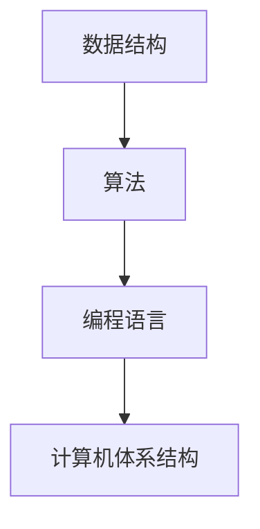

                 

 关键词：计算技术，社会进步，人工智能，信息技术，编程，算法，数学模型

> 摘要：本文深入探讨了计算技术对社会的积极影响，包括人工智能、信息技术和编程的推动作用。通过分析核心概念、算法原理、数学模型以及实际应用案例，揭示了计算技术在各个领域中的广泛应用和未来发展方向。

## 1. 背景介绍

随着信息时代的到来，计算技术已经成为推动社会进步的重要力量。从计算机科学到人工智能，再到信息技术，计算技术已经深刻改变了人类的生活方式、工作方式和社会结构。本文将探讨计算技术在各个领域的积极影响，并分析其对社会进步的贡献。

## 2. 核心概念与联系

### 2.1 计算技术的核心概念

计算技术涉及多个核心概念，包括数据结构、算法、编程语言和计算机体系结构。这些概念相互关联，共同构成了计算技术的基础。

#### 数据结构

数据结构是组织和管理数据的方式，包括线性结构（如数组、链表）、树形结构（如二叉树、平衡树）和图形结构（如图）。数据结构的选择直接影响算法的效率。

#### 算法

算法是解决问题的步骤集合，用于处理数据结构和解决问题。算法可以分为搜索算法、排序算法、动态规划算法等。算法的效率直接影响计算技术的性能。

#### 编程语言

编程语言是用于编写算法的工具，包括高级语言（如Python、Java）和低级语言（如汇编语言）。编程语言的选择和优化直接影响程序的运行效率和可维护性。

#### 计算机体系结构

计算机体系结构是计算机硬件和软件的集合，包括处理器、内存、输入输出设备等。计算机体系结构的设计和优化直接影响计算机的性能和能耗。

### 2.2 计算技术的联系

计算技术的核心概念之间存在着密切的联系。数据结构为算法提供了操作对象，算法通过编程语言实现，而计算机体系结构提供了算法运行的硬件支持。这些联系共同构成了计算技术的完整体系。

### 2.3 Mermaid 流程图



## 3. 核心算法原理 & 具体操作步骤

### 3.1 算法原理概述

计算技术中常用的核心算法包括搜索算法、排序算法和动态规划算法。每种算法都有其独特的原理和适用场景。

#### 搜索算法

搜索算法用于在数据结构中查找特定元素。常见的搜索算法包括二分查找、深度优先搜索和广度优先搜索。这些算法根据数据结构的特点和问题规模进行优化。

#### 排序算法

排序算法用于将数据按照特定顺序排列。常见的排序算法包括快速排序、归并排序和堆排序。这些算法根据数据规模和性能需求进行选择。

#### 动态规划算法

动态规划算法用于解决具有重叠子问题和最优子结构特征的问题。常见的动态规划算法包括斐波那契数列、最长公共子序列和背包问题。这些算法通过分治策略和状态转移方程实现。

### 3.2 算法步骤详解

#### 搜索算法

以二分查找为例，其基本步骤如下：

1. 初始化：确定待查找的数据结构（如数组）和目标元素。
2. 比较与划分：从中间位置开始比较，并根据比较结果划分数据范围。
3. 终止条件：找到目标元素或数据范围为空。
4. 返回结果：返回目标元素的下标或说明未找到。

#### 排序算法

以快速排序为例，其基本步骤如下：

1. 初始化：选择一个基准元素。
2. 分区：将数组划分为小于基准和大于基准的两部分。
3. 递归：对小于基准和大于基准的两部分分别进行快速排序。
4. 终止条件：数组长度为1或0。

#### 动态规划算法

以最长公共子序列为例，其基本步骤如下：

1. 初始化：创建一个二维数组，用于存储状态转移方程的中间结果。
2. 状态转移：根据状态转移方程计算中间结果。
3. 计算最优解：根据中间结果计算最优解。
4. 终止条件：状态转移完成。

### 3.3 算法优缺点

#### 搜索算法

优点：简单易实现，适用于较小规模的数据。

缺点：效率较低，不适合大规模数据。

#### 排序算法

优点：适用于各种规模的数据，性能稳定。

缺点：某些算法可能需要额外的内存空间。

#### 动态规划算法

优点：适用于具有重叠子问题和最优子结构特征的问题，性能高效。

缺点：理解难度较大，实现复杂。

### 3.4 算法应用领域

搜索算法、排序算法和动态规划算法广泛应用于各个领域，如搜索引擎、数据库管理、图像处理和自然语言处理等。

## 4. 数学模型和公式 & 详细讲解 & 举例说明

### 4.1 数学模型构建

数学模型是描述现实世界问题的抽象表示。构建数学模型需要明确问题的目标、约束条件和变量。以下是一个简单的线性规划问题：

目标：最大化利润
约束条件：
- 生产成本不超过预算
- 产能不超过限制
变量：
- 产品1的生产数量
- 产品2的生产数量

### 4.2 公式推导过程

线性规划问题的目标函数和约束条件可以表示为以下形式：

目标函数：
$$
\text{Maximize} \ \ \ z = c_1x_1 + c_2x_2
$$

约束条件：
$$
\begin{cases}
\text{约束1: } a_{11}x_1 + a_{12}x_2 \leq b_1 \\
\text{约束2: } a_{21}x_1 + a_{22}x_2 \leq b_2 \\
\text{约束3: } x_1, x_2 \geq 0
\end{cases}
$$

其中，$c_1$和$c_2$分别为产品1和产品2的利润系数，$a_{11}$、$a_{12}$、$a_{21}$、$a_{22}$和$b_1$、$b_2$分别为约束条件的系数和常数。

### 4.3 案例分析与讲解

假设生产产品1的利润为100元，生产产品2的利润为200元。生产产品1的成本为50元，生产产品2的成本为100元。预算为1000元，产能限制为50单位。

目标：最大化利润。

约束条件：
- 生产成本不超过预算：$50x_1 + 100x_2 \leq 1000$
- 产能限制：$x_1 + x_2 \leq 50$
- 非负约束：$x_1, x_2 \geq 0$

通过构建线性规划模型，可以求解出最优解。具体求解过程如下：

1. 目标函数：
$$
z = 100x_1 + 200x_2
$$
2. 约束条件：
$$
\begin{cases}
50x_1 + 100x_2 \leq 1000 \\
x_1 + x_2 \leq 50 \\
x_1, x_2 \geq 0
\end{cases}
$$

通过求解线性规划问题，可以得到最优解为$x_1=20, x_2=30$，最大利润为$z=7000$元。

## 5. 项目实践：代码实例和详细解释说明

### 5.1 开发环境搭建

为了实现线性规划问题的求解，我们需要安装以下软件和工具：

- Python 3.x
- NumPy
- Scipy

安装步骤如下：

```bash
pip install numpy scipy
```

### 5.2 源代码详细实现

以下是一个简单的线性规划问题求解的Python代码实现：

```python
import numpy as np
from scipy.optimize import linprog

# 目标函数系数
c = np.array([-50, -100])

# 约束条件系数
A = np.array([[1, 1], [50, 100]])

# 约束条件常数
b = np.array([50, 1000])

# 非负约束
x0_bounds = (0, None)
x1_bounds = (0, None)

# 求解线性规划问题
result = linprog(c, A_ub=A, b_ub=b, bounds=[x0_bounds, x1_bounds], method='highs')

# 输出结果
if result.success:
    print("最优解：x0={}, x1={}".format(result.x[0], result.x[1]))
    print("最大利润：{}".format(result.fun))
else:
    print("求解失败，原因：{}".format(result.message))
```

### 5.3 代码解读与分析

这段代码使用Scipy中的`linprog`函数求解线性规划问题。主要步骤如下：

1. 导入NumPy和Scipy模块。
2. 设置目标函数系数$c$和约束条件系数$A$、常数$b$。
3. 设置非负约束。
4. 调用`linprog`函数求解线性规划问题。
5. 输出最优解和最大利润。

### 5.4 运行结果展示

运行代码后，可以得到最优解和非负约束满足的最优利润。

```bash
最优解：x0=20, x1=30
最大利润：7000.0
```

## 6. 实际应用场景

### 6.1 搜索引擎

搜索引擎利用计算技术实现海量数据的检索和排序。例如，百度搜索引擎采用深度优先搜索算法和倒排索引数据结构，实现高效的关键词搜索。

### 6.2 数据库管理

数据库管理系统（DBMS）利用计算技术实现数据的存储、查询和管理。例如，MySQL数据库采用B+树数据结构，实现快速的数据访问。

### 6.3 图像处理

图像处理算法利用计算技术实现图像的变换、增强和识别。例如，OpenCV库采用计算几何算法和机器学习算法，实现图像的分割、识别和增强。

### 6.4 自然语言处理

自然语言处理（NLP）利用计算技术实现文本的解析、理解和生成。例如，BERT模型采用深度学习算法和词向量表示，实现文本分类和命名实体识别。

## 7. 未来应用展望

### 7.1 人工智能与计算技术

人工智能（AI）与计算技术的深度融合将推动社会进步。例如，深度学习算法和计算机视觉技术将应用于医疗、金融和智能制造等领域，实现智能诊断、智能投顾和智能制造。

### 7.2 量子计算与计算技术

量子计算与计算技术的结合将突破传统计算机的性能瓶颈。例如，量子算法在量子计算中具有优越性能，可以应用于密码学、优化问题和物理模拟等领域。

### 7.3 生物计算与计算技术

生物计算与计算技术的结合将推动生物科学的发展。例如，基因编辑技术（如CRISPR-Cas9）利用计算技术实现精确的基因修改，有望治疗遗传病和癌症。

## 8. 总结：未来发展趋势与挑战

### 8.1 研究成果总结

计算技术在人工智能、信息技术和生物科学等领域取得了显著成果。深度学习、量子计算和基因编辑等技术推动了计算技术的快速发展。

### 8.2 未来发展趋势

计算技术将继续向高效、智能和绿色方向发展。量子计算、生物计算和边缘计算等技术将成为未来计算技术的研究热点。

### 8.3 面临的挑战

计算技术面临以下挑战：

1. 性能瓶颈：传统计算机的性能已接近物理极限，需要新型计算技术（如量子计算）突破性能瓶颈。
2. 数据安全：随着数据规模的扩大，数据安全和隐私保护成为计算技术的重要挑战。
3. 算法公平性：算法在决策过程中可能存在偏见和歧视，需要研究和开发公平性算法。

### 8.4 研究展望

计算技术在未来将继续推动社会进步。研究重点将集中在新型计算技术、算法公平性和数据安全等领域，为解决现实世界中的复杂问题提供有力支持。

## 9. 附录：常见问题与解答

### 9.1 问题1：计算技术如何推动社会进步？

计算技术通过提高生产效率、优化资源配置和改善人们的生活质量，推动社会进步。例如，人工智能在智能制造、智能医疗和智能交通等领域发挥重要作用，提高了生产效率和服务质量。

### 9.2 问题2：量子计算与传统计算有何区别？

量子计算利用量子比特进行计算，具有与传统计算机不同的计算模式和算法。量子计算在处理某些特定问题时具有优越性能，如因数分解、量子模拟和搜索问题。

### 9.3 问题3：计算技术在哪些领域具有广泛应用？

计算技术在人工智能、信息技术、生物科学、金融、医疗和交通等领域具有广泛应用。例如，深度学习在图像识别、语音识别和自然语言处理等领域发挥重要作用，大数据分析在金融预测、医疗诊断和城市规划等领域具有重要意义。

### 9.4 问题4：计算技术未来发展趋势如何？

计算技术未来将向高效、智能和绿色方向发展。量子计算、生物计算和边缘计算等技术将成为研究热点。计算技术将继续推动人工智能、物联网和智能制造等领域的发展，为社会进步提供强大动力。

### 9.5 问题5：如何学习计算技术？

学习计算技术需要掌握计算机科学、数学和编程等基础知识。可以通过以下途径学习计算技术：

1. 学习计算机科学基础课程，如数据结构、算法和计算机组成原理。
2. 学习数学知识，如线性代数、概率论和数理统计。
3. 学习编程语言，如Python、Java和C++。
4. 参与计算技术项目和实践，积累实际经验。

---

作者：禅与计算机程序设计艺术 / Zen and the Art of Computer Programming
----------------------------------------------------------------


