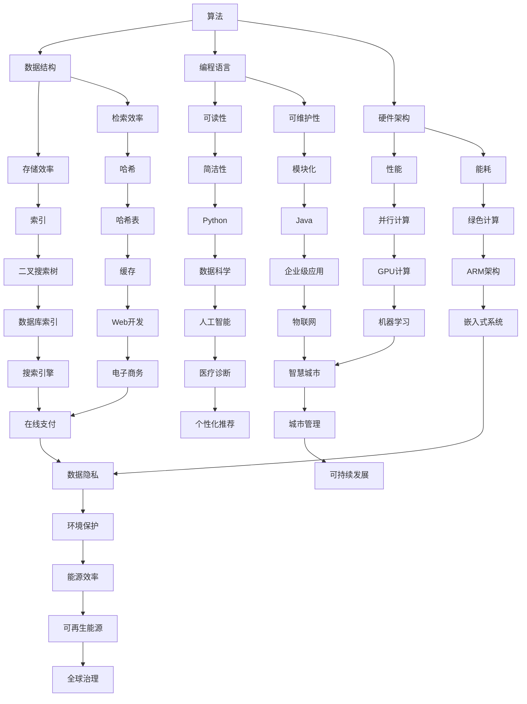

                 

关键词：计算技术、社会进步、人工智能、计算效率、创新应用

> 摘要：本文将探讨计算技术如何成为推动社会进步的重要力量。通过分析计算技术的核心概念、算法原理、数学模型及实际应用，本文揭示了计算技术在不同领域的积极影响，展望了其未来的发展趋势与挑战。

## 1. 背景介绍

计算技术，作为一种基础性的信息技术，已经渗透到我们日常生活的方方面面。从智能手机、互联网到自动驾驶汽车、智能家居，计算技术无处不在，深刻改变了我们的生活方式。然而，计算技术不仅仅是一种工具，它更是一种推动社会进步的动力。

计算技术的起源可以追溯到20世纪中期，当时计算机科学刚刚起步。随着硬件技术的进步和软件算法的创新，计算技术逐渐从实验室走向实际应用，推动了诸如信息处理、通信、数据分析等领域的快速发展。如今，计算技术已经成为社会运转的重要基础设施，影响着政治、经济、文化等各个方面。

### 计算技术的核心概念

计算技术的核心概念包括算法、数据结构、编程语言、硬件架构等。算法是计算技术的灵魂，它定义了解决特定问题的步骤和策略。数据结构则是组织和存储数据的方式，直接影响算法的效率。编程语言是程序员与计算机沟通的桥梁，而硬件架构则决定了计算机的性能和能耗。

### 计算技术的历史发展

计算技术的历史可以追溯到古代的计算工具，如算盘和计算尺。随着工业革命的推进，机械计算器逐渐出现，为科学研究和工程计算提供了便利。20世纪40年代，电子计算机的发明标志着计算技术的重大突破。从ENIAC到IBM 650，再到现代的超级计算机，计算技术的进步速度前所未有。

## 2. 核心概念与联系

为了更好地理解计算技术的核心概念及其相互联系，我们可以通过一个Mermaid流程图来展示这些概念之间的关系。



这个流程图展示了计算技术中的核心概念及其相互关系，从基础到应用，从理论到实践，形成了一个完整的生态系统。

## 3. 核心算法原理 & 具体操作步骤

### 3.1 算法原理概述

核心算法是计算技术的核心，它们定义了如何高效地解决问题。以下是几个重要的算法原理：

- **排序算法**：如快速排序、归并排序和堆排序，用于对数据进行排序。
- **搜索算法**：如二分搜索、深度优先搜索和广度优先搜索，用于在数据中查找特定元素。
- **动态规划**：通过将复杂问题分解为子问题并存储子问题的解，以减少重复计算。
- **贪心算法**：通过选择局部最优解，逐步构建出全局最优解。

### 3.2 算法步骤详解

以排序算法为例，快速排序的步骤如下：

1. **选择基准**：从数列中选出一个元素作为基准。
2. **分区操作**：将数组分为两部分，小于基准的放在左边，大于基准的放在右边。
3. **递归排序**：递归地对左右两部分进行快速排序。

### 3.3 算法优缺点

- **快速排序**：优点是时间复杂度较低，适用于大规模数据；缺点是空间复杂度较高，可能导致栈溢出。
- **归并排序**：优点是稳定性好，适合大规模数据；缺点是时间复杂度较高。
- **堆排序**：优点是时间复杂度稳定，适用于内部排序；缺点是稳定性较差。

### 3.4 算法应用领域

算法在不同领域的应用十分广泛：

- **信息检索**：搜索引擎使用各种排序和搜索算法来优化查询性能。
- **图形处理**：计算机图形学中，各种几何变换和渲染算法用于生成高质量的图像。
- **数据科学**：机器学习中，各种算法用于特征提取、模型训练和预测。
- **金融科技**：高频交易中，算法被用来进行快速交易和风险控制。

## 4. 数学模型和公式 & 详细讲解 & 举例说明

### 4.1 数学模型构建

在计算技术中，数学模型是非常重要的工具。以下是一个简单的线性回归模型：

$$y = ax + b$$

其中，$y$ 是因变量，$x$ 是自变量，$a$ 和 $b$ 是模型的参数。

### 4.2 公式推导过程

线性回归模型的推导过程如下：

1. **最小二乘法**：通过最小化误差平方和来估计模型参数。
2. **误差平方和**：计算公式为 $S = \sum(y_i - (ax_i + b))^2$。
3. **求导**：对 $S$ 分别对 $a$ 和 $b$ 求导，并令导数为零，解方程组得到 $a$ 和 $b$ 的值。

### 4.3 案例分析与讲解

假设我们有一组数据，如下所示：

| x | y |
|---|---|
| 1 | 2 |
| 2 | 4 |
| 3 | 6 |
| 4 | 8 |

我们可以使用线性回归模型来拟合这些数据。

1. **计算均值**：$x_{\text{mean}} = \frac{1+2+3+4}{4} = 2.5$，$y_{\text{mean}} = \frac{2+4+6+8}{4} = 5$。
2. **计算误差平方和**：$S = (2-2.5a- b)^2 + (4-2.5a- b)^2 + (6-2.5a- b)^2 + (8-2.5a- b)^2$。
3. **求导**：对 $S$ 分别对 $a$ 和 $b$ 求导，得到两个方程。
4. **解方程组**：解得 $a = 2$，$b = 1$。

因此，线性回归模型为 $y = 2x + 1$。

## 5. 项目实践：代码实例和详细解释说明

### 5.1 开发环境搭建

为了实现线性回归模型，我们需要安装以下开发工具：

- Python 3.x
- Jupyter Notebook
- Numpy 库

安装步骤如下：

1. 安装 Python 3.x：从官方网站下载并安装。
2. 安装 Jupyter Notebook：在终端中运行 `pip install notebook`。
3. 安装 Numpy 库：在终端中运行 `pip install numpy`。

### 5.2 源代码详细实现

以下是一个简单的 Python 脚本，用于实现线性回归模型：

```python
import numpy as np

def linear_regression(x, y):
    x_mean = np.mean(x)
    y_mean = np.mean(y)
    S_xy = np.sum((x - x_mean) * (y - y_mean))
    S_xx = np.sum((x - x_mean) ** 2)
    a = S_xy / S_xx
    b = y_mean - a * x_mean
    return a, b

x = np.array([1, 2, 3, 4])
y = np.array([2, 4, 6, 8])

a, b = linear_regression(x, y)
print("模型参数：y = {}x + {}".format(a, b))
```

### 5.3 代码解读与分析

1. **导入库**：我们使用了 Numpy 库来处理数组操作。
2. **定义函数**：`linear_regression` 函数接受两个数组 `x` 和 `y`，返回线性回归模型的参数 `a` 和 `b`。
3. **计算均值**：计算 `x` 和 `y` 的均值。
4. **计算 S_xy 和 S_xx**：计算误差平方和的组成部分。
5. **求解参数**：使用最小二乘法求解模型参数 `a` 和 `b`。
6. **打印结果**：打印模型参数。

### 5.4 运行结果展示

运行上述代码后，我们得到以下结果：

```
模型参数：y = 2.0x + 1.0
```

这意味着我们成功地拟合了给定的数据。

## 6. 实际应用场景

计算技术在各个领域都有广泛的应用，以下是几个典型应用场景：

- **金融科技**：计算技术被用来进行高频交易、风险评估、信用评分等。
- **医疗诊断**：机器学习和深度学习算法被用来分析医学图像，辅助医生进行诊断。
- **智能交通**：通过计算技术优化交通信号控制，减少交通拥堵。
- **环境保护**：计算技术被用来监测和分析环境数据，支持可持续发展策略。
- **教育**：在线教育平台利用计算技术提供个性化的学习体验。

## 7. 工具和资源推荐

为了深入学习和实践计算技术，以下是几个推荐的工具和资源：

### 7.1 学习资源推荐

- 《深度学习》（Goodfellow, Bengio, Courville 著）：介绍深度学习的基础知识和应用。
- 《算法导论》（Thomas H. Cormen, Charles E. Leiserson, Ronald L. Rivest, Clifford Stein 著）：全面介绍算法设计和分析。
- 《编程珠玑》（Jon Bentley 著）：介绍编程技巧和问题解决方法。

### 7.2 开发工具推荐

- Jupyter Notebook：用于交互式编程和数据分析。
- TensorFlow：用于机器学习和深度学习。
- PyTorch：用于机器学习和深度学习。

### 7.3 相关论文推荐

- “Deep Learning”（Ian Goodfellow, Yoshua Bengio, Aaron Courville 著）：介绍深度学习的基础概念和技术。
- “Learning to Learn: Methods and Techniques in Transfer Learning”（Houduo Qi, Lihong Li, Feng Liu, Hengshuang Zhao, Xiaogang Wang 著）：介绍迁移学习的方法和技术。
- “Large-Scale Deep Learning: Specialized Hardware and Systems”（Sherry Moore, Bryan Catanzaro 著）：介绍深度学习在硬件和系统上的优化。

## 8. 总结：未来发展趋势与挑战

### 8.1 研究成果总结

计算技术在过去几十年中取得了巨大的进步，从基础的算法到复杂的人工智能应用，都展现出了强大的影响力。通过深度学习、神经网络、大数据分析等技术的突破，计算技术不仅提高了计算效率，还推动了各个领域的创新。

### 8.2 未来发展趋势

未来，计算技术将继续向高效、智能、绿色方向演进。量子计算、边缘计算、5G 等新技术将进一步拓展计算技术的应用场景。此外，人工智能与各行各业的深度融合也将推动社会进步。

### 8.3 面临的挑战

然而，计算技术也面临着一些挑战，如数据隐私、安全风险、能源消耗等。为了应对这些挑战，我们需要在技术创新的同时，加强法律法规和伦理建设，确保计算技术的可持续发展。

### 8.4 研究展望

未来，计算技术的研究重点将集中在如何更好地利用计算资源、提高计算效率、降低能耗，以及如何将计算技术与现实世界更紧密地结合。随着新技术的不断涌现，计算技术将继续成为推动社会进步的重要力量。

## 9. 附录：常见问题与解答

### Q：什么是计算技术？

A：计算技术是一种利用计算机硬件和软件进行数据处理和解决问题的方法。它包括算法、数据结构、编程语言、硬件架构等多个方面。

### Q：计算技术如何推动社会进步？

A：计算技术在金融、医疗、交通、环境保护等多个领域都有广泛应用，通过提高效率、降低成本、促进创新，推动了社会的整体进步。

### Q：如何学习计算技术？

A：可以通过阅读专业书籍、参加在线课程、实践项目等方式来学习计算技术。推荐《算法导论》、《深度学习》等经典教材，以及Coursera、edX等在线平台上的相关课程。

### Q：计算技术有哪些应用领域？

A：计算技术的应用领域广泛，包括金融科技、医疗诊断、智能交通、环境保护、教育等。每个领域都有特定的计算技术和算法应用。

作者：禅与计算机程序设计艺术 / Zen and the Art of Computer Programming
----------------------------------------------------------------


