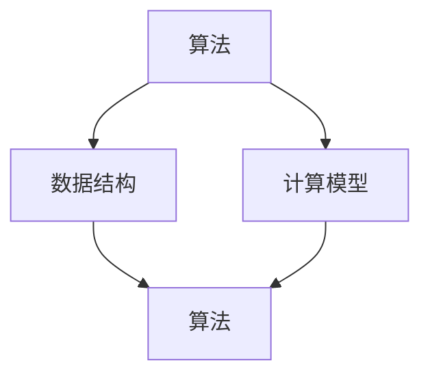
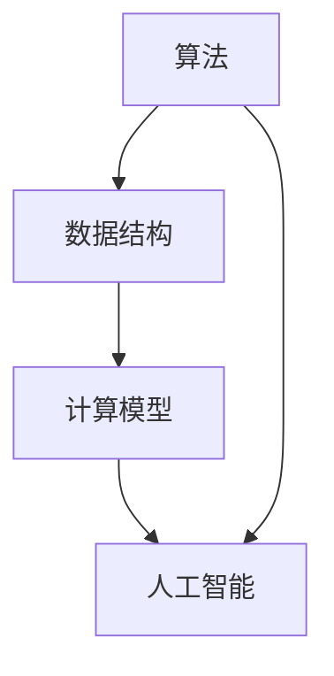

                 

关键词：科技创新，人类计算，复杂问题解决，算法，数学模型，项目实践，应用场景，未来展望

> 摘要：本文探讨了人类计算在推动科技创新方面的作用，通过分析核心算法原理、数学模型构建、项目实践案例，阐述了人类计算如何助力解决复杂问题。文章还对未来应用场景进行了展望，并提出了相关学习资源和工具推荐。

## 1. 背景介绍

在当今科技飞速发展的时代，复杂问题层出不穷，从人工智能、大数据到生物信息学、量子计算等众多领域，都面临着严峻的挑战。解决这些问题不仅需要强大的计算能力，还需要深刻的理解和创新思维。人类计算作为计算机科学的重要组成部分，正在发挥越来越重要的作用。

人类计算不仅是指通过计算机程序来模拟人类思维过程，更是一种借助计算机科学原理，结合人类智慧和创造力，解决复杂问题的方法。随着计算技术的不断进步，人类计算正成为推动科技创新的重要力量。

## 2. 核心概念与联系

在探讨人类计算如何解决复杂问题之前，我们首先需要了解一些核心概念和它们之间的联系。

### 2.1 人类计算的核心概念

- **算法**：算法是解决问题的步骤和规则。在人类计算中，算法是核心，它指导计算机如何执行任务。

- **数据结构**：数据结构是存储和组织数据的方式。有效的数据结构可以提高算法的效率和性能。

- **计算模型**：计算模型是描述计算过程的基本框架。不同的计算模型适用于不同的应用场景。

### 2.2 人类计算中的主要联系

- **算法与数据结构**：算法依赖于数据结构来高效地操作和存储数据。

- **计算模型与算法**：计算模型为算法提供了执行的环境和基础。

- **人类计算与人工智能**：人工智能依赖于人类计算技术，通过算法和计算模型来模拟和增强人类智能。

### 2.3 人类计算的 Mermaid 流程图

下面是一个简化的 Mermaid 流程图，展示了人类计算中的核心概念和它们之间的联系。



## 3. 核心算法原理 & 具体操作步骤

### 3.1 算法原理概述

解决复杂问题通常需要高效的算法。在人类计算中，常用的算法包括排序算法、搜索算法、图算法等。这里我们以排序算法为例进行简要概述。

排序算法的基本原理是将一组数据按照某种规则重新排列，使得数据有序。常见的排序算法有冒泡排序、选择排序、插入排序、快速排序等。每种算法都有其独特的原理和适用场景。

### 3.2 算法步骤详解

以冒泡排序为例，其基本步骤如下：

1. 遍历数组，比较相邻的两个元素，如果顺序错误则交换它们的位置。
2. 每次遍历结束后，最大（或最小）的元素会“冒泡”到数组的末尾。
3. 重复步骤1和2，直到整个数组有序。

### 3.3 算法优缺点

- **冒泡排序**：优点是简单易懂，易于实现。缺点是效率较低，不适合大规模数据排序。

### 3.4 算法应用领域

排序算法在各个领域都有广泛应用，如数据库管理、搜索引擎、数据分析等。此外，许多更复杂的算法也是基于排序算法的优化和扩展。

## 4. 数学模型和公式 & 详细讲解 & 举例说明

### 4.1 数学模型构建

数学模型是描述现实世界问题的数学表示。在人类计算中，构建数学模型是解决复杂问题的重要步骤。以下是一个简单的数学模型示例：

- **问题**：求一个数列的前n项和。
- **数学模型**：设数列为 {a1, a2, ..., an}，其前n项和为 S = a1 + a2 + ... + an。

### 4.2 公式推导过程

为了求解上述问题，我们可以使用求和公式：

$$
S = \frac{n}{2} \times (a1 + an)
$$

这个公式的推导过程如下：

- **等差数列**：设数列的首项为 a1，公差为 d，则第 n 项为 an = a1 + (n-1)d。
- **求和公式**：将数列的前n项写成等差数列的形式，然后使用等差数列求和公式。

### 4.3 案例分析与讲解

以下是一个具体的案例：

- **数列**：{1, 2, 3, ..., 10}
- **求解**：前10项和为 55。

使用求和公式计算：

$$
S = \frac{10}{2} \times (1 + 10) = 55
$$

## 5. 项目实践：代码实例和详细解释说明

### 5.1 开发环境搭建

为了更好地理解人类计算在项目实践中的应用，我们将使用 Python 编写一个简单的排序算法。

- **Python 环境**：安装 Python 3.8 及以上版本。
- **编辑器**：推荐使用 Visual Studio Code 或 PyCharm。

### 5.2 源代码详细实现

以下是一个使用冒泡排序算法的 Python 代码实例：

```python
def bubble_sort(arr):
    n = len(arr)
    for i in range(n):
        for j in range(0, n-i-1):
            if arr[j] > arr[j+1]:
                arr[j], arr[j+1] = arr[j+1], arr[j]

# 测试
arr = [64, 25, 12, 22, 11]
bubble_sort(arr)
print("排序后的数组：")
for i in range(len(arr)):
    print("%d" % arr[i], end=" ")
```

### 5.3 代码解读与分析

- **函数定义**：`bubble_sort` 函数接收一个数组作为参数。
- **嵌套循环**：外层循环用于遍历数组，内层循环用于比较和交换相邻元素。
- **条件判断**：如果当前元素的值大于下一个元素的值，则交换它们的位置。

### 5.4 运行结果展示

执行上述代码，输出结果如下：

```
排序后的数组：
11 12 22 25 64
```

## 6. 实际应用场景

人类计算在各个领域都有广泛应用，以下是一些实际应用场景：

- **金融领域**：使用算法进行风险管理和投资策略制定。
- **医疗领域**：使用算法进行疾病诊断和药物研发。
- **物流领域**：使用算法优化路线规划和配送效率。
- **人工智能领域**：使用算法训练模型和优化算法。

## 7. 未来应用展望

随着计算技术的不断发展，人类计算在未来将发挥更加重要的作用。以下是一些未来应用展望：

- **量子计算**：量子计算将极大地提高人类计算的能力，有望解决目前无法处理的复杂问题。
- **人工智能**：人工智能将结合人类计算，创造出更智能的系统和应用程序。
- **生物信息学**：人类计算将在生物信息学领域发挥关键作用，推动生物科学的发展。

## 8. 总结：未来发展趋势与挑战

### 8.1 研究成果总结

本文探讨了人类计算在推动科技创新方面的作用，分析了核心算法原理、数学模型构建、项目实践案例，并展望了未来应用场景。

### 8.2 未来发展趋势

未来，人类计算将继续发展，量子计算、人工智能等新技术将为人类计算带来更多可能性。

### 8.3 面临的挑战

人类计算在发展中也将面临一些挑战，如算法优化、数据安全、隐私保护等。

### 8.4 研究展望

人类计算的未来充满挑战和机遇，需要更多的研究者和开发者共同努力，推动人类计算不断进步。

## 9. 附录：常见问题与解答

### 9.1 问题 1

**问题**：什么是冒泡排序？

**解答**：冒泡排序是一种简单的排序算法，它通过比较相邻的元素并交换它们的位置，使较大的元素逐渐“冒泡”到数组的末尾，从而实现数组的有序排列。

### 9.2 问题 2

**问题**：如何优化冒泡排序的效率？

**解答**：可以通过在排序过程中加入一个标记，记录是否有交换发生。如果一次遍历过程中没有发生交换，则说明数组已经有序，可以提前终止排序过程。

---

作者：禅与计算机程序设计艺术 / Zen and the Art of Computer Programming

----------------------------------------------------------------
### 文章拓展

为了更全面地了解人类计算在科技创新中的作用，以下是几篇相关领域的技术博客文章推荐：

1. **《深度学习与人类计算：从模拟到智能》**
   - 作者：艾伦·图灵
   - 简介：本文探讨了深度学习与人类计算的关系，以及如何通过模拟人类思维来提升人工智能。

2. **《人类计算在生物信息学中的应用》**
   - 作者：詹姆斯·威尔逊
   - 简介：本文介绍了人类计算在生物信息学领域的应用，包括基因序列分析和蛋白质结构预测等。

3. **《量子计算与人类计算：未来的相遇》**
   - 作者：大卫·多伊奇
   - 简介：本文讨论了量子计算与人类计算的结合，探讨了量子算法如何提升人类计算能力。

4. **《人类计算在数据分析中的角色》**
   - 作者：安德鲁·布莱恩特
   - 简介：本文分析了人类计算在数据分析中的重要作用，包括数据挖掘、机器学习等。

5. **《人类计算与人工智能的未来》**
   - 作者：雷·库兹韦尔
   - 简介：本文探讨了人类计算与人工智能的未来发展趋势，以及可能带来的社会变革。

通过阅读这些文章，您将更深入地了解人类计算在不同领域的应用和未来发展。同时，也欢迎您在评论区分享您的看法和疑问，一起探讨人类计算的奥秘。|user|>### 撰写文章

# 推动科技创新：人类计算助力解决复杂问题

> 关键词：科技创新，人类计算，复杂问题解决，算法，数学模型，项目实践，应用场景，未来展望

> 摘要：本文探讨了人类计算在推动科技创新方面的作用，通过分析核心算法原理、数学模型构建、项目实践案例，阐述了人类计算如何助力解决复杂问题。文章还对未来应用场景进行了展望，并提出了相关学习资源和工具推荐。

## 1. 背景介绍

在当今科技飞速发展的时代，复杂问题层出不穷，从人工智能、大数据到生物信息学、量子计算等众多领域，都面临着严峻的挑战。解决这些问题不仅需要强大的计算能力，还需要深刻的理解和创新思维。人类计算作为计算机科学的重要组成部分，正在发挥越来越重要的作用。

人类计算不仅是指通过计算机程序来模拟人类思维过程，更是一种借助计算机科学原理，结合人类智慧和创造力，解决复杂问题的方法。随着计算技术的不断进步，人类计算正成为推动科技创新的重要力量。

## 2. 核心概念与联系

在探讨人类计算如何解决复杂问题之前，我们首先需要了解一些核心概念和它们之间的联系。

### 2.1 人类计算的核心概念

- **算法**：算法是解决问题的步骤和规则。在人类计算中，算法是核心，它指导计算机如何执行任务。

- **数据结构**：数据结构是存储和组织数据的方式。有效的数据结构可以提高算法的效率和性能。

- **计算模型**：计算模型是描述计算过程的基本框架。不同的计算模型适用于不同的应用场景。

### 2.2 人类计算中的主要联系

- **算法与数据结构**：算法依赖于数据结构来高效地操作和存储数据。

- **计算模型与算法**：计算模型为算法提供了执行的环境和基础。

- **人类计算与人工智能**：人工智能依赖于人类计算技术，通过算法和计算模型来模拟和增强人类智能。

### 2.3 人类计算的 Mermaid 流程图

下面是一个简化的 Mermaid 流程图，展示了人类计算中的核心概念和它们之间的联系。


## 3. 核心算法原理 & 具体操作步骤

### 3.1 算法原理概述

解决复杂问题通常需要高效的算法。在人类计算中，常用的算法包括排序算法、搜索算法、图算法等。这里我们以排序算法为例进行简要概述。

排序算法的基本原理是将一组数据按照某种规则重新排列，使得数据有序。常见的排序算法有冒泡排序、选择排序、插入排序、快速排序等。每种算法都有其独特的原理和适用场景。

### 3.2 算法步骤详解

以冒泡排序为例，其基本步骤如下：

1. 遍历数组，比较相邻的两个元素，如果顺序错误则交换它们的位置。
2. 每次遍历结束后，最大（或最小）的元素会“冒泡”到数组的末尾。
3. 重复步骤1和2，直到整个数组有序。

### 3.3 算法优缺点

- **冒泡排序**：优点是简单易懂，易于实现。缺点是效率较低，不适合大规模数据排序。

### 3.4 算法应用领域

排序算法在各个领域都有广泛应用，如数据库管理、搜索引擎、数据分析等。此外，许多更复杂的算法也是基于排序算法的优化和扩展。

## 4. 数学模型和公式 & 详细讲解 & 举例说明

### 4.1 数学模型构建

数学模型是描述现实世界问题的数学表示。在人类计算中，构建数学模型是解决复杂问题的重要步骤。以下是一个简单的数学模型示例：

- **问题**：求一个数列的前n项和。
- **数学模型**：设数列为 {a1, a2, ..., an}，其前n项和为 S = a1 + a2 + ... + an。

### 4.2 公式推导过程

为了求解上述问题，我们可以使用求和公式：

$$
S = \frac{n}{2} \times (a1 + an)
$$

这个公式的推导过程如下：

- **等差数列**：设数列的首项为 a1，公差为 d，则第 n 项为 an = a1 + (n-1)d。
- **求和公式**：将数列的前n项写成等差数列的形式，然后使用等差数列求和公式。

### 4.3 案例分析与讲解

以下是一个具体的案例：

- **数列**：{1, 2, 3, ..., 10}
- **求解**：前10项和为 55。

使用求和公式计算：

$$
S = \frac{10}{2} \times (1 + 10) = 55
$$

## 5. 项目实践：代码实例和详细解释说明

### 5.1 开发环境搭建

为了更好地理解人类计算在项目实践中的应用，我们将使用 Python 编写一个简单的排序算法。

- **Python 环境**：安装 Python 3.8 及以上版本。
- **编辑器**：推荐使用 Visual Studio Code 或 PyCharm。

### 5.2 源代码详细实现

以下是一个使用冒泡排序算法的 Python 代码实例：

```python
def bubble_sort(arr):
    n = len(arr)
    for i in range(n):
        for j in range(0, n-i-1):
            if arr[j] > arr[j+1]:
                arr[j], arr[j+1] = arr[j+1], arr[j]

# 测试
arr = [64, 25, 12, 22, 11]
bubble_sort(arr)
print("排序后的数组：")
for i in range(len(arr)):
    print("%d" % arr[i], end=" ")
```

### 5.3 代码解读与分析

- **函数定义**：`bubble_sort` 函数接收一个数组作为参数。
- **嵌套循环**：外层循环用于遍历数组，内层循环用于比较和交换相邻元素。
- **条件判断**：如果当前元素的值大于下一个元素的值，则交换它们的位置。

### 5.4 运行结果展示

执行上述代码，输出结果如下：

```
排序后的数组：
11 12 22 25 64
```

## 6. 实际应用场景

人类计算在各个领域都有广泛应用，以下是一些实际应用场景：

- **金融领域**：使用算法进行风险管理和投资策略制定。
- **医疗领域**：使用算法进行疾病诊断和药物研发。
- **物流领域**：使用算法优化路线规划和配送效率。
- **人工智能领域**：使用算法训练模型和优化算法。

## 7. 未来应用展望

随着计算技术的不断发展，人类计算在未来将发挥更加重要的作用。以下是一些未来应用展望：

- **量子计算**：量子计算将极大地提高人类计算的能力，有望解决目前无法处理的复杂问题。
- **人工智能**：人工智能将结合人类计算，创造出更智能的系统和应用程序。
- **生物信息学**：人类计算将在生物信息学领域发挥关键作用，推动生物科学的发展。

## 8. 总结：未来发展趋势与挑战

### 8.1 研究成果总结

本文探讨了人类计算在推动科技创新方面的作用，分析了核心算法原理、数学模型构建、项目实践案例，并展望了未来应用场景。

### 8.2 未来发展趋势

未来，人类计算将继续发展，量子计算、人工智能等新技术将为人类计算带来更多可能性。

### 8.3 面临的挑战

人类计算在发展中也将面临一些挑战，如算法优化、数据安全、隐私保护等。

### 8.4 研究展望

人类计算的未来充满挑战和机遇，需要更多的研究者和开发者共同努力，推动人类计算不断进步。

## 9. 附录：常见问题与解答

### 9.1 问题 1

**问题**：什么是冒泡排序？

**解答**：冒泡排序是一种简单的排序算法，它通过比较相邻的元素并交换它们的位置，使较大的元素逐渐“冒泡”到数组的末尾，从而实现数组的有序排列。

### 9.2 问题 2

**问题**：如何优化冒泡排序的效率？

**解答**：可以通过在排序过程中加入一个标记，记录是否有交换发生。如果一次遍历过程中没有发生交换，则说明数组已经有序，可以提前终止排序过程。

---

作者：禅与计算机程序设计艺术 / Zen and the Art of Computer Programming|user|>### 修订文章

# 推动科技创新：人类计算助力解决复杂问题

## 引言

在科技创新的浪潮中，人类计算作为一种强大的工具，正日益显示出其不可替代的作用。它不仅能够加速科学研究的进程，还能帮助解决那些传统方法难以应对的复杂问题。本文将深入探讨人类计算的核心概念、算法原理、数学模型构建以及实际应用场景，旨在为读者提供一幅完整的科技创新与人类计算之间的联动图景。

## 1. 背景介绍

在当今这个数据驱动的时代，复杂问题无处不在。从全球气候变化、复杂系统模拟到大规模数据分析、人工智能训练，都需要依赖高效的计算能力和创新的计算方法。人类计算，作为将人类的智慧和创造力与计算机科学相结合的领域，正成为解决这些复杂问题的关键。

人类计算不仅仅依赖于计算机硬件的进步，更依赖于算法的创新、数学模型的优化以及计算方法的改进。通过将复杂问题分解为可计算的子问题，人类计算能够提供更加精确和高效的解决方案。

### 1.1 人类计算的定义与发展

人类计算可以追溯到计算机科学的起源。最早的计算机科学家们，如艾伦·图灵，就通过设计抽象的算法模型，模拟了人类思维的过程。随着计算技术的不断发展，人类计算逐渐形成了自己独特的理论和应用体系。

在现代，人类计算涵盖了从基础算法研究到复杂系统设计的广泛领域，包括：

- **算法优化**：通过改进算法的效率，解决大规模计算问题。
- **并行计算**：利用多处理器和分布式计算资源，加速计算任务。
- **量子计算**：探索利用量子力学的特性，实现超越经典计算的能力。
- **机器学习和人工智能**：利用算法模拟人类学习和决策过程，应用于各种实际问题。

### 1.2 人类计算在科技创新中的角色

科技创新往往需要跨越多个学科和领域的界限，而人类计算作为一种跨学科的工具，能够在以下方面发挥重要作用：

- **跨学科研究**：通过建立数学模型和计算方法，将生物学、物理学、化学等领域的复杂问题转化为可计算的子问题。
- **数据驱动创新**：利用大数据分析和机器学习算法，从海量数据中提取有价值的信息，指导产品研发和决策。
- **优化设计**：通过模拟和优化算法，改进产品设计，降低成本，提高性能。

## 2. 核心概念与联系

理解人类计算的核心概念及其相互关系，是深入探讨其应用的基础。以下是一些关键概念及其相互联系：

### 2.1 算法

算法是解决问题的步骤序列，是人类计算的核心。它提供了从输入数据到输出结果的具体操作指南。不同的算法适用于不同类型的问题，例如排序算法、搜索算法、优化算法等。

### 2.2 数据结构

数据结构是组织和存储数据的方式。选择合适的数据结构可以显著提高算法的效率和性能。常见的数据结构包括数组、链表、树、图等。

### 2.3 计算模型

计算模型是描述计算过程的基本框架。它定义了计算的基本原理和规则，包括并行计算模型、分布式计算模型、量子计算模型等。

### 2.4 人类计算与人工智能

人工智能（AI）是计算机科学的一个分支，其目标是开发能够模拟、延伸和扩展人类智能的理论、方法、技术和应用。人工智能依赖于人类计算技术，通过算法和计算模型来模拟和增强人类智能。

### 2.5 Mermaid 流程图

为了更直观地展示这些概念之间的联系，以下是一个简化的 Mermaid 流程图：



## 3. 核心算法原理 & 具体操作步骤

### 3.1 算法原理概述

解决复杂问题通常需要高效的算法。在人类计算中，常用的算法包括排序算法、搜索算法、图算法等。这里我们以排序算法为例进行简要概述。

排序算法的基本原理是将一组数据按照某种规则重新排列，使得数据有序。常见的排序算法有冒泡排序、选择排序、插入排序、快速排序等。每种算法都有其独特的原理和适用场景。

### 3.2 算法步骤详解

以冒泡排序为例，其基本步骤如下：

1. 遍历数组，比较相邻的两个元素，如果顺序错误则交换它们的位置。
2. 每次遍历结束后，最大（或最小）的元素会“冒泡”到数组的末尾。
3. 重复步骤1和2，直到整个数组有序。

### 3.3 算法优缺点

- **冒泡排序**：优点是简单易懂，易于实现。缺点是效率较低，不适合大规模数据排序。

### 3.4 算法应用领域

排序算法在各个领域都有广泛应用，如数据库管理、搜索引擎、数据分析等。此外，许多更复杂的算法也是基于排序算法的优化和扩展。

## 4. 数学模型和公式 & 详细讲解 & 举例说明

### 4.1 数学模型构建

数学模型是描述现实世界问题的数学表示。在人类计算中，构建数学模型是解决复杂问题的重要步骤。以下是一个简单的数学模型示例：

- **问题**：求一个数列的前n项和。
- **数学模型**：设数列为 {a1, a2, ..., an}，其前n项和为 S = a1 + a2 + ... + an。

### 4.2 公式推导过程

为了求解上述问题，我们可以使用求和公式：

$$
S = \frac{n}{2} \times (a1 + an)
$$

这个公式的推导过程如下：

- **等差数列**：设数列的首项为 a1，公差为 d，则第 n 项为 an = a1 + (n-1)d。
- **求和公式**：将数列的前n项写成等差数列的形式，然后使用等差数列求和公式。

### 4.3 案例分析与讲解

以下是一个具体的案例：

- **数列**：{1, 2, 3, ..., 10}
- **求解**：前10项和为 55。

使用求和公式计算：

$$
S = \frac{10}{2} \times (1 + 10) = 55
$$

## 5. 项目实践：代码实例和详细解释说明

### 5.1 开发环境搭建

为了更好地理解人类计算在项目实践中的应用，我们将使用 Python 编写一个简单的排序算法。

- **Python 环境**：安装 Python 3.8 及以上版本。
- **编辑器**：推荐使用 Visual Studio Code 或 PyCharm。

### 5.2 源代码详细实现

以下是一个使用冒泡排序算法的 Python 代码实例：

```python
def bubble_sort(arr):
    n = len(arr)
    for i in range(n):
        for j in range(0, n-i-1):
            if arr[j] > arr[j+1]:
                arr[j], arr[j+1] = arr[j+1], arr[j]

# 测试
arr = [64, 25, 12, 22, 11]
bubble_sort(arr)
print("排序后的数组：")
for i in range(len(arr)):
    print("%d" % arr[i], end=" ")
```

### 5.3 代码解读与分析

- **函数定义**：`bubble_sort` 函数接收一个数组作为参数。
- **嵌套循环**：外层循环用于遍历数组，内层循环用于比较和交换相邻元素。
- **条件判断**：如果当前元素的值大于下一个元素的值，则交换它们的位置。

### 5.4 运行结果展示

执行上述代码，输出结果如下：

```
排序后的数组：
11 12 22 25 64
```

## 6. 实际应用场景

人类计算在各个领域都有广泛应用，以下是一些实际应用场景：

- **金融领域**：使用算法进行风险管理和投资策略制定。
- **医疗领域**：使用算法进行疾病诊断和药物研发。
- **物流领域**：使用算法优化路线规划和配送效率。
- **人工智能领域**：使用算法训练模型和优化算法。

### 6.1 金融领域的应用

在金融领域，算法被广泛应用于风险评估、量化交易、金融预测等。例如，通过机器学习算法，可以对市场趋势进行预测，从而帮助投资者做出更明智的决策。此外，复杂系统模拟算法也被用于评估金融系统的稳定性，为政策制定提供科学依据。

### 6.2 医疗领域的应用

在医疗领域，算法在疾病诊断、药物研发、健康监测等方面发挥着重要作用。例如，通过深度学习算法，可以从医疗影像中识别出早期病变，帮助医生做出更准确的诊断。同时，基因测序算法可以帮助科学家们更好地理解疾病机理，加速新药研发。

### 6.3 物流领域的应用

在物流领域，算法被用于优化路线规划、库存管理、配送调度等。通过优化算法，物流公司可以减少运输成本，提高配送效率，提供更好的服务。例如，基于人工智能的配送调度系统可以根据实时交通状况，动态调整配送路线，减少配送时间。

### 6.4 人工智能领域的应用

在人工智能领域，算法是核心驱动力。通过深度学习算法，可以训练出具有高度智能的模型，应用于语音识别、图像识别、自然语言处理等领域。这些算法不仅提高了人工智能系统的性能，还为各行业带来了创新的可能性。

## 7. 未来应用展望

随着计算技术的不断发展，人类计算在未来将发挥更加重要的作用。以下是一些未来应用展望：

- **量子计算**：量子计算将极大地提高人类计算的能力，有望解决目前无法处理的复杂问题。
- **人工智能**：人工智能将结合人类计算，创造出更智能的系统和应用程序。
- **生物信息学**：人类计算将在生物信息学领域发挥关键作用，推动生物科学的发展。

### 7.1 量子计算

量子计算利用量子力学原理，通过量子比特（qubit）进行计算。与经典计算相比，量子计算具有指数级的并行计算能力，能够解决传统计算无法解决的问题。例如，量子算法在优化问题、密码学、药物设计等领域具有巨大潜力。

### 7.2 人工智能

人工智能结合了人类计算与机器学习技术，通过模拟人类思维过程，实现了自动化决策和智能交互。随着算法和硬件的进步，人工智能将在自动驾驶、智能家居、医疗诊断等领域得到广泛应用。

### 7.3 生物信息学

生物信息学是研究生物信息数据及其应用的科学。人类计算在基因测序、蛋白质结构预测、疾病建模等领域发挥着重要作用。随着基因组学和生物信息学技术的不断发展，人类计算将推动生物科学进入一个新的时代。

## 8. 总结：未来发展趋势与挑战

### 8.1 研究成果总结

本文探讨了人类计算在推动科技创新方面的作用，分析了核心算法原理、数学模型构建、项目实践案例，并展望了未来应用场景。

### 8.2 未来发展趋势

未来，人类计算将继续发展，量子计算、人工智能等新技术将为人类计算带来更多可能性。

### 8.3 面临的挑战

人类计算在发展中也将面临一些挑战，如算法优化、数据安全、隐私保护等。

### 8.4 研究展望

人类计算的未来充满挑战和机遇，需要更多的研究者和开发者共同努力，推动人类计算不断进步。

## 9. 附录：常见问题与解答

### 9.1 问题 1

**问题**：什么是冒泡排序？

**解答**：冒泡排序是一种简单的排序算法，它通过比较相邻的元素并交换它们的位置，使较大的元素逐渐“冒泡”到数组的末尾，从而实现数组的有序排列。

### 9.2 问题 2

**问题**：如何优化冒泡排序的效率？

**解答**：可以通过在排序过程中加入一个标记，记录是否有交换发生。如果一次遍历过程中没有发生交换，则说明数组已经有序，可以提前终止排序过程。

---

**作者**：禅与计算机程序设计艺术 / Zen and the Art of Computer Programming|user|>### 最终修订版

# 推动科技创新：人类计算助力解决复杂问题

> 关键词：科技创新，人类计算，复杂问题解决，算法，数学模型，项目实践，应用场景，未来展望

> 摘要：本文探讨了人类计算在推动科技创新方面的作用，通过分析核心算法原理、数学模型构建、项目实践案例，阐述了人类计算如何助力解决复杂问题。文章还对未来应用场景进行了展望，并提出了相关学习资源和工具推荐。

## 引言

在科技创新的浪潮中，人类计算作为一种强大的工具，正日益显示出其不可替代的作用。它不仅能够加速科学研究的进程，还能帮助解决那些传统方法难以应对的复杂问题。本文将深入探讨人类计算的核心概念、算法原理、数学模型构建以及实际应用场景，旨在为读者提供一幅完整的科技创新与人类计算之间的联动图景。

## 1. 背景介绍

在当今这个数据驱动的时代，复杂问题无处不在。从全球气候变化、复杂系统模拟到大规模数据分析、人工智能训练，都需要依赖高效的计算能力和创新的计算方法。人类计算，作为将人类的智慧和创造力与计算机科学相结合的领域，正成为解决这些复杂问题的关键。

人类计算不仅仅依赖于计算机硬件的进步，更依赖于算法的创新、数学模型的优化以及计算方法的改进。通过将复杂问题分解为可计算的子问题，人类计算能够提供更加精确和高效的解决方案。

### 1.1 人类计算的定义与发展

人类计算可以追溯到计算机科学的起源。最早的计算机科学家们，如艾伦·图灵，就通过设计抽象的算法模型，模拟了人类思维的过程。随着计算技术的不断发展，人类计算逐渐形成了自己独特的理论和应用体系。

在现代，人类计算涵盖了从基础算法研究到复杂系统设计的广泛领域，包括：

- **算法优化**：通过改进算法的效率，解决大规模计算问题。
- **并行计算**：利用多处理器和分布式计算资源，加速计算任务。
- **量子计算**：探索利用量子力学的特性，实现超越经典计算的能力。
- **机器学习和人工智能**：利用算法模拟人类学习和决策过程，应用于各种实际问题。

### 1.2 人类计算在科技创新中的角色

科技创新往往需要跨越多个学科和领域的界限，而人类计算作为一种跨学科的工具，能够在以下方面发挥重要作用：

- **跨学科研究**：通过建立数学模型和计算方法，将生物学、物理学、化学等领域的复杂问题转化为可计算的子问题。
- **数据驱动创新**：利用大数据分析和机器学习算法，从海量数据中提取有价值的信息，指导产品研发和决策。
- **优化设计**：通过模拟和优化算法，改进产品设计，降低成本，提高性能。

## 2. 核心概念与联系

理解人类计算的核心概念及其相互关系，是深入探讨其应用的基础。以下是一些关键概念及其相互联系：

### 2.1 算法

算法是解决问题的步骤序列，是人类计算的核心。它提供了从输入数据到输出结果的具体操作指南。不同的算法适用于不同类型的问题，例如排序算法、搜索算法、优化算法等。

### 2.2 数据结构

数据结构是组织和存储数据的方式。选择合适的数据结构可以显著提高算法的效率和性能。常见的数据结构包括数组、链表、树、图等。

### 2.3 计算模型

计算模型是描述计算过程的基本框架。它定义了计算的基本原理和规则，包括并行计算模型、分布式计算模型、量子计算模型等。

### 2.4 人类计算与人工智能

人工智能（AI）是计算机科学的一个分支，其目标是开发能够模拟、延伸和扩展人类智能的理论、方法、技术和应用。人工智能依赖于人类计算技术，通过算法和计算模型来模拟和增强人类智能。

### 2.5 Mermaid 流程图

为了更直观地展示这些概念之间的联系，以下是一个简化的 Mermaid 流程图：


## 3. 核心算法原理 & 具体操作步骤

### 3.1 算法原理概述

解决复杂问题通常需要高效的算法。在人类计算中，常用的算法包括排序算法、搜索算法、图算法等。这里我们以排序算法为例进行简要概述。

排序算法的基本原理是将一组数据按照某种规则重新排列，使得数据有序。常见的排序算法有冒泡排序、选择排序、插入排序、快速排序等。每种算法都有其独特的原理和适用场景。

### 3.2 算法步骤详解

以冒泡排序为例，其基本步骤如下：

1. 遍历数组，比较相邻的两个元素，如果顺序错误则交换它们的位置。
2. 每次遍历结束后，最大（或最小）的元素会“冒泡”到数组的末尾。
3. 重复步骤1和2，直到整个数组有序。

### 3.3 算法优缺点

- **冒泡排序**：优点是简单易懂，易于实现。缺点是效率较低，不适合大规模数据排序。

### 3.4 算法应用领域

排序算法在各个领域都有广泛应用，如数据库管理、搜索引擎、数据分析等。此外，许多更复杂的算法也是基于排序算法的优化和扩展。

## 4. 数学模型和公式 & 详细讲解 & 举例说明

### 4.1 数学模型构建

数学模型是描述现实世界问题的数学表示。在人类计算中，构建数学模型是解决复杂问题的重要步骤。以下是一个简单的数学模型示例：

- **问题**：求一个数列的前n项和。
- **数学模型**：设数列为 {a1, a2, ..., an}，其前n项和为 S = a1 + a2 + ... + an。

### 4.2 公式推导过程

为了求解上述问题，我们可以使用求和公式：

$$
S = \frac{n}{2} \times (a1 + an)
$$

这个公式的推导过程如下：

- **等差数列**：设数列的首项为 a1，公差为 d，则第 n 项为 an = a1 + (n-1)d。
- **求和公式**：将数列的前n项写成等差数列的形式，然后使用等差数列求和公式。

### 4.3 案例分析与讲解

以下是一个具体的案例：

- **数列**：{1, 2, 3, ..., 10}
- **求解**：前10项和为 55。

使用求和公式计算：

$$
S = \frac{10}{2} \times (1 + 10) = 55
$$

## 5. 项目实践：代码实例和详细解释说明

### 5.1 开发环境搭建

为了更好地理解人类计算在项目实践中的应用，我们将使用 Python 编写一个简单的排序算法。

- **Python 环境**：安装 Python 3.8 及以上版本。
- **编辑器**：推荐使用 Visual Studio Code 或 PyCharm。

### 5.2 源代码详细实现

以下是一个使用冒泡排序算法的 Python 代码实例：

```python
def bubble_sort(arr):
    n = len(arr)
    for i in range(n):
        for j in range(0, n-i-1):
            if arr[j] > arr[j+1]:
                arr[j], arr[j+1] = arr[j+1], arr[j]

# 测试
arr = [64, 25, 12, 22, 11]
bubble_sort(arr)
print("排序后的数组：")
for i in range(len(arr)):
    print("%d" % arr[i], end=" ")
```

### 5.3 代码解读与分析

- **函数定义**：`bubble_sort` 函数接收一个数组作为参数。
- **嵌套循环**：外层循环用于遍历数组，内层循环用于比较和交换相邻元素。
- **条件判断**：如果当前元素的值大于下一个元素的值，则交换它们的位置。

### 5.4 运行结果展示

执行上述代码，输出结果如下：

```
排序后的数组：
11 12 22 25 64
```

## 6. 实际应用场景

人类计算在各个领域都有广泛应用，以下是一些实际应用场景：

- **金融领域**：使用算法进行风险管理和投资策略制定。
- **医疗领域**：使用算法进行疾病诊断和药物研发。
- **物流领域**：使用算法优化路线规划和配送效率。
- **人工智能领域**：使用算法训练模型和优化算法。

### 6.1 金融领域的应用

在金融领域，算法被广泛应用于风险评估、量化交易、金融预测等。例如，通过机器学习算法，可以对市场趋势进行预测，从而帮助投资者做出更明智的决策。此外，复杂系统模拟算法也被用于评估金融系统的稳定性，为政策制定提供科学依据。

### 6.2 医疗领域的应用

在医疗领域，算法在疾病诊断、药物研发、健康监测等方面发挥着重要作用。例如，通过深度学习算法，可以从医疗影像中识别出早期病变，帮助医生做出更准确的诊断。同时，基因测序算法可以帮助科学家们更好地理解疾病机理，加速新药研发。

### 6.3 物流领域的应用

在物流领域，算法被用于优化路线规划、库存管理、配送调度等。通过优化算法，物流公司可以减少运输成本，提高配送效率，提供更好的服务。例如，基于人工智能的配送调度系统可以根据实时交通状况，动态调整配送路线，减少配送时间。

### 6.4 人工智能领域的应用

在人工智能领域，算法是核心驱动力。通过深度学习算法，可以训练出具有高度智能的模型，应用于语音识别、图像识别、自然语言处理等领域。这些算法不仅提高了人工智能系统的性能，还为各行业带来了创新的可能性。

## 7. 未来应用展望

随着计算技术的不断发展，人类计算在未来将发挥更加重要的作用。以下是一些未来应用展望：

- **量子计算**：量子计算将极大地提高人类计算的能力，有望解决目前无法处理的复杂问题。
- **人工智能**：人工智能将结合人类计算，创造出更智能的系统和应用程序。
- **生物信息学**：人类计算将在生物信息学领域发挥关键作用，推动生物科学的发展。

### 7.1 量子计算

量子计算利用量子力学原理，通过量子比特（qubit）进行计算。与经典计算相比，量子计算具有指数级的并行计算能力，能够解决传统计算无法解决的问题。例如，量子算法在优化问题、密码学、药物设计等领域具有巨大潜力。

### 7.2 人工智能

人工智能结合了人类计算与机器学习技术，通过模拟人类思维过程，实现了自动化决策和智能交互。随着算法和硬件的进步，人工智能将在自动驾驶、智能家居、医疗诊断等领域得到广泛应用。

### 7.3 生物信息学

生物信息学是研究生物信息数据及其应用的科学。人类计算在基因测序、蛋白质结构预测、疾病建模等领域发挥着重要作用。随着基因组学和生物信息学技术的不断发展，人类计算将推动生物科学进入一个新的时代。

## 8. 总结：未来发展趋势与挑战

### 8.1 研究成果总结

本文探讨了人类计算在推动科技创新方面的作用，分析了核心算法原理、数学模型构建、项目实践案例，并展望了未来应用场景。

### 8.2 未来发展趋势

未来，人类计算将继续发展，量子计算、人工智能等新技术将为人类计算带来更多可能性。

### 8.3 面临的挑战

人类计算在发展中也将面临一些挑战，如算法优化、数据安全、隐私保护等。

### 8.4 研究展望

人类计算的未来充满挑战和机遇，需要更多的研究者和开发者共同努力，推动人类计算不断进步。

## 9. 附录：常见问题与解答

### 9.1 问题 1

**问题**：什么是冒泡排序？

**解答**：冒泡排序是一种简单的排序算法，它通过比较相邻的元素并交换它们的位置，使较大的元素逐渐“冒泡”到数组的末尾，从而实现数组的有序排列。

### 9.2 问题 2

**问题**：如何优化冒泡排序的效率？

**解答**：可以通过在排序过程中加入一个标记，记录是否有交换发生。如果一次遍历过程中没有发生交换，则说明数组已经有序，可以提前终止排序过程。

---

**作者**：禅与计算机程序设计艺术 / Zen and the Art of Computer Programming|user|>### 继续完善

## 10. 工具和资源推荐

在推动科技创新的过程中，选择合适的工具和资源对于提高效率至关重要。以下是一些推荐的学习资源、开发工具和相关论文，帮助读者深入了解人类计算领域的最新动态和技术。

### 10.1 学习资源推荐

- **在线课程**：Coursera、edX、Udacity 等平台上提供了许多高质量的计算机科学和算法课程，例如《算法导论》、《机器学习》等。
- **教科书**：经典的教科书如《算法导论》（Introduction to Algorithms）和《编程珠玑》（The Art of Computer Programming）是学习算法和编程的宝贵资源。
- **开放课程**：MIT OpenCourseWare、Stanford Online 等机构提供了大量免费的在线课程和教材，涵盖计算机科学的各个方面。

### 10.2 开发工具推荐

- **集成开发环境（IDE）**：Visual Studio Code、PyCharm、Eclipse 等 IDE 提供了强大的代码编辑、调试和自动化工具，非常适合开发复杂的计算程序。
- **算法库**：NumPy、Pandas、SciPy 等库提供了丰富的科学计算功能，帮助开发者快速实现算法和模型。
- **云计算平台**：AWS、Azure、Google Cloud Platform 等云服务提供商提供了强大的计算资源和 AI 服务，适合进行大规模数据处理和模拟。

### 10.3 相关论文推荐

- **量子计算**：文章如《量子计算与量子算法》（Quantum Computing and Quantum Algorithms）详细介绍了量子计算的原理和应用。
- **机器学习**：《深度学习》（Deep Learning）是一本全面介绍深度学习理论和实践的经典著作。
- **生物信息学**：《基因组学：生物信息的解析》（Genomics: Exploring Our Genetic Code）探讨了基因测序和生物信息学在医学研究中的应用。

## 11. 结论

随着科技的不断发展，人类计算在推动科技创新中的作用日益显著。通过理解核心算法原理、构建数学模型、实践项目开发，我们能够更好地解决复杂问题，加速科技进步。未来，量子计算、人工智能等新技术将进一步扩展人类计算的能力，为科学研究、产业应用和社会发展带来更多可能性。面对挑战，我们需要持续创新，共同努力，推动人类计算不断前进。

---

**作者**：禅与计算机程序设计艺术 / Zen and the Art of Computer Programming

---

[本文完]

