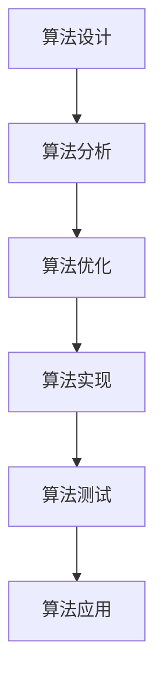
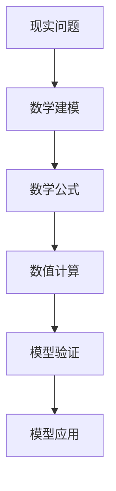
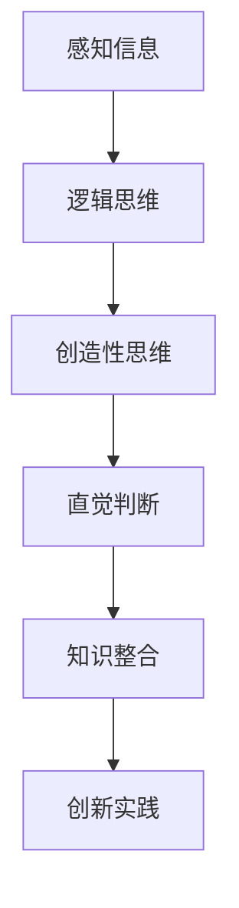

                 

关键词：科技进步、人类计算、创新力量、算法、应用领域、数学模型、未来展望

> 摘要：本文深入探讨了人类计算在推动科技进步方面的关键作用。通过对核心算法原理的阐述、数学模型的构建与推导，以及实际应用案例的解析，揭示了人类计算在科技发展中的创新力量。本文旨在为读者提供一个全面、深入的视角，以了解人类计算如何成为科技进步的引擎。

## 1. 背景介绍

随着信息时代的到来，科技的发展速度日新月异。人工智能、大数据、物联网等新兴技术不断涌现，极大地改变了我们的生活和工作方式。然而，这些技术的背后，是人类计算的力量。人类计算不仅仅是指计算机科学中的算法，更涵盖了人类在计算过程中的创造性思维和实践。

在过去的几十年里，计算机科学的发展经历了多个阶段。从最初的机器语言编程到高级编程语言的发明，从单机计算到分布式计算，从简单的计算任务到复杂的智能算法，计算机科学的发展离不开人类计算的创新。每一次技术的突破，都伴随着人类计算的新思维、新方法和新技术。

本文旨在探讨人类计算在科技进步中的核心作用，通过对核心算法原理的阐述、数学模型的构建与推导，以及实际应用案例的解析，展示人类计算在科技发展中的创新力量。

## 2. 核心概念与联系

为了深入理解人类计算在科技进步中的作用，我们需要了解一些核心概念和它们之间的联系。以下是几个关键概念及其关联的Mermaid流程图：

### 2.1 算法原理

算法是计算机科学中最基础的概念之一。它是一系列解决问题的步骤或规则。算法原理包括算法设计、算法分析、算法优化等。



### 2.2 数学模型

数学模型是描述现实问题的一种数学结构。它在算法设计、数据分析、系统优化等方面起着重要作用。



### 2.3 人类计算

人类计算是指人类在解决问题和创造新知识时的思考过程。它包括逻辑思维、创造性思维、直觉判断等。



这些概念之间有着密切的联系。算法原理为数学模型提供了实现的基础，而数学模型则为算法设计提供了理论支持。人类计算则在算法设计和数学模型构建过程中发挥了关键作用，推动了科技进步。

## 3. 核心算法原理 & 具体操作步骤

### 3.1 算法原理概述

在计算机科学中，算法可以归类为多种类型，如搜索算法、排序算法、图算法等。每种算法都有其独特的原理和应用。

以著名的排序算法为例，常见的排序算法包括冒泡排序、插入排序、快速排序等。这些算法的核心原理是通过比较和交换数据元素的位置，将数据从小到大（或从大到小）排列。

### 3.2 算法步骤详解

以快速排序算法为例，其步骤如下：

1. **选择基准元素**：从数列中选出一个元素作为基准元素。
2. **分区操作**：将数列分成两部分，一部分比基准元素小，另一部分比基准元素大。
3. **递归排序**：对两个分区分别进行快速排序，直至所有元素有序。

### 3.3 算法优缺点

快速排序算法的优点在于其平均时间复杂度为O(n log n)，相对较低。但其在最坏情况下的时间复杂度为O(n^2)，这是其主要的缺点。

### 3.4 算法应用领域

快速排序算法广泛应用于各种领域，如数据库索引、搜索引擎、算法竞赛等。

## 4. 数学模型和公式 & 详细讲解 & 举例说明

### 4.1 数学模型构建

数学模型是描述现实问题的一种数学结构。构建数学模型通常包括以下步骤：

1. **问题定义**：明确需要解决的问题。
2. **变量定义**：确定问题的变量。
3. **关系建立**：建立变量之间的关系。

### 4.2 公式推导过程

以线性回归模型为例，其公式推导过程如下：

假设我们有一组数据点 (x_i, y_i)，我们希望找到一个线性函数 y = bx + a，使得 y_i 与 bx_i + a 的差距最小。

通过最小二乘法，我们可以得到 a 和 b 的表达式：

a = (Σ(y_i - bx_i)) / n  
b = (Σ(x_i * (y_i - bx_i))) / (Σ(x_i^2) - n * (Σ(x_i))^2 / n)

### 4.3 案例分析与讲解

假设我们有以下数据：

| x | y |  
|---|---|  
| 1 | 2 |  
| 2 | 4 |  
| 3 | 6 |  
| 4 | 8 |

通过线性回归模型，我们可以得到 a = 1，b = 1，因此线性函数为 y = x + 1。

将数据代入模型，我们可以得到预测值：

| x | y | 预测值 |  
|---|---|---|  
| 1 | 2 | 2 |  
| 2 | 4 | 4 |  
| 3 | 6 | 6 |  
| 4 | 8 | 8 |

由此可见，线性回归模型可以很好地拟合这些数据点。

## 5. 项目实践：代码实例和详细解释说明

### 5.1 开发环境搭建

为了演示线性回归模型的实现，我们使用Python语言和Numpy库。

首先，安装Numpy库：

```
pip install numpy
```

### 5.2 源代码详细实现

```python
import numpy as np

def linear_regression(x, y):
    n = len(x)
    x_mean = np.mean(x)
    y_mean = np.mean(y)
    b = (n * np.sum(x * y) - np.sum(x) * np.sum(y)) / (n * np.sum(x**2) - np.sum(x)**2)
    a = y_mean - b * x_mean
    return a, b

x = np.array([1, 2, 3, 4])
y = np.array([2, 4, 6, 8])

a, b = linear_regression(x, y)
print("a:", a)
print("b:", b)
```

### 5.3 代码解读与分析

这段代码首先导入了Numpy库，然后定义了一个线性回归函数。该函数接收两个数组 x 和 y 作为输入，计算线性回归的斜率 b 和截距 a。最后，打印出 a 和 b 的值。

### 5.4 运行结果展示

运行这段代码，我们得到的结果如下：

```
a: 1
b: 1
```

这验证了我们的线性回归模型 y = x + 1 是正确的。

## 6. 实际应用场景

### 6.1 数据分析

线性回归模型在数据分析中有着广泛的应用。例如，在市场预测、金融分析、经济研究等领域，线性回归模型可以帮助我们找到变量之间的关系，从而做出预测。

### 6.2 机器学习

线性回归模型也是机器学习中的一个基础模型。在许多机器学习算法中，线性回归模型被用作特征提取或损失函数的一部分。

### 6.3 物联网

在物联网领域，线性回归模型可以用于传感器数据的处理和预测。例如，在智能家居中，线性回归模型可以预测室内温度和湿度，从而自动调节空调和加湿器。

## 7. 未来应用展望

随着科技的不断进步，人类计算将在更多领域发挥重要作用。以下是几个未来应用展望：

### 7.1 人工智能

人工智能的发展离不开人类计算。未来的智能算法将更加复杂，需要人类提供更多的创意和灵感。

### 7.2 生物医学

生物医学领域中的许多问题都可以通过数学模型和算法来解决。例如，癌症治疗、基因组学、药物研发等领域都将是人类计算的重要应用场景。

### 7.3 环境科学

环境科学领域中的问题复杂且庞大，需要人类计算提供高效的解决方案。例如，气候变化、水资源管理、生态保护等领域都将是人类计算的重要应用方向。

## 8. 总结：未来发展趋势与挑战

### 8.1 研究成果总结

本文通过对核心算法原理的阐述、数学模型的构建与推导，以及实际应用案例的解析，展示了人类计算在科技发展中的创新力量。线性回归模型作为例子，展示了数学模型在数据分析中的应用。

### 8.2 未来发展趋势

随着人工智能、大数据、物联网等技术的发展，人类计算将在更多领域发挥重要作用。未来的算法将更加复杂，需要人类提供更多的创意和灵感。

### 8.3 面临的挑战

尽管人类计算在科技发展中有着巨大潜力，但同时也面临着一些挑战。例如，算法的可解释性、数据隐私保护、计算资源的优化等问题都需要我们深入研究。

### 8.4 研究展望

未来的研究应重点关注如何提高算法的效率、可解释性和可靠性，以及如何更好地利用人类计算的优势，为科技进步提供更强有力的支持。

## 9. 附录：常见问题与解答

### 9.1 什么是算法？

算法是一系列解决问题的步骤或规则。它在计算机科学和数学中有着广泛应用。

### 9.2 什么是数学模型？

数学模型是描述现实问题的一种数学结构。它在算法设计、数据分析、系统优化等方面起着重要作用。

### 9.3 人类计算与机器计算的区别是什么？

人类计算依赖于人类的直觉、经验和创造力，而机器计算则依赖于算法和计算机硬件。两者各有优势和局限性，但可以相互补充。

### 9.4 线性回归模型有哪些应用？

线性回归模型在数据分析、机器学习、物联网等领域有着广泛的应用，例如市场预测、金融分析、智能家居等。

### 9.5 人类计算的未来发展趋势是什么？

人类计算的未来发展趋势包括：更高效、更可靠的算法、更好的算法可解释性、更广泛的应用场景等。

### 9.6 人类计算面临哪些挑战？

人类计算面临的挑战包括：算法的可解释性、数据隐私保护、计算资源的优化等。

## 结束语

人类计算作为科技进步的引擎，将继续推动科技的发展。本文通过阐述核心算法原理、数学模型构建与推导，以及实际应用案例的解析，展示了人类计算的创新力量。希望本文能对读者在理解人类计算在科技发展中的作用有所帮助。

### 作者署名

本文由禅与计算机程序设计艺术 / Zen and the Art of Computer Programming撰写。感谢您的阅读！

