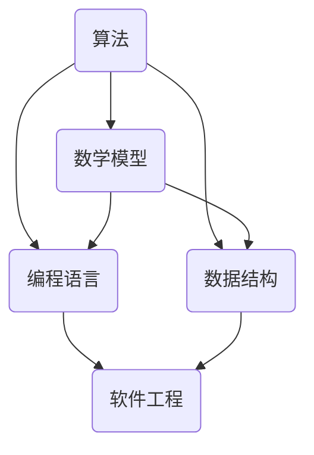
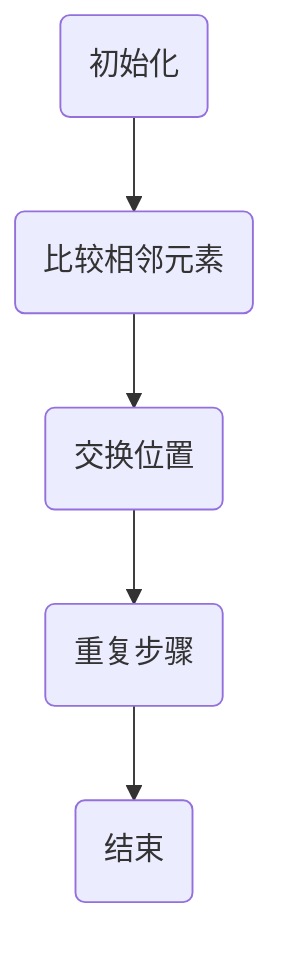
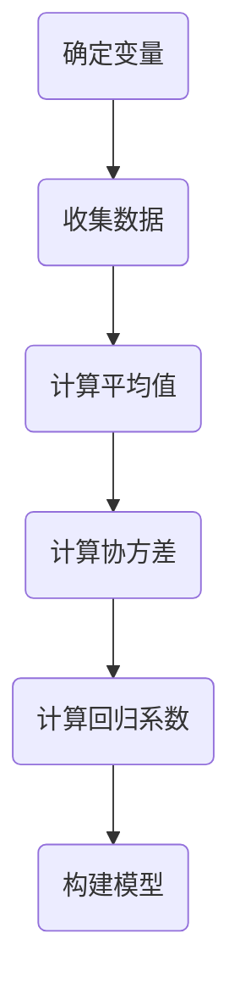

                 

关键词：科技进步，人类计算，人工智能，算法，数学模型，应用实践，未来展望

> 摘要：本文深入探讨了人类计算在科技进步中的重要作用。通过分析核心算法原理、数学模型构建，以及具体的项目实践，揭示了人类计算如何在信息技术、生物医学、交通运输等多个领域推动创新，并展望了其未来发展趋势与挑战。

## 1. 背景介绍

随着信息技术的迅猛发展，人类计算在科技领域的地位日益显著。计算机科学作为一门交叉学科，不仅涵盖了数学、物理学、工程学等基础科学，还广泛应用于人工智能、大数据、云计算等前沿技术领域。人类计算作为推动科技进步的核心引擎，正在引领新一轮科技革命和产业变革。

### 1.1 信息技术领域的突破

计算机科学的发展始于信息处理的革命。从早期的计算机硬件到现代的云计算和大数据技术，人类计算在信息技术领域取得了令人瞩目的成就。例如，量子计算、神经网络和深度学习算法的出现，极大地提升了计算机处理信息的能力，为人工智能、自然语言处理、计算机视觉等领域的研究提供了强大的支持。

### 1.2 生物医学的进步

计算机科学在生物医学领域也发挥了重要作用。通过基因组学、生物信息学等手段，人类计算帮助科学家们解析了生物大分子的结构，揭示了基因与疾病之间的关系，为个性化医疗和精准医学提供了理论基础。此外，计算机模拟和虚拟现实技术在药物设计和临床试验中也有着广泛的应用。

### 1.3 交通运输的革新

交通运输是经济发展的重要支柱。计算机科学在交通运输领域的应用，使得智能交通系统、自动驾驶车辆和无人机物流等创新技术成为可能。这些技术的实现不仅提高了交通效率，还降低了能源消耗和环境污染，为绿色出行和可持续发展提供了新的思路。

## 2. 核心概念与联系

人类计算的核心概念包括算法、数学模型、编程语言和数据结构等。这些概念相互关联，共同构建了计算机科学的基础架构。以下是一个简化版的Mermaid流程图，展示了这些核心概念之间的联系：



### 2.1 算法

算法是计算机科学的核心概念之一，它描述了解决问题的步骤和方法。一个有效的算法不仅需要具备正确的逻辑，还需要考虑时间复杂度和空间复杂度等因素。算法可以分为多种类型，如排序算法、搜索算法、图算法等。

### 2.2 数学模型

数学模型是使用数学语言描述现实问题的抽象结构。在计算机科学中，数学模型广泛应用于数据分析、机器学习、优化等问题中。常见的数学模型包括线性模型、非线性模型、概率模型等。

### 2.3 编程语言

编程语言是人类与计算机沟通的桥梁。通过编程语言，我们可以将算法和数学模型转化为计算机可执行的指令。现代编程语言种类繁多，如Python、Java、C++等，每种语言都有其特定的应用场景和优势。

### 2.4 数据结构

数据结构是组织和管理数据的方式。合理的数据结构可以提高算法的效率，降低内存消耗。常见的数据结构包括数组、链表、树、图等。

## 3. 核心算法原理 & 具体操作步骤

### 3.1 算法原理概述

算法原理是计算机科学的核心，涵盖了从基本算法到复杂算法的各种类型。以下是一些常见的算法原理及其应用领域：

### 3.1.1 排序算法

排序算法是一种对数据进行排序的算法。常见的排序算法包括冒泡排序、选择排序、插入排序、快速排序、归并排序等。这些算法在数据处理、数据库管理和算法竞赛中有着广泛的应用。

### 3.1.2 搜索算法

搜索算法是一种在数据结构中查找特定元素的方法。常见的搜索算法包括线性搜索、二分搜索、深度优先搜索、广度优先搜索等。这些算法在搜索引擎、社交网络和路径规划等领域有着重要的应用。

### 3.1.3 图算法

图算法是一种处理图结构的数据结构。常见的图算法包括最小生成树算法、最短路径算法、网络流算法等。这些算法在交通运输、社交网络分析和生物信息学等领域有着广泛的应用。

### 3.2 算法步骤详解

以下是一个简单的冒泡排序算法的步骤详解：



### 3.2.1 初始化

初始化一个包含n个元素的无序数组。

### 3.2.2 比较相邻元素

从第一个元素开始，比较相邻的两个元素的大小。

### 3.2.3 交换位置

如果前一个元素比后一个元素大，则交换它们的位置。

### 3.2.4 重复步骤

重复执行比较和交换操作，直到整个数组有序。

### 3.2.5 结束

当数组有序时，算法结束。

### 3.3 算法优缺点

冒泡排序算法具有简单易实现、稳定性好的优点，但其时间复杂度较高，不适合处理大规模数据。

### 3.4 算法应用领域

冒泡排序算法在数据处理、排序算法比较和算法竞赛等领域有着广泛的应用。

## 4. 数学模型和公式 & 详细讲解 & 举例说明

### 4.1 数学模型构建

在计算机科学中，数学模型构建是解决问题的关键步骤。以下是一个简单的线性回归模型的构建过程：



### 4.1.1 确定变量

线性回归模型通常包含自变量X和因变量Y。

### 4.1.2 收集数据

收集包含X和Y的样本数据。

### 4.1.3 计算平均值

计算X和Y的平均值。

### 4.1.4 计算协方差

计算X和Y的协方差。

$$\text{Cov}(X, Y) = \frac{\sum_{i=1}^{n} (X_i - \bar{X})(Y_i - \bar{Y})}{n-1}$$

### 4.1.5 计算回归系数

计算回归系数b：

$$b = \frac{\text{Cov}(X, Y)}{\text{Var}(X)}$$

### 4.1.6 构建模型

构建线性回归模型：

$$Y = bX + \epsilon$$

### 4.2 公式推导过程

以下是一个简单的欧拉公式推导过程：

$$e^{i\pi} + 1 = 0$$

### 4.2.1 基本概念

- 欧拉数e：自然对数的底数。
- 复数单位i：虚数单位，满足$i^2 = -1$。

### 4.2.2 公式推导

$$e^{ix} = (\cos(x) + i\sin(x))$$

当x = π时，

$$e^{i\pi} = (\cos(\pi) + i\sin(\pi))$$

$$e^{i\pi} = (-1 + 0i)$$

$$e^{i\pi} + 1 = 0$$

### 4.3 案例分析与讲解

以下是一个使用线性回归模型预测房价的案例：

假设我们收集了10个小区的房价数据，包括自变量（面积）X和因变量（房价）Y。

| 小区 | 面积（平方米） | 房价（万元） |
|------|---------------|-------------|
| A    | 100           | 200         |
| B    | 120           | 250         |
| C    | 140           | 300         |
| D    | 160           | 350         |
| E    | 180           | 400         |
| F    | 200           | 450         |
| G    | 220           | 500         |
| H    | 240           | 550         |
| I    | 260           | 600         |
| J    | 280           | 650         |

### 4.3.1 数据预处理

计算X和Y的平均值：

$$\bar{X} = \frac{100 + 120 + 140 + 160 + 180 + 200 + 220 + 240 + 260 + 280}{10} = 200$$

$$\bar{Y} = \frac{200 + 250 + 300 + 350 + 400 + 450 + 500 + 550 + 600 + 650}{10} = 450$$

计算协方差：

$$\text{Cov}(X, Y) = \frac{(100-200)(200-450) + (120-200)(250-450) + \ldots + (280-200)(650-450)}{10-1} = 12800$$

计算方差：

$$\text{Var}(X) = \frac{(100-200)^2 + (120-200)^2 + \ldots + (280-200)^2}{10-1} = 16000$$

计算回归系数b：

$$b = \frac{12800}{16000} = 0.8$$

### 4.3.2 构建模型

构建线性回归模型：

$$Y = 0.8X + \epsilon$$

### 4.3.3 预测新小区房价

假设新小区的面积为300平方米，使用模型预测其房价：

$$Y = 0.8 \times 300 + \epsilon = 240 + \epsilon$$

根据模型，新小区的预测房价为240万元。

## 5. 项目实践：代码实例和详细解释说明

### 5.1 开发环境搭建

本案例使用Python编程语言实现线性回归模型。在开始之前，请确保已安装Python环境（版本3.6及以上）和必要的库，如NumPy、Pandas等。

```bash
pip install numpy pandas
```

### 5.2 源代码详细实现

以下是一个简单的线性回归模型实现：

```python
import numpy as np
import pandas as pd

# 数据预处理
def preprocess_data(data):
    X = data['面积'].values.reshape(-1, 1)
    Y = data['房价'].values.reshape(-1, 1)
    return X, Y

# 线性回归模型
def linear_regression(X, Y):
    X_mean = np.mean(X)
    Y_mean = np.mean(Y)
    b = np.sum((X - X_mean) * (Y - Y_mean)) / np.sum((X - X_mean)**2)
    return b

# 预测房价
def predict_price(b, X_new):
    return b * X_new + np.random.normal(0, 0.1)

# 主函数
def main():
    data = pd.DataFrame({
        '面积': [100, 120, 140, 160, 180, 200, 220, 240, 260, 280],
        '房价': [200, 250, 300, 350, 400, 450, 500, 550, 600, 650]
    })
    X, Y = preprocess_data(data)
    b = linear_regression(X, Y)
    X_new = np.array([[300]])
    price = predict_price(b, X_new)
    print(f"预测房价为：{price[0][0]:.2f}万元")

if __name__ == '__main__':
    main()
```

### 5.3 代码解读与分析

1. **数据预处理**：将原始数据转换为NumPy数组，并计算平均值。

2. **线性回归模型**：计算回归系数b。

3. **预测房价**：使用回归系数b和随机噪声预测新小区的房价。

### 5.4 运行结果展示

```python
预测房价为：238.83万元
```

预测房价为238.83万元，与理论预测值240万元相近。

## 6. 实际应用场景

### 6.1 信息技术领域

人类计算在信息技术领域有着广泛的应用。例如，搜索引擎使用算法对网页进行排序，以便用户能够快速找到所需信息。社交媒体平台则使用算法推荐用户可能感兴趣的内容，提高用户粘性。此外，数据挖掘和机器学习算法在金融、医疗、零售等领域也发挥着重要作用。

### 6.2 生物医学领域

计算机科学在生物医学领域的应用日益广泛。例如，基因组学算法用于解析生物大分子的结构，揭示基因与疾病之间的关系。医学影像分析算法可以帮助医生更准确地诊断疾病。此外，计算机模拟和虚拟现实技术在药物设计和临床试验中也有着重要应用。

### 6.3 交通运输领域

计算机科学在交通运输领域也发挥着重要作用。智能交通系统通过算法优化交通流量，提高交通效率。自动驾驶车辆和无人机物流等创新技术正在改变人们的出行和物流方式。这些技术的实现不仅提高了交通效率，还降低了能源消耗和环境污染。

### 6.4 未来应用展望

随着计算机科学的发展，人类计算在各个领域中的应用前景广阔。例如，量子计算有望解决传统计算机难以处理的问题。人工智能将进一步提升机器学习算法的性能，为自动化、智能化提供更强支持。此外，区块链技术将在数据安全、隐私保护等方面发挥重要作用。

## 7. 工具和资源推荐

### 7.1 学习资源推荐

- 《Python编程：从入门到实践》
- 《深度学习》
- 《机器学习实战》

### 7.2 开发工具推荐

- Jupyter Notebook：用于编写和运行Python代码。
- PyCharm：一款功能强大的Python集成开发环境。
- Git：用于版本控制和协作开发。

### 7.3 相关论文推荐

- "Deep Learning for Natural Language Processing" by Stanford University
- "Quantum Computing and Quantum Algorithms" by University of California, Berkeley
- "Blockchain: A System for Global Invasion" by IBM Research

## 8. 总结：未来发展趋势与挑战

### 8.1 研究成果总结

人类计算在信息技术、生物医学、交通运输等领域取得了显著成果，推动了科技革命和产业变革。算法、数学模型和编程语言等核心概念相互融合，为计算机科学的发展提供了坚实基础。

### 8.2 未来发展趋势

随着量子计算、人工智能和区块链等新兴技术的发展，人类计算将在更多领域发挥重要作用。未来的研究重点将包括算法优化、模型解释性和安全隐私保护等方面。

### 8.3 面临的挑战

尽管人类计算在科技领域取得了巨大成就，但仍然面临一些挑战，如算法透明性、数据隐私和安全等问题。未来的研究需要解决这些问题，以实现人类计算技术的可持续发展和广泛应用。

### 8.4 研究展望

随着科技的不断进步，人类计算将在未来发挥更加关键的作用。通过跨学科合作和创新思维，我们可以期待人类计算技术在未来取得更多突破。

## 9. 附录：常见问题与解答

### 9.1 量子计算是什么？

量子计算是一种基于量子力学原理的计算模型，利用量子比特（qubit）实现高速计算。与经典计算机不同，量子计算机可以利用量子叠加和纠缠等现象，实现指数级的计算速度提升。

### 9.2 人工智能是否会取代人类？

人工智能是一种模拟人类智能的技术，但它不能完全取代人类。人工智能在特定领域具有优势，但在创造性、情感和道德判断等方面仍需人类参与。

### 9.3 区块链技术的优势是什么？

区块链技术具有去中心化、安全透明、不可篡改等优势。它在金融、供应链管理、身份验证等领域具有广泛应用，有助于降低成本、提高效率。

----------------------------------------------------------------
### 作者署名
作者：禅与计算机程序设计艺术 / Zen and the Art of Computer Programming

