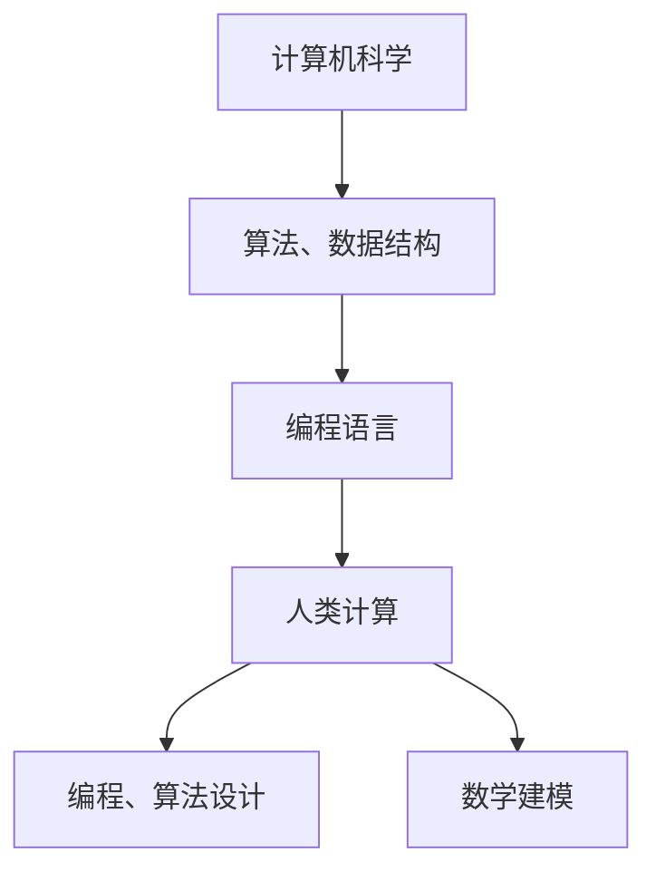

                 

关键词：科技进步、人类计算、创新力量、算法、数学模型、应用场景、开发工具

> 摘要：本文将深入探讨人类计算在推动科技进步中的关键作用。通过对核心概念、算法原理、数学模型以及实际应用场景的分析，揭示人类计算在科技发展中的重要性，并对未来的发展趋势和挑战进行展望。

## 1. 背景介绍

在人类文明的历史长河中，计算一直是科技进步的重要驱动力。从古代的算盘到现代的计算机，计算能力的提升始终伴随着科学技术的进步。然而，随着计算机科学的发展，人类计算的概念逐渐被提出并得到广泛应用。人类计算不仅涵盖了传统的编程和算法设计，还包括了人工智能、人机交互等新兴领域。

本文旨在探讨人类计算在推动科技进步中的角色，分析其核心概念、算法原理、数学模型以及实际应用场景，并对未来的发展趋势和挑战进行展望。

## 2. 核心概念与联系

### 2.1 人类计算的定义

人类计算是指人类在计算机科学领域中，通过编程、算法设计、数学建模等手段，利用计算机和其他计算工具进行信息处理、决策和创造的能力。它不仅包括了传统的编程技能，还涉及到了人类对计算机系统的理解、优化和改进。

### 2.2 人类计算与计算机科学的联系

计算机科学是人类计算的基础，提供了各种算法、数据结构、编程语言等工具和方法。而人类计算则为计算机科学提供了实际的解决方案，推动了计算机科学的发展和应用。两者相辅相成，共同推动了科技的进步。

### 2.3 Mermaid 流程图

以下是一个简单的 Mermaid 流程图，展示了人类计算与计算机科学之间的联系：



## 3. 核心算法原理 & 具体操作步骤

### 3.1 算法原理概述

人类计算的核心在于算法的设计和优化。算法是一系列解决问题的步骤和规则，它决定了计算效率和质量。在计算机科学中，算法的研究和应用无处不在，如排序算法、搜索算法、图算法等。

### 3.2 算法步骤详解

算法的步骤通常包括以下几部分：

1. 输入处理：对输入数据进行预处理，如排序、去重等。
2. 中间处理：根据算法原理，对输入数据进行计算或操作。
3. 输出结果：根据中间处理的结果，生成最终的输出。

### 3.3 算法优缺点

不同的算法有不同的优缺点，选择合适的算法需要根据具体问题和应用场景来决定。例如，排序算法中，快速排序平均时间复杂度为 $O(n\log n)$，但最坏情况下会退化为 $O(n^2)$；而归并排序则总是保持在 $O(n\log n)$。

### 3.4 算法应用领域

算法在计算机科学的各个领域都有广泛应用，如人工智能、数据科学、网络通信、图形图像处理等。随着计算能力的提升，算法的应用领域也在不断扩大。

## 4. 数学模型和公式

### 4.1 数学模型构建

数学模型是对现实世界问题的抽象和简化，它通常包括变量、方程和约束条件等。构建数学模型的过程是解决问题的关键，它要求我们对问题有深刻的理解和准确的描述。

### 4.2 公式推导过程

公式的推导通常基于数学原理和逻辑推理。例如，牛顿-莱布尼茨公式是微积分中的一个基本公式，它描述了微分和积分之间的关系。

### 4.3 案例分析与讲解

以线性规划为例，线性规划是一种用于求解线性约束条件下目标函数最大或最小值的数学方法。它的基本公式如下：

$$
\min\limits_{x} \quad c^T x \\
\text{subject to} \quad Ax \leq b
$$

其中，$c$ 和 $b$ 是已知向量，$A$ 是已知矩阵，$x$ 是需要求解的变量。

## 5. 项目实践：代码实例

### 5.1 开发环境搭建

以 Python 为例，搭建一个简单的线性规划项目环境：

```bash
pip install cvxpy
```

### 5.2 源代码详细实现

```python
import cvxpy as cp

# 定义变量
x = cp.Variable(nonneg=True)

# 定义目标函数
objective = cp.Minimize(2 * x[0] + x[1])

# 定义约束条件
constraints = [x[0] + 2 * x[1] <= 4, x[0] - x[1] == 0]

# 求解
prob = cp.Problem(objective, constraints)
prob.solve()

# 输出结果
print(f"Optimal value: {prob.value}")
print(f"Optimal variable: {x.value}")
```

### 5.3 代码解读与分析

这段代码使用了 CVXPY 库来求解一个简单的线性规划问题。变量 $x$ 被定义为非负变量，目标函数是求解最小值，约束条件是线性不等式和等式。通过调用 `prob.solve()` 函数，我们可以得到最优解。

## 6. 实际应用场景

人类计算在科技领域有着广泛的应用。例如，在人工智能领域，深度学习算法的优化和模型设计需要大量的计算能力和人类智慧；在医疗领域，计算模型和算法被用于疾病诊断和治疗方案设计；在金融领域，算法被用于市场分析和投资决策。

## 7. 工具和资源推荐

### 7.1 学习资源推荐

- 《算法导论》
- 《深度学习》
- 《线性代数及其应用》

### 7.2 开发工具推荐

- Python
- R
- MATLAB

### 7.3 相关论文推荐

- "Deep Learning for Natural Language Processing"
- "A Brief History of Deep Learning"
- "Random Forests"

## 8. 总结：未来发展趋势与挑战

### 8.1 研究成果总结

人类计算在推动科技进步中发挥了重要作用，尤其是在算法设计、数学建模和人工智能等领域取得了显著成果。

### 8.2 未来发展趋势

随着计算能力的提升和人工智能的发展，人类计算将继续在各个领域发挥重要作用。未来，我们将看到更多基于计算的技术和解决方案的出现。

### 8.3 面临的挑战

尽管人类计算在科技发展中取得了巨大成就，但仍面临诸多挑战，如算法复杂度、数据隐私和安全等。

### 8.4 研究展望

未来，人类计算将继续推动科技进步，特别是在解决复杂问题和优化计算效率方面。同时，我们也需要关注数据隐私和安全等问题，确保科技的发展能够造福人类。

## 9. 附录：常见问题与解答

### 9.1 什么是人类计算？

人类计算是指人类在计算机科学领域中，通过编程、算法设计、数学建模等手段，利用计算机和其他计算工具进行信息处理、决策和创造的能力。

### 9.2 人类计算有哪些应用领域？

人类计算在计算机科学、人工智能、数据科学、网络通信、图形图像处理等多个领域都有广泛应用。

### 9.3 如何学习人类计算？

学习人类计算可以从基础编程语言开始，如 Python、R、MATLAB 等。同时，了解算法原理和数学模型也是非常重要的。

作者：禅与计算机程序设计艺术 / Zen and the Art of Computer Programming
```

