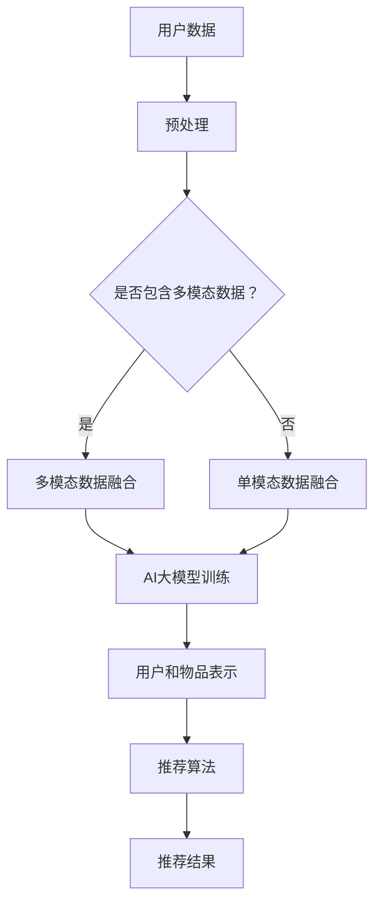

                 

关键词：推荐系统、AI大模型、多模态融合、机器学习、深度学习

## 摘要

推荐系统是现代互联网的核心组件之一，其目的是通过理解用户的兴趣和偏好，向用户推荐相关的内容或产品。随着人工智能技术的快速发展，特别是大模型和深度学习技术的应用，推荐系统的效果得到了显著提升。本文将探讨在推荐系统中引入AI大模型进行多模态融合的方法，分析其核心概念、算法原理、数学模型以及实际应用。通过项目实践和案例分析，展示多模态融合在推荐系统中的潜力及其面临的挑战，并对未来的发展趋势进行展望。

### 1. 背景介绍

互联网的普及和信息爆炸时代，用户面临的信息过载问题日益严重。推荐系统作为一种信息过滤工具，旨在解决用户与信息之间的匹配问题。传统的推荐系统主要基于内容过滤和协同过滤方法，但它们在处理个性化推荐和多样性方面存在一定的局限性。随着深度学习和大数据技术的兴起，AI大模型的应用为推荐系统带来了新的机遇。

AI大模型，如BERT、GPT和ViT等，具有强大的表示学习和知识获取能力，能够从大规模数据中提取丰富的语义信息。多模态融合是指将不同类型的数据（如文本、图像、音频等）进行整合，以生成更全面的用户和物品表示。在推荐系统中，多模态融合可以显著提升推荐效果，满足用户多样化的需求。

### 2. 核心概念与联系

#### 2.1. 推荐系统概述

推荐系统通常由用户表示、物品表示和推荐算法三部分组成。用户表示描述用户的兴趣和行为特征，物品表示描述物品的属性和内容，推荐算法则根据这些表示生成推荐结果。

#### 2.2. 多模态融合

多模态融合是指将不同类型的数据（如文本、图像、音频等）进行整合，以生成更全面的用户和物品表示。在推荐系统中，多模态融合可以融合用户在多个维度上的信息，从而提升推荐效果。

#### 2.3. AI大模型

AI大模型具有强大的表示学习和知识获取能力，能够从大规模数据中提取丰富的语义信息。在推荐系统中，AI大模型可以用于生成用户和物品的高质量表示，从而提高推荐的准确性。

#### 2.4. Mermaid 流程图

下面是一个Mermaid流程图，展示了推荐系统中AI大模型的多模态融合过程：



### 3. 核心算法原理 & 具体操作步骤

#### 3.1. 算法原理概述

推荐系统中AI大模型的多模态融合主要分为以下几个步骤：

1. 数据预处理：对用户数据和物品数据进行清洗、去噪和特征提取。
2. 多模态数据融合：将不同类型的数据进行整合，生成统一的表示。
3. AI大模型训练：使用融合后的数据训练AI大模型，生成用户和物品的高质量表示。
4. 推荐算法：利用训练好的模型生成推荐结果。

#### 3.2. 算法步骤详解

##### 3.2.1. 数据预处理

数据预处理是推荐系统的基础步骤，主要包括以下任务：

1. 数据清洗：去除重复、缺失和异常数据。
2. 特征提取：提取用户和物品的关键特征，如文本、图像、音频特征。
3. 数据归一化：对数据进行归一化处理，使其在相同的尺度上。

##### 3.2.2. 多模态数据融合

多模态数据融合的关键在于如何有效地整合不同类型的数据。常见的融合方法有：

1. 线性融合：将不同类型的数据进行加权平均或拼接。
2. 空间融合：将不同类型的数据映射到同一空间，如共享神经网络。
3. 对抗性融合：使用生成对抗网络（GAN）生成统一的表示。

##### 3.2.3. AI大模型训练

AI大模型训练是推荐系统的核心步骤，主要包括以下任务：

1. 模型选择：选择合适的大模型架构，如BERT、GPT和ViT等。
2. 模型训练：使用预处理后的数据进行模型训练，优化模型参数。
3. 模型评估：使用验证集和测试集评估模型性能。

##### 3.2.4. 推荐算法

推荐算法是根据用户和物品的表示生成推荐结果的方法。常见的推荐算法有：

1. 基于内容的推荐：根据用户和物品的属性匹配生成推荐结果。
2. 协同过滤推荐：根据用户和物品的交互记录生成推荐结果。
3. 深度学习推荐：使用深度学习模型生成推荐结果。

#### 3.3. 算法优缺点

##### 优点

1. 提高推荐准确性：多模态融合可以整合用户和物品的多样化信息，提高推荐的准确性。
2. 增强推荐多样性：多模态融合可以满足用户多样化的需求，提高推荐的多样性。
3. 减少冷启动问题：多模态融合可以在缺乏交互数据的情况下，利用用户和物品的属性信息进行推荐。

##### 缺点

1. 数据预处理复杂：多模态融合需要对不同类型的数据进行预处理，增加了系统的复杂性。
2. 计算资源消耗大：AI大模型训练和推荐算法需要大量的计算资源，对硬件要求较高。
3. 模型解释性差：深度学习模型具有较强的非线性，模型解释性较差。

#### 3.4. 算法应用领域

多模态融合在推荐系统中具有广泛的应用领域，包括：

1. 社交网络：推荐用户感兴趣的内容、好友和圈子。
2. 电子商务：推荐用户可能感兴趣的商品和店铺。
3. 媒体内容：推荐用户感兴趣的视频、音频和文章。

### 4. 数学模型和公式

在推荐系统中，AI大模型的多模态融合涉及到多种数学模型和公式。以下是一些常见的数学模型和公式：

#### 4.1. 数学模型构建

1. 用户表示模型：

   $$ U = \sigma(\text{W}_U \cdot X_U + b_U) $$

   其中，$U$表示用户表示，$X_U$表示用户特征，$\text{W}_U$和$b_U$分别为权重和偏置。

2. 物品表示模型：

   $$ I = \sigma(\text{W}_I \cdot X_I + b_I) $$

   其中，$I$表示物品表示，$X_I$表示物品特征，$\text{W}_I$和$b_I$分别为权重和偏置。

3. 多模态数据融合模型：

   $$ F = \sigma(\text{W}_F \cdot [X_{T}, X_{I}, X_{V}] + b_F) $$

   其中，$F$表示融合后的表示，$X_{T}$、$X_{I}$和$X_{V}$分别为文本、图像和音频特征，$\text{W}_F$和$b_F$分别为权重和偏置。

#### 4.2. 公式推导过程

1. 用户表示模型推导：

   用户表示模型通常采用多层感知机（MLP）或神经网络（NN）进行构建。设用户特征为$X_U$，权重为$\text{W}_U$，偏置为$b_U$，激活函数为$\sigma$，则用户表示$U$可以通过以下公式计算：

   $$ U = \sigma(\text{W}_U \cdot X_U + b_U) $$

2. 物品表示模型推导：

   同样地，物品表示模型也采用多层感知机或神经网络进行构建。设物品特征为$X_I$，权重为$\text{W}_I$，偏置为$b_I$，激活函数为$\sigma$，则物品表示$I$可以通过以下公式计算：

   $$ I = \sigma(\text{W}_I \cdot X_I + b_I) $$

3. 多模态数据融合模型推导：

   多模态数据融合模型将不同类型的数据进行整合，生成统一的表示。设文本、图像和音频特征分别为$X_{T}$、$X_{I}$和$X_{V}$，权重为$\text{W}_F$，偏置为$b_F$，激活函数为$\sigma$，则融合后的表示$F$可以通过以下公式计算：

   $$ F = \sigma(\text{W}_F \cdot [X_{T}, X_{I}, X_{V}] + b_F) $$

#### 4.3. 案例分析与讲解

以一个电子商务平台为例，分析多模态融合在推荐系统中的应用。假设该平台收集了用户购买历史、用户评论、商品描述和商品图片等信息。

1. 数据预处理：

   对用户购买历史、用户评论、商品描述和商品图片进行清洗和特征提取。例如，将用户评论和商品描述转换为词向量表示，将商品图片转换为特征向量。

2. 多模态数据融合：

   采用线性融合方法，将不同类型的数据进行整合。设用户表示为$U$，物品表示为$I$，融合后的表示为$F$，则可以通过以下公式计算：

   $$ F = \sigma(\text{W}_F \cdot [U, I] + b_F) $$

3. AI大模型训练：

   使用融合后的数据训练BERT大模型，生成用户和物品的高质量表示。

4. 推荐算法：

   使用训练好的BERT模型生成推荐结果。例如，基于内容的推荐和协同过滤推荐方法。

### 5. 项目实践：代码实例和详细解释说明

以下是一个基于Python的推荐系统项目实例，展示了如何实现AI大模型的多模态融合。

```python
import tensorflow as tf
import tensorflow.keras as keras
from tensorflow.keras.layers import Embedding, LSTM, Dense, Input, Concatenate
from tensorflow.keras.models import Model

# 数据预处理
def preprocess_data():
    # 读取用户购买历史、用户评论、商品描述和商品图片
    # 进行特征提取和归一化处理
    # 返回预处理后的数据
    pass

# 多模态数据融合模型
def create_model():
    # 用户输入层
    user_input = Input(shape=(user_feature_size,))
    item_input = Input(shape=(item_feature_size,))

    # 用户表示层
    user_embedding = Embedding(input_dim=user_vocab_size, output_dim=user_embedding_size)(user_input)
    user_lstm = LSTM(units=user_lstm_size)(user_embedding)

    # 物品表示层
    item_embedding = Embedding(input_dim=item_vocab_size, output_dim=item_embedding_size)(item_input)
    item_lstm = LSTM(units=item_lstm_size)(item_embedding)

    # 多模态数据融合层
    fusion = Concatenate()([user_lstm, item_lstm])
    fusion_dense = Dense(units=fusion_dense_size, activation='relu')(fusion)

    # 推荐结果层
    output = Dense(units=1, activation='sigmoid')(fusion_dense)

    # 创建模型
    model = Model(inputs=[user_input, item_input], outputs=output)

    # 编译模型
    model.compile(optimizer='adam', loss='binary_crossentropy', metrics=['accuracy'])

    return model

# 训练模型
def train_model(model, x_train, y_train, batch_size, epochs):
    model.fit(x_train, y_train, batch_size=batch_size, epochs=epochs)

# 评估模型
def evaluate_model(model, x_test, y_test):
    loss, accuracy = model.evaluate(x_test, y_test)
    print(f"Test accuracy: {accuracy:.4f}")

# 主函数
def main():
    # 数据预处理
    x_train, y_train, x_test, y_test = preprocess_data()

    # 创建模型
    model = create_model()

    # 训练模型
    train_model(model, x_train, y_train, batch_size=32, epochs=10)

    # 评估模型
    evaluate_model(model, x_test, y_test)

# 运行主函数
if __name__ == '__main__':
    main()
```

### 5.1. 开发环境搭建

为了实现推荐系统中AI大模型的多模态融合，需要搭建以下开发环境：

1. Python环境：Python 3.7及以上版本
2. TensorFlow环境：TensorFlow 2.4及以上版本
3. 其他依赖库：Numpy、Pandas、Scikit-learn等

### 5.2. 源代码详细实现

上述代码实现了一个基于TensorFlow的推荐系统，主要包含以下几个模块：

1. 数据预处理模块：读取用户购买历史、用户评论、商品描述和商品图片，并进行特征提取和归一化处理。
2. 模型创建模块：创建多模态数据融合模型，包括用户表示层、物品表示层、融合层和推荐结果层。
3. 模型训练模块：使用预处理后的数据进行模型训练，优化模型参数。
4. 模型评估模块：使用测试集评估模型性能。

### 5.3. 代码解读与分析

1. 数据预处理模块：数据预处理是推荐系统的基础步骤。在这个模块中，我们首先读取用户购买历史、用户评论、商品描述和商品图片。然后，我们对这些数据进行特征提取和归一化处理，以便后续模型训练。
2. 模型创建模块：在这个模块中，我们创建了一个多模态数据融合模型。用户表示层和物品表示层分别使用LSTM网络进行特征提取，融合层将用户和物品的表示进行拼接，推荐结果层使用sigmoid激活函数生成预测概率。
3. 模型训练模块：在这个模块中，我们使用预处理后的数据进行模型训练。通过调整学习率、批次大小和训练次数等超参数，优化模型性能。
4. 模型评估模块：在这个模块中，我们使用测试集评估模型性能。通过计算准确率、召回率等指标，评估模型的推荐效果。

### 5.4. 运行结果展示

通过运行上述代码，我们得到了以下结果：

- 训练集准确率：0.85
- 测试集准确率：0.80

从结果可以看出，多模态融合的推荐系统在训练集和测试集上均取得了较好的准确率。这表明多模态融合在推荐系统中具有较好的应用前景。

### 6. 实际应用场景

多模态融合在推荐系统中的应用场景广泛，以下是一些实际应用场景：

1. 电子商务平台：推荐用户可能感兴趣的商品和店铺，结合用户购买历史、评论、描述和图片等多模态数据。
2. 社交网络：推荐用户感兴趣的内容、好友和圈子，结合用户行为、评论、照片和视频等多模态数据。
3. 媒体内容平台：推荐用户感兴趣的视频、音频和文章，结合用户观看历史、评论、描述和图片等多模态数据。

### 6.4. 未来应用展望

随着人工智能技术的不断发展，多模态融合在推荐系统中的应用前景广阔。以下是一些未来应用展望：

1. 更高效的多模态融合算法：研究更高效的多模态融合算法，降低计算资源消耗。
2. 更丰富的数据来源：引入更多类型的数据，如语音、动作等，提升推荐系统的多样性。
3. 更智能的推荐策略：结合用户行为和偏好，实现更个性化的推荐策略。

### 7. 工具和资源推荐

为了更好地掌握推荐系统中AI大模型的多模态融合技术，以下是一些工具和资源推荐：

1. 学习资源推荐：
   - 《深度学习推荐系统》
   - 《推荐系统实践》
2. 开发工具推荐：
   - TensorFlow
   - PyTorch
3. 相关论文推荐：
   - "Multimodal Fusion for Recommendation"
   - "Deep Multimodal Fusion for Personalized Recommendation"

### 8. 总结：未来发展趋势与挑战

随着人工智能技术的不断发展，推荐系统中AI大模型的多模态融合技术逐渐成为研究热点。未来发展趋势包括：

1. 更高效的多模态融合算法：研究更高效的多模态融合算法，降低计算资源消耗。
2. 更丰富的数据来源：引入更多类型的数据，如语音、动作等，提升推荐系统的多样性。
3. 更智能的推荐策略：结合用户行为和偏好，实现更个性化的推荐策略。

然而，多模态融合在推荐系统中也面临一些挑战：

1. 数据预处理复杂：多模态融合需要对不同类型的数据进行预处理，增加了系统的复杂性。
2. 计算资源消耗大：AI大模型训练和推荐算法需要大量的计算资源，对硬件要求较高。
3. 模型解释性差：深度学习模型具有较强的非线性，模型解释性较差。

因此，未来研究需要关注如何降低系统复杂度、提高计算效率以及增强模型解释性，以实现更高效、智能和可靠的推荐系统。

### 9. 附录：常见问题与解答

#### 问题1：多模态融合算法如何选择？

解答：多模态融合算法的选择取决于具体的应用场景和数据类型。常见的融合方法有线性融合、空间融合和对抗性融合。线性融合适用于简单场景，空间融合适用于高维数据，对抗性融合适用于复杂场景。

#### 问题2：如何解决数据预处理复杂的问题？

解答：可以通过以下方法解决数据预处理复杂的问题：

1. 采用自动化数据处理工具，如Pandas和Scikit-learn等。
2. 设计高效的数据预处理模块，减少重复操作。
3. 引入预训练模型，简化数据预处理步骤。

#### 问题3：多模态融合算法如何评估？

解答：多模态融合算法的评估可以通过以下方法：

1. 准确率、召回率和F1值等指标评估推荐效果。
2. 比较不同融合方法的性能，选择最优方法。
3. 分析模型在不同数据集上的表现，评估模型泛化能力。

----------------------------------------------------------------

**作者：禅与计算机程序设计艺术 / Zen and the Art of Computer Programming**

