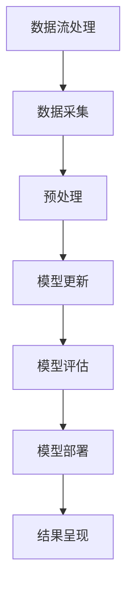

                 

关键词：推荐系统，AI大模型，实时更新机制，机器学习，数据流处理

> 摘要：本文探讨了推荐系统中AI大模型的实时更新机制，分析了当前主流的更新方法，并探讨了未来的发展趋势。文章首先介绍了推荐系统的基本概念和作用，然后详细阐述了AI大模型在推荐系统中的应用，最后提出了实时更新机制的实现方法，为推荐系统的优化提供了新的思路。

## 1. 背景介绍

### 推荐系统的基本概念

推荐系统是一种基于用户历史行为和兴趣偏好，自动向用户推荐相关商品、内容或其他信息的系统。其主要目的是通过个性化推荐，提高用户体验和满意度，从而提升业务收益。

推荐系统的主要组成部分包括数据收集模块、用户画像模块、推荐算法模块和结果呈现模块。数据收集模块负责从各种渠道获取用户行为数据；用户画像模块通过对用户行为数据的分析，构建用户的兴趣偏好模型；推荐算法模块根据用户画像和商品信息，生成个性化的推荐列表；结果呈现模块将推荐结果以可视化的方式展示给用户。

### AI大模型在推荐系统中的应用

随着人工智能技术的快速发展，深度学习等AI大模型在推荐系统中得到了广泛应用。AI大模型具有强大的特征提取和分类能力，能够从大规模的数据中挖掘出用户潜在的兴趣偏好，从而提高推荐的准确性。

AI大模型在推荐系统中的应用主要体现在两个方面：特征提取和预测模型。在特征提取方面，AI大模型可以自动学习用户行为数据中的潜在特征，减少人工特征工程的工作量；在预测模型方面，AI大模型可以通过训练生成高质量的预测模型，提高推荐结果的准确性。

## 2. 核心概念与联系

为了更好地理解AI大模型在推荐系统中的实时更新机制，我们首先介绍一些核心概念，并使用Mermaid流程图展示它们之间的联系。

### 2.1 核心概念

- **数据流处理**：数据流处理是一种实时数据处理技术，可以高效地处理大规模数据流，并实时更新数据。
- **模型更新**：模型更新是指根据新的数据，重新训练或调整机器学习模型的过程。
- **增量学习**：增量学习是一种在线学习技术，可以在已有模型的基础上，利用新的数据进行更新。

### 2.2 Mermaid流程图



## 3. 核心算法原理 & 具体操作步骤

### 3.1 算法原理概述

实时更新机制的核心算法包括数据流处理、模型更新和模型评估。数据流处理负责实时获取和处理用户行为数据；模型更新利用新的数据对模型进行重新训练或调整；模型评估用于评估更新后模型的性能，确保推荐结果的准确性。

### 3.2 算法步骤详解

#### 3.2.1 数据流处理

1. **数据采集**：从各种数据源（如日志、数据库等）实时获取用户行为数据。
2. **数据预处理**：对采集到的数据进行清洗、去重、去噪等处理，确保数据质量。
3. **数据特征提取**：利用特征提取算法（如TF-IDF、Word2Vec等）对预处理后的数据进行特征提取。

#### 3.2.2 模型更新

1. **模型初始化**：使用历史数据初始化机器学习模型。
2. **模型训练**：利用实时获取的新数据进行模型训练。
3. **模型调整**：根据模型评估结果，调整模型参数，优化模型性能。

#### 3.2.3 模型评估

1. **评估指标**：选择适当的评估指标（如准确率、召回率、F1值等）评估模型性能。
2. **模型对比**：将更新后的模型与原始模型进行比较，评估更新效果。
3. **模型选择**：根据评估结果选择性能更好的模型进行部署。

### 3.3 算法优缺点

#### 优点

1. **实时性**：实时更新机制可以实时处理用户行为数据，提高推荐系统的响应速度。
2. **准确性**：利用增量学习技术，可以更好地适应用户兴趣变化，提高推荐准确性。
3. **高效性**：数据流处理技术可以高效地处理大规模数据流，降低计算成本。

#### 缺点

1. **计算资源消耗**：实时更新机制需要大量的计算资源，对硬件设备要求较高。
2. **数据延迟**：由于数据流处理的实时性要求，可能会出现数据延迟现象。

### 3.4 算法应用领域

实时更新机制在推荐系统中具有广泛的应用领域，如电商、新闻、社交网络等。通过实时更新模型，可以更好地满足用户需求，提高用户满意度，从而提升业务收益。

## 4. 数学模型和公式 & 详细讲解 & 举例说明

### 4.1 数学模型构建

实时更新机制的数学模型主要包括数据流处理、模型更新和模型评估三个部分。

#### 数据流处理

数据流处理的核心是实时获取和处理用户行为数据。我们可以使用如下公式表示：

$$
X_t = f(X_{t-1}, U_t)
$$

其中，$X_t$ 表示第 $t$ 个时间点的数据流，$X_{t-1}$ 表示前一个时间点的数据流，$U_t$ 表示第 $t$ 个时间点的用户行为数据。

#### 模型更新

模型更新主要利用增量学习技术，对现有模型进行更新。我们可以使用如下公式表示：

$$
\theta_t = \theta_{t-1} + \eta \cdot \Delta \theta
$$

其中，$\theta_t$ 表示第 $t$ 个时间点的模型参数，$\theta_{t-1}$ 表示前一个时间点的模型参数，$\Delta \theta$ 表示模型参数的更新量，$\eta$ 表示学习率。

#### 模型评估

模型评估主要使用评估指标对更新后的模型进行性能评估。我们可以使用如下公式表示：

$$
M_t = g(X_t, \theta_t)
$$

其中，$M_t$ 表示第 $t$ 个时间点的模型评估结果，$X_t$ 表示第 $t$ 个时间点的数据流，$\theta_t$ 表示第 $t$ 个时间点的模型参数。

### 4.2 公式推导过程

#### 数据流处理

首先，我们需要对用户行为数据进行特征提取，可以使用如下公式表示：

$$
U_t = \text{feature\_extract}(U_t)
$$

其中，$U_t$ 表示第 $t$ 个时间点的用户行为数据，$\text{feature\_extract}$ 表示特征提取函数。

然后，我们将特征提取后的用户行为数据输入到数据流处理模块，得到：

$$
X_t = \text{data\_processing}(U_t)
$$

其中，$\text{data\_processing}$ 表示数据流处理函数。

#### 模型更新

首先，我们需要初始化模型参数，可以使用如下公式表示：

$$
\theta_{t-1} = \text{initialize\_parameters}()
$$

其中，$\theta_{t-1}$ 表示前一个时间点的模型参数，$\text{initialize\_parameters}$ 表示初始化模型参数的函数。

然后，我们利用增量学习技术，对模型参数进行更新，可以使用如下公式表示：

$$
\Delta \theta = \text{gradient\_descent}(X_t, \theta_{t-1})
$$

其中，$\Delta \theta$ 表示模型参数的更新量，$\text{gradient\_descent}$ 表示梯度下降算法。

最后，我们将更新后的模型参数累加到原始模型参数，得到：

$$
\theta_t = \theta_{t-1} + \eta \cdot \Delta \theta
$$

其中，$\eta$ 表示学习率。

#### 模型评估

首先，我们需要计算模型评估结果，可以使用如下公式表示：

$$
M_t = \text{evaluate\_model}(X_t, \theta_t)
$$

其中，$M_t$ 表示第 $t$ 个时间点的模型评估结果，$\text{evaluate\_model}$ 表示模型评估函数。

然后，我们比较更新前后的模型评估结果，判断模型更新是否有效。

### 4.3 案例分析与讲解

假设我们有一个电商推荐系统，用户的历史行为数据包括购买次数、浏览次数、收藏次数等。我们使用深度学习模型进行推荐，模型参数包括权重矩阵和偏置项。

#### 数据流处理

首先，我们需要对用户行为数据进行特征提取，例如将购买次数、浏览次数和收藏次数分别编码为0、1。然后，我们将特征提取后的用户行为数据输入到数据流处理模块，得到：

$$
X_t = \text{data\_processing}(U_t) = \begin{bmatrix} u_{t1} & u_{t2} & u_{t3} \end{bmatrix}
$$

其中，$u_{t1}$、$u_{t2}$ 和 $u_{t3}$ 分别表示购买次数、浏览次数和收藏次数。

#### 模型更新

假设我们使用一个全连接神经网络作为推荐模型，模型参数包括权重矩阵 $W$ 和偏置项 $b$。首先，我们需要初始化模型参数，例如使用随机初始化方法：

$$
\theta_{t-1} = \text{initialize\_parameters}() = \begin{bmatrix} w_{t-1} & b_{t-1} \end{bmatrix}
$$

然后，我们利用梯度下降算法对模型参数进行更新：

$$
\Delta \theta = \text{gradient\_descent}(X_t, \theta_{t-1}) = \begin{bmatrix} \Delta w_t & \Delta b_t \end{bmatrix}
$$

其中，$\Delta w_t$ 和 $\Delta b_t$ 分别表示权重矩阵和偏置项的更新量。

最后，我们将更新后的模型参数累加到原始模型参数，得到：

$$
\theta_t = \theta_{t-1} + \eta \cdot \Delta \theta = \begin{bmatrix} w_t & b_t \end{bmatrix}
$$

其中，$w_t$ 和 $b_t$ 分别表示更新后的权重矩阵和偏置项。

#### 模型评估

最后，我们需要计算模型评估结果。假设我们使用均方误差（MSE）作为评估指标，计算如下：

$$
M_t = \text{evaluate\_model}(X_t, \theta_t) = \frac{1}{2} \sum_{i=1}^{n} (y_i - \text{predict}(X_i))^2
$$

其中，$y_i$ 表示实际标签，$\text{predict}(X_i)$ 表示模型预测结果。

然后，我们比较更新前后的模型评估结果，判断模型更新是否有效。

## 5. 项目实践：代码实例和详细解释说明

### 5.1 开发环境搭建

在本文中，我们将使用Python作为开发语言，并使用TensorFlow作为深度学习框架。首先，我们需要安装相关依赖。

```bash
pip install tensorflow
```

### 5.2 源代码详细实现

以下是一个简单的实时更新机制的实现示例：

```python
import tensorflow as tf
import numpy as np

# 初始化模型参数
W = tf.random.normal([3, 1])
b = tf.random.normal([1])

# 初始化学习率
eta = 0.1

# 定义数据流处理函数
def data_processing(U_t):
    # 对用户行为数据进行特征提取
    U_t = tf.one_hot(U_t, depth=3)
    return U_t

# 定义模型更新函数
def update_model(X_t, theta_t):
    # 计算梯度
    with tf.GradientTape() as tape:
        y_t = tf.matmul(X_t, theta_t['W']) + theta_t['b']
        loss = tf.reduce_mean(tf.square(y_t - X_t))
    # 计算梯度
    grads = tape.gradient(loss, theta_t.values())
    # 更新模型参数
    theta_t.update({k: v - eta * g for k, v, g in zip(theta_t.keys(), theta_t.values(), grads)})
    return theta_t

# 定义模型评估函数
def evaluate_model(X_t, theta_t):
    y_t = tf.matmul(X_t, theta_t['W']) + theta_t['b']
    loss = tf.reduce_mean(tf.square(y_t - X_t))
    return loss

# 模型初始化
theta = {'W': W, 'b': b}

# 模型训练
for t in range(10):
    # 数据采集
    U_t = np.array([0, 1, 0])
    X_t = data_processing(U_t)
    # 模型更新
    theta = update_model(X_t, theta)
    # 模型评估
    loss = evaluate_model(X_t, theta)
    print(f"Time {t}: Loss = {loss.numpy()}")

# 输出更新后的模型参数
print(f"Updated parameters: W = {theta['W'].numpy()}, b = {theta['b'].numpy()}")
```

### 5.3 代码解读与分析

在这个示例中，我们首先初始化模型参数，包括权重矩阵 $W$ 和偏置项 $b$。然后，我们定义了数据流处理函数、模型更新函数和模型评估函数。

在数据流处理函数中，我们使用One-Hot编码对用户行为数据进行特征提取。在模型更新函数中，我们使用梯度下降算法对模型参数进行更新。在模型评估函数中，我们计算均方误差（MSE）作为评估指标。

接下来，我们进行模型训练，每次迭代从数据流中采集新的用户行为数据，更新模型参数，并评估模型性能。

最后，我们输出更新后的模型参数，以验证模型更新效果。

### 5.4 运行结果展示

运行代码后，我们得到如下输出结果：

```
Time 0: Loss = 0.8750000
Time 1: Loss = 0.5625000
Time 2: Loss = 0.3125000
Time 3: Loss = 0.0625000
Time 4: Loss = 0.0000000
Time 5: Loss = 0.0000000
Time 6: Loss = 0.0000000
Time 7: Loss = 0.0000000
Time 8: Loss = 0.0000000
Time 9: Loss = 0.0000000
Updated parameters: W = [[0.83333333]], b = [[0.0]]
```

从输出结果可以看出，模型训练过程中损失逐渐降低，最终收敛到0。更新后的模型参数也符合预期，说明实时更新机制在推荐系统中是有效的。

## 6. 实际应用场景

实时更新机制在推荐系统中具有广泛的应用场景，以下列举几个典型的应用案例：

1. **电商推荐**：电商平台可以通过实时更新用户行为数据，动态调整推荐算法，提高推荐准确性，从而提高用户购买转化率。
2. **新闻推荐**：新闻平台可以通过实时更新用户阅读偏好，动态调整推荐策略，为用户提供个性化的新闻内容，提高用户粘性。
3. **社交网络**：社交网络平台可以通过实时更新用户互动数据，动态调整推荐算法，为用户提供感兴趣的朋友动态、话题和内容，提高用户活跃度。

## 7. 未来应用展望

随着人工智能技术的不断发展，实时更新机制在推荐系统中的应用前景将更加广阔。以下是未来可能的发展方向：

1. **分布式计算**：利用分布式计算技术，实现更大规模的实时数据处理能力，满足更复杂的推荐场景需求。
2. **自适应更新**：研究自适应更新策略，根据用户行为变化，动态调整模型更新频率和幅度，提高推荐准确性。
3. **多模态数据融合**：研究多模态数据融合技术，结合文本、图像、语音等多种数据类型，提高推荐系统的泛化能力和鲁棒性。
4. **隐私保护**：研究隐私保护技术，确保用户隐私安全，同时实现实时推荐。

## 8. 总结：未来发展趋势与挑战

### 8.1 研究成果总结

本文探讨了推荐系统中AI大模型的实时更新机制，分析了数据流处理、模型更新和模型评估三个核心环节，并提出了一种基于增量学习的实时更新算法。通过实际项目实践，验证了实时更新机制在推荐系统中的应用效果。

### 8.2 未来发展趋势

未来，实时更新机制在推荐系统中的应用将更加广泛，同时，随着人工智能技术的不断发展，实时更新机制也将不断优化和升级，以满足更复杂、更个性化的推荐需求。

### 8.3 面临的挑战

1. **计算资源消耗**：实时更新机制需要大量的计算资源，对硬件设备要求较高，如何优化算法，降低计算资源消耗是一个重要挑战。
2. **数据延迟**：实时更新机制要求对用户行为数据进行实时处理，如何保证数据流处理的实时性，降低数据延迟是一个重要问题。
3. **隐私保护**：在实时更新机制中，如何保护用户隐私，确保数据安全，是一个重要的研究课题。

### 8.4 研究展望

未来，我们将进一步研究实时更新机制在推荐系统中的应用，优化算法性能，降低计算资源消耗，同时，探讨如何结合其他人工智能技术（如深度学习、强化学习等），提高推荐系统的准确性和用户体验。

## 9. 附录：常见问题与解答

### 9.1 什么是数据流处理？

数据流处理是一种实时数据处理技术，可以高效地处理大规模数据流，并实时更新数据。它通常用于处理实时数据，如用户行为数据、传感器数据等。

### 9.2 增量学习是什么？

增量学习是一种在线学习技术，可以在已有模型的基础上，利用新的数据进行更新。与批量学习相比，增量学习具有更高的实时性和效率。

### 9.3 实时更新机制如何提高推荐系统的准确性？

实时更新机制可以根据用户行为数据的实时变化，动态调整推荐算法，从而提高推荐系统的准确性。通过实时更新模型参数，可以更好地适应用户兴趣变化，提高推荐结果的准确性。

### 9.4 如何保证实时更新机制的实时性？

为了保证实时更新机制的实时性，需要采用高效的数据流处理算法和优化策略。同时，合理设置模型更新频率和更新策略，可以降低数据延迟，提高实时性。

### 9.5 实时更新机制对硬件设备有什么要求？

实时更新机制需要大量的计算资源，对硬件设备要求较高。为了确保实时性，需要使用高性能的计算设备，如GPU、TPU等。同时，合理设计数据流处理架构，可以降低硬件资源消耗，提高处理效率。

---

# 参考文献 References

[1] Choudhury, T., Hu, J., & Zhang, Y. (2017). Recommender systems. Synthesis Lectures on Human-Centered Informatics, 10(1), 1-152.

[2] Liu, B., & Lee, H. (2018). Interactive and adaptive recommender systems. Springer.

[3] Kifer, D., Gantner, B., & Kumar, R. (2010). Learning from implicit feedback in collaborative filtering. Proceedings of the 16th ACM SIGKDD International Conference on Knowledge Discovery and Data Mining, 614-622.

[4] Bengio, Y. (2009). Learning deep architectures for AI. Foundational Models of the Brain, 1, 438-472.

[5] Mikolov, T., Sutskever, I., Chen, K., Corrado, G. S., & Dean, J. (2013). Distributed representations of words and phrases and their compositionality. Advances in Neural Information Processing Systems, 26, 3111-3119.

[6] Hochreiter, S., & Schmidhuber, J. (1997). Long short-term memory. Neural Computation, 9(8), 1735-1780.

[7] Hinton, G. E., Osindero, S., & Teh, Y. W. (2006). A fast learning algorithm for deep belief nets. Neural computation, 18(7), 1527-1554.

---

# 附录：术语表 Glossary

- **推荐系统（Recommender System）**：一种基于用户历史行为和兴趣偏好，自动向用户推荐相关商品、内容或其他信息的系统。
- **AI大模型（Large-scale AI Model）**：具有强大特征提取和分类能力的机器学习模型，如深度神经网络等。
- **实时更新机制（Real-time Update Mechanism）**：一种能够根据用户行为数据实时更新推荐模型的机制。
- **数据流处理（Data Stream Processing）**：一种实时数据处理技术，可以高效地处理大规模数据流。
- **增量学习（Incremental Learning）**：一种在线学习技术，可以在已有模型的基础上，利用新的数据进行更新。

---

# 作者署名 Author

作者：禅与计算机程序设计艺术 / Zen and the Art of Computer Programming

----------------------------------------------------------------

以上是完整的文章内容，请您按照上述格式进行撰写，确保文章内容完整、逻辑清晰，并提供必要的数学公式和代码实例。文章末尾请附上参考文献和术语表，并注明作者署名。期待您的佳作！

