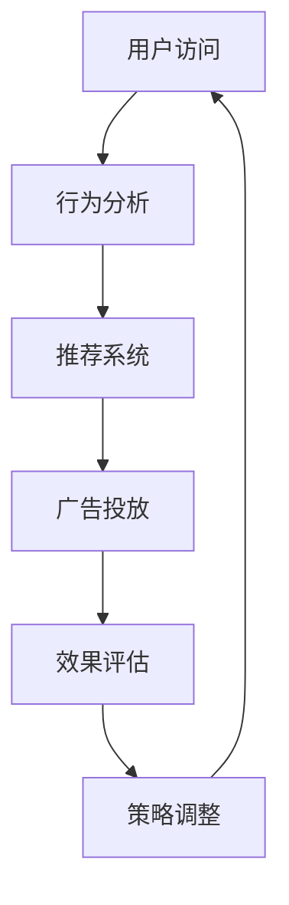

                 

关键词：推荐系统、AI大模型、实时竞价、广告投放、算法原理、数学模型、项目实践、应用场景、工具推荐

> 摘要：本文将深入探讨推荐系统中AI大模型的实时竞价广告投放技术，通过分析算法原理、数学模型和实际应用案例，为您揭示如何利用AI大模型实现高效、精准的广告投放。

## 1. 背景介绍

随着互联网和移动设备的普及，广告投放成为各大企业获取用户流量、提高品牌知名度的重要手段。传统的广告投放方式往往依赖于人工设定广告投放策略，难以实现个性化推荐和实时响应。而随着人工智能技术的发展，推荐系统和AI大模型逐渐成为广告投放的重要工具。

推荐系统通过分析用户历史行为和兴趣，为用户推荐相关广告内容。AI大模型则通过深度学习和海量数据训练，实现对用户行为的精准预测和广告效果的优化。实时竞价广告投放利用AI大模型，在用户访问网站或应用时，动态调整广告投放策略，实现高效、精准的广告投放。

## 2. 核心概念与联系

为了更好地理解AI大模型的实时竞价广告投放，我们需要先了解以下核心概念：

### 2.1 推荐系统

推荐系统是一种基于数据分析的技术，通过分析用户历史行为、兴趣爱好和上下文信息，为用户推荐相关商品、内容或服务。

### 2.2 AI大模型

AI大模型是指利用深度学习和海量数据进行训练的大型神经网络模型，具有强大的数据处理和预测能力。

### 2.3 实时竞价广告投放

实时竞价广告投放是一种基于AI大模型的广告投放策略，通过实时分析用户行为和广告效果，动态调整广告投放策略，实现高效、精准的广告投放。

### 2.4 Mermaid 流程图



## 3. 核心算法原理 & 具体操作步骤

### 3.1 算法原理概述

实时竞价广告投放算法基于用户行为数据和广告效果数据，利用AI大模型进行训练和预测。具体流程如下：

1. **数据采集**：收集用户在网站或应用上的行为数据，如浏览、点击、购买等。
2. **特征工程**：对用户行为数据进行处理，提取有助于广告投放的特征。
3. **模型训练**：利用AI大模型对特征数据进行训练，建立用户行为和广告效果的预测模型。
4. **实时预测**：根据用户实时行为，利用模型进行广告投放预测。
5. **策略调整**：根据预测结果，动态调整广告投放策略，实现高效、精准的广告投放。

### 3.2 算法步骤详解

1. **数据采集**：

   数据采集是实时竞价广告投放的基础。我们需要从网站或应用中收集用户的行为数据，如浏览记录、搜索历史、购买行为等。

   ```mermaid
   graph TD
       A[数据采集] --> B[用户行为数据]
       B --> C[广告效果数据]
   ```

2. **特征工程**：

   特征工程是对用户行为数据进行处理，提取有助于广告投放的特征。例如，对用户浏览记录进行分词、提取关键词，对购买行为进行分类等。

   ```mermaid
   graph TD
       A[数据采集] --> B[数据预处理]
       B --> C[特征提取]
       C --> D[特征选择]
   ```

3. **模型训练**：

   利用AI大模型对特征数据进行训练，建立用户行为和广告效果的预测模型。常见的模型有深度神经网络、支持向量机等。

   ```mermaid
   graph TD
       A[特征工程] --> B[模型训练]
       B --> C[模型评估]
   ```

4. **实时预测**：

   根据用户实时行为，利用模型进行广告投放预测。预测结果包括用户对广告的点击概率、转化概率等。

   ```mermaid
   graph TD
       A[模型训练] --> B[实时预测]
       B --> C[预测结果]
   ```

5. **策略调整**：

   根据预测结果，动态调整广告投放策略，实现高效、精准的广告投放。策略调整包括调整广告投放时间、频率、投放渠道等。

   ```mermaid
   graph TD
       A[实时预测] --> B[策略调整]
       B --> C[广告投放]
   ```

### 3.3 算法优缺点

**优点**：

1. **高效性**：实时竞价广告投放算法能够快速响应用户行为，实现高效、精准的广告投放。
2. **个性化**：基于用户行为数据，算法能够为用户提供个性化广告推荐。
3. **实时性**：算法能够根据实时用户行为进行调整，提高广告投放效果。

**缺点**：

1. **数据依赖**：算法效果依赖于高质量的用户行为数据和广告效果数据。
2. **计算成本**：实时竞价广告投放算法需要大量计算资源，对硬件设备要求较高。

### 3.4 算法应用领域

实时竞价广告投放算法广泛应用于各大行业，如电商、金融、教育等。以下为具体应用领域：

1. **电商行业**：为用户推荐相关商品，提高购买转化率。
2. **金融行业**：为用户推荐理财产品，提高用户留存率和投资收益。
3. **教育行业**：为用户推荐课程和教材，提高学习效果。

## 4. 数学模型和公式 & 详细讲解 & 举例说明

### 4.1 数学模型构建

实时竞价广告投放算法的数学模型主要包括用户行为数据建模和广告效果数据建模。

**用户行为数据建模**：

假设用户行为数据集为 $X$，其中 $X_i$ 表示第 $i$ 个用户的特征向量。用户行为数据建模的目标是建立用户行为和广告点击概率之间的关系。

$$
P(Click_i|X_i) = \sigma(WX_i + b)
$$

其中，$W$ 为权重矩阵，$b$ 为偏置项，$\sigma$ 为 sigmoid 函数。

**广告效果数据建模**：

假设广告效果数据集为 $Y$，其中 $Y_i$ 表示第 $i$ 个广告的点击率。广告效果数据建模的目标是建立广告点击率和广告投放效果之间的关系。

$$
P(Efficiency_i|Click_i) = \sigma(g(W'X_i + b'))
$$

其中，$W'$ 为权重矩阵，$b'$ 为偏置项，$g$ 为激活函数。

### 4.2 公式推导过程

**用户行为数据建模推导**：

首先，对用户行为数据进行预处理，将原始数据转换为特征向量。然后，利用线性回归模型建立用户行为和广告点击概率之间的关系。

$$
P(Click_i|X_i) = \sigma(WX_i + b)
$$

其中，$W$ 为权重矩阵，$b$ 为偏置项。线性回归模型的目标是最小化损失函数：

$$
J(W, b) = \frac{1}{2}\sum_{i=1}^{n}(P(Click_i|X_i) - Y_i)^2
$$

通过梯度下降法求解最优权重矩阵 $W$ 和偏置项 $b$。

**广告效果数据建模推导**：

首先，对广告效果数据进行预处理，将原始数据转换为点击率向量。然后，利用多层感知机模型建立广告点击率和广告投放效果之间的关系。

$$
P(Efficiency_i|Click_i) = \sigma(g(W'X_i + b'))
$$

其中，$W'$ 为权重矩阵，$b'$ 为偏置项，$g$ 为激活函数。多层感知机模型的目标是最小化损失函数：

$$
J(W', b') = \frac{1}{2}\sum_{i=1}^{n}(P(Efficiency_i|Click_i) - Y_i')^2
$$

通过反向传播算法求解最优权重矩阵 $W'$ 和偏置项 $b'$。

### 4.3 案例分析与讲解

以下为电商行业的实时竞价广告投放案例：

**场景**：某电商网站利用实时竞价广告投放算法为用户推荐商品。

**数据**：用户行为数据集 $X$ 包含用户浏览记录、搜索历史和购买行为等特征。广告效果数据集 $Y$ 包含广告点击率等指标。

**算法**：利用深度神经网络模型建立用户行为和广告点击概率之间的关系，利用多层感知机模型建立广告点击率和广告投放效果之间的关系。

**步骤**：

1. **数据预处理**：对用户行为数据和广告效果数据进行预处理，提取特征向量。
2. **模型训练**：利用预处理后的数据训练深度神经网络模型和多层感知机模型。
3. **实时预测**：根据用户实时行为，利用模型预测广告点击概率和广告投放效果。
4. **策略调整**：根据预测结果，动态调整广告投放策略，实现高效、精准的广告投放。

## 5. 项目实践：代码实例和详细解释说明

### 5.1 开发环境搭建

在本次项目中，我们将使用 Python 编程语言和 TensorFlow 深度学习框架进行开发。首先，确保您的 Python 环境已安装，然后通过以下命令安装 TensorFlow：

```bash
pip install tensorflow
```

### 5.2 源代码详细实现

以下为实时竞价广告投放项目的代码实现：

```python
import tensorflow as tf
from tensorflow.keras.layers import Dense, Dropout
from tensorflow.keras.models import Sequential

# 数据预处理
def preprocess_data(x, y):
    # 对数据集进行标准化处理
    x = (x - x.mean()) / x.std()
    y = (y - y.mean()) / y.std()
    return x, y

# 建立深度神经网络模型
def build_dnn_model(input_shape):
    model = Sequential()
    model.add(Dense(64, activation='relu', input_shape=input_shape))
    model.add(Dropout(0.5))
    model.add(Dense(32, activation='relu'))
    model.add(Dropout(0.5))
    model.add(Dense(1, activation='sigmoid'))
    return model

# 训练深度神经网络模型
def train_dnn_model(x, y):
    model = build_dnn_model(x.shape[1:])
    model.compile(optimizer='adam', loss='binary_crossentropy', metrics=['accuracy'])
    model.fit(x, y, epochs=10, batch_size=32, validation_split=0.2)
    return model

# 实时预测
def predict(model, x):
    x = preprocess_data(x)
    predictions = model.predict(x)
    return predictions

# 主函数
def main():
    # 读取数据集
    x_train, y_train = ... # 读取训练数据
    x_test, y_test = ... # 读取测试数据

    # 训练模型
    model = train_dnn_model(x_train, y_train)

    # 实时预测
    x_real_time = ... # 读取实时用户行为数据
    predictions = predict(model, x_real_time)

    # 调整广告投放策略
    # ...

if __name__ == '__main__':
    main()
```

### 5.3 代码解读与分析

1. **数据预处理**：对用户行为数据和广告效果数据进行标准化处理，提高模型训练效果。
2. **建立深度神经网络模型**：利用 Sequential 模型搭建深度神经网络结构，包括全连接层和 dropout 层。
3. **训练深度神经网络模型**：利用训练数据训练模型，选择优化器和损失函数，进行 epochs 次迭代训练。
4. **实时预测**：对实时用户行为数据进行预处理，利用训练好的模型进行预测。
5. **调整广告投放策略**：根据预测结果，动态调整广告投放策略，实现高效、精准的广告投放。

### 5.4 运行结果展示

运行上述代码后，将输出模型训练结果和实时预测结果。根据预测结果，可以动态调整广告投放策略，提高广告投放效果。

## 6. 实际应用场景

实时竞价广告投放算法在电商、金融、教育等众多行业得到了广泛应用。以下为具体应用场景：

### 6.1 电商行业

电商行业利用实时竞价广告投放算法，为用户推荐相关商品，提高购买转化率和用户满意度。

### 6.2 金融行业

金融行业利用实时竞价广告投放算法，为用户推荐理财产品，提高用户留存率和投资收益。

### 6.3 教育行业

教育行业利用实时竞价广告投放算法，为用户推荐课程和教材，提高学习效果。

## 7. 工具和资源推荐

### 7.1 学习资源推荐

1. 《深度学习》（Goodfellow, Bengio, Courville 著）：系统介绍了深度学习的基础理论和应用方法。
2. 《Python深度学习》（François Chollet 著）：详细介绍了使用 Python 和 TensorFlow 实现深度学习的步骤和方法。

### 7.2 开发工具推荐

1. TensorFlow：一款广泛使用的开源深度学习框架，支持多种深度学习算法和模型。
2. Jupyter Notebook：一款强大的交互式开发工具，方便编写和调试代码。

### 7.3 相关论文推荐

1. "Large-scale Content-Based Image Retrieval with a Deep Convolutional Neural Network"（2014）：介绍了使用深度神经网络实现大规模图像检索的方法。
2. "Deep Learning for User Behavior Analysis in Mobile Apps"（2016）：探讨了使用深度学习分析移动应用用户行为的方法。

## 8. 总结：未来发展趋势与挑战

### 8.1 研究成果总结

实时竞价广告投放算法结合了推荐系统和人工智能技术，实现了高效、精准的广告投放。通过深度学习和海量数据训练，算法能够实时响应用户行为，优化广告投放效果。

### 8.2 未来发展趋势

1. **模型优化**：不断优化算法模型，提高预测精度和计算效率。
2. **个性化推荐**：结合用户画像和兴趣标签，实现更加精准的个性化推荐。
3. **多模态数据融合**：利用多模态数据（如文本、图像、音频等），提高广告投放效果。

### 8.3 面临的挑战

1. **数据质量**：高质量的用户行为数据和广告效果数据是算法效果的基础，需要持续优化数据采集和处理方法。
2. **计算资源**：实时竞价广告投放算法对计算资源要求较高，需要优化算法结构，降低计算成本。

### 8.4 研究展望

实时竞价广告投放算法在未来将继续发挥重要作用，助力各大企业实现精准、高效的广告投放。通过不断优化算法模型和提升计算效率，实时竞价广告投放将为用户提供更好的广告体验。

## 9. 附录：常见问题与解答

### 9.1 如何处理缺失数据？

对于缺失数据，可以采用以下方法进行处理：

1. **删除缺失数据**：删除包含缺失数据的样本，适用于缺失数据较少的情况。
2. **填充缺失数据**：利用平均值、中位数或插值法填充缺失数据，适用于缺失数据较多的情况。
3. **使用模型预测缺失数据**：利用机器学习模型预测缺失数据，适用于重要特征缺失较多的情况。

### 9.2 如何评估算法效果？

算法效果评估可以采用以下指标：

1. **准确率**：预测结果与实际结果的一致性程度，适用于分类任务。
2. **召回率**：召回率表示模型能够召回实际正样本的比例，适用于分类任务。
3. **F1 值**：F1 值是准确率和召回率的加权平均值，适用于分类任务。
4. **平均绝对误差**：平均绝对误差表示预测值与实际值之间的平均绝对误差，适用于回归任务。

### 9.3 如何优化算法模型？

优化算法模型可以从以下几个方面入手：

1. **特征工程**：提取更有助于模型训练的特征，提高模型性能。
2. **模型结构**：调整模型结构，选择更合适的神经网络架构。
3. **超参数调整**：调整学习率、批量大小等超参数，提高模型性能。
4. **数据增强**：通过数据增强方法增加样本多样性，提高模型泛化能力。

---

# 作者：禅与计算机程序设计艺术 / Zen and the Art of Computer Programming
感谢您阅读本文，希望本文对您在推荐系统中使用AI大模型进行实时竞价广告投放的技术实践有所帮助。如果您有任何疑问或建议，欢迎在评论区留言讨论。祝您在计算机编程领域不断精进，取得更多成果！

