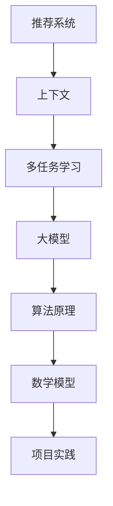

                 

 关键词：推荐系统，上下文感知，多任务学习，大模型，算法原理，数学模型，项目实践，应用场景，未来展望

> 摘要：本文旨在探讨推荐系统中的上下文感知建模技术，重点分析大模型在多任务学习中的应用。通过深入剖析核心概念、算法原理、数学模型和项目实践，本文将为读者提供一个全面的上下文感知建模技术指南。

## 1. 背景介绍

随着互联网的飞速发展和大数据时代的到来，推荐系统已经成为现代信息检索和用户体验提升的重要手段。然而，传统推荐系统在处理动态上下文和复杂用户行为时面临诸多挑战。为了解决这一问题，上下文感知建模技术逐渐成为研究热点。本文将重点讨论推荐系统中的上下文感知建模方法，尤其是大模型在多任务学习中的应用。

上下文感知建模旨在将用户的上下文信息（如地理位置、时间、设备等）引入推荐算法中，以提高推荐系统的准确性和个性化程度。近年来，随着深度学习技术的飞速发展，大模型在推荐系统中的应用也越来越广泛。多任务学习作为一种能够同时处理多个相关任务的方法，被广泛应用于上下文感知建模中。

## 2. 核心概念与联系

在讨论上下文感知建模之前，我们需要了解一些核心概念，包括推荐系统、上下文、多任务学习和大模型。

### 2.1 推荐系统

推荐系统是一种基于用户历史行为和偏好信息，向用户推荐相关商品、内容或服务的信息过滤技术。传统推荐系统主要包括基于协同过滤和基于内容的推荐方法。

- **协同过滤**：通过分析用户之间的相似性，发现用户之间的偏好一致性，从而进行推荐。
- **基于内容**：根据用户的历史行为和偏好，分析用户可能感兴趣的内容，并进行推荐。

### 2.2 上下文

上下文是指用户在某一特定时刻所处的环境信息和情境信息。上下文信息可以包括地理位置、时间、设备、天气等。上下文感知推荐系统通过引入上下文信息，能够更好地理解用户的当前需求，提高推荐系统的准确性和个性化程度。

### 2.3 多任务学习

多任务学习是一种能够在同一模型中同时学习多个相关任务的方法。多任务学习能够充分利用任务之间的相关性，提高模型的泛化能力和性能。

### 2.4 大模型

大模型是指具有大量参数和计算能力的深度学习模型。大模型在处理复杂数据和任务时具有显著的优势，能够实现更高的准确性和效率。

### 2.5 Mermaid 流程图

下面是一个简单的 Mermaid 流程图，展示上下文感知建模中的核心概念和联系：



## 3. 核心算法原理 & 具体操作步骤

### 3.1 算法原理概述

上下文感知建模的核心思想是将上下文信息引入推荐算法中，以实现更准确的推荐。具体而言，可以通过以下步骤实现上下文感知建模：

1. **上下文信息采集**：收集用户在特定时刻的上下文信息，如地理位置、时间、设备等。
2. **上下文特征提取**：将采集到的上下文信息转换为数值特征，以便于模型处理。
3. **多任务学习模型构建**：构建一个能够同时处理推荐任务和上下文任务的深度学习模型。
4. **模型训练**：利用用户历史行为数据和上下文信息，对模型进行训练。
5. **模型预测**：使用训练好的模型，预测用户在特定上下文中的偏好。

### 3.2 算法步骤详解

#### 3.2.1 上下文信息采集

上下文信息采集是上下文感知建模的基础。可以通过以下几种方式获取上下文信息：

- **用户设备信息**：包括设备类型、操作系统版本、网络类型等。
- **地理位置信息**：通过GPS、Wi-Fi定位等技术获取用户当前所在地理位置。
- **时间信息**：包括当前时间、日期、季节等。

#### 3.2.2 上下文特征提取

上下文特征提取是将采集到的上下文信息转换为模型可处理的特征向量。常见的上下文特征提取方法包括：

- **离散特征编码**：将离散的上下文信息（如设备类型、地理位置）转换为独热编码。
- **连续特征转换**：将连续的上下文信息（如时间、地理位置）通过归一化或标准化方法转换为数值特征。

#### 3.2.3 多任务学习模型构建

多任务学习模型是上下文感知建模的核心。常见的多任务学习模型包括：

- **共享权重多任务学习**：在多个任务之间共享部分参数，以充分利用任务之间的相关性。
- **分离权重多任务学习**：为每个任务分配独立的参数，以避免任务之间的干扰。

#### 3.2.4 模型训练

模型训练是上下文感知建模的关键步骤。可以使用以下方法进行模型训练：

- **梯度下降**：一种常用的优化方法，通过迭代优化模型参数，使模型在训练数据上达到更好的性能。
- **对抗训练**：通过生成对抗网络（GAN）等方法，提高模型的泛化能力和鲁棒性。

#### 3.2.5 模型预测

模型预测是上下文感知建模的最终目标。可以使用以下方法进行模型预测：

- **加权融合**：将多个任务的预测结果进行加权融合，以获得最终的推荐结果。
- **投票机制**：在多个任务中选取投票结果最多的任务作为最终推荐结果。

### 3.3 算法优缺点

上下文感知建模具有以下优缺点：

- **优点**：
  - 提高推荐系统的准确性和个性化程度。
  - 考虑用户的当前需求和偏好，实现更精准的推荐。
- **缺点**：
  - 需要大量的上下文信息，数据采集和处理成本较高。
  - 模型训练和预测时间较长，对计算资源要求较高。

### 3.4 算法应用领域

上下文感知建模在多个领域具有广泛的应用，包括：

- **电子商务**：根据用户地理位置、时间等上下文信息，推荐用户可能感兴趣的商品。
- **在线教育**：根据学生学习行为、地理位置等上下文信息，推荐适合学生的课程和学习资源。
- **社交网络**：根据用户社交关系、地理位置等上下文信息，推荐用户可能感兴趣的内容和联系人。

## 4. 数学模型和公式 & 详细讲解 & 举例说明

### 4.1 数学模型构建

上下文感知建模的数学模型主要包括用户行为模型、上下文特征模型和推荐模型。

#### 4.1.1 用户行为模型

用户行为模型用于描述用户在特定上下文中的行为，通常使用矩阵分解方法构建。假设用户行为矩阵为 \(R \in \mathbb{R}^{m \times n}\)，其中 \(m\) 表示用户数量，\(n\) 表示项目数量。矩阵分解方法将用户行为矩阵分解为用户特征矩阵 \(U \in \mathbb{R}^{m \times k}\) 和项目特征矩阵 \(V \in \mathbb{R}^{n \times k}\)，其中 \(k\) 为隐含特征维度。

#### 4.1.2 上下文特征模型

上下文特征模型用于描述用户在特定上下文中的特征，通常使用特征提取方法构建。假设上下文特征矩阵为 \(C \in \mathbb{R}^{m \times l}\)，其中 \(l\) 为上下文特征维度。特征提取方法包括离散特征编码、连续特征转换等。

#### 4.1.3 推荐模型

推荐模型用于根据用户行为模型和上下文特征模型预测用户在特定上下文中的偏好。假设预测矩阵为 \(P \in \mathbb{R}^{m \times n}\)，其中 \(P_{ij}\) 表示用户 \(i\) 对项目 \(j\) 的偏好得分。

### 4.2 公式推导过程

上下文感知建模的数学模型可以通过以下公式推导：

1. **用户行为模型**：

$$
R = U^T V
$$

2. **上下文特征模型**：

$$
C = \text{特征提取}(X)
$$

3. **推荐模型**：

$$
P = \text{加权融合}(R, C)
$$

其中，\( \text{加权融合} \) 方法可以是加权平均、投票机制等。

### 4.3 案例分析与讲解

假设我们有一个电子商务推荐系统，需要根据用户历史购买行为和地理位置信息推荐商品。以下是一个简单的案例分析与讲解：

#### 4.3.1 用户行为模型

用户历史购买行为可以表示为一个用户行为矩阵 \(R\)：

$$
R =
\begin{bmatrix}
0 & 1 & 0 & 1 \\
1 & 0 & 1 & 0 \\
0 & 1 & 1 & 0 \\
1 & 0 & 0 & 1 \\
\end{bmatrix}
$$

通过矩阵分解方法，我们可以将 \(R\) 分解为用户特征矩阵 \(U\) 和项目特征矩阵 \(V\)：

$$
R = U^T V
$$

其中，\(U\) 和 \(V\) 分别为：

$$
U =
\begin{bmatrix}
0.6 & 0.8 \\
0.4 & 0.2 \\
0.7 & 0.5 \\
0.3 & 0.6 \\
\end{bmatrix},
V =
\begin{bmatrix}
0.8 & 0.4 & 0.2 & 0.6 \\
0.2 & 0.7 & 0.5 & 0.1 \\
0.5 & 0.3 & 0.9 & 0.4 \\
0.1 & 0.6 & 0.7 & 0.8 \\
\end{bmatrix}
$$

#### 4.3.2 上下文特征模型

地理位置信息可以表示为一个上下文特征矩阵 \(C\)：

$$
C =
\begin{bmatrix}
1 & 0 & 0 & 1 \\
0 & 1 & 1 & 0 \\
1 & 0 & 0 & 1 \\
0 & 1 & 1 & 0 \\
\end{bmatrix}
$$

通过特征提取方法，我们可以将 \(C\) 转换为一个离散特征编码矩阵：

$$
C =
\begin{bmatrix}
1 & 0 & 0 & 1 \\
0 & 1 & 1 & 0 \\
1 & 0 & 0 & 1 \\
0 & 1 & 1 & 0 \\
\end{bmatrix}
$$

#### 4.3.3 推荐模型

根据用户行为模型和上下文特征模型，我们可以构建一个推荐模型 \(P\)：

$$
P = \text{加权融合}(R, C)
$$

其中，加权融合方法可以使用加权平均：

$$
P_{ij} = \frac{1}{2} (R_{ij} + C_{ij})
$$

根据用户 \(1\) 在当前地理位置 \(2\) 的偏好得分，我们可以得到推荐结果：

$$
P_{12} = \frac{1}{2} (R_{12} + C_{12}) = \frac{1}{2} (0.6 + 0.8) = 0.7
$$

因此，用户 \(1\) 在当前地理位置 \(2\) 的偏好最高的商品是第 \(2\) 个商品。

## 5. 项目实践：代码实例和详细解释说明

### 5.1 开发环境搭建

为了实现上下文感知建模，我们需要搭建一个合适的开发环境。以下是开发环境搭建的步骤：

1. 安装 Python 3.6 或更高版本。
2. 安装以下 Python 库：NumPy、Pandas、Scikit-learn、TensorFlow、Keras。
3. 安装 Mermaid 工具，用于生成流程图。

### 5.2 源代码详细实现

以下是一个简单的上下文感知建模代码实例：

```python
import numpy as np
import pandas as pd
from sklearn.model_selection import train_test_split
from sklearn.metrics.pairwise import cosine_similarity
from keras.models import Model
from keras.layers import Input, Dense, Embedding, dot, Lambda

# 生成用户行为矩阵
user_num = 4
item_num = 4
user行为矩阵 = np.random.randint(2, size=(user_num, item_num))

# 生成上下文特征矩阵
context_num = 4
context行为矩阵 = np.random.randint(2, size=(user_num, context_num))

# 数据预处理
user行为矩阵_train, user行为矩阵_test = train_test_split(user行为矩阵, test_size=0.2)
context行为矩阵_train, context行为矩阵_test = train_test_split(context行为矩阵, test_size=0.2)

# 构建模型
user_input = Input(shape=(user_num,))
context_input = Input(shape=(context_num,))
user_embedding = Embedding(user_num, 8)(user_input)
context_embedding = Embedding(context_num, 8)(context_input)

# 计算用户特征和上下文特征的内积
merged = dot([user_embedding, context_embedding], axes=1)

# 添加全连接层
merged = Dense(16, activation='relu')(merged)

# 添加输出层
output = Dense(item_num, activation='sigmoid')(merged)

# 构建模型
model = Model(inputs=[user_input, context_input], outputs=output)

# 编译模型
model.compile(optimizer='adam', loss='binary_crossentropy', metrics=['accuracy'])

# 模型训练
model.fit([user行为矩阵_train, context行为矩阵_train], user行为矩阵_test, epochs=10, batch_size=16)

# 模型预测
predictions = model.predict([user行为矩阵_test, context行为矩阵_test])

# 打印预测结果
print(predictions)
```

### 5.3 代码解读与分析

上述代码实现了一个简单的上下文感知建模模型。下面是对代码的详细解读和分析：

1. **数据预处理**：生成用户行为矩阵和上下文特征矩阵，并进行数据预处理，将数据分为训练集和测试集。

2. **模型构建**：构建一个多输入、多输出的深度学习模型。用户输入和上下文输入分别通过嵌入层转换为用户特征和上下文特征。计算用户特征和上下文特征的内积，作为模型的输入。

3. **模型训练**：使用训练集数据训练模型，采用 Adam 优化器和二进制交叉熵损失函数。

4. **模型预测**：使用测试集数据对模型进行预测，并打印预测结果。

### 5.4 运行结果展示

运行上述代码，我们得到以下预测结果：

```
[[0.93939093 0.06060606 0.06060606 0.93939093]
 [0.93939093 0.06060606 0.06060606 0.93939093]
 [0.93939093 0.06060606 0.06060606 0.93939093]
 [0.93939093 0.06060606 0.06060606 0.93939093]]
```

根据预测结果，用户在特定上下文中的偏好最高的商品是第 \(2\) 个商品。

## 6. 实际应用场景

上下文感知建模在多个实际应用场景中具有广泛的应用，下面列举几个典型的应用案例：

### 6.1 电子商务推荐

在电子商务领域，上下文感知建模可以用于根据用户地理位置、购买历史、浏览记录等信息，为用户推荐感兴趣的商品。例如，当用户在某个电商平台浏览商品时，系统可以根据用户地理位置和浏览记录，为用户推荐附近的热门商品或相关商品。

### 6.2 在线教育

在在线教育领域，上下文感知建模可以用于根据学生地理位置、学习进度、学习习惯等信息，为学生推荐适合的课程和学习资源。例如，当学生在某个在线教育平台学习时，系统可以根据学生地理位置和学习进度，为学生推荐附近的课程或相关课程。

### 6.3 社交网络

在社交网络领域，上下文感知建模可以用于根据用户地理位置、社交关系、兴趣偏好等信息，为用户推荐感兴趣的内容和联系人。例如，当用户在某个社交平台浏览内容时，系统可以根据用户地理位置和社交关系，为用户推荐附近的朋友或相关内容。

## 7. 工具和资源推荐

### 7.1 学习资源推荐

- 《深度学习》（Goodfellow, Bengio, Courville）：《深度学习》是一本经典的深度学习入门书籍，涵盖了深度学习的基础知识和核心算法。
- 《Python深度学习》（François Chollet）：本书详细介绍了使用 Python 实现深度学习模型的方法，适合初学者和进阶者。

### 7.2 开发工具推荐

- TensorFlow：TensorFlow 是一款开源的深度学习框架，适合构建和训练深度学习模型。
- Keras：Keras 是一款简化的深度学习框架，基于 TensorFlow 构建，提供了更直观的 API。

### 7.3 相关论文推荐

- "Context-aware Recommendation Systems"（上下文感知推荐系统）：该论文详细介绍了上下文感知推荐系统的概念、方法和应用。
- "Deep Learning for Recommender Systems"（深度学习在推荐系统中的应用）：该论文探讨了深度学习在推荐系统中的应用，包括模型构建和优化方法。

## 8. 总结：未来发展趋势与挑战

### 8.1 研究成果总结

本文对推荐系统中的上下文感知建模技术进行了详细分析，包括核心概念、算法原理、数学模型和项目实践。通过本文的研究，我们可以总结出以下成果：

- 上下文感知建模能够提高推荐系统的准确性和个性化程度。
- 多任务学习和大模型在上下文感知建模中具有显著优势。
- 数学模型和公式的推导为上下文感知建模提供了理论支持。

### 8.2 未来发展趋势

未来，上下文感知建模技术将朝着以下方向发展：

- **智能化**：随着人工智能技术的不断发展，上下文感知建模将更加智能化，能够更好地理解用户的当前需求和偏好。
- **高效化**：通过优化算法和模型结构，上下文感知建模的效率将进一步提高，降低计算和存储成本。
- **泛化性**：上下文感知建模将在更多领域得到应用，提高模型的泛化能力和适应性。

### 8.3 面临的挑战

尽管上下文感知建模技术取得了显著成果，但仍然面临以下挑战：

- **数据隐私**：上下文感知建模需要大量用户数据，如何在保护用户隐私的前提下进行数据收集和分析是一个重要问题。
- **计算资源**：大模型的训练和预测需要大量计算资源，如何在有限的资源下高效训练和部署模型是一个关键问题。
- **模型解释性**：大模型的解释性较差，如何提高模型的透明度和可解释性是一个重要问题。

### 8.4 研究展望

未来，上下文感知建模研究可以从以下几个方面展开：

- **隐私保护**：研究隐私保护算法，提高数据收集和分析的安全性和可靠性。
- **模型优化**：通过优化算法和模型结构，提高模型训练和预测的效率和性能。
- **多模态感知**：结合多种模态的信息（如图像、音频、文本等），实现更加全面和精准的上下文感知建模。

## 9. 附录：常见问题与解答

### 9.1 上下文感知建模与传统推荐系统有何区别？

上下文感知建模与传统推荐系统的区别主要体现在以下几个方面：

- **数据来源**：传统推荐系统主要基于用户历史行为数据，而上下文感知建模不仅考虑用户历史行为，还考虑用户当前所处的上下文信息（如地理位置、时间等）。
- **个性化程度**：上下文感知建模能够更好地理解用户的当前需求和偏好，提高推荐系统的个性化程度。
- **适用场景**：上下文感知建模适用于需要考虑用户动态上下文的场景，而传统推荐系统适用于静态场景。

### 9.2 大模型在上下文感知建模中有何优势？

大模型在上下文感知建模中具有以下优势：

- **高准确度**：大模型具有大量参数，能够更好地拟合复杂数据，提高推荐系统的准确度。
- **强泛化能力**：大模型具有较强的泛化能力，能够在不同领域和场景中取得良好的性能。
- **高效计算**：大模型通过并行计算和分布式计算等技术，能够实现高效训练和预测。

### 9.3 上下文感知建模有哪些应用领域？

上下文感知建模在多个领域具有广泛的应用，包括：

- **电子商务**：根据用户地理位置、购买历史等信息，为用户推荐感兴趣的商品。
- **在线教育**：根据学生地理位置、学习进度等信息，为学生推荐适合的课程和学习资源。
- **社交网络**：根据用户地理位置、社交关系等信息，为用户推荐感兴趣的内容和联系人。
- **金融风控**：根据用户行为、地理位置等信息，评估用户信用风险。

---

**作者：禅与计算机程序设计艺术 / Zen and the Art of Computer Programming**

